# CBPay — Documentación de la API

Pagos y cobros fiat en toda Latinoamérica, transferencias internas,
USDT on-chain, tarjetas y verificación KYC/KYB — una sola API, un
solo saldo.

> Documento generado automáticamente desde la documentación oficial
> (https://docs.cbpayapp.com). No editar a mano: se regenera con
> `python docs-mintlify/tools/build_cbpay_md.py`.
>
> **Documento actualizado:** 2026-07-15 05:23 UTC · versión `c8adee48d7e2`

**Datos clave**

| Dato | Valor |
|---|---|
| Versión de la documentación | v1.69 (15 de julio de 2026) |
| URL base | `https://api.qbank.cl/platform` |
| Autenticación | Header `Authorization: Bearer <token>` (o `X-API-Key`) |
| Moneda del saldo | USDT, 6 decimales, siempre como string |
| API Reference interactiva | https://docs.cbpayapp.com |

## Índice

- **Comenzar**
  - [Introducción](#introduccion)
  - [Inicio rápido](#inicio-rapido)
  - [Autenticación y cuenta](#autenticacion-y-cuenta)
  - [Login social (Google, Apple, Microsoft, Meta)](#login-social-google-apple-microsoft-meta)
  - [Ambientes y pruebas](#ambientes-y-pruebas)
- **Conceptos**
  - [Modelo de dinero](#modelo-de-dinero)
  - [Comisiones](#comisiones)
  - [Idempotencia](#idempotencia)
  - [Personas y empresas](#personas-y-empresas)
  - [Servicios habilitados](#servicios-habilitados)
  - [Estados y ciclo de vida](#estados-y-ciclo-de-vida)
  - [Movimientos y conciliación](#movimientos-y-conciliacion)
- **Flujos de integración**
  - [Flujos de integración](#flujos-de-integracion)
- **Productos**
  - [Payouts](#payouts)
  - [Payins](#payins)
  - [Transferencias internas](#transferencias-internas)
  - [Swaps](#swaps)
  - [Contactos](#contactos)
  - [Perfil y seguridad](#perfil-y-seguridad)
  - [Crypto: wallets, depósitos y retiros](#crypto-wallets-depositos-y-retiros)
  - [Wallets segregadas](#wallets-segregadas)
  - [Tarjetas: virtuales y físicas](#tarjetas-virtuales-y-fisicas)
  - [Banking](#banking)
  - [Verificación KYC y KYB](#verificacion-kyc-y-kyb)
  - [AML screening](#aml-screening)
  - [Screening de wallets](#screening-de-wallets)
  - [Cartola (estado de cuenta)](#cartola-estado-de-cuenta)
  - [Comprobantes](#comprobantes)
  - [Resumen de tu cuenta (analytics)](#resumen-de-tu-cuenta-analytics)
- **Integración**
  - [Seguridad y 2FA (OTP)](#seguridad-y-2fa-otp)
  - [Webhooks](#webhooks)
  - [Errores](#errores)
  - [Preguntas frecuentes](#preguntas-frecuentes)
- **Recursos**
  - [Postman](#postman)
  - [Servidor MCP](#servidor-mcp)
  - [Novedades](#novedades)


# Comenzar


## Introducción

*Qué es CBPay y qué puedes construir con la API*

CBPay es una plataforma de pagos multi-moneda para Latinoamérica. Cada
cuenta mantiene **cuatro saldos virtuales independientes** — `USDT` (la
moneda operativa), `USDC`, `BTC` y `GOLD` (gramos de oro) — y opera sobre
ellos:

- **Payouts fiat** — Dispersa dinero a cuentas bancarias locales en Chile, Perú, México, Venezuela, Bolivia, Brasil, Paraguay y Ecuador, debitado de tu saldo USDT.
- **Payins fiat** — Cobra en moneda local (QR, transferencias, página de pago y cobro pull) y recibe el abono automáticamente en USDT.
- **Transferencias internas** — Mueve saldo a cualquier otra cuenta CBPay, al instante y sin comisión.
- **Crypto on-chain** — Fondea con USDT por TRON o Ethereum y retira on-chain a cualquier dirección.
- **Tarjetas** — Emite tarjetas virtuales y físicas que gastan directo de cualquier saldo de la cuenta (USDT, USDC, BTC o GOLD), en tiempo real.
- **Banking** — Cuentas bancarias reales a tu nombre: recibe, mantén y envía dinero por rieles internacionales (SEPA, SWIFT, ACH).
- **KYC/KYB** — Verificación de personas y empresas con screening AML, rescreening y monitoreo continuo.
- **Cartola** — Estado de cuenta completo por período en JSON, PDF o Excel, con cuadratura contable garantizada.
Todos los eventos llegan a tus **webhooks firmados**
([guía](#webhooks)).

### Cómo funciona

La operación fiat gira alrededor del saldo USDT (los saldos USDC, BTC y
GOLD se mueven con transferencias internas, depósitos on-chain y abonos del
operador) — el dinero entra por un lado, se convierte, y sale por el otro:

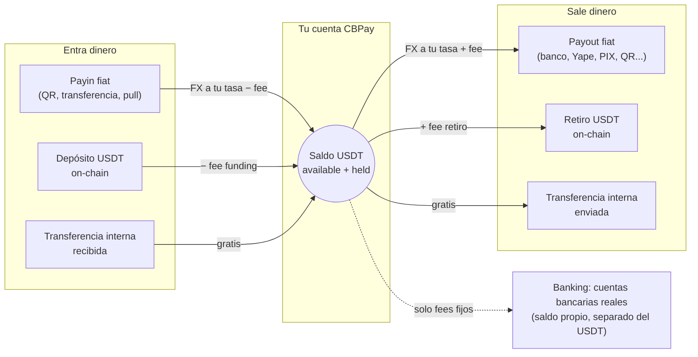

1. CBPay te da acceso: registro con email/contraseña
   o una API key directa.
2. Fondeas tu cuenta: con un payin fiat o un depósito USDT on-chain.
3. Operas: payouts, transferencias, retiros — todo se debita y acredita
   sobre tu saldo USDT con conversión FX al momento.
4. Te enteras de todo: cada movimiento queda en un historial inmutable
   (`GET /v1/movements`) y los eventos llegan a tus webhooks.

### URL base

```
https://api.qbank.cl/platform
```

Todas las rutas de esta documentación son relativas a esa URL base.

> **Nota**
Los montos son siempre **strings decimales** (ej. `"10.500000"`), nunca
números flotantes. Cada moneda usa su precisión: 6 decimales para
`USDT`/`USDC`/`GOLD` y 8 para `BTC`.
### Siguientes pasos

### Crea tu cuenta y token

Sigue el [inicio rápido](#inicio-rapido) para registrarte y hacer tu
primera llamada.
### Entiende el modelo de dinero

Lee [modelo de dinero](#modelo-de-dinero) y
[comisiones](#comisiones).
### Integra tu primer producto

Empieza por [payouts](#payouts) o [payins](#payins).


## Inicio rápido

*De cero a tu primer payout — con el ciclo cerrado por webhook — en seis pasos*

Este es el camino completo de una primera integración: registro → saldo →
tasas → payout → webhook. Al terminar habrás cerrado el ciclo entero:

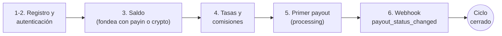

Antes de empezar, los datos que vas a necesitar en todos lados:

| Dato | Valor |
|---|---|
| **URL base** | `https://api.qbank.cl/platform` |
| **Autenticación** | Header `Authorization: Bearer <token>` (o `X-API-Key`) |
| **Slug de organización** | `cbpay` (para registro y login) |
| **Monedas del saldo** | 4 saldos independientes: USDT (operativa), USDC, BTC y GOLD — montos siempre como string (`"52.618258"`) |
| **Ambiente** | Producción directa — no hay sandbox; prueba con montos pequeños |

> **Nota**
Si CBPay ya te creó la cuenta y te entregó una API key `pk_...`, salta
directo al paso 3. ¿Dudas típicas? Están respondidas en las
[preguntas frecuentes](#preguntas-frecuentes).
### Regístrate

Crea tu cuenta (persona o empresa — mismo endpoint, cambia `type`):

```bash Persona
curl -X POST https://api.qbank.cl/platform/v1/auth/register \
  -H "Content-Type: application/json" \
  -d '{
    "org": "cbpay",
    "type": "person",
    "email": "ana@ejemplo.com",
    "password": "una-clave-segura",
    "display_name": "Ana Pérez",
    "country": "CL"
  }'
```

```bash Empresa
curl -X POST https://api.qbank.cl/platform/v1/auth/register \
  -H "Content-Type: application/json" \
  -d '{
    "org": "cbpay",
    "type": "company",
    "email": "legal@andina.cl",
    "password": "una-clave-segura",
    "display_name": "Comercial Andina SpA",
    "tax_id": "76.543.210-8",
    "country": "CL"
  }'
```

La respuesta incluye tu `access_token` (sesión de 24 horas):

```json
{
  "account": { "id": "…", "type": "person", "kyc_status": "none", "…": "…" },
  "access_token": "eyJhbGciOiJIUzI1NiIs…",
  "expires_at": "2026-07-08T00:00:00Z"
}
```

### Autentícate en cada llamada

Envía el token en el header `Authorization`:

```bash
curl https://api.qbank.cl/platform/v1/me \
  -H "Authorization: Bearer <access_token>"
```

Para integraciones servidor-a-servidor, emite una **API key permanente** con
`POST /v1/api-keys` — se muestra una sola vez. Más detalles en
[autenticación](#autenticacion-y-cuenta).

### Consulta tu saldo

```bash
curl https://api.qbank.cl/platform/v1/balances \
  -H "Authorization: Bearer <token>"
```

```json
{
  "account_id": "…",
  "balances": [
    { "asset": "USDT", "available": "0.000000", "held": "0.000000" },
    { "asset": "USDC", "available": "0.000000", "held": "0.000000" },
    { "asset": "BTC", "available": "0.00000000", "held": "0.00000000" },
    { "asset": "GOLD", "available": "0.000000", "held": "0.000000" }
  ]
}
```

Para operar necesitas fondos: crea un [payin](#payins) o deposita
USDT on-chain con [crypto funding](#crypto-wallets-depositos-y-retiros).

### Revisa tasas y comisiones

Antes de un payout, consulta la tasa FX vigente y tus comisiones efectivas:

```bash
curl https://api.qbank.cl/platform/v1/rates \
  -H "Authorization: Bearer <token>"
```

```json
{
  "base": "USD",
  "rates": {
    "chile": { "currency": "CLP", "rate": "950.25" },
    "mexico": { "currency": "MXN", "rate": "17.50" },
    "bolivia": { "currency": "BOB", "rate": "6.91" }
  },
  "fees": [
    { "service": "payout", "country": "CL", "percent": "0", "fixed": "0.50" }
  ],
  "updated_at": "2026-07-07T12:00:00Z"
}
```

Las tasas ya incluyen tu margen FX, así que puedes estimar el costo antes
de crear: `usdt_amount ≈ monto_local / rate` (redondeo hacia arriba) y
`total_debit = usdt_amount + fijo`.

### Crea tu primer payout

```bash
curl -X POST https://api.qbank.cl/platform/v1/payouts \
  -H "Authorization: Bearer <token>" \
  -H "Content-Type: application/json" \
  -d '{
    "country": "CL",
    "currency": "CLP",
    "method": "bank_transfer",
    "amount": "50000",
    "beneficiary": {
      "name": "Juan Soto",
      "rut": "12345678-9",
      "bank_code": "012",
      "account_type": "checking",
      "account_number": "001122334455"
    },
    "description": "Pago proveedor",
    "idempotency_key": "mi-pago-0001"
  }'
```

Respuesta `202 Accepted` — el payout queda `processing` y el estado final
llega por [webhook](#webhooks) (`payout_status_changed`):

```json
{
  "payout_id": "…",
  "status": "processing",
  "local_amount": "50000",
  "fx_rate": "950.25",
  "usdt_amount": "52.618258",
  "fee": "0.500000",
  "total_debit": "53.118258"
}
```

> **Importante**
Los campos de `beneficiary` dependen del país y método. Consulta
`GET /v1/payouts/methods` y `GET /v1/payouts/banks?country=CL` para conocer
los requisitos de cada corredor — la referencia completa está en
los [ejemplos por país de la guía de payouts](#payouts).
### Cierra el ciclo: suscríbete al webhook

El estado final del payout llega por push. Suscribe tu endpoint HTTPS (en
desarrollo usa un [túnel](#ambientes-y-pruebas)):

```bash
curl -X POST https://api.qbank.cl/platform/v1/webhooks/subscriptions \
  -H "Authorization: Bearer <token>" \
  -H "Content-Type: application/json" \
  -d '{
    "event_type": "payout_status_changed",
    "callback_url": "https://tuapp.com/webhooks/cbpay",
    "secret": "un-secreto-largo-y-aleatorio"
  }'
```

Minutos después recibirás el cierre del payout del paso 5:

```json
{
  "payout_id": "…",
  "status": "completed",
  "local_amount": "50000",
  "usdt_amount": "52.618258",
  "total_debit": "53.118258",
  "status_code": ""
}
```

Verifica **siempre** la firma HMAC de la entrega
(`X-Webhook-Signature`) — receta con código en [webhooks](#webhooks).
Si el payout hubiera fallado, `status: failed` llega con el reembolso
completo ya aplicado.

### ¿Y ahora?

- **Flujos de integración** — Fondear, dispersar, cobrar, conciliar y banking — los cinco flujos E2E con diagramas.
- **Modelo de dinero** — Débitos, holds, reembolsos y el ledger inmutable.
- **Ambiente y pruebas** — Cómo probar seguro y el checklist de go-live.
- **Preguntas frecuentes** — Las dudas reales de integradores, respondidas — y la API Reference completa vive en su propia pestaña, con playground interactivo.


## Autenticación y cuenta

*Sesiones JWT, API keys, tu perfil de cuenta y los miembros de una empresa*

Todas las llamadas (salvo registro y login) requieren una credencial en el
header `Authorization`:

```
Authorization: Bearer <token>
```

También se acepta `X-API-Key: <token>` como header alternativo.

### Tipos de credencial

#### Sesión JWT (personas con login)

Se obtiene con `POST /v1/auth/register` o `POST /v1/auth/login` y dura
**24 horas**. Pensada para apps con usuarios que inician sesión. Junto al
`access_token` recibes un **refresh token** para renovar la sesión sin pedir
la contraseña de nuevo — ver [renovación de sesión](#renovacion-de-sesion-refresh-tokens).

```bash
curl -X POST https://api.qbank.cl/platform/v1/auth/login \
  -H "Content-Type: application/json" \
  -d '{ "org": "cbpay", "email": "ana@ejemplo.com", "password": "…" }'
```

```json
{
  "access_token": "eyJ…",
  "expires_at": "2026-07-14T15:20:49Z",
  "refresh_token": "rt_6a1e6c22-….XXXXXXXX…",
  "refresh_expires_at": "2026-08-12T15:20:49Z",
  "account_id": "…",
  "role": "owner"
}
```

Las cuentas empresa pueden tener varios **miembros** con roles — ver
[miembros de una empresa](#miembros-de-una-empresa) más abajo.

> **Nota**
Si la política de la cuenta exige **OTP en el login**, la respuesta trae
`otp_required: true` con un `pending_token` en vez de la sesión: el segundo
paso se completa en `POST /v1/auth/login/otp` con el código recibido por
SMS/WhatsApp. Flujo completo en [seguridad y 2FA](#seguridad-y-2fa-otp).
> **Nota**
También puedes ofrecer **registro e inicio de sesión con Google, Apple,
Microsoft o Facebook** (sin contraseña) — ver [login social](#login-social-google-apple-microsoft-meta).
#### API key (servidor a servidor)

Formato `pk_<key_id>.<secret>`. No expira y no depende de una sesión.
Se emite con:

```bash
curl -X POST https://api.qbank.cl/platform/v1/api-keys \
  -H "Authorization: Bearer <token-de-sesion>" \
  -H "Content-Type: application/json" \
  -d '{ "label": "backend-produccion" }'
```

```json
{
  "api_key_id": "…",
  "key_id": "a1b2c3d4e5f60718",
  "token": "pk_a1b2c3d4e5f60718.XXXXXXXX…",
  "note": "store this token now; it cannot be retrieved again"
}
```

> **Importante**
El token en claro se muestra **una sola vez**. En el servidor solo se guarda
un hash — si lo pierdes, emite una key nueva.
### Renovación de sesión (refresh tokens)

El `access_token` dura 24 horas; el `refresh_token` (`rt_…`) permite obtener
un par nuevo **sin re-login** durante 30 días, renovables en cada uso hasta
un máximo de 90 días desde el login original. Es de **un solo uso**: cada
canje devuelve un `refresh_token` nuevo y el anterior queda invalidado
(rotación).

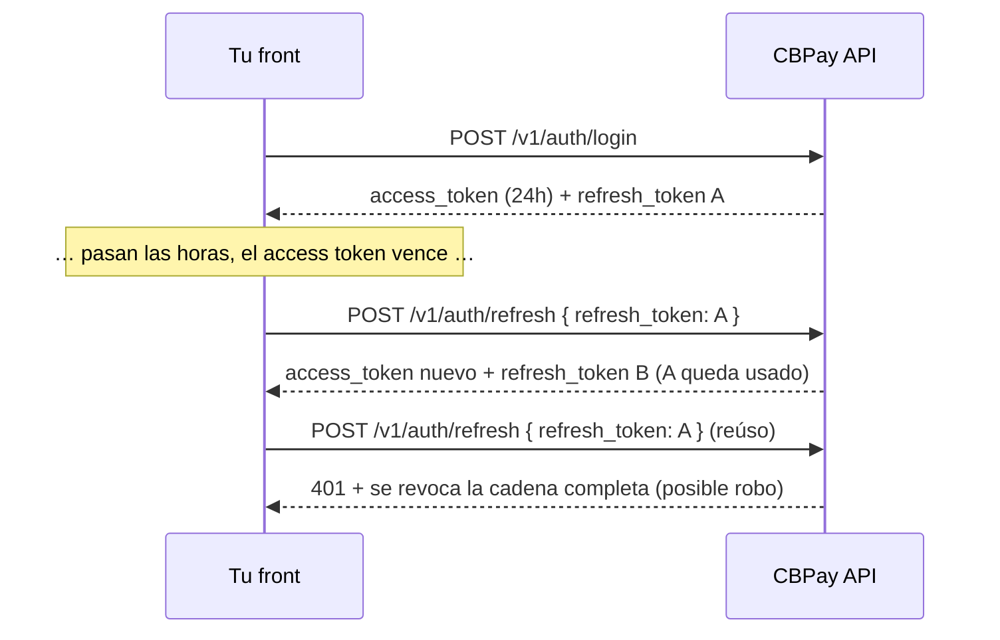

```bash
curl -X POST https://api.qbank.cl/platform/v1/auth/refresh \
  -H "Content-Type: application/json" \
  -d '{ "refresh_token": "rt_6a1e6c22-….XXXXXXXX…" }'
```

```json
{
  "access_token": "eyJ…",
  "expires_at": "2026-07-14T15:20:50Z",
  "refresh_token": "rt_9f2b1c30-….YYYYYYYY…",
  "refresh_expires_at": "2026-08-12T15:20:50Z",
  "account_id": "…",
  "role": "owner"
}
```

Reglas de seguridad que tu front debe conocer:

- **Rotación estricta**: al canjear, el access token anterior de ese
  dispositivo queda revocado al instante (solo hay un access token vivo por
  cadena). Reemplaza siempre AMBOS tokens con los de la respuesta.
- **Reúso = robo**: si un refresh token ya canjeado vuelve a presentarse, la
  cadena completa del dispositivo se revoca (tokens y sesiones) y queda un
  evento `refresh_token_reuse` en `GET /v1/me/security/events`. El usuario
  debe iniciar sesión de nuevo.
- **Muere con la sesión**: cerrar sesión (`DELETE /v1/me/sessions/{id}`),
  `POST /v1/me/sessions/revoke-all` o un cambio/reset de contraseña
  invalidan también los refresh tokens asociados.
- Cualquier rechazo responde `401 invalid_refresh_token` — ante ese error,
  manda al usuario al login.
- Guarda el refresh token en almacenamiento seguro (Keychain/Keystore en
  móvil; en web, preferir memoria + re-login o cookie httpOnly de tu
  backend). Las API keys `pk_` no usan refresh: no expiran.

#### ¿Cada cuánto debo refrescar?
Cuando el access token esté por vencer (usa `expires_at`) o al recibir un
`401` en una llamada normal. Evita refrescar en paralelo desde varios
lugares: si dos canjes del mismo token llegan a la vez, uno gana y el otro
recibe `401` sin castigo — pero un canje de un token YA rotado revoca la
cadena.
#### ¿Qué pasa a los 90 días?
El tope absoluto de la cadena es 90 días desde el login original: aunque
refresques a diario, al llegar al límite el refresh devuelve `401` y el
usuario debe autenticarse de nuevo (con su contraseña, passkey o login
social).
#### ¿El refresh funciona con API keys?
No aplica: las API keys `pk_` no expiran ni tienen sesión. El refresh es
solo para sesiones JWT de usuarios humanos.
### Nivel de acceso

Tu credencial (JWT de sesión o API key) opera **tu propia cuenta**: saldos,
payouts, payins, transferencias, crypto, KYC/KYB y webhooks propios. Si un
endpoint responde `403 account_required` o `403 org_admin_required`, esa
operación corresponde a otro nivel de credencial — contacta al equipo de
CBPay.

### Tu perfil de cuenta

```bash
# Leer el perfil (incluye kyc_status y type)
curl https://api.qbank.cl/platform/v1/me \
  -H "Authorization: Bearer <token>"

# Actualizar campos del perfil (todos opcionales)
curl -X PATCH https://api.qbank.cl/platform/v1/me \
  -H "Authorization: Bearer <token>" \
  -H "Content-Type: application/json" \
  -d '{
    "display_name": "Comercial Andina SpA",
    "tax_id": "76.543.210-8",
    "phone": "+56 9 1234 5678",
    "country": "CL"
  }'
```

```json
{
  "id": "9b1deb4d-3b7d-4bad-9bdd-2b0d7b3dcb6d",
  "type": "company",
  "display_name": "Comercial Andina SpA",
  "email": "legal@andina.cl",
  "tax_id": "76.543.210-8",
  "phone": "+56 9 1234 5678",
  "country": "CL",
  "status": "active",
  "kyc_status": "approved",
  "created_at": "2026-06-01T12:00:00Z"
}
```

`PATCH /v1/me` acepta `display_name`, `tax_id`, `phone` y `country` (envía
solo los que cambian). El `email`, `status` y `kyc_status` no se
autogestionan: los resuelve el administrador.

### Miembros de una empresa

Las cuentas **empresa** pueden tener varios usuarios con login propio y
distinto nivel de permiso:

| Rol | Permisos |
|---|---|
| `owner` | Todo: opera, administra miembros y credenciales |
| `operator` | Opera el día a día (default al crear un miembro) |
| `viewer` | Solo lectura |

```bash
# Agregar un miembro (solo cuentas company)
curl -X POST https://api.qbank.cl/platform/v1/members \
  -H "Authorization: Bearer <token>" \
  -H "Content-Type: application/json" \
  -d '{
    "email": "finanzas@andina.cl",
    "password": "una-clave-segura",
    "role": "viewer"
  }'

# Listar miembros
curl "https://api.qbank.cl/platform/v1/members?page_size=50" \
  -H "Authorization: Bearer <token>"
```

```json
{
  "page": 1,
  "page_size": 50,
  "members": [
    { "id": "…", "email": "legal@andina.cl", "role": "owner", "status": "active" },
    { "id": "…", "email": "finanzas@andina.cl", "role": "viewer", "status": "active" }
  ]
}
```

En una cuenta persona, `POST /v1/members` responde `403 company_only`.

### Buenas prácticas

- Guarda las API keys en un gestor de secretos; nunca en el código ni en el
  navegador.
- Usa una key por ambiente/servicio (`label` descriptivo) para poder rotar
  sin downtime.

### Rotación sin downtime

Emite la key nueva con `POST /v1/api-keys` (label nuevo).
### Despliega

Actualiza tu servicio para usar la key nueva.
### Retira la antigua

Pide al equipo de CBPay revocar la key anterior una vez que el tráfico
migró.
- Las sesiones JWT son para front-ends; para procesos automatizados usa
  siempre API keys.


## Login social (Google, Apple, Microsoft, Meta)

*Registro e inicio de sesión con Google, Apple, Microsoft y Facebook, sin contraseñas*

Tus usuarios pueden registrarse e iniciar sesión con **Google, Apple,
Microsoft o Facebook** — sin crear ni recordar contraseñas. CBPay usa el
modelo **token exchange**: el botón "Continuar con…" vive en tu front, el
usuario aprueba en el proveedor, tu front recibe una credencial y te la pasa
a la API; CBPay la **verifica criptográficamente** y te devuelve la sesión.

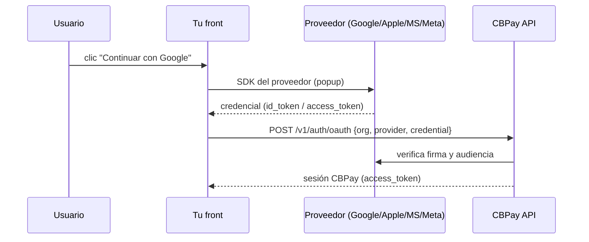

> **Nota**
El login social lo habilita tu operador (organización) y **cada
organización usa sus propias apps** de Google/Apple/Microsoft/Meta, así el
usuario ve TU marca en la pantalla de consentimiento. Consulta qué
proveedores están activos con `GET /v1/auth/oauth/providers`.
### 1. Descubre los proveedores habilitados

Para pintar los botones correctos, tu front pregunta qué proveedores están
activos y con qué `client_id`:

```bash
curl "https://api.qbank.cl/platform/v1/auth/oauth/providers?org=cbpay"
```

```json
{
  "providers": [
    { "provider": "google", "client_id": "1234567890-abc.apps.googleusercontent.com" },
    { "provider": "apple", "client_id": "com.tuempresa.cbpay.web" }
  ]
}
```

Es un endpoint público (no requiere token): el `client_id` no es secreto.

### 2. Obtén la credencial en tu front

Cada proveedor entrega una credencial con su propio SDK. Ejemplos mínimos:

#### Google

Con [Google Identity Services](https://developers.google.com/identity/gsi/web):

```html
<script src="https://accounts.google.com/gsi/client" async></script>
<div id="g_id_onload"
     data-client_id="TU_CLIENT_ID"
     data-callback="onGoogle"></div>
<div class="g_id_signin"></div>
<script>
function onGoogle(response) {
  // response.credential es el id_token (JWT) que envías a CBPay
  fetch("https://api.qbank.cl/platform/v1/auth/oauth", {
    method: "POST",
    headers: { "Content-Type": "application/json" },
    body: JSON.stringify({
      org: "cbpay", provider: "google", credential: response.credential
    })
  });
}
</script>
```

#### Apple

Con [Sign in with Apple JS](https://developer.apple.com/documentation/sign_in_with_apple/sign_in_with_apple_js):
el objeto de respuesta trae `authorization.id_token`, que es lo que envías
como `credential`.

```js
const data = await AppleID.auth.signIn();
await fetch("https://api.qbank.cl/platform/v1/auth/oauth", {
  method: "POST",
  headers: { "Content-Type": "application/json" },
  body: JSON.stringify({
    org: "cbpay", provider: "apple", credential: data.authorization.id_token
  })
});
```

Apple entrega el nombre del usuario **solo la primera vez**; guárdalo en tu
front si lo necesitas. El email puede ser un alias de relay privado
(`...@privaterelay.appleid.com`) — es válido y estable.

#### Microsoft

Con [MSAL.js](https://learn.microsoft.com/entra/identity-platform/msal-overview):
tras `loginPopup`, el `idToken` del resultado es la credencial.

```js
const result = await msalInstance.loginPopup({ scopes: ["openid", "email", "profile"] });
await fetch("https://api.qbank.cl/platform/v1/auth/oauth", {
  method: "POST",
  headers: { "Content-Type": "application/json" },
  body: JSON.stringify({
    org: "cbpay", provider: "microsoft", credential: result.idToken
  })
});
```

#### Meta (Facebook)

Con el [Facebook Login SDK](https://developers.facebook.com/docs/facebook-login/web):
Facebook no es OIDC, así que envías el **access_token** de la sesión.

```js
FB.login(function(response) {
  if (response.authResponse) {
    fetch("https://api.qbank.cl/platform/v1/auth/oauth", {
      method: "POST",
      headers: { "Content-Type": "application/json" },
      body: JSON.stringify({
        org: "cbpay", provider: "facebook",
        credential: response.authResponse.accessToken
      })
    });
  }
}, { scope: "email" });
```

### 3. Intercambia la credencial por una sesión

```bash
curl -X POST https://api.qbank.cl/platform/v1/auth/oauth \
  -H "Content-Type: application/json" \
  -d '{
    "org": "cbpay",
    "provider": "google",
    "credential": "eyJhbGciOiJSUzI1Ni…",
    "type": "person"
  }'
```

**Usuario nuevo** → se crea la cuenta y devuelve `201`:

```json
{
  "account": { "id": "9b1deb4d-…", "type": "person", "email": "ana@gmail.com", "display_name": "Ana" },
  "access_token": "eyJhbGciOiJIUzI1Ni…",
  "expires_at": "2026-07-09T21:00:00Z",
  "created": true
}
```

**Usuario que ya existe** → inicia sesión y devuelve `200` con
`access_token`, `account_id` y `role` (igual que el login por contraseña).

El campo `type` (`person` | `company`, default `person`) solo se usa al
crear la cuenta; se ignora si ya existe.

#### Cómo se decide crear vs. entrar

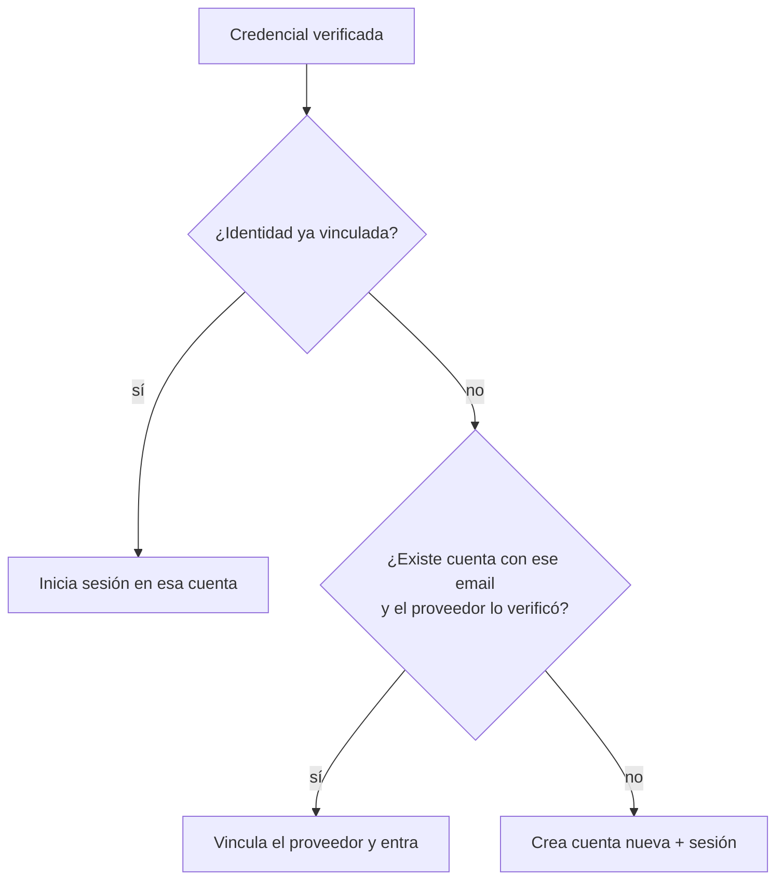

### 4. Login social y 2FA

Si la cuenta tiene **OTP activo en el login**
([seguridad y 2FA](#seguridad-y-2fa-otp)), el login social respeta ese segundo
paso: en vez de la sesión, `POST /v1/auth/oauth` devuelve
`otp_required: true` + `pending_token`, y completas con
`POST /v1/auth/login/otp` igual que en el login por contraseña.

### 5. Vincular y desvincular proveedores

Un usuario en sesión puede administrar sus métodos de acceso:

```bash
# Ver proveedores vinculados
curl https://api.qbank.cl/platform/v1/me/identities \
  -H "Authorization: Bearer <token>"

# Vincular otro proveedor (con una credencial fresca de ese proveedor)
curl -X POST https://api.qbank.cl/platform/v1/me/identities \
  -H "Authorization: Bearer <token>" \
  -H "Content-Type: application/json" \
  -d '{ "provider": "apple", "credential": "eyJhbGci…" }'

# Desvincular
curl -X DELETE https://api.qbank.cl/platform/v1/me/identities/apple \
  -H "Authorization: Bearer <token>"
```

No puedes desvincular tu **único** método de acceso: si la cuenta no tiene
contraseña y ese proveedor es el único vinculado, la API responde
`409 last_login_method` (primero define una contraseña o vincula otro
proveedor).

### Errores

| HTTP | `error` | Qué significa |
|---|---|---|
| 400 | `invalid_provider` | Proveedor fuera de `google/apple/microsoft/facebook` |
| 400 | `provider_not_configured` | Tu organización no tiene ese proveedor habilitado |
| 401 | `invalid_credential` | La credencial es inválida, expiró o es de otra app |
| 409 | `email_conflict` | Ya existe una cuenta con ese email; entra con tu método actual y vincula el proveedor desde la sesión |
| 409 | `identity_taken` | Ese proveedor ya está vinculado a otra cuenta |
| 409 | `last_login_method` | No puedes desvincular tu único método de acceso |

### FAQ

#### ¿Necesito manejar redirects u OAuth callbacks?
    No. El flujo de consentimiento ocurre en tu front con el SDK del
    proveedor; a CBPay solo le mandas la credencial resultante. No hay
    páginas de callback ni estado en el servidor.
#### ¿Un usuario puede tener contraseña Y login social?
    Sí. Puede registrarse con email/contraseña y luego vincular Google, o
    al revés. Todos los métodos apuntan a la misma cuenta mientras el email
    coincida y esté verificado.
#### ¿Qué pasa si el proveedor no entrega email verificado?
    No se vincula automáticamente por email (evita que alguien reclame el
    email de otro). Se crea una cuenta independiente ligada a esa identidad;
    el usuario puede añadir email/contraseña después.
#### ¿La credencial del proveedor sirve como token de CBPay?
    No. La credencial del proveedor solo se usa una vez para verificarte;
    todas las llamadas siguientes usan el `access_token` de CBPay.


## Ambientes y pruebas

*Modo test y modo live: base URL de pruebas, keys pk_test_, valores mágicos para forzar cada resultado, webhooks en local y checklist de go-live*

CBPay opera sobre **dos ambientes**: **test** (sandbox, dinero simulado) y
**live** (producción, dinero real). Están completamente aislados — URLs
separadas, API keys separadas, datos separados — y exponen exactamente la
misma API: una integración construida contra test funciona en live
cambiando la base URL y la key.

| | Test (sandbox) | Live (producción) |
|---|---|---|
| Base URL | `https://cryptobank.qbank.cl/platform` | `https://api.qbank.cl/platform` |
| API keys | `pk_test_...` | `pk_...` |
| Dinero | Simulado (nada real se mueve) | **Real e irreversible** |
| Proveedores | Simulador interno — siempre disponible, determinista | Rieles bancarios reales |
| Header de respuesta | `CBPay-Environment: test` | `CBPay-Environment: live` |

> **Nota**
Las keys jamás cruzan de ambiente: una key `pk_test_` es rechazada por
live y una key `pk_` de live es rechazada por test. No hay ningún flag que
cambiar — el ambiente lo define hacia dónde apuntas tus requests.
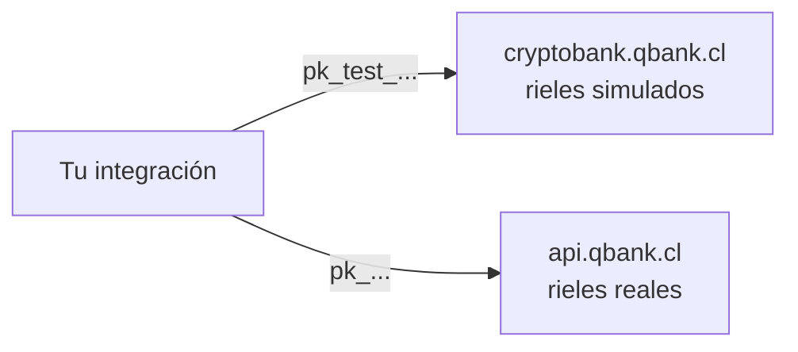

### Cómo se comporta el ambiente de test

El ambiente de test es **100% autocontenido**: todos los corredores
(payouts, payins, transferencias, crypto, banking, tarjetas, verificación
de identidad) los atiende un simulador interno, así que nunca depende de
que un tercero esté disponible. Las operaciones se resuelven de forma
**determinista**:

- Toda operación que crees se acepta y llega a `completed` a los pocos
  segundos (default ~10s), disparando los mismos webhooks que live.
- Los **valores mágicos** fuerzan cada resultado alternativo, para que
  pruebes tu manejo de errores sin adivinar.

#### Valores mágicos

| Producto | Valor | Resultado |
|---|---|---|
| Payouts | Monto terminado en `.99` (ej. `100.99`) | Falla tras el delay (`failed`, saldo reembolsado) |
| Payouts | Monto terminado en `.77` | Queda `processing` para siempre (prueba tu manejo de timeouts) |
| Payouts | Beneficiario con nombre que contenga `REJECT` | Rechazo inmediato |
| Payins (QR / página de pago) | Monto terminado en `.99` | El cobro expira sin pagarse |
| Payins (QR / página de pago) | Monto terminado en `.77` | Queda `pending` para siempre |
| Payins (QR / página de pago) | Cualquier otro monto | Se paga solo tras el delay y acredita tu saldo |
| Collect (cobros pull) | OTP `000000` | Aprueba el cobro; cualquier otro OTP falla |
| Códigos de login / 2FA | `000000` | Válido en todos los canales (SMS, WhatsApp, email) — no se envía ningún mensaje real |
| Verificación de identidad (KYC/KYB) | Nombre o external id que contenga `REJECT` | La verificación termina `rejected` |
| Verificación de identidad (KYC/KYB) | Cualquier otro | Se auto-aprueba tras el delay (los documentos siempre pasan el OCR) |
| Screening AML | Nombre que contenga `SANCTION` | Screening con coincidencias, riesgo `prohibited` |
| Screening AML | Nombre que contenga `PEP` | Screening con coincidencias, riesgo `high` |
| Dirección de retiro crypto | Terminada en `SANC` | Bloqueada por el gate de sanciones |
| Dirección de retiro crypto | Terminada en `HIGH` / `MED` | Evaluada como riesgo alto / medio |
| Retiros crypto | Cualquier dirección (no mágica) | Confirma con un tx id `SIMTX...` tras el delay |

> **Tip**
Los **depósitos** crypto en test se acreditan desde el dashboard (o por tu
administrador de plataforma) — no hay chain real desde dónde enviar. Los
retiros, saldos, holds y webhooks se comportan exactamente igual que live.
#### Qué difiere de live

- Ningún dinero, tarjeta, email ni SMS real sale jamás del ambiente de test.
- **Las cuentas nacen verificadas**: toda cuenta nueva de test parte con
  `kyc_status: approved`, así puedes ejercitar todos los productos de
  inmediato — sin gate de onboarding. En live las cuentas nacen sin
  verificar y deben completar su KYC/KYB antes de que salga dinero.
- **Las cuentas nacen pobladas**: toda cuenta nueva de test parte con
  ~6 meses de historia demo realista de todos los productos (payouts,
  payins, transfers, crypto, swaps, tarjetas, banking, contactos...), con
  saldos, cartola conciliada y analytics listos para explorar — puedes
  construir dashboards y reportes antes de crear una sola operación.
- Los catálogos de bancos son ficticios (`Simulated National Bank`, ...).
- Las tasas FX son reales (misma fuente que live), así los montos se ven realistas.
- Los datos de test son totalmente independientes de live: nada se copia
  desde producción. Trata el dataset de test como desechable.

### Modo test desde el dashboard

El **switch test/live** del dashboard mueve tu sesión entre ambientes con
un click — sin registro aparte ni segundo login. Si tu cuenta aún no existe
en test, se crea automáticamente la primera vez que cambias — nace
verificada y poblada con historia demo, como toda cuenta de test. Las API
keys se administran por ambiente: crea tus keys `pk_test_` estando en modo
test.

### Probar webhooks en desarrollo local

Las callback URLs deben ser **HTTPS públicas**: `localhost`, IPs privadas y
dominios `.local` se rechazan al crear la suscripción. Para desarrollar en
tu máquina usa un túnel HTTPS:

```bash Cloudflare Tunnel (gratis)
# Instala cloudflared y expone tu puerto local
cloudflared tunnel --url http://localhost:3000
# → https://<random>.trycloudflare.com  ← úsala como callback_url
```

```bash ngrok
ngrok http 3000
# → https://<random>.ngrok-free.app  ← úsala como callback_url
```

Luego crea la suscripción con esa URL pública (nota la base URL de test):

```bash
curl -X POST https://cryptobank.qbank.cl/platform/v1/webhooks/subscriptions \
  -H "X-API-Key: pk_test_..." \
  -H "Content-Type: application/json" \
  -d '{
    "event_type": "payin_credited",
    "callback_url": "https://tu-tunel.trycloudflare.com/webhooks/cbpay",
    "secret": "un-secreto-largo-y-aleatorio"
  }'
```

> **Tip**
Las entregas fallidas reintentan hasta **5 veces con backoff incremental**,
así que si tu túnel se cae unos minutos no pierdes el evento. Verifica
siempre la firma HMAC — receta completa en
[webhooks](#webhooks).
### Ejercitar cada flujo en test

| Producto | Cómo probarlo |
|---|---|
| Payout | Créalo con cualquier beneficiario; completa en segundos. Usa los montos mágicos para forzar fallas |
| Payin | Crea un cobro QR o página de pago; se paga solo tras el delay y acredita tu saldo |
| Transferencia | Crea una segunda cuenta de test y transfiere entre ambas (gratis) |
| Crypto | Acredita un depósito de test desde el dashboard y retira a cualquier dirección |
| Identidad (KYC/KYB) | Tu propia cuenta ya nace aprobada. Para probar el flujo de verificación, corre verificaciones KYC/KYB de terceros — se auto-aprueban en segundos (`REJECT` en el nombre fuerza el rechazo) |
| AML | Screenea a `John SANCTION` y `Maria PEP` para ejercitar tu manejo de coincidencias |
| Tarjetas | Emite una tarjeta y simula compras desde el dashboard |
| 2FA | Actívalo y usa el código `000000` en todas partes |

### Checklist de go-live

Antes de apuntar tu integración al ambiente live:

- [ ] Cambia la base URL a `https://api.qbank.cl/platform` y la key a tu `pk_...` de live (emitida en modo live).
- [ ] Las API keys viven en un secrets manager (nunca en el frontend ni en el repo).
- [ ] Toda operación de dinero envía un `idempotency_key` derivado de TU id interno (no un UUID aleatorio por intento).
- [ ] Ante timeout o `5xx` **no reintentas con una key nueva**: repite con la misma key o consulta el estado con el `GET`.
- [ ] Verificas la firma HMAC de cada webhook y respondes `2xx` rápido (procesa async).
- [ ] Manejas los estados no finales (`pending`, `processing`) sin asumir éxito — en live la liquidación tarda más que los 10 segundos simulados.
- [ ] Re-creaste tus suscripciones de webhook en live (las de test no se traspasan).
- [ ] Consultas `GET /v1/services` para mostrar solo productos habilitados — ver [servicios](#servicios-habilitados).
- [ ] Concilias a diario con `GET /v1/movements` o la [cartola](#cartola-estado-de-cuenta).
- [ ] Tienes un canal con el equipo CBPay para depósitos `unassigned` o incidentes.

> **Importante**
En **live** toda operación es real e irreversible una vez completada. Un
payout `completed` ya está en la cuenta del beneficiario; la única vía de
reversa es fuera de la API (contactar al equipo CBPay).
#### ¿El modo test cuesta algo?
    No. Las comisiones se cobran contra saldos simulados, así que puedes
    ejercitar toda la lógica de pricing sin gastar dinero real.
#### ¿Puedo usar mi key de live en test (o al revés)?
    No. Cada ambiente acepta solo sus propias keys (`pk_test_` en test,
    `pk_` en live). Una key del otro ambiente devuelve `401`.
#### ¿Cómo sé qué ambiente me respondió?
    Toda respuesta lleva el header `CBPay-Environment` (`test` o `live`),
    y `GET /healthz` devuelve `livemode`.
#### ¿De dónde sale la historia demo de mi cuenta de test?
    Se genera al crear la cuenta: ~6 meses de operaciones demo
    deterministas y contablemente consistentes de todos los productos. No
    es data real ni se copia desde producción — los ambientes no comparten
    nada. Trata los datos de test como desechables.
#### ¿Los webhooks se disparan en test?
    Sí — exactamente los mismos eventos, firmados con el secreto de tu
    suscripción de test. Apúntalos a tu túnel de desarrollo.


# Conceptos


## Modelo de dinero

*Saldos virtuales por moneda, conversión FX, holds y el ledger inmutable*

### Cuatro saldos virtuales independientes

Cada cuenta mantiene **cuatro saldos virtuales, uno por moneda**. Son
totalmente independientes entre sí: nunca se mezclan ni se convierten
automáticamente.

| Moneda | Qué es | Decimales | Cómo se fondea |
|---|---|---|---|
| `USDT` | Stablecoin USD — **la moneda operativa** | 6 | Payins fiat, depósitos on-chain (TRON/Ethereum), transferencias |
| `USDC` | Stablecoin USD | 6 | Depósitos on-chain (Ethereum), transferencias |
| `BTC` | Bitcoin | 8 (satoshis) | Abonos del operador y transferencias internas |
| `GOLD` | **Gramos de oro fino** con respaldo en custodio | 6 | Abonos del operador y transferencias internas |

`GET /v1/balances` devuelve siempre los cuatro (con ceros si no has operado
esa moneda), como **strings decimales**:

```json
{
  "account_id": "…",
  "balances": [
    { "asset": "USDT", "available": "125.430000", "held": "10.000000" },
    { "asset": "USDC", "available": "50.000000", "held": "0.000000" },
    { "asset": "BTC", "available": "0.00060000", "held": "0.00000000" },
    { "asset": "GOLD", "available": "12.500000", "held": "0.000000" }
  ]
}
```

> **Nota**
Internamente cada monto se almacena como entero en la unidad mínima de su
moneda (micro-USDT, satoshis, micro-gramos) y se calcula con aritmética
racional exacta. Nunca hay floats ni errores de redondeo acumulados.
**USDT es la moneda operativa**: los precios de payouts, payins fiat y
comisiones de servicios se cotizan siempre en USDT. Pero el **pago** puede
salir de cualquiera de los cuatro saldos — ver
[Elige desde qué saldo pagas](#elige-desde-que-saldo-pagas). Los payins
siempre acreditan al saldo USDT; los otros saldos se fondean con
[transferencias internas](#transferencias-internas) (siempre entre saldos
de la misma moneda), depósitos on-chain (USDC) o abonos de tu operador
(BTC y GOLD).

### Elige desde qué saldo pagas

Los **payouts** y las **comisiones de servicios** (KYC, creación de
wallets, banking) pueden debitarse desde cualquiera de tus cuatro saldos.
El pipeline de pricing no cambia: la operación se cotiza en USDT como
siempre, y al final el total se traduce al asset elegido con el **precio
efectivo de settlement** del momento.

- **Predeterminado por cuenta**: `PUT /v1/settlement` con
  `{"default_settlement_asset": "BTC"}`. Desde ahí, todo payout y toda
  comisión de servicio sale del saldo BTC (si alcanza; no hay cascadas a
  otros saldos).
- **Override por operación**: envía `settlement_asset` en
  `POST /v1/payouts` (o en el confirm de QR) para pagar esa operación
  puntual desde otro saldo, sin tocar el predeterminado.

```bash
# Definir BTC como saldo de pago predeterminado
curl -X PUT "https://api.qbank.cl/platform/v1/settlement" \
  -H "Authorization: Bearer <token>" -H "Content-Type: application/json" \
  -d '{"default_settlement_asset": "BTC"}'
```

Reglas del settlement multi-asset:

| Regla | Detalle |
|---|---|
| Precio de ejecución | BTC y GOLD usan un feed on-chain de ejecución (no el precio de referencia). Si el feed está viejo o no disponible, la operación devuelve `503 pricing_unavailable` — nunca se ejecuta con un precio dudoso. |
| Débito, hold y reembolso | Los tres viven en el asset elegido. Si el payout falla, se reembolsa el `settlement_amount` **exacto** — jamás se re-cotiza. |
| Idempotencia | El replay con la misma llave devuelve el monto original; el precio no se recalcula. |
| Límite por operación | Los assets volátiles (BTC/GOLD) tienen un límite por operación (equivalente USDT, visible en `GET /v1/settlement`); si lo superas: `422 settlement_limit_exceeded`. |
| Límite diario por cuenta | Los assets volátiles también tienen un tope de volumen en 24 h móviles (`volatile_daily_limit_usdt` en `GET /v1/settlement`); al superarlo: `422 settlement_daily_limit_exceeded`. Paga en USDT/USDC o reintenta más tarde. |
| USDT | Sigue siendo el camino por defecto y no cambia en nada para quien no toca esta configuración. |

El bloque `settlement` de `GET /v1/rates` muestra el precio efectivo por
asset (spread incluido) para estimar antes de operar, y la respuesta del
payout registra `settlement_asset`, `settlement_amount` y
`settlement_rate` para auditoría.

### `available` y `held`

Cada saldo tiene sus dos contadores:

| Campo | Significado |
|---|---|
| `available` | Saldo disponible para operar |
| `held` | Reservado por operaciones en vuelo (payouts y retiros pendientes) |

Cuando creas un payout o retiro, el débito (`monto + comisión`) sale de
`available` y queda en `held` hasta que la operación llega a estado final:

- **`completed`** → el hold se consume; el dinero salió.
- **`failed`** → se reembolsa el débito completo (monto + comisión) a
  `available`.

### Conversión FX (fiat ↔ USDT)

Las operaciones fiat se convierten a USDT con **las tasas de tu cuenta** al
momento de ejecutar (las mismas que devuelve `GET /v1/rates`, base USD):
`rate` para payouts y `payin_rate` para payins. La conversión redondea
**hacia arriba** en los débitos y **hacia abajo** en los abonos, con una
diferencia máxima de 1 micro-USDT.

Ejemplo de un payout de 50.000 CLP con tasa 950.25:

```
usdt_amount = ceil(50000 / 950.25 × 10^6) / 10^6 = 52.618258 USDT
total_debit = usdt_amount + fee
```

Ejemplo de un payin de 50.000 CLP con `payin_rate` 955.10:

```
usdt_gross    = floor(50000 / 955.10 × 10^6) / 10^6 = 52.350539 USDT
usdt_credited = usdt_gross − fee
```

La tasa usada queda registrada en el objeto (`fx_rate`) para auditoría.

### Precios de referencia y de settlement

`GET /v1/rates` incluye un bloque `asset_prices` con el **precio USD de
referencia** de cada moneda (BTC por unidad, GOLD por gramo; USDT y USDC
valen 1 por convención), para valorizar tus saldos en pantalla, y un bloque
`settlement` con el **precio efectivo** al que se valoraría tu saldo si
pagas una operación desde ese asset (spread incluido):

```json
{
  "asset_prices": {
    "USDT": { "currency": "USD", "unit": "usdt", "price": "1" },
    "USDC": { "currency": "USD", "unit": "usdc", "price": "1" },
    "BTC": { "currency": "USD", "unit": "btc", "price": "109853.24",
             "updated_at": "2026-07-07T11:59:41Z",
             "settlement_grade": true },
    "GOLD": { "currency": "USD", "unit": "gram", "price": "107.5341",
              "updated_at": "2026-07-07T09:12:05Z",
              "settlement_grade": true }
  },
  "settlement": {
    "default_asset": "USDT",
    "assets": [
      { "asset": "USDT", "available": true, "settlement_rate": "1" },
      { "asset": "USDC", "available": true, "settlement_rate": "0.99900000" },
      { "asset": "BTC", "available": true, "settlement_rate": "109029.34070000" },
      { "asset": "GOLD", "available": true, "settlement_rate": "106.99642950" }
    ]
  }
}
```

`settlement_grade: true` indica que el precio está lo bastante fresco para
ejecutar operaciones; si baja a `false`, los pagos desde ese asset
responden `503 pricing_unavailable` hasta que el precio vuelva.

### Ledger inmutable

Cada movimiento genera una entrada inmutable con saldo resultante
(`balance_after`) **en la moneda del movimiento**. Tu historial completo
está en `GET /v1/movements` (filtra por moneda con `?asset=`):

| `type` | Qué representa |
|---|---|
| `payin_credit` | Abono de un cobro fiat |
| `payout_debit` / `payout_refund` | Débito de payout / reembolso si falló |
| `transfer_in` / `transfer_out` | Transferencia interna recibida / enviada |
| `funding` | Depósito on-chain acreditado (USDT o USDC, cada uno en su saldo) |
| `withdrawal_debit` / `withdrawal_refund` | Retiro on-chain / reembolso si falló |
| `compliance_fee` / `compliance_refund` | Cargo por servicio KYC/KYB / reembolso |
| `wallet_creation_fee` / `wallet_creation_refund` | Cargo por creación de wallet / reembolso |
| `adjustment` | Ajuste manual de CBPay (auditado) |

```bash
curl "https://api.qbank.cl/platform/v1/movements?type=payout_debit&from=2026-07-01&to=2026-07-07&page_size=20" \
  -H "Authorization: Bearer <token>"

# Solo los movimientos del saldo GOLD
curl "https://api.qbank.cl/platform/v1/movements?asset=GOLD&from=2026-07-01&to=2026-07-07" \
  -H "Authorization: Bearer <token>"
```

Todos los listados (`/v1/movements`, `/v1/payouts`, `/v1/payins`,
`/v1/crypto/transactions`, `/v1/banking/operations`) aceptan paginación
(`page`, `page_size` hasta 200) y filtros de fecha `from`/`to`
(YYYY-MM-DD, UTC, inclusive).

### Estados de operación

Payouts y retiros crypto siguen el mismo ciclo:

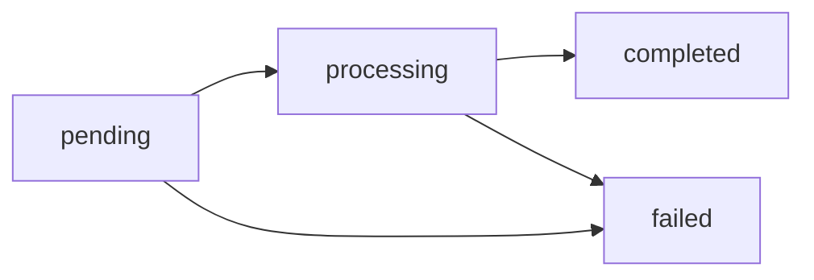

Los estados finales (`completed`/`failed`) llegan por
[webhook](#webhooks); no es necesario hacer polling.


## Comisiones

*Cómo se cobra cada servicio y dónde ver tus condiciones*

Las comisiones las configura CBPay por **servicio, país y activo**.
Si no hay nada configurado para una combinación, la comisión es **0**.

### Cómo se cobran los payouts y payins

El pricing FX está en **tu tipo de cambio**: las tasas que ves en
`GET /v1/rates` son tus tasas, y son exactamente las que se usan al
ejecutar — sin porcentajes aparte. Cada país trae las dos puntas:

- `rate` — la tasa de tus **payouts** (dispersiones). Si dispersas el
  equivalente a 100 USDT, se debitan **100 USDT + el fijo** (si tu cuenta
  lo tiene configurado).
- `payin_rate` — la tasa de tus **payins** (cobros/depósitos fiat). El
  abono es el monto local convertido a esa tasa, **menos el fijo** (si tu
  cuenta lo tiene configurado).

```
payout:  usdt_amount   = monto_local / rate
         total_debit   = usdt_amount + fixed_amount
payin:   usdt_gross    = monto_local / payin_rate
         usdt_credited = usdt_gross − fixed_amount
```

Lo que recibe el beneficiario (payout) o lo que se te abona (payin) depende
de las tasas de tu cuenta para ese país. Cotizado = cobrado, siempre.

### Servicios con comisión fija u porcentual

| Servicio | Cómo se cobra | Cuándo |
|---|---|---|
| `payout` | Fijo por operación (el pricing FX ya está en tu tasa) | Al crear el payout (incluido en `total_debit`) |
| `payin` | Fijo por operación (el pricing FX ya está en tu `payin_rate`) | Al acreditar (recibes `usdt_gross − fee`) |
| `funding` | `%` sobre el depósito + fijo | Al acreditar el depósito on-chain |
| `withdrawal` | `%` sobre el retiro + fijo | Al crear el retiro (incluido en `total_debit`) |
| `wallet_creation` | Fijo por wallet | Al crear cada wallet (personas: 1 por red; empresas: ilimitadas). Consultar wallets existentes es siempre gratis |
| `wallet_import` | Fijo por importación | Al importar una wallet externa a una [wallet segregada](#wallets-segregadas) (`POST /v1/segregated-wallets/import`) |
| `wallet_export` | Fijo por exportación | Al exportar la llave privada de una wallet segregada (`POST /v1/segregated-wallets/{id}/export`) |
| `wallet_send` | Fijo por envío | Al enviar on-chain desde una wallet segregada (`POST /v1/segregated-wallets/{id}/sends`); el gas de red lo pone el cliente |
| `compliance_person` | Fijo por llamada | Al screenear una persona por AML (`POST /v1/aml/screenings`) |
| `compliance_company` | Fijo por llamada | Al screenear una empresa por AML |
| `compliance_rescreen` | Fijo por llamada | Al re-ejecutar un screening AML |
| `compliance_monitoring` | Fijo por activación | Al activar monitoreo AML continuo (desactivar es gratis) |
| `kyc_verification` | Fijo por verificación | Al crear un link o submission KYC de un tercero ([verificación](#verificacion-kyc-y-kyb)); tu propio onboarding es gratis |
| `kyb_verification` | Fijo por verificación | Al crear un link o submission KYB de un tercero |
| `address_screening` | Fijo por scan | Al evaluar el riesgo de una dirección blockchain ([screening de wallets](#screening-de-wallets)); la protección automática de retiros/depósitos es gratis |
| `banking_customer` | Fijo por perfil | Al crear tu perfil bancario ([banking](#banking)) |
| `banking_account` | Fijo por cuenta | Al abrir cada cuenta bancaria |
| `banking_operation` | Fijo por pago | Al enviar cada pago bancario (cotizar con `prepare` es gratis) |
| `card_creation_virtual` | Fijo por tarjeta | Al emitir una tarjeta virtual ([tarjetas](#tarjetas-virtuales-y-fisicas)) |
| `card_creation_physical` | Fijo por tarjeta | Al emitir una tarjeta física |
| `card_monthly` | Fijo mensual | Mensualidad por tarjeta activa (sin saldo, la tarjeta se congela — sin deuda) |
| `card_cancellation` | Fijo por tarjeta | Al cancelar una tarjeta |

Para los servicios con `%`, la fórmula es
`fee = ceil(monto × percent / 100) + fixed_amount` (redondeo hacia arriba al
micro-USDT).

> **Nota**
Los cargos fijos standalone (compliance, verificación KYC/KYB, creación de
wallets y banking) se reembolsan automáticamente si la operación falla
aguas arriba (`compliance_refund` / `verification_fee_refund` /
`wallet_creation_refund` / `wallet_service_refund` / `banking_fee_refund`).
### Transferencias internas: siempre gratis

Las transferencias entre cuentas CBPay (`POST /v1/transfers`) **no tienen
comisión**, sin importar la combinación: persona↔persona, persona↔empresa o
empresa↔empresa. El dinero se mueve dentro del ecosistema.

### Tu tipo de cambio

`GET /v1/rates` devuelve **el tipo de cambio propio de tu cuenta** en cada
país — las mismas tasas con las que se ejecutan tus operaciones, sin
sorpresas: `rate` para payouts y `payin_rate` para payins
(`monto_local / tasa = USDT`).

### Consulta tus condiciones

`GET /v1/rates` devuelve, junto a tus tasas, la configuración de comisiones
vigente para tu cuenta:

```json
{
  "base": "USD",
  "rates": { "chile": { "currency": "CLP", "rate": "950.25", "payin_rate": "955.10" } },
  "asset_prices": {
    "USDT": { "currency": "USD", "unit": "usdt", "price": "1" },
    "USDC": { "currency": "USD", "unit": "usdc", "price": "1" },
    "BTC": { "currency": "USD", "unit": "btc", "price": "109853.24" },
    "GOLD": { "currency": "USD", "unit": "gram", "price": "107.5341" }
  },
  "fees": [
    {
      "service": "payout",
      "country": "CL",
      "asset": "USDT",
      "percent": "0",
      "fixed_amount": "0.30"
    }
  ]
}
```

`asset_prices` es el precio USD **de referencia** de cada saldo virtual
(para valorizarlos en pantalla) — no implica conversión ni spread. La
respuesta incluye además un bloque `settlement` con el **precio efectivo**
por asset si pagas operaciones desde un saldo distinto de USDT
([modelo de dinero](#modelo-de-dinero)):
ese precio ya incluye el margen de conversión, así que lo que ves es lo
que se aplica.

La comisión cobrada queda siempre explícita en la respuesta de cada
operación (campo `fee`) y en el ledger.

### Ejemplo completo

Payout equivalente a 100 USDT con `fixed_amount: "0.30"`:

```
usdt_amount = 100 USDT           (monto_local / rate)
fee         = 0.30 USDT          (fijo)
total_debit = 100.30 USDT
```

El beneficiario recibe el monto local completo que indicaste; a ti se te
debita el equivalente a tu tasa más el fijo.

Payin equivalente a 100 USDT con `fixed_amount: "0.30"`:

```
usdt_gross    = 100 USDT         (monto_local / payin_rate)
fee           = 0.30 USDT        (fijo)
usdt_credited = 99.70 USDT
```

El pagador paga el monto local exacto que indicaste; a ti se te abona el
equivalente a tu `payin_rate` menos el fijo.


## Idempotencia

*Reintenta con seguridad sin duplicar operaciones*

Toda operación que mueve dinero exige una **clave de idempotencia**. La
tabla completa:

| Endpoint | Clave | Por qué |
|---|---|---|
| `POST /v1/payouts` | **Obligatoria** | Debita tu saldo y dispersa |
| `POST /v1/payouts/qr/confirm` | **Obligatoria** | Debita y paga el QR (el `scan` es gratis y no la necesita) |
| `POST /v1/payins/collect` | **Obligatoria** | Ejecuta un débito real contra el pagador |
| `POST /v1/transfers` | **Obligatoria** | Mueve saldo entre cuentas |
| `POST /v1/crypto/withdrawals` | **Obligatoria** | Debita y transmite on-chain |
| `POST /v1/banking/operations` | **Obligatoria** | Envía un pago bancario (el `prepare` es gratis y no la necesita) |
| `POST /v1/cards` | **Obligatoria** | Puede cobrar el fee de emisión |
| `POST /v1/payins` con `method: "fintoc"` | Opcional, **recomendada** | Un retry con la misma clave devuelve la misma sesión de pago (no abre una segunda) |
| `POST /v1/payins` (qr / bank_transfer) | No aplica | El cargo no mueve dinero hasta que alguien paga; un duplicado sin pagar simplemente vence |

### Cómo enviarla

Dos formas equivalentes (si mandas ambas, gana el body):

```bash Body
curl -X POST …/v1/payouts \
  -d '{ "idempotency_key": "pago-nomina-2026-07-001", … }'
```

```bash Header
curl -X POST …/v1/payouts \
  -H "Idempotency-Key: pago-nomina-2026-07-001" \
  -d '{ … }'
```

Si la omites recibes `400 idempotency_key_required`.

### Qué pasa al reintentar

La clave es única por **cuenta origen**. Si repites una llamada con la misma
clave:

- No se crea una operación nueva ni se mueve dinero otra vez.
- Recibes `200 OK` (en vez de `201`/`202`) con el objeto original más el
  campo `idempotency_hit: true`.

```json
{
  "payout_id": "el-mismo-de-la-primera-vez",
  "status": "processing",
  "idempotency_hit": true
}
```

### ¿Con qué clave reintento?

La regla de decisión completa, para no dudar nunca:

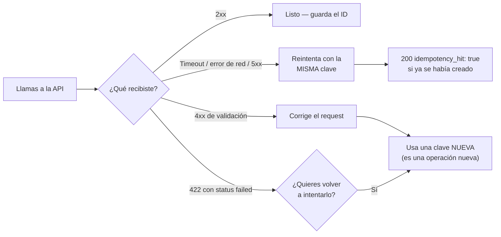

### Recomendaciones

- Usa un identificador de **tu** sistema (ID de orden, de nómina, etc.), no
  un timestamp ni un UUID generado al vuelo en cada retry.
- Guarda la clave antes de llamar a la API; así puedes reintentar tras un
  timeout con garantía de no duplicar.
- Ante un error de red o `5xx`, **reintenta con la misma clave**. Ante un
  `4xx` de validación, corrige el request y usa una clave nueva.


## Personas y empresas

*Las diferencias entre los dos tipos de cuenta, producto por producto, en una sola página*

CBPay tiene dos tipos de cuenta — **persona** (`type: "person"`) y
**empresa** (`type: "company"`) — que usan **la misma API** con los mismos
endpoints. Esta página reúne TODAS las diferencias en un solo lugar, para
que nunca tengas que adivinar cuál aplica.

El tipo se define al crear la cuenta y no cambia. Lo ves en
`GET /v1/me` → `type`.

### Tabla completa de diferencias

| Capacidad | Persona | Empresa |
|---|---|---|
| Saldo USDT, payouts, payins, transferencias, banking, cartola | Igual | Igual |
| **Wallets de depósito** ([crypto](#crypto-wallets-depositos-y-retiros)) por red+activo | **1** (nacen con la cuenta; solo reciben) | **1** (nacen con la cuenta; solo reciben) |
| **Wallets segregadas** ([saldo propio on-chain](#wallets-segregadas)) | **1 por red+activo** | **Ilimitadas** (usa `label` para distinguirlas) |
| **Tarjetas** | **1 virtual + 1 física**, solo para sí misma | **Ilimitadas**, para la empresa o para **personas designadas** (empleados) |
| **Miembros con login** (`POST /v1/members`) | No (`403 company_only`) | Sí — roles `owner` / `operator` / `viewer` |
| **Verificación de identidad** (`/v1/me/verification`) | Onboarding **KYC** (wizard con documentos + prueba de vida) | Onboarding **KYB** (wizard con documentos societarios) |
| **Verificar a terceros** (`/v1/{kyc,kyb}/links` y submissions) | No (`403 company_account_required`) | Sí — links hosteados o datos por API, cobra `kyc_verification`/`kyb_verification` |
| **AML screening** (`POST /v1/aml/screenings`) | Screening de **persona** (`customer.person`), cobra `compliance_person` | Screening de **empresa** (`customer.company`), cobra `compliance_company` |
| Titular de tarjetas (primera emisión) | Datos personales + documentos de identidad | Datos societarios + documentos corporativos (o los de la persona designada) |
| Registro | `type: "person"` | `type: "company"` (+ `tax_id` recomendado) |

Todo lo demás — autenticación, idempotencia, webhooks, estados, errores,
límites de gasto por tarjeta, servicios habilitados — funciona idéntico.

### Cómo se ve en la práctica

#### Cuenta persona

- Registro: `POST /v1/auth/register` con `type: "person"` (o la crea tu
  operador).
- Verificación: pide tu link KYC con `POST /v1/me/verification/link` y
  completa el wizard — hasta aprobar solo puedes fondear
  ([guía](#verificacion-kyc-y-kyb)).
- Crypto: tus **wallets de depósito nacen con la cuenta** (una por
  red+activo; solo reciben). ¿Necesitas una wallet con saldo propio?
  Puedes tener **1 wallet segregada por red+activo**.
- Tarjetas: hasta **1 virtual + 1 física**; la primera emisión lleva tus
  datos y documentos — [guía](#tarjetas-virtuales-y-fisicas).
- Sin miembros: tu login y tus API keys operan la cuenta.

#### Cuenta empresa

- Registro: `type: "company"`, idealmente con `tax_id`.
- Verificación: pide tu link KYB con `POST /v1/me/verification/link` y
  completa el wizard con los datos societarios; aprobada, puedes además
  verificar a tus propios clientes ([guía](#verificacion-kyc-y-kyb)).
- Crypto: tus **wallets de depósito nacen con la cuenta** (una por
  red+activo; solo reciben). Para saldos separados on-chain crea
  **wallets segregadas ilimitadas** (una por sucursal, por producto, por
  proveedor…), con `label` descriptivo.
- Tarjetas: **ilimitadas** — corporativas (titular = la empresa, con
  documentos societarios en la primera) o para **empleados** (persona
  designada con sus datos en cada designación) —
  [guía](#tarjetas-virtuales-y-fisicas).
- Miembros: agrega usuarios con login propio y permisos
  (`owner`/`operator`/`viewer`) — [guía](#autenticacion-y-cuenta).

### Errores que delatan el tipo de cuenta

| `error` | Qué significa |
|---|---|
| `403 company_only` | Intentaste una función de empresa (miembros) desde una cuenta persona |
| `422 wallet_limit_reached` | La cuenta ya tiene su wallet de esa combinación (depósito: todos; segregada: personas) |
| `409 card_limit_reached` | Una persona intentó su segunda tarjeta del mismo tipo |

> **Nota**
¿Tu operación creció de persona a empresa? El tipo de cuenta no se cambia
por API: pide a tu administrador CBPay crear la cuenta empresa y migrar el
saldo con una transferencia interna (gratis e instantánea).


## Servicios habilitados

*Qué productos tiene habilitados tu cuenta y cómo reaccionar a service_disabled*

Cada cuenta tiene un **conjunto de servicios habilitados** según su acuerdo
comercial con CBPay. Antes de mostrar un producto en tu UI (o de intentar
usarlo), consulta el mapa efectivo:

```bash
curl https://api.qbank.cl/platform/v1/services \
  -H "Authorization: Bearer <token>"
```

```json
{
  "account_id": "9b1deb4d-3b7d-4bad-9bdd-2b0d7b3dcb6d",
  "services": {
    "payouts": true,
    "payins": true,
    "transfers": true,
    "crypto": true,
    "banking": false,
    "kyc": true,
    "cards": false
  }
}
```

### Catálogo de servicios

| Servicio | Qué habilita |
|---|---|
| `payouts` | Dispersiones fiat (`POST /v1/payouts`, QR scan/confirm) |
| `payins` | Cobros fiat (QR, transferencia, página de pago, collect, CLABE) |
| `transfers` | Transferencias internas entre cuentas CBPay |
| `crypto` | Wallets on-chain y retiros USDT |
| `banking` | Cuentas bancarias internacionales (perfil, cuentas, pagos) |
| `kyc` | Verificación de identidad KYC/KYB de terceros (links, submissions, documentos, liveness) |
| `aml` | AML screening contra listas, rescreening y monitoreo |
| `cards` | Emisión y operación de tarjetas |
| `swaps` | Conversión entre saldos (USDT/USDC/BTC/GOLD) |
| `wallets` | [Wallets segregadas](#wallets-segregadas) con saldo on-chain propio (solo empresas) |

### Qué pasa cuando un servicio está apagado

Las **acciones** del producto responden `403 service_disabled`:

```json
{
  "error": "service_disabled",
  "message": "this service is not enabled for your account"
}
```

Reglas importantes:

- **Las lecturas nunca se bloquean**: siempre puedes listar y consultar tus
  operaciones históricas, saldos y movimientos.
- **El dinero en tránsito termina su ciclo**: un payout `processing` se
  completa (o reembolsa) aunque el servicio se apague después.
- Con `cards` apagado, las compras con tarjeta dejan de autorizarse al
  instante y no se generan mensualidades.

### Patrón recomendado en tu integración

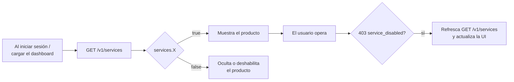

1. Consulta `GET /v1/services` al cargar tu aplicación (y cachea unos minutos).
2. Muestra solo los productos en `true`.
3. Aun así, maneja `403 service_disabled` en cualquier acción: la
   configuración puede cambiar entre tu caché y la operación.

> **Nota**
Los servicios los habilita tu organización según el acuerdo comercial. Si
necesitas activar un producto (por ejemplo `banking` o `cards`), contacta a
tu administrador CBPay — el cambio es inmediato, sin redeploy.


## Estados y ciclo de vida

*Todos los estados de cada producto, cuáles son finales y qué hacer en cada uno*

Todas las operaciones de CBPay siguen ciclos de vida explícitos. Esta
página reúne **todos los estados de todos los productos** en un solo lugar,
con la regla de oro: nunca asumas éxito hasta ver un **estado final**.

### Tabla unificada

| Producto | Estados | Finales | Evento webhook |
|---|---|---|---|
| Payout | `pending` → `processing` → `completed` / `failed` | `completed`, `failed` | `payout_status_changed` |
| Payin | `pending` → `credited` / `expired` / `failed` (+ `unassigned`) | `credited`, `expired`, `failed` | `payin_credited` |
| Transferencia | `completed` (síncrona) | `completed` | `transfer_received` (al receptor) |
| Depósito crypto | detección → `credited` al confirmar la red | `credited` | `crypto_deposit_credited` |
| Retiro crypto | `pending` → `processing` → `completed` / `failed` | `completed`, `failed` | `crypto_withdrawal_status_changed` |
| Banking (pago) | según riel: `pending` → `processing` → `completed` / `failed` | `completed`, `failed` | `banking_operation_status_changed` |
| Tarjeta | `pending_activation` → `active` ⇄ `frozen` → `cancelled` | `cancelled` | `card_status_changed` |
| KYC de la cuenta | `none` → `pending` → `approved` / `rejected` | `approved`, `rejected` | — (consultar `GET /v1/me`) |

### Payouts: el ciclo con dinero retenido

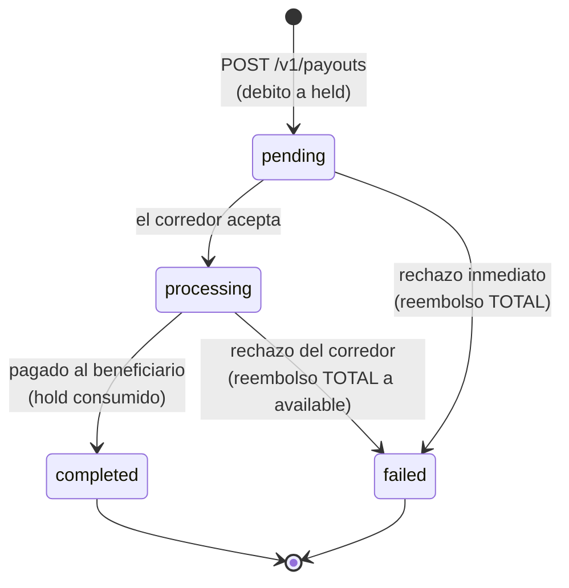

- El débito completo (`total_debit`) sale de `available` y queda en `held`
  mientras la operación está en vuelo.
- `failed` **siempre reembolsa el débito completo** (monto + comisión) a
  `available`, automáticamente.
- Un payout en `processing` no se puede cancelar por API: espera el estado
  final (webhook o `GET /v1/payouts/{id}`).

#### Catálogo de `status_code` en payouts fallidos

Cuando un payout falla, `status_code` y `status_message` explican la causa
en términos neutros:

| `status_code` | Significado | Qué hacer |
|---|---|---|
| `core_rejected` | El procesador rechazó la operación al crearla (datos del beneficiario inválidos, cuenta destino inexistente, corredor no disponible) | Lee `status_message`, corrige los datos y crea un payout nuevo (clave nueva) |
| *código del corredor* | Rechazo posterior del riel bancario (p. ej. cuenta cerrada) | Igual: corrige y reintenta como operación nueva |
| *(vacío)* con `failed` | Fallo genérico reportado por el corredor | Revisa `status_message`; si no es claro, contacta soporte con el `payout_id` |

El reembolso ya ocurrió en todos los casos: verifícalo en
`GET /v1/movements` (entrada `payout_refund`).

### Payins: estados de un cobro

- `pending` — el cargo existe y espera el pago. Los QR y páginas de pago
  tienen vencimiento (`expired` si nadie paga).
- `credited` — pago recibido, convertido a tu `payin_rate` y abonado.
- `unassigned` — llegó un depósito que no se pudo asociar a ninguna cuenta;
  el administrador lo asigna manualmente y entonces se acredita con la tasa
  y comisiones de la cuenta destino.
- `failed` — el cobro falló (p. ej. un collect rechazado por el pagador).
  No se movió dinero.

### Retiros crypto: confirmación on-chain

Un retiro pasa a `completed` cuando la transacción se confirma en la red.
Tiempos típicos: **TRON ~1 minuto** (19 confirmaciones), **Ethereum algunos
minutos** según congestión. El `tx_id` viene en la respuesta y en el
webhook para que lo verifiques en el explorador.

Si el retiro falla antes de transmitirse, el débito completo se reembolsa
(entrada `withdrawal_refund`).

### Tarjetas

- `pending_activation` — física emitida, viaja inactiva; se activa con
  `POST /v1/cards/{id}/activate`.
- `active` — autoriza compras en tiempo real contra el saldo del asset de
  gasto de la tarjeta (`spending_asset`: USDT, USDC, BTC o GOLD).
- `frozen` — congelada (manual o por mensualidad impaga); las compras se
  rechazan con `unfunded_card_frozen`. Se descongela pagando lo pendiente.
- `cancelled` — final; no se puede revertir.

### Reglas transversales

#### ¿Cuándo confío en un estado?
Estado final por webhook **o** por `GET` del recurso — ambos son fuentes de
verdad equivalentes. El webhook es push (recomendado); el `GET` es tu
respaldo si un webhook se pierde.
#### ¿Qué hago ante timeout creando una operación?
NO reintentes con clave nueva. Repite el mismo request con la **misma**
`idempotency_key` (te devuelve el original con `idempotency_hit: true`) o
consulta el listado del recurso. Detalle en
[idempotencia](#idempotencia).
#### ¿Un estado puede retroceder?
No. Los ciclos son monótonos: `completed` y `failed` son definitivos, y una
operación nunca vuelve a un estado anterior.
#### ¿Dónde veo el efecto de cada estado en mi saldo?
En `GET /v1/movements`: cada transición con efecto económico deja una
entrada inmutable (`payout_debit`, `payout_refund`, `payin_credit`…). Ver
[movimientos y conciliación](#movimientos-y-conciliacion).


## Movimientos y conciliación

*El ledger inmutable (GET /v1/movements), todos los tipos de asiento y cómo conciliar contra la cartola y los webhooks*

Cada vez que tu saldo cambia, CBPay escribe una **entrada inmutable** en el
ledger con el saldo resultante. `GET /v1/movements` es tu fuente de verdad
para conciliar: nada mueve dinero sin dejar asiento.

### Consultar movimientos

```bash
curl "https://api.qbank.cl/platform/v1/movements?from=2026-07-01&to=2026-07-08&page_size=100" \
  -H "Authorization: Bearer <token>"
```

```json
{
  "account_id": "9b1deb4d-3b7d-4bad-9bdd-2b0d7b3dcb6d",
  "page": 1,
  "page_size": 100,
  "movements": [
    {
      "id": "a3f1…",
      "asset": "USDT",
      "amount": "-101.602460",
      "type": "payout_debit",
      "reference_type": "payout",
      "reference_id": "8e2a…",
      "description": "Payout 700.00 BOB",
      "balance_after": "3898.397540",
      "created_at": "2026-07-07T15:22:10Z"
    }
  ]
}
```

Filtros: `from`/`to` (`YYYY-MM-DD`, UTC), `type`, `asset`, `page`,
`page_size` (máx. 200). Cada entrada trae `reference_type` +
`reference_id`: el recurso de negocio que la originó.

#### Exportar a CSV / Excel

Agrega `format=csv` o `format=xlsx` para descargar las mismas filas como
archivo listo para contabilidad (hasta 10.000 filas por descarga). También
disponible en los listados de `payouts`, `payins` y `transfers`:

```bash
curl -o movimientos.xlsx "https://api.qbank.cl/platform/v1/movements?from=2026-07-01&to=2026-07-13&format=xlsx" \
  -H "Authorization: Bearer <token>"
```

### Catálogo completo de tipos

| `type` | Signo | Origen (`reference_type`) |
|---|---|---|
| `payin_credit` | + | Cobro fiat abonado (`payin`) |
| `payout_debit` / `payout_refund` | − / + | Payout creado / reembolso si falló (`payout`) |
| `transfer_in` / `transfer_out` | + / − | Transferencia interna recibida / enviada (`transfer`) |
| `funding` | + | Depósito USDT on-chain acreditado (`deposit`) |
| `withdrawal_debit` / `withdrawal_refund` | − / + | Retiro on-chain / reembolso si falló (`withdrawal`) |
| `card_debit` / `card_refund` | − / + | Compra con tarjeta / reversa (`card_transaction`) |
| `card_fee` / `card_fee_refund` | − / + | Fee de tarjeta (emisión, mensualidad, cancelación) |
| `compliance_fee` / `compliance_refund` | − / + | Cobro por screening KYC / reembolso si falló |
| `wallet_creation_fee` / `wallet_creation_refund` | − / + | Fee por creación de wallet |
| `banking_fee` / `banking_fee_refund` | − / + | Fee de operación banking |
| `adjustment` | ± | Ajuste manual auditado del administrador |

> **Nota**
Los saldos de banking viven en tus cuentas bancarias (no en el ledger
USDT): aquí solo aparecen sus **fees**. Las comisiones transaccionales de
payout/payin/retiro no tienen asiento propio — viajan dentro del monto de
su operación (`total_debit`, `usdt_credited`).
### Conciliación en tres capas

Tu integración tiene tres vistas del mismo dinero. Así se mapean:

| Capa | Qué es | Clave de cruce |
|---|---|---|
| **Webhooks** | Notificación push de cada evento | `payout_id` / `payin_id` / `transfer_id` / `withdrawal_id` |
| **Movements** | Asiento contable inmutable con `balance_after` | `reference_id` = el mismo id del recurso |
| **Cartola** | Estado de cuenta del período (JSON/PDF/Excel) con cuadratura | Secciones por producto con los mismos ids |

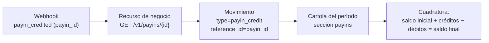

#### Receta de conciliación diaria

### Descarga los movimientos del día

`GET /v1/movements?from=AYER&to=AYER` paginando hasta el final.
### Cruza contra tu registro interno

Tu `idempotency_key` derivada de tu id interno te permite unir cada
operación tuya con su `reference_id` de CBPay.
### Verifica la continuidad del saldo

Ordena por fecha: el `balance_after` de cada entrada debe ser el
anterior ± `amount`. Cualquier salto es señal de que te falta una
entrada (no de un error del ledger — es inmutable).
### Cierra el período con la cartola

La [cartola](#cartola-estado-de-cuenta) garantiza la identidad contable
`saldo_inicial + créditos − débitos = saldo_final` y te sirve como
respaldo formal (PDF/Excel).
### Movements vs cartola: ¿cuándo usar cuál?

- **`GET /v1/movements`** — programático, paginado, en vivo: para tu
  conciliación automática y tu UI de historial.
- **Cartola** — snapshot del período con totales, desgloses por producto/
  país/moneda y cuadratura garantizada: para cierres contables, auditoría
  y para compartir con tu equipo de finanzas.

Ambos leen el mismo ledger: nunca van a discrepar entre sí.


# Flujos de integración


## Flujos de integración

*Los cinco flujos end-to-end de una integración típica, con diagramas de secuencia paso a paso*

Esta página conecta los productos en **flujos completos de negocio**: qué
llamar, qué esperar y qué webhook cierra cada ciclo. Cada flujo linkea a la
guía detallada de su producto.

### 1. Fondear la cuenta

Tres caminos para que entre dinero; todos terminan en un abono al saldo
USDT y un webhook:

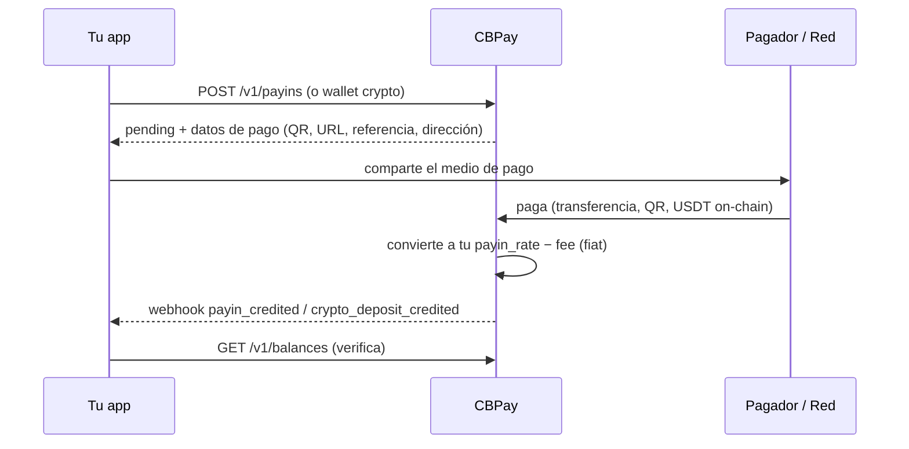

| Camino | Endpoint | Webhook de cierre |
|---|---|---|
| Cobro fiat (QR, transferencia, página de pago, pull) | `POST /v1/payins` / `/collect` | `payin_credited` |
| Depósito USDT on-chain | `POST /v1/crypto/wallets` (dirección fija) | `crypto_deposit_credited` |
| Transferencia interna de otra cuenta | — (la inicia el emisor) | `transfer_received` |

Detalle: [payins](#payins) · [crypto](#crypto-wallets-depositos-y-retiros) ·
[transferencias](#transferencias-internas).

### 2. Dispersar (payout)

```mermaid
sequenceDiagram
    participant App as Tu app
    participant CB as CBPay
    participant Banco as Riel local
    App->>CB: POST /v1/payouts (idempotency_key)
    CB-->>App: 202 processing (fx_rate, total_debit; débito queda en held)
    CB->>Banco: ejecuta la dispersión
    alt pagado
        Banco-->>CB: confirmación
        CB-->>App: webhook payout_status_changed (completed)
    else rechazo
        Banco-->>CB: rechazo
        CB->>CB: reembolsa el débito COMPLETO a available
        CB-->>App: webhook payout_status_changed (failed + status_code)
    end
    App->>CB: GET /v1/payouts/{id} (verifica estado final)
```

Variante **QR** (Bolivia): `POST /v1/payouts/qr/scan` (gratis, decodifica)
→ muestra los datos → `POST /v1/payouts/qr/confirm` (cobra como un payout
normal). Detalle: [payouts](#payouts).

### 3. Cobrar a un cliente

Elige la modalidad según el país y la experiencia que quieras dar:

| Modalidad | Países | Experiencia del pagador | Confirmación |
|---|---|---|---|
| Página de pago hosted | CL | Abre una URL y paga desde su banco | Automática |
| QR | BO, BR (PIX) | Escanea con su app bancaria | Automática |
| Transferencia anunciada | CL, PE, MX, BR | Transfiere incluyendo la referencia | Automática por referencia (o monto) |
| CLABE dedicada | MX | Transfiere a una CLABE fija tuya | Automática, sin referencias |
| Cobro pull (c2p / débito) | VE | Autoriza con OTP y tú ejecutas el cobro | **Síncrona** en la misma llamada |

Todos cierran con `payin_credited` y el abono neto en tu saldo.
Detalle: [payins](#payins).

### 4. Conciliar

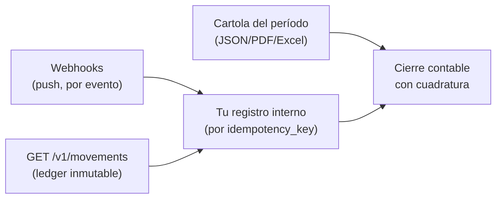

Receta completa en
[movimientos y conciliación](#movimientos-y-conciliacion) y
[cartola](#cartola-estado-de-cuenta).

### 5. Banking internacional end-to-end

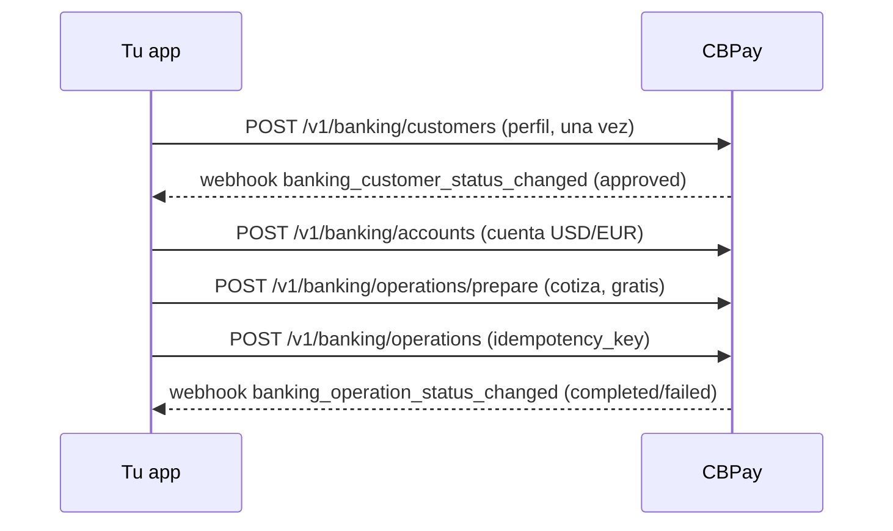

El saldo banking vive en tus cuentas bancarias (separado del USDT); CBPay
solo cobra los fees fijos configurados. Detalle:
[banking](#banking).

> **Tip**
¿Primera integración? Sigue el [inicio rápido](#inicio-rapido) (fondeo →
payout → webhook) y vuelve aquí cuando agregues productos.


# Productos


## Payouts

*Dispersa fiat a cuentas bancarias locales debitando tu saldo USDT*

Un payout envía dinero en moneda local a una cuenta bancaria del país
destino. El monto se convierte de moneda local a USDT con **la tasa de tu
cuenta** (la de `GET /v1/rates`) y se debita `usdt_amount + fee` (el fijo,
si está configurado) de tu saldo.

Así se ve el ciclo completo, incluido qué pasa con tu saldo en cada paso:

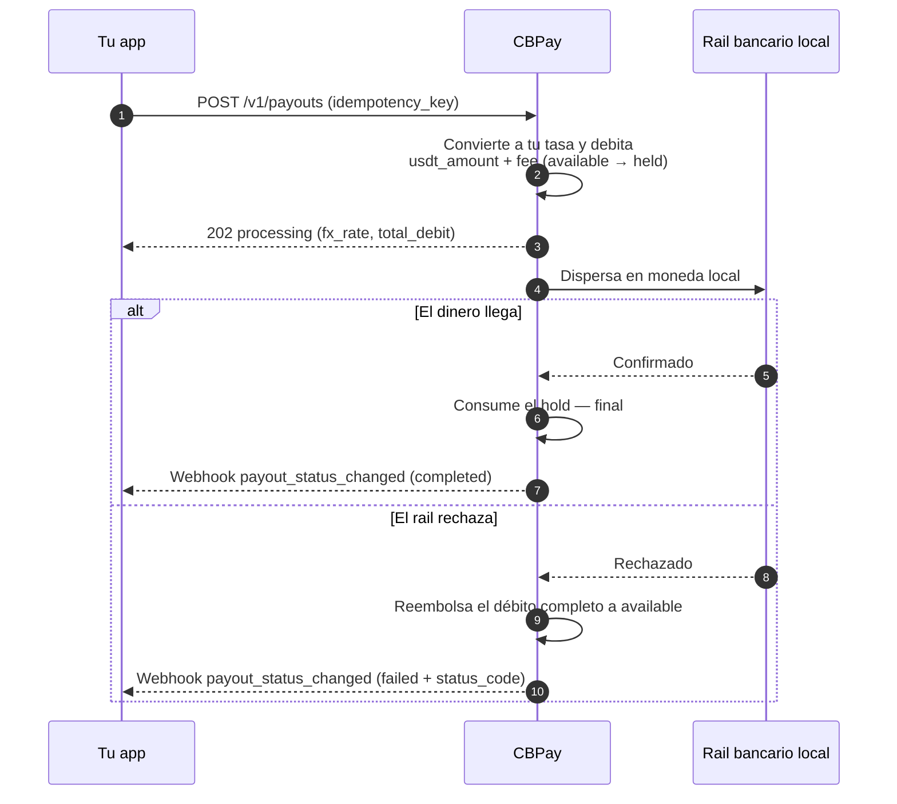

### 1. Descubre los corredores disponibles

Los países, monedas y métodos disponibles los define CBPay.
Consúltalos siempre por catálogo:

```bash
curl https://api.qbank.cl/platform/v1/payouts/methods \
  -H "Authorization: Bearer <token>"
```

```json
{
  "items": [
    { "country": "CL", "currency": "CLP", "method": "bank_transfer" },
    { "country": "PE", "currency": "PEN", "method": "bank_transfer" },
    { "country": "PE", "currency": "PEN", "method": "yape" },
    { "country": "BO", "currency": "BOB", "method": "qr" }
  ],
  "meta": { "retrieved": 4 }
}
```

Corredores y métodos disponibles:

| País | Moneda | Métodos |
|---|---|---|
| Chile | CLP | `bank_transfer` |
| Perú | PEN | `bank_transfer`, `yape` |
| México | MXN | `bank_transfer` (SPEI: CLABE o tarjeta de débito) |
| Venezuela | VES | `bank_transfer`, `pago_movil` |
| Bolivia | BOB / USD | `bank_transfer`, `qr` (ver [Payout QR](#payout-qr)) |
| Brasil | BRL | `pix` (por llave o a cuenta) |
| Ecuador | USD | `bank_transfer`, `deuna`, `cash_pickup`, `cnb` |
| Paraguay | PYG | `bank_transfer` |

La disponibilidad puede variar; el catálogo (`GET /v1/payouts/methods`) es
siempre la fuente de verdad. Si un país tiene un solo método, `method` es
opcional. Todos los métodos se cobran igual: tu tasa + fijo.

Para transferencias bancarias necesitas además el catálogo de bancos (de
ahí sale el `bank_code` del beneficiario):

```bash
curl "https://api.qbank.cl/platform/v1/payouts/banks?country=CL" \
  -H "Authorization: Bearer <token>"
```

```json
{
  "items": [
    { "code": "001", "name": "Banco de Chile" },
    { "code": "012", "name": "Banco del Estado de Chile" },
    { "code": "016", "name": "Banco de Crédito e Inversiones" }
  ],
  "meta": { "retrieved": 3 }
}
```

### 2. Crea el payout

```bash
curl -X POST https://api.qbank.cl/platform/v1/payouts \
  -H "Authorization: Bearer <token>" \
  -H "Content-Type: application/json" \
  -d '{
    "country": "MX",
    "currency": "MXN",
    "method": "bank_transfer",
    "amount": "1500.00",
    "beneficiary": {
      "name": "María López",
      "account_type": "clabe",
      "account_number": "012180001234567895"
    },
    "description": "Pago factura 8841",
    "idempotency_key": "factura-8841"
  }'
```

> **Importante**
`beneficiary` es un objeto de pares clave/valor cuyos campos requeridos
dependen del corredor (RUT y banco en Chile, CLABE en México, CCI en Perú,
llave PIX en Brasil, etc.). El catálogo de métodos documenta los campos de
cada uno.
> **Nota**
Cada payout guarda al beneficiario como [contacto](#contactos)
automáticamente (`"save_contact": false` para no guardarlo). Para repetirle
un pago sin re-tipear sus datos, envía `"beneficiary_contact_id"` en vez de
`beneficiary` — se usa su beneficiario guardado más reciente para ese país
y método (`422 no_saved_destination` si no tiene).
Respuesta `202 Accepted`:

```json
{
  "payout_id": "0d4f…",
  "account_id": "…",
  "idempotency_key": "factura-8841",
  "country": "MX",
  "currency": "MXN",
  "method": "bank_transfer",
  "local_amount": "1500.00",
  "fx_rate": "17.50",
  "usdt_amount": "85.714286",
  "fee": "0.300000",
  "total_debit": "86.014286",
  "settlement_asset": "USDT",
  "settlement_amount": "86.014286",
  "settlement_rate": "1",
  "status": "processing",
  "created_at": "2026-07-06T20:00:00Z"
}
```

En ese momento tu saldo ya refleja el débito: `total_debit` pasó de
`available` a `held` (en el saldo del `settlement_asset`).

#### Pagar desde otro saldo (`settlement_asset`)

Por defecto el débito sale de tu asset de settlement predeterminado (USDT
salvo que lo cambies con `PUT /v1/settlement`). Para pagar una operación
puntual desde otro saldo, agrega `settlement_asset` al request. Ejemplo:
un payout de 100.000 CLP pagado desde el saldo BTC pasa por cuatro
transformaciones, todas registradas en la respuesta:

1. **CLP → USDT** a tu tasa: `100000 / 950.25 = 105.235465 USDT`.
2. **+ comisión fija**: `105.235465 + 0.30 = 105.535465 USDT` (`total_debit`).
3. **USDT → BTC** al precio efectivo de settlement (`settlement_rate`
   `109029.34070000`): `105.535465 / 109029.3407 = 0.00096795 BTC`
   (redondeo hacia arriba al satoshi).
4. **Débito y hold en BTC**: `settlement_amount` `0.00096795` sale de tu
   saldo BTC; el beneficiario recibe sus 100.000 CLP igual que siempre.

```json
{
  "country": "CL",
  "currency": "CLP",
  "local_amount": "100000",
  "fx_rate": "950.25",
  "usdt_amount": "105.235465",
  "fee": "0.300000",
  "total_debit": "105.535465",
  "settlement_asset": "BTC",
  "settlement_amount": "0.00096795",
  "settlement_rate": "109029.34070000",
  "status": "processing"
}
```

Si el payout falla, se reembolsa el `settlement_amount` exacto a tu saldo
BTC — nunca se re-cotiza. Si el precio de ejecución de BTC/GOLD no está
disponible en ese momento recibirás `503 pricing_unavailable`, y los
assets volátiles tienen un límite por operación
(`422 settlement_limit_exceeded`; consúltalo en `GET /v1/settlement`).

### 3. Recibe el estado final

Suscríbete al evento `payout_status_changed` ([webhooks](#webhooks)):

```json
{
  "payout_id": "0d4f…",
  "account_id": "…",
  "country": "MX",
  "currency": "MXN",
  "local_amount": "1500.00",
  "usdt_amount": "85.714286",
  "total_debit": "86.014286",
  "status": "completed",
  "status_code": ""
}
```

- **`completed`**: el dinero llegó; el hold se consume.
- **`failed`**: se reembolsa el débito completo automáticamente
  (`payout_refund` en tu ledger).

También puedes consultar en cualquier momento:

```bash
curl https://api.qbank.cl/platform/v1/payouts/0d4f… \
  -H "Authorization: Bearer <token>"
```

#### Estados del payout

| Estado | Significado | ¿Tu saldo? |
|---|---|---|
| `processing` | Aceptado y en ejecución en el rail local | Débito retenido en `held` |
| `completed` | El dinero llegó al beneficiario | Hold consumido — final |
| `failed` | El corredor lo rechazó o falló | **Reembolso automático completo** (monto + comisión) |

### Consulta e historial

Cada payout se puede leer individualmente y el listado acepta filtros:

```bash
# Un payout
curl https://api.qbank.cl/platform/v1/payouts/0d4f… \
  -H "Authorization: Bearer <token>"

# Historial con filtros: fechas, estado, país y paginación
curl "https://api.qbank.cl/platform/v1/payouts?from=2026-07-01&to=2026-07-08&status=failed&country=MX&page=1&page_size=50" \
  -H "Authorization: Bearer <token>"
```

```json
{
  "page": 1,
  "page_size": 50,
  "payouts": [
    {
      "payout_id": "0d4f…",
      "country": "MX",
      "currency": "MXN",
      "method": "bank_transfer",
      "local_amount": "1500.00",
      "fx_rate": "17.50",
      "usdt_amount": "85.714286",
      "fee": "0.300000",
      "total_debit": "86.014286",
      "status": "failed",
      "status_code": "core_rejected",
      "status_message": "beneficiary account does not exist",
      "created_at": "2026-07-06T20:00:00Z"
    }
  ]
}
```

`from`/`to` van en `YYYY-MM-DD` (UTC, ambos inclusive); una fecha inválida
responde `400 invalid_range`.

### Ejemplos por país

Cada corredor con su `beneficiary` exacto, el request completo y la
respuesta real. Las tasas (`fx_rate`) son ilustrativas — siempre aplican
las de tu cuenta en `GET /v1/rates`; el débito es `usdt_amount + fee`
(fijo, si está configurado; aquí `0.30`).

#### Campos del beneficiary por corredor

| País | Método | Campos del `beneficiary` |
|---|---|---|
| CL | `bank_transfer` | `name`, `tax_id` (RUT), `bank_code`, `account_type`, `account_number` |
| PE | `bank_transfer` | `name`, `account_number` (CCI de 20 dígitos) |
| PE | `yape` | `name`, `phone` (`51XXXXXXXXX`) |
| MX | `bank_transfer` | `name`, `account_type` (`clabe`/`debit_card`), `account_number` (+ `bank_code` si es tarjeta) |
| VE | `pago_movil` | `phone`, `bank_code` (SUDEBAN), `document_value` |
| VE | `bank_transfer` | `name`, `account_number` (20 dígitos), `document_value` |
| BO | `bank_transfer` | `name`, `tax_id`, `bank_code`, `account_number` |
| BR | `pix` | `name`, `tax_id` + (`pix_key` y `pix_key_type`) o (`bank_code` ISPB, `branch_code`, `account_number`) |
| EC | `bank_transfer` | `name`, `document_value` (cédula), `sender_name`, `account_number` (+ `bank_code` y `account_type` si es a otro banco) |
| EC | `deuna` | `name`, `document_value`, `sender_name`, `phone` (celular de la billetera) |
| EC | `cash_pickup` / `cnb` | `name`, `document_value`, `sender_name` — el beneficiario retira con su documento |
| PY | `bank_transfer` | `name` (≤35), `tax_id`, `bank_code`, `account_number` |

#### Chile

Transferencia bancaria en CLP. Requiere RUT, banco y cuenta:

```bash
curl -X POST https://api.qbank.cl/platform/v1/payouts \
  -H "Authorization: Bearer <token>" \
  -H "Content-Type: application/json" \
  -d '{
    "country": "CL",
    "currency": "CLP",
    "method": "bank_transfer",
    "amount": "100000",
    "beneficiary": {
      "name": "Pedro Soto Fuentes",
      "tax_id": "12.345.678-5",
      "bank_code": "012",
      "account_type": "checking",
      "account_number": "123456789"
    },
    "description": "Pago proveedor",
    "idempotency_key": "cl-prov-0091"
  }'
```

```json
{
  "payout_id": "b3e1…",
  "country": "CL",
  "currency": "CLP",
  "method": "bank_transfer",
  "local_amount": "100000",
  "fx_rate": "925.69",
  "usdt_amount": "108.027528",
  "fee": "0.300000",
  "total_debit": "108.327528",
  "status": "processing"
}
```

El catálogo de bancos (`GET /v1/payouts/banks?country=CL`) da los
`bank_code` vigentes.

#### Perú

Dos métodos: transferencia bancaria (CCI interbancario) y **Yape** (al
número de teléfono).

```bash bank_transfer (CCI)
curl -X POST https://api.qbank.cl/platform/v1/payouts \
  -H "Authorization: Bearer <token>" \
  -H "Content-Type: application/json" \
  -d '{
    "country": "PE",
    "currency": "PEN",
    "method": "bank_transfer",
    "amount": "1000.00",
    "beneficiary": {
      "name": "Rosa Álvarez Díaz",
      "account_number": "00219300123456789012"
    },
    "idempotency_key": "pe-cci-3310"
  }'
```

```bash yape (teléfono)
curl -X POST https://api.qbank.cl/platform/v1/payouts \
  -H "Authorization: Bearer <token>" \
  -H "Content-Type: application/json" \
  -d '{
    "country": "PE",
    "currency": "PEN",
    "method": "yape",
    "amount": "150.00",
    "beneficiary": {
      "name": "Luis Ramos Vega",
      "phone": "51987654321"
    },
    "idempotency_key": "pe-yape-8874"
  }'
```

```json
{
  "payout_id": "c7a2…",
  "country": "PE",
  "currency": "PEN",
  "method": "yape",
  "local_amount": "150.00",
  "fx_rate": "3.40",
  "usdt_amount": "44.117648",
  "fee": "0.300000",
  "total_debit": "44.417648",
  "status": "completed"
}
```

En `yape` el teléfono va en formato `51XXXXXXXXX` (11 dígitos con código de
país). El resultado suele ser síncrono.

#### México

SPEI en MXN, a CLABE (18 dígitos) o a tarjeta de débito:

```bash CLABE
curl -X POST https://api.qbank.cl/platform/v1/payouts \
  -H "Authorization: Bearer <token>" \
  -H "Content-Type: application/json" \
  -d '{
    "country": "MX",
    "currency": "MXN",
    "method": "bank_transfer",
    "amount": "1500.00",
    "beneficiary": {
      "name": "María López",
      "account_type": "clabe",
      "account_number": "012180001234567895"
    },
    "idempotency_key": "mx-clabe-8841"
  }'
```

```bash Tarjeta de débito
curl -X POST https://api.qbank.cl/platform/v1/payouts \
  -H "Authorization: Bearer <token>" \
  -H "Content-Type: application/json" \
  -d '{
    "country": "MX",
    "currency": "MXN",
    "method": "bank_transfer",
    "amount": "800.00",
    "beneficiary": {
      "name": "Jorge Herrera",
      "account_type": "debit_card",
      "account_number": "4152313412341234",
      "bank_code": "40012"
    },
    "idempotency_key": "mx-card-1102"
  }'
```

```json
{
  "payout_id": "0d4f…",
  "country": "MX",
  "currency": "MXN",
  "method": "bank_transfer",
  "local_amount": "1500.00",
  "fx_rate": "17.50",
  "usdt_amount": "85.714286",
  "fee": "0.300000",
  "total_debit": "86.014286",
  "status": "processing"
}
```

Con CLABE el banco destino se deriva de los primeros dígitos; con tarjeta
es obligatorio `bank_code`.

#### Venezuela

Dos métodos: **Pago Móvil** (teléfono + banco + cédula) y transferencia
bancaria (cuenta de 20 dígitos):

```bash pago_movil
curl -X POST https://api.qbank.cl/platform/v1/payouts \
  -H "Authorization: Bearer <token>" \
  -H "Content-Type: application/json" \
  -d '{
    "country": "VE",
    "currency": "VES",
    "method": "pago_movil",
    "amount": "2000.00",
    "beneficiary": {
      "phone": "04141234567",
      "bank_code": "0102",
      "document_value": "V12345678"
    },
    "idempotency_key": "ve-pm-5567"
  }'
```

```bash bank_transfer
curl -X POST https://api.qbank.cl/platform/v1/payouts \
  -H "Authorization: Bearer <token>" \
  -H "Content-Type: application/json" \
  -d '{
    "country": "VE",
    "currency": "VES",
    "method": "bank_transfer",
    "amount": "5000.00",
    "beneficiary": {
      "name": "Carmen Delgado",
      "account_number": "01020123456789012345",
      "document_value": "V87654321"
    },
    "idempotency_key": "ve-bank-7810"
  }'
```

```json
{
  "payout_id": "e9b4…",
  "country": "VE",
  "currency": "VES",
  "method": "pago_movil",
  "local_amount": "2000.00",
  "fx_rate": "666.00",
  "usdt_amount": "3.003004",
  "fee": "0.300000",
  "total_debit": "3.303004",
  "status": "completed"
}
```

`bank_code` usa códigos SUDEBAN; en `bank_transfer` puede derivarse de los
primeros 4 dígitos de la cuenta.

#### Bolivia

Transferencia ACH en BOB o USD (además del
[payout QR](#payout-qr)):

```bash
curl -X POST https://api.qbank.cl/platform/v1/payouts \
  -H "Authorization: Bearer <token>" \
  -H "Content-Type: application/json" \
  -d '{
    "country": "BO",
    "currency": "BOB",
    "method": "bank_transfer",
    "amount": "1382.00",
    "beneficiary": {
      "name": "Juan Quispe Mamani",
      "tax_id": "4567890",
      "bank_code": "1016",
      "account_number": "1234567890"
    },
    "idempotency_key": "bo-ach-2204"
  }'
```

```json
{
  "payout_id": "f2c8…",
  "country": "BO",
  "currency": "BOB",
  "method": "bank_transfer",
  "local_amount": "1382.00",
  "fx_rate": "6.91",
  "usdt_amount": "200.000000",
  "fee": "0.300000",
  "total_debit": "200.300000",
  "status": "processing"
}
```

Para USD envía `currency: "USD"` con la misma estructura.

#### Brasil

PIX por llave (además del
[QR PIX](#payout-qr)):

```bash
curl -X POST https://api.qbank.cl/platform/v1/payouts \
  -H "Authorization: Bearer <token>" \
  -H "Content-Type: application/json" \
  -d '{
    "country": "BR",
    "currency": "BRL",
    "method": "pix",
    "amount": "350.00",
    "beneficiary": {
      "name": "João da Silva",
      "tax_id": "123.456.789-09",
      "pix_key_type": "cpf",
      "pix_key": "12345678909"
    },
    "idempotency_key": "br-pix-3321"
  }'
```

```json
{
  "payout_id": "a6d1…",
  "country": "BR",
  "currency": "BRL",
  "method": "pix",
  "local_amount": "350.00",
  "fx_rate": "5.13",
  "usdt_amount": "68.226121",
  "fee": "0.300000",
  "total_debit": "68.526121",
  "status": "processing"
}
```

`pix_key_type`: `cpf`, `cnpj`, `phone`, `email` o `evp` (llave aleatoria).

**PIX a cuenta (sin llave)** — si el beneficiario no tiene o no entrega su
llave PIX, envía sus datos bancarios; llega igual de rápido (mismo riel
PIX, 24/7):

```bash
curl -X POST https://api.qbank.cl/platform/v1/payouts \
  -H "Authorization: Bearer <token>" \
  -H "Content-Type: application/json" \
  -d '{
    "country": "BR",
    "currency": "BRL",
    "method": "pix",
    "amount": "350.00",
    "beneficiary": {
      "name": "Empresa Exemplo Ltda",
      "tax_id": "19.385.062/0001-20",
      "bank_code": "45678923",
      "branch_code": "1",
      "account_number": "765432",
      "account_type": "CACC"
    },
    "idempotency_key": "br-pix-acct-3322"
  }'
```

- `bank_code` es el **ISPB** del banco destino (8 dígitos), `branch_code`
  la agencia y `account_type` el tipo de cuenta (`CACC` corriente —
  default —, `SVGS` ahorro, `TRAN` cuenta de pago, `SLRY` salario).
- El estado final llega por el webhook `payout_status_changed`
  (conciliación continua contra el rail); consulta puntual con
  `GET /v1/payouts/{id}`.

#### Ecuador

Remesas en **USD** (1 a 10.000 por operación, máx. 2 decimales) con cuatro
métodos: transferencia bancaria, billetera **DE UNA** (por celular),
retiro en **ventanilla** (`cash_pickup`) y retiro en **corresponsal no
bancario** (`cnb`). Es un corredor de remesas: además del beneficiario, el
rail exige los datos del **ordenante** (quien envía), que van planos
dentro del mismo `beneficiary` con prefijo `sender_*`.

```bash bank_transfer (a cuenta)
curl -X POST https://api.qbank.cl/platform/v1/payouts \
  -H "Authorization: Bearer <token>" \
  -H "Content-Type: application/json" \
  -d '{
    "country": "EC",
    "currency": "USD",
    "method": "bank_transfer",
    "amount": "250.00",
    "beneficiary": {
      "name": "Carlos Andrade Vera",
      "document_value": "1712345678",
      "account_number": "2203456789",
      "sender_name": "Ana Torres Silva",
      "sender_document_value": "V23456789",
      "sender_country": "US"
    },
    "idempotency_key": "ec-bank-4471"
  }'
```

```bash deuna (billetera)
curl -X POST https://api.qbank.cl/platform/v1/payouts \
  -H "Authorization: Bearer <token>" \
  -H "Content-Type: application/json" \
  -d '{
    "country": "EC",
    "currency": "USD",
    "method": "deuna",
    "amount": "80.00",
    "beneficiary": {
      "name": "Lucia Paredes Mora",
      "document_value": "0923456781",
      "phone": "0998765432",
      "sender_name": "Ana Torres Silva"
    },
    "idempotency_key": "ec-deuna-5520"
  }'
```

```bash cash_pickup (ventanilla)
curl -X POST https://api.qbank.cl/platform/v1/payouts \
  -H "Authorization: Bearer <token>" \
  -H "Content-Type: application/json" \
  -d '{
    "country": "EC",
    "currency": "USD",
    "method": "cash_pickup",
    "amount": "120.00",
    "beneficiary": {
      "name": "Miguel Zambrano Loor",
      "document_value": "1309876543",
      "sender_name": "Ana Torres Silva"
    },
    "idempotency_key": "ec-cash-6612"
  }'
```

```bash cnb (corresponsal)
curl -X POST https://api.qbank.cl/platform/v1/payouts \
  -H "Authorization: Bearer <token>" \
  -H "Content-Type: application/json" \
  -d '{
    "country": "EC",
    "currency": "USD",
    "method": "cnb",
    "amount": "60.00",
    "beneficiary": {
      "name": "Rosa Cedeño Vera",
      "document_value": "0801234567",
      "sender_name": "Ana Torres Silva"
    },
    "idempotency_key": "ec-cnb-7703"
  }'
```

```json
{
  "payout_id": "9f3a…",
  "country": "EC",
  "currency": "USD",
  "method": "bank_transfer",
  "local_amount": "250.00",
  "fx_rate": "1",
  "usdt_amount": "250.000000",
  "fee": "0.300000",
  "total_debit": "250.300000",
  "status": "processing"
}
```

- Ecuador está dolarizado: la moneda local ES el USD (`fx_rate: "1"`).
- `document_value` es la cédula del beneficiario; `document_type` acepta
  `IDCD` (cédula, default), `CCPT` (pasaporte) o `TXID` (RUC).
- En `bank_transfer`, si omites `bank_code` la cuenta es del banco emisor
  del corredor; para **otro banco** envía el `bank_code` del catálogo
  (`GET /v1/payouts/banks?country=EC`) más `account_type`
  (`checking` o `savings`).
- Nombres estructurados opcionales (`given_name`, `middle_name`,
  `first_surname`, `second_surname` y sus pares `sender_*`): si los
  tienes, envíalos — mandan sobre la separación automática de `name`.
- El estado final llega por webhook `payout_status_changed`
  (con conciliación periódica de respaldo).

#### Paraguay

Transferencia bancaria en PYG:

```bash
curl -X POST https://api.qbank.cl/platform/v1/payouts \
  -H "Authorization: Bearer <token>" \
  -H "Content-Type: application/json" \
  -d '{
    "country": "PY",
    "currency": "PYG",
    "method": "bank_transfer",
    "amount": "500000",
    "beneficiary": {
      "name": "Sofía Benítez",
      "tax_id": "4123456",
      "bank_code": "0011",
      "account_number": "600123456"
    },
    "idempotency_key": "py-bank-9917"
  }'
```

```json
{
  "payout_id": "d4e7…",
  "country": "PY",
  "currency": "PYG",
  "method": "bank_transfer",
  "local_amount": "500000",
  "fx_rate": "6055.76",
  "usdt_amount": "82.566020",
  "fee": "0.300000",
  "total_debit": "82.866020",
  "status": "processing"
}
```

`name` acepta hasta 35 caracteres en este corredor.

### Payout QR

En Bolivia (QR interoperable local) también puedes **pagar a un QR de
cobro** en dos pasos: escanear y confirmar. El escaneo es **gratis**; solo
se cobra al confirmar, igual que un payout normal (tu tasa + fijo). Si no
envías `country`/`currency`, se asume Bolivia (BOB). El pago a QR PIX de
Brasil llegará próximamente (mientras tanto usa `pix` por llave o cuenta).

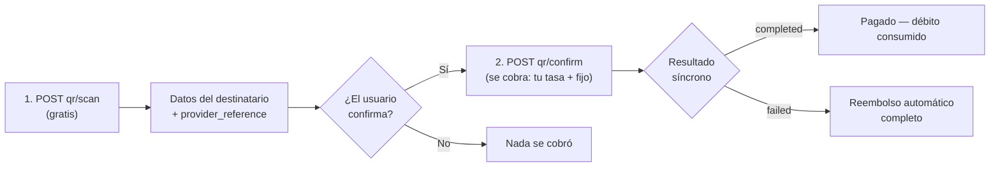

#### 1. Escanea el QR (gratis)

```bash
curl -X POST https://api.qbank.cl/platform/v1/payouts/qr/scan \
  -H "Authorization: Bearer <token>" \
  -H "Content-Type: application/json" \
  -d '{
    "qr_payload": "<contenido del QR>",
    "currency": "BOB"
  }'
```

Devuelve los datos del destinatario para que el usuario confirme a quién le
paga:

```json
{
  "scan_id": "…",
  "provider_reference": "…",
  "beneficiary_name": "Juan Quispe",
  "destination_account": "…",
  "amount": "700.00",
  "currency": "BOB",
  "glosa": "",
  "status": "…"
}
```

#### 2. Confirma el pago (se cobra aquí)

```bash
curl -X POST https://api.qbank.cl/platform/v1/payouts/qr/confirm \
  -H "Authorization: Bearer <token>" \
  -H "Content-Type: application/json" \
  -d '{
    "provider_reference": "<del scan>",
    "amount": "700.00",
    "currency": "BOB",
    "description": "Pago QR almuerzo",
    "idempotency_key": "qr-2026-07-07-a"
  }'
```

- Se debita `usdt_amount + fijo` a **tu tasa**, igual que un
  `bank_transfer`.
- El resultado es **síncrono**: la respuesta ya trae el estado final
  (`completed` o `failed` con reembolso automático) — sin esperas.
- Un mismo QR escaneado solo puede pagarse una vez; reintentos con la misma
  `idempotency_key` devuelven el payout original.
- Cuando el pago a QR PIX de Brasil esté disponible, `qr_payload` aceptará
  el contenido del QR o el código "copia e cola" con este mismo flujo.

### Errores frecuentes

| HTTP | `error` | Qué hacer |
|---|---|---|
| 400 | `idempotency_key_required` | Envía la clave en body o header |
| 400 | `beneficiary_required` | Incluye el objeto `beneficiary` |
| 402 | `insufficient_funds` | Fondea la cuenta; el payout no se creó |
| 403 | `account_blocked` | La cuenta no está activa; contacta al equipo de CBPay |
| 403 | `service_disabled` | Payouts no está habilitado para tu cuenta — ver [servicios](#servicios-habilitados) |
| 422 | `currency_not_supported` | No hay tasa FX para esa moneda |
| 422 | (payout con `status: failed`) | El corredor rechazó los datos; el débito ya fue reembolsado — corrige `beneficiary` y reintenta con clave nueva |
| 503 | `channel_unavailable` | El canal de pago está temporalmente no disponible; reintenta más tarde con la MISMA `idempotency_key` |

### Rechazo inmediato vs fallo posterior

Si el procesador rechaza el payout al crearlo, recibes `422` con el objeto
en `status: failed` y el reembolso ya aplicado. Si falla después (por
ejemplo, cuenta destino inexistente detectada por el banco), te llega el
webhook con `status: failed` y el reembolso automático en ese momento.

#### Cómo leer `status_code` en un payout fallido

| `status_code` | Significado | Acción |
|---|---|---|
| `core_rejected` | El procesador rechazó la operación al crearla (datos del beneficiario inválidos, corredor no disponible) | Lee `status_message`, corrige y crea un payout nuevo con clave nueva |
| `channel_unavailable` | El canal de pago quedó temporalmente no disponible | Reintenta más tarde; el reembolso (si hubo débito) ya está aplicado |
| *otro código* | Rechazo posterior del riel bancario (p. ej. cuenta destino cerrada) | Igual: corrige los datos y crea una operación nueva |
| *(vacío)* | Fallo genérico del corredor | Revisa `status_message`; si no es claro, contacta soporte con el `payout_id` |

En todos los casos el reembolso ya está aplicado — verifícalo con la
entrada `payout_refund` en
[movimientos](#movimientos-y-conciliacion).

> **Nota**
Un payout en `processing` no se puede cancelar por API: el rail ya lo tiene.
Espera el estado final por webhook o `GET` — llega siempre, con reembolso
automático si falla.


## Payins

*Cobra en moneda local y recibe el abono en USDT*

Un payin es un cobro fiat: tu cliente paga en moneda local y tu cuenta
recibe el abono en USDT automáticamente, convertido a **tu tasa de payin**
(`payin_rate` en `GET /v1/rates`) menos la comisión fija de payin si tu
cuenta la tiene configurada.

Sea cual sea la modalidad, todos los caminos terminan igual — abono
automático + webhook:

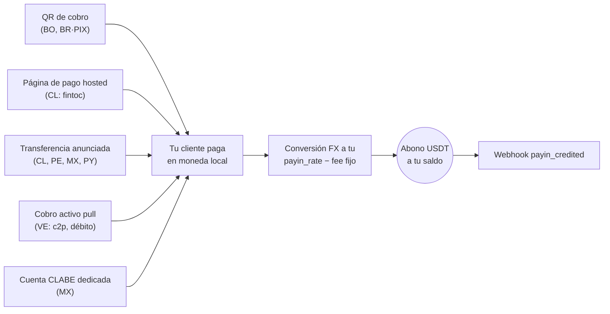

### 1. Descubre los corredores disponibles

Los países, monedas y modalidades disponibles los define CBPay.
Consúltalos siempre por catálogo:

```bash
curl https://api.qbank.cl/platform/v1/payins/methods \
  -H "Authorization: Bearer <token>"
```

```json
{
  "items": [
    { "country": "BO", "currency": "BOB", "method": "qr", "delivery": "push" },
    { "country": "VE", "currency": "VES", "method": "c2p", "delivery": "push+polling" },
    { "country": "MX", "currency": "MXN", "method": "bank_transfer", "delivery": "push" }
  ],
  "meta": { "retrieved": 3 }
}
```

`delivery` indica cómo se confirma el pago del lado de CBPay (notificación
del banco, sondeo o ambos) — no cambia nada en tu integración: tú siempre
recibes el webhook `payin_credited`.

Corredores y modalidades de cobro:

| País | Moneda | Modalidades |
|---|---|---|
| Chile | CLP | Página de pago hosted (`fintoc`), transferencia anunciada |
| Perú | PEN | Transferencia anunciada |
| México | MXN | Cuenta CLABE dedicada, transferencia anunciada |
| Venezuela | VES | Cobro activo `c2p` y `debito_inmediato` (pull) |
| Bolivia | BOB / USD | QR de cobro |
| Paraguay | PYG | Transferencia anunciada |
| Brasil | BRL | QR PIX dinámico |

La disponibilidad puede variar; el catálogo (`GET /v1/payins/methods`) es
siempre la fuente de verdad. En todos los casos el abono llega igual: se
convierte a USDT a tu `payin_rate` del momento y se acredita neto de la
comisión fija de payin.

### 2. Elige la modalidad y crea el cobro

Cada país tiene su propia modalidad de cobro. El request y la respuesta
real de cada una:

#### Chile

**Página de pago hosted (`fintoc`)** — recomendado: recibes una
`payment_url`; el pagador la abre y transfiere desde **cualquier banco o
billetera chilena** (Banco Estado, Santander, Mach, Tenpo, Mercado
Pago…). El pago se detecta y valida automáticamente — sin referencias
manuales.

```bash
curl -X POST https://api.qbank.cl/platform/v1/payins \
  -H "Authorization: Bearer <token>" \
  -H "Content-Type: application/json" \
  -d '{
    "country": "CL",
    "currency": "CLP",
    "method": "fintoc",
    "amount": "150000",
    "description": "Recarga pedido 8841",
    "idempotency_key": "topup-8841"
  }'
```

Respuesta `201`:

```json
{
  "payin_id": "7a2b…",
  "status": "pending",
  "reference": "7a2b…",
  "payment_url": "https://pay.fintoc.com/plink_K2zwNNSxPyx8w3GZ",
  "expires_at": "2026-07-08T18:48:25Z",
  "note": "share the payment_url with the payer; the deposit is credited automatically once the transfer is detected"
}
```

Comparte la `payment_url` con el pagador (link, redirección o WebView).
Cuando el pago se confirma, tu cuenta se acredita en USDT y recibes el
webhook `payin_credited`. El monto CLP debe ser entero (el peso chileno no
usa decimales) y la sesión de pago vence en 24 horas por defecto. Un retry
con la misma `idempotency_key` devuelve el mismo payin y la misma URL —
nunca abre una segunda sesión de pago.

**Transferencia anunciada** (alternativa manual): anuncias el depósito
entrante y compartes la referencia con quien transfiere.

```bash
curl -X POST https://api.qbank.cl/platform/v1/payins \
  -H "Authorization: Bearer <token>" \
  -H "Content-Type: application/json" \
  -d '{
    "country": "CL",
    "currency": "CLP",
    "method": "bank_transfer",
    "amount": "500000"
  }'
```

Respuesta `201`:

```json
{
  "payin_id": "4f81…",
  "status": "pending",
  "reference": "CBJ6T3W9M2K5",
  "note": "include the reference in the transfer description so the deposit is credited automatically"
}
```

Cuando la transferencia llega, se matchea por la referencia en la glosa (o
por monto+moneda como respaldo) y tu cuenta se acredita automáticamente.

#### Perú

**Transferencia anunciada**, igual que Chile pero en soles:

```bash
curl -X POST https://api.qbank.cl/platform/v1/payins \
  -H "Authorization: Bearer <token>" \
  -H "Content-Type: application/json" \
  -d '{
    "country": "PE",
    "currency": "PEN",
    "method": "bank_transfer",
    "amount": "1800.00"
  }'
```

Respuesta `201`:

```json
{
  "payin_id": "6d20…",
  "status": "pending",
  "reference": "CBK7M2Q9X4T3",
  "note": "include the reference in the transfer description so the deposit is credited automatically"
}
```

La `reference` es un **código corto de 12 caracteres alfanuméricos** (cabe
en cualquier concepto bancario) y debe viajar en la descripción de la
transferencia para el match automático; como respaldo también se matchea
por monto+moneda.

#### México

**Cuenta CLABE dedicada** (recomendado): creas una CLABE fija vinculada a
tu cuenta — todo SPEI que llegue a ella se acredita automáticamente, sin
referencias:

```bash
curl -X POST https://api.qbank.cl/platform/v1/payins/deposit-accounts \
  -H "Authorization: Bearer <token>" \
  -H "Content-Type: application/json" \
  -d '{ "country": "MX", "currency": "MXN" }'
```

Respuesta `201`:

```json
{
  "instrument_id": "a1d4…",
  "account_id": "…",
  "country": "MX",
  "currency": "MXN",
  "method": "bank_transfer",
  "instrument": "734180000151000006",
  "status": "active"
}
```

`instrument` es la CLABE que compartes con tus pagadores. La creación es
gratis; cada depósito paga la comisión de payin normal. Lista tus cuentas
con `GET /v1/payins/deposit-accounts`.

También puedes usar la **transferencia anunciada** puntual
(`POST /v1/payins` con `method: "bank_transfer"`, `country: "MX"`).

#### Venezuela

**Cobro activo (pull)**: cobras directamente al pagador con su
autorización. El resultado es **síncrono** — si el cobro se aprueba, el
abono se acredita en la misma llamada.

Para `debito_inmediato`, primero solicita el OTP (gratis):

```bash
curl -X POST https://api.qbank.cl/platform/v1/payins/collect/otp \
  -H "Authorization: Bearer <token>" \
  -H "Content-Type: application/json" \
  -d '{
    "method": "debito_inmediato",
    "amount": "1200.00",
    "payer_document": "V12345678",
    "payer_phone": "04141234567",
    "payer_bank": "0102",
    "payer_account": "01020123456789012345"
  }'
```

```json
{
  "method": "debito_inmediato",
  "result": { "status": "sent", "otp_reference": "OTP-5521" }
}
```

Luego ejecuta el cobro:

```bash c2p (teléfono + cédula + OTP del pagador)
curl -X POST https://api.qbank.cl/platform/v1/payins/collect \
  -H "Authorization: Bearer <token>" \
  -H "Content-Type: application/json" \
  -d '{
    "method": "c2p",
    "amount": "1200.00",
    "description": "Cobro pedido 5512",
    "payer_document": "V12345678",
    "payer_phone": "04141234567",
    "payer_bank": "0102",
    "otp": "12345678",
    "idempotency_key": "cobro-5512"
  }'
```

```bash debito_inmediato (cuenta + OTP solicitado antes)
curl -X POST https://api.qbank.cl/platform/v1/payins/collect \
  -H "Authorization: Bearer <token>" \
  -H "Content-Type: application/json" \
  -d '{
    "method": "debito_inmediato",
    "amount": "1200.00",
    "description": "Cobro pedido 5512",
    "payer_document": "V12345678",
    "payer_account": "01020123456789012345",
    "payer_bank": "0102",
    "payer_account_type": "CNTA",
    "otp": "87654321",
    "otp_reference": "OTP-5521",
    "idempotency_key": "cobro-5512"
  }'
```

> **Nota**
El cobro activo ejecuta un débito real contra el pagador, así que
`idempotency_key` es **obligatoria** (body o header `Idempotency-Key`): un
reintento con la misma clave devuelve el resultado original con
`idempotency_hit` y nunca vuelve a cobrar.
Respuesta `200` (cobro aprobado y acreditado):

```json
{
  "payin_id": "7b3c…",
  "kind": "collect",
  "method": "c2p",
  "status": "credited",
  "local_amount": "1200.00",
  "fx_rate": "36.50",
  "usdt_gross": "32.876712",
  "fee": "0.300000",
  "usdt_credited": "32.576712",
  "paid": true,
  "provider_reference": "…"
}
```

Si el pagador rechaza o falla la autorización, `paid` es `false`, el payin
queda `failed` y no se cobra nada.

#### Bolivia

**QR de cobro** (estándar interoperable local): generas el QR y tu cliente
lo escanea con su app bancaria.

```bash
curl -X POST https://api.qbank.cl/platform/v1/payins \
  -H "Authorization: Bearer <token>" \
  -H "Content-Type: application/json" \
  -d '{
    "country": "BO",
    "currency": "BOB",
    "method": "qr",
    "amount": "700.00",
    "description": "Recarga app",
    "expires_in": 3600
  }'
```

Respuesta `201`:

```json
{
  "payin_id": "9c2a…",
  "status": "pending",
  "charge": {
    "charge_id": "…",
    "qr_image": "<base64>",
    "qr_image_url": "https://cdn.cbpayapp.com/public/payin-qr/<charge_id>.png",
    "qr_payload": "<contenido del QR>",
    "our_reference": "482915073",
    "status": "pending"
  }
}
```

Muestra el QR a tu cliente — `qr_image_url` es una URL pública de CDN lista
para un `` (prefiérela por sobre el base64 `qr_image`); cuando paga, tu
cuenta se acredita automáticamente. También funciona en USD
(`currency: "USD"`).

#### Paraguay

**Transferencia anunciada** en guaraníes: anuncias el depósito, tu pagador
transfiere (SIPAP interbancaria o transferencia interna del banco receptor)
con la referencia en el concepto, y el abono se detecta automáticamente.

```bash
curl -X POST https://api.qbank.cl/platform/v1/payins \
  -H "Authorization: Bearer <token>" \
  -H "Content-Type: application/json" \
  -d '{
    "country": "PY",
    "currency": "PYG",
    "method": "bank_transfer",
    "amount": "596000"
  }'
```

Respuesta `201`:

```json
{
  "payin_id": "8f41…",
  "status": "pending",
  "reference": "CBW4N8R2T6P9",
  "note": "include the reference in the transfer description so the deposit is credited automatically"
}
```

> **Nota**
Los guaraníes no usan decimales: anuncia el monto **entero exacto** que
transferirá tu pagador (ej. `"596000"`). La `reference` es un código corto
de 12 caracteres alfanuméricos — diseñado para el concepto SIPAP, que
acepta **máximo 20 caracteres sin caracteres especiales** — y ponerla en
el concepto asegura el match automático; como respaldo también se matchea
por monto+moneda.
#### Brasil

**QR PIX dinámico**: el mismo endpoint genera un QR PIX con el monto
embebido.

```bash
curl -X POST https://api.qbank.cl/platform/v1/payins \
  -H "Authorization: Bearer <token>" \
  -H "Content-Type: application/json" \
  -d '{
    "country": "BR",
    "currency": "BRL",
    "method": "qr",
    "amount": "120.00",
    "description": "Pedido 7719",
    "expires_in": 1800
  }'
```

En la respuesta, `charge.qr_payload` es el código **"copia e cola"** de
PIX, para que el pagador pueda pegarlo en su app bancaria si no escanea la
imagen (`charge.qr_image` base64 o `charge.qr_image_url`, la URL pública de
CDN). El QR expira según `expires_in` (default 1
hora); el pago se acredita automáticamente al confirmarse en el rail
(conciliación continua — consulta puntual con `GET /v1/payins/{charge_id}`).

> **Nota**
En Brasil el cobro es únicamente por QR PIX dinámico (un QR = un pago, con
monto exacto embebido). La transferencia anunciada llegará más adelante.
### 3. Recibe el abono

Cuando el pago llega (por cualquiera de las modalidades), tu cuenta se
acredita automáticamente y se emite el webhook `payin_credited`:

```json
{
  "payin_id": "9c2a…",
  "account_id": "…",
  "country": "BO",
  "currency": "BOB",
  "local_amount": "700.00",
  "fx_rate": "6.91",
  "usdt_credited": "100.302460",
  "fee": "1.000000"
}
```

`fx_rate` es tu `payin_rate` del momento del abono — la conversión se hace
exactamente a esa tasa: `usdt_gross = 700.00 / 6.91`.

El objeto payin queda con el detalle completo:

```bash
curl https://api.qbank.cl/platform/v1/payins/9c2a… \
  -H "Authorization: Bearer <token>"
```

```json
{
  "payin_id": "9c2a…",
  "kind": "qr",
  "status": "credited",
  "local_amount": "700.00",
  "fx_rate": "6.91",
  "usdt_gross": "101.302460",
  "fee": "1.000000",
  "usdt_credited": "100.302460"
}
```

### Estados

| Estado | Significado |
|---|---|
| `pending` | Cargo creado, esperando el pago |
| `credited` | Pago recibido y abonado en USDT |
| `unassigned` | Depósito recibido sin match automático (lo asigna el administrador) |
| `expired` | El cargo venció sin pago |
| `failed` | El cobro falló |

> **Nota**
Los depósitos que llegan por transferencia directa sin referencia clara
quedan `unassigned` hasta que el equipo de CBPay los asigna a una cuenta.
Al asignarse, se acreditan con la tasa y comisiones de la cuenta destino.
> **Nota**
Cuando un cobro activo (QR o checkout) muere sin pago, el payin pasa de
`pending` a `expired` (o `failed`) automáticamente y recibes el webhook
[`payin_expired`](#webhooks). No se mueve dinero: si quieres reintentar
el cobro, crea un payin nuevo.
### Consulta e historial

```bash
# Un payin
curl https://api.qbank.cl/platform/v1/payins/9c2a… \
  -H "Authorization: Bearer <token>"

# Historial con filtros
curl "https://api.qbank.cl/platform/v1/payins?from=2026-07-01&to=2026-07-08&status=credited&country=BO&page_size=50" \
  -H "Authorization: Bearer <token>"
```

`from`/`to` van en `YYYY-MM-DD` (UTC); fecha inválida responde
`400 invalid_range`.

### Errores frecuentes

| HTTP | `error` | Qué hacer |
|---|---|---|
| 400 | `invalid_request` | Revisa `method` (qr, bank_transfer, fintoc; collect va en su endpoint) |
| 400 | `idempotency_key_required` | El collect exige clave de idempotencia (débito real al pagador) |
| 403 | `service_disabled` | Payins no está habilitado para tu cuenta — ver [servicios](#servicios-habilitados) |
| 422 | `core_rejected` | El procesador rechazó el cargo; revisa el mensaje |
| 502 | `core_unavailable` | No se pudo crear el cargo; reintenta la creación (no se cobró nada) |


## Transferencias internas

*Mueve USDT, USDC, BTC o GOLD entre cuentas CBPay, gratis y al instante*

Las transferencias internas mueven saldo entre dos cuentas **CBPay**, de
forma atómica en el ledger y **siempre sin comisión** — el dinero nunca sale
del ecosistema. Funcionan con las cuatro monedas (`USDT`, `USDC`, `BTC`,
`GOLD`) y siempre **entre saldos de la misma moneda**: el `asset` que envías
es el `asset` que recibe el destino, sin conversión.

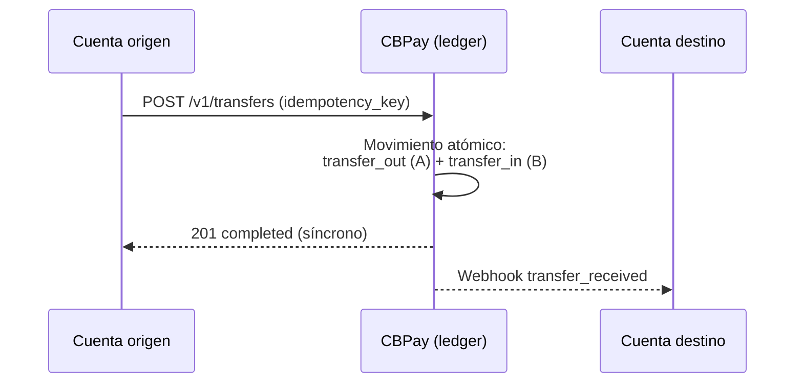

Funcionan entre **cualquier combinación de cuentas**:

| Origen | Destino | Comisión |
|---|---|---|
| Persona | Persona | 0 |
| Persona | Empresa | 0 |
| Empresa | Persona | 0 |
| Empresa | Empresa | 0 |

### Crear una transferencia

El destino se identifica por `to_account_id`, `to_email`, **`to_phone`**
(teléfono verificado) o **`to_contact_id`** (un
[contacto](#contactos) de tu libreta):

```bash Por teléfono (verificado)
curl -X POST https://api.qbank.cl/platform/v1/transfers \
  -H "Authorization: Bearer <token>" \
  -H "Content-Type: application/json" \
  -d '{
    "to_phone": "+56987654321",
    "amount": "25.000000",
    "description": "Almuerzo",
    "idempotency_key": "alm-2026-07-10-a"
  }'
```

```bash Por contacto
curl -X POST https://api.qbank.cl/platform/v1/transfers \
  -H "Authorization: Bearer <token>" \
  -H "Content-Type: application/json" \
  -d '{
    "to_contact_id": "3f8a1b2c-…",
    "amount": "10.000000",
    "idempotency_key": "t-991"
  }'
```

```bash Por email (persona → persona)
curl -X POST https://api.qbank.cl/platform/v1/transfers \
  -H "Authorization: Bearer <token>" \
  -H "Content-Type: application/json" \
  -d '{
    "to_email": "carlos@ejemplo.com",
    "amount": "25.000000",
    "description": "Split de gastos",
    "idempotency_key": "split-2026-07-06-a"
  }'
```

```bash Por account_id (persona → empresa)
curl -X POST https://api.qbank.cl/platform/v1/transfers \
  -H "Authorization: Bearer <token>" \
  -H "Content-Type: application/json" \
  -d '{
    "to_account_id": "ae8cf540-22a9-414d-82cc-8ac04732be4f",
    "amount": "120.500000",
    "description": "Pago servicio mensual",
    "idempotency_key": "serv-2026-07-a"
  }'
```

```bash Empresa → persona (nómina)
curl -X POST https://api.qbank.cl/platform/v1/transfers \
  -H "Authorization: Bearer <token de la empresa>" \
  -H "Content-Type: application/json" \
  -d '{
    "to_email": "empleado@ejemplo.com",
    "amount": "850.000000",
    "description": "Sueldo julio",
    "idempotency_key": "nomina-2026-07-emp01"
  }'
```

```bash En otra moneda (GOLD, gramos de oro)
curl -X POST https://api.qbank.cl/platform/v1/transfers \
  -H "Authorization: Bearer <token>" \
  -H "Content-Type: application/json" \
  -d '{
    "to_email": "carlos@ejemplo.com",
    "asset": "GOLD",
    "amount": "2.500000",
    "description": "Regalo en oro",
    "idempotency_key": "oro-2026-07-09-a"
  }'
```

La forma del request es idéntica en todas las combinaciones (persona o
empresa, en cualquier dirección) — cambia solo la credencial que llama.
`asset` es opcional y por defecto `USDT`; acepta `USDT`, `USDC`, `BTC` o
`GOLD` y el destino recibe **en esa misma moneda**.

Respuesta `201` — la transferencia es **síncrona e inmediata**:

```json
{
  "transfer_id": "77b1…",
  "from_account_id": "…",
  "to_account_id": "…",
  "asset": "USDT",
  "amount": "25.000000",
  "description": "Split de gastos",
  "status": "completed",
  "created_at": "2026-07-06T20:10:00Z"
}
```

Replay con la misma `idempotency_key` — `200` con la transferencia
original:

```json
{
  "transfer_id": "77b1…",
  "amount": "25.000000",
  "status": "completed",
  "idempotency_hit": true
}
```

El receptor puede enterarse por el webhook `transfer_received` y ambos ven
el movimiento en su historial (`transfer_out` / `transfer_in`).

> **Nota**
Cada transferencia guarda al destinatario como [contacto](#contactos)
automáticamente (envía `"save_contact": false` para no guardarlo). Por
seguridad, `to_phone` solo resuelve cuentas con el teléfono **verificado
por OTP**; si más de una cuenta comparte el número responde
`422 recipient_ambiguous`.
### Consultar transferencias

Lista las transferencias de tu cuenta (enviadas y recibidas), con
paginación y filtros de fecha:

```bash
curl "https://api.qbank.cl/platform/v1/transfers?from=2026-07-01&to=2026-07-07&page_size=50" \
  -H "Authorization: Bearer <token>"
```

O una en particular por su ID (solo visible para las dos partes):

```bash
curl https://api.qbank.cl/platform/v1/transfers/77b1… \
  -H "Authorization: Bearer <token>"
```

Cada fila trae `direction` (`sent` o `received`) desde tu perspectiva.

### Reglas

- Solo entre cuentas CBPay **activas**; las cuentas internas del sistema no
  pueden recibir.
- Siempre **misma moneda en origen y destino**: no hay conversión entre
  saldos (`USDT`→`USDT`, `GOLD`→`GOLD`, …).
- No puedes transferirte a ti mismo (`400 self_transfer`).
- Requiere `idempotency_key` (body o header `Idempotency-Key`); el replay
  devuelve `200` con `idempotency_hit: true`.
- `amount` acepta hasta los decimales de la moneda: 6 para `USDT`/`USDC`/
  `GOLD`, 8 para `BTC`.

### Errores

| HTTP | `error` | Causa |
|---|---|---|
| 400 | `recipient_required` | Falta `to_account_id`, `to_email`, `to_phone` y `to_contact_id` |
| 400 | `invalid_amount` | Monto inválido, demasiados decimales o `asset` no soportado |
| 400 | `invalid_phone` | `to_phone` no se pudo normalizar a E.164 |
| 400 | `self_transfer` | Origen y destino son la misma cuenta |
| 402 | `insufficient_funds` | Saldo disponible insuficiente en esa moneda |
| 404 | `recipient_not_found` | El email/ID no corresponde a una cuenta CBPay, o ningún teléfono verificado coincide |
| 422 | `recipient_ambiguous` | Más de una cuenta comparte ese teléfono (usa `to_account_id` o `to_email`) |
| 422 | `contact_not_linked` | El contacto no tiene cuenta CBPay asociada |
| 422 | `recipient_unavailable` | La cuenta destino está bloqueada/cerrada |


## Swaps

*Convierte entre tus saldos USDT, USDC, BTC y GOLD al instante, con cotización previa y a la tasa de ejecución del momento*

Los **swaps** convierten saldo entre tus cuatro monedas — `USDT`, `USDC`,
`BTC` y `GOLD` — de forma **síncrona e instantánea**, sin que la plata salga
de tu cuenta. Cualquier par funciona (también `BTC` ↔ `GOLD` directo). La
tasa que ves en la cotización es la tasa a la que se ejecuta: **no hay
comisiones aparte** — cotizado = recibido.

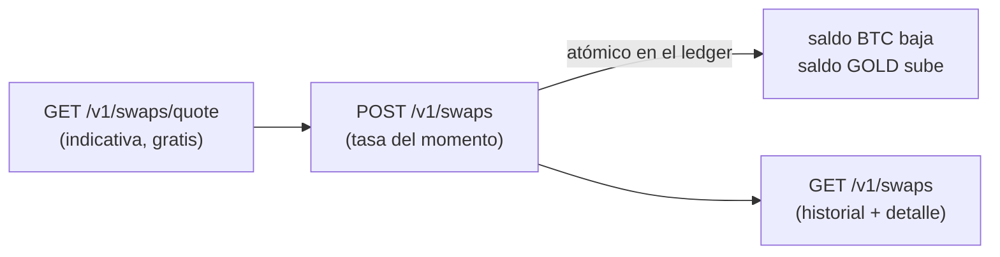

### 1. Cotiza (opcional, gratis)

```bash
curl "https://api.qbank.cl/platform/v1/swaps/quote?from_asset=USDT&to_asset=BTC&amount=1000" \
  -H "Authorization: Bearer <token>"
```

```json
{
  "from_asset": "USDT",
  "to_asset": "BTC",
  "from_amount": "1000.000000",
  "to_amount": "0.01568419",
  "rate": "0.00001568",
  "indicative": true
}
```

La cotización es **indicativa**: el swap se ejecuta a la tasa del momento
del `POST` (los precios de BTC y GOLD se mueven). Para pares entre
stablecoins (`USDT` ↔ `USDC`) la tasa es estable.

### 2. Ejecuta el swap

```bash USDT → BTC
curl -X POST https://api.qbank.cl/platform/v1/swaps \
  -H "Authorization: Bearer <token>" \
  -H "Content-Type: application/json" \
  -d '{
    "from_asset": "USDT",
    "to_asset": "BTC",
    "amount": "1000",
    "idempotency_key": "swap-2026-07-10-a"
  }'
```

```bash BTC → GOLD (directo)
curl -X POST https://api.qbank.cl/platform/v1/swaps \
  -H "Authorization: Bearer <token>" \
  -H "Content-Type: application/json" \
  -d '{
    "from_asset": "BTC",
    "to_asset": "GOLD",
    "amount": "0.01",
    "idempotency_key": "swap-2026-07-10-b"
  }'
```

```bash USDT → USDC
curl -X POST https://api.qbank.cl/platform/v1/swaps \
  -H "Authorization: Bearer <token>" \
  -H "Content-Type: application/json" \
  -d '{
    "from_asset": "USDT",
    "to_asset": "USDC",
    "amount": "500",
    "idempotency_key": "swap-2026-07-10-c"
  }'
```

`amount` va en la moneda de **origen** (`from_asset`), con hasta sus
decimales (6 para USDT/USDC/GOLD, 8 para BTC).

Respuesta `201` — el swap es síncrono, tu saldo cambia al instante:

```json
{
  "swap_id": "8a1b2c3d-4e5f-6a7b-8c9d-0e1f2a3b4c5d",
  "from_asset": "USDT",
  "to_asset": "BTC",
  "from_amount": "1000.000000",
  "to_amount": "0.01568419",
  "rate": "0.00001568",
  "status": "completed",
  "idempotency_key": "swap-2026-07-10-a",
  "created_at": "2026-07-10T15:00:00Z"
}
```

Replay con la misma `idempotency_key` → `200` con el swap original y
`idempotency_hit: true` — **jamás se re-ejecuta**.

### 3. Consulta e historial

```bash
# Historial con paginación, fechas y filtro por moneda (matchea ambas puntas)
curl "https://api.qbank.cl/platform/v1/swaps?from=2026-07-01&to=2026-07-10&asset=BTC&page=1&page_size=50" \
  -H "Authorization: Bearer <token>"

# Detalle
curl https://api.qbank.cl/platform/v1/swaps/{swap_id} \
  -H "Authorization: Bearer <token>"
```

En tu historial de movimientos (`GET /v1/movements`) y en la
[cartola](#cartola-estado-de-cuenta) el swap aparece como `swap_out` en la moneda
de origen y `swap_in` en la de destino, cada uno cuadrando en su sección.

### Reglas y límites

- **Misma cuenta**: la plata nunca sale de tu cuenta — solo cambia de
  moneda. Por eso no pide OTP.
- **Cualquier par** entre `USDT`, `USDC`, `BTC` y `GOLD` (origen ≠ destino).
- **Tasa de ejecución del momento**: para BTC y GOLD se usa el precio de
  ejecución en vivo; si el precio no está disponible o está desactualizado,
  el swap se rechaza con `503 pricing_unavailable` (nunca se ejecuta con un
  precio viejo).
- **Límites para monedas volátiles** (BTC/GOLD, compartidos con payouts y
  compras con tarjeta): tope por operación y tope de volumen por cuenta en
  24 h móviles (`GET /v1/settlement` muestra los tuyos). USDT ↔ USDC no
  tiene límite.
- Requiere tu [verificación de identidad](#verificacion-kyc-y-kyb) aprobada y el
  servicio `swaps` habilitado.

### Errores

| HTTP | `error` | Causa | Solución |
|---|---|---|---|
| 400 | `invalid_asset` | Moneda fuera de USDT/USDC/BTC/GOLD | Revisa `from_asset`/`to_asset` |
| 400 | `invalid_pair` | Origen y destino son la misma moneda | Elige monedas distintas |
| 400 | `invalid_amount` | Monto inválido o demasiados decimales | Respeta los decimales de la moneda origen |
| 400 | `amount_too_small` | El monto no alcanza ni la unidad mínima del destino | Sube el monto |
| 400 | `swap_asset_disabled` | Una de las monedas está deshabilitada para tu organización | Contacta a tu operador |
| 400 | `idempotency_key_required` | Falta la clave de idempotencia | Envíala en el body o header |
| 402 | `insufficient_funds` | Saldo insuficiente en la moneda origen | Fondea o baja el monto |
| 403 | `verification_required` / `service_disabled` | Cuenta sin verificar o servicio apagado | Completa tu onboarding / contacta a tu operador |
| 422 | `settlement_limit_exceeded` | El swap supera el tope por operación de monedas volátiles | Divide la operación |
| 422 | `settlement_daily_limit_exceeded` | Superaste tu volumen 24 h en monedas volátiles | Reintenta más tarde |
| 503 | `pricing_unavailable` | Precio de ejecución no disponible o viejo | Reintenta en unos minutos |

### Preguntas frecuentes

#### ¿Por qué la tasa del swap difiere del precio de mercado que veo en otros lados?
La tasa cotizada es la tasa **de ejecución** de tu cuenta: incluye el costo
de proveer la conversión instantánea y garantizada (liquidez inmediata, sin
slippage, sin salir de tu cuenta). Es la misma filosofía de las tasas de
payouts y payins: lo cotizado es exactamente lo que recibes, sin comisiones
sorpresa después.
#### ¿La cotización del quote está garantizada?
No — es indicativa. BTC y GOLD se mueven, así que la ejecución usa el
precio del momento del POST. Entre stablecoins (USDT ↔ USDC) la diferencia
es imperceptible. Si necesitas certeza absoluta del monto recibido, revisa
el `to_amount` de la respuesta del swap (esa es la cifra final, ya
acreditada).
#### ¿Puedo deshacer un swap?
No hay "deshacer": un swap ejecutado es final (tu saldo ya cambió). Puedes
hacer el swap inverso cuando quieras, a la tasa vigente de ese momento.
#### ¿Por qué mi swap BTC→GOLD fue rechazado por límite si era mi primer swap del día?
Los límites de monedas volátiles son compartidos entre swaps, payouts
pagados desde BTC/GOLD y compras con tarjeta desde BTC/GOLD — todos suman
al mismo volumen de 24 h móviles de tu cuenta. Consulta tus topes en
`GET /v1/settlement`.
#### ¿Qué gano teniendo saldo en GOLD o BTC?
GOLD representa gramos de oro fino y BTC bitcoin: exposición al precio del
activo sin salir del ecosistema. Puedes pagar payouts, comisiones y compras
con tarjeta directo desde esos saldos (settlement multi-asset), y volver a
USDT/USDC cuando quieras con un swap.


## Contactos

*Libreta de contactos: se llena sola con cada envío, importa la agenda del celular, descubre quién tiene CBPay y permite enviar plata por teléfono*

La **libreta de contactos** elimina el tipeo repetido de datos: cada envío
(transferencia interna, payout fiat o retiro crypto) guarda el destino como
contacto automáticamente, puedes **importar la agenda del celular** para
descubrir quién de tus contactos tiene CBPay, y las transferencias aceptan
directamente un **número de teléfono** o un `contact_id` como destino.

```mermaid
flowchart LR
    envio["Cualquier envío<br/>(transfer / payout / crypto)"] -->|"auto-guardado"| contacto["Contacto + destinos<br/>reutilizables"]
    agenda["POST /v1/contacts/import<br/>(agenda del celular)"] --> contacto
    contacto -->|"has_cbpay: true"| cbpay["Tiene CBPay"]
    contacto -->|"contact_id"| envio2["Envío rápido"]
    fono["to_phone (verificado)"] --> envio2
```

### Los contactos se crean solos

Cada envío guarda su destino en tu libreta (deduplicado: repetir el mismo
destino no crea contactos duplicados, solo lo marca como usado):

| Envío | Qué se guarda |
|---|---|
| Transferencia interna | La cuenta CBPay destino (nombre, email y su teléfono si está verificado) |
| Payout fiat | El beneficiario completo (banco, cuenta, documento…) por país y método |
| Retiro crypto | La dirección por red (nómbrala con `contact_name` en el retiro) |

¿No quieres guardar un destino puntual? Agrega `"save_contact": false` al
body del envío. El auto-guardado jamás afecta el envío: si algo falla, el
envío sale igual.

### Importar la agenda del celular

Sube los contactos del teléfono (hasta **1.000 por request**; pagina si hay
más) y CBPay te dice **quién ya tiene cuenta** — el match es por número de
teléfono y solo contra cuentas del mismo operador:

```bash
curl -X POST https://api.qbank.cl/platform/v1/contacts/import \
  -H "Authorization: Bearer <token>" \
  -H "Content-Type: application/json" \
  -d '{
    "contacts": [
      { "name": "Carlos Soto", "phones": ["+56 9 8765 4321"] },
      { "name": "Ana Pérez", "phones": ["912345678"] },
      { "name": "Tía Rosa", "phones": ["no-es-numero"] }
    ]
  }'
```

Respuesta `200`:

```json
{
  "imported": 2,
  "matched": 1,
  "total": 3,
  "contacts": [
    { "name": "Carlos Soto", "phone": "+56987654321", "contact_id": "3f8a…", "has_cbpay": true },
    { "name": "Ana Pérez", "phone": "+56912345678", "contact_id": "9c1d…", "has_cbpay": false },
    { "name": "Tía Rosa", "skipped": true, "reason": "no_valid_phone" }
  ]
}
```

- Los números se normalizan a **E.164** solos: acepta `+…`, `00…` y números
  locales (se les antepone el país de tu cuenta). Los inválidos se saltan.
- Re-importar es seguro: los contactos existentes no se duplican.
- `has_cbpay: true` significa que ese teléfono corresponde a una cuenta
  activa del mismo operador — puedes transferirle al instante.

### Enviar plata por teléfono

Las transferencias internas aceptan `to_phone` (además de `to_account_id`,
`to_email` y `to_contact_id`):

```bash
curl -X POST https://api.qbank.cl/platform/v1/transfers \
  -H "Authorization: Bearer <token>" \
  -H "Content-Type: application/json" \
  -d '{
    "to_phone": "+56987654321",
    "amount": "25.000000",
    "description": "Almuerzo",
    "idempotency_key": "alm-2026-07-10"
  }'
```

> **Importante**
Por seguridad, `to_phone` solo resuelve cuentas con el teléfono
**verificado por OTP** (jamás adivinamos un destino de dinero con un número
sin verificar). Si el número no está verificado: `404 recipient_not_found`;
si más de una cuenta comparte el número: `422 recipient_ambiguous` (usa
`to_account_id` o `to_email`).
### Enviar a un contacto

Cualquier envío acepta el contacto directo:

```bash Transferencia (contacto con CBPay)
curl -X POST https://api.qbank.cl/platform/v1/transfers \
  -H "Authorization: Bearer <token>" \
  -H "Content-Type: application/json" \
  -d '{ "to_contact_id": "3f8a…", "amount": "10.000000", "idempotency_key": "t-991" }'
```

```bash Payout (beneficiario guardado)
curl -X POST https://api.qbank.cl/platform/v1/payouts \
  -H "Authorization: Bearer <token>" \
  -H "Content-Type: application/json" \
  -d '{
    "country": "CL", "currency": "CLP", "amount": "45000",
    "beneficiary_contact_id": "7b2c…",
    "idempotency_key": "pago-arriendo-07"
  }'
```

```bash Retiro crypto (dirección guardada)
curl -X POST https://api.qbank.cl/platform/v1/crypto/withdrawals \
  -H "Authorization: Bearer <token>" \
  -H "Content-Type: application/json" \
  -d '{ "chain": "tron", "to_contact_id": "5d4e…", "amount": "100.000000", "idempotency_key": "w-2211" }'
```

- **Payouts**: usa el beneficiario guardado más reciente del contacto para
  ese país (y método si lo envías; si no, se usa el del destino guardado).
  Un `beneficiary` explícito en el body siempre gana. Sin destino guardado
  para ese corredor: `422 no_saved_destination`.
- **Crypto**: usa la dirección guardada para esa `chain`; un `to_address`
  explícito gana.
- **Transfers**: usa la cuenta CBPay enlazada del contacto; si el contacto
  solo tiene teléfono, se intenta por su número (verificado). Contacto sin
  ninguno: `422 contact_not_linked`.

### Administrar la libreta

```bash
# Listado con búsqueda y filtros
curl "https://api.qbank.cl/platform/v1/contacts?q=carlos&has_cbpay=true&page=1&page_size=50" \
  -H "Authorization: Bearer <token>"

# Crear a mano
curl -X POST https://api.qbank.cl/platform/v1/contacts \
  -H "Authorization: Bearer <token>" \
  -H "Content-Type: application/json" \
  -d '{ "display_name": "Carlos Soto", "phone": "+56987654321", "email": "carlos@mail.com", "favorite": true }'

# Detalle (incluye los destinos guardados)
curl https://api.qbank.cl/platform/v1/contacts/{contact_id} \
  -H "Authorization: Bearer <token>"

# Editar / borrar
curl -X PATCH https://api.qbank.cl/platform/v1/contacts/{contact_id} \
  -H "Authorization: Bearer <token>" -H "Content-Type: application/json" \
  -d '{ "alias": "Carlitos", "favorite": true }'
curl -X DELETE https://api.qbank.cl/platform/v1/contacts/{contact_id} \
  -H "Authorization: Bearer <token>"
```

Detalle de un contacto (`200`):

```json
{
  "contact_id": "3f8a1b2c-…",
  "display_name": "Carlos Soto",
  "alias": "Carlitos",
  "phone": "+56987654321",
  "email": "carlos@mail.com",
  "has_cbpay": true,
  "cbpay_account_id": "389d34a3-…",
  "source": "import",
  "favorite": true,
  "destinations": [
    { "destination_id": "aa11…", "type": "cbpay", "last_used_at": "2026-07-10T15:00:00Z", "created_at": "2026-07-08T10:00:00Z" },
    { "destination_id": "bb22…", "type": "payout", "country": "CL", "currency": "CLP", "method": "bank_transfer",
      "details": { "name": "Carlos Soto", "tax_id": "12.345.678-5", "bank_code": "012", "account_type": "checking", "account_number": "123456789" },
      "last_used_at": "2026-07-09T18:30:00Z", "created_at": "2026-07-09T18:30:00Z" },
    { "destination_id": "cc33…", "type": "crypto", "chain": "tron", "address": "TVJ6njG5Fyrq6XwYok3xPQx8kR7HQx6vXk",
      "last_used_at": "2026-07-07T12:00:00Z", "created_at": "2026-07-07T12:00:00Z" }
  ],
  "created_at": "2026-07-07T12:00:00Z",
  "updated_at": "2026-07-10T15:00:00Z"
}
```

También puedes agregar destinos a mano (`POST
/v1/contacts/{id}/destinations` con `type: payout|crypto|cbpay` y sus
campos) y borrarlos (`DELETE .../destinations/{destination_id}`).

### Errores

| HTTP | `error` | Causa | Solución |
|---|---|---|---|
| 400 | `invalid_phone` | El teléfono no se pudo normalizar a E.164 | Envíalo como `+<país><número>` |
| 400 | `batch_too_large` | Import con más de 1.000 contactos | Pagina la subida |
| 404 | `not_found` | El contacto/destino no existe o no es tuyo | Verifica el id |
| 404 | `recipient_not_found` | Ningún teléfono verificado coincide | Pide al destinatario verificar su teléfono, o usa email/account_id |
| 409 | `duplicate` | Ya tienes un contacto con ese teléfono/email | Edita el existente |
| 422 | `recipient_ambiguous` | Más de una cuenta comparte el teléfono | Usa `to_account_id` o `to_email` |
| 422 | `contact_not_linked` | El contacto no tiene cuenta CBPay asociada | Transfiérele por otro medio o hazle un payout |
| 422 | `no_saved_destination` | El contacto no tiene destino guardado para ese corredor/chain | Envía el `beneficiary`/`to_address` explícito (quedará guardado) |

### Preguntas frecuentes

#### ¿El destinatario se entera de que lo tengo como contacto?
No. La libreta es privada de tu cuenta: importar la agenda o guardar
contactos no notifica a nadie ni comparte tus datos. Solo tú ves tu libreta.
#### ¿Por qué un contacto que sé que tiene CBPay aparece has_cbpay: false?
El match es por número de teléfono exacto (E.164) contra cuentas del mismo
operador. Si esa persona registró otro número (o ninguno) en su cuenta, no
hay match. En cuanto registre y verifique ese teléfono, un re-import lo
detecta.
#### ¿Puedo transferirle a un contacto con has_cbpay: false?
No por transferencia interna (no hay cuenta a la cual abonar). Pero puedes
hacerle un payout fiat a su cuenta bancaria o un envío crypto a su wallet —
y esos destinos también quedan guardados en el contacto.
#### ¿Qué pasa si dos personas de mi org tienen el mismo número?
El envío por teléfono falla explícito con 422 recipient_ambiguous — nunca
adivinamos un destino de dinero. Usa to_account_id o to_email en ese caso.
#### ¿El import me puede servir para saber si un número cualquiera tiene CBPay?
El match es solo contra cuentas de tu mismo operador, con un cap de 1.000
contactos por request y bajo el rate limit global de la API. No expone
datos de la cuenta matcheada más allá del hecho de existir (necesario para
poder transferirle).


## Perfil y seguridad

*Contraseña, email verificado, alias y QR para recibir, foto de perfil, 2FA (SMS/WhatsApp/email/app), passkeys, y gestión de sesiones y actividad de seguridad*

Todo lo que un usuario final gestiona sobre **su propia cuenta**: credenciales
(contraseña y email), su identidad pública para recibir dinero (alias, QR y
foto), los factores de doble autenticación (2FA) y el control de sus sesiones
y actividad de seguridad. Todo vive bajo `/v1/me/*` y `/v1/auth/*`, y requiere
una **sesión de usuario** (JWT); las API keys no aplican.

```mermaid
flowchart LR
    cred["Credenciales<br/>contraseña · email"] --> cuenta["Mi cuenta"]
    pub["Identidad pública<br/>alias · QR · foto"] --> cuenta
    factores["Factores 2FA<br/>SMS · WhatsApp · email · app · passkey"] --> cuenta
    sesiones["Sesiones y actividad"] --> cuenta
```

### Contraseña

### Cambiarla (con sesión)

`POST /v1/me/password` con `current_password` y `new_password`. Si tu cuenta
se creó por login social y aún no tiene contraseña, dejas `current_password`
vacío para fijar la primera. Al cambiarla se **revocan todas las demás
sesiones** y la respuesta trae una sesión nueva.

```bash
curl -X POST https://api.qbank.cl/platform/v1/me/password \
  -H "Authorization: Bearer $TOKEN" \
  -d '{"current_password":"clave-vieja","new_password":"mi-nueva-clave-fuerte"}'
```
### Recuperarla (sin sesión)

`POST /v1/auth/password/forgot` con `org` y `email`. **Siempre** responde 200
con el mismo cuerpo, exista o no la cuenta (no filtra si el email está
registrado). El código llega al email; con `channel:"sms"` llega al teléfono
verificado.

```bash
curl -X POST https://api.qbank.cl/platform/v1/auth/password/forgot \
  -d '{"org":"cbpay","email":"taylor@example.com"}'
```

Luego `POST /v1/auth/password/reset` con `code` y `new_password`. Revoca todas
las sesiones.
### Email de login

El email se puede cambiar, pero **siempre se verifica el email nuevo**: el
código llega a la dirección nueva y solo al confirmarlo se aplica el cambio.
Esto evita que alguien apunte el login a un buzón que no controla.

### Iniciar el cambio

`POST /v1/me/email/change` con `new_email`. Si la política 2FA lo exige, envía
también el header `X-OTP-Token` de la acción `email_change`.
### Confirmar con el código

`POST /v1/me/email/confirm` con el `code` recibido en el email nuevo. Se avisa
al email anterior del cambio.
> **Nota**
Cambiar tu email **no rompe** tus inicios de sesión sociales ya vinculados
(Google, Apple, etc.): se identifican por el proveedor, no por el email.
### Alias y QR para recibir

Cada cuenta tiene dos identificadores públicos **permanentes** para que te
envíen dinero entre cuentas CBPay:

- **Alias** — lo eliges una sola vez con `PUT /v1/me/alias` (4-20 caracteres
  `a-z 0-9 . _ -`, sin palabras reservadas). No se puede cambiar.
- **QR de perfil** — `GET /v1/me/qr` devuelve el `qr_token`, el payload
  `cbpay:pay?to=<token>` y un PNG listo para mostrar. Solo sirve para
  **recibir**, por eso no cambia nunca.

Quien te va a enviar puede confirmar tu identidad antes con
`GET /v1/resolve?alias=taylor.code` (o `?qr=<token>`), que devuelve tu nombre,
tipo y avatar. Y las transferencias aceptan el destino directo:

```bash
curl -X POST https://api.qbank.cl/platform/v1/transfers \
  -H "Authorization: Bearer $TOKEN" \
  -d '{"to_alias":"taylor.code","amount":"10.00","idempotency_key":"t-001"}'
```

`to_qr_token` funciona igual (acepta el token o el payload `cbpay:pay?to=…`).

### Foto de perfil

`PUT /v1/me/avatar` con los bytes de la imagen (JPEG, PNG o WebP, máx 512 KB;
el tipo se detecta del contenido). `DELETE /v1/me/avatar` la quita y
`GET /v1/avatars/{accountID}` la sirve para las vistas previas.

La respuesta trae `avatar_url`: cuando la imagen queda publicada en el CDN
público es una **URL absoluta que carga sin autenticación** (ideal para el
front — úsala directo en un ``); `GET /v1/avatars/{accountID}` responde
en ese caso con un `302` hacia la misma URL.

```json
{
  "status": "avatar_updated",
  "content_type": "image/png",
  "size_bytes": 20481,
  "avatar_url": "https://cdn.cbpayapp.com/public/avatars/1fa63bd1-…/9b1deb4d-…"
}
```

### Doble autenticación (2FA)

CBPay protege acciones sensibles con un código de un solo uso. Tú eliges, por
acción, si se exige y por **qué canal**:

| Canal | Cómo llega el código | Notas |
|---|---|---|
| `sms` / `whatsapp` | Mensaje al teléfono | Sujeto a disponibilidad del canal |
| `email` | Correo al email verificado | Requiere el email verificado |
| `totp` | App autenticadora (Google Authenticator, Authy) | Inmune a SIM swap; no envía nada |

Con `GET /v1/otp/preferences` ves tu política efectiva (y qué exige tu
organización, que es el **piso**: puedes endurecer, no bajar de ahí). Con
`PUT /v1/otp/preferences` la ajustas. **Relajar** tu 2FA (desactivar una acción
o bajar de canal) pide primero verificar tu factor actual.

> **Importante**
Activar el 2FA del **login** por `sms` o `whatsapp` exige tu teléfono ya
**verificado** (completa antes cualquier desafío OTP por SMS/WhatsApp:
`POST /v1/otp/challenges` + verify). Si el número no está verificado la API
responde `409 phone_verification_required` — así un número mal escrito no te
deja fuera de tu cuenta.
#### App autenticadora (TOTP)

### Enrolar

`POST /v1/me/totp/enroll` devuelve el `otpauth://` y un QR. Escanéalo en tu app.
### Confirmar

`POST /v1/me/totp/confirm` con el primer código. Te entrega **10 códigos de
respaldo** de un solo uso — guárdalos, se muestran una sola vez.
Regenera los códigos con `POST /v1/me/totp/recovery-codes` o quita la app con
`DELETE /v1/me/totp` (ambos piden un código vigente).

#### Passkeys

Los **passkeys** te dejan entrar sin contraseña usando la biometría del
dispositivo (Face ID, Touch ID, Windows Hello, o una llave de seguridad).

### Registrar

`POST /v1/me/passkeys/register/begin` → pasa `options.publicKey` a
`navigator.credentials.create()` → `POST /v1/me/passkeys/register/finish` con
el resultado y un nombre ("MacBook de Taylor").
### Iniciar sesión

`POST /v1/auth/passkey/login/begin` con `org` → `navigator.credentials.get()`
→ `POST /v1/auth/passkey/login/finish`. Como el passkey ya son dos factores
(dispositivo + biometría), este login no pide un segundo código.
Lista y quita tus passkeys con `GET`/`DELETE /v1/me/passkeys`. No puedes quitar
tu **único** método de acceso.

> **Nota**
Los passkeys y el registro de passkeys dependen de que tu organización tenga
configurado su dominio; si no, responden `passkeys_unavailable`.
### Sesiones y actividad

- `GET /v1/me/sessions` lista tus sesiones activas (dispositivo, IP, método de
  login, cuál es la actual). `DELETE /v1/me/sessions/{id}` cierra una;
  `POST /v1/me/sessions/revoke-all` cierra todas menos la actual.
- `GET /v1/me/security/events?from=&to=` es el historial de seguridad de tu
  cuenta: logins, cambios de contraseña o email, factores agregados o
  quitados.

Además, CBPay te **avisa por email** cuando cambia tu contraseña o email o se
agrega/quita un factor — tu red de seguridad ante un acceso no autorizado.

### Errores frecuentes

| Código | HTTP | Qué hacer |
|---|---|---|
| `invalid_password` | 403 | La contraseña actual no coincide |
| `alias_already_set` | 409 | El alias ya se fijó; es permanente |
| `alias_taken` | 409 | Ese alias ya está en uso; elige otro |
| `email_in_use` | 409 | Otro login ya usa ese email |
| `no_pending_email` | 409 | No hay cambio de email pendiente; inícialo de nuevo |
| `policy_locked_by_org` | 403 | Tu organización exige esa acción/canal; no se puede relajar |
| `totp_enrollment_required` | 409 | Enrola la app antes de exigir el canal `totp` |
| `phone_verification_required` | 409 | Verifica tu teléfono (desafío OTP) antes de activar el 2FA de login por SMS/WhatsApp |
| `last_login_method` | 409 | No puedes quitar tu único método de acceso |
| `passkeys_unavailable` | 503 | Tu organización no tiene passkeys configuradas |
| `image_too_large` / `unsupported_image` | 413 / 415 | Avatar máx 512 KB, JPEG/PNG/WebP |

#### ¿Puedo cambiar mi alias o mi QR más adelante?
No. Ambos son permanentes por diseño: son tu identidad estable para recibir
dinero. El QR solo permite recibir, así que compartirlo no es un riesgo.
#### Perdí el teléfono con mi app autenticadora
Usa uno de tus **códigos de respaldo** (los que recibiste al confirmar TOTP)
en cualquier verificación o login. Si no los tienes, recupera el acceso con
otro factor (passkey o contraseña + otro canal) y regenera todo.
#### ¿Cambiar el email me desconecta de Google/Apple?
No. Los inicios de sesión sociales se identifican por el proveedor, no por el
email, así que siguen funcionando.


## Crypto: wallets, depósitos y retiros

*Crea wallets on-chain, deposita, transfiere y consulta movimientos*

Tus saldos stablecoin viven conectados a la blockchain. Combinaciones
soportadas:

| Red | Activo | Saldo que acredita |
|---|---|---|
| `tron` | `usdt` | USDT |
| `eth` | `usdt` | USDT |
| `eth` | `usdc` | USDC |

Cada depósito acredita el **saldo de su propio activo** (una wallet USDC
abona tu saldo USDC). `BTC` y `GOLD` son saldos sin riel on-chain: se
mueven solo por transferencias internas y abonos del operador.

```mermaid
flowchart LR
    subgraph entrada [Depositar]
        wallet["Tu wallet CBPay<br/>(dirección estable)"] --> confirmado["Confirmación<br/>on-chain"]
        confirmado --> abono["Abono automático<br/>− fee funding"]
    end
    abono --> saldo(("Saldo del activo<br/>(USDT o USDC)"))
    subgraph salida [Retirar]
        saldo --> retiro["POST /v1/crypto/withdrawals<br/>debita amount + fee"]
        retiro --> onchain{"Resultado<br/>on-chain"}
        onchain -->|"completed"| txid["tx_id = tu comprobante"]
        onchain -->|"failed"| refund["Reembolso automático<br/>completo"]
    end
```

### Tu cuenta nace con sus wallets

Toda cuenta — persona y empresa — se crea con **una wallet de depósito por
cada combinación soportada** (`tron`/`usdt`, `eth`/`usdt` y `eth`/`usdc`),
**sin costo** y de forma automática: apenas te registras ya tienes tus tres
direcciones listas para recibir fondos.

```bash
# Recién creada la cuenta, tus direcciones ya existen:
curl https://api.qbank.cl/platform/v1/crypto/wallets \
  -H "Authorization: Bearer <token>"
```

```json
{
  "page": 1,
  "page_size": 50,
  "wallets": [
    { "wallet_id": "9d68…", "chain": "tron", "asset": "USDT", "address": "TXMD…", "label": "", "type": "deposit", "receive_only": true, "created_at": "2026-07-11T23:33:20Z" },
    { "wallet_id": "a83d…", "chain": "eth", "asset": "USDT", "address": "0xefe0…", "label": "", "type": "deposit", "receive_only": true, "created_at": "2026-07-11T23:33:20Z" },
    { "wallet_id": "fb88…", "chain": "eth", "asset": "USDC", "address": "0xa072…", "label": "", "type": "deposit", "receive_only": true, "created_at": "2026-07-11T23:33:20Z" }
  ]
}
```

> **Nota**
La provisión corre en segundo plano al crear la cuenta: si consultas en el
mismo segundo del registro puede faltar alguna dirección — reintenta a los
pocos segundos.
Las wallets de depósito son **puertas de entrada**, no billeteras
operativas: solo sirven para **recibir** crypto que se abona a tu saldo
virtual. No envían fondos, no se exportan ni se importan (para eso están
las [wallets segregadas](#wallets-segregadas)).

> **Nota**
Dos productos, dos rutas: las wallets de depósito viven en
`/v1/crypto/wallets` y las segregadas en `/v1/segregated-wallets`. Toda
respuesta de wallet trae el discriminador `type` (`deposit` /
`segregated`) para distinguirlas siempre.
| Tipo de cuenta | Wallets de depósito por combinación red+activo |
|---|---|
| Persona | **1** (las de nacimiento ya ocupan el cupo) |
| Empresa | **1** (las de nacimiento ya ocupan el cupo) |

### ¿Puedo crear más wallets de depósito?

No. Toda cuenta — persona y empresa — tiene exactamente **una wallet de
depósito por combinación** red+activo, y nacen todas con la cuenta.
`POST /v1/crypto/wallets` existe solo para reponer un par que falte (caso
excepcional): con las tres wallets ya provisionadas responde
`422 wallet_limit_reached`.

```bash
curl -X POST https://api.qbank.cl/platform/v1/crypto/wallets \
  -H "Authorization: Bearer <token>" \
  -H "Content-Type: application/json" \
  -d '{ "chain": "eth", "asset": "usdc" }'
```

Con el par ya provisionado — `422`:

```json
{
  "error": "wallet_limit_reached",
  "message": "accounts hold one deposit wallet per network/asset pair (created automatically with the account); use segregated wallets for additional wallets"
}
```

- Las wallets **de nacimiento son siempre gratis**; el fee `wallet_creation`
  solo aplicaría a una reposición manual (con comisión 0, el default, es
  gratis; si la creación falla, el cargo se reembolsa automáticamente).
- ¿Necesitas **varias wallets** con saldo propio (por cliente, por
  proyecto, por unidad de negocio)? Ese es el producto
  [wallets segregadas](#wallets-segregadas): empresas sin límite,
  personas 1 por combinación red+activo.

### Ver mis wallets

```bash
curl https://api.qbank.cl/platform/v1/crypto/wallets \
  -H "Authorization: Bearer <token>"
```

```json
{
  "wallets": [
    {
      "wallet_id": "b7e3…",
      "chain": "tron",
      "asset": "USDT",
      "address": "TQmZ…",
      "label": "",
      "type": "deposit",
      "receive_only": true,
      "created_at": "2026-07-07T12:00:00Z"
    },
    {
      "wallet_id": "a1c9…",
      "chain": "eth",
      "asset": "USDT",
      "address": "0x8f3B…",
      "label": "",
      "type": "deposit",
      "receive_only": true,
      "created_at": "2026-07-07T12:00:00Z"
    },
    {
      "wallet_id": "fb88…",
      "chain": "eth",
      "asset": "USDC",
      "address": "0xa072…",
      "label": "",
      "type": "deposit",
      "receive_only": true,
      "created_at": "2026-07-07T12:00:00Z"
    }
  ]
}
```

### Depositar

Envía el activo de la wallet a su dirección, **por la red correcta**.
Cuando el depósito se confirma on-chain, el saldo de ese activo se acredita
automáticamente (neto de la comisión de `funding` si CBPay la configuró) y
se emite el webhook `crypto_deposit_credited`:

```json
{
  "account_id": "…",
  "chain": "tron",
  "asset": "USDT",
  "tx_id": "b1946ac9…",
  "amount": "499.000000",
  "fee": "1.000000"
}
```

> **Importante**
Envía **solo el activo de la wallet y por su red** (USDT a una wallet
USDT, USDC a una wallet USDC). Las direcciones son tuyas y estables:
puedes reutilizarlas para todos tus depósitos.
#### Tiempos de confirmación

| Red | Detección | Abono (confirmación de la red) |
|---|---|---|
| TRON | Casi inmediata | **~1 minuto** (19 confirmaciones) |
| Ethereum | Casi inmediata | **Algunos minutos** según congestión |

El abono siempre llega con el webhook y el `tx_id` para verificarlo en el
explorador de la red.

### Transferir (retiros on-chain)

Envía USDT o USDC desde su saldo a cualquier dirección externa (`asset`
opcional, default `USDT`; USDC solo por `eth`):

```bash USDT por TRON
curl -X POST https://api.qbank.cl/platform/v1/crypto/withdrawals \
  -H "Authorization: Bearer <token>" \
  -H "Content-Type: application/json" \
  -d '{
    "chain": "tron",
    "to_address": "TVJ6…",
    "amount": "100.000000",
    "idempotency_key": "retiro-2026-07-07-b"
  }'
```

```bash USDC por Ethereum
curl -X POST https://api.qbank.cl/platform/v1/crypto/withdrawals \
  -H "Authorization: Bearer <token>" \
  -H "Content-Type: application/json" \
  -d '{
    "chain": "eth",
    "asset": "USDC",
    "to_address": "0x8f3B…",
    "amount": "50.000000",
    "idempotency_key": "retiro-usdc-2026-07-09-a"
  }'
```

Respuesta `202` — se debita `amount + fee` y la transacción se transmite:

```json
{
  "withdrawal_id": "5e8c…",
  "chain": "tron",
  "asset": "USDT",
  "to_address": "TVJ6…",
  "amount": "100.000000",
  "fee": "1.000000",
  "total_debit": "101.000000",
  "status": "processing",
  "tx_id": "…"
}
```

> **Nota**
Cada retiro guarda la dirección como [contacto](#contactos)
automáticamente — nómbralo con `"contact_name"` en el body, o desactívalo
con `"save_contact": false`. Para repetir un envío, usa
`"to_contact_id"` en vez de `to_address` (se usa la dirección guardada del
contacto para esa `chain`).
El estado final llega por el webhook `crypto_withdrawal_status_changed`:
**`completed`** (el `tx_id` es tu comprobante) o **`failed`** (se reembolsa
el débito completo).

También puedes consultar el retiro en cualquier momento:

```bash
curl https://api.qbank.cl/platform/v1/crypto/withdrawals/5e8c… \
  -H "Authorization: Bearer <token>"
```

```json
{
  "withdrawal_id": "5e8c…",
  "chain": "tron",
  "asset": "USDT",
  "to_address": "TVJ6…",
  "amount": "100.000000",
  "fee": "1.000000",
  "total_debit": "101.000000",
  "status": "completed",
  "status_code": "confirmed",
  "status_message": "confirmed on-chain",
  "tx_id": "7d1f…"
}
```

> **Nota**
Para mover saldo a **otra cuenta CBPay** no uses la blockchain: las
[transferencias internas](#transferencias-internas) son instantáneas y
gratis.
#### Travel Rule (retiros sobre el umbral)

Por regulación internacional (FATF R.16, "Travel Rule"), los retiros
on-chain **desde 1.000 USD** exigen declarar quién recibe los fondos antes
de mover el dinero. Bajo el umbral nada cambia. Hay dos caminos:

#### Wallet propia (self-hosted)

Si el destino es una wallet del propio titular (no un exchange), declara
`wallet_type` y el nombre del beneficiario:

```bash
curl -X POST https://api.qbank.cl/platform/v1/crypto/withdrawals \
  -H "Authorization: Bearer <token>" \
  -H "Content-Type: application/json" \
  -d '{
    "chain": "tron",
    "to_address": "TVJ6…",
    "amount": "1500.000000",
    "wallet_type": "self_hosted",
    "beneficiary_name": "Maria Perez",
    "idempotency_key": "retiro-2026-07-12-a"
  }'
```

La respuesta incluye `"travel_rule_status": "self_hosted_attested"`.

#### Otra institución (travel address)

Si el destino es una cuenta en otra institución compatible, pide al
beneficiario su **travel address** (código que empieza con `ta…`) y
envíala junto con su nombre — la dirección de pago la entrega la
institución receptora, por lo que `to_address` puede omitirse:

```bash
curl -X POST https://api.qbank.cl/platform/v1/crypto/withdrawals \
  -H "Authorization: Bearer <token>" \
  -H "Content-Type: application/json" \
  -d '{
    "chain": "tron",
    "amount": "1500.000000",
    "travel_address": "ta2AQSjBotWQf38c8sxYYK2Kfis…",
    "beneficiary_name": "Maria Perez",
    "idempotency_key": "retiro-2026-07-12-b"
  }'
```

El intercambio con la institución receptora ocurre en línea. Si aprueba,
el retiro sale hacia la dirección que ella entregó y la respuesta incluye
`"travel_rule_status": "approved"`. Si la institución rechaza
(`travel_rule_rejected`) o aún no responde (`travel_rule_pending`), el
retiro no se ejecuta y no se debita nada — reintenta más tarde con la
**misma** `idempotency_key`.

| Error | Qué significa | Qué hacer |
|---|---|---|
| `travel_rule_required` | Retiro sobre el umbral sin datos del beneficiario | Agrega `travel_address` o `wallet_type: "self_hosted"` + `beneficiary_name` |
| `travel_rule_beneficiary_required` | Falta `beneficiary_name` | Envía el nombre del titular del destino |
| `travel_rule_address_mismatch` | Tu `to_address` no coincide con la dirección aprobada por la institución receptora | Omite `to_address` o usa la dirección del intercambio aprobado |
| `travel_rule_rejected` | La institución receptora rechazó la transferencia | Verifica los datos del beneficiario con el destinatario |
| `travel_rule_pending` | La institución receptora aún no resuelve | Reintenta más tarde con la misma `idempotency_key` |
| `travel_rule_unavailable` | Intercambio temporalmente no disponible | Reintenta con la misma `idempotency_key` |

### Movimientos

```bash
# Actividad on-chain: depósitos + retiros, con tx_id y filtros de fecha
curl "https://api.qbank.cl/platform/v1/crypto/transactions?from=2026-07-01&to=2026-07-08" \
  -H "Authorization: Bearer <token>"
```

```json
{
  "page": 1,
  "page_size": 50,
  "deposits": [
    {
      "chain": "tron",
      "asset": "USDT",
      "tx_id": "b1946ac9…",
      "from_address": "TX9a…",
      "amount": "499.000000",
      "reference": "dep_8813…",
      "created_at": "2026-07-07T12:10:00Z"
    }
  ],
  "withdrawals": [
    {
      "withdrawal_id": "5e8c…",
      "chain": "tron",
      "asset": "USDT",
      "to_address": "TVJ6…",
      "amount": "100.000000",
      "fee": "1.000000",
      "total_debit": "101.000000",
      "status": "completed",
      "tx_id": "7d1f…",
      "created_at": "2026-07-07T15:00:00Z"
    }
  ]
}
```

```bash
# Saldo actual (available + held)
curl https://api.qbank.cl/platform/v1/balances \
  -H "Authorization: Bearer <token>"

# Historial contable completo (funding, retiros, comisiones de wallet…)
curl "https://api.qbank.cl/platform/v1/movements?type=funding&from=2026-07-01&to=2026-07-08" \
  -H "Authorization: Bearer <token>"
```

Cada depósito acredita el **saldo del activo de su wallet** (USDT o USDC);
las wallets son puertas de entrada, el saldo por moneda es uno solo.

### Errores

| HTTP | `error` | Causa |
|---|---|---|
| 400 | `invalid_chain` | Red no soportada (usa `tron` o `eth`) |
| 400 | `invalid_asset` | Combinación red/activo sin riel on-chain (soportadas: `tron`/`usdt`, `eth`/`usdt`, `eth`/`usdc` — `BTC` y `GOLD` no operan on-chain) |
| 400 | `to_address_required` | Falta la dirección destino del retiro |
| 402 | `insufficient_funds` | Saldo insuficiente en ese activo (para el retiro o la comisión de creación) |
| 422 | `wallet_limit_reached` | La cuenta ya tiene su wallet de depósito de esa combinación red+activo (aplica a personas y empresas) |
| 422 | (retiro con `status: failed`) | Rechazado al transmitir; débito reembolsado |
| 503 | `withdrawals_unavailable` | Retiros no habilitados aún para este corredor |


## Wallets segregadas

*Wallets on-chain con saldo propio: crear, importar, recibir, enviar, exportar la llave y reenviar automáticamente — el saldo vive en la blockchain, nunca en el ledger*

Las **wallets segregadas** son wallets on-chain **propias** de tu cuenta:
su saldo **es** el saldo on-chain de la dirección, no un saldo
virtual en el ledger de CBPay. Puedes recibir y
**enviar crypto directamente desde cada wallet**, **importar** wallets
externas con su llave privada y **exportar** la llave cuando quieras
(custodia compartida). Son ideales para segregar fondos por cliente, por
proyecto o por unidad de negocio, con control total de las llaves.

> **Nota**
Disponibles para personas y empresas, con límites distintos: las
**empresas** pueden crear wallets segregadas **ilimitadas**; las
**personas** pueden tener **1 por combinación red+activo** (la segunda
responde `422 wallet_limit_reached`).
> **Importante**
No las confundas con el producto [crypto](#crypto-wallets-depositos-y-retiros): ahí los
depósitos **acreditan tu saldo USDT/USDC del ledger** y los retiros salen de
una hot wallet. En las wallets segregadas el saldo **vive on-chain en la
wallet** y los envíos salen **de esa misma wallet**. El **gas** (TRX en TRON,
ETH en Ethereum) corre por tu cuenta: cada wallet debe tener gas para poder
enviar.
> **Nota**
Dos productos, dos rutas: las wallets de depósito viven en
`/v1/crypto/wallets` y las segregadas en `/v1/segregated-wallets`. Toda
respuesta de wallet trae el discriminador `type` (`deposit` /
`segregated`) para distinguirlas siempre.
```mermaid
flowchart LR
    crear["POST /v1/segregated-wallets"] --> wallet["Wallet on-chain<br/>(saldo propio)"]
    deposito["Depósito on-chain"] --> wallet
    wallet --> whIn["webhook<br/>wallet_deposit_received"]
    wallet --> envio["POST /v1/segregated-wallets/{id}/sends"]
    envio --> whOut["webhook<br/>wallet_send_status_changed"]
    wallet --> export["POST /v1/segregated-wallets/{id}/export<br/>(llave privada)"]
```

### Pares soportados

| Chain | Asset | Gas de red |
|---|---|---|
| `tron` | `usdt` | TRX |
| `eth` | `usdt` | ETH |
| `eth` | `usdc` | ETH |

El `eth` nativo puede enviarse desde cualquier wallet de una chain `eth`
(es el gas de la red).

### 1. Crea una wallet

```bash TRON USDT
curl -X POST https://api.qbank.cl/platform/v1/segregated-wallets \
  -H "Authorization: Bearer <token>" \
  -H "Content-Type: application/json" \
  -H "Idempotency-Key: wallet-cliente-001" \
  -d '{ "chain": "tron", "asset": "usdt", "label": "Cliente Acme" }'
```

```bash ETH USDC
curl -X POST https://api.qbank.cl/platform/v1/segregated-wallets \
  -H "Authorization: Bearer <token>" \
  -H "Content-Type: application/json" \
  -H "Idempotency-Key: wallet-proyecto-x" \
  -d '{ "chain": "eth", "asset": "usdc", "label": "Proyecto X" }'
```

Respuesta `201`:

```json
{
  "wallet_id": "b7e3a1c2-9f4d-4a8b-8c1e-2d3f4a5b6c7d",
  "type": "segregated",
  "chain": "tron",
  "asset": "USDT",
  "address": "TRmSZRaMAqLEevAdGwo3R43bRBXamWR5bd",
  "label": "Cliente Acme",
  "origin": "created",
  "custody": "cbpay",
  "exported": false,
  "created_at": "2026-07-11T12:00:00Z"
}
```

El campo `custody` refleja el régimen de custodia de la llave:

| `custody` | Significado |
|---|---|
| `cbpay` | Creada por la plataforma y llave nunca exportada: solo tus operaciones vía API pueden mover el saldo |
| `client` | Importada, o cuya llave fue exportada: también puedes firmar por fuera de la plataforma |

Con custodia `client` la plataforma sincroniza la actividad on-chain
completa de la wallet — incluidos los movimientos firmados por fuera — y
los marca como externos, para que tu registro y tu cartola sigan completos.

Con custodia `cbpay` la contabilidad de la wallet es **garantizada**: la
cartola muestra su cuadratura de vida completa (`lifetime_in` −
`lifetime_out` = `computed_balance`) y el detalle de cada envío
(`GET /v1/segregated-wallets/{walletID}/sends/{sendID}`) incluye `funding_sources`:
la atribución FIFO de qué depósitos fondearon ese envío, con `tx_id`,
dirección de origen y monto por tramo.

La `Idempotency-Key` (o `idempotency_key` en el body) hace el reintento
seguro: una repetición devuelve la MISMA wallet con `idempotency_hit: true`
y **jamás** crea una segunda. Crear una wallet puede cobrar el fee
`wallet_creation` (fijo; 0 = gratis, el default).

### 2. Importa una wallet externa

Trae una wallet que ya controlas entregando su llave privada. La llave
**viaja cifrada en tránsito hacia el custodio y jamás se guarda ni se
registra en la plataforma**.

```bash
curl -X POST https://api.qbank.cl/platform/v1/segregated-wallets/import \
  -H "Authorization: Bearer <token>" \
  -H "Content-Type: application/json" \
  -H "X-OTP-Token: <token-otp>" \
  -d '{
    "chain": "tron",
    "asset": "usdt",
    "private_key_hex": "<64 hex>",
    "label": "Wallet migrada",
    "idempotency_key": "import-001"
  }'
```

Respuesta `201` con el mismo shape que crear (`origin: "imported"`). Cobra
el fee `wallet_import`.

> **Importante**
Importar y exportar manejan material de llave privada: **exigen una sesión
de usuario con 2FA** (no se permiten API keys) y OTP. Si el par
chain/dirección ya existe, el core responde `core_rejected`.
### 3. Consulta saldo, depósitos y transacciones

El balance viene **en vivo de la blockchain** e incluye el gas de la red
(así ves si a la wallet le falta TRX/ETH para enviar).

```bash
# Saldo on-chain en vivo (incluye gas)
curl https://api.qbank.cl/platform/v1/segregated-wallets/{walletID}/balance \
  -H "Authorization: Bearer <token>"

# Depósitos recibidos (con paginación y fechas)
curl "https://api.qbank.cl/platform/v1/segregated-wallets/{walletID}/deposits?from=2026-07-01&to=2026-07-11&page=1&page_size=50" \
  -H "Authorization: Bearer <token>"

# Actividad on-chain completa (depósitos + envíos)
curl "https://api.qbank.cl/platform/v1/segregated-wallets/{walletID}/transactions?from=2026-07-01&to=2026-07-11" \
  -H "Authorization: Bearer <token>"
```

Cuando llega un depósito confirmado, CBPay emite el webhook
[`wallet_deposit_received`](#webhooks) — **sin tocar tu ledger**, porque
el saldo ya está en la wallet.

### 4. Envía crypto desde la wallet

El envío sale **de la wallet misma** (dirección de origen real), firmado por
el custodio. `idempotency_key` es obligatoria.

```bash Por monto
curl -X POST https://api.qbank.cl/platform/v1/segregated-wallets/{walletID}/sends \
  -H "Authorization: Bearer <token>" \
  -H "Content-Type: application/json" \
  -H "X-OTP-Token: <token-otp>" \
  -d '{
    "asset": "usdt",
    "to_address": "TXYZ...destino",
    "amount": "25.50",
    "idempotency_key": "send-2026-07-11-a"
  }'
```

```bash Por unidades mínimas
curl -X POST https://api.qbank.cl/platform/v1/segregated-wallets/{walletID}/sends \
  -H "Authorization: Bearer <token>" \
  -H "Content-Type: application/json" \
  -H "X-OTP-Token: <token-otp>" \
  -d '{
    "asset": "usdt",
    "to_address": "TXYZ...destino",
    "amount_raw": "25500000",
    "idempotency_key": "send-2026-07-11-b"
  }'
```

Respuesta `202` (el envío es asíncrono; el estado final llega por webhook):

```json
{
  "send_id": "9c8b7a6d-5e4f-3a2b-1c0d-9e8f7a6b5c4d",
  "wallet_id": "b7e3a1c2-9f4d-4a8b-8c1e-2d3f4a5b6c7d",
  "chain": "tron",
  "asset": "USDT",
  "to_address": "TXYZ...destino",
  "amount_raw": "25500000",
  "fee": "0.000000",
  "fee_asset": "USDT",
  "status": "processing",
  "tx_id": "b1946ac92492d2347c6235b4d2611184...",
  "idempotency_key": "send-2026-07-11-a",
  "created_at": "2026-07-11T12:05:00Z"
}
```

Antes de enviar, CBPay verifica que la wallet tenga **gas** suficiente; si no,
responde `422 insufficient_gas` con el mínimo requerido — sin cobrar nada.
El envío puede cobrar el fee `wallet_send` (del saldo de settlement de tu
cuenta en el ledger; **la plata on-chain de la wallet no se toca**), que se
reembolsa si el envío es rechazado por el custodio.

Replay con la misma `idempotency_key` → `200` con el envío original y
`idempotency_hit: true` — **jamás se re-envía**. Ante una falla ambigua
(timeout/red) el envío queda `pending`: reintenta con la **misma** clave; el
dedupe garantiza que no se duplique.

Consulta el historial:

```bash
curl "https://api.qbank.cl/platform/v1/segregated-wallets/{walletID}/sends?from=2026-07-01&to=2026-07-11" \
  -H "Authorization: Bearer <token>"

curl https://api.qbank.cl/platform/v1/segregated-wallets/{walletID}/sends/{sendID} \
  -H "Authorization: Bearer <token>"
```

### 5. Exporta la llave privada

Recupera la llave privada de la wallet. Es **custodia compartida**: tras
exportar, la wallet **sigue 100% operativa** en CBPay (puede recibir y
enviar), pero tú también controlas los fondos con la llave.

```bash
curl -X POST https://api.qbank.cl/platform/v1/segregated-wallets/{walletID}/export \
  -H "Authorization: Bearer <token>" \
  -H "X-OTP-Token: <token-otp>" \
  -H "Content-Type: application/json" \
  -d '{ "reason": "Migración de custodia a billetera fría del cliente" }'
```

Respuesta `200`:

```json
{
  "wallet": {
    "wallet_id": "b7e3a1c2-9f4d-4a8b-8c1e-2d3f4a5b6c7d",
    "type": "segregated",
    "chain": "tron",
    "asset": "USDT",
    "address": "TRmSZRaMAqLEevAdGwo3R43bRBXamWR5bd",
    "exported": true,
    "exported_at": "2026-07-11T12:10:00Z"
  },
  "private_key_hex": "<64 hex>",
  "export": {
    "custody": "shared",
    "warning": "anyone holding this private key controls the wallet funds; the wallet remains operational in the platform"
  }
}
```

> **Importante**
Es la operación más sensible del producto. Exige **sesión de usuario con
2FA** (no API keys), **cuenta verificada**, y un `reason` de al menos 20
caracteres que queda en la auditoría. Cada export dispara el webhook
`wallet_key_exported` a tu organización. Cobra el fee `wallet_export`.
Quien tenga la llave privada controla los fondos: guárdala de forma segura.
### 6. Auto-forward (reenvío automático)

Reenvía automáticamente a una dirección tuya todo lo que llegue a la wallet
(útil para consolidar en frío). Como redirige fondos futuros, exige
verificación y OTP.

```bash
# Consultar la regla actual
curl https://api.qbank.cl/platform/v1/segregated-wallets/{walletID}/auto-forward \
  -H "Authorization: Bearer <token>"

# Activar / actualizar
curl -X POST https://api.qbank.cl/platform/v1/segregated-wallets/{walletID}/auto-forward \
  -H "Authorization: Bearer <token>" \
  -H "X-OTP-Token: <token-otp>" \
  -H "Content-Type: application/json" \
  -d '{ "linked_address": "TColdWallet...destino", "enabled": true }'

# Desactivar
curl -X POST https://api.qbank.cl/platform/v1/segregated-wallets/{walletID}/auto-forward \
  -H "Authorization: Bearer <token>" \
  -H "X-OTP-Token: <token-otp>" \
  -H "Content-Type: application/json" \
  -d '{ "enabled": false }'
```

### Estados de un envío

| `status` | Tipo | Qué significa / qué hacer |
|---|---|---|
| `processing` | Transitorio | Transmitido on-chain; espera la confirmación por webhook |
| `pending` | Transitorio | Falla ambigua del dispatch; reintenta con la **misma** `idempotency_key` |
| `completed` | Final | Confirmado on-chain |
| `failed` | Final | Rechazado; no movió fondos |

### Errores propios

| HTTP | `error` | Solución |
|---|---|---|
| 422 | `wallet_limit_reached` | Una cuenta persona ya tiene su wallet segregada de esa combinación red+activo (las empresas no tienen límite) |
| 403 | `human_session_required` | Import y export exigen sesión de usuario con 2FA (no API keys) |
| 403 | `verification_required` | Completa el onboarding de tu cuenta ([verificación](#verificacion-kyc-y-kyb)) |
| 403 | `service_disabled` | El servicio `wallets` no está habilitado; contacta a tu operador |
| 400 | `idempotency_key_required` | Envía `idempotency_key` (body o header `Idempotency-Key`) |
| 400 | `invalid_asset` / `invalid_chain` | Revisa el par chain/asset soportado |
| 422 | `insufficient_gas` | La wallet no tiene gas (TRX/ETH) para el fee de red; fondéala y reintenta |
| 409 | `idempotency_conflict` | Otra request con la misma clave sigue en curso; reintenta con la misma clave |
| 503 | `export_unavailable` | El export de llaves no está habilitado en este entorno |

### Webhooks asociados

| Evento | Cuándo |
|---|---|
| `wallet_deposit_received` | Llegó un depósito on-chain a una wallet segregada (no toca el ledger) |
| `wallet_send_status_changed` | Un envío desde la wallet cambió de estado |
| `wallet_key_exported` | Se exportó la llave privada de una wallet (alerta de seguridad) |
| `wallet_external_movement` | El sync detectó un movimiento on-chain que no pasó por la plataforma (esperable en custodia `client`) |
| `wallet_key_compromise_suspected` | **Alarma crítica**: salió plata de una wallet con custodia `cbpay` sin pasar por la plataforma — trata la llave como comprometida y contacta soporte de inmediato |

Los payloads de ejemplo están en la [página de webhooks](#webhooks).

### Preguntas frecuentes

#### ¿En qué se diferencian de las wallets del producto crypto?
En el producto [crypto](#crypto-wallets-depositos-y-retiros), los depósitos acreditan tu saldo
virtual USDT/USDC del ledger y los retiros salen de una hot wallet — CBPay
custodia y consolida los fondos. En las wallets segregadas el saldo vive
on-chain en cada wallet, los envíos salen de esa misma dirección, y puedes
exportar la llave. Nada de su saldo pasa por el ledger ni se consolida a
tesorería.
#### ¿Por qué mi envío falló con insufficient_gas?
Enviar on-chain requiere gas EN la wallet (TRX en TRON, ETH en Ethereum). A
diferencia del producto crypto, aquí el gas corre por tu cuenta. Fondea la
dirección de la wallet con un poco de la moneda nativa y reintenta. El
`GET .../balance` te muestra el gas disponible y el mínimo requerido.
#### ¿La wallet deja de funcionar después de exportar la llave?
No. Es custodia compartida: la wallet sigue operativa en CBPay (recibe y
envía normalmente) y queda marcada `exported`. Simplemente ahora tú también
tienes la llave, así que resguárdala bien.
#### ¿Tesorería puede mover el saldo de mis wallets segregadas?
Nunca. Estas wallets se crean exentas del barrido de tesorería: su saldo
on-chain es exclusivamente tuyo. Solo se mueve cuando tú envías o cuando
configuras auto-forward.
#### ¿Cuántas wallets puedo crear?
Las cuentas **empresa** no tienen límite: es lo típico para segregar por
cliente, proyecto o unidad de negocio, usando `label` para distinguirlas.
Las cuentas **persona** pueden tener 1 wallet segregada por combinación
red+activo (una segunda responde `422 wallet_limit_reached`).


## Tarjetas: virtuales y físicas

*Emite tarjetas que gastan directo de cualquier saldo de la cuenta (USDT, USDC, BTC o GOLD), con límites por tarjeta*

Las tarjetas CBPay gastan **Just-In-Time del saldo central de la cuenta**:
no hay que prefondearlas ni moverles saldo. Cada tarjeta elige desde qué
saldo gasta (`spending_asset`: **USDT, USDC, BTC o GOLD**). USDT/USDC van
1:1 con el USD; BTC y GOLD se convierten **al precio del momento de cada
evento**. Cada compra se autoriza en tiempo real contra el saldo disponible
de ese asset y los límites propios de la tarjeta, y el débito queda de
inmediato en el historial de movimientos.

```mermaid
flowchart LR
    compra["Compra en comercio<br/>(POS / e-commerce / ATM)"] --> red["Red de tarjetas"]
    red --> jit{"Autorización JIT<br/>en tiempo real"}
    jit -->|"saldo y límites OK"| debito["Débito en el saldo elegido<br/>+ hold"]
    jit -->|"insuficiente / límite /<br/>congelada / sin precio"| rechazo["Compra rechazada<br/>(razón auditada)"]
    debito --> liquidacion{"Liquidación<br/>(1-2 días)"}
    liquidacion -->|"confirmada"| settle["Hold consumido<br/>(BTC/GOLD: re-cotizado al momento)"]
    liquidacion -->|"anulada"| refund["Fondos devueltos<br/>al mismo saldo"]
```

### Cuántas tarjetas puedes tener

| Tipo de cuenta | Virtuales | Físicas | ¿Para terceros? |
|---|---|---|---|
| Persona | **1** | **1** | No |
| Empresa | **Ilimitadas** | **Ilimitadas** | Sí: personas designadas (ej. empleados) |

Cada tarjeta gasta del **saldo central de la cuenta en el asset que tenga
configurado** (`spending_asset`, USDT por defecto). El control fino es por
límites de gasto de cada tarjeta (por transacción, diario, mensual), que
siempre se miden en **USD** y puedes cambiar en cualquier momento.

### Elegir el saldo de gasto (USDT, USDC, BTC o GOLD)

Define `spending_asset` al crear la tarjeta o cámbialo después con `PATCH`.
Solo afecta compras futuras: las autorizaciones en vuelo conservan el asset
con el que se debitaron (y su anulación devuelve ese mismo asset).

```bash
curl -X PATCH https://api.qbank.cl/platform/v1/cards/{card_id} \
  -H "Authorization: Bearer <token>" \
  -H "Content-Type: application/json" \
  -d '{ "spending_asset": "BTC" }'
```

**USDT y USDC** valen 1 USD, así que la conversión es exacta 1:1 y sin
comisión de cambio: una compra de 25.00 USD debita 25.000000 del asset
elegido.

**BTC y GOLD** se convierten con el precio efectivo del momento de cada
evento (el mismo precio de settlement que ves en `GET /v1/rates`, bloque
`settlement`):

- **Autorización**: se reserva el equivalente de la compra en tu asset
  **más un pequeño colchón** (no es un cobro: cubre la variación del precio
  hasta la liquidación y se devuelve al capturar). Si el precio de
  ejecución no está disponible en ese momento, la compra se **declina**
  (`pricing_unavailable`) — nunca se convierte con un precio no confiable.
- **Liquidación (captura)**: el monto final se re-convierte al precio del
  momento de la captura; el sobrante del colchón vuelve a tu saldo (o se
  debita la diferencia si el precio se movió más que el colchón).
- **Anulación de una autorización**: se devuelve el monto EXACTO reservado,
  sin conversión.
- **Devoluciones y ajustes posteriores a la captura**: se re-convierten al
  precio del momento del evento. Entre la compra y la devolución el precio
  puede variar — recibes el equivalente en tu asset al precio de ese
  momento, no la cantidad original.
- Las compras BTC/GOLD comparten los **límites de assets volátiles** de tu
  cuenta (por operación y volumen 24 h, visibles en `GET /v1/settlement`).

| Error / rechazo | Dónde | Causa | Solución |
|---|---|---|---|
| `spending_asset_unavailable` | 400 en PATCH / rechazo de compra | El asset no existe o no está habilitado para compras | Usa `USDT`, `USDC`, `BTC` o `GOLD` |
| `settlement_asset_disabled` | 400 en PATCH | Tu operador deshabilitó ese asset | Consulta `GET /v1/settlement` (`enabled_assets`) |
| `pricing_unavailable` | Rechazo de compra (BTC/GOLD) | Precio de ejecución no disponible al autorizar | Reintenta la compra; si persiste, cambia a USDT/USDC |
| `settlement_limit_exceeded` | Rechazo de compra (BTC/GOLD) | La compra excede el límite por operación de assets volátiles | Compra menor o gasta desde USDT/USDC |
| `settlement_daily_limit_exceeded` | Rechazo de compra (BTC/GOLD) | Se alcanzó el volumen 24 h de assets volátiles de la cuenta | Espera o gasta desde USDT/USDC |

> **Nota**
Si el saldo del asset elegido no alcanza, la compra se rechaza con
`insufficient_funds` — no hay fallback automático a otro saldo.
> **Importante**
Con BTC/GOLD tu saldo queda expuesto a la variación del precio entre los
eventos de una compra (autorización, captura, devolución). Cada conversión
usa el precio efectivo del momento — CBPay nunca re-cotiza montos hacia
atrás ni te descuenta "por si acaso": el colchón de la autorización se
devuelve siempre al liquidar.
### Costos (configurados por tu operador, pueden ser 0)

| Servicio | Cuándo se cobra |
|---|---|
| `card_creation_virtual` | Al emitir una tarjeta virtual |
| `card_creation_physical` | Al emitir una tarjeta física |
| `card_monthly` | Mensualidad por tarjeta activa (si no hay saldo, la tarjeta se congela — sin deuda) |
| `card_cancellation` | Al cancelar una tarjeta |

Los montos exactos se consultan en `GET /v1/rates` (campo `fees`). Todo
cargo de emisión se **reembolsa automáticamente** si la emisión falla.

### Crear una tarjeta

El flujo depende de si tu cuenta es **persona** o **empresa** — elige tu
pestaña. La regla común: el **titular (cardholder) se verifica UNA sola vez
por cuenta**, en la primera emisión; las siguientes tarjetas lo reutilizan
sin pedir datos. La `idempotency_key` es obligatoria siempre (un retry con
la misma clave devuelve la tarjeta original y nunca cobra dos veces).

#### Cuenta persona

Una cuenta persona emite tarjetas **para sí misma** (máximo 1 virtual +
1 física).

**Tu primera tarjeta** crea y verifica tu titular en el emisor. Como tu
cuenta ya aprobó su [verificación de identidad](#verificacion-kyc-y-kyb), tus datos y
documentos se **completan solos desde tu verificación** — solo agregas los
campos propios del emisor (`occupation`, `salary_usd`); cualquier campo que
envíes explícito gana sobre el autofill:

```bash
curl -X POST https://api.qbank.cl/platform/v1/cards \
  -H "Authorization: Bearer <token>" \
  -H "Content-Type: application/json" \
  -d '{
    "physical": false,
    "idempotency_key": "card-v-1",
    "cardholder": {
      "occupation": "52201",
      "salary_usd": 1800
    }
  }'
```

`occupation` es un **código del catálogo**
([ver abajo](#ocupacion-y-giro-codigos-de-catalogo)) y `salary_usd` va en
dólares enteros. Si tu verificación se hizo por wizard sin algún dato o
documento que el emisor exige, agrégalo explícito al `cardholder`
(`first_name`, `email`, `address`, `id_front_url`…, mismo formato de
siempre).

**Tu segunda tarjeta** (por ejemplo la física) ya no pide ningún dato —
tu titular quedó verificado:

```bash
curl -X POST https://api.qbank.cl/platform/v1/cards \
  -H "Authorization: Bearer <token>" \
  -H "Content-Type: application/json" \
  -d '{ "physical": true, "idempotency_key": "card-f-1" }'
```

Si intentas una tercera del mismo tipo: `409 card_limit_reached` (cancela
la existente primero).

#### Cuenta empresa

Una cuenta empresa emite **tarjetas ilimitadas**, en dos modalidades:

**A. Para la empresa misma** (tarjetas corporativas). La primera emisión
crea el titular empresa con los datos societarios; las siguientes no piden
nada:

```bash Primera tarjeta (crea el titular empresa)
curl -X POST https://api.qbank.cl/platform/v1/cards \
  -H "Authorization: Bearer <token>" \
  -H "Content-Type: application/json" \
  -d '{
    "physical": false,
    "idempotency_key": "card-corp-1",
    "cardholder": {
      "kind_of_business": "J63",
      "legal_representation": "Carlos Soto, Gerente General",
      "email": "finanzas@andina.cl",
      "certificate_of_good_standing_url": "https://files.example.com/kyb/vigencia.pdf",
      "business_license_url": "https://files.example.com/kyb/patente.pdf",
      "register_shareholder_url": "https://files.example.com/kyb/socios.pdf",
      "id_shareholders_url": "https://files.example.com/kyb/ids-socios.pdf",
      "address_verification_shareholders_url": "https://files.example.com/kyb/domicilios.pdf",
      "address": {
        "line1": "Av. Apoquindo 4500",
        "city": "Santiago",
        "region": "RM",
        "postal_code": "7550000",
        "country": "CL"
      }
    }
  }'
```

```bash Siguientes tarjetas (sin datos, con límites)
curl -X POST https://api.qbank.cl/platform/v1/cards \
  -H "Authorization: Bearer <token>" \
  -H "Content-Type: application/json" \
  -d '{
    "physical": true,
    "idempotency_key": "card-f-ops-1",
    "limits": { "per_transaction": "500.00", "monthly": "5000.00" }
  }'
```

**B. Para una persona designada** (ej. un empleado): agrega
`cardholder.kind: "person"` con el `verification_id` del [KYC
**aprobado**](#verificacion-kyc-y-kyb) de ESA persona — su identidad y documentos
salen de la verificación; tú solo agregas los campos del emisor:

```bash
curl -X POST https://api.qbank.cl/platform/v1/cards \
  -H "Authorization: Bearer <token>" \
  -H "Content-Type: application/json" \
  -d '{
    "physical": false,
    "idempotency_key": "card-emp-77",
    "limits": { "monthly": "1500.00" },
    "cardholder": {
      "kind": "person",
      "verification_id": "c3d4e5f6-a7b8-4c9d-0e1f-2a3b4c5d6e7f",
      "occupation": "52201",
      "salary_usd": 1800
    }
  }'
```

- Sin `verification_id` (o con una verificación no aprobada):
  `422 verification_required` / `422 verification_not_approved`. La
  verificación debe ser KYC (persona); una KYB responde
  `422 verification_kind_mismatch`.
- Los campos explícitos del `cardholder` ganan sobre el autofill (útil si
  el emisor exige un documento que la verificación no tiene).
- El nombre impreso usa `first_name` + `last_name` (máximo 22 caracteres
  combinados) y la respuesta llega con `cardholder_kind: "person"` y el
  `verification_id` usado.

Respuesta (misma forma en todos los casos):

```json
{
  "card_id": "3c2b1a09-8d7e-6f5a-4b3c-2d1e0f9a8b7c",
  "account_id": "9b1deb4d-3b7d-4bad-9bdd-2b0d7b3dcb6d",
  "physical": false,
  "cardholder_kind": "account",
  "status": "active",
  "spending_asset": "USDT",
  "limits": { "monthly": "5000.000000" },
  "created_at": "2026-07-08T12:00:00Z",
  "updated_at": "2026-07-08T12:00:00Z",
  "creation_fee": "3.000000"
}
```

Puedes fijar el saldo de gasto desde el inicio agregando
`"spending_asset": "USDC"` al body de creación (USDT si no lo mandas).

> **Importante**
Los documentos **se validan de verdad** por el emisor: las URLs deben
apuntar a documentos legítimos y accesibles. Si faltan o son
insuficientes, la emisión falla (`422 core_rejected` o
`409 cardholder_kyc_pending`), **el fee se reembolsa automáticamente** y
puedes reintentar corrigiendo los datos.
> **Nota**
¿Persona o empresa? Las diferencias entre ambos tipos de cuenta en TODOS
los productos están resumidas en
[personas y empresas](#personas-y-empresas).
#### Ocupación y giro (códigos de catálogo)

Al designar una **persona**, `occupation` debe ser un **código** del catálogo
oficial (no texto libre); para una **empresa**, `kind_of_business` también.
Consulta y busca los códigos en:

```bash
# Ocupaciones (personas) — filtra con ?q=
curl "https://api.qbank.cl/platform/v1/cards/catalog/occupations?q=director" \
  -H "Authorization: Bearer <token>"

# Giros / actividad económica (empresas)
curl "https://api.qbank.cl/platform/v1/cards/catalog/business-activities?q=informát" \
  -H "Authorization: Bearer <token>"
```

Cada item trae `{ "code": "...", "label": "..." }`. Usa el `code` en
`occupation` / `kind_of_business`. Si mandas un valor fuera de catálogo, la
API responde `400 invalid_occupation` o `400 invalid_kind_of_business` antes
de llegar al emisor. El `salary_usd` va en **dólares** (entero).

### Tarjetas físicas: activación

Una tarjeta física nace en `pending_activation` y viaja **inactiva** por
seguridad. Cuando el titular la tiene en mano:

```bash
curl -X POST https://api.qbank.cl/platform/v1/cards/{card_id}/activate \
  -H "Authorization: Bearer <token>"
```

### Ver PAN y CVV (datos sensibles)

Solo la **cuenta dueña** puede revelarlos (nunca el org admin). La respuesta
es de una sola pasada: muéstrala al titular y descártala.

```bash
curl -X POST https://api.qbank.cl/platform/v1/cards/{card_id}/reveal \
  -H "Authorization: Bearer <token>"
```

```json
{
  "card_id": "3c2b1a09-8d7e-6f5a-4b3c-2d1e0f9a8b7c",
  "pan": "5339880000001234",
  "cvv": "123",
  "exp_date": "202907",
  "note": "sensitive data: display once, never store"
}
```

> **Importante**
**Nunca almacenes ni loguees el PAN/CVV.** CBPay tampoco lo persiste: la
respuesta viene directo del emisor (estándar PCI).
### Límites y congelar/descongelar

```bash Actualizar límites
curl -X PATCH https://api.qbank.cl/platform/v1/cards/{card_id} \
  -H "Authorization: Bearer <token>" \
  -H "Content-Type: application/json" \
  -d '{ "limits": { "per_transaction": "200.00", "daily": "0" } }'
```

`"0"` elimina un límite. Para congelar (rechaza toda compra al instante):

```bash Congelar
curl -X PATCH https://api.qbank.cl/platform/v1/cards/{card_id} \
  -H "Authorization: Bearer <token>" \
  -H "Content-Type: application/json" \
  -d '{ "frozen": true }'
```

### Transacciones y su ciclo de vida

```bash
curl "https://api.qbank.cl/platform/v1/cards/{card_id}/transactions?from=2026-07-01&to=2026-07-08&page=1&page_size=50" \
  -H "Authorization: Bearer <token>"
```

```json
{
  "page": 1,
  "page_size": 50,
  "transactions": [
    {
      "transaction_id": "7a1b2c3d-4e5f-6071-8293-a4b5c6d7e8f9",
      "card_id": "3c2b1a09-8d7e-6f5a-4b3c-2d1e0f9a8b7c",
      "kind": "purchase",
      "merchant": "MERPAGO*SUPERMERCADO",
      "mcc": "5411",
      "amount_usd": "25.00",
      "amount_usdt": "25.000000",
      "spend_asset": "USDC",
      "spend_amount": "25.000000",
      "status": "settled",
      "decline_reason": "",
      "auth_number": "123456",
      "created_at": "2026-07-09T15:04:05Z",
      "updated_at": "2026-07-10T09:00:00Z"
    }
  ]
}
```

`spend_asset` / `spend_amount` indican desde qué saldo se debitó realmente
la compra y cuánto en ese asset (`amount_usd` / `amount_usdt` siguen siendo
el valor USD de referencia). En BTC/GOLD, `spend_amount` de una transacción
autorizada incluye el colchón de reserva; al liquidar queda el monto final.

| Estado | Significado |
|---|---|
| `authorized` | Compra aprobada en tiempo real: el monto salió del disponible del saldo elegido y quedó en hold |
| `settled` | Confirmada en la liquidación de la red (el hold se consume; BTC/GOLD re-cotizado al momento de la captura) |
| `reversed` | Anulada: los fondos volvieron al mismo saldo (monto exacto si no se liquidó; re-convertido al precio del momento si ya se había liquidado) |
| `declined` | Rechazada, con la razón: `insufficient_funds`, `card_limit_exceeded`, `card_frozen`, `account_blocked`, `spending_asset_unavailable`, `spending_asset_disabled`, `pricing_unavailable`, `settlement_limit_exceeded`, `settlement_daily_limit_exceeded` |

Si la liquidación llega por un monto distinto al autorizado (propinas,
conversión del comercio), el ajuste se aplica automáticamente: positivo
debita la diferencia, negativo la devuelve.

### Cancelar una tarjeta

Irreversible. Cobra `card_cancellation` si está configurado.

```bash
curl -X POST https://api.qbank.cl/platform/v1/cards/{card_id}/cancel \
  -H "Authorization: Bearer <token>"
```

### Webhooks

| Evento | Cuándo |
|---|---|
| `card_transaction` | Compra autorizada, anulada o ajustada |
| `card_status_changed` | La tarjeta cambió de estado (incluye congelamiento automático por mensualidad impaga) |

Suscríbete igual que al resto de eventos (ver [Webhooks](#webhooks)).

### Preguntas frecuentes

#### ¿Tengo que prefondear las tarjetas?
No. Las tarjetas no tienen saldo propio: cada compra se autoriza en tiempo
real contra el saldo de la cuenta (en el asset de gasto de la tarjeta). Si
hay saldo y la compra respeta los límites, se aprueba.
#### ¿Qué pasa si varias tarjetas de mi empresa compran a la vez?
Todas gastan de los saldos centrales de la cuenta. Cada autorización debita
de forma atómica: nunca se aprueba más que el saldo disponible del asset,
sin importar cuántas tarjetas operen en paralelo.
#### ¿En qué moneda se debita?
Las compras se procesan en USD y se debitan del saldo que la tarjeta tenga
configurado (`spending_asset`). USDT/USDC van 1:1 con el dólar, sin
comisión de conversión; BTC y GOLD se convierten con el precio efectivo del
momento de cada evento (el mismo del bloque `settlement` de
`GET /v1/rates`).
#### ¿Puedo tener tarjetas gastando de saldos distintos?
Sí: `spending_asset` es por tarjeta. Una empresa puede tener, por ejemplo,
tarjetas corporativas gastando USDT, las de empleados gastando USDC y una
personal gastando BTC. El cambio con `PATCH` aplica solo a compras futuras.
#### ¿Qué es el colchón que veo reservado en compras BTC/GOLD?
La liquidación de una compra llega 1-2 días después de la autorización, y
el precio de BTC/oro puede moverse entre medio. Por eso la autorización
reserva el equivalente de la compra más un pequeño porcentaje. No es un
cobro: al liquidar, la compra se re-convierte al precio de ese momento y
todo lo reservado de más vuelve a tu saldo automáticamente.
#### ¿Qué pasa si el precio de BTC/oro no está disponible cuando compro?
La compra se declina (`pricing_unavailable`) — CBPay nunca convierte tu
saldo con un precio no confiable. Es una condición transitoria (feed de
precios degradado): reintenta en unos minutos o cambia la tarjeta a
USDT/USDC. Los eventos que no se pueden rechazar (la liquidación de una
compra ya aprobada, una devolución) nunca se bloquean: se procesan con el
último precio conocido más un margen prudencial, auditado en el movimiento.
#### Me devolvieron una compra pagada con BTC, ¿por qué recibí una cantidad distinta?
Las devoluciones se convierten al precio del momento de la devolución, no
al de la compra: recibes el equivalente en tu asset del monto USD devuelto.
Si BTC subió desde la compra, recibes menos BTC (mismo valor USD); si bajó,
más. Tu saldo BTC/GOLD siempre está expuesto al precio — es la naturaleza
de gastar desde un asset volátil.
#### ¿Qué pasa si no hay saldo para la mensualidad?
La tarjeta se congela automáticamente (evento `card_status_changed` con
`reason: monthly_fee_unpaid`). No se genera deuda; al regularizar el saldo,
pide descongelarla con `PATCH { "frozen": false }`.
#### ¿Puedo emitir una tarjeta para alguien que no es de mi empresa?
Las cuentas empresa pueden emitir para cualquier persona designada. Esa
persona debe tener su [verificación KYC aprobada](#verificacion-kyc-y-kyb) — pasas su
`verification_id` en el `cardholder` y sus datos y documentos se completan
solos. La tarjeta gasta siempre del saldo de la cuenta empresa que la
emitió.


## Banking

*Cuentas bancarias reales para tu cuenta: recibe, mantén y envía dinero por rieles bancarios internacionales*

Banking te da **cuentas bancarias reales** a nombre de tu perfil verificado:
recibes fondos por rieles internacionales (SEPA, SWIFT, ACH según la
moneda), mantienes saldo en moneda fiat y envías pagos a terceros. Es un
producto distinto de tu saldo USDT: **el dinero de banking vive en tus
cuentas bancarias**, no en el saldo CBPay.

| Concepto | Dónde vive | Se consulta con |
|---|---|---|
| Saldo USDT CBPay | Ledger CBPay | `GET /v1/balances` |
| Saldos bancarios | Tus cuentas bancarias | `GET /v1/banking/accounts/{id}/balance` |

> **Nota**
Las comisiones de banking (`banking_customer`, `banking_account`,
`banking_operation`) son fijas, se debitan de tu **saldo USDT** al ejecutar
cada operación y se **reembolsan automáticamente** si la operación falla.
Con comisión 0 (el default) el servicio es gratis. El campo `banking_fee`
de cada respuesta te muestra lo cobrado.
### El flujo completo

```mermaid
flowchart LR
    perfil["1. Crear perfil<br/>POST customer"] --> docs["2. Documentos<br/>+ submit"]
    docs --> revision{"Verificación"}
    revision -->|"approved"| cuentas["3. Abrir cuentas<br/>por moneda"]
    revision -->|"rejected"| corrige["Corregir datos<br/>y reenviar"]
    corrige --> docs
    cuentas --> recibir["Recibir fondos<br/>(IBAN / cuenta)"]
    cuentas --> benef["4. Registrar<br/>beneficiarios"]
    benef --> pagos["5. Enviar pagos<br/>prepare → operations"]
    pagos --> whOp["Webhook<br/>operation_status_changed"]
```

1. **Crea tu perfil bancario** (`POST /v1/banking/customer`) — una sola vez.
2. **Sube documentos** de verificación y **envíalo a revisión**.
3. Cuando quede `approved`, **abre cuentas** por moneda.
4. **Registra beneficiarios** (counterparties) para pagos a terceros.
5. **Envía pagos**: cotiza con `prepare` y ejecuta con `operations`.

Los cambios de estado te llegan por los webhooks
`banking_customer_status_changed` y `banking_operation_status_changed`
([webhooks](#webhooks)).

### 1. Crea tu perfil bancario

Una vez por cuenta. Si no envías `type`, `name` o `email`, se completan con
los datos de tu cuenta CBPay:

```bash
curl -X POST https://api.qbank.cl/platform/v1/banking/customer \
  -H "Authorization: Bearer <token>" \
  -H "Content-Type: application/json" \
  -d '{
    "currency": "USD",
    "address": { "countryIso": "CL", "city": "Santiago" }
  }'
```

Respuesta `201`:

```json
{
  "customer_id": "9f2b…",
  "provider_id": "…",
  "status": "draft",
  "data": { "item": { "…": "…" } },
  "created_at": "2026-07-07T12:00:00Z",
  "banking_fee": "5.000000"
}
```

Si tu cuenta ya tiene perfil bancario — `409 banking_customer_exists`.
Consulta el estado en cualquier momento:

```bash
curl https://api.qbank.cl/platform/v1/banking/customer \
  -H "Authorization: Bearer <token>"
```

### 2. Documentos y verificación

Sube cada documento en base64 (gratis):

```bash
curl -X POST https://api.qbank.cl/platform/v1/banking/customer/documents \
  -H "Authorization: Bearer <token>" \
  -H "Content-Type: application/json" \
  -d '{
    "type": "PASSPORT",
    "filename": "pasaporte.pdf",
    "attach": "<contenido en base64>"
  }'
```

Y envía el perfil a revisión (gratis):

```bash
curl -X POST https://api.qbank.cl/platform/v1/banking/customer/submit \
  -H "Authorization: Bearer <token>"
```

Estados del perfil: `draft` → `submitted` → `under_review` →
**`approved`** o `rejected`. El webhook
`banking_customer_status_changed` te avisa cada cambio:

```json
{
  "account_id": "…",
  "customer_id": "9f2b…",
  "kyc_status": "approved"
}
```

### 3. Abre cuentas bancarias

Con el perfil `approved`, crea una cuenta por moneda. Monedas disponibles:
**USD** (rieles ACH/Fedwire/SWIFT) y **EUR** (SEPA/SWIFT):

```bash Cuenta USD
curl -X POST https://api.qbank.cl/platform/v1/banking/accounts \
  -H "Authorization: Bearer <token>" \
  -H "Content-Type: application/json" \
  -d '{ "currency": "USD", "name": "Operativa USD" }'
```

```bash Cuenta EUR
curl -X POST https://api.qbank.cl/platform/v1/banking/accounts \
  -H "Authorization: Bearer <token>" \
  -H "Content-Type: application/json" \
  -d '{ "currency": "EUR", "name": "Operativa EUR" }'
```

Respuesta `201` — `data` incluye los datos para **recibir** (número de
cuenta/IBAN, routing, banco):

```json
{
  "account_id": "c4d1…",
  "provider_id": "…",
  "status": "active",
  "data": { "…": "…" },
  "banking_fee": "1.000000"
}
```

Lista tus cuentas y consulta saldo:

```bash
curl https://api.qbank.cl/platform/v1/banking/accounts \
  -H "Authorization: Bearer <token>"

curl https://api.qbank.cl/platform/v1/banking/accounts/c4d1…/balance \
  -H "Authorization: Bearer <token>"
```

> **Nota**
**Límite para cuentas persona**: una cuenta persona puede tener **máximo 1
cuenta bancaria**. Al intentar la segunda recibirás `409
banking_account_limit`. Las cuentas empresa no tienen límite.
### Usuarios de terceros (solo empresas)

Si tu cuenta es **empresa**, además de tus cuentas propias puedes dar de
alta **usuarios banking de terceros** — tus clientes finales (personas o
empresas) — cada uno con su identidad y verificación propias y **cuentas
bancarias a su nombre**. Sin límite de terceros ni de cuentas por tercero.

```mermaid
flowchart LR
    verif["1. Verificación KYC/KYB<br/>del tercero (approved)"] --> alta["2. POST third-parties<br/>(verification_id)"]
    alta --> docs["Datos + documentos<br/>se completan solos"]
    docs --> cuentas["3. POST /accounts<br/>(cuentas a su nombre)"]
```

#### Alta del tercero

El alta exige el `verification_id` de una [verificación KYC/KYB
**aprobada**](#verificacion-kyc-y-kyb) del tercero — su identidad única en CBPay. El
tipo sale del kind de la verificación (KYC ⇒ `INDIVIDUAL`, KYB ⇒
`COMPANY`), los datos (nombre, email, dirección) se completan solos desde
el perfil verificado (lo que envíes explícito gana) y los **documentos ya
validados se re-entregan automáticamente** al proveedor bancario. Se cobra
el fee de perfil bancario (se reembolsa si el alta falla):

```bash
curl -X POST https://api.qbank.cl/platform/v1/banking/third-parties \
  -H "Authorization: Bearer <token>" \
  -H "Content-Type: application/json" \
  -d '{
    "verification_id": "c3d4e5f6-a7b8-4c9d-0e1f-2a3b4c5d6e7f"
  }'
```

Respuesta `201`:

```json
{
  "third_party_id": "7f2a…",
  "customer_id": "…",
  "kind": "third_party",
  "status": "pending",
  "verification_id": "c3d4e5f6-a7b8-4c9d-0e1f-2a3b4c5d6e7f",
  "documents_synced": 2,
  "registered_at": "2026-07-10T15:00:00Z",
  "banking_fee": "1.000000"
}
```

> **Nota**
`documents_synced` cuenta los documentos de la verificación que quedaron
cargados automáticamente en el perfil bancario del tercero. Si alguno no se
pudo sincronizar (o el banco pide categorías adicionales), súbelo por el
flujo manual de documentos de más abajo y luego haz `submit`.
Guarda el `third_party_id`: todas las rutas del tercero lo usan. Lista y
consulta (el GET trae el estado de verificación en vivo):

```bash
curl "https://api.qbank.cl/platform/v1/banking/third-parties?page=1&page_size=50" \
  -H "Authorization: Bearer <token>"

curl https://api.qbank.cl/platform/v1/banking/third-parties/7f2a… \
  -H "Authorization: Bearer <token>"
```

#### Verificación del tercero (gratis)

Igual que tu propio perfil, pero sobre el tercero:

```bash
curl -X POST https://api.qbank.cl/platform/v1/banking/third-parties/7f2a…/documents \
  -H "Authorization: Bearer <token>" \
  -H "Content-Type: application/json" \
  -d '{ "type": "PASSPORT", "file_base64": "…" }'

curl -X POST https://api.qbank.cl/platform/v1/banking/third-parties/7f2a…/submit \
  -H "Authorization: Bearer <token>"
```

#### Cuentas del tercero

Con el tercero aprobado, ábrele cuentas (mismo fee `banking_account`) y
opera igual que con las tuyas:

```bash
curl -X POST https://api.qbank.cl/platform/v1/banking/third-parties/7f2a…/accounts \
  -H "Authorization: Bearer <token>" \
  -H "Content-Type: application/json" \
  -d '{ "currency": "USD", "name": "Cuenta Carlos" }'

curl https://api.qbank.cl/platform/v1/banking/third-parties/7f2a…/accounts \
  -H "Authorization: Bearer <token>"

curl https://api.qbank.cl/platform/v1/banking/third-parties/7f2a…/accounts/{bankAccountID}/balance \
  -H "Authorization: Bearer <token>"
```

- Cada tercero es tuyo y solo tuyo: otra cuenta CBPay jamás puede verlo ni
  operarlo (responde `404`).
- Una cuenta **persona** que intente crear terceros recibe
  `403 company_required`.
- Sin `verification_id` (o con una verificación no aprobada) el alta
  responde `422 verification_required` / `422 verification_not_approved`.
  Si envías un `type` que no calza con el kind de la verificación,
  `422 verification_kind_mismatch`. Los terceros creados antes de esta
  regla siguen operando con normalidad.
- Los terceros dados de alta alimentan la métrica "usuarios nuevos" de tu
  [resumen de cuenta](#resumen-de-tu-cuenta-analytics).

### 4. Registra beneficiarios

Para pagar a terceros, primero registra al beneficiario con sus datos
bancarios (gratis; pasa por moderación antes de poder usarse):

```bash
curl -X POST https://api.qbank.cl/platform/v1/banking/counterparties \
  -H "Authorization: Bearer <token>" \
  -H "Content-Type: application/json" \
  -d '{
    "description": "Proveedor ACME",
    "profile": {
      "name": "ACME LLC",
      "address": { "addressLine1": "1 Main St", "city": "New York", "stateIso": "NY", "countryIso": "US", "postalCode": "10001" },
      "additionalInfo": { "type": "CORPORATION" }
    },
    "accounts": [
      {
        "currencyCode": "USD",
        "bank": { "name": "Test Bank", "number": "011000138" },
        "fiat": {
          "number": "0532013000",
          "routingNumber": "011000138",
          "additionalInformation": { "type": "TYPE_FIAT_US", "accountType": "CHECKING", "supportedRails": ["ACH"] }
        }
      }
    ]
  }'
```

Lista los tuyos con `GET /v1/banking/counterparties` y agrega más cuentas a
un beneficiario existente con
`POST /v1/banking/counterparties/{id}/accounts`.

### 5. Envía pagos

Dos tipos de operación:

| `type` | Qué hace | `paymentType` |
|---|---|---|
| `TRANSFER` | Entre tus propias cuentas bancarias | `EMPTY` |
| `WITHDRAW` | A un beneficiario registrado | Según el rail (ej. `SEPA_CT`) |

Cotiza primero (gratis, no mueve dinero):

```bash
curl -X POST https://api.qbank.cl/platform/v1/banking/operations/prepare \
  -H "Authorization: Bearer <token>" \
  -H "Content-Type: application/json" \
  -d '{
    "currency": "USD",
    "type": "WITHDRAW",
    "paymentType": "SEPA_CT",
    "sourceRequisit": { "account": "c4d1…" },
    "destinationRequisit": { "beneficiar": "<cuenta del beneficiario>" },
    "amount": { "currencyCode": "USD", "units": "250", "nanos": 0 }
  }'
```

Ejecuta con clave de idempotencia (se cobra `banking_operation` aquí):

```bash WITHDRAW (a un beneficiario)
curl -X POST https://api.qbank.cl/platform/v1/banking/operations \
  -H "Authorization: Bearer <token>" \
  -H "Idempotency-Key: pago-acme-0071" \
  -H "Content-Type: application/json" \
  -d '{
    "currency": "USD",
    "type": "WITHDRAW",
    "paymentType": "SEPA_CT",
    "sourceRequisit": { "account": "c4d1…" },
    "destinationRequisit": { "beneficiar": "<cuenta del beneficiario>" },
    "amount": { "currencyCode": "USD", "units": "250", "nanos": 0 },
    "comment": "Factura 8841"
  }'
```

```bash TRANSFER (entre tus cuentas)
curl -X POST https://api.qbank.cl/platform/v1/banking/operations \
  -H "Authorization: Bearer <token>" \
  -H "Idempotency-Key: mov-interno-0012" \
  -H "Content-Type: application/json" \
  -d '{
    "currency": "USD",
    "type": "TRANSFER",
    "paymentType": "EMPTY",
    "sourceRequisit": { "account": "c4d1…" },
    "destinationRequisit": { "account": "<otra cuenta tuya>" },
    "amount": { "currencyCode": "USD", "units": "100", "nanos": 0 }
  }'
```

Respuesta `202`:

```json
{
  "operation_id": "7e8a…",
  "provider_id": "…",
  "status": "pending",
  "idempotency_key": "platform:…:pago-acme-0071",
  "data": { "…": "…" },
  "banking_fee": "2.000000"
}
```

- El estado final llega por el webhook `banking_operation_status_changed`
  (`completed` / `failed`); también puedes consultar
  `GET /v1/banking/operations/{id}`. Cuando la operación queda en estado
  final, el webhook incluye su `receipt_url` y puedes descargar el
  comprobante PDF con `GET /v1/banking/operations/{id}/receipt`
  ([comprobantes](#comprobantes)).
- Reintentos con la misma `Idempotency-Key` devuelven la operación original
  (`idempotency_hit: true`) **sin volver a cobrar** la comisión.

> **Nota**
**Trazabilidad completa.** Cada operación bancaria queda registrada en tu
cuenta: aparece en la sección `banking_operations` de la
[cartola](#cartola-estado-de-cuenta), su dinero cuadra en los saldos espejo
`BANK_USD`/`BANK_EUR` (sección `assets`), y su volumen suma al
`gross_volume` de [analytics](#resumen-de-tu-cuenta-analytics). El saldo autoritativo
sigue siendo el del banco: el espejo se reconcilia periódicamente.
El historial completo, con filtros:

```bash
curl "https://api.qbank.cl/platform/v1/banking/operations?from=2026-07-01&to=2026-07-08&status=completed&type=WITHDRAW&page_size=50" \
  -H "Authorization: Bearer <token>"
```

```json
{
  "items": [
    {
      "id": "7e8a…",
      "type": "withdraw",
      "status": "completed"
    }
  ],
  "meta": { "page": 1, "page_size": 50, "retrieved": 1 }
}
```

### Estados de operación

| Estado | Significado |
|---|---|
| `pending` | Aceptada, esperando procesamiento |
| `processing` | En ejecución en el rail bancario |
| `completed` | El dinero llegó — final |
| `failed` | Falló; si hubo comisión de la operación, se reembolsó |
| `cancelled` | Cancelada antes de ejecutarse |

### Errores

| HTTP | `error` | Qué hacer |
|---|---|---|
| 400 | `idempotency_key_required` | Envía la clave en body o header |
| 402 | `insufficient_funds` | Saldo USDT insuficiente para la comisión de banking |
| 403 | `account_blocked` | La cuenta no está activa; contacta al equipo de CBPay |
| 409 | `banking_customer_exists` | Tu cuenta ya tiene perfil bancario (`GET /v1/banking/customer`) |
| 409 | `no_banking_customer` | Crea primero tu perfil (`POST /v1/banking/customer`) |
| 409 | `banking_account_limit` | Las cuentas persona tienen máximo 1 cuenta bancaria |
| 403 | `company_required` | Los usuarios de terceros solo están disponibles para cuentas empresa |
| 422 | `verification_required` | El alta de terceros exige `verification_id` de una verificación aprobada ([verifica primero](#verificacion-kyc-y-kyb)) |
| 422 | `verification_not_approved` | La verificación referenciada aún no está aprobada; espera la aprobación |
| 422 | `verification_kind_mismatch` | El `type` enviado no calza con el kind de la verificación (KYC ⇒ INDIVIDUAL, KYB ⇒ COMPANY) |
| 422 | `verification_invalid` | Referenciaste tu verificación de onboarding; el tercero necesita la suya propia |
| 404 | `not_found` | El tercero (o la verificación) no existe o no pertenece a tu cuenta |
| 502 | `banking_request_failed` | Error del corredor bancario; la comisión se reembolsó — reintenta |


## Verificación KYC y KYB

*Verificación de identidad con wizard hosteado: formulario, documentos con OCR y prueba de vida en video — para tu cuenta y para tus clientes*

La **verificación de identidad** comprueba que una persona (KYC) o empresa
(KYB) es quien dice ser, con evidencia real: formulario completo, subida de
documentos validados por OCR y **prueba de vida en video**. Tiene dos caras:

1. **Tu propia verificación (onboarding)** — obligatoria: hasta aprobarla,
   tu cuenta solo puede **fondear** (payins, depósitos crypto, recibir
   transferencias) y consultar. Persona ⇒ KYC; empresa ⇒ KYB.
2. **Verificación de tus clientes (solo cuentas empresa)** — generas links
   hosteados o envías los datos por API para verificar a tus propios
   clientes finales, con una comisión fija por verificación.

```mermaid
flowchart LR
    crear["POST /v1/kyc/links o /v1/kyb/links<br/>(fee fijo)"] --> link["Link hosteado<br/>status: pending"]
    link -->|"tu cliente lo abre"| abierto["opened"]
    abierto -->|"formulario + documentos<br/>+ prueba de vida"| completado["completed<br/>(webhook link_completed)"]
    completado --> revision["Submission<br/>pending_review → in_review"]
    revision -->|"aprobada"| ok["approved (webhook)"]
    revision -->|"faltan datos"| cambios["changes_requested /<br/>more_info_required"]
    revision -->|"rechazada"| rechazo["rejected (webhook)"]
```

### Tu propia verificación (onboarding)

Al registrarte, tu cuenta nace sin verificar (`kyc_status: none`) y **solo
puede fondear y leer**. Cualquier acción de dinero saliente (payouts,
transferencias, retiros, banking, tarjetas) responde
`403 verification_required` hasta que apruebes.

### Pide tu link de verificación

```bash
curl -X POST https://api.qbank.cl/platform/v1/me/verification/link \
  -H "Authorization: Bearer <token>"
```

Respuesta `201` (si ya tienes un link vigente, se devuelve el mismo con
`200`):

```json
{
  "link_id": "a1b2c3d4-e5f6-4a7b-8c9d-0e1f2a3b4c5d",
  "kind": "kyc",
  "url": "https://…/on/usd/individual/new?invite=abc123…",
  "status": "pending",
  "label": "Ana Pérez",
  "created_at": "2026-07-10T12:00:00Z",
  "updated_at": "2026-07-10T12:00:00Z"
}
```

El `kind` sale de tu tipo de cuenta: persona ⇒ `kyc`, empresa ⇒ `kyb`. El
onboarding **no tiene costo** para ti.
### Completa el wizard

Abre la `url`: el wizard hosteado te guía por el formulario, la subida de
documentos (identidad, comprobante de domicilio; societarios para
empresas) y — en KYC — la prueba de vida en video frente a la cámara.
### Espera la revisión

Consulta tu estado cuando quieras:

```bash
curl https://api.qbank.cl/platform/v1/me/verification \
  -H "Authorization: Bearer <token>"
```

```json
{
  "kyc_status": "pending",
  "required_kind": "kyc",
  "verified": false,
  "link": { "link_id": "a1b2c3d4-…", "kind": "kyc", "url": "https://…", "status": "completed" },
  "submission": { "submission_id": "f0e1d2c3-…", "kind": "kyc", "status": "in_review", "liveness_pending": false }
}
```

Cuando compliance aprueba, tu `kyc_status` pasa a `approved`
**automáticamente** y todos los servicios se desbloquean (recibirás el
webhook `kyc_verification_status_changed` con `self_onboarding: true`).
> **Nota**
Mientras esperas la aprobación puedes fondear con normalidad: payins en
todos los métodos, depósitos crypto y transferencias entrantes funcionan
desde el día uno. Si tu verificación es rechazada (`kyc_status: rejected`),
contacta a tu operador — puede pedirte reintentar con un link nuevo.
### Verificar a tus clientes (solo cuentas empresa)

Una cuenta **empresa** verificada puede verificar a sus propios clientes
finales. Cada verificación creada cobra la comisión fija configurada
(`kyc_verification` / `kyb_verification`; 0 = gratis), que se **reembolsa
automáticamente** si la creación falla. Las cuentas persona reciben
`403 company_account_required`.

#### Opción A — Links hosteados (recomendada)

Tu cliente completa TODO en el wizard de marca blanca: formulario,
documentos y prueba de vida. Tú solo generas el link y esperas el webhook.

```bash Link KYC (persona)
curl -X POST https://api.qbank.cl/platform/v1/kyc/links \
  -H "Authorization: Bearer <token>" \
  -H "Content-Type: application/json" \
  -d '{
    "external_customer_id": "cust_123",
    "label": "Ana Pérez",
    "expires_in_days": 14,
    "idempotency_key": "kyc-link-cust-123-1"
  }'
```

```bash Link KYB (empresa, con país)
curl -X POST https://api.qbank.cl/platform/v1/kyb/links \
  -H "Authorization: Bearer <token>" \
  -H "Content-Type: application/json" \
  -d '{
    "external_customer_id": "cust_456",
    "country": "cl",
    "label": "Comercial Andina SpA",
    "expires_in_days": 14,
    "idempotency_key": "kyb-link-cust-456-1"
  }'
```

- `external_customer_id` (obligatorio): TU referencia del cliente
  verificado — la recibes de vuelta en cada webhook y consulta. Los valores
  `self` o terminados en `:self` están reservados para el onboarding de la
  cuenta y se rechazan con `400 invalid_payload`.
- `idempotency_key` (obligatoria): un retry con la misma clave devuelve el
  link original y **nunca cobra dos veces**.
- `country` (solo KYB): `us`, `cl`, `ve`, `br`, `mx`, `co`, `pe`, `bo`,
  `py`, `ar` o `generic` (con `generic_country` ISO alpha-2, ej. `"ES"`).
  El KYC individual no lleva país.
- `expires_in_days` (opcional, 1–30): sin enviarlo, el link no vence.

Respuesta `201`:

```json
{
  "link_id": "b2c3d4e5-f6a7-4b8c-9d0e-1f2a3b4c5d6e",
  "kind": "kyb",
  "external_customer_id": "cust_456",
  "url": "https://…/on/cl/business/new?invite=abc123…",
  "status": "pending",
  "country": "cl",
  "label": "Comercial Andina SpA",
  "expires_at": 1721209600,
  "verification_fee": "2.000000",
  "created_at": "2026-07-10T12:00:00Z",
  "updated_at": "2026-07-10T12:00:00Z"
}
```

Consulta e historial (todo POST tiene su GET):

```bash
# Listado con filtros
curl "https://api.qbank.cl/platform/v1/kyb/links?from=2026-07-01&to=2026-07-10&status=completed&page=1&page_size=50" \
  -H "Authorization: Bearer <token>"

# Detalle (estado vivo del link)
curl https://api.qbank.cl/platform/v1/kyb/links/{link_id} \
  -H "Authorization: Bearer <token>"
```

| Estado del link | Significado |
|---|---|
| `pending` | Creado, tu cliente aún no lo abre |
| `opened` | Tu cliente abrió el wizard |
| `completed` | Formulario enviado — nace la submission (webhook `kyb_link_completed` / `kyc_link_completed`) |
| `expired` | Venció sin completarse |

#### Opción B — Datos por API

Si ya tienes los datos del cliente en tu sistema, créale la verificación
directo (sin wizard). La submission entra al mismo queue de revisión:

```bash
curl -X POST https://api.qbank.cl/platform/v1/kyc/submissions \
  -H "Authorization: Bearer <token>" \
  -H "Content-Type: application/json" \
  -d '{
    "external_customer_id": "cust_789",
    "idempotency_key": "kyc-sub-cust-789-1",
    "person": {
      "first_name": "Ana",
      "last_name": "Pérez",
      "email": "ana@ejemplo.com",
      "phone": "+56912345678",
      "nationality": "CHL",
      "date_of_birth": "1990-04-12",
      "tax_id": "12.345.678-5",
      "id_type": "id_card",
      "id_number": "12345678",
      "address": {
        "line1": "Av. Siempre Viva 123",
        "city": "Santiago",
        "state": "RM",
        "postal_code": "8320000",
        "country": "CHL"
      },
      "primary_purpose": "personal_or_living_expenses",
      "most_recent_occupation": "Engineer",
      "source_of_funds": "salary"
    }
  }'
```

Notas del modo datos:

- Países en **ISO alpha-3** (`CHL`, `USA`, `VEN`…); fechas `YYYY-MM-DD`;
  `id_type`: `passport | id_card | drivers_license`.
- KYB: body `{ external_customer_id, country?, business: {…}, ubos?,
  directors?, signers?, bank_info?, metadata? }` en
  `POST /v1/kyb/submissions`.
- **No se exige prueba de vida al crear**: la submission KYC queda con
  `liveness_pending: true` y la cierras con un [liveness
  link](#prueba-de-vida-liveness-link).
- Re-enviar con el mismo `external_customer_id` mientras la submission
  siga abierta (`pending_review`, `changes_requested`,
  `more_info_required`) **actualiza** la misma submission y no cobra de
  nuevo.

Respuesta `201`:

```json
{
  "submission_id": "c3d4e5f6-a7b8-4c9d-0e1f-2a3b4c5d6e7f",
  "kind": "kyc",
  "external_customer_id": "cust_789",
  "status": "pending_review",
  "liveness_pending": true,
  "verification_fee": "1.500000",
  "created_at": "2026-07-10T12:05:00Z",
  "updated_at": "2026-07-10T12:05:00Z"
}
```

Consulta e historial:

```bash
curl "https://api.qbank.cl/platform/v1/kyc/submissions?from=2026-07-01&to=2026-07-10&status=approved&page=1&page_size=50" \
  -H "Authorization: Bearer <token>"

curl https://api.qbank.cl/platform/v1/kyc/submissions/{submission_id} \
  -H "Authorization: Bearer <token>"
```

El detalle agrega lo que compliance pidió: `pending_documents`,
`rejection_reason`, `changes_requested_comments`; en KYC además
`liveness_pending` y `documents_received`; en KYB `aml_decision`.

| Estado de la submission | Significado |
|---|---|
| `pending_review` | Recibida, en cola de compliance |
| `in_review` | Compliance tomó el caso |
| `changes_requested` | Hay que corregir datos y re-enviar |
| `more_info_required` | Faltan documentos ([súbelos por API](#documentos-por-api)) |
| `escalated` | Caso escalado a revisión senior |
| `approved` / `approved_partial` | Aprobada (final) |
| `rejected` | Rechazada (final) |

#### Documentos por API

Los documentos son opcionales al crear (si faltan, compliance los pedirá
con `more_info_required`). Flujo de 3 pasos:

### Presign

```bash
curl -X POST https://api.qbank.cl/platform/v1/kyc/submissions/{submission_id}/documents \
  -H "Authorization: Bearer <token>" \
  -H "Content-Type: application/json" \
  -d '{
    "category": "identity",
    "filename": "cedula.jpg",
    "content_type": "image/jpeg",
    "file_size": 482133
  }'
```

```json
{ "upload_url": "https://storage…", "key": "public-api/…", "expires_in": 900 }
```

Categorías — KYC: `identity`, `proofOfResidence`; KYB: `legalPresence`,
`ownershipStructure`, `controlStructure`, `companyDetails`. Tipos:
`application/pdf`, `image/png`, `image/jpeg`; máximo 15 MB; la URL vence en
15 minutos.
### Upload

`PUT` del binario directo a `upload_url` con el mismo `Content-Type`.
### Confirm

```bash
curl -X POST https://api.qbank.cl/platform/v1/kyc/submissions/{submission_id}/documents/confirm \
  -H "Authorization: Bearer <token>" \
  -H "Content-Type: application/json" \
  -d '{ "key": "public-api/…", "category": "identity", "filename": "cedula.jpg", "content_type": "image/jpeg" }'
```

```json
{ "status": "received", "ocr": "queued" }
```

Al confirmar se dispara la validación OCR; el resultado llega por el
webhook `kyc_document_validated` / `kyb_document_validated` y se consulta
con GET:

```bash
curl https://api.qbank.cl/platform/v1/kyc/submissions/{submission_id}/documents \
  -H "Authorization: Bearer <token>"
```

```json
{
  "items": [
    { "category": "identity", "status": "completed", "outcome": "MATCH", "score": 0.97, "summary": "Document matches the submitted identity", "filename": "cedula.jpg" }
  ],
  "meta": { "retrieved": 1 }
}
```

`outcome`: `MATCH` (coincide), `REVIEW` (revisión manual), `NO_MATCH`.
#### Prueba de vida (liveness link)

Las submissions KYC creadas por datos nacen con `liveness_pending: true`
(la prueba de vida es un flujo de cámara en browser). Genera un link
mínimo hosteado para que tu cliente la complete:

```bash
curl -X POST https://api.qbank.cl/platform/v1/kyc/submissions/{submission_id}/liveness_link \
  -H "Authorization: Bearer <token>" \
  -H "Content-Type: application/json" \
  -d '{ "expires_in_days": 7 }'
```

```json
{ "url": "https://…/on/liveness/<token>", "status": "pending", "expires_at": 1751234567 }
```

- No cobra (el servicio se cobró al crear la submission). Si ya hay un
  link vigente, el POST devuelve el mismo; si la prueba ya fue superada,
  `400 liveness_already_completed`.
- `GET .../liveness_link` devuelve el último link y el estado del check
  (`{ "liveness": { "status", "outcome", "passed" } }`).
- Al pasar (outcome `PASS` o `REVIEW`): la submission limpia
  `liveness_pending` y llega el webhook `kyc_liveness_completed`.

### Una sola verificación para todo (identidad reutilizable)

La verificación aprobada de un cliente es su **identidad única** dentro de
CBPay: no vuelves a tipear sus datos ni a subir sus documentos en ningún
otro producto.

```mermaid
flowchart LR
    verif["Verificación aprobada<br/>(submission_id)"] -->|"verification_id"| banking["Alta banking de terceros<br/>POST /v1/banking/third-parties"]
    verif -->|"cardholder.verification_id"| card["Tarjeta para persona designada<br/>POST /v1/cards"]
    verif -.->|"mismo patrón"| futuro["Próximos productos"]
```

- **Banking para terceros**: `POST /v1/banking/third-parties` exige el
  `verification_id` de una verificación **aprobada** del tercero. El tipo
  (`INDIVIDUAL`/`COMPANY`) sale del kind (KYC ⇒ persona, KYB ⇒ empresa),
  los datos (nombre, email, dirección) se completan solos desde el perfil
  verificado, y los documentos ya validados se re-entregan automáticamente
  al proveedor bancario (`documents_synced` en la respuesta). Detalle en
  [Banking](#banking).
- **Tarjetas para personas designadas**: `POST /v1/cards` con un
  `cardholder` de persona exige `cardholder.verification_id` de un **KYC
  aprobado** de esa persona. Identidad y documentos del titular salen de la
  verificación; solo agregas los campos propios del emisor (`occupation`,
  `salary_usd`). Detalle en [Tarjetas](#tarjetas-virtuales-y-fisicas).
- **Tu propia cuenta**: tu onboarding aprobado también se reutiliza — al
  crear tu banking customer o tu primera tarjeta, los datos y documentos
  faltantes se completan desde tu verificación.

Los campos explícitos de tu request **siempre ganan** sobre el autofill.

> **Importante**
Sin una verificación aprobada del tercero, el alta banking y la emisión de
tarjetas designadas responden `422 verification_required`. Verifica primero
(links hosteados o datos por API) y usa el `submission_id` aprobado como
`verification_id`.
### Informe de compliance (solo KYB)

Para cada verificación KYB puedes descargar el **informe de compliance
firmado** (PDF, evidencia para tus propios auditores):

```bash
curl -o report.pdf https://api.qbank.cl/platform/v1/kyb/submissions/{submission_id}/report \
  -H "Authorization: Bearer <token>"
```

Es gratuito (el servicio se cobró al crear la verificación).

### Webhooks

| Evento | Cuándo |
|---|---|
| `kyc_verification_status_changed` / `kyb_verification_status_changed` | La submission cambió de estado (todo el ciclo: recibida, en revisión, cambios pedidos, aprobada, rechazada…) |
| `kyc_link_completed` / `kyb_link_completed` | Tu cliente completó un link hosteado |
| `kyc_document_validated` / `kyb_document_validated` | Terminó el OCR de un documento subido por API |
| `kyc_liveness_completed` | La prueba de vida fue completada desde un liveness link |

Payload de ejemplo (`kyc_verification_status_changed`):

```json
{
  "account_id": "9b1deb4d-3b7d-4bad-9bdd-2b0d7b3dcb6d",
  "kind": "kyc",
  "event": "approved",
  "submission_id": "c3d4e5f6-a7b8-4c9d-0e1f-2a3b4c5d6e7f",
  "external_customer_id": "cust_789",
  "status": "approved",
  "risk_band": "low",
  "decision": "approved"
}
```

Tu propio onboarding llega con `"self_onboarding": true` en vez de
`external_customer_id`. Suscríbete igual que al resto de eventos (ver
[Webhooks](#webhooks)).

### Costos (configurados por tu operador, pueden ser 0)

| Servicio | Cuándo se cobra |
|---|---|
| `kyc_verification` | Al crear un link o submission KYC de un tercero |
| `kyb_verification` | Al crear un link o submission KYB de un tercero |

El cargo sale de tu saldo de settlement predeterminado, se reembolsa si la
creación falla, y **tu propio onboarding nunca cobra**. Re-envíos de una
submission abierta y liveness links no cobran de nuevo.

### Errores

| HTTP | `error` | Causa | Solución |
|---|---|---|---|
| 400 | `idempotency_key_required` | POST de creación sin clave | Envía `idempotency_key` (body o header) |
| 400 | `invalid_payload` | Falta `external_customer_id` u otro campo requerido | Revisa el body |
| 400 | `liveness_already_completed` | La prueba de vida ya fue superada | Nada que hacer |
| 402 | `insufficient_funds` | Saldo insuficiente para la comisión | Fondea la cuenta y reintenta |
| 403 | `verification_required` | Tu cuenta aún no aprobó su propia verificación | Completa tu [onboarding](#tu-propia-verificacion-onboarding) |
| 403 | `company_account_required` | Una cuenta persona intentó verificar terceros | Solo cuentas empresa |
| 403 | `service_disabled` | El servicio `kyc` está deshabilitado para tu cuenta | Contacta a tu operador |
| 404 | `not_found` | El link/submission no existe o no es tuyo | Verifica el id |
| 409 | `already_verified` | Pediste link de onboarding con la cuenta ya aprobada | Nada que hacer |
| 503 | `verifications_unavailable` | Servicio temporalmente no disponible (la comisión se reembolsó) | Reintenta más tarde |

### Preguntas frecuentes

#### ¿Por qué no puedo hacer payouts recién registrado?
Toda cuenta debe aprobar su verificación de identidad antes de mover dinero
hacia afuera (es un requisito regulatorio). Mientras tanto puedes fondear
(payins, depósitos crypto, recibir transferencias) y explorar la API. Pide
tu link con `POST /v1/me/verification/link` y complétalo — la aprobación
desbloquea todo automáticamente.
#### ¿Qué diferencia hay entre links hosteados y datos por API?
Con links, tu cliente completa todo en el wizard (formulario + documentos +
prueba de vida) y tú no manejas datos sensibles. Con datos por API tú envías
los campos y subes documentos vía presign — útil si ya tienes tu propio
formulario — pero la prueba de vida igual requiere un liveness link (es un
flujo de cámara, no se puede hacer server-to-server).
#### ¿Cuándo se cobra la comisión y cuándo no?
Se cobra al CREAR un link o una submission de terceros (modo live). No
cobran: tu propio onboarding, los re-envíos de una submission abierta (mismo
external_customer_id), los liveness links, las consultas y los documentos.
Si la creación falla, la comisión se reembolsa sola.
#### ¿Por qué mi cuenta persona no puede crear links?
La verificación de terceros es una herramienta B2B para integradores
(cuentas empresa). Una cuenta persona solo necesita su propio onboarding,
que es gratis y va por /v1/me/verification.
#### Compliance pidió más documentos, ¿cómo los mando?
Recibirás `more_info_required` con `pending_documents` en el detalle de la
submission. Sube cada documento con el flujo presign → upload → confirm de
esta página; al confirmarse, la submission vuelve a la cola de revisión.
#### ¿Esto reemplaza al AML screening?
No: son productos complementarios. La verificación comprueba la identidad
con evidencia (documentos, video); el [AML screening](#aml-screening)
contrasta la identidad contra listas de sanciones/PEP/prensa adversa y
puede vigilarla de forma continua.
#### ¿Puedo reusar la verificación de un cliente en otros productos?
Sí — ese es el diseño: una verificación aprobada sirve como identidad única.
Pasa su `submission_id` como `verification_id` al dar de alta un usuario
banking de tercero o al emitir una tarjeta para una persona designada: los
datos y documentos se completan solos. Ver
[identidad reutilizable](#una-sola-verificacion-para-todo-identidad-reutilizable).


## AML screening

*Screening de personas y empresas contra listas de sanciones, PEP y prensa adversa, con rescreening y monitoreo continuo*

El **AML screening** contrasta la identidad de una persona o empresa contra
listas globales — sanciones, PEP, prensa adversa — y devuelve el resultado
del análisis con su nivel de riesgo. Es un producto de compliance puro:
**no** verifica la identidad con documentos ni prueba de vida (eso es la
[verificación KYC/KYB](#verificacion-kyc-y-kyb)); analiza si la identidad presenta
riesgo en listas.

```mermaid
flowchart LR
    envio["POST /v1/aml/screenings<br/>(cobra fee)"] --> resultado{"Resultado"}
    resultado -->|"no_match"| ok["Sin coincidencias"]
    resultado -->|"potential_match / has_hits"| review["Coincidencias + risk_level<br/>(revisar matches)"]
    ok -.->|"POST /v1/aml/rescreen<br/>(cambio de datos, política)"| envio
    ok -.->|"PATCH /v1/aml/monitoring<br/>(vigilancia continua)"| monitor["Alertas por webhook<br/>aml_screening_updated"]
```

> **Importante**
**Breaking change (v1.34)**: este producto vivía en `POST /v1/kyc`,
`/v1/kyc/rescreen` y `PATCH /v1/kyc/monitoring`. Esas rutas se **eliminaron**
y ahora son `POST /v1/aml/screenings`, `POST /v1/aml/rescreen` y
`PATCH /v1/aml/monitoring` (misma semántica y mismas comisiones). Las rutas
`/v1/kyc/...` ahora pertenecen a la
[verificación de identidad](#verificacion-kyc-y-kyb), que es otro producto.
> **Nota**
Si CBPay configuró una comisión de compliance, se debita **antes** de la
llamada (verás `compliance_fee` en la respuesta) y se **reembolsa
automáticamente** si el screening falla. Con comisión 0 el servicio es
gratuito para ti. Requiere tener tu propia
[verificación de identidad aprobada](#verificacion-kyc-y-kyb).
### Catálogos para construir el formulario

Antes de armar el formulario de screening (o de verificación), obtén los
catálogos oficiales con `GET /v1/aml/catalogs`: géneros, estados de empresa,
tipos de dirección, formas jurídicas (globales y en cascada por país),
fuentes de ingreso/patrimonio, estándares de industria con su default por
país, y las listas ISO-3166 de países y subdivisiones. Cada entrada trae
`value` (lo que envías a la API) y `label` (lo que muestras). Es data
estática: puedes cachearla por horas.

```bash
curl https://api.qbank.cl/platform/v1/aml/catalogs \
  -H "Authorization: Bearer <token>"
```

```json
{
  "genders": [ { "value": "male", "label": "Male" } ],
  "company_types_by_country": {
    "CL": [ { "value": "Sociedad por Acciones", "label": "Sociedad por Acciones" } ]
  },
  "industry_code_type_by_country": { "CL": "ISIC" },
  "countries": [ { "value": "CL", "label": "Chile" } ],
  "meta": { "note": "value = send to the API; label = display in the UI." }
}
```

> **Tip**
Cascadas: el país de la empresa fija sus formas jurídicas
(`company_types_by_country[país]`, con `company_types` como fallback) y su
estándar de industria (`industry_code_type_by_country[país]`, default ISIC);
con ese estándar tomas los códigos de `industries_by_code_type[estándar]`.
### Enviar el screening

Un solo endpoint para persona y empresa; el tipo se detecta del payload
(las demás diferencias entre ambos tipos de cuenta están en
[personas y empresas](#personas-y-empresas)):

```bash Persona
curl -X POST https://api.qbank.cl/platform/v1/aml/screenings \
  -H "Authorization: Bearer <token>" \
  -H "Content-Type: application/json" \
  -d '{
    "customer": {
      "person": {
        "full_name": "Ana Pérez Rojas",
        "date_of_birth": "1990-04-12",
        "personal_identification": [
          { "type": "national_id", "issuing_country": "CL", "number": "12.345.678-5" }
        ]
      },
      "email": "ana@ejemplo.com",
      "country": "CL"
    },
    "monitor": false
  }'
```

```bash Empresa
curl -X POST https://api.qbank.cl/platform/v1/aml/screenings \
  -H "Authorization: Bearer <token>" \
  -H "Content-Type: application/json" \
  -d '{
    "customer": {
      "company": {
        "legal_name": "Comercial Andina SpA",
        "registration_authority_identification": "76.543.210-8"
      },
      "email": "legal@andina.cl",
      "country": "CL"
    },
    "monitor": true
  }'
```

```bash Mínimo (autocompletado con tu cuenta)
curl -X POST https://api.qbank.cl/platform/v1/aml/screenings \
  -H "Authorization: Bearer <token>" \
  -H "Content-Type: application/json" \
  -d '{ "customer": {}, "monitor": false }'
```

Si omites `person`/`company`, se completa con los datos de tu cuenta (el
tipo persona/empresa se toma del tipo de la cuenta).

### Envía toda la identidad que tengas (recomendado)

El objeto `customer` acepta **muchos más campos, todos opcionales**, y se
reenvían íntegros al motor de screening: **mientras más datos de identidad
envíes, más preciso es el análisis** — la fecha de nacimiento, los países y
los documentos fuertes descartan homónimos y reducen falsos positivos.

| Campo (persona) | Qué es |
|---|---|
| `full_name` — o `first_name` / `middle_name` / `last_name` | Nombre completo o por partes |
| `date_of_birth` | `"YYYY-MM-DD"` u objeto `{ "year": 1990, "month": 4, "day": 12 }` |
| `nationality` / `nationalities` | Nacionalidad(es), ISO-3166 |
| `country_of_birth` | País de nacimiento |
| `residential_information[]` | Domicilios, cada uno con `country_of_residence` |
| `personal_identification[]` | Documentos fuertes: `{ "type", "issuing_country", "number" }` (cédula, pasaporte, RUT…) |
| `alias` / `aliases` | Otros nombres conocidos |

| Campo (empresa) | Qué es |
|---|---|
| `legal_name` | Razón social |
| `alias[]` | Nombres comerciales / de fantasía |
| `registration_authority_identification` | Identificador tributario/mercantil (RUT, número de registro) |
| `place_of_registration` | País de registro/constitución (ISO-3166) |
| `incorporation_date` | Fecha de constitución como objeto `{ "year": 2015, "month": 8, "day": 1 }` |
| `address[]` | Domicilios, cada uno con `country` |

> **Importante**
No envíes campos planos tipo `tax_id`, `registration_number` ni
`country_of_incorporation` dentro de `company` — el motor de screening los
rechaza con `422`. El identificador va en
`registration_authority_identification` y el país en
`place_of_registration`.
> **Nota**
Una consulta con **exactamente los mismos datos de identidad** reutiliza el
screening anterior (no se cobra uno nuevo). Agregar o cambiar campos de
identidad (nombre, fecha, país, documento, alias) hace la búsqueda más
específica y ejecuta — y cobra — un screening nuevo. Los campos cosméticos
(email, teléfono, dirección textual) no cambian el matching.
Respuesta `201` — persona y empresa devuelven la misma forma; cambia
`compliance_service` (`compliance_person` vs `compliance_company`, cada uno
con su comisión):

```json Persona
{
  "customer_id": "cus_8f2e1a…",
  "status": "screened",
  "risk_level": "low",
  "screening_result": "no_match",
  "compliance_service": "compliance_person",
  "compliance_fee": "0.500000"
}
```

```json Empresa
{
  "customer_id": "cus_5b7c33…",
  "status": "screened",
  "risk_level": "medium",
  "screening_result": "potential_match",
  "compliance_service": "compliance_company",
  "compliance_fee": "1.000000"
}
```

### Rescreening

Re-ejecuta el análisis de la misma identidad (por ejemplo, ante un cambio de
datos o por política periódica). No lleva body — usa el `customer_id` de tu
screening anterior:

```bash
curl -X POST https://api.qbank.cl/platform/v1/aml/rescreen \
  -H "Authorization: Bearer <token>"
```

Respuesta `200` (cobra `compliance_rescreen`, si está configurada):

```json
{
  "customer_id": "cus_8f2e1a…",
  "status": "screened",
  "risk_level": "low",
  "screening_result": "no_match",
  "compliance_service": "compliance_rescreen",
  "compliance_fee": "0.250000"
}
```

Requiere haber enviado un screening antes; si no, `409 no_screening`.

### Monitoreo continuo

Activa (o desactiva) la vigilancia permanente de la identidad — cambios en
listas, PEP, prensa adversa. Las novedades llegan por el webhook
`aml_screening_updated`:

```bash Activar (cobra compliance_monitoring)
curl -X PATCH https://api.qbank.cl/platform/v1/aml/monitoring \
  -H "Authorization: Bearer <token>" \
  -H "Content-Type: application/json" \
  -d '{ "enabled": true }'
```

```bash Desactivar (siempre gratis)
curl -X PATCH https://api.qbank.cl/platform/v1/aml/monitoring \
  -H "Authorization: Bearer <token>" \
  -H "Content-Type: application/json" \
  -d '{ "enabled": false }'
```

Respuesta `200`:

```json
{
  "customer_id": "cus_8f2e1a…",
  "monitoring": true,
  "compliance_service": "compliance_monitoring",
  "compliance_fee": "0.100000"
}
```

Al desactivar, `compliance_fee` vuelve `"0.000000"` — desactivar es
siempre gratis.

### Informe PDF del screening

Cada screening de tu historial puede descargarse como **informe PDF
ejecutivo** con tu branding: portada con la decisión y su semáforo de
riesgo, indicadores (sanciones, watchlists, PEP, terrorismo, narcóticos,
prensa adversa, fraude, corrupción, armas), las coincidencias consolidadas
con sus listas y vínculos, alias, glosario de señales y una sección final
de respaldo con las fuentes internacionales consultadas. Es el documento
que entregas a un auditor o a una contraparte como evidencia del análisis.

Primero ubica el `screening_id` en tu historial:

```bash
curl "https://api.qbank.cl/platform/v1/aml/screenings?from=2026-07-01&to=2026-07-14&page=1&page_size=50" \
  -H "Authorization: Bearer <token>"
```

Y descarga el informe (lectura pura — sin comisión ni clave de
idempotencia):

```bash Inglés (default)
curl "https://api.qbank.cl/platform/v1/aml/screenings/a1b2c3d4-e5f6-7890-abcd-ef1234567890/report" \
  -H "Authorization: Bearer <token>" \
  -o informe_aml.pdf
```

```bash Español
curl "https://api.qbank.cl/platform/v1/aml/screenings/a1b2c3d4-e5f6-7890-abcd-ef1234567890/report?lang=es" \
  -H "Authorization: Bearer <token>" \
  -o informe_aml.pdf
```

```bash Chino
curl "https://api.qbank.cl/platform/v1/aml/screenings/a1b2c3d4-e5f6-7890-abcd-ef1234567890/report?lang=zh" \
  -H "Authorization: Bearer <token>" \
  -o informe_aml.pdf
```

La respuesta es `application/pdf` con `Content-Disposition` y nombre de
archivo descriptivo. `lang` acepta `en` (default), `es` y `zh`; otro valor
devuelve `400 invalid_language`. Un `screening_id` de otra cuenta devuelve
`404`.

> **Nota**
El informe se genera desde la evidencia persistida del screening, por lo
que siempre está disponible aunque el motor de compliance esté caído. Los
datos del análisis (nombres de listas, títulos de prensa) se muestran en su
idioma original; solo las etiquetas del informe se traducen.
### Webhook

| Evento | Cuándo |
|---|---|
| `aml_screening_updated` | El screening terminó, un caso cambió, el riesgo cambió o una transacción monitoreada fue revisada |

Payload de ejemplo:

```json
{
  "account_id": "9b1deb4d-3b7d-4bad-9bdd-2b0d7b3dcb6d",
  "screening_event": "compliance_risk_changed",
  "customer_id": "cus_8f2e1a…",
  "data": { "risk_level": "high" }
}
```

Suscríbete igual que al resto de eventos (ver [Webhooks](#webhooks)).

### Errores

| HTTP | `error` | Causa | Solución |
|---|---|---|---|
| 400 | `invalid_language` | `lang` del informe PDF no es `en`, `es` ni `zh` | Usa uno de los tres idiomas soportados |
| 402 | `insufficient_funds` | Saldo insuficiente para la comisión de compliance | Fondea la cuenta y reintenta |
| 403 | `verification_required` | Tu cuenta aún no aprobó su verificación de identidad | Completa tu [onboarding](#verificacion-kyc-y-kyb) |
| 403 | `service_disabled` | El servicio `aml` está deshabilitado para tu cuenta | Contacta a tu operador |
| 409 | `no_screening` | Rescreen/monitoreo sin un screening previo | Envía primero `POST /v1/aml/screenings` |
| 502 | `compliance_unavailable` | Servicio temporalmente no disponible (la comisión se reembolsó) | Reintenta más tarde |

### Preguntas frecuentes

#### ¿Cuál es la diferencia entre AML screening y la verificación KYC/KYB?
El screening contrasta una identidad contra listas (sanciones, PEP, prensa
adversa) — no pide documentos. La [verificación KYC/KYB](#verificacion-kyc-y-kyb)
comprueba que la persona/empresa es quien dice ser, con formulario,
documentos y prueba de vida en video. Se complementan: verifica la identidad
con KYC/KYB y vigila su riesgo con AML.
#### ¿Puedo screenear a mis propios clientes?
Sí: el objeto `customer` acepta cualquier identidad, no solo la de tu
cuenta. Cada screening cobra su comisión (persona o empresa según el
payload).
#### ¿El screening cambia el estado de verificación de mi cuenta?
No. Desde v1.34 el `kyc_status` de tu cuenta lo maneja exclusivamente la
verificación de identidad KYC/KYB (tu onboarding). El screening solo evalúa
riesgo en listas.
#### ¿Por qué un screening antiguo no aparece en el historial ni tiene informe PDF?
El historial y el informe PDF se generan desde la evidencia persistida de
cada screening, disponible para las operaciones ejecutadas desde que el
historial existe (v1.55). Los screenings anteriores a esa versión no tienen
evidencia persistida, por lo que no aparecen en `GET /v1/aml/screenings` ni
pueden descargar informe. Si necesitas el documento, ejecuta un screening
nuevo de la misma identidad (si los datos son idénticos, reutiliza el
resultado sin cobrar de nuevo) y descarga su informe.


## Screening de wallets

*Evalúa el riesgo AML de cualquier dirección blockchain — sanciones, fondos ilícitos, exposición — antes de operar con ella*

El **screening de wallets** evalúa una dirección blockchain contra
inteligencia on-chain global y devuelve su nivel de riesgo: si pertenece a
una entidad sancionada, si recibió fondos de origen ilícito (ransomware,
darknet, robos) y a qué categorías está expuesta. Úsalo antes de enviar
fondos a una dirección de un tercero, al recibir una wallet nueva de un
cliente, o como parte de tu propio programa de compliance.

Es el complemento on-chain del [AML screening](#aml-screening) (que evalúa
identidades de personas/empresas): aquí lo que se evalúa es la **dirección**.

```mermaid
flowchart LR
    scan["POST /v1/screenings/addresses<br/>(cobra comisión)"] --> riesgo{"risk"}
    riesgo -->|"Low / Medium"| ok["Operar normal"]
    riesgo -->|"High"| cuidado["Revisar el detalle<br/>(exposiciones y triggers)"]
    riesgo -->|"Severe"| bloquear["No operar<br/>(sanciones / ilícito directo)"]
```

> **Nota**
La comisión del servicio `address_screening` (fija, por scan) se debita al
ejecutar y se **reembolsa automáticamente** si el screening falla. Con
comisión 0 el servicio es gratuito para ti. Requiere tener tu propia
[verificación de identidad aprobada](#verificacion-kyc-y-kyb)
y el servicio `screenings` habilitado en tu cuenta.
### Ejecutar un screening

La evaluación es **agnóstica a la red**: la misma dirección se evalúa sobre
todas las blockchains soportadas a la vez. El campo `chain` es opcional y
solo etiqueta tu registro. Como el scan cobra comisión, la
`idempotency_key` es **obligatoria** — reintentar con la misma clave jamás
cobra dos veces.

### Envía la dirección

```bash
curl -X POST https://api.qbank.cl/platform/v1/screenings/addresses \
  -H "Authorization: Bearer <token>" \
  -H "Content-Type: application/json" \
  -d '{
    "address": "TN2BBWc9EF8MMB6i1c4HZHXAssTEXstMDo",
    "chain": "tron",
    "idempotency_key": "scan-cliente-742-1"
  }'
```
### Lee el nivel de riesgo

Respuesta `201` — una dirección limpia:

```json
{
  "screening_id": "5f0b1c9a-2f3e-4a7b-9c1d-8e6f5a4b3c2d",
  "address": "TN2BBWc9EF8MMB6i1c4HZHXAssTEXstMDo",
  "chain": "tron",
  "risk": "Low",
  "screening_fee": "0.500000",
  "fee_asset": "USDT",
  "idempotency_key": "scan-cliente-742-1",
  "created_at": "2026-07-12T14:30:00Z",
  "assessment": {
    "address": "TN2BBWc9EF8MMB6i1c4HZHXAssTEXstMDo",
    "risk": "Low",
    "address_identifications": [],
    "exposures": [
      { "category": "exchange", "value_usd": "1250.75" }
    ],
    "triggers": []
  }
}
```

Y una dirección sancionada:

```json
{
  "screening_id": "7a2c4e6f-8b1d-4c3a-9e5f-1a2b3c4d5e6f",
  "address": "0x098B716B8Aaf21512996dC57EB0615e2383E2f96",
  "chain": "eth",
  "risk": "Severe",
  "risk_reason": "Identified as Sanctioned Entity",
  "screening_fee": "0.500000",
  "fee_asset": "USDT",
  "idempotency_key": "scan-sospechosa-9",
  "created_at": "2026-07-12T14:31:00Z",
  "assessment": {
    "address": "0x098B716B8Aaf21512996dC57EB0615e2383E2f96",
    "risk": "Severe",
    "risk_reason": "Identified as Sanctioned Entity",
    "cluster_name": "OFAC SDN Ronin Bridge Exploiter",
    "cluster_category": "sanctioned entity",
    "address_identifications": [
      {
        "name": "SANCTIONS: OFAC SDN Ronin Bridge Exploiter",
        "category": "sanctioned entity",
        "description": "This specific address 0x098b716b8aaf21512996dc57eb0615e2383e2f96 within this cluster has been identified as belonging to a sanctioned entity."
      }
    ],
    "exposures": [],
    "triggers": []
  }
}
```
### Decide según el riesgo

Aplica tu política sobre `risk` (tabla de niveles abajo). El objeto
`assessment` trae la evidencia completa para tu expediente: identificaciones
puntuales, exposición en USD por categoría y las reglas de riesgo gatilladas.
Reintentar con la misma `idempotency_key` devuelve el screening original
con `idempotency_hit: true` y **no cobra de nuevo**:

```json
{
  "screening_id": "5f0b1c9a-2f3e-4a7b-9c1d-8e6f5a4b3c2d",
  "address": "TN2BBWc9EF8MMB6i1c4HZHXAssTEXstMDo",
  "risk": "Low",
  "screening_fee": "0.500000",
  "fee_asset": "USDT",
  "idempotency_key": "scan-cliente-742-1",
  "created_at": "2026-07-12T14:30:00Z",
  "idempotency_hit": true
}
```

### Consultar el historial

Todo screening queda guardado. El listado exige `from`/`to` y soporta
paginación y filtro por riesgo:

```bash
curl "https://api.qbank.cl/platform/v1/screenings/addresses?from=2026-07-01&to=2026-07-12&risk=severe&page=1&page_size=50" \
  -H "Authorization: Bearer <token>"
```

```json
{
  "page": 1,
  "page_size": 50,
  "screenings": [
    {
      "screening_id": "7a2c4e6f-8b1d-4c3a-9e5f-1a2b3c4d5e6f",
      "address": "0x098B716B8Aaf21512996dC57EB0615e2383E2f96",
      "chain": "eth",
      "risk": "Severe",
      "risk_reason": "Identified as Sanctioned Entity",
      "screening_fee": "0.500000",
      "fee_asset": "USDT",
      "idempotency_key": "scan-sospechosa-9",
      "created_at": "2026-07-12T14:31:00Z"
    }
  ]
}
```

Y el detalle por id (incluye el `assessment` completo):

```bash
curl https://api.qbank.cl/platform/v1/screenings/addresses/7a2c4e6f-8b1d-4c3a-9e5f-1a2b3c4d5e6f \
  -H "Authorization: Bearer <token>"
```

### Niveles de riesgo

| `risk` | Qué significa | Qué hacer |
|---|---|---|
| `Low` | Sin señales de riesgo relevantes | Operar normal |
| `Medium` | Exposición menor a categorías de riesgo | Operar; considerar registro interno |
| `High` | Exposición significativa a fondos ilícitos | Revisar `exposures`/`triggers` antes de operar |
| `Severe` | Entidad sancionada o ilícito directo | **No operar** con la dirección |

Los niveles son **finales** (el screening es una foto al momento de la
consulta): si necesitas re-evaluar la misma dirección más adelante, ejecuta
un scan nuevo con otra `idempotency_key`.

### Protección automática (sin costo)

Además del screening a demanda, la plataforma **protege tus operaciones
crypto automáticamente y gratis**:

- **Retiros on-chain**: la dirección de destino se evalúa antes de firmar.
  Si es de riesgo severo, el retiro se rechaza y el monto retenido se
  **reembolsa completo** a tu saldo (verás el retiro `failed` con
  `core_rejected` y su webhook `crypto_withdrawal_status_changed`).
- **Depósitos entrantes**: el remitente de cada depósito se evalúa antes de
  acreditar. Un remitente de riesgo severo deja el depósito **retenido en
  revisión de compliance** (webhook `crypto_deposit_held`); uno de riesgo
  alto se acredita normal con una alerta informativa
  (webhook `crypto_deposit_alert`).

> **Importante**
Un depósito retenido NO está perdido: el equipo de compliance de tu
operador lo revisa y decide liberarlo (se acredita con su comisión normal
de funding) o rechazarlo. Si recibes un `crypto_deposit_held`, contacta a
tu operador con el `tx_id`.
### Webhooks

| Evento | Cuándo |
|---|---|
| `crypto_deposit_held` | Un depósito entrante quedó retenido por riesgo del remitente |
| `crypto_deposit_alert` | Un depósito se acreditó pero el remitente presenta riesgo alto (informativo) |

```json crypto_deposit_held
{
  "account_id": "ae8c…",
  "hold_id": "c1d2e3f4-…",
  "chain": "tron",
  "asset": "usdt",
  "tx_id": "8a5b3c…",
  "risk": "Severe",
  "status": "held"
}
```

Suscríbete igual que al resto de eventos (ver [Webhooks](#webhooks)).

### Errores

| HTTP | `error` | Causa | Solución |
|---|---|---|---|
| 400 | `idempotency_key_required` | Falta la clave de idempotencia | Envía `idempotency_key` en el body o el header `Idempotency-Key` |
| 400 | `invalid_payload` | Falta `address` o es demasiado larga | Revisa el campo `address` |
| 400 | `invalid_range` | `from`/`to` faltantes o inválidos en el listado | Usa `YYYY-MM-DD` en ambos |
| 402 | `insufficient_funds` | Saldo insuficiente para la comisión | Fondea la cuenta y reintenta con la MISMA clave |
| 403 | `verification_required` | Tu cuenta aún no aprobó su verificación | Completa tu [onboarding](#verificacion-kyc-y-kyb) |
| 403 | `service_disabled` | El servicio `screenings` está deshabilitado para tu cuenta | Contacta a tu operador |
| 404 | `not_found` | El `screening_id` no existe o no es tuyo | Verifica el id |
| 422 | `invalid_address` | La dirección no pudo evaluarse (formato) | Revisa el formato de la dirección |
| 502 | `screening_unavailable` | Servicio temporalmente no disponible (la comisión se reembolsó) | Reintenta más tarde con la MISMA clave |

### Preguntas frecuentes

#### ¿Necesito indicar la red (chain) de la dirección?
No. La evaluación cubre todas las redes soportadas a la vez: una dirección
ETH se evalúa con toda su actividad on-chain conocida. `chain` es solo una
etiqueta opcional para tu propio registro.
#### ¿Puedo scanear direcciones que no son mías ni de mis clientes?
Sí. El producto acepta cualquier dirección blockchain — es exactamente el
caso de uso de evaluar a un tercero antes de operar con él. Cada scan cobra
su comisión.
#### ¿El resultado caduca?
El screening es una foto al momento de la consulta y queda guardado como
evidencia con su fecha. El riesgo de una dirección puede cambiar (nuevas
sanciones, nueva actividad): para decisiones sensibles re-evalúa con un
scan fresco.
#### ¿Los scans de la protección automática me los cobran?
No. El screening automático de retiros y depósitos es parte del programa de
compliance de la plataforma y no tiene costo. Solo el scan a demanda
(`POST /v1/screenings/addresses`) cobra la comisión `address_screening`.
#### ¿Qué pasa si el servicio de screening está caído cuando retiro?
Por seguridad, los retiros no se firman sin poder evaluar el destino: el
retiro queda rechazado con reembolso completo y puedes reintentar más
tarde. Los depósitos entrantes NO se retienen por una caída del servicio —
se acreditan normal.


## Cartola (estado de cuenta)

*El estado de cuenta consolidado: JSON para tu web, PDF y Excel descargables, listos para tu contador*

La cartola consolida **todos** los movimientos de una cuenta en un período —
payouts, payins, depósitos y retiros crypto, transferencias internas,
compras con tarjeta, conversiones de saldo, operaciones bancarias y
cargos por servicio — en un solo documento auditable. Un mismo endpoint la
entrega en tres formatos:

| Formato | Para qué | Cómo pedirlo |
|---|---|---|
| `json` (default) | Mostrar la cartola en tu web/app | `format=json` |
| `pdf` | Documento formal con branding CBPay | `format=pdf` |
| `xlsx` | Excel con hojas por sección, filtros y celdas numéricas | `format=xlsx` |

```mermaid
flowchart LR
    ledger["Ledger inmutable<br/>(cada movimiento con balance_after)"] --> build["Armado de la cartola<br/>resumen + desgloses + detalle"]
    build --> json["JSON<br/>(vista web)"]
    build --> pdf["PDF con branding<br/>(descarga)"]
    build --> xlsx["Excel multi-hoja<br/>(descarga)"]
    build --> check{"Cuadratura:<br/>inicial + entradas − salidas<br/>= final"}
```

### Pedir la cartola

```bash
# JSON para tu front
curl "https://api.qbank.cl/platform/v1/reports/statement?from=2026-01-01&to=2026-07-07" \
  -H "Authorization: Bearer <token>"

# PDF descargable (branding CBPay)
curl -OJ "https://api.qbank.cl/platform/v1/reports/statement?from=2026-01-01&to=2026-07-07&format=pdf" \
  -H "Authorization: Bearer <token>"

# Excel descargable
curl -OJ "https://api.qbank.cl/platform/v1/reports/statement?from=2026-01-01&to=2026-07-07&format=xlsx" \
  -H "Authorization: Bearer <token>"
```

- `from` / `to`: fechas `YYYY-MM-DD` inclusive, en UTC. Rango máximo:
  400 días.
- `lang=es|en`: idioma del PDF/Excel (default `es`).
- Los archivos llegan con `Content-Disposition: attachment` y nombre
  `cartola_cbpay_<cuenta>_<from>_<to>.pdf/.xlsx`.

### Qué contiene

```json
{
  "account": { "account_id": "…", "display_name": "Empresa Ejemplo SpA", "type": "company" },
  "period": { "from": "2026-01-01", "to": "2026-07-07", "timezone": "UTC" },
  "generated_at": "2026-07-07T15:00:00Z",
  "summary": {
    "opening_balance": "0.000000",
    "total_in": "985633.540000",
    "total_out": "38099.870000",
    "net_change": "947533.670000",
    "closing_balance": "947533.670000",
    "balanced": true,
    "counts": { "payouts": 51, "payins": 12, "crypto_deposits": 18, "transfers": 4, "movements": 771 },
    "fees_by_service": { "payout": "15.300000", "funding": "897.550000" },
    "total_fees": "912.850000"
  },
  "breakdown": {
    "by_product": [ { "product": "payouts", "count": 51, "usdt_in": "0.000000", "usdt_out": "38099.870000", "fees": "15.300000" } ],
    "by_country": [ { "flow": "payouts", "country": "BO", "currency": "BOB", "count": 14, "local_amount": "28748.58", "usdt_amount": "2902.210000" } ],
    "by_currency": [ { "currency": "BOB", "payout_local": "28748.58", "payin_local": "700.00" } ],
    "by_month": [ { "month": "2026-01", "usdt_in": "985633.540000", "usdt_out": "35100.000000" } ]
  },
  "payouts": [ { "created_at": "…", "payout_id": "…", "country": "BO", "beneficiary": "Juan Quispe", "local_amount": "90.00", "fx_rate": "6.91", "usdt_amount": "13.024600", "fee": "0.300000", "fee_percent": "0.200000", "fee_fixed": "0.100000", "total_debit": "13.324600", "status": "completed" } ],
  "payins": [ { "…": "…" } ],
  "card_transactions": [ { "created_at": "…", "transaction_id": "…", "card_id": "…", "kind": "purchase", "merchant": "AMAZON.COM", "amount_usd": "25.00", "spend_asset": "USDT", "spend_amount": "25.000000", "status": "settled" } ],
  "swaps": [ { "created_at": "…", "swap_id": "…", "from_asset": "USDT", "to_asset": "BTC", "from_amount": "10.000000", "to_amount": "0.00015433", "rate": "0.00001543", "status": "completed" } ],
  "banking_operations": [ { "created_at": "…", "operation_id": "…", "direction": "out", "type": "wire", "currency": "USD", "amount": "150.00", "counterparty": "Acme Inc", "status": "completed" } ],
  "assets": [
    {
      "asset": "GOLD",
      "opening_balance": "0.000000",
      "total_in": "12.500000",
      "total_out": "2.000000",
      "net_change": "10.500000",
      "closing_balance": "10.500000",
      "balanced": true,
      "movements": [ { "type": "adjustment", "amount": "12.500000", "balance_after": "12.500000", "created_at": "…" } ]
    }
  ],
  "crypto_deposits": [ { "chain": "tron", "asset": "USDT", "tx_id": "…", "usdt_gross": "100.000000", "fee": "1.000000", "usdt_credited": "99.000000", "balance_after": "99.000000" } ],
  "crypto_withdrawals": [ { "…": "…" } ],
  "transfers": [ { "direction": "sent", "counterparty": "Ana Pérez", "asset": "USDT", "amount": "25.000000" } ],
  "service_charges": [ { "type": "banking_fee", "service": "banking_customer", "fee_model": "fixed", "amount": "-0.500000", "balance_after": "98.500000" } ],
  "movements": [ { "type": "funding", "amount": "99.000000", "balance_after": "99.000000", "created_at": "…" } ]
}
```

Secciones:

1. **`summary`** — saldo inicial, entradas, salidas, saldo final, comisiones
   por servicio y el flag `balanced` del **saldo USDT** (la moneda
   operativa).
2. **`assets`** — una sección conciliada por cada saldo no-USDT con
   actividad o saldo (USDC, BTC, GOLD y, si usas Banking, los espejos
   `BANK_USD`/`BANK_EUR` de tus cuentas bancarias): saldo inicial/final,
   entradas, salidas, su propio flag `balanced` y sus movimientos, en la
   precisión de cada moneda. Si solo operas USDT, viene vacía.
3. **`breakdown`** — por producto, por país (payouts y payins con monto
   local y USDT), por moneda fiat y por mes.
4. **Detalle por producto** — payouts (con beneficiario, tasa y débito),
   payins (por modalidad), crypto (con `tx_id` y su `asset`),
   transferencias (con contraparte y `asset`), compras con tarjeta
   (`card_transactions`, con comercio y saldo de gasto), conversiones de
   saldo (`swaps`), operaciones bancarias (`banking_operations`) y cargos
   por servicio (con reembolsos).
5. **`movements`** — el ledger crudo del saldo USDT: cada movimiento con su
   `balance_after`. Es la sección con la que un auditor cuadra todo (los
   movimientos de las otras monedas van dentro de su sección en `assets`).

> **Nota**
**Comisiones transparentes.** En payouts, payins y retiros crypto, cuando la
comisión combina un componente porcentual y uno fijo, la cartola los separa
en `fee_percent` y `fee_fixed` (suman exacto el `fee`). Los cargos
standalone (compliance, wallets, banking, verificaciones, tarjetas) son
siempre de monto fijo y llevan `fee_model: "fixed"` — en el PDF/Excel se
etiquetan como **Fixed Com**. Operaciones históricas anteriores a este campo
muestran solo el `fee` combinado.
### Cómo cuadrar la cartola (para tu contador)

La cartola cumple una identidad contable exacta, sin redondeos:

```
saldo_inicial + total_entradas − total_salidas = saldo_final
```

- `balanced: true` confirma que la identidad se cumple contra el ledger —
  tanto en el resumen USDT como en cada sección de `assets` (cada moneda
  cuadra por separado; nunca se suman montos de monedas distintas).
- Cada fila de `movements` trae el saldo resultante (`balance_after`):
  puedes seguir el saldo línea a línea desde el inicial hasta el final.
- El saldo final de la cartola de un período empalma con el inicial del
  período siguiente.
- Las comisiones nunca están escondidas en los montos: cada operación
  muestra bruto, comisión y neto por separado, y `fees_by_service` las
  totaliza.
- En el Excel, la hoja **Movimientos** tiene celdas numéricas reales:
  puedes sumar/pivotar sin limpiar nada.

### Para el administrador (org admin)

El equipo de CBPay puede generar la cartola de cualquiera de sus cuentas:

```bash
curl "https://api.qbank.cl/platform/v1/accounts/{accountID}/reports/statement?from=2026-01-01&to=2026-07-07&format=pdf" \
  -H "X-API-Key: <pk_org_admin>"
```

La vista del administrador incluye información operativa adicional del
período (detallada en la documentación de administración).

### Errores

| HTTP | `error` | Causa |
|---|---|---|
| 400 | `invalid_range` | Fechas faltantes/invalidas, `to` anterior a `from`, o rango mayor a 400 días |
| 400 | `invalid_format` | `format` distinto de `json`, `pdf`, `xlsx` |
| 404 | `not_found` | La cuenta no existe (solo org admin) |


## Comprobantes

*PDF brandeado por operación, con QR de verificación de autenticidad, receipt_url en cada respuesta y envío automático por email*

Cada operación de tu cuenta — payouts, payins, transferencias, depósitos y
retiros crypto, conversiones y compras con tarjeta — tiene un **comprobante
PDF descargable** con la marca de la plataforma: logo, colores, estado de la
operación y un **código de verificación firmado con QR** que cualquier
persona puede consultar públicamente para confirmar que el documento es
auténtico.

No necesitas construir nada: toda respuesta y webhook de una operación
incluye su `receipt_url` listo para descargar, y al llegar a estado final el
comprobante también se envía **automáticamente por email** al dueño de la
cuenta (con opt-out).

```mermaid
sequenceDiagram
    participant C as Tu integración
    participant API as CBPay API
    participant T as Tercero (quien recibe el comprobante)
    C->>API: POST /v1/payouts
    API-->>C: 201 con receipt_url
    Note over API: La operación llega a estado final
    API-->>C: Webhook payout_status_changed (incluye receipt_url)
    API-->>C: Email al dueño de la cuenta con el PDF adjunto
    C->>API: GET /v1/payouts/{id}/receipt
    API-->>C: PDF brandeado con QR de verificación
    C->>T: Comparte el PDF
    T->>API: Escanea el QR → GET /verify/receipts/{code}
    API-->>T: Página con el estado y monto REALES de la operación
```

### Descargar un comprobante

Todo recurso transaccional con `GET /{id}` tiene su `GET .../receipt`. El
PDF sale en español por defecto; agrega `?lang=en` para inglés.

| Operación | Endpoint |
|---|---|
| Payout | `GET /v1/payouts/{payoutID}/receipt` |
| Payin | `GET /v1/payins/{payinID}/receipt` |
| Transferencia interna | `GET /v1/transfers/{transferID}/receipt` |
| Retiro crypto | `GET /v1/crypto/withdrawals/{withdrawalID}/receipt` |
| Depósito crypto | `GET /v1/crypto/deposits/{depositID}/receipt` |
| Conversión (swap) | `GET /v1/swaps/{swapID}/receipt` |
| Compra con tarjeta | `GET /v1/cards/{cardID}/transactions/{transactionID}/receipt` |
| Operación bancaria | `GET /v1/banking/operations/{operationID}/receipt` |
| Envío desde wallet segregada | `GET /v1/segregated-wallets/{walletID}/sends/{sendID}/receipt` |
| Depósito en wallet segregada | `GET /v1/segregated-wallets/{walletID}/deposits/{depositID}/receipt` |

```bash
curl "https://api.qbank.cl/platform/v1/payouts/9b1deb4d-3b7d-4bad-9bdd-2b0d7b3dcb6d/receipt?lang=es" \
  -H "Authorization: Bearer $CBPAY_TOKEN" \
  -o comprobante.pdf
```

El `depositID` de los depósitos crypto viene en `GET /v1/crypto/transactions`
(campo `deposit_id` de cada depósito, junto a su `receipt_url`).

> **Nota**
Solo el dueño de la operación (o el admin de la organización) puede
descargar el comprobante: un ID ajeno responde `404 not_found`. El PDF
muestra los datos del beneficiario tal como los enviaste.
### `receipt_url` en respuestas y webhooks

No construyas las URLs a mano: toda respuesta de payout, payin,
transferencia, retiro, depósito, swap y transacción de tarjeta incluye
`receipt_url`, y los webhooks de estados finales
(`payout_status_changed`, `payin_credited`, `transfer_received`,
`crypto_deposit_credited`, `crypto_withdrawal_status_changed`,
`card_transaction`) también lo llevan en el payload.

```json
{
  "payout_id": "9b1deb4d-3b7d-4bad-9bdd-2b0d7b3dcb6d",
  "status": "completed",
  "local_amount": "800.00",
  "currency": "VES",
  "receipt_url": "https://api.qbank.cl/platform/v1/payouts/9b1deb4d-3b7d-4bad-9bdd-2b0d7b3dcb6d/receipt"
}
```

### Estados y marca de agua

El comprobante refleja el estado de la operación **al momento de la
descarga**:

| Estado de la operación | Badge | Marca de agua |
|---|---|---|
| `completed` / `credited` / `confirmed` | Verde "Completada" | No |
| `pending` / `processing` | Ámbar "En proceso" | Sí — "EN PROCESO" diagonal |
| `failed` / `declined` / `reversed` | Rojo "Fallida" | Sí — "FALLIDA" diagonal |

> **Importante**
Un comprobante con marca de agua **no es prueba de pago**: la operación aún
no se completó (o falló). Vuelve a descargarlo cuando llegue el webhook de
estado final y saldrá limpio.
### Verificación de autenticidad (QR)

Cada PDF lleva impreso un **código de verificación firmado** y su QR. El QR
abre una URL pública — sin credenciales — que responde con los datos
**reales y actuales** de la operación:

```bash
curl "https://api.qbank.cl/platform/verify/receipts/P9b1deb4d3b7d4bad9bdd2b0d7b3dcb6d16827185..."
```

```json
{
  "valid": true,
  "type": "payout",
  "status": "ok",
  "raw_status": "completed",
  "amount": "800.00 VES",
  "detail": "Venezuela — Pago Móvil",
  "date": "2026-07-11 15:29 UTC",
  "issued_by": "CBPay"
}
```

Si la misma URL se abre en un **navegador** (por ejemplo al escanear el QR
con el teléfono), responde una página web brandeada con el resultado.

- La respuesta **nunca** incluye datos personales del beneficiario, cuentas
  ni direcciones: solo tipo, estado, monto y fecha.
- El código está firmado criptográficamente: uno adulterado o inventado
  responde `404` con `"valid": false`.
- La verificación muestra los datos **vigentes**: si alguien edita el PDF
  para inflar el monto, el QR lo delata al instante.

### Email automático con el comprobante

Cuando una operación llega a estado final (completada o fallida), el dueño
de la cuenta recibe un email con el PDF adjunto y el link de verificación.
Aplica a payouts, payins, transferencias enviadas, depósitos y retiros
crypto y conversiones (las compras con tarjeta no envían email, para no
saturar tu bandeja).

Para desactivarlo (o reactivarlo) por cuenta:

```bash
curl -X PATCH "https://api.qbank.cl/platform/v1/me" \
  -H "Authorization: Bearer $CBPAY_TOKEN" \
  -H "Content-Type: application/json" \
  -d '{"receipt_emails": false}'
```

### Errores propios

| HTTP | Código | Causa y solución |
|---|---|---|
| 404 | `not_found` | El ID no existe o no pertenece a tu cuenta. Verifica el ID en el listado del producto. |
| 429 | `too_many_attempts` | Demasiadas verificaciones públicas desde tu IP. Espera un momento y reintenta. |
| 500 | `receipt_render_failed` | Error transitorio generando el PDF. Reintenta la descarga. |

### FAQ

#### ¿El comprobante se genera una sola vez o puedo descargarlo cuando quiera?
    Cuantas veces quieras: se genera al vuelo con los datos vigentes de la
    operación. Por eso un comprobante descargado en `pending` sale con marca
    de agua y el mismo endpoint, después del webhook final, entrega la
    versión limpia.
#### ¿Puedo compartir el comprobante con el beneficiario o con un auditor?
    Sí — para eso existe. Quien lo reciba puede escanear el QR y confirmar
    contra la plataforma que el documento es auténtico y que el estado y el
    monto son los reales, sin necesidad de credenciales.
#### ¿Qué pasa si alguien edita el PDF?
    El PDF es solo la representación: la verdad vive en la plataforma. El QR
    y el código llevan una firma criptográfica ligada a la operación real; al
    consultarlos se muestran el monto y estado verdaderos, por lo que
    cualquier adulteración queda en evidencia.
#### ¿En qué idiomas está el comprobante?
    Español (`?lang=es`, default) e inglés (`?lang=en`). El email usa
    español.
#### ¿Con qué marca sale el comprobante?
    Con el branding de la plataforma donde operas (logo, colores y datos de
    contacto del operador). La cartola PDF/Excel usa la misma identidad.
#### ¿El QR expira?
    No. El código verifica mientras exista la operación, y siempre responde
    su estado vigente.


## Resumen de tu cuenta (analytics)

*Un solo endpoint con todas las series y estadísticas de tu cuenta para armar tu dashboard: volumen, transacciones, usuarios, secciones por servicio, países, consumo y saldos*

`GET /v1/analytics/summary` entrega en **una sola llamada** todo lo que
necesita la página de resumen de tu cuenta (persona o empresa): series
temporales listas para graficar, el detalle de cada servicio con todas sus
dimensiones (país, moneda, método, estado, chain, comercio), lo que
gastaste en servicios y tus saldos valorizados.

```mermaid
flowchart LR
    front["Tu dashboard"] --> ep["GET /v1/analytics/summary"]
    ep --> g1["Gross volume<br/>(in/out por período)"]
    ep --> g2["Transacciones"]
    ep --> g3["Usuarios nuevos<br/>(banking)"]
    ep --> g4["Secciones por servicio<br/>payouts, payins, tarjetas, crypto..."]
    ep --> g5["Consumo en servicios<br/>+ saldos valorizados"]
```

### Petición

```bash
curl "https://api.qbank.cl/platform/v1/analytics/summary?from=2026-07-01&to=2026-07-10&granularity=day" \
  -H "Authorization: Bearer <token>"
```

| Parámetro | Requerido | Descripción |
|---|---|---|
| `from` / `to` | Sí | Rango `YYYY-MM-DD` en UTC, ambos inclusive; máximo 366 días |
| `granularity` | No | `day` (default), `week` (semanas lunes-domingo) o `month` |

Solo ves los datos de **tu propia cuenta**. Todos los montos van como
strings decimales en USD; los buckets sin actividad vienen **rellenos con
ceros** para graficar directo.

### Bloques globales (los KPI del header y los 3 gráficos principales)

```json
{
  "gross_volume": {
    "in": "636936.87",
    "out": "270118.87",
    "total": "907055.74",
    "series": [
      { "date": "2026-07-01", "in": "51023.10", "out": "31210.44", "total": "82233.54" }
    ],
    "previous_period": { "in": "512300.00", "out": "241000.10", "total": "753300.10" },
    "change_pct": "20.41",
    "unpriced_assets": []
  },
  "transactions": {
    "total": 92,
    "series": [ { "date": "2026-07-01", "in": 3, "out": 5, "total": 8 } ],
    "previous_period": { "total": 71 },
    "change_pct": "29.58"
  },
  "new_users": {
    "total": 11,
    "series": [ { "date": "2026-07-01", "count": 1 } ],
    "previous_period": { "total": 6 },
    "change_pct": "83.33"
  }
}
```

- **`gross_volume`**: valor USD de todo lo que ENTRÓ (payins, depósitos
  crypto, transferencias recibidas) y SALIÓ (payouts, retiros,
  transferencias enviadas, compras con tarjeta). Los reembolsos se netean
  contra su servicio — jamás inflan el volumen. Los swaps son conversión
  interna y tienen su propia sección.
- **`transactions`**: conteo de operaciones (sin fees ni reembolsos).
- **`new_users`**: usuarios banking de terceros que tu empresa dio de alta
  (para cuentas persona la serie va en cero).
- **`change_pct`**: variación contra el período inmediatamente anterior del
  mismo largo — para los deltas ▲▼ (es `null` si el período anterior fue 0).
- Los saldos en `BTC`/`GOLD` se valorizan al precio referencial vigente; si
  un precio no está disponible, el asset aparece en `unpriced_assets` y sus
  montos quedan fuera del USD (nunca inventamos un precio).

### `by_country` — vista global por país

Payouts y payins combinados, ordenados por volumen — para el mapa o las
barras por país:

```json
"by_country": [
  {
    "country": "BR",
    "payouts": { "count": 18, "volume_usd": "3410.20" },
    "payins":  { "count": 4,  "volume_usd": "820.00" },
    "total_usd": "4230.20"
  }
]
```

### `sections` — el detalle de CADA servicio

Cada sección trae totales, su serie por bucket y sus dimensiones propias:

#### payouts — envíos fiat

```json
"payouts": {
  "count": 24, "volume_usd": "5120.40", "fees_usd": "7.20",
  "series": [ { "date": "2026-07-01", "count": 3 } ],
  "by_status": [ { "key": "completed", "count": 21, "volume_usd": "4980.10" } ],
  "by_country": [
    { "country": "BR", "count": 18, "volume_usd": "3410.20", "local_volume": { "BRL": "17550" } }
  ],
  "by_method": [ { "key": "pix", "count": 18, "volume_usd": "3410.20" } ]
}
```

`by_status` te da el success rate; `by_country` incluye el volumen en
moneda local por cada moneda; `by_method` separa pix, bank_transfer, yape,
etc. Los fallidos quedan fuera del volumen (fueron reembolsados).

#### payins — cobros fiat

```json
"payins": {
  "count": 9, "volume_usd": "2210.00", "fees_usd": "0.00",
  "series": [ { "date": "2026-07-02", "count": 2 } ],
  "by_country": [ { "key": "BO", "count": 5, "volume_usd": "1400.00" } ],
  "by_method": [ { "key": "qr", "count": 5, "volume_usd": "1400.00" } ],
  "by_kind":   [ { "key": "qr", "count": 5, "volume_usd": "1400.00" } ]
}
```

Solo cuentan los payins **acreditados**.

#### deposits / withdrawals — crypto on-chain

```json
"deposits": {
  "count": 3, "volume_usd": "1500.00",
  "series": [ { "date": "2026-07-03", "count": 1 } ],
  "by_chain": [ { "chain": "tron", "asset": "USDT", "count": 2, "amount": "1000.000000" } ]
},
"withdrawals": {
  "count": 2, "volume_usd": "600.00",
  "series": [ { "date": "2026-07-04", "count": 1 } ],
  "by_chain": [ { "chain": "eth", "asset": "USDC", "count": 1, "status": "completed", "amount": "500.000000", "fees": "1.000000" } ]
}
```

#### transfers, swaps y cards

```json
"transfers": {
  "in":  { "count": 4, "volume_usd": "300.00" },
  "out": { "count": 2, "volume_usd": "120.00" },
  "series": [ { "date": "2026-07-01", "count": 1 } ]
},
"swaps": {
  "count": 5, "volume_usd": "890.00",
  "series": [ { "date": "2026-07-05", "count": 2 } ],
  "by_pair": [ { "pair": "USDT/BTC", "count": 3, "volume_usd": "600.00" } ]
},
"cards": {
  "count": 12, "volume_usd": "230.50", "fees_usd": "5.00", "active_cards": 1,
  "series": [ { "date": "2026-07-06", "count": 4 } ],
  "by_status": [ { "status": "settled", "count": 10, "volume_usd": "205.00" } ],
  "top_merchants": [ { "merchant": "AMAZON", "count": 4, "volume_usd": "98.20" } ]
}
```

#### banking, verifications (KYC/KYB), aml y contacts

```json
"banking": {
  "new_third_parties": 11,
  "third_parties_series": [ { "date": "2026-07-01", "count": 1 } ],
  "new_accounts": 14,
  "accounts_series": [ { "date": "2026-07-01", "count": 2 } ],
  "operations": 6,
  "volume": {
    "in":  { "count": 4, "volume_usd": "1200.00" },
    "out": { "count": 9, "volume_usd": "3450.00" },
    "series": [ { "date": "2026-07-01", "count": 2 } ],
    "volume_usd": "4650.00"
  },
  "fees_usd": "18.00",
  "fees_by_service": { "banking_customer": { "count": 11, "fees_usd": "11.00" } }
},
"verifications": {
  "submissions": [ { "kind": "kyc", "status": "approved", "count": 3 } ],
  "links":       [ { "kind": "kyb", "status": "pending", "count": 1 } ],
  "fees_usd": "9.00",
  "fees_by_kind": {
    "kyc_verification": { "count": 3, "fees_usd": "6.00" },
    "kyb_verification": { "count": 1, "fees_usd": "3.00" }
  }
},
"aml": { "screenings": 4, "fees_usd": "2.00", "by_service": { "compliance_screening": { "count": 4, "fees_usd": "2.00" } } },
"contacts": { "new_contacts": 7, "series": [ { "date": "2026-07-02", "count": 2 } ] },
"adjustments": { "count": 2, "volume_usd": "2000.00", "series": [ { "date": "2026-03-14", "count": 1 } ] }
```

La sección `deposits` incluye además `wallet_fees_usd` (los fees de
creación de wallets del producto crypto), y en `balances.items` los saldos
espejo de banking llevan `custody: "banking"` (el saldo autoritativo vive
en el banco).

`new_third_parties` es la misma métrica del gráfico "usuarios nuevos":
los usuarios banking que tu empresa dio de alta.

`banking.volume` es el dinero movido por tus cuentas bancarias (entrante y
saliente, valorizado a USD): también suma al `gross_volume` global de la
cuenta, y su detalle cuadra en las secciones `BANK_USD`/`BANK_EUR` de la
[cartola](#cartola-estado-de-cuenta).

### `spending` — lo que consumiste en servicios

Todos los fees explícitos que pagaste en el período, con cuántas veces se
cobró cada servicio:

```json
"spending": {
  "total_usd": "34.50",
  "by_service": {
    "banking_customer": { "count": 11, "fees_usd": "11.00" },
    "wallet_creation":  { "count": 2,  "fees_usd": "1.00" },
    "verification_kyc": { "count": 3,  "fees_usd": "9.00" }
  }
}
```

### `balances` — tus saldos valorizados

```json
"balances": {
  "items": [
    { "asset": "USDT", "available": "1520.250000", "held": "0.000000", "usd_estimate": "1520.25" },
    { "asset": "BTC",  "available": "0.00500000",  "held": "0.00000000", "usd_estimate": "313.68" }
  ],
  "net_worth_usd_estimate": "1833.93"
}
```

### Evolución del saldo — `GET /v1/balances/history`

Para la tarjeta de saldo con gráfico (el "balance de los últimos 30 días"
con su ▲▼): una serie **diaria** por asset con el saldo de cierre de cada
día, más la serie agregada en USD y las entradas/salidas del período.

```bash
curl "https://api.qbank.cl/platform/v1/balances/history?from=2026-06-12&to=2026-07-11" \
  -H "Authorization: Bearer <token>"
```

| Parámetro | Requerido | Descripción |
|---|---|---|
| `from` / `to` | Sí | Rango `YYYY-MM-DD` en UTC, ambos inclusive; máximo 366 días |

```json
{
  "account_id": "9b1deb4d-3b7d-4bad-9bdd-2b0d7b3dcb6d",
  "from": "2026-06-12",
  "to": "2026-07-11",
  "granularity": "day",
  "timezone": "UTC",
  "assets": {
    "USDT": {
      "series": [
        { "date": "2026-06-12", "balance": "100.000000" },
        { "date": "2026-06-13", "balance": "100.000000" },
        { "date": "2026-07-11", "balance": "125.430000" }
      ],
      "first": "100.000000",
      "last": "125.430000",
      "change_pct": "25.43"
    },
    "BTC": {
      "series": [
        { "date": "2026-06-12", "balance": "0.00060000" },
        { "date": "2026-07-11", "balance": "0.00060000" }
      ],
      "first": "0.00060000",
      "last": "0.00060000",
      "change_pct": "0.00"
    },
    "BANK_USD": {
      "series": [
        { "date": "2026-06-12", "balance": "1500.00" },
        { "date": "2026-07-11", "balance": "1725.50" }
      ],
      "first": "1500.00",
      "last": "1725.50",
      "change_pct": "15.03"
    }
  },
  "total_usd": {
    "series": [
      { "date": "2026-06-12", "balance_usd": "163.73" },
      { "date": "2026-07-11", "balance_usd": "191.34" }
    ],
    "first": "163.73",
    "last": "191.34",
    "change_pct": "16.86",
    "spot_priced_dates": [],
    "unpriced_assets": []
  },
  "period": { "in_usd": "280.20", "out_usd": "254.77", "net_usd": "25.43" },
  "current": {
    "items": [
      { "asset": "USDT", "available": "125.430000", "held": "10.000000", "usd_estimate": "135.43" },
      { "asset": "BTC", "available": "0.00060000", "held": "0.00000000", "usd_estimate": "65.91" }
    ],
    "net_worth_usd_estimate": "201.34"
  }
}
```

- Cada punto es el **saldo disponible al cierre del día** (UTC); los días
  sin movimientos arrastran el saldo del día anterior, así la serie queda
  lista para graficar sin huecos.
- `assets` incluye también los espejos de las cuentas banking (`BANK_USD`,
  `BANK_EUR`) como serie propia en su moneda (2 decimales) — útiles para un
  chip "Bank USD"/"Bank EUR" en el gráfico. **No** entran al agregado
  `total_usd`, que cubre solo los saldos operativos.
- `total_usd` valoriza BTC/GOLD al **precio histórico de cada día**. Si un
  día aún no tiene precio histórico se usa el spot de hoy y ese día se
  declara en `spot_priced_dates` (jamás inventamos valores).
- `period.in_usd`/`out_usd` son las entradas y salidas totales del rango
  (misma clasificación que `gross_volume`) — el "↗ $280.2K ↘ −$254.8K" de
  la tarjeta.
- `current` es el snapshot de hoy con `available` **y** `held` (la serie
  histórica solo refleja el disponible: las retenciones no tienen historia).

### Evolución de tus tasas — `GET /v1/rates/history`

La serie temporal de las tasas de cambio de **tu cuenta** (las mismas de
`GET /v1/rates`, con tu configuración ya aplicada) para el gráfico de
evolución con su "+3.4% / −3.0%":

```bash
curl "https://api.qbank.cl/platform/v1/rates/history?from=2026-06-12&to=2026-07-11&granularity=day" \
  -H "Authorization: Bearer <token>"
```

| Parámetro | Requerido | Descripción |
|---|---|---|
| `from` / `to` | Sí | Rango `YYYY-MM-DD` en UTC, ambos inclusive |
| `granularity` | No | `day` (default, máx 366 días) o `hour` (máx 31 días) |
| `currency` | No | Filtra una moneda (ej. `CLP`) |

```json
{
  "base": "USD",
  "from": "2026-06-12",
  "to": "2026-07-11",
  "granularity": "day",
  "rates": {
    "chile": {
      "currency": "CLP",
      "series": [
        { "date": "2026-06-12", "rate": "939.068965", "payin_rate": "967.452325" },
        { "date": "2026-07-11", "rate": "910.896551", "payin_rate": "938.428400" }
      ],
      "first": "939.068965",
      "last": "910.896551",
      "change_pct": "-3.00"
    }
  },
  "asset_prices": {
    "BTC": {
      "currency": "USD",
      "unit": "btc",
      "series": [
        { "date": "2026-06-12", "price": "106214.55" },
        { "date": "2026-07-11", "price": "109853.24" }
      ],
      "first": "106214.55",
      "last": "109853.24",
      "change_pct": "3.43"
    }
  },
  "retrieved_at": "2026-07-11T15:00:00Z"
}
```

- `rate` es la punta de payouts y `payin_rate` la de depósitos — las
  mismas dos tasas del snapshot actual, punto por punto.
- `change_pct` viene con signo (`"3.43"` sube, `"-3.00"` baja): úsalo
  directo para colorear el badge verde/rojo.
- Los buckets sin datos arrastran el último valor conocido; los días
  previos al inicio del historial simplemente no aparecen.

### Errores

| HTTP | `error` | Qué hacer |
|---|---|---|
| 400 | `invalid_range` | `from`/`to` son obligatorios (`YYYY-MM-DD`), y el rango máximo es 366 días |
| 400 | `invalid_granularity` | Usa `day`, `week` o `month` (en los historiales: `day` o `hour`) |
| 403 | `account_required` | El endpoint requiere credencial de cuenta |
| 502 | `rates_unavailable` | Historial de tasas temporalmente no disponible; reintenta en unos segundos |

### FAQ

#### ¿En qué zona horaria están los buckets?
UTC, igual que los filtros `from`/`to` de toda la API. Si tu front muestra
otra zona, convierte las etiquetas al renderizar.
#### ¿Qué cuenta como volumen y qué no?
Entra todo lo que movió plata hacia/desde tu cuenta: payins, depósitos
crypto y transferencias recibidas (in); payouts, retiros, transferencias
enviadas y compras con tarjeta (out). Los reembolsos se netean, los fees se
reportan aparte en `spending`, y los swaps (conversión entre tus propios
saldos) tienen su sección propia.
#### ¿Cómo se valorizan BTC y GOLD?
Al precio referencial vigente al momento de la consulta (el mismo de
`GET /v1/rates`). Es una valorización de exhibición: si el precio no está
disponible, el asset aparece en `unpriced_assets` y no se suma al USD.
#### ¿Los totales cuadran con la cartola?
Sí: ambos salen del mismo ledger. La cartola (`GET /v1/reports/statement`)
es el documento contable línea a línea; el analytics es la vista agregada
para gráficos.
#### ¿Cada cuánto se actualiza?
En tiempo real: cada operación acreditada aparece en la siguiente llamada.
#### ¿Desde cuándo hay historial de tasas?
El historial de tasas se registra continuamente (cada vez que la tasa
cambia) e incluye un backfill inicial de ~90 días de tasas diarias. Si
pides un rango anterior al inicio del historial, esos días simplemente no
aparecen en la serie — nunca se inventan valores.
#### ¿El historial de saldo incluye las retenciones (held)?
No: la serie refleja el saldo disponible al cierre de cada día. Las
retenciones (payouts en vuelo, holds de tarjeta) no tienen historia; el
`held` vigente viene en el bloque `current`.
#### ¿Por qué la variación de mi tasa difiere de la del mercado?
No difiere: tu tasa se deriva de la de mercado con tu configuración
comercial, que es un factor constante — la variación porcentual es la
misma. Lo que ves graficado es exactamente lo que habrías obtenido
operando cada día.


# Integración


## Seguridad y 2FA (OTP)

*Códigos de un solo uso por SMS o WhatsApp para proteger login, payouts, retiros y más*

CBPay puede exigir un **código de verificación de un solo uso (OTP)** antes
de las acciones sensibles: iniciar sesión, crear un payout, retirar crypto,
revelar una tarjeta, emitir una API key… El código llega por **SMS o
WhatsApp** al teléfono de la cuenta, y tu operador decide **qué acciones lo
exigen y por qué canal** — por cuenta o para toda la organización.

> **Nota**
El OTP aplica **solo a sesiones de usuario** (login con JWT). Las **API keys
`pk_` están exentas**: son integraciones server-to-server y no hay un humano
con teléfono al otro lado. Si toda tu operación usa API keys, esta página no
cambia nada de tu integración.
### Cómo funciona

```mermaid
sequenceDiagram
    participant U as Usuario (sesión JWT)
    participant API as CBPay API
    U->>API: POST /v1/payouts (sin OTP)
    API-->>U: 403 otp_required {action, channel}
    U->>API: POST /v1/otp/challenges {action: "payout"}
    Note over U: Llega el código por SMS/WhatsApp
    API-->>U: 201 {challenge_id, expires_at}
    U->>API: POST /v1/otp/challenges/{id}/verify {code}
    API-->>U: 200 {otp_token}
    U->>API: POST /v1/payouts + header X-OTP-Token
    API-->>U: 201 payout creado
```

El `otp_token` es de **un solo uso**, está ligado a tu usuario y a la acción
para la que se emitió, y expira junto con el desafío (10 minutos desde el
envío del código).

### 1. Consulta tu política

`GET /v1/otp/settings` te dice si el OTP está activo y qué acciones lo
exigen:

```bash
curl https://api.qbank.cl/platform/v1/otp/settings \
  -H "Authorization: Bearer <token>"
```

```json
{
  "enabled": true,
  "phone": "********5678",
  "phone_verified": true,
  "actions": [
    { "action": "login", "required": true, "channel": "sms" },
    { "action": "payout", "required": true, "channel": "whatsapp" },
    { "action": "crypto_withdrawal", "required": true, "channel": "sms" },
    { "action": "transfer", "required": false, "channel": "sms" },
    { "action": "banking_operation", "required": false, "channel": "sms" },
    { "action": "card_reveal", "required": true, "channel": "sms" },
    { "action": "api_key_create", "required": true, "channel": "sms" },
    { "action": "member_add", "required": false, "channel": "sms" },
    { "action": "phone_change", "required": true, "channel": "sms" }
  ]
}
```

### 2. Pide el código

```bash
curl -X POST https://api.qbank.cl/platform/v1/otp/challenges \
  -H "Authorization: Bearer <token>" \
  -H "Content-Type: application/json" \
  -d '{ "action": "payout" }'
```

Respuesta `201` — el código ya viaja al teléfono de la cuenta:

```json
{
  "challenge_id": "6f1c02aa-93a1-4f0e-a7d1-1f2e3c4b5a69",
  "account_id": "9b1deb4d-3b7d-4bad-9bdd-2b0d7b3dcb6d",
  "action": "payout",
  "channel": "whatsapp",
  "phone": "********5678",
  "status": "pending",
  "created_at": "2026-07-08T21:00:00Z",
  "expires_at": "2026-07-08T21:10:00Z"
}
```

Si la cuenta no tiene teléfono: `409 phone_required` (cárgalo con
`PATCH /v1/me`). Hay límites de envío por hora — si te pasas,
`429 too_many_attempts`.

### 3. Verifica el código

```bash
curl -X POST https://api.qbank.cl/platform/v1/otp/challenges/6f1c02aa-93a1-4f0e-a7d1-1f2e3c4b5a69/verify \
  -H "Authorization: Bearer <token>" \
  -H "Content-Type: application/json" \
  -d '{ "code": "482913" }'
```

```json
{
  "challenge_id": "6f1c02aa-93a1-4f0e-a7d1-1f2e3c4b5a69",
  "action": "payout",
  "otp_token": "otp_Zk9uY2XIr1EYE0lq8xqlM3VayVZYX4aa11bb22cc33",
  "expires_at": "2026-07-08T21:10:00Z",
  "note": "single use: send it in the X-OTP-Token header of the protected action"
}
```

Código incorrecto → `401 invalid_code` (tienes 5 intentos por desafío).

### 4. Ejecuta la acción con el token

```bash
curl -X POST https://api.qbank.cl/platform/v1/payouts \
  -H "Authorization: Bearer <token>" \
  -H "X-OTP-Token: otp_Zk9uY2XIr1EYE0lq8xqlM3VayVZYX4aa11bb22cc33" \
  -H "Content-Type: application/json" \
  -d '{ "country": "CL", "currency": "CLP", "method": "bank_transfer", "amount": "50000", "beneficiary": { "...": "..." }, "idempotency_key": "pay-991" }'
```

El token se consume al usarlo, incluso si la acción falla después (por
ejemplo por saldo insuficiente): para reintentar necesitas verificar un
desafío nuevo. Tu `idempotency_key` sigue siendo la protección contra
duplicados — el OTP no la reemplaza.

### Login en dos pasos

Si tu política exige OTP en `login`, `POST /v1/auth/login` deja de devolver
la sesión directamente:

```json
{
  "otp_required": true,
  "pending_token": "eyJhbGciOi…",
  "challenge_id": "8a2b…",
  "channel": "sms",
  "phone": "********5678",
  "expires_at": "2026-07-08T21:10:00Z",
  "note": "verify the code with POST /v1/auth/login/otp to receive the session token"
}
```

El `pending_token` **no sirve para llamar a la API**: solo se canjea, junto
con el código, por la sesión real:

```bash
curl -X POST https://api.qbank.cl/platform/v1/auth/login/otp \
  -H "Content-Type: application/json" \
  -d '{ "pending_token": "eyJhbGciOi…", "code": "482913" }'
```

```json
{
  "access_token": "eyJhbGciOi…",
  "expires_at": "2026-07-09T21:00:00Z",
  "account_id": "9b1deb4d-3b7d-4bad-9bdd-2b0d7b3dcb6d",
  "role": "owner"
}
```

### El teléfono de la cuenta

- Formato **E.164** (`+56912345678`), se define en el registro, con
  `PATCH /v1/me` o por tu operador.
- `phone_verified` pasa a `true` la primera vez que verificas un desafío:
  demuestra que el titular tiene el teléfono en mano.
- **Cambiar el teléfono** (acción `phone_change`) valida el código contra el
  número **anterior** — así nadie puede redirigir tus códigos sin tener tu
  teléfono actual.
- Si el teléfono se enlaza por primera vez (o se cambia sin verificación),
  las acciones protegidas quedan bloqueadas por **24 horas**
  (`403 phone_binding_cooldown`): es la ventana anti-secuestro de sesión.
  El teléfono cargado por tu operador no tiene cooldown.

### Errores

| HTTP | `error` | Qué significa | Qué hacer |
|---|---|---|---|
| 403 | `otp_required` | La acción exige OTP y no enviaste `X-OTP-Token` | Crea y verifica un desafío, reintenta con el header |
| 403 | `otp_invalid` | Token inválido, expirado o ya usado | Verifica un desafío nuevo |
| 403 | `session_required` | Pediste un desafío con una API key | Los desafíos son solo para sesiones de usuario |
| 403 | `phone_binding_cooldown` | Teléfono enlazado hace menos de 24 h sin verificación | Espera el cooldown o pide a tu operador fijar el número |
| 401 | `invalid_code` | El código no coincide | Revisa el SMS/WhatsApp y reintenta (5 intentos) |
| 401 | `invalid_pending_token` | El token intermedio del login expiró | Vuelve a iniciar sesión |
| 409 | `phone_required` | La cuenta no tiene teléfono | `PATCH /v1/me` con `phone` E.164 |
| 409 | `otp_phone_missing` | El login exige OTP y no hay teléfono | Contacta a tu operador |
| 409 | `challenge_not_pending` | El desafío expiró o ya se usó | Crea uno nuevo |
| 429 | `too_many_attempts` | Límite de envíos/verificaciones | Espera unos minutos |
| 503 | `otp_unavailable` | El servicio de verificación no está disponible | Reintenta; la acción queda bloqueada (nunca se salta el OTP) |

### FAQ

#### ¿El OTP afecta mis integraciones server-to-server?
    No. Las API keys `pk_` están exentas por diseño: la automatización no
    pasa por OTP. Protege tus keys como corresponde — emitir una key nueva
    sí puede exigir OTP (acción `api_key_create`).
#### ¿Puedo elegir SMS o WhatsApp?
    El canal lo configura tu operador por acción (por cuenta o para toda la
    organización). Lo ves en `GET /v1/otp/settings`.
#### ¿Cuánto dura un código y cuántos intentos tengo?
    El código y el desafío duran 10 minutos. Tienes 5 verificaciones por
    desafío y un límite de envíos por hora. El `otp_token` resultante es de
    un solo uso.
#### ¿Puedo pedir el token una vez y usarlo en varias acciones?
    No: el token queda ligado a la acción exacta para la que pediste el
    desafío (un token de `payout` no sirve para `transfer`) y se consume al
    primer uso.
#### La acción falló después de consumir el token, ¿pago dos veces?
    No. El token consumido solo te obliga a verificar un desafío nuevo; la
    `idempotency_key` de la operación sigue garantizando que no haya
    duplicados.


## Webhooks

*Recibe eventos firmados en tiempo real*

Los webhooks te notifican los eventos de tu cuenta en un callback HTTPS
propio, firmados criptográficamente.

```mermaid
sequenceDiagram
    autonumber
    participant CB as CBPay
    participant App as Tu endpoint HTTPS
    CB->>App: POST firmado (X-Webhook-Signature, X-Webhook-Event-ID)
    alt Respondes 2xx a tiempo
        App-->>CB: 200 OK
        Note over CB: Entrega completa
    else Timeout o error
        App-->>CB: 5xx / timeout
        CB->>App: Reintento con backoff (hasta 5 intentos)
        Note over App: El mismo evento puede llegar 2 veces —<br/>deduplica por X-Webhook-Event-ID
    end
```

### Crear una suscripción

```bash
curl -X POST https://api.qbank.cl/platform/v1/webhooks/subscriptions \
  -H "Authorization: Bearer <token>" \
  -H "Content-Type: application/json" \
  -d '{
    "event_type": "payout_status_changed",
    "callback_url": "https://api.miapp.com/webhooks/cbpay",
    "secret": "un-secreto-de-al-menos-16-chars"
  }'
```

- `event_type`: uno de los eventos de la tabla siguiente, o `*` para todos.
- `callback_url`: **HTTPS obligatorio**; se rechazan localhost e IPs
  privadas — para desarrollo local usa un
  [túnel HTTPS](#ambientes-y-pruebas).
- `secret`: mínimo 16 caracteres; se usa para firmar cada entrega. Se
  almacena cifrado y no puede recuperarse.

La suscripción recibe los eventos de **tu cuenta**. Puedes listar las
suscripciones activas en cualquier momento:

```bash
curl https://api.qbank.cl/platform/v1/webhooks/subscriptions \
  -H "Authorization: Bearer <token>"
```

```json
{
  "page": 1,
  "page_size": 50,
  "subscriptions": [
    {
      "id": "5f3a…",
      "event_type": "payout_status_changed",
      "callback_url": "https://api.miapp.com/webhooks/cbpay",
      "status": "active",
      "created_at": "2026-07-01T12:00:00Z"
    }
  ]
}
```

### Eventos

| Evento | Cuándo se emite |
|---|---|
| `payin_credited` | Un cobro fiat fue recibido y abonado |
| `payin_expired` | Un cobro activo (QR / checkout) venció o falló sin recibir el pago |
| `payout_status_changed` | Un payout cambió de estado |
| `transfer_received` | La cuenta recibió una transferencia interna |
| `crypto_deposit_credited` | Un depósito on-chain fue confirmado y abonado |
| `crypto_deposit_held` | Un depósito entrante quedó retenido por riesgo del remitente ([screening](#screening-de-wallets)) |
| `crypto_deposit_alert` | Un depósito se acreditó pero el remitente presenta riesgo alto (informativo) |
| `crypto_withdrawal_status_changed` | Un retiro on-chain cambió de estado |
| `banking_customer_status_changed` | Cambió la verificación de tu perfil bancario |
| `banking_operation_status_changed` | Un pago bancario cambió de estado |
| `card_transaction` | Una compra con tarjeta fue autorizada, anulada o ajustada |
| `card_status_changed` | Una tarjeta cambió de estado (incluye congelamiento automático) |
| `kyc_verification_status_changed` / `kyb_verification_status_changed` | Una verificación de identidad cambió de estado (incluye tu propio onboarding, con `self_onboarding: true`) |
| `kyc_link_completed` / `kyb_link_completed` | Un link de verificación hosteado fue completado |
| `kyc_document_validated` / `kyb_document_validated` | Terminó el OCR de un documento subido por API |
| `kyc_liveness_completed` | Una prueba de vida fue completada desde un liveness link |
| `aml_screening_updated` | Novedades del screening AML (resultado, casos, riesgo, transacción revisada) |
| `wallet_deposit_received` | Llegó un depósito on-chain a una [wallet segregada](#wallets-segregadas) (no toca el ledger) |
| `wallet_send_status_changed` | Un envío desde una wallet segregada cambió de estado |
| `wallet_key_exported` | Se exportó la llave privada de una wallet segregada (alerta de seguridad) |
| `wallet_external_movement` | Movimiento on-chain de una wallet segregada que no pasó por la plataforma (esperable en custodia `client`) |
| `wallet_key_compromise_suspected` | **Alarma crítica**: salida externa desde una wallet con custodia `cbpay` — posible llave comprometida |

#### Payload de cada evento

```json payin_credited
{
  "payin_id": "9c2a…",
  "account_id": "ae8c…",
  "country": "BO",
  "currency": "BOB",
  "local_amount": "700.00",
  "fx_rate": "6.91",
  "usdt_credited": "100.302460",
  "fee": "1.000000"
}
```

```json payin_expired
{
  "payin_id": "567d…",
  "account_id": "ae8c…",
  "status": "expired",
  "country": "BO",
  "currency": "BOB",
  "local_amount": "60.99",
  "reference": "CBK7Q2M4XZ9P"
}
```

```json payout_status_changed
{
  "payout_id": "0d4f…",
  "account_id": "ae8c…",
  "country": "MX",
  "currency": "MXN",
  "local_amount": "1500.00",
  "usdt_amount": "85.714286",
  "total_debit": "86.014286",
  "status": "completed",
  "status_code": ""
}
```

```json transfer_received
{
  "transfer_id": "77b1…",
  "from_account_id": "389d…",
  "to_account_id": "ae8c…",
  "asset": "USDT",
  "amount": "25.000000",
  "description": "Split de gastos",
  "created_at": "2026-07-06T20:10:00Z"
}
```

```json crypto_deposit_credited
{
  "account_id": "ae8c…",
  "chain": "tron",
  "asset": "USDT",
  "tx_id": "b1946ac9…",
  "amount": "499.000000",
  "fee": "1.000000"
}
```

```json crypto_deposit_held
{
  "account_id": "ae8c…",
  "hold_id": "c1d2e3f4…",
  "chain": "tron",
  "asset": "usdt",
  "tx_id": "8a5b3c…",
  "risk": "Severe",
  "status": "held"
}
```

```json crypto_deposit_alert
{
  "account_id": "ae8c…",
  "chain": "tron",
  "asset": "usdt",
  "tx_id": "9c6d4e…",
  "risk": "High",
  "status": "credited"
}
```

```json crypto_withdrawal_status_changed
{
  "withdrawal_id": "5e8c…",
  "account_id": "ae8c…",
  "chain": "tron",
  "asset": "USDT",
  "tx_id": "7d3f01aa…",
  "status": "completed",
  "amount": "100.000000"
}
```

```json banking_customer_status_changed
{
  "account_id": "ae8c…",
  "customer_id": "9f2b…",
  "kyc_status": "approved"
}
```

```json banking_operation_status_changed
{
  "account_id": "ae8c…",
  "customer_id": "9f2b…",
  "operation_id": "7e8a…",
  "type": "withdraw",
  "status": "completed"
}
```

```json card_transaction
{
  "account_id": "ae8c…",
  "card_id": "3c2b…",
  "transaction_id": "5e4d…",
  "status": "authorized",
  "amount_usdt": "16.170000",
  "merchant": "AMZN Mktp"
}
```

```json card_status_changed
{
  "account_id": "ae8c…",
  "card_id": "3c2b…",
  "status": "frozen",
  "reason": "monthly_fee_unpaid"
}
```

```json kyc_verification_status_changed
{
  "account_id": "ae8c…",
  "kind": "kyc",
  "event": "approved",
  "submission_id": "c3d4…",
  "external_customer_id": "cust_789",
  "status": "approved",
  "risk_band": "low",
  "decision": "approved"
}
```

```json kyb_link_completed
{
  "account_id": "ae8c…",
  "kind": "kyb",
  "event": "link_completed",
  "link_id": "b2c3…",
  "submission_id": "d4e5…",
  "external_customer_id": "cust_456",
  "status": "completed"
}
```

```json kyc_document_validated
{
  "account_id": "ae8c…",
  "kind": "kyc",
  "submission_id": "c3d4…",
  "external_customer_id": "cust_789",
  "category": "identity",
  "outcome": "MATCH",
  "score": 0.97,
  "summary": "Document matches the submitted identity"
}
```

```json kyc_liveness_completed
{
  "account_id": "ae8c…",
  "kind": "kyc",
  "submission_id": "c3d4…",
  "external_customer_id": "cust_789",
  "outcome": "PASS",
  "passed": true
}
```

```json aml_screening_updated
{
  "account_id": "ae8c…",
  "screening_event": "compliance_risk_changed",
  "customer_id": "cus_8f2e…",
  "data": { "risk_level": "high" }
}
```

```json wallet_deposit_received
{
  "wallet_id": "b7e3…",
  "account_id": "ae8c…",
  "chain": "tron",
  "asset": "USDT",
  "tx_id": "b1946ac9…",
  "amount_raw": "125000000",
  "from_address": "TDonor…"
}
```

```json wallet_send_status_changed
{
  "send_id": "9c8b…",
  "wallet_id": "b7e3…",
  "account_id": "ae8c…",
  "chain": "tron",
  "asset": "USDT",
  "tx_id": "b1946ac9…",
  "status": "completed",
  "amount_raw": "25500000"
}
```

```json wallet_key_exported
{
  "wallet_id": "b7e3…",
  "account_id": "ae8c…",
  "chain": "tron",
  "asset": "USDT",
  "address": "TRmSZRaMAqLEevAdGwo3R43bRBXamWR5bd"
}
```

```json wallet_external_movement
{
  "wallet_id": "b7e3…",
  "account_id": "ae8c…",
  "chain": "tron",
  "asset": "USDT",
  "direction": "out",
  "tx_id": "9a3c1e5f…",
  "amount_raw": "25000000",
  "custody": "client"
}
```

```json wallet_key_compromise_suspected
{
  "wallet_id": "b7e3…",
  "account_id": "ae8c…",
  "chain": "tron",
  "asset": "USDT",
  "direction": "out",
  "tx_id": "9a3c1e5f…",
  "amount_raw": "25000000",
  "custody": "cbpay"
}
```

En `payout_status_changed` y `crypto_withdrawal_status_changed`, `status`
puede ser `completed` o `failed` (con `failed` el débito ya fue
reembolsado cuando recibes el evento).

### Formato de entrega

Cada entrega es un `POST` JSON con estos headers:

| Header | Contenido |
|---|---|
| `X-Webhook-Event` | Tipo de evento |
| `X-Webhook-Event-ID` | ID único del evento |
| `X-Webhook-Delivery-ID` | ID de esta entrega (cambia entre reintentos) |
| `X-Webhook-Timestamp` | Unix timestamp (segundos, UTC) |
| `X-Webhook-Signature` | Firma HMAC (ver abajo) |

### Verificar la firma

```
X-Webhook-Signature = hex( HMAC-SHA256( secret, timestamp + "." + body ) )
```

```javascript Node.js
const crypto = require("crypto");

function verifyWebhook(req, secret) {
  const ts = req.headers["x-webhook-timestamp"];
  const sig = req.headers["x-webhook-signature"];
  const expected = crypto
    .createHmac("sha256", secret)
    .update(ts + "." + req.rawBody)
    .digest("hex");
  return crypto.timingSafeEqual(Buffer.from(sig), Buffer.from(expected));
}
```

```python Python
import hashlib, hmac

def verify_webhook(headers, raw_body: bytes, secret: str) -> bool:
    ts = headers["X-Webhook-Timestamp"]
    sig = headers["X-Webhook-Signature"]
    expected = hmac.new(
        secret.encode(), f"{ts}.".encode() + raw_body, hashlib.sha256
    ).hexdigest()
    return hmac.compare_digest(sig, expected)
```

> **Importante**
Calcula el HMAC sobre el **body crudo** (bytes tal como llegan), no sobre el
JSON re-serializado. Rechaza timestamps muy antiguos (> 5 minutos) para
prevenir replay.
### Reintentos e idempotencia

- Tu endpoint debe responder **2xx** dentro del timeout; cualquier otra
  respuesta se reintenta.
- Hasta **5 intentos** con backoff incremental:

| Intento | 1 | 2 | 3 | 4 | 5 |
|---|---|---|---|---|---|
| Espera aprox. | inmediato | ~5s | ~20s | ~45s | ~80s |

- Usa `X-Webhook-Event-ID` para deduplicar: el mismo evento puede llegar más
  de una vez (entregas at-least-once).
- Si los 5 intentos fallan, el evento no se reenvía — recupera el estado
  con el `GET` del recurso (por eso ningún flujo debe depender SOLO del
  webhook).

### Buenas prácticas

- Responde `200` de inmediato y procesa en background.
- Registra el `X-Webhook-Delivery-ID` para trazabilidad.
- No dependas solo de webhooks para estados críticos: puedes consultar el
  objeto por API en cualquier momento (`GET /v1/payouts/{id}`, etc.).


## Errores

*Formato de error y catálogo completo de códigos*

Todos los errores comparten el mismo formato:

```json
{
  "error": "insufficient_funds",
  "message": "account balance is not enough for this operation"
}
```

- `error`: código estable en `snake_case` — úsalo en tu lógica.
- `message`: explicación legible — puede cambiar, no lo parsees.

### Códigos por categoría

#### Autenticación y permisos

| HTTP | `error` | Significado |
|---|---|---|
| 401 | `unauthorized` | Credencial ausente o inválida |
| 401 | `invalid_credentials` | Email o contraseña incorrectos (login) |
| 401 | `invalid_refresh_token` | Refresh token inválido, expirado, ya usado o revocado — vuelve al login |
| 403 | `account_required` | El endpoint exige credencial de cuenta |
| 403 | `org_admin_required` | El endpoint exige credencial de administrador |
| 403 | `forbidden` | Nivel de credencial no permitido |
| 403 | `account_blocked` | La cuenta no está activa |
| 403 | `service_disabled` | El servicio no está habilitado para tu cuenta (consulta `GET /v1/services`) |
| 403 | `org_suspended` | El servicio está suspendido; contacta al equipo de CBPay |
| 403 | `company_only` | Función solo para cuentas empresa |
| 403 | `company_required` | Función solo para cuentas empresa (ej. [banking para terceros](#banking)) |
| 403 | `human_session_required` | La operación maneja llave privada (import/export de wallet segregada) y exige sesión de usuario con 2FA — las API keys no se permiten |

#### OTP / 2FA

Detalle y flujo completo en [seguridad y 2FA](#seguridad-y-2fa-otp).

| HTTP | `error` | Significado |
|---|---|---|
| 403 | `otp_required` | La acción exige OTP: verifica un desafío y reintenta con `X-OTP-Token` |
| 403 | `otp_invalid` | Token OTP inválido, expirado o ya usado |
| 403 | `session_required` | Los desafíos OTP requieren sesión de usuario, no API key |
| 403 | `phone_binding_cooldown` | Teléfono enlazado hace menos de 24 h sin verificación |
| 409 | `phone_verification_required` | Verifica tu teléfono (desafío OTP) antes de activar el 2FA de login por SMS/WhatsApp |
| 401 | `invalid_code` | El código no coincide |
| 401 | `invalid_pending_token` | El token intermedio del login expiró; vuelve a iniciar sesión |
| 400 | `invalid_action` / `invalid_channel` | Acción o canal fuera de catálogo |
| 409 | `phone_required` | La cuenta no tiene teléfono (`PATCH /v1/me`) |
| 409 | `otp_phone_missing` | El login exige OTP y la cuenta no tiene teléfono; contacta a tu operador |
| 409 | `challenge_not_pending` | El desafío expiró o ya se usó; crea uno nuevo |
| 429 | `too_many_attempts` | Límite de envíos o verificaciones; espera unos minutos |
| 503 | `otp_unavailable` | Servicio de verificación no disponible (la acción queda bloqueada, nunca se salta el OTP) |

#### Login social (OAuth)

Detalle y flujo completo en [login social](#login-social-google-apple-microsoft-meta).

| HTTP | `error` | Significado |
|---|---|---|
| 400 | `invalid_provider` | Proveedor fuera de `google/apple/microsoft/facebook` |
| 400 | `provider_not_configured` | Tu organización no tiene ese proveedor habilitado |
| 401 | `invalid_credential` | La credencial del proveedor es inválida, expiró o es de otra app |
| 409 | `email_conflict` | Ya existe una cuenta con ese email; entra con tu método actual y vincula el proveedor |
| 409 | `identity_taken` | Ese proveedor ya está vinculado a otra cuenta |
| 409 | `last_login_method` | No puedes desvincular tu único método de acceso |

#### Validación (400)

| `error` | Significado |
|---|---|
| `invalid_json` | Body no es JSON válido o tiene campos desconocidos |
| `invalid_type` | `type` debe ser `person` o `company` |
| `invalid_email` / `invalid_display_name` | Campo requerido inválido |
| `weak_password` | Contraseña menor a 8 caracteres |
| `invalid_role` | Rol de miembro inválido |
| `unknown_org` | Slug de organización incorrecto (usa `cbpay`) |
| `invalid_request` | Faltan `country`/`currency` |
| `idempotency_key_required` | Falta la clave de idempotencia |
| `beneficiary_required` | Falta el beneficiario del payout |
| `invalid_amount` | Monto no es un decimal positivo válido |
| `recipient_required` / `self_transfer` | Destino de transferencia inválido |
| `invalid_chain` / `invalid_asset` | Red o activo no soportado |
| `to_address_required` | Falta dirección destino del retiro |
| `invalid_payload` | Falta un campo requerido (ej. `enabled` en monitoreo AML, `external_customer_id` en verificaciones) |
| `liveness_already_completed` | La prueba de vida de esa verificación ya fue superada |
| `invalid_event_type` / `weak_secret` / `invalid_callback_url` | Suscripción de webhook inválida |
| `invalid_phone` | Teléfono no normalizable a E.164 (contactos y `to_phone`) |
| `invalid_language` | `lang` del informe PDF no es `en`, `es` ni `zh` (informe AML) |
| `batch_too_large` | Import de contactos con más de 1.000 entradas (pagina la subida) |
| `invalid_status` / `invalid_kyc_status` / `invalid_direction` / `reason_required` / `account_id_required` / `invalid_service` / `invalid_fee` | Validaciones de administración |

#### Dinero y estado (402 / 404 / 409 / 422)

| HTTP | `error` | Significado |
|---|---|---|
| 402 | `insufficient_funds` | Saldo disponible insuficiente |
| 404 | `not_found` | Recurso inexistente (o de otra cuenta) |
| 404 | `recipient_not_found` | Destino de transferencia inexistente |
| 409 | `duplicate` | El recurso ya existe |
| 403 | `verification_required` | Tu cuenta aún no aprobó su verificación de identidad (persona=KYC, empresa=KYB); hasta entonces solo puedes fondear — pide tu link en `POST /v1/me/verification/link` |
| 422 | `verification_required` | La operación exige el `verification_id` de una verificación aprobada del tercero (alta banking de terceros, tarjeta designada) |
| 422 | `verification_not_approved` | La verificación referenciada aún no está aprobada |
| 422 | `verification_kind_mismatch` | El kind de la verificación no calza con el producto (KYC ⇒ persona/INDIVIDUAL, KYB ⇒ empresa/COMPANY) |
| 422 | `verification_invalid` | Referenciaste una verificación de onboarding propio donde se exige la de un tercero |
| 403 | `company_account_required` | La verificación de terceros (links/submissions KYC-KYB) es solo para cuentas empresa |
| 409 | `already_verified` | Pediste link de onboarding con la cuenta ya verificada |
| 409 | `no_screening` | Rescreen/monitoreo AML sin un screening previo |
| 409 | `no_banking_customer` | Operación banking sin perfil bancario creado (`POST /v1/banking/customer` primero) |
| 409 | `banking_customer_exists` | La cuenta ya tiene perfil bancario (es uno por cuenta) |
| 422 | `currency_not_supported` | Sin tasa FX para esa moneda |
| 422 | `core_rejected` | El procesador rechazó la operación |
| 422 | `recipient_unavailable` | La cuenta destino no puede recibir |
| 422 | `recipient_ambiguous` | Más de una cuenta comparte el teléfono de `to_phone` (usa `to_account_id` o `to_email`) |
| 422 | `contact_not_linked` | El contacto no tiene cuenta CBPay asociada para transferirle |
| 422 | `no_saved_destination` | El contacto no tiene destino guardado para ese corredor/chain |
| 422 | `wallet_limit_reached` | La cuenta ya tiene su wallet de esa combinación red+activo (depósito: todas las cuentas; [segregadas](#wallets-segregadas): personas) |
| 422 | `insufficient_gas` | La [wallet segregada](#wallets-segregadas) no tiene gas nativo (TRX/ETH) para el fee de red; fondea la dirección y reintenta |
| 409 | `idempotency_conflict` | Otra creación/envío de wallet con la misma clave sigue en curso; reintenta con la misma clave |
| 409 | `card_limit_reached` | Una cuenta persona intentó crear una segunda tarjeta del mismo tipo |
| 409 | `card_cancelled` | La tarjeta ya está cancelada y no se puede modificar |
| 409 | `card_not_pending` | Solo tarjetas en `pending_activation` se pueden activar |
| 409 | `cardholder_kyc_pending` | El titular designado requiere documentos de identidad |
| 400 | `invalid_occupation` | `occupation` no es un código del catálogo (`GET /v1/cards/catalog/occupations`) |
| 400 | `invalid_kind_of_business` | `kind_of_business` no es un código del catálogo (`GET /v1/cards/catalog/business-activities`) |
| 400 | `invalid_settlement_asset` | `settlement_asset` no es USDT, USDC, BTC ni GOLD |
| 400 | `settlement_asset_disabled` | Tu organización tiene deshabilitado ese asset como origen de settlement |
| 422 | `settlement_limit_exceeded` | La operación supera el límite por operación de los assets volátiles (BTC/GOLD); usa USDT/USDC o divide la operación |
| 422 | `settlement_daily_limit_exceeded` | La cuenta superó su volumen de 24 h en assets volátiles (BTC/GOLD); usa USDT/USDC o reintenta más tarde |
| 400 | `invalid_pair` | Swap con la misma moneda de origen y destino |
| 400 | `amount_too_small` | El monto del swap no alcanza la unidad mínima de la moneda destino |
| 400 | `swap_asset_disabled` | Una de las monedas del swap está deshabilitada para tu organización |

#### Cumplimiento (403 / 503)

| HTTP | `error` | Significado |
|---|---|---|
| 403 | `compliance_hold` | La operación fue retenida por los controles de cumplimiento de la plataforma. No es un error de tu request: contacta a soporte con el timestamp — por política no se informa la razón exacta |
| 403 | `geo_restricted` | El servicio o la operación no están disponibles para la jurisdicción de origen o de la contraparte |
| 503 | `compliance_check_unavailable` | La verificación de cumplimiento no se pudo evaluar; la operación NO salió — reintenta con la **misma** clave de idempotencia |
| 422 | `travel_rule_required` | Retiro on-chain sobre el umbral Travel Rule sin datos del beneficiario — agrega `travel_address` o `wallet_type: "self_hosted"` + `beneficiary_name` ([guía crypto](#crypto-wallets-depositos-y-retiros)) |
| 422 | `travel_rule_beneficiary_required` | Falta `beneficiary_name` en un retiro sujeto a Travel Rule |
| 422 | `travel_rule_address_mismatch` | Tu `to_address` no coincide con la dirección de pago aprobada por la institución receptora — omítela o usa la del intercambio |
| 422 | `travel_rule_rejected` | La institución receptora rechazó la transferencia; verifica los datos del beneficiario |
| 422 | `travel_rule_pending` | La institución receptora aún no resuelve el intercambio; reintenta con la **misma** clave de idempotencia |
| 422 | `travel_rule_incomplete_approval` | La institución receptora aprobó sin entregar dirección de pago; contacta a soporte |
| 503 | `travel_rule_unavailable` | Intercambio Travel Rule temporalmente no disponible; reintenta con la **misma** clave de idempotencia |

#### Servicio (5xx)

| HTTP | `error` | Significado |
|---|---|---|
| 500 | `internal_error` | Error inesperado; reintenta con la misma clave de idempotencia |
| 502 | `rates_unavailable` | Tasas FX temporalmente no disponibles |
| 502 | `core_unavailable` | Procesador temporalmente no disponible |
| 502 | `compliance_unavailable` | Screening AML temporalmente no disponible |
| 503 | `verifications_unavailable` | Verificación de identidad temporalmente no disponible (la comisión se reembolsó) |
| 503 | `org_credential_missing` | Servicio en configuración; contacta al soporte de CBPay |
| 503 | `withdrawals_unavailable` | Retiros on-chain no habilitados para el corredor |
| 503 | `pricing_unavailable` | Precio de ejecución de BTC/GOLD no disponible o desactualizado; reintenta más tarde o liquida en USDT/USDC |
| 503 | `channel_unavailable` | El canal de payout está temporalmente no disponible; reintenta más tarde con la **misma** clave de idempotencia |
| 503 | `export_unavailable` | El export de llaves privadas de wallets segregadas no está habilitado en este entorno |

### Cómo manejarlos

- **4xx de validación**: corrige el request. No reintentes igual.
- **402**: fondea la cuenta y reintenta (clave de idempotencia nueva solo si
  la operación nunca se creó).
- **5xx / timeouts**: reintenta con **la misma** clave de idempotencia; la
  operación nunca se duplicará.


## Preguntas frecuentes

*Las dudas típicas al integrar, respondidas de una*

### Empezando

#### ¿Cuál es la URL base de la API?
`https://api.qbank.cl/platform` — todos los endpoints de esta
documentación cuelgan de ahí (por ejemplo
`https://api.qbank.cl/platform/v1/balances`).
#### ¿Hay un ambiente sandbox de pruebas?
No. La API opera directo en producción. Para probar tu integración usa
**montos pequeños reales**: deposita unos pocos USDT, haz un payout mínimo
y verifica el ciclo completo (débito → webhook → estado final). Si algo
falla, el débito se reembolsa automáticamente — no puedes "perder" saldo
por un error de datos.
#### ¿Cómo pongo saldo en mi cuenta para empezar?
Dos caminos: (1) **deposita USDT on-chain** — crea una wallet con
`POST /v1/crypto/wallets` y envía USDT a esa dirección (TRON o Ethereum);
(2) **cobra fiat** con un [payin](#payins) (QR, transferencia
anunciada, etc.). En ambos casos el saldo se acredita solo y te llega un
webhook.
#### ¿Necesito pasar KYC/KYB antes de operar?
Sí: toda cuenta debe aprobar su verificación de identidad (persona = KYC,
empresa = KYB) antes de mover dinero hacia afuera. Mientras tanto puedes
**fondear** (payins, depósitos crypto, transferencias entrantes) y leer;
las demás acciones responden `403 verification_required`. Pide tu link con
`POST /v1/me/verification/link` y completa el wizard —
[guía completa](#verificacion-kyc-y-kyb). Si algo te responde `403 account_blocked`,
contacta al equipo de CBPay.
#### ¿Por qué una operación me responde 403 service_disabled?
Ese servicio no está habilitado para tu cuenta (los servicios se activan por
cuenta según tu acuerdo comercial). Consulta `GET /v1/services` para ver el
mapa completo de lo que tienes habilitado — úsalo también para decidir qué
mostrar en tu UI — y contacta al equipo de CBPay si necesitas activar algo.
Las lecturas y el dinero en tránsito nunca se bloquean.
#### ¿Qué credencial uso: sesión JWT o API key?
Para procesos servidor-a-servidor usa siempre una **API key** (`pk_…`, no
expira). Las sesiones JWT (24 h) son para front-ends con usuarios que
inician sesión. Ambas van en `Authorization: Bearer <token>` (o
`X-API-Key`).
### Dinero y tasas

#### ¿En qué moneda está mi saldo?
Solo **USDT con 6 decimales**. Todas las operaciones fiat (payouts en CLP,
cobros en BOB…) se convierten a/desde USDT con las tasas de tu cuenta al
momento de ejecutar (`rate` para payouts, `payin_rate` para payins). Ver
[modelo de dinero](#modelo-de-dinero).
#### ¿Cómo sé cuánto me va a costar un payout antes de crearlo?
Consulta `GET /v1/rates` (devuelve **tu** tasa por país) y calcula:

```
usdt_amount ≈ monto_local / tasa       (redondeo hacia arriba, 6 decimales)
total_debit = usdt_amount + fee fijo   (tus fees vienen en la misma respuesta)
```

El objeto payout devuelve los valores exactos (`fx_rate`, `usdt_amount`,
`fee`, `total_debit`) calculados por el servidor.
#### ¿La tasa que veo en /v1/rates está garantizada?
No es una cotización congelada: el payout usa la tasa vigente **al momento
de crearlo** y el payin la vigente **al momento del abono**, que pueden
variar levemente respecto a la que consultaste. La tasa aplicada queda
registrada en el campo `fx_rate` de cada operación para auditoría.
#### ¿Hay montos mínimos o máximos?
La API no impone mínimos técnicos; con montos muy chicos la comisión fija
puede superar el monto (recibirás `invalid_amount` o un débito
antieconómico). Los máximos dependen de tu configuración con CBPay.
#### ¿Qué comisiones me aplican y dónde las veo?
Las define CBPay para tu cuenta: por servicio (payout, payin, funding,
retiro, KYC, creación de wallet), por país y con componente % y/o fijo.
`GET /v1/rates` devuelve tu lista efectiva en el campo `fees` (y los
porcentajes de FX ya vienen dentro de la tasa cotizada). Detalle en
[comisiones](#comisiones).
### Payouts

#### ¿Cuánto tarda un payout en llegar?
Depende del corredor: varios son **síncronos o casi inmediatos** (Yape,
Pago Móvil, QR Bolivia) y otros procesan en minutos vía el rail bancario
local (SPEI, transferencias). Diseña tu integración alrededor del webhook
`payout_status_changed`: no asumas tiempos fijos ni hagas polling.
#### ¿Qué pasa exactamente si un payout falla?
Se reembolsa **el débito completo** (monto + comisión) a tu saldo
`available`, automáticamente, y te llega el webhook con `status: failed` y
un `status_code` explicando la causa. Corrige los datos y reintenta con
una `idempotency_key` **nueva**.
#### ¿Puedo reintentar sin riesgo de pagar dos veces?
Sí — ese es el propósito de la `idempotency_key`: si repites la misma
clave, recibes el payout original (`idempotency_hit: true`) sin crear ni
debitar nada nuevo. Usa una clave distinta solo cuando realmente quieras
crear otro pago. Ver [idempotencia](#idempotencia).
#### ¿Cómo sé qué campos lleva el beneficiary de cada país?
En los [ejemplos por país](#payouts) hay una tabla de campos
y un ejemplo completo por país y método, y
`GET /v1/payouts/banks?country=XX` te da los códigos de banco vigentes
cuando aplican.
#### ¿Un QR escaneado se puede pagar dos veces?
No: cada `provider_reference` del scan admite un solo confirm. Reintentos
con la misma `idempotency_key` devuelven el payout original.
#### ¿Puedo cancelar o editar un payout en processing?
No. Cuando el payout está `processing` el rail bancario ya lo tiene; no
existe cancelación por API. Espera el estado final: si el rail lo rechaza,
el reembolso completo es automático. Verifica los datos del beneficiario
**antes** de crear (el `qr/scan` gratuito existe justamente para confirmar
el destinatario antes de pagar un QR).
#### ¿Hay montos mínimos, máximos o límites diarios?
La API no impone mínimos técnicos (con montos muy chicos la comisión fija
puede superar el monto). Los máximos y límites operacionales dependen de tu
acuerdo comercial y del corredor — si necesitas ampliar límites, contacta a
tu administrador CBPay indicando país, volumen esperado y ticket promedio.
### Payins y depósitos

#### ¿Cuándo se acredita mi saldo tras un cobro?
Cuando el proveedor confirma el pago: los QR y cobros activos suelen
acreditar en segundos; las transferencias bancarias cuando el depósito
llega y se matchea. Siempre recibes el webhook `payin_credited` con el
monto neto acreditado.
#### Mi cliente transfirió sin la referencia, ¿se perdió el dinero?
No. El depósito queda en estado `unassigned` y el equipo de CBPay lo
asigna manualmente a tu cuenta (al asignarse se acredita con tu tasa y
comisiones normales). Mientras tanto no aparece en tu saldo — si esperas
un depósito que no llega, avisa a tu administrador con el monto, moneda y
hora aproximada para acelerar la asignación. Para evitarlo, usa la
**cuenta CLABE dedicada** en México, la **página de pago** en Chile, o
insiste en que la referencia viaje en la descripción de la transferencia.
#### ¿Cuánto tarda en confirmarse un depósito crypto?
La detección es casi inmediata y el abono llega cuando la red confirma:
**TRON ~1 minuto** (19 confirmaciones), **Ethereum algunos minutos** según
congestión. El webhook `crypto_deposit_credited` cierra el ciclo con el
`tx_id` para que lo verifiques en el explorador.
#### ¿Cómo saco un estado de cuenta para mi contador?
Con la [cartola](#cartola-estado-de-cuenta): un endpoint que consolida todos los
movimientos del período (payouts, payins, crypto, transferencias y
comisiones) con cuadratura contable exacta. Pide `format=pdf` o
`format=xlsx` para descargar el documento con branding CBPay, o `json`
para mostrarla en tu web.
#### ¿El saldo de banking y mi saldo USDT son lo mismo?
No. El dinero de [banking](#banking) vive en **tus cuentas
bancarias reales** (USD u otras monedas habilitadas) y se consulta con
`GET /v1/banking/accounts/{id}/balance`. Tu saldo CBPay es USDT y solo se
toca para cobrar las comisiones fijas de banking (que se reembolsan si la
operación falla).
#### ¿Un depósito crypto y un payin son lo mismo?
No: un **payin** es un cobro fiat (moneda local → USDT); un **depósito
crypto** es USDT on-chain que llega a tu wallet (`funding`). Ambos terminan
en el mismo saldo USDT, con webhooks distintos (`payin_credited` vs
`crypto_deposit_credited`).
### Webhooks y errores

#### ¿Los webhooks son obligatorios?
No, pero sí muy recomendados: los estados finales llegan por webhook sin
que hagas polling. De todas formas puedes consultar cualquier objeto por
API (`GET /v1/payouts/{id}`, `GET /v1/payins/{id}`…) en cualquier momento.
#### ¿Cómo pruebo webhooks desde mi máquina (localhost)?
Las URLs locales se rechazan por seguridad. Usa un túnel HTTPS gratuito
(Cloudflare Tunnel o ngrok) y suscribe esa URL pública — receta paso a
paso en [ambiente y pruebas](#ambientes-y-pruebas).
#### ¿Cuál es la diferencia entre GET /v1/movements y la cartola?
Leen el mismo ledger: `movements` es la vista programática paginada (para
conciliación automática y tu UI); la cartola es el snapshot del período con
totales, desgloses y cuadratura garantizada (para cierres contables).
Nunca discrepan. Detalle en
[movimientos y conciliación](#movimientos-y-conciliacion).
#### ¿Por qué recibí el mismo webhook dos veces?
Las entregas son **at-least-once**: ante timeouts se reintenta (hasta 5
veces). Deduplica con el header `X-Webhook-Event-ID`, que es único por
evento.
#### ¿Qué hago con un error 5xx o core_unavailable?
Es transitorio: reintenta con backoff usando la **misma**
`idempotency_key` (así nunca duplicas). Si el problema persiste, contacta
al equipo de CBPay con el `payout_id`/`payin_id` y la hora.


# Recursos


## Postman

*Colección lista para importar y probar toda la API*

import { PostmanFreshness } from "/snippets/postman-freshness.jsx";

Descarga la colección oficial de Postman de CBPay, generada desde la misma
especificación OpenAPI de esta documentación: incluye todos los endpoints,
con un request por caso de uso (cada ejemplo nombrado del spec) y una
respuesta guardada por operación.

- **CBPay API — Colección Postman** — Descargar `cbpay-api.postman_collection.json` (v2.1)

{/* postman-meta:cbpay-api.postman_collection.json */}
> **Colección actualizada:** 2026-07-15 05:23 UTC · 229 requests · versión `9c92b3df4ac3`

<PostmanFreshness iso="2026-07-15T05:23:00Z" lang="es" />
{/* /postman-meta */}

### Cómo usarla

### Importa la colección

En Postman: **Import** → arrastra el archivo descargado.
### Configura tus variables

La colección trae dos variables:

| Variable | Valor |
|---|---|
| `baseUrl` | `https://api.qbank.cl/platform` (ya configurada) |
| `token` | Tu JWT de sesión o API key `pk_...` |
### Prueba

Todas las requests heredan la autenticación Bearer con `{{token}}`.
Empieza por `GET /v1/me` para validar tu credencial y `GET /v1/balances`
para ver tu saldo.
> **Nota**
La colección se regenera con cada versión de la API — descárgala de nuevo
después de cada entrada del [changelog](#novedades) para tener los
últimos endpoints.


## Servidor MCP

*Conecta tu editor o asistente de IA a la documentación de CBPay con un click*

CBPay publica un servidor [MCP (Model Context Protocol)](https://modelcontextprotocol.io) oficial en
`https://mcp.cbpayapp.com`. Agrégalo a Cursor, VS Code, Claude o cualquier cliente
compatible con MCP y tu asistente de IA podrá buscar en esta documentación, leer cada
endpoint con sus ejemplos reales de request/response y consultar los códigos de error —
sin salir de tu editor.

Es **solo documentación y solo lectura**: nunca llama a la API en vivo, no necesita
API key y **no requiere autenticación**. El transporte es HTTP streamable.

### Instalación con un click

<a href="cursor://anysphere.cursor-deeplink/mcp/install?name=cbpay-docs&config=eyJ1cmwiOiJodHRwczovL21jcC5jYnBheWFwcC5jb20ifQ%3D%3D">
</a>

<a href="vscode:mcp/install?%7B%22name%22%3A%22cbpay-docs%22%2C%22type%22%3A%22http%22%2C%22url%22%3A%22https%3A%2F%2Fmcp.cbpayapp.com%22%7D">
</a>

<a href="vscode-insiders:mcp/install?%7B%22name%22%3A%22cbpay-docs%22%2C%22type%22%3A%22http%22%2C%22url%22%3A%22https%3A%2F%2Fmcp.cbpayapp.com%22%7D">
</a>

### Configuración por cliente

#### Cursor
    Haz click en el botón **Add to Cursor** de arriba y confirma la instalación, o
    agrega el servidor a mano en `~/.cursor/mcp.json` (global) o `.cursor/mcp.json`
    de tu proyecto:

    ```json mcp.json
    {
      "mcpServers": {
        "cbpay-docs": {
          "url": "https://mcp.cbpayapp.com"
        }
      }
    }
    ```

    El servidor aparece en **Settings → MCP** con sus herramientas listas para usar.
#### Claude Code
    Un solo comando desde tu terminal:

    ```bash
    claude mcp add --transport http cbpay-docs https://mcp.cbpayapp.com
    ```

    Verifica con `claude mcp list` — `cbpay-docs` debe aparecer conectado.
#### Claude (web y Desktop)
    En [claude.ai](https://claude.ai) o en Claude Desktop:

    1. Abre **Settings → Connectors**.
    2. Haz click en **Add custom connector**.
    3. Nómbralo `cbpay-docs` y pega la URL `https://mcp.cbpayapp.com`.
    4. Guarda — no hay paso de autenticación.
#### VS Code
    Haz click en el botón **VS Code** de arriba, o agrega el servidor a mano en tu
    `mcp.json` de usuario (**Command Palette → MCP: Open User Configuration**):

    ```json mcp.json
    {
      "servers": {
        "cbpay-docs": {
          "type": "http",
          "url": "https://mcp.cbpayapp.com"
        }
      }
    }
    ```

    GitHub Copilot Chat (modo agente) toma las herramientas automáticamente.
#### ChatGPT
    En ChatGPT (planes de pago, con developer mode habilitado):

    1. Abre **Settings → Connectors → Advanced → Developer mode**.
    2. Haz click en **Create** y pega `https://mcp.cbpayapp.com` como URL del servidor MCP.
    3. Deja la autenticación en **None** y guarda.
#### Otros clientes
    Funciona con cualquier cliente MCP que soporte servidores remotos por HTTP
    streamable. La configuración genérica es:

    ```json
    {
      "mcpServers": {
        "cbpay-docs": {
          "url": "https://mcp.cbpayapp.com"
        }
      }
    }
    ```

    Sin API key, sin headers, sin OAuth — solo la URL.
### Herramientas disponibles

| Herramienta | Qué hace |
|---|---|
| `search_docs` | Busca en la documentación (secciones y endpoints) y devuelve resultados rankeados por relevancia |
| `list_sections` | Lista la tabla de contenidos con el id y el grupo de cada sección |
| `get_section` | Devuelve el markdown completo de una sección, incluidas sus subsecciones |
| `list_endpoints` | Lista los endpoints documentados, filtrables por grupo y/o método HTTP |
| `get_endpoint` | Devuelve la documentación de un endpoint con sus ejemplos de curl, request y response |
| `list_groups` | Lista los productos/grupos (payouts, payins, banking, crypto, …) con la cantidad de endpoints de cada uno |
| `get_errors_catalog` | Devuelve el catálogo de errores de la API (código HTTP, código `error`, significado y categoría), filtrable por texto |

### Prompts para probar

Una vez conectado, pídele a tu asistente cosas como:

- "Usando la documentación de CBPay, muéstrame cómo crear un payout a Chile con curl."
- "¿Qué significa el error `idempotency_key_required` y cómo lo soluciono?"
- "Lista todos los endpoints de payins y explícame el flujo de QR para Bolivia."
- "¿Cómo verifico la firma de un webhook de CBPay?"

### Preguntas frecuentes

#### ¿Necesito una API key o una cuenta?
    No. El servidor MCP es público y sirve solo documentación. Tu API key de CBPay
    nunca participa — guárdala para el código de tu integración.
#### ¿Puede ejecutar operaciones contra mi cuenta?
    No. El servidor es estrictamente de lectura sobre contenido documental: no puede
    crear payouts, mover saldos ni tocar la API en vivo de ninguna forma.
#### ¿Qué transporte usa?
    HTTP streamable en `https://mcp.cbpayapp.com`. Los clientes que solo soportan
    servidores locales por stdio pueden puentearlo con un proxy como `mcp-remote`.
#### ¿En qué se diferencia de Postman o del buscador del sitio?
    Mismo contenido, distinto consumidor: la [colección Postman](#postman) es para
    humanos probando requests, el buscador es para humanos leyendo — el servidor MCP
    es para tu asistente de IA, para que responda preguntas de integración con el
    comportamiento documentado real en vez de adivinar.
#### ¿El contenido está siempre al día?
    Sí — se genera desde la misma documentación que estás leyendo, así que cada
    versión listada en el [changelog](#novedades) también se refleja en el
    contenido del MCP.


## Novedades

*Historial de cambios de la API y de esta documentación*

Todos los cambios de la API de CBPay y de esta documentación, del más
reciente al más antiguo. Los cambios que rompen compatibilidad se anuncian
con anticipación y quedan marcados como **Breaking**.

### v1.69 — 15 de julio de 2026

**Agregado**

- **Informe PDF del screening AML**:
  `GET /v1/aml/screenings/{screeningID}/report` descarga cada screening de
  tu historial como informe PDF ejecutivo con tu branding — portada con la
  decisión y su semáforo de riesgo, indicadores (sanciones, watchlists,
  PEP, prensa adversa...), coincidencias consolidadas, alias, glosario y
  sección final de respaldo con las fuentes internacionales consultadas.
  Trilingüe vía `lang=en|es|zh` (default inglés). Lectura pura, sin
  comisión. Sección nueva en la [guía AML](#aml-screening).
- **Nuevo código de error `invalid_language`** (HTTP 400): el `lang` del
  informe PDF no es `en`, `es` ni `zh`. Documentado en la página de
  [errores](#errores).

**Corregido**

- **Campos de empresa en el AML screening**: los ejemplos y el spec
  documentaban `tax_id`/`registration_number`/`country_of_incorporation`
  como campos planos de `customer.company`, pero el motor de screening los
  rechaza con `422`. El identificador va en
  `registration_authority_identification`, el país en
  `place_of_registration` y `incorporation_date` es un objeto
  `{year, month, day}`. Guía y spec corregidos (verificado en producción).

### v1.68 — 14 de julio de 2026

**Agregado**

- **Nuevo corredor: Ecuador (USD)** con cuatro métodos de payout —
  `bank_transfer` (transferencia bancaria), `deuna` (billetera DeUna),
  `cash_pickup` (retiro en ventanilla sin cuenta) y `cnb` (corresponsal no
  bancario). El beneficiario acepta nombres estructurados
  (`given_name`/`first_surname`/...) o el split automático desde `name`, y
  un bloque opcional de remitente (`sender_name` o sus campos
  estructurados). Ejemplos por método en la
  [guía de payouts](#payouts) y en el spec.
- **Nuevo código de error `channel_unavailable`** (HTTP 503): el canal de
  pago del corredor no está disponible temporalmente. Reintenta más tarde
  con la misma `idempotency_key`. Documentado en la página de
  [errores](#errores).

### v1.67 — 14 de julio de 2026

**Agregado**

- **Las cuentas de test nacen pobladas**: toda cuenta nueva del ambiente de
  test nace con ~6 meses de historia demo realista de todos los productos
  (payouts, payins, transfers, crypto, swaps, tarjetas, banking,
  contactos...), con saldos de juego, cartola conciliada y analytics listos
  para explorar. Aplica a todo camino de creación (registro, login social,
  creación por admin y el switch test/live del dashboard).

**Cambiado**

- **Ambientes 100% independientes**: los datos de test ya no se refrescan
  desde un snapshot de producción — nada se copia entre ambientes. Guía de
  [entornos y pruebas](#ambientes-y-pruebas) actualizada.

### v1.66 — 14 de julio de 2026

**Agregado**

- **Servidor MCP oficial** en `https://mcp.cbpayapp.com`: conecta tu editor o
  asistente de IA (Cursor, VS Code, Claude, ChatGPT y cualquier cliente MCP)
  a esta documentación — búsqueda, endpoints con ejemplos reales y catálogo
  de errores, sin salir del editor. Solo lectura, sin autenticación. Página
  nueva [Servidor MCP](#servidor-mcp) con instalación de un click e instrucciones
  por cliente.

### v1.65 — 14 de julio de 2026

**Cambiado**

- **Ambiente de test**: las cuentas nuevas ahora nacen con
  `kyc_status: approved` — puedes probar todos los productos de inmediato,
  sin pasar por el onboarding. Aplica a todo camino de creación (registro,
  login social, creación por admin y el switch test/live del dashboard);
  las cuentas de test existentes fueron aprobadas retroactivamente. En
  **live** nada cambia: las cuentas nacen sin verificar y el KYC/KYB sigue
  siendo obligatorio antes de que salga dinero. Para probar el flujo de
  verificación en test, usa las verificaciones KYC/KYB de terceros.

### v1.64 — 14 de julio de 2026

**Cambiado**

- `PUT /v1/otp/preferences`: activar el 2FA de la acción `login` por canal
  telefónico (`sms`/`whatsapp`) ahora exige el teléfono de la cuenta ya
  **verificado** (completa cualquier desafío OTP por SMS/WhatsApp antes).
  Si el número no está verificado, la API responde
  `409 phone_verification_required`. Este candado evita que un número mal
  escrito te deje fuera de tu cuenta al activar el 2FA de login.

### v1.63 — 14 de julio de 2026

**Corregido**

- `POST /v1/me/passkeys/register/begin` y `DELETE /v1/me/passkeys/{passkeyID}`
  ahora aceptan un request sin body, tal como lo documenta el spec (body
  opcional). Antes respondían `400 invalid_json`. La contraseña actual
  sigue siendo obligatoria para las cuentas que tienen contraseña
  (`403 invalid_password` si falta o es incorrecta); las cuentas que solo
  usan login social pasan con su sesión.

### v1.62 — 14 de julio de 2026

**Corregido**

- `POST /v1/me/totp/enroll` ahora acepta un request sin body, tal como lo
  documenta el spec (body opcional). Antes respondía `400 invalid_json`.
  La contraseña actual sigue siendo obligatoria para las cuentas que
  tienen contraseña (`403 invalid_password` si falta o es incorrecta);
  las cuentas que solo usan login social pasan con su sesión.
- `PUT /v1/otp/preferences` con canal `email` o `totp` respondía un error
  500; corregido — los cuatro canales (`sms`, `whatsapp`, `email`,
  `totp`) se guardan correctamente.

**Cambiado**

- Cartola PDF: los estados de las operaciones ahora aparecen coloreados
  (verde completado, ámbar pendiente, rojo fallido) para lectura rápida.

### v1.61 — 13 de julio de 2026

**Agregado — Exportación CSV / Excel en los listados**

- Los listados de `movements`, `payouts`, `payins` y `transfers` aceptan
  ahora el parámetro `format=csv` o `format=xlsx` para descargar las
  filas como archivo listo para contabilidad (hasta 10.000 filas por
  descarga; los filtros `from`/`to`, `status` y demás aplican igual).

```bash
curl -o movimientos.xlsx "https://api.qbank.cl/platform/v1/movements?from=2026-07-01&to=2026-07-13&format=xlsx" \
  -H "Authorization: Bearer pk_…"
```

- Sin `format` la respuesta sigue siendo el JSON paginado de siempre —
  no hay cambios de compatibilidad.

### v1.60 — 13 de julio de 2026

**Breaking — Las wallets segregadas se mueven a `/v1/segregated-wallets`**

- Todas las rutas de wallets segregadas se renombran de `/v1/wallets*` a
  `/v1/segregated-wallets*`. Mismos métodos, parámetros, shapes de
  respuesta, comisiones y webhooks — solo cambia el prefijo del path. **No
  hay alias de compatibilidad**: las rutas viejas `/v1/wallets*` ahora
  responden `404`.
- Mapeo (las 15 rutas siguen el mismo patrón):

| Antes | Ahora |
|---|---|
| `POST/GET /v1/wallets` | `POST/GET /v1/segregated-wallets` |
| `POST /v1/wallets/import` | `POST /v1/segregated-wallets/import` |
| `GET /v1/wallets/{id}` (+ `/balance`, `/deposits`, `/transactions`) | `GET /v1/segregated-wallets/{id}` (+ mismas subrutas) |
| `POST/GET /v1/wallets/{id}/sends` (+ `/{sendID}`, `/receipt`) | `POST/GET /v1/segregated-wallets/{id}/sends` (+ mismas subrutas) |
| `GET /v1/wallets/{id}/deposits/{depositID}/receipt` | `GET /v1/segregated-wallets/{id}/deposits/{depositID}/receipt` |
| `POST /v1/wallets/{id}/export` · `GET/POST .../auto-forward` | `POST /v1/segregated-wallets/{id}/export` · `GET/POST .../auto-forward` |

- El `receipt_url` de respuestas, webhooks y emails de comprobantes de
  envíos/depósitos de wallets ahora apunta al path nuevo.
- Por qué: el prefijo genérico `/v1/wallets` se confundía constantemente
  con las **wallets de depósito** del producto [crypto](#crypto-wallets-depositos-y-retiros).
  Esas no cambian y siguen viviendo en `/v1/crypto/wallets`.

**Agregado — Discriminador `type` en toda respuesta de wallet**

- Las wallets de depósito (`/v1/crypto/wallets`) ahora incluyen
  `type: "deposit"` y `receive_only: true`.
- Las wallets segregadas incluyen `type: "segregated"`.
- Úsalo para distinguir los dos productos de forma defensiva — nunca solo
  por la ruta.

### v1.59 — 13 de julio de 2026

**Agregado — Webhook `payin_expired`: cierre automático de cobros no pagados**

- Cuando un cobro activo (QR o checkout hosteado) vence o falla sin recibir
  el pago, el payin ahora pasa automáticamente de `pending` a `expired`
  (o `failed`) — antes podía quedar pendiente indefinidamente.
- Nuevo evento de webhook **`payin_expired`** con el `payin_id`, el estado
  final, el corredor y la referencia, para que cierres el cobro en tu
  sistema sin polling. Suscribible en `POST /v1/webhooks/subscriptions`.
- No se mueve dinero en ningún caso: para reintentar el cobro se crea un
  payin nuevo.

### v1.58 — 13 de julio de 2026

**Cambiado — Comprobantes, cartola y emails con diseño renovado**

- Todos los comprobantes PDF (`GET .../receipt`) estrenan un diseño de nivel
  bancario: encabezado con logo y N° de comprobante, icono del producto,
  monto destacado, detalle en dos columnas, franja "Documento verificable"
  con QR y pie institucional. El símbolo de la marca aparece como marca de
  agua sutil; las operaciones no completadas conservan la marca de agua de
  estado.
- La cartola PDF (`GET /v1/reports/statement?format=pdf`) suma tarjetas de
  resumen con iconos, sello de cuadratura verificada e iconos por sección;
  el Excel mantiene su estructura.
- Los emails (comprobantes, códigos de verificación y avisos de seguridad)
  comparten ahora una plantilla brandeada con encabezado y pie
  institucionales de tu organización.
- En los comprobantes de envíos fiat el banco del beneficiario se muestra
  SIEMPRE por nombre: si la operación se creó con el `bank_code` del
  catálogo, se resuelve automáticamente al nombre del banco.
- Sin cambios de API: mismas rutas, mismos shapes. Solo cambia el diseño de
  los documentos y correos.

### v1.57 — 13 de julio de 2026

**Agregado — Refresh tokens para sesiones de usuario**

- Todo login (contraseña, OTP, social, passkey, handoff y registro) ahora
  devuelve, junto al `access_token` de 24 horas, un **`refresh_token`**
  (`rt_…`) de un solo uso para renovar la sesión sin re-login:
  `POST /v1/auth/refresh` entrega un par nuevo y rota el token (30 días por
  rotación, tope absoluto de 90 días desde el login original). Detalle y
  reglas de seguridad en
  [Autenticación → Renovación de sesión](#autenticacion-y-cuenta).
- **Rotación estricta y detección de robo**: canjear revoca el access token
  anterior del dispositivo; presentar un refresh token ya canjeado revoca la
  cadena completa y registra el evento `refresh_token_reuse` en
  `GET /v1/me/security/events`. Cerrar sesión, revocar sesiones o cambiar la
  contraseña también invalida los refresh tokens.
- Código de error nuevo: `401 invalid_refresh_token`. Las API keys `pk_` no
  cambian: no expiran ni usan refresh.

### v1.56 — 13 de julio de 2026

**Agregado — Ambiente de test (sandbox) con dinero simulado**

- Nuevo ambiente de **test** en `https://cryptobank.qbank.cl/platform`:
  la misma API, con todos los corredores atendidos por un simulador propio
  determinista — siempre disponible, sin depender de terceros. Las
  operaciones completan solas en segundos y los **valores mágicos**
  (montos `.99`/`.77`, beneficiario `REJECT`, OTP `000000`, etc.) fuerzan
  cada resultado alternativo. Guía completa en
  [Ambientes y pruebas](#ambientes-y-pruebas).
- **API keys por ambiente**: test emite y acepta solo keys `pk_test_`;
  live solo `pk_`. Una key del otro ambiente devuelve `401` — imposible
  cruzar ambientes por error.
- Toda respuesta lleva el header **`CBPay-Environment`** (`test` | `live`)
  y `GET /healthz` expone `livemode`.
- **Switch test/live de un click**: `POST /v1/auth/environment-handoff`
  (live) emite un token de un solo uso (60s) que se canjea en
  `POST /v1/auth/handoff` (test) por una sesión del ambiente de test, con
  auto-provisión de la cuenta espejo si no existe.

### v1.55 — 12 de julio de 2026

**Agregado — Historial auditable de screenings AML**

- `GET /v1/aml/screenings` y `GET /v1/aml/screenings/{screeningID}` listan y
  consultan cada screening AML (persona, empresa y rescreen) guardado localmente
  para auditoría — sujeto, riesgo, comisión y resultado completo.
- `POST /v1/aml/screenings` y `POST /v1/aml/rescreen` ahora exigen
  `idempotency_key` (las operaciones cobran comisión). Repetir con la misma clave
  devuelve el registro original con `idempotency_hit: true` sin cobrar dos veces.
- `PATCH /v1/aml/monitoring` guarda cada activación/desactivación en el mismo
  historial (`kind: monitoring`); `idempotency_key` es obligatoria cuando el
  estado cambia (habilitar cobra comisión).

### v1.54 — 12 de julio de 2026

**Agregado — Travel Rule en retiros on-chain (FATF R.16)**

- Los retiros crypto sobre el umbral configurado (default 1.000 USD)
  ahora exigen declarar el beneficiario antes de mover fondos:
  `wallet_type: "self_hosted"` + `beneficiary_name` para wallets propias,
  o `travel_address` + `beneficiary_name` para destinos en otra
  institución (el intercambio de datos ocurre en línea y la dirección de
  pago la entrega la institución receptora). Bajo el umbral nada cambia.
- La respuesta del retiro incluye `travel_rule_status`
  (`not_required` / `self_hosted_attested` / `approved`).
- Códigos de error nuevos: `travel_rule_required`,
  `travel_rule_beneficiary_required`, `travel_rule_address_mismatch`,
  `travel_rule_rejected`, `travel_rule_pending`,
  `travel_rule_incomplete_approval`, `travel_rule_unavailable`. Detalle en
  la [guía crypto](#crypto-wallets-depositos-y-retiros) y la
  [página de errores](#errores).

### v1.53 — 12 de julio de 2026

**Agregado — Series banking en el historial de saldos**

- `GET /v1/balances/history` ahora incluye en `assets` las series diarias
  de las cuentas banking (`BANK_USD`, `BANK_EUR`), cada una en su propia
  moneda (2 decimales), listas para graficarlas como un filtro más junto a
  USDT/USDC/BTC/GOLD. Siguen fuera del agregado `total_usd`, que cubre
  solo los saldos operativos. Guía de
  [analytics](#resumen-de-tu-cuenta-analytics) actualizada.

### v1.52 — 12 de julio de 2026

**Agregado — Filtro por país en envíos y depósitos**

- `GET /v1/payouts` y `GET /v1/payins` aceptan el filtro `country`
  (ISO 3166-1 alfa-2, ej. `?country=MX`), combinable con `status`,
  `from`/`to` y la paginación. Guías de [payouts](#payouts) y
  [payins](#payins) actualizadas.
- El bloque `fees` de `GET /v1/rates` ahora devuelve la configuración
  de comisiones **efectiva** (defaults de la organización resueltos
  contra los overrides de la cuenta). Antes una cuenta sin overrides
  veía `fees: []` aunque sus operaciones tuvieran costo; usa este
  bloque para cotizar la comisión exacta antes de crear la operación.

### v1.51 — 12 de julio de 2026

**Cambiado — Límites de wallets por tipo de cuenta**

- **Wallets de depósito**: toda cuenta — persona y empresa — mantiene
  exactamente **una wallet de depósito por par** soportado (`tron`/`usdt`,
  `eth`/`usdt`, `eth`/`usdc`), creadas gratis al registrarse. `POST
  /v1/crypto/wallets` queda solo para restaurar un par faltante; con el par
  ya creado responde `422 wallet_limit_reached` para cualquier tipo de
  cuenta (antes las empresas podían crear más).
- **Wallets segregadas**: ahora también disponibles para cuentas persona,
  con límite de **1 por par** red/activo (la segunda responde `422
  wallet_limit_reached`). Las empresas siguen sin límite. El error `403
  company_required` ya no aplica a wallets segregadas.
- Guías de [crypto](#crypto-wallets-depositos-y-retiros) y [wallets
  segregadas](#wallets-segregadas), página de [personas y
  empresas](#personas-y-empresas) y
  [errores](#errores) actualizadas.

### v1.50 — 12 de julio de 2026

**Agregado — Monitoreo transaccional continuo (controles de cumplimiento)**

- La plataforma ahora monitorea todas las operaciones en tiempo real con
  controles de cumplimiento de estándar bancario. Para la gran mayoría de
  los clientes esto es invisible: no cambia ningún flujo ni agrega latencia
  perceptible.
- Códigos de error nuevos documentados en [errores](#errores): `403
  compliance_hold` (operación retenida por cumplimiento), `403
  geo_restricted` (jurisdicción no soportada) y `503
  compliance_check_unavailable` (verificación temporalmente no disponible —
  la operación no salió; reintenta con la misma clave de idempotencia).

### v1.49 — 12 de julio de 2026

**Agregado — Documentación en 3 idiomas (inglés por defecto)**

- Esta documentación ahora está disponible completa en **inglés** (idioma
  por defecto), **español** y **chino simplificado**. Cambia de idioma con
  el selector en la parte superior del sitio.
- La API Reference también existe en los tres idiomas (mismos endpoints y
  ejemplos; solo cambian las descripciones).
- La colección Postman y la guía compilada en Markdown se mantienen al día
  desde cualquier idioma del sitio.

### v1.48 — 12 de julio de 2026

**Agregado — Screening de wallets (riesgo AML de direcciones blockchain)**

- Producto nuevo: `POST /v1/screenings/addresses` evalúa cualquier dirección
  blockchain contra inteligencia on-chain global — sanciones, exposición a
  fondos ilícitos — y devuelve un nivel de riesgo `Low`/`Medium`/`High`/
  `Severe` con la evidencia completa. Comisión fija por scan
  (`address_screening`, con reembolso automático si falla) e idempotencia
  obligatoria. Historial con `GET /v1/screenings/addresses` (+`/{id}`).
- **Protección automática gratis**: los retiros on-chain evalúan el destino
  antes de firmar (riesgo severo ⇒ rechazo con reembolso completo) y los
  depósitos entrantes evalúan al remitente antes de acreditar (severo ⇒
  retenido en revisión de compliance; alto ⇒ se acredita con alerta).
- Webhooks nuevos: `crypto_deposit_held` y `crypto_deposit_alert`.
- Guía nueva: [Screening de wallets](#screening-de-wallets).

### v1.47 — 12 de julio de 2026

**Agregado — Assets públicos por CDN (avatares, branding, QR de cobro)**

- **Avatares por CDN**: `avatar_url` (en `PUT /v1/me/avatar`, `GET /v1/resolve`
  y contactos) ahora es una **URL pública absoluta** que carga sin
  autenticación cuando la imagen está publicada en el CDN;
  `GET /v1/avatars/{accountID}` responde con un `302` hacia esa URL (los
  avatares legados se siguen sirviendo directo).
- **Branding con URLs**: `GET /v1/branding` suma `logo_url` y `symbol_url` —
  URLs públicas de CDN de los logos, para tematizar el front sin decodificar
  base64 (los campos `*_png_base64` se mantienen).
- **QR de payins**: los cobros QR (`POST /v1/payins`, método `qr`) exponen
  `qr_image_url`, el PNG del QR publicado en el CDN, además del base64
  `qr_image` de siempre. Ideal para mostrarlo con un `` directo.

Nada se rompe: todos los campos existentes se conservan; las URLs son
aditivas. Guías: [Perfil](#perfil-y-seguridad) y [Payins](#payins).

### v1.46 — 11 de julio de 2026

**Agregado — Catálogos de compliance**

- Nuevo `GET /v1/aml/catalogs`: todos los catálogos para construir
  formularios de compliance y verificación (géneros, formas jurídicas por
  país, fuentes de ingreso/patrimonio, estándares de industria, países y
  subdivisiones ISO-3166). Antes esta data no estaba disponible en la API.

**Cambiado**

- El bloque `asset_prices` de `GET /v1/rates` y `GET /v1/rates/history` ya
  no incluye el campo interno `source`; usa `settlement_grade` y
  `updated_at` para saber si un precio es ejecutable y qué tan fresco está.

Guía: [AML screening](#aml-screening).

### v1.45 — 11 de julio de 2026

**Agregado — Toda cuenta nace con sus wallets de depósito**

- Al crear una cuenta (persona o empresa) se aprovisionan automáticamente y
  **sin costo** sus tres wallets de depósito crypto: `tron`/`usdt`,
  `eth`/`usdt` y `eth`/`usdc`. Apenas registrada, `GET /v1/crypto/wallets`
  ya devuelve las tres direcciones (la provisión corre en segundo plano;
  si consultas en el mismo segundo puede tardar unos instantes).
- `POST /v1/crypto/wallets` queda para wallets **adicionales** (empresas);
  las personas ya tienen ocupado el cupo de cada combinación desde el
  registro. Las cuentas creadas antes de este cambio fueron completadas con
  las wallets que les faltaban.

**Cambiado**

- El registro público de cuentas ahora tiene límite de velocidad por IP
  (`429 too_many_attempts`).

Guía: [crypto](#crypto-wallets-depositos-y-retiros).

### v1.44 — 11 de julio de 2026

**Agregado — Trazabilidad total: banking en la cartola, comisiones desglosadas y custodia de wallets**

- **Cartola más completa**: nuevas secciones `card_transactions` (compras
  con tarjeta), `swaps` (conversiones de saldo) y `banking_operations`
  (operaciones bancarias). Si usas Banking, tus cuentas bancarias cuadran
  como saldos espejo `BANK_USD`/`BANK_EUR` en la sección `assets`.
- **Comisiones desglosadas**: payouts, payins y retiros crypto ahora
  separan la comisión en `fee_percent` y `fee_fixed` (suman exacto el
  `fee`); los cargos standalone llevan `fee_model: "fixed"` y se etiquetan
  **Fixed Com** en el PDF/Excel.
- **Comprobantes nuevos**: `GET /v1/banking/operations/{id}/receipt`,
  `GET /v1/wallets/{walletID}/sends/{sendID}/receipt` y
  `GET /v1/wallets/{walletID}/deposits/{depositID}/receipt`. El webhook
  `banking_operation_status_changed` ahora incluye `receipt_url`.
- **Custodia de wallets segregadas**: campo `custody` (`cbpay` | `client`)
  en cada wallet; la plataforma sincroniza la actividad on-chain completa y
  emite los webhooks `wallet_external_movement` (movimiento firmado por
  fuera, esperable en custodia `client`) y
  `wallet_key_compromise_suspected` (alarma crítica).
- **Analytics**: `sections.banking.volume` (dinero movido por tus cuentas
  bancarias, que también suma al `gross_volume`),
  `sections.verifications.fees_by_kind` (gasto KYC vs KYB por separado),
  `sections.adjustments` y `deposits.wallet_fees_usd`.
- **Contabilidad garantizada por wallet** (custodia `cbpay`): cuadratura de
  vida completa en la cartola y `funding_sources` (atribución FIFO
  depósito→envío) en el detalle de cada envío. Los saldos espejo `BANK_*`
  también aparecen en `GET /v1/balances` con `custody: "banking"`.

Guías: [cartola](#cartola-estado-de-cuenta), [banking](#banking),
[wallets segregadas](#wallets-segregadas),
[comprobantes](#comprobantes) y [analytics](#resumen-de-tu-cuenta-analytics).

### v1.43 — 11 de julio de 2026

**Agregado — Series históricas para tu dashboard**

- **`GET /v1/rates/history`**: la evolución de las tasas de cambio de tu
  cuenta (punta payout y payin por punto), con granularidad `day` u `hour`,
  y `change_pct` con signo por moneda — listo para el gráfico de tasas con
  su badge "+3.4% / −3.0%". Incluye las series de referencia USD de BTC y
  GOLD.
- **`GET /v1/balances/history`**: la evolución diaria de tus saldos — una
  serie por asset con el saldo de cierre de cada día (sin huecos), la serie
  agregada en USD valorizada al precio histórico de cada día, las
  entradas/salidas del período y el snapshot actual — todo lo necesario
  para la tarjeta de saldo con gráfico.
- El historial de tasas nace con un backfill de ~90 días de tasas diarias y
  se registra continuamente hacia adelante.

Ejemplos completos en [analytics](#resumen-de-tu-cuenta-analytics).

### v1.42 — 11 de julio de 2026

**Agregado — Comprobantes PDF con verificación de autenticidad**

- Todo producto transaccional tiene su **comprobante PDF brandeado**:
  `GET .../receipt` en payouts, payins, transferencias, retiros y depósitos
  crypto (`deposit_id` nuevo en `GET /v1/crypto/transactions`), swaps y
  compras con tarjeta. Idiomas `?lang=es|en`.
- **`receipt_url`** en toda respuesta de esos productos y en los webhooks de
  estados finales: el front nunca construye la URL a mano.
- **Verificación pública de autenticidad**: cada PDF lleva un código firmado
  con QR que abre `GET /verify/receipts/{code}` (sin credenciales) — JSON
  para APIs y página web brandeada para navegadores, siempre con el estado y
  monto **reales y vigentes**, sin datos personales del beneficiario.
- Los comprobantes de operaciones **no completadas** llevan marca de agua
  diagonal ("EN PROCESO" / "FALLIDA"): un PDF en tránsito jamás pasa por
  prueba de pago.
- **Email automático** con el PDF adjunto al llegar la operación a estado
  final, con opt-out por cuenta (`PATCH /v1/me` con `receipt_emails: false`).

**Agregado — Branding**

- `GET /v1/branding`: el branding efectivo de la plataforma (logo, colores,
  nombre) para que el front white-label se auto-tematice desde la API.

**Cambiado**

- La [cartola](#cartola-estado-de-cuenta) PDF ahora sale con el **logo real** de la
  marca y tipografía Inter (antes wordmark tipográfico), y el Excel incluye
  el logo en la hoja resumen.

Guía completa en [comprobantes](#comprobantes).

### v1.41 — 11 de julio de 2026

**Agregado — Wallets segregadas (solo cuentas empresa)**

- Wallets on-chain con **saldo propio** (fuera del ledger): crear
  (`POST /v1/wallets`), listar y ver detalle, **importar** una wallet externa
  con su llave (`POST /v1/wallets/import`), **exportar** la llave privada
  (`POST /v1/wallets/{id}/export`, custodia compartida) y **enviar** crypto
  directo desde la wallet (`POST /v1/wallets/{id}/sends`).
- Consulta on-chain en vivo: `GET .../balance` (incluye gas), `.../deposits`
  y `.../transactions`; **auto-forward** configurable (`GET`/`POST
  .../auto-forward`).
- El **gas** de los envíos corre por el cliente: sin gas el envío responde
  `422 insufficient_gas`. Import y export exigen sesión de usuario con 2FA.
- Fees nuevos: `wallet_import`, `wallet_export`, `wallet_send`.
- Webhooks nuevos: `wallet_deposit_received`, `wallet_send_status_changed`,
  `wallet_key_exported`. Service flag nuevo: `wallets`.
- La [cartola](#cartola-estado-de-cuenta) y el [dashboard](#resumen-de-tu-cuenta-analytics)
  incluyen una sección de wallets segregadas.

Guía completa en [wallets segregadas](#wallets-segregadas).

### v1.40 — 11 de julio de 2026

**Agregado — Perfil, credenciales y seguridad de la cuenta**

- **Contraseña**: cambio self-service (`POST /v1/me/password`, revoca las
  demás sesiones) y recuperación por código
  (`POST /v1/auth/password/forgot` → `POST /v1/auth/password/reset`) al email
  o al teléfono verificado. Forgot siempre responde 200 (no revela si la
  cuenta existe).
- **Email de login**: cambio verificado (`POST /v1/me/email/change` →
  `confirm` con el código enviado al email **nuevo**) y verificación del
  actual (`POST /v1/me/email/verify`).
- **Alias permanente** (`PUT /v1/me/alias`) y **QR de perfil**
  (`GET /v1/me/qr`): identifican tu cuenta para **recibir** transferencias.
  Las transferencias aceptan `to_alias` y `to_qr_token`; `GET /v1/resolve`
  muestra una vista previa del destinatario antes de enviar.
- **Foto de perfil**: `PUT`/`DELETE /v1/me/avatar` y `GET /v1/avatars/{id}`.
- **2FA self-service** (`GET`/`PUT /v1/otp/preferences`): activa y elige el
  canal por acción — ahora también **email** y **app autenticadora (TOTP)**
  además de SMS/WhatsApp. Puedes endurecer libremente; relajar exige
  verificación.
- **App autenticadora (TOTP)**: `POST /v1/me/totp/enroll` (QR) →
  `confirm` (entrega 10 códigos de respaldo de un solo uso), `DELETE`, y
  `POST /v1/me/totp/recovery-codes` para regenerarlos.
- **Passkeys (WebAuthn)**: inicio de sesión sin contraseña con la biometría
  del dispositivo (Face ID, Touch ID, Windows Hello, llaves). Registro
  (`/v1/me/passkeys/register/begin|finish`), gestión (`GET`, `DELETE`) y
  login (`/v1/auth/passkey/login/begin|finish`).
- **Sesiones y actividad**: `GET /v1/me/sessions` + revocar una o todas, y
  `GET /v1/me/security/events` (historial de seguridad de la cuenta).
- Avisos por email ante eventos sensibles (cambio de contraseña o email,
  alta/baja de un factor).

### v1.39 — 10 de julio de 2026

**Agregado — Identidad verificada reutilizable (KYC/KYB unificado)**

- La verificación KYC/KYB aprobada de un cliente pasa a ser su **identidad
  única** dentro de CBPay: sus datos y documentos se reutilizan en los
  demás productos sin volver a tipearlos ni re-subirlos. Guía:
  [identidad reutilizable](#verificacion-kyc-y-kyb).
- **Tarjetas**: la primera emisión de tu cuenta completa la identidad y los
  documentos del titular **desde tu verificación aprobada** — solo envías
  `occupation` y `salary_usd`. Los campos explícitos siguen ganando.
- **Informe de compliance (KYB)**: `GET /v1/kyb/submissions/{id}/report`
  descarga el informe de compliance firmado (PDF) de la verificación.

**Cambiado — Breaking**

- **`POST /v1/banking/third-parties`** ahora exige `verification_id` de una
  verificación **aprobada** del tercero. El `type` sale del kind (KYC ⇒
  INDIVIDUAL, KYB ⇒ COMPANY), la identidad se completa sola y los
  documentos ya validados se re-entregan al proveedor bancario
  (`documents_synced`). Los terceros existentes siguen operando.
- **`POST /v1/cards`** para personas designadas (cuentas empresa) ahora
  exige `cardholder.verification_id` del KYC **aprobado** de esa persona;
  su identidad y documentos salen de la verificación.
- Errores nuevos: `422 verification_required`,
  `422 verification_not_approved`, `422 verification_kind_mismatch`,
  `422 verification_invalid`.

### v1.38 — 10 de julio de 2026

**Agregado — Resumen de cuenta (analytics) + usuarios banking de terceros**

- **`GET /v1/analytics/summary`**: en una sola llamada, todas las series y
  estadísticas de tu cuenta para armar tu dashboard — volumen bruto
  (in/out), transacciones y usuarios nuevos por período (día/semana/mes,
  con comparativa vs el período anterior), vista global por país, y una
  sección por CADA servicio (payouts, payins, depósitos, retiros,
  transferencias, swaps, tarjetas, banking, KYC/KYB, AML, contactos) con
  sus dimensiones (país, moneda, método, estado, chain, comercio). Además
  `spending` (lo que consumiste en fees por servicio) y `balances`
  valorizados en USD. Guía nueva: [Resumen de tu cuenta](#resumen-de-tu-cuenta-analytics).
- **Usuarios banking de terceros (solo empresas)**: `POST/GET
  /v1/banking/third-parties` (+documentos, submit, cuentas, saldo) para dar
  de alta a tus clientes finales como usuarios banking separados, con su
  identidad/KYC y cuentas a su nombre. Aislados por cuenta.
- **Límite nuevo**: las cuentas persona pueden tener máximo 1 cuenta
  bancaria (`409 banking_account_limit`).

### v1.37 — 10 de julio de 2026

**Cambiado — Tasas de Bolivia y Venezuela**

- Las tasas USD→BOB y USD→VES de `GET /v1/rates` ahora reflejan el mercado
  con el que realmente operamos tus pagos (antes se publicaba una tasa de
  referencia que no correspondía al valor aplicado).
- Si en algún momento una de esas tasas no está disponible, el país no
  aparece en `GET /v1/rates` y las operaciones en esa moneda responden
  `422 currency_not_supported` hasta que vuelva — nunca cotizamos con una
  tasa incorrecta. Te recomendamos consultar `GET /v1/rates` (o suscribirte
  al webhook de tasas) antes de cotizar pagos en `BOB` o `VES`.

### v1.36 — 10 de julio de 2026

**Agregado — Swaps: conversión entre tus saldos**

- Nuevo producto `swaps`: convierte entre `USDT`, `USDC`, `BTC` y `GOLD`
  al instante y sin que la plata salga de tu cuenta — cualquier par,
  incluido `BTC` ↔ `GOLD` directo. `POST /v1/swaps` (síncrono, con
  `idempotency_key`), `GET /v1/swaps/quote` (cotización indicativa gratis)
  y `GET /v1/swaps` (+`/{id}`) para el historial.
- La tasa cotizada es la tasa de ejecución de tu cuenta: cotizado =
  recibido, sin comisiones aparte. Precios de BTC/GOLD en vivo (si el
  precio no está fresco, el swap se rechaza con `503 pricing_unavailable`).
- Las conversiones que tocan BTC/GOLD comparten los límites por operación
  y de volumen 24 h con payouts y compras con tarjeta
  (`GET /v1/settlement`). Guía nueva: [Swaps](#swaps).

### v1.35 — 10 de julio de 2026

**Agregado — Contactos y envío por teléfono**

- **Libreta de contactos** (`/v1/contacts`): CRUD completo con búsqueda y
  favoritos. Cada envío (transferencia, payout, retiro crypto) **guarda su
  destino como contacto automáticamente** — deduplicado; opt-out con
  `"save_contact": false`.
- **Import de la agenda del celular** (`POST /v1/contacts/import`, hasta
  1.000 por request): normaliza los teléfonos a E.164 y te dice qué
  contactos **ya tienen CBPay** (`has_cbpay`, match solo dentro de tu
  operador).
- **Transferir por teléfono**: `POST /v1/transfers` acepta `to_phone`
  (solo cuentas con teléfono **verificado por OTP**; ambigüedad responde
  `422 recipient_ambiguous`) y `to_contact_id`.
- **Envío rápido a contactos**: `beneficiary_contact_id` en payouts (usa el
  beneficiario guardado del contacto) y `to_contact_id` en retiros crypto
  (usa su dirección guardada). Guía nueva:
  [Contactos](#contactos).

### v1.34 — 10 de julio de 2026

**Agregado — Verificación de identidad KYC/KYB (wizard hosteado, documentos con OCR y prueba de vida)**

- **Onboarding obligatorio**: toda cuenta nueva debe aprobar su verificación
  de identidad (persona ⇒ KYC, empresa ⇒ KYB) antes de operar. Hasta
  entonces solo puede **fondear** (payins, depósitos crypto, transferencias
  entrantes) y leer; el resto responde `403 verification_required`. Pide tu
  link con `POST /v1/me/verification/link` y consulta tu estado con
  `GET /v1/me/verification` — la aprobación actualiza tu `kyc_status`
  automáticamente. Las cuentas existentes quedaron aprobadas.
- **Verificación de terceros (solo cuentas empresa)**: genera links
  hosteados (`POST /v1/kyc/links`, `POST /v1/kyb/links`) o envía los datos
  por API (`POST /v1/{kyc,kyb}/submissions`), sube documentos con presign +
  OCR y cierra la prueba de vida con liveness links. Comisiones fijas
  nuevas `kyc_verification` / `kyb_verification` cobradas al crear (con
  `idempotency_key` obligatoria y reembolso automático si falla).
- 7 webhooks nuevos: `kyc/kyb_verification_status_changed`,
  `kyc/kyb_link_completed`, `kyc/kyb_document_validated`,
  `kyc_liveness_completed`. Guía completa en
  [Verificación KYC y KYB](#verificacion-kyc-y-kyb).

**Cambiado (BREAKING) — El screening pasa a AML**

- `POST /v1/kyc`, `POST /v1/kyc/rescreen` y `PATCH /v1/kyc/monitoring` se
  **eliminaron**: el screening contra listas ahora vive en
  `POST /v1/aml/screenings`, `POST /v1/aml/rescreen` y
  `PATCH /v1/aml/monitoring` (misma semántica y comisiones `compliance_*`).
  El error `no_kyc` pasa a `no_screening` y el screening ya no toca tu
  `kyc_status`. Nuevo webhook `aml_screening_updated` y nuevo service flag
  `aml` (el flag `kyc` ahora gatea la verificación de identidad). Guía:
  [AML screening](#aml-screening).

### v1.33 — 10 de julio de 2026

**Corregido — Catálogo de bancos sin `method` en países con varios métodos**

- `GET /v1/payouts/banks?country=VE` respondía `400` pidiendo `method`, y
  `?country=BO` respondía `400 payout_corridor_unsupported`. Ahora el
  catálogo **sin `method` devuelve la unión de los bancos de todos los
  métodos del país** (deduplicada por código), como promete esta
  documentación; con `method` se acota al canal específico (parámetro
  documentado en la referencia).

### v1.32 — 9 de julio de 2026

**Agregado — Compras con tarjeta desde BTC y GOLD (conversión al momento)**

- `spending_asset` ahora acepta también **BTC y GOLD**: las compras se
  convierten con el **precio efectivo del momento de cada evento** (el
  mismo del bloque `settlement` de `GET /v1/rates`).
- **Autorización**: se reserva el equivalente más un pequeño colchón (no es
  un cobro; se devuelve al liquidar). Si el precio de ejecución no está
  disponible, la compra se declina con `pricing_unavailable` — nunca se
  convierte con un precio no confiable.
- **Liquidación**: el monto final se re-cotiza al precio del momento de la
  captura y el sobrante del colchón vuelve solo. **Anulación** de una
  autorización: devolución del monto exacto, sin conversión.
  **Devoluciones/ajustes** posteriores: re-convertidos al precio del
  momento del evento (tu saldo asume la variación del precio).
- Las compras BTC/GOLD comparten los límites de assets volátiles de la
  cuenta con los payouts: por operación (`settlement_limit_exceeded`) y
  volumen 24 h (`settlement_daily_limit_exceeded`).

### v1.31 — 9 de julio de 2026

**Agregado — Elige desde qué saldo gastan tus tarjetas (USDT o USDC)**

- Cada tarjeta ahora tiene un **asset de gasto** (`spending_asset`): sus
  compras se debitan del saldo USDT o USDC de la cuenta, 1:1 con el USD y
  sin comisión de conversión. USDT por defecto (comportamiento idéntico al
  histórico).
- Defínelo al crear la tarjeta (`spending_asset` en `POST /v1/cards`) o
  cámbialo cuando quieras con `PATCH /v1/cards/{cardID}`. El cambio aplica
  solo a compras futuras: las autorizaciones en vuelo conservan (y
  devuelven a) el asset con el que debitaron.
- Las transacciones de tarjeta ahora exponen `spend_asset` y
  `spend_amount` (el saldo y monto realmente debitados); `amount_usd` /
  `amount_usdt` siguen siendo el valor USD de referencia. Los límites por
  tarjeta siguen midiéndose en USD.
- Errores nuevos: `400 spending_asset_unavailable` (BTC/GOLD no están
  disponibles para compras con tarjeta) y rechazos de autorización
  `spending_asset_disabled` si tu operador deshabilita el asset.

### v1.30 — 9 de julio de 2026

**Cambiado — Endurecimiento del settlement multi-asset**

- Los pagos desde BTC/GOLD ahora tienen, además del límite por operación,
  un **tope de volumen en 24 h móviles por cuenta** (`422
  settlement_daily_limit_exceeded`). Lo ves en `GET /v1/settlement` como
  `volatile_daily_limit_usdt`.
- Las comisiones de **tarjetas** (emisión, cancelación y mensualidad) ahora
  también se debitan desde tu saldo de settlement predeterminado, igual que
  el resto de los servicios. Las **compras** con tarjeta siguen liquidando
  en USDT.

### v1.29 — 9 de julio de 2026

**Agregado — Paga payouts y servicios desde cualquier saldo (settlement multi-asset)**

- Los payouts y las comisiones de servicios (KYC, creación de wallets,
  banking) ahora pueden debitarse desde **cualquiera de tus cuatro saldos**
  (USDT, USDC, BTC, GOLD). El pricing sigue cotizándose en USDT; el total
  se traduce al asset elegido con el precio efectivo de settlement del
  momento. Detalle en el
  [modelo de dinero](#modelo-de-dinero).
- Nuevo `GET/PUT /v1/settlement`: define el **saldo predeterminado** de tu
  cuenta (`default_settlement_asset`). Override puntual por operación con
  `settlement_asset` en `POST /v1/payouts` y en el confirm de QR.
- La respuesta del payout ahora registra `settlement_asset`,
  `settlement_amount` (el monto exacto debitado, que es también el que se
  reembolsa si falla — nunca se re-cotiza) y `settlement_rate`.
- `GET /v1/rates` suma un bloque `settlement` con el precio efectivo por
  asset habilitado, y `asset_prices` ahora trae `source`, `updated_at` y
  `settlement_grade` (si el precio está apto para ejecutar).
- Errores nuevos: `503 pricing_unavailable` (precio de ejecución de
  BTC/GOLD no disponible), `400 settlement_asset_disabled`,
  `400 invalid_settlement_asset` y `422 settlement_limit_exceeded`
  (límite por operación de los assets volátiles).

### v1.28 — 9 de julio de 2026

**Cambiado — Referencia corta en la transferencia anunciada**

- `POST /v1/payins` con `method: "bank_transfer"` ahora devuelve una
  `reference` **corta de 12 caracteres alfanuméricos** (ej.
  `CBW4N8R2T6P9`) en vez del UUID: los conceptos bancarios tienen límites
  duros (en Paraguay/SIPAP el máximo es 20 caracteres sin caracteres
  especiales) y el UUID no cabía.
- El match automático acepta la referencia nueva **y** sigue aceptando el
  UUID de los anuncios antiguos — los payins `pending` existentes no se
  ven afectados. El respaldo por monto+moneda no cambia.
- `GET /v1/payins` y el detalle muestran la referencia de anuncio en
  `reference` mientras el payin está `pending`.

### v1.27 — 9 de julio de 2026

**Agregado — Payins en Paraguay (transferencia anunciada)**

- Nuevo corredor de cobro `PY`/`PYG`/`bank_transfer`: anuncia el depósito
  con `POST /v1/payins`, tu pagador transfiere (SIPAP o transferencia
  interna del banco receptor) con la `reference` en el concepto, y el
  abono llega automático en USDT a tu `payin_rate`, como en todos los
  países. Guía en [payins](#payins).
- Los guaraníes no usan decimales: anuncia el **monto entero exacto**
  (ej. `"596000"`). El match de respaldo por monto+moneda aplica igual.
- El corredor aparece en `GET /v1/payins/methods` con `delivery: polling`.

### v1.26 — 9 de julio de 2026

**Agregado — Saldos virtuales multi-moneda (USDT, USDC, BTC, GOLD)**

- Cada cuenta ahora mantiene **cuatro saldos virtuales independientes**:
  `USDT` (la moneda operativa), `USDC`, `BTC` (8 decimales, satoshis) y
  `GOLD` (gramos de oro fino, 6 decimales, con respaldo en custodio).
  Nunca se mezclan ni se convierten automáticamente. Detalle en
  [modelo de dinero](#modelo-de-dinero).
- **`GET /v1/balances`** devuelve siempre los cuatro saldos (con ceros si
  no has operado esa moneda) y `GET /v1/movements` filtra por moneda con
  `?asset=`.
- **Transferencias internas multi-moneda**: `POST /v1/transfers` acepta
  `asset` (`USDT` default, `USDC`, `BTC`, `GOLD`) — siempre entre saldos de
  la **misma moneda**, sin conversión y sin comisión.
- **USDC on-chain**: crea wallets `eth`/`usdc`, deposita y retira USDC por
  Ethereum. Cada depósito acredita el saldo de su propio activo. Guía en
  [crypto](#crypto-wallets-depositos-y-retiros).
- **Precios de referencia**: `GET /v1/rates` incluye `asset_prices` con el
  precio USD referencial de cada moneda (BTC por unidad, GOLD por gramo) —
  solo para valorizar, sin conversión ni spread.
- **Cartola multi-moneda**: nueva sección `assets` con la conciliación
  independiente de cada saldo no-USDT (inicial/entradas/salidas/final y su
  flag `balanced`), también en el PDF y el Excel.
- Los payouts, payins, tarjetas y comisiones de servicios siguen operando
  **exclusivamente contra el saldo USDT**.

### v1.25 — 8 de julio de 2026

**Agregado — Login social (Google, Apple, Microsoft, Meta)**

- **Registro e inicio de sesión sin contraseña** con Google, Apple,
  Microsoft y Facebook por token exchange: tu front obtiene la credencial
  con el SDK del proveedor y la intercambias en `POST /v1/auth/oauth` por la
  sesión CBPay. Guía completa en [login social](#login-social-google-apple-microsoft-meta).
- **Endpoints nuevos**: `POST /v1/auth/oauth` (login + registro unificado),
  `GET /v1/auth/oauth/providers` (proveedores habilitados, público),
  `GET/POST /v1/me/identities` y `DELETE /v1/me/identities/{provider}`
  (vincular/desvincular proveedores desde la sesión).
- **Integra el 2FA**: si la cuenta exige OTP en login, el login social
  también devuelve `otp_required` + `pending_token`.
- **Multi-método**: una misma cuenta puede tener contraseña y varios
  proveedores; el auto-vínculo por email solo ocurre si el proveedor lo
  entrega verificado.
- Códigos de error nuevos en el [catálogo](#errores): `invalid_provider`,
  `provider_not_configured`, `invalid_credential`, `email_conflict`,
  `identity_taken`, `last_login_method`.

**Corregido**

- El sello de "Colección actualizada" en la página de Postman ahora muestra
  correctamente hace cuánto se actualizó (antes quedaba un indicador vacío).

### v1.24 — 8 de julio de 2026

**Agregado — OTP/2FA por SMS y WhatsApp**

- **Verificación en dos pasos para acciones sensibles**: tu operador puede
  exigir un código de un solo uso (por SMS o WhatsApp) antes de login,
  payouts, retiros crypto, transferencias, pagos bancarios, revelar una
  tarjeta, emitir API keys, agregar miembros o cambiar el teléfono. Guía
  completa en [seguridad y 2FA](#seguridad-y-2fa-otp).
- **Endpoints nuevos**: `POST /v1/otp/challenges` (envía el código),
  `POST /v1/otp/challenges/{id}/verify` (devuelve el `otp_token` de un solo
  uso para el header `X-OTP-Token`), `GET /v1/otp/challenges` (+ detalle) y
  `GET /v1/otp/settings` (tu política efectiva).
- **Login en dos pasos**: con OTP activo en `login`, `POST /v1/auth/login`
  devuelve `otp_required: true` + `pending_token`, y la sesión se emite en
  `POST /v1/auth/login/otp`.
- **Solo sesiones de usuario**: las API keys `pk_` quedan exentas — tus
  integraciones server-to-server no cambian.
- Códigos de error nuevos en el [catálogo](#errores): `otp_required`,
  `otp_invalid`, `phone_required`, `phone_binding_cooldown`,
  `too_many_attempts` y más.

### v1.23 — 8 de julio de 2026

**Documentación — persona vs empresa y guías unificadas**

- **Nueva página [personas y empresas](#personas-y-empresas)**:
  TODAS las diferencias entre los dos tipos de cuenta (wallets, tarjetas,
  miembros, KYC/KYB) en una sola tabla, con los errores que delata cada
  límite.
- **Guía de tarjetas reorganizada por tipo de cuenta**: pestañas
  "Cuenta persona" y "Cuenta empresa", cada una con su flujo completo
  (primera tarjeta, siguientes, y para empresas la emisión corporativa y
  para empleados) — ya no hay que armar el flujo leyendo notas sueltas.
- **Ejemplos por país de vuelta en sus guías**: los requests/responses por
  corredor de payouts y payins viven otra vez DENTRO de la guía de cada
  producto (una sola página por producto, sin saltar a una referencia
  aparte). Las URLs antiguas redirigen.
- **Postman con frescura en vivo**: la página Postman ahora muestra hace
  cuánto se actualizó la colección (segundos/minutos/días), además de la
  fecha y la versión.
- El [MD compilado](https://docs.cbpayapp.com) incluye ahora la referencia
  completa de endpoints y la versión de la documentación.

### v1.22 — 8 de julio de 2026

**Documentación — rediseño completo del sitio**

- **Navegación nueva**: Comenzar → Conceptos → Flujos de integración →
  Productos → Integración → Recursos, con icono por página y breadcrumbs.
- **Páginas nuevas**: [ambiente y pruebas](#ambientes-y-pruebas) (túnel
  para webhooks en local + checklist de go-live),
  [servicios habilitados](#servicios-habilitados),
  [estados y ciclo de vida](#estados-y-ciclo-de-vida) (incluye el catálogo de
  `status_code` de payouts fallidos),
  [movimientos y conciliación](#movimientos-y-conciliacion) y
  [flujos de integración](#flujos-de-integracion) con diagramas end-to-end.
- **Payouts y payins divididos**: guía general + referencia por país con el
  request y response real de cada corredor.
- **Guías ampliadas**: quickstart cierra el ciclo con webhooks; perfil
  (`PATCH /v1/me`) y miembros con roles; tabla completa de endpoints con
  idempotencia; schedule de reintentos de webhooks; tiempos de confirmación
  on-chain; cuentas banking en EUR; errores de banking en el catálogo; FAQ
  con límites, cancelaciones y conciliación.
- **Tarjetas: cuándo se envía el `cardholder`, aclarado.** La guía y el
  spec ahora explican que la **primera emisión** de una cuenta crea y
  verifica al titular (datos completos + documentos obligatorios) y que
  las tarjetas **siguientes** lo reutilizan sin pedir datos — antes el
  ejemplo mínimo daba a entender que nunca se pedían.

### v1.21 — 8 de julio de 2026

**Agregado**

- **`payin_rate` en `GET /v1/rates`**: cada país ahora entrega tus dos
  tasas — `rate` para payouts (dispersiones) y `payin_rate` para payins
  (cobros/depósitos fiat). Cotizado = acreditado, siempre.

**Cambiado**

- **Pricing de payins igual que payouts**: el pricing FX de un payin vive
  en tu `payin_rate` (la conversión del abono se hace exactamente a esa
  tasa) y la comisión de payin pasa a ser un **fijo por operación** — sin
  porcentajes aparte. El campo `fx_rate` de cada payin registra la tasa
  aplicada. Ver [comisiones](#comisiones) y la
  [guía de payins](#payins).
- La conversión de abonos redondea hacia abajo al micro-USDT (los débitos
  siguen redondeando hacia arriba), con diferencia máxima de 1 micro-USDT.

**Documentación**

- **KYC/KYB: referencia completa de campos de identidad.** El objeto
  `customer` siempre aceptó muchos más campos opcionales de los que
  mostraban los ejemplos (fecha de nacimiento, nacionalidades, documentos
  con país emisor, alias, domicilios, datos registrales de empresa…) y
  enviarlos hace el screening más preciso. La
  [guía de KYC](#verificacion-kyc-y-kyb) ahora documenta todos los campos, con
  ejemplos de identidad completa y la regla de deduplicación.

### v1.20 — 8 de julio de 2026

**Agregado**

- **Catálogo de tarjetas**: `GET /v1/cards/catalog/occupations` y
  `GET /v1/cards/catalog/business-activities` (buscables con `?q=`) para
  poblar selectores. Al designar una persona, `occupation` debe ser un
  **código** del catálogo; para empresa, `kind_of_business` también. Un valor
  fuera de catálogo se rechaza con `400 invalid_occupation` /
  `400 invalid_kind_of_business` antes de tocar el emisor. Ver la
  [guía de tarjetas](#tarjetas-virtuales-y-fisicas).

### v1.19 — 8 de julio de 2026

**Agregado**

- **`GET /v1/services`**: mapa efectivo de los servicios habilitados para tu
  cuenta (`payouts`, `payins`, `transfers`, `crypto`, `banking`, `kyc`,
  `cards`) — úsalo para decidir qué mostrar en tu UI. Los servicios se
  habilitan por cuenta según tu acuerdo comercial; si uno está apagado, sus
  acciones responden el nuevo error `403 service_disabled` (las lecturas y
  el dinero en tránsito nunca se bloquean).

### v1.18 — 8 de julio de 2026

**Agregado**

- **Tarjetas virtuales y físicas** que gastan directo del saldo USDT de la
  cuenta, sin prefondeo: cada compra se autoriza en tiempo real contra el
  saldo disponible y los límites de la tarjeta. Personas: 1 virtual + 1
  física; empresas: ilimitadas, propias o para personas designadas (ej.
  empleados). Nuevos endpoints `POST/GET /v1/cards`,
  `GET/PATCH /v1/cards/{id}` (límites y congelar/descongelar),
  `POST /v1/cards/{id}/activate|cancel|reveal` y
  `GET /v1/cards/{id}/transactions`. Ver la
  [guía de tarjetas](#tarjetas-virtuales-y-fisicas).
- **Nuevos servicios facturables** (fijos, configurables, pueden ser 0):
  `card_creation_virtual`, `card_creation_physical`, `card_monthly` (si no
  hay saldo, la tarjeta se congela — sin deuda) y `card_cancellation`.
- **Nuevos webhooks** `card_transaction` (autorizada/anulada/ajustada) y
  `card_status_changed` (cambios de estado, incluido el congelamiento
  automático).
- **Nuevos tipos de movimiento** en el ledger: `card_debit`, `card_refund`,
  `card_fee`, `card_fee_refund`.

### v1.17 — 7 de julio de 2026

**Agregado**

- **Chile: página de pago hosted (`method: "fintoc"`)** en
  `POST /v1/payins`. La respuesta trae una `payment_url` que el pagador
  abre para transferir desde **cualquier banco o billetera chilena** (Banco
  Estado, Santander, Mach, Tenpo, Mercado Pago, entre otros); el
  depósito se detecta, valida y acredita automáticamente en USDT con el
  webhook `payin_credited` de siempre. Soporta `idempotency_key` opcional:
  un reintento devuelve el mismo payin y la misma URL sin abrir otra sesión
  de pago. Ver la [guía de payins](#payins).

### v1.16 — 7 de julio de 2026

**Agregado**

- **Filtros de fecha `from`/`to` en todos los listados**: `/v1/movements`,
  `/v1/payouts`, `/v1/payins` y `/v1/crypto/transactions` ahora aceptan
  `from`/`to` (YYYY-MM-DD, UTC, inclusive), además de la paginación de
  siempre (`page`, `page_size` hasta 200). Fechas inválidas devuelven
  `400 invalid_range`.
- **Consulta de transferencias**: `GET /v1/transfers` (lista con
  paginación y fechas) y `GET /v1/transfers/{id}` — antes solo se podían
  crear.
- **Listar suscripciones de webhook**: `GET /v1/webhooks/subscriptions`.
- **Idempotencia en cobros activos**: `POST /v1/payins/collect` ahora exige
  `idempotency_key` (ejecuta un cargo real; un reintento nunca vuelve a
  cobrar al pagador). Igual refuerzo en creación de wallet (no dobla el fee
  en reintentos) y en ajustes de administración.
- Paginación uniforme agregada a `members`, `crypto/wallets`,
  `deposit-accounts` y (admin) `orgs`.

- **Cartola / estado de cuenta** (`GET /v1/reports/statement`): consolida
  todos los movimientos del período — payouts, payins, crypto,
  transferencias y comisiones — en un solo documento auditable con
  cuadratura contable exacta (`saldo inicial + entradas − salidas = saldo
  final`, verificada contra el ledger). Tres formatos con el mismo
  endpoint: **JSON** para tu web, **PDF** con branding CBPay y **Excel**
  multi-hoja con celdas numéricas, filtros y hoja de movimientos para
  auditores (`format=json|pdf|xlsx`, `lang=es|en`). El org admin puede
  generar la cartola de cualquiera de sus cuentas. Ver la
  [guía](#cartola-estado-de-cuenta).

### v1.15 — 7 de julio de 2026

**Mejorado**

- **Diagramas de flujo visuales en toda la documentación**: mapa del
  dinero en la introducción (todo lo que entra y sale del saldo USDT),
  ciclo de vida del payout con débito/hold/reembolso, flujo QR en dos
  pasos, las 4 modalidades de payin convergiendo al abono, depósito y
  retiro crypto, ciclo completo de banking, estados del KYC, entrega y
  reintentos de webhooks, y la regla de decisión de idempotencia
  ("¿con qué clave reintento?").

### v1.14 — 7 de julio de 2026

**Cambiado**

- **Nueva URL base: `https://api.qbank.cl/platform`** (antes
  `exchange.qbank.cl/platform`). El dominio anterior sigue funcionando
  como alias, así que ninguna integración existente se rompe — pero usa
  `api.qbank.cl` para todo lo nuevo. Toda la documentación, el spec y el
  Postman ya apuntan a la URL nueva.

### v1.13 — 7 de julio de 2026

**Agregado**

- **Banking**: cuentas bancarias reales para tu cuenta — recibe, mantén y
  envía dinero por rieles bancarios internacionales (SEPA, SWIFT, ACH
  según la moneda). 14 endpoints nuevos bajo `/v1/banking/*`:
  - Perfil bancario: crear, consultar, subir documentos y enviar a
    verificación.
  - Cuentas: abrir por moneda, listar y consultar saldo en vivo.
  - Beneficiarios: registrar, listar y agregar cuentas destino.
  - Pagos: cotizar (`prepare`, gratis) y ejecutar `TRANSFER`/`WITHDRAW`
    con idempotencia.
- Webhooks nuevos: `banking_customer_status_changed` y
  `banking_operation_status_changed`.
- Comisiones nuevas (fijas, configurables, reembolsables si la operación
  falla): `banking_customer`, `banking_account`, `banking_operation` — el
  campo `banking_fee` de cada respuesta muestra lo cobrado.
- Guía completa de [Banking](#banking) con el flujo end-to-end y
  ejemplos de cada operación.

### v1.12 — 7 de julio de 2026

**Mejorado**

- **API Reference completamente en español**: títulos, descripciones,
  campos y grupos del sidebar ahora están traducidos cuando navegas la
  documentación en español (antes solo la interfaz cambiaba de idioma).
- Guía de payouts reordenada: PIX de Brasil vive ahora solo en
  "Ejemplos por país" (se eliminó la sección duplicada); el QR quedó como
  única sección de flujo aparte por ser un flujo distinto (scan +
  confirm).
- Webhooks: payload de ejemplo de **cada uno de los 5 eventos**.
- Quickstart: registro con ejemplos de persona **y** empresa.
- **Colección Postman ampliada a 53 requests**: los endpoints con varios
  casos de uso ahora traen un request por caso (un payout por país y
  método, payins por modalidad, KYC persona/empresa, etc.), cada uno con
  su body listo para enviar.
- **Guía de payins reestructurada por país**, igual que payouts: matriz de
  corredores con la modalidad de cada país y pestañas Chile / Perú /
  México / Venezuela / Bolivia / Brasil con sus ejemplos completos.
- **Nueva página de [preguntas frecuentes](#preguntas-frecuentes)**: sandbox, fondeo
  inicial, costos previos al payout, garantía de tasa, tiempos de llegada,
  reintentos seguros, depósitos sin referencia y más — las dudas del
  primer día respondidas en la misma docu.
- Quickstart abre con la tabla de **datos clave** (URL base, header de
  auth, slug, formato de montos, ambiente) y el ejemplo de respuesta de
  `GET /v1/rates` con la fórmula para estimar costos.
- Payouts: respuesta de ejemplo de los catálogos de métodos y bancos, y
  tabla de estados con el efecto en tu saldo. Payins: respuesta de ejemplo
  del catálogo con el significado de `delivery`.

### v1.11 — 7 de julio de 2026

**Mejorado**

- **Ejemplos completos por caso de uso en toda la documentación**:
  - Payouts: ejemplo de cada país y método con su `beneficiary` real y la
    respuesta (Chile, Perú CCI + Yape, México CLABE + tarjeta, Venezuela
    Pago Móvil + transferencia, Bolivia ACH, Brasil PIX, Paraguay).
  - Payins: QR de Bolivia y Brasil lado a lado, cobro activo `c2p` y
    `debito_inmediato` con la respuesta del OTP, cuenta de depósito
    dedicada.
  - KYC/KYB: requests de persona, empresa y mínimo autocompletado, con las
    respuestas de screening, rescreening y monitoreo (activar/desactivar).
  - Transferencias: por email, por `account_id`, empresa→persona (nómina) y
    replay idempotente.
  - Crypto: creación de wallet persona vs empresa, y el error
    `wallet_limit_reached`.
  - API Reference: ejemplos nombrados seleccionables en cada endpoint (10
    corredores en payouts, 3 modos en payins, persona/empresa en KYC…).

### v1.10 — 7 de julio de 2026

**Agregado**

- **Brasil (BRL) con PIX** documentado en payouts y payins:
  - Payout `pix` por llave (CPF/CNPJ, teléfono, email o llave aleatoria
    `evp`) vía `POST /v1/payouts`.
  - Payout a QR PIX (estático o "copia e cola") vía el flujo
    `qr/scan` + `qr/confirm` con `country: "BR"`.
  - Payin con QR PIX dinámico vía `POST /v1/payins` (`method: "qr"`,
    `country: "BR"`), con imagen del QR y código "copia e cola".
  - Payin por transferencia anunciada (`method: "bank_transfer"`).

La habilitación del corredor es gradual; el catálogo
(`GET /v1/payouts/methods`, `GET /v1/payins/methods`) refleja la
disponibilidad en cada momento.

### v1.9 — 7 de julio de 2026

**Agregado**

- **Todos los métodos de cobro (payins) disponibles por API**:
  - `POST /v1/payins` ahora acepta `method`: `qr` (cargo QR, como antes) o
    `bank_transfer` (anuncias un depósito entrante y recibes la referencia
    que debe incluir la transferencia para acreditarse sola).
  - `POST /v1/payins/collect` — cobro activo (pull) al pagador en los
    corredores que lo soportan (ej. Venezuela `c2p` / `debito_inmediato`),
    con acreditación síncrona; `POST /v1/payins/collect/otp` para el OTP
    previo cuando el método lo requiere.
  - `POST /v1/payins/deposit-accounts` — cuenta de depósito dedicada fija
    (ej. CLABE en México) vinculada a tu cuenta: todo lo que llega se
    acredita automáticamente. `GET /v1/payins/deposit-accounts` para
    listarlas.
- Matriz completa de corredores y métodos de payout en la guía (Chile,
  Perú con `yape`, México SPEI, Venezuela con `pago_movil`, Bolivia con
  `qr`, Paraguay).
- Venezuela (VES) se sumó a las tasas de `GET /v1/rates`.

### v1.8 — 7 de julio de 2026

**Agregado**

- **Payout QR Bolivia**: paga a cualquier QR de cobro boliviano en dos
  pasos — `POST /v1/payouts/qr/scan` (gratis, devuelve los datos del
  destinatario) y `POST /v1/payouts/qr/confirm` (se cobra igual que un
  payout: tu tasa + fijo, con resultado final síncrono y reembolso
  automático si falla).
- Bolivia (BOB) se sumó a las tasas de `GET /v1/rates`.

### v1.7 — 7 de julio de 2026

**Agregado**

- Nueva página **[Postman](#postman)**: colección oficial descargable
  con los 25 endpoints, cuerpos de ejemplo y autenticación preconfigurada.
  Se regenera con cada versión de la API.

**Cambiado**

- La página de Comisiones y los ejemplos de payout reflejan el modelo de
  pricing vigente: los payouts se cobran **a tu tasa + fijo por operación**
  (sin porcentaje aparte). Si dispersas el equivalente a 100 USDT, se
  debitan 100 USDT más el fijo configurado.

### v1.6 — 7 de julio de 2026

**Mejorado**

- `GET /v1/rates` ahora entrega **el tipo de cambio propio de tu cuenta**
  por país: la misma tasa con la que se ejecutan tus operaciones
  (`monto_local / rate = USDT`), sin diferencias entre lo cotizado y lo
  cobrado.

### v1.5 — 7 de julio de 2026

**Eliminado (Breaking)**

- Se eliminó definitivamente `GET /v1/crypto/deposit-address` (el alias que
  quedó deprecado en v1.4). Usa `POST /v1/crypto/wallets` para crear
  wallets y `GET /v1/crypto/wallets` para consultarlas.

### v1.4 — 7 de julio de 2026

**Agregado**

- **Wallets múltiples para empresas**: las cuentas empresa ahora pueden
  crear wallets **ilimitadas por red** (las personas mantienen 1 por red).
- Nuevos endpoints: `POST /v1/crypto/wallets` (crear wallet, con `label`
  opcional para distinguirlas) y `GET /v1/crypto/wallets` (listar mis
  wallets). Cada creación cobra la comisión fija `wallet_creation` si está
  configurada.
- Nuevo error `422 wallet_limit_reached` cuando una persona intenta crear
  una segunda wallet en la misma red.
- Las respuestas de wallet ahora incluyen `wallet_id` y `label`.

**Cambiado**

- La guía de Crypto se reorganizó en: **crear wallet, ver mis wallets,
  depositar, transferir y movimientos**.
- `GET /v1/crypto/deposit-address` queda como alias legacy (deprecado):
  usa los endpoints de wallets.

**Corregido**

- Pulido de redacción y traducciones en ambos idiomas; la tabla de
  movimientos ahora incluye los tipos `wallet_creation_fee` y
  `wallet_creation_refund`.

### v1.3 — 7 de julio de 2026

**Mejorado**

- API Reference de nivel profesional: los 25 endpoints ahora incluyen
  ejemplos de request y de respuesta para **todos los casos** (éxito,
  replay de idempotencia, y cada error posible con su cuerpo real), listos
  para probar desde el playground de la documentación.
- Los 5 webhooks ahora están documentados dentro de la propia API Reference
  (sección Webhooks del estándar OpenAPI), con esquema y payload de ejemplo
  de cada evento.
- Catálogos de métodos y bancos documentados con las formas de respuesta
  reales del sistema.
- Endpoint `GET /healthz` documentado (estado del servicio).
- La guía de Crypto agrega **"Saldo y actividad de tu wallet"**: cómo ver el
  saldo, la actividad on-chain con `tx_id` y el historial contable.
- Redacción en voz de marca: toda la documentación habla como **CBPay**
  (antes usaba términos genéricos como "tu operador" o "la organización").
- La verificación de identidad ahora se nombra **KYC/KYB** en toda la
  documentación (KYC para personas, KYB para empresas).
- Transferencias internas: documentado explícitamente que funcionan entre
  **cualquier combinación** de cuentas (persona↔persona, persona↔empresa,
  empresa↔empresa) y son **siempre sin comisión**.

### v1.2 — 7 de julio de 2026

**Agregado**

- Nuevo servicio de comisión `wallet_creation`: la primera creación de una
  dirección de depósito en cada red puede tener un cargo fijo configurado
  por CBPay (0 = gratis, valor por defecto). La respuesta de
  `GET /v1/crypto/deposit-address` ahora incluye `creation_fee`, y el
  historial de movimientos incorpora los tipos `wallet_creation_fee` y
  `wallet_creation_refund`. Consultar una dirección existente sigue siendo
  siempre gratis; si la creación falla, el cargo se reembolsa
  automáticamente.
- Nueva página **Novedades** (esta página) con el historial de versiones de
  la API y la documentación.

**Cambiado**

- La guía de Crypto ahora tiene una sección explícita **"Crear tu wallet"**
  que explica la creación por red (201 primera vez con `creation_fee`, 200
  gratis después), y la API Reference renombra el endpoint a "Create or get
  my wallet (deposit address)".

### v1.1 — 6 de julio de 2026

**Agregado**

- Comisiones de compliance por operación: `compliance_person`,
  `compliance_company`, `compliance_rescreen` y `compliance_monitoring`
  (cargo fijo por llamada; 0 = gratis). Las respuestas de KYC ahora incluyen
  `compliance_service` y `compliance_fee`.
- Endpoints `POST /v1/kyc/rescreen` y `PATCH /v1/kyc/monitoring`
  (desactivar monitoreo es gratis). Requieren un KYC previo (`409 no_kyc`).

**Cambiado**

- Identidad visual oficial de CBPay aplicada a toda la documentación.
- La documentación de administración se movió a un portal interno de CBPay;
  este sitio contiene solo la API de cuentas.

### v1.0 — 6 de julio de 2026

**Lanzamiento inicial**

- Documentación pública de la API de CBPay, bilingüe (español e inglés):
  autenticación (sesiones JWT y API keys `pk_`), modelo de dinero USDT,
  comisiones, idempotencia, payouts fiat multi-país, payins, transferencias
  internas, crypto (fondeo y retiros on-chain), KYC, webhooks firmados y
  catálogo completo de errores.
- API Reference interactiva generada desde OpenAPI 3.1.


# Referencia completa de endpoints

Todos los endpoints de la API, agrupados por producto. El detalle de
cada uno (parámetros, cuerpos, respuestas y ejemplos por caso de uso)
está en la API Reference interactiva y en la colección Postman.


## Comprobantes

| Método | Ruta | Qué hace |
|---|---|---|
| `GET` | `/v1/payouts/{payoutID}/receipt` | Descargar el comprobante del payout (PDF) |
| `GET` | `/v1/payins/{payinID}/receipt` | Descargar el comprobante del payin (PDF) |
| `GET` | `/v1/transfers/{transferID}/receipt` | Descargar el comprobante de la transferencia (PDF) |
| `GET` | `/v1/crypto/withdrawals/{withdrawalID}/receipt` | Descargar el comprobante del retiro crypto (PDF) |
| `GET` | `/v1/crypto/deposits/{depositID}/receipt` | Descargar el comprobante del depósito crypto (PDF) |
| `GET` | `/v1/swaps/{swapID}/receipt` | Descargar el comprobante del swap (PDF) |
| `GET` | `/v1/cards/{cardID}/transactions/{transactionID}/receipt` | Descargar el comprobante de la compra con tarjeta (PDF) |
| `GET` | `/v1/banking/operations/{operationID}/receipt` | Descargar el comprobante de la operación bancaria (PDF) |
| `GET` | `/v1/segregated-wallets/{walletID}/sends/{sendID}/receipt` | Descargar el comprobante del envío desde wallet segregada (PDF) |
| `GET` | `/v1/segregated-wallets/{walletID}/deposits/{depositID}/receipt` | Descargar el comprobante del depósito en wallet segregada (PDF) |
| `GET` | `/verify/receipts/{code}` | Verificar la autenticidad de un comprobante (público) |


## Account

| Método | Ruta | Qué hace |
|---|---|---|
| `GET` | `/v1/branding` | Obtener el branding de la plataforma |
| `GET` | `/v1/services` | Servicios habilitados |
| `GET` | `/v1/settlement` | Obtener mi configuración de settlement |
| `PUT` | `/v1/settlement` | Definir mi asset de settlement predeterminado |


## Autenticación

| Método | Ruta | Qué hace |
|---|---|---|
| `POST` | `/v1/auth/register` | Registrar una cuenta |
| `POST` | `/v1/auth/login` | Iniciar sesión |
| `POST` | `/v1/auth/login/otp` | Completar el login en dos pasos |
| `POST` | `/v1/auth/refresh` | Renovar la sesión |
| `POST` | `/v1/auth/password/forgot` | Solicitar un código para recuperar la contraseña |
| `POST` | `/v1/auth/password/reset` | Restablecer la contraseña con un código |


## Authentication

| Método | Ruta | Qué hace |
|---|---|---|
| `POST` | `/v1/auth/environment-handoff` | Obtener un token de handoff a modo test |
| `POST` | `/v1/auth/handoff` | Canjear un token de handoff por una sesión de test |


## Login social

| Método | Ruta | Qué hace |
|---|---|---|
| `POST` | `/v1/auth/oauth` | Iniciar sesión o registrarse con un proveedor social |
| `GET` | `/v1/auth/oauth/providers` | Listar proveedores sociales habilitados |
| `GET` | `/v1/me/identities` | Listar mis proveedores vinculados |
| `POST` | `/v1/me/identities` | Vincular un proveedor a mi cuenta |
| `DELETE` | `/v1/me/identities/{provider}` | Desvincular un proveedor |


## Cuenta

| Método | Ruta | Qué hace |
|---|---|---|
| `GET` | `/v1/me` | Obtener mi cuenta |
| `PATCH` | `/v1/me` | Actualizar mi perfil |
| `GET` | `/v1/members` | Listar miembros |
| `POST` | `/v1/members` | Agregar un miembro |
| `POST` | `/v1/api-keys` | Crear una llave de API |
| `POST` | `/v1/me/password` | Cambiar mi contraseña |
| `POST` | `/v1/me/email/change` | Cambiar mi email de login |
| `POST` | `/v1/me/email/verify` | Verificar mi email actual |
| `POST` | `/v1/me/email/confirm` | Confirmar un cambio o verificación de email |
| `PUT` | `/v1/me/alias` | Fijar mi alias permanente |
| `GET` | `/v1/me/qr` | El QR de mi perfil |
| `PUT` | `/v1/me/avatar` | Subir mi foto de perfil |
| `DELETE` | `/v1/me/avatar` | Eliminar mi foto de perfil |
| `GET` | `/v1/avatars/{accountID}` | Obtener el avatar de una cuenta |
| `GET` | `/v1/resolve` | Resolver un destinatario por alias o QR |
| `GET` | `/v1/me/sessions` | Listar mis sesiones activas |
| `DELETE` | `/v1/me/sessions/{sessionID}` | Revocar una de mis sesiones |
| `POST` | `/v1/me/sessions/revoke-all` | Revocar todas mis otras sesiones |
| `GET` | `/v1/me/security/events` | Mi actividad de seguridad |


## Saldos

| Método | Ruta | Qué hace |
|---|---|---|
| `GET` | `/v1/balances` | Obtener saldos |
| `GET` | `/v1/balances/history` | Obtener historial de saldos |
| `GET` | `/v1/movements` | Listar movimientos |
| `GET` | `/v1/rates` | Obtener mis tasas de cambio y comisiones |
| `GET` | `/v1/rates/history` | Obtener historial de tasas de cambio |
| `GET` | `/v1/reports/statement` | Cartola / estado de cuenta (JSON, PDF o Excel) |


## Payouts

| Método | Ruta | Qué hace |
|---|---|---|
| `GET` | `/v1/payouts` | Listar payouts |
| `POST` | `/v1/payouts` | Crear un payout |
| `GET` | `/v1/payouts/{payoutID}` | Obtener un payout |
| `GET` | `/v1/payouts/methods` | Listar métodos de payout |
| `GET` | `/v1/payouts/banks` | Listar bancos de destino |
| `POST` | `/v1/payouts/qr/scan` | Escanear un QR de payout (Bolivia, Brasil) |
| `POST` | `/v1/payouts/qr/confirm` | Confirmar un payout por QR (Bolivia, Brasil) |


## Payins

| Método | Ruta | Qué hace |
|---|---|---|
| `GET` | `/v1/payins` | Listar payins |
| `POST` | `/v1/payins` | Crear un payin (cobro de recarga) |
| `GET` | `/v1/payins/{payinID}` | Obtener un payin |
| `GET` | `/v1/payins/methods` | Listar métodos de payin |
| `POST` | `/v1/payins/collect` | Cobro activo (pull) |
| `POST` | `/v1/payins/collect/otp` | Solicitar un OTP de cobro |
| `GET` | `/v1/payins/deposit-accounts` | Listar mis cuentas de depósito |
| `POST` | `/v1/payins/deposit-accounts` | Crear una cuenta de depósito dedicada |


## Transferencias

| Método | Ruta | Qué hace |
|---|---|---|
| `GET` | `/v1/transfers` | Listar transferencias |
| `POST` | `/v1/transfers` | Crear una transferencia interna |
| `GET` | `/v1/transfers/{transferID}` | Consultar una transferencia |


## Crypto

| Método | Ruta | Qué hace |
|---|---|---|
| `POST` | `/v1/crypto/withdrawals` | Crear un retiro on-chain |
| `GET` | `/v1/crypto/withdrawals/{withdrawalID}` | Obtener un retiro |
| `GET` | `/v1/crypto/transactions` | Listar actividad on-chain |
| `GET` | `/v1/crypto/wallets` | Listar mis wallets |
| `POST` | `/v1/crypto/wallets` | Reponer una wallet de depósito faltante |


## AML screening

| Método | Ruta | Qué hace |
|---|---|---|
| `GET` | `/v1/aml/screenings` | Listar screenings AML |
| `POST` | `/v1/aml/screenings` | Enviar un screening AML |
| `GET` | `/v1/aml/screenings/{screeningID}` | Obtener un screening AML |
| `GET` | `/v1/aml/screenings/{screeningID}/report` | Descargar el informe del screening AML (PDF) |
| `POST` | `/v1/aml/rescreen` | Re-ejecutar un screening AML |
| `PATCH` | `/v1/aml/monitoring` | Habilitar o deshabilitar el monitoreo AML |
| `GET` | `/v1/aml/catalogs` | Catálogos para formularios de compliance |


## KYC / KYB

| Método | Ruta | Qué hace |
|---|---|---|
| `POST` | `/v1/me/verification/link` | Pedir mi link de verificación (onboarding) |
| `GET` | `/v1/me/verification` | Mi estado de verificación (onboarding) |
| `GET` | `/v1/kyc/links` | Listar links KYC |
| `POST` | `/v1/kyc/links` | Crear un link KYC para un cliente |
| `GET` | `/v1/kyc/links/{linkID}` | Consultar un link KYC |
| `GET` | `/v1/kyb/links` | Listar links KYB |
| `POST` | `/v1/kyb/links` | Crear un link KYB para un cliente |
| `GET` | `/v1/kyb/links/{linkID}` | Consultar un link KYB |
| `GET` | `/v1/kyc/submissions` | Listar submissions KYC |
| `POST` | `/v1/kyc/submissions` | Crear una submission KYC con datos por API |
| `GET` | `/v1/kyc/submissions/{submissionID}` | Consultar una submission KYC |
| `GET` | `/v1/kyb/submissions` | Listar submissions KYB |
| `POST` | `/v1/kyb/submissions` | Crear una submission KYB con datos por API |
| `GET` | `/v1/kyb/submissions/{submissionID}` | Consultar una submission KYB |
| `GET` | `/v1/kyc/submissions/{submissionID}/documents` | Resultados OCR de documentos KYC |
| `POST` | `/v1/kyc/submissions/{submissionID}/documents` | Presign de un documento KYC |
| `POST` | `/v1/kyc/submissions/{submissionID}/documents/confirm` | Confirmar un documento KYC subido |
| `GET` | `/v1/kyb/submissions/{submissionID}/documents` | Resultados OCR de documentos KYB |
| `POST` | `/v1/kyb/submissions/{submissionID}/documents` | Presign de un documento KYB |
| `POST` | `/v1/kyb/submissions/{submissionID}/documents/confirm` | Confirmar un documento KYB subido |
| `GET` | `/v1/kyc/submissions/{submissionID}/liveness_link` | Consultar el liveness link y su estado |
| `POST` | `/v1/kyc/submissions/{submissionID}/liveness_link` | Crear un liveness link |
| `GET` | `/v1/kyb/submissions/{submissionID}/report` | Descargar el informe de compliance firmado (PDF) |


## Screening de wallets

| Método | Ruta | Qué hace |
|---|---|---|
| `GET` | `/v1/screenings/addresses` | Listar screenings de direcciones |
| `POST` | `/v1/screenings/addresses` | Screenear una dirección blockchain |
| `GET` | `/v1/screenings/addresses/{screeningID}` | Obtener un screening de dirección |


## Contacts

| Método | Ruta | Qué hace |
|---|---|---|
| `GET` | `/v1/contacts` | Listar contactos |
| `POST` | `/v1/contacts` | Crear un contacto |
| `POST` | `/v1/contacts/import` | Importar la agenda del celular |
| `GET` | `/v1/contacts/{contactID}` | Consultar un contacto |
| `PATCH` | `/v1/contacts/{contactID}` | Editar un contacto |
| `DELETE` | `/v1/contacts/{contactID}` | Borrar un contacto |
| `POST` | `/v1/contacts/{contactID}/destinations` | Agregar un destino a un contacto |
| `DELETE` | `/v1/contacts/{contactID}/destinations/{destinationID}` | Borrar un destino guardado |


## Swaps

| Método | Ruta | Qué hace |
|---|---|---|
| `GET` | `/v1/swaps/quote` | Cotizar un swap |
| `GET` | `/v1/swaps` | Listar swaps |
| `POST` | `/v1/swaps` | Crear un swap |
| `GET` | `/v1/swaps/{swapID}` | Consultar un swap |


## Webhooks

| Método | Ruta | Qué hace |
|---|---|---|
| `GET` | `/v1/webhooks/subscriptions` | Listar suscripciones de webhook |
| `POST` | `/v1/webhooks/subscriptions` | Crear una suscripción de webhook |


## Estado

| Método | Ruta | Qué hace |
|---|---|---|
| `GET` | `/healthz` | Salud del servicio |


## Wallets segregadas

| Método | Ruta | Qué hace |
|---|---|---|
| `GET` | `/v1/segregated-wallets` | Listar mis wallets segregadas |
| `POST` | `/v1/segregated-wallets` | Crear una wallet segregada |
| `POST` | `/v1/segregated-wallets/import` | Importar una wallet externa |
| `GET` | `/v1/segregated-wallets/{walletID}` | Obtener una wallet segregada |
| `GET` | `/v1/segregated-wallets/{walletID}/balance` | Obtener el saldo on-chain en vivo |
| `GET` | `/v1/segregated-wallets/{walletID}/deposits` | Listar depósitos on-chain |
| `GET` | `/v1/segregated-wallets/{walletID}/transactions` | Listar actividad on-chain |
| `GET` | `/v1/segregated-wallets/{walletID}/sends` | Listar envíos de la wallet |
| `POST` | `/v1/segregated-wallets/{walletID}/sends` | Enviar crypto desde la wallet |
| `GET` | `/v1/segregated-wallets/{walletID}/sends/{sendID}` | Obtener un envío |
| `POST` | `/v1/segregated-wallets/{walletID}/export` | Exportar la llave privada |
| `GET` | `/v1/segregated-wallets/{walletID}/auto-forward` | Obtener la regla de auto-forward |
| `POST` | `/v1/segregated-wallets/{walletID}/auto-forward` | Configurar auto-forward |


## Banking

| Método | Ruta | Qué hace |
|---|---|---|
| `GET` | `/v1/banking/customer` | Consultar mi perfil bancario |
| `POST` | `/v1/banking/customer` | Crear mi perfil bancario |
| `POST` | `/v1/banking/customer/documents` | Subir un documento de verificación |
| `POST` | `/v1/banking/customer/submit` | Enviar mi perfil a revisión |
| `GET` | `/v1/banking/accounts` | Listar mis cuentas bancarias |
| `POST` | `/v1/banking/accounts` | Abrir una cuenta bancaria |
| `GET` | `/v1/banking/accounts/{bankAccountID}/balance` | Consultar el saldo de una cuenta bancaria |
| `GET` | `/v1/banking/counterparties` | Listar mis beneficiarios |
| `POST` | `/v1/banking/counterparties` | Registrar un beneficiario |
| `POST` | `/v1/banking/counterparties/{counterpartyID}/accounts` | Agregar una cuenta a un beneficiario |
| `POST` | `/v1/banking/operations/prepare` | Cotizar un pago bancario |
| `GET` | `/v1/banking/operations` | Listar mis pagos bancarios |
| `POST` | `/v1/banking/operations` | Enviar un pago bancario |
| `GET` | `/v1/banking/operations/{operationID}` | Consultar un pago bancario |
| `GET` | `/v1/banking/third-parties` | Lista los usuarios banking de terceros |
| `POST` | `/v1/banking/third-parties` | Da de alta un usuario banking de tercero (solo empresas) |
| `GET` | `/v1/banking/third-parties/{thirdPartyID}` | Consulta un usuario banking de tercero (estado KYC en vivo) |
| `POST` | `/v1/banking/third-parties/{thirdPartyID}/documents` | Sube un documento KYC del tercero (gratis) |
| `POST` | `/v1/banking/third-parties/{thirdPartyID}/submit` | Envia el tercero a verificacion (gratis) |
| `GET` | `/v1/banking/third-parties/{thirdPartyID}/accounts` | Lista las cuentas bancarias del tercero |
| `POST` | `/v1/banking/third-parties/{thirdPartyID}/accounts` | Abre una cuenta bancaria para el tercero |
| `GET` | `/v1/banking/third-parties/{thirdPartyID}/accounts/{bankAccountID}/balance` | Saldo de una cuenta bancaria del tercero |


## Cards

| Método | Ruta | Qué hace |
|---|---|---|
| `GET` | `/v1/cards` | Listar tarjetas |
| `POST` | `/v1/cards` | Crear una tarjeta |
| `GET` | `/v1/cards/{cardID}` | Consultar una tarjeta |
| `PATCH` | `/v1/cards/{cardID}` | Actualizar límites, asset de gasto o congelar/descongelar |
| `POST` | `/v1/cards/{cardID}/activate` | Activar una tarjeta física |
| `POST` | `/v1/cards/{cardID}/cancel` | Cancelar una tarjeta |
| `POST` | `/v1/cards/{cardID}/reveal` | Revelar PAN y CVV |
| `GET` | `/v1/cards/{cardID}/transactions` | Listar transacciones de la tarjeta |
| `GET` | `/v1/cards/catalog/occupations` | Catálogo de ocupaciones |
| `GET` | `/v1/cards/catalog/business-activities` | Catálogo de giros |


## Seguridad (OTP)

| Método | Ruta | Qué hace |
|---|---|---|
| `GET` | `/v1/otp/settings` | Mi política OTP |
| `GET` | `/v1/otp/challenges` | Listar mis desafíos OTP |
| `POST` | `/v1/otp/challenges` | Pedir un código OTP |
| `GET` | `/v1/otp/challenges/{challengeID}` | Consultar un desafío OTP |
| `POST` | `/v1/otp/challenges/{challengeID}/verify` | Verificar el código |
| `GET` | `/v1/otp/preferences` | Mis preferencias de 2FA |
| `PUT` | `/v1/otp/preferences` | Actualizar mis preferencias de 2FA |


## Analytics

| Método | Ruta | Qué hace |
|---|---|---|
| `GET` | `/v1/analytics/summary` | Resumen de la cuenta para dashboards |


## Passkeys

| Método | Ruta | Qué hace |
|---|---|---|
| `POST` | `/v1/auth/passkey/login/begin` | Iniciar login con passkey (sin contraseña) |
| `POST` | `/v1/auth/passkey/login/finish` | Completar login con passkey (sin contraseña) |
| `GET` | `/v1/me/totp` | Estado de mi app autenticadora |
| `DELETE` | `/v1/me/totp` | Quitar mi app autenticadora |
| `POST` | `/v1/me/totp/enroll` | Iniciar el enrolamiento de la app autenticadora |
| `POST` | `/v1/me/totp/confirm` | Confirmar y activar la app autenticadora |
| `POST` | `/v1/me/totp/recovery-codes` | Regenerar códigos de respaldo |
| `GET` | `/v1/me/passkeys` | Listar mis passkeys |
| `POST` | `/v1/me/passkeys/register/begin` | Iniciar el registro de una passkey |
| `POST` | `/v1/me/passkeys/register/finish` | Completar el registro de una passkey |
| `DELETE` | `/v1/me/passkeys/{passkeyID}` | Quitar una passkey |
