# CBPay — Documentación de la API

Pagos y cobros fiat en toda Latinoamérica, transferencias internas,
USDT on-chain y verificación KYC/KYB — una sola API, un solo saldo.

> Documento generado automáticamente desde la documentación oficial
> (https://docs.cbpayapp.com). No editar a mano: se regenera con
> `python docs-mintlify/tools/build_cbpay_md.py`.

**Datos clave**

| Dato | Valor |
|---|---|
| URL base | `https://api.qbank.cl/platform` |
| Autenticación | Header `Authorization: Bearer <token>` (o `X-API-Key`) |
| Moneda del saldo | USDT, 6 decimales, siempre como string |
| API Reference interactiva | https://docs.cbpayapp.com |

## Índice

- **Comenzar**
  - [Introducción](#introduccion)
  - [Inicio rápido](#inicio-rapido)
  - [Autenticación](#autenticacion)
- **Conceptos**
  - [Modelo de dinero](#modelo-de-dinero)
  - [Comisiones](#comisiones)
  - [Idempotencia](#idempotencia)
- **Productos**
  - [Payouts](#payouts)
  - [Payins](#payins)
  - [Transferencias internas](#transferencias-internas)
  - [Crypto: wallets, depósitos y retiros](#crypto-wallets-depositos-y-retiros)
  - [Banking](#banking)
  - [KYC/KYB y compliance](#kyckyb-y-compliance)
  - [Cartola (estado de cuenta)](#cartola-estado-de-cuenta)
- **Integración**
  - [Webhooks](#webhooks)
  - [Errores](#errores)
  - [Preguntas frecuentes](#preguntas-frecuentes)
- **Recursos**
  - [Postman](#postman)
  - [Novedades](#novedades)


# Comenzar


## Introducción

*Qué es CBPay y qué puedes construir con la API*

CBPay es una plataforma de pagos multi-moneda para Latinoamérica. Cada cuenta
mantiene un saldo virtual en **USDT** y opera sobre él:

- **Payouts fiat** — Dispersa dinero a cuentas bancarias locales en Chile, Perú, México, Venezuela, Bolivia y Paraguay, debitado de tu saldo USDT.
- **Payins fiat** — Cobra en moneda local (QR y transferencias) y recibe el abono automáticamente en USDT.
- **Transferencias internas** — Mueve saldo a cualquier otra cuenta CBPay, al instante y sin comisión.
- **Crypto on-chain** — Fondea con USDT por TRON o Ethereum y retira on-chain a cualquier dirección.
- **Banking** — Cuentas bancarias reales a tu nombre: recibe, mantén y envía dinero por rieles internacionales (SEPA, SWIFT, ACH).
- **KYC/KYB** — Verificación de personas y empresas con screening AML, rescreening y monitoreo continuo.
Todos los eventos llegan a tus **webhooks firmados**
([guía](#webhooks)).

### Cómo funciona

Todo gira alrededor de un único saldo USDT por cuenta — el dinero entra
por un lado, se convierte, y sale por el otro:

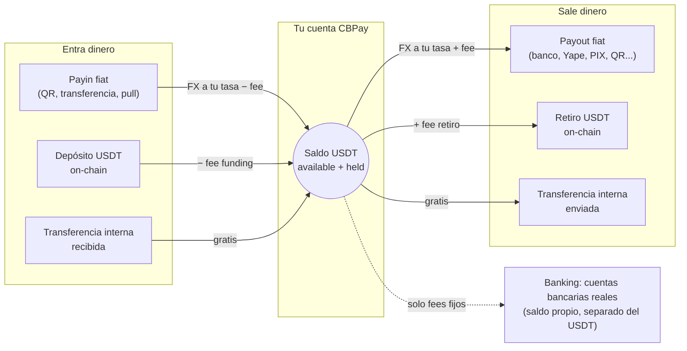

1. CBPay te da acceso: registro con email/contraseña
   o una API key directa.
2. Fondeas tu cuenta: con un payin fiat o un depósito USDT on-chain.
3. Operas: payouts, transferencias, retiros — todo se debita y acredita
   sobre tu saldo USDT con conversión FX al momento.
4. Te enteras de todo: cada movimiento queda en un historial inmutable
   (`GET /v1/movements`) y los eventos llegan a tus webhooks.

### URL base

```
https://api.qbank.cl/platform
```

Todas las rutas de esta documentación son relativas a esa URL base.

> **Nota**
Los montos son siempre **strings decimales** (ej. `"10.500000"`), nunca
números flotantes. Los saldos usan 6 decimales (precisión USDT).
### Siguientes pasos

### Crea tu cuenta y token

Sigue el [inicio rápido](#inicio-rapido) para registrarte y hacer tu
primera llamada.
### Entiende el modelo de dinero

Lee [modelo de dinero](#modelo-de-dinero) y
[comisiones](#comisiones).
### Integra tu primer producto

Empieza por [payouts](#payouts) o [payins](#payins).


## Inicio rápido

*De cero a tu primer payout en cinco pasos*

Antes de empezar, los datos que vas a necesitar en todos lados:

| Dato | Valor |
|---|---|
| **URL base** | `https://api.qbank.cl/platform` |
| **Autenticación** | Header `Authorization: Bearer <token>` (o `X-API-Key`) |
| **Slug de organización** | `cbpay` (para registro y login) |
| **Moneda del saldo** | USDT, 6 decimales, siempre como string (`"52.618258"`) |
| **Ambiente** | Producción directa — no hay sandbox; prueba con montos pequeños |

> **Nota**
Si CBPay ya te creó la cuenta y te entregó una API key `pk_...`, salta
directo al paso 3. ¿Dudas típicas? Están respondidas en las
[preguntas frecuentes](#preguntas-frecuentes).
### Regístrate

Crea tu cuenta (persona o empresa — mismo endpoint, cambia `type`):

```bash Persona
curl -X POST https://api.qbank.cl/platform/v1/auth/register \
  -H "Content-Type: application/json" \
  -d '{
    "org": "cbpay",
    "type": "person",
    "email": "ana@ejemplo.com",
    "password": "una-clave-segura",
    "display_name": "Ana Pérez",
    "country": "CL"
  }'
```

```bash Empresa
curl -X POST https://api.qbank.cl/platform/v1/auth/register \
  -H "Content-Type: application/json" \
  -d '{
    "org": "cbpay",
    "type": "company",
    "email": "legal@andina.cl",
    "password": "una-clave-segura",
    "display_name": "Comercial Andina SpA",
    "tax_id": "76.543.210-8",
    "country": "CL"
  }'
```

La respuesta incluye tu `access_token` (sesión de 24 horas):

```json
{
  "account": { "id": "…", "type": "person", "kyc_status": "none", "…": "…" },
  "access_token": "eyJhbGciOiJIUzI1NiIs…",
  "expires_at": "2026-07-08T00:00:00Z"
}
```

### Autentícate en cada llamada

Envía el token en el header `Authorization`:

```bash
curl https://api.qbank.cl/platform/v1/me \
  -H "Authorization: Bearer <access_token>"
```

Para integraciones servidor-a-servidor, emite una **API key permanente** con
`POST /v1/api-keys` — se muestra una sola vez. Más detalles en
[autenticación](#autenticacion).

### Consulta tu saldo

```bash
curl https://api.qbank.cl/platform/v1/balances \
  -H "Authorization: Bearer <token>"
```

```json
{
  "account_id": "…",
  "balances": [
    { "asset": "USDT", "available": "0.000000", "held": "0.000000" }
  ]
}
```

Para operar necesitas fondos: crea un [payin](#payins) o deposita
USDT on-chain con [crypto funding](#crypto-wallets-depositos-y-retiros).

### Revisa tasas y comisiones

Antes de un payout, consulta la tasa FX vigente y tus comisiones efectivas:

```bash
curl https://api.qbank.cl/platform/v1/rates \
  -H "Authorization: Bearer <token>"
```

```json
{
  "base": "USD",
  "rates": {
    "chile": { "currency": "CLP", "rate": "950.25" },
    "mexico": { "currency": "MXN", "rate": "17.50" },
    "bolivia": { "currency": "BOB", "rate": "6.91" }
  },
  "fees": [
    { "service": "payout", "country": "CL", "percent": "0", "fixed": "0.50" }
  ],
  "updated_at": "2026-07-07T12:00:00Z"
}
```

Las tasas ya incluyen tu margen FX, así que puedes estimar el costo antes
de crear: `usdt_amount ≈ monto_local / rate` (redondeo hacia arriba) y
`total_debit = usdt_amount + fijo`.

### Crea tu primer payout

```bash
curl -X POST https://api.qbank.cl/platform/v1/payouts \
  -H "Authorization: Bearer <token>" \
  -H "Content-Type: application/json" \
  -d '{
    "country": "CL",
    "currency": "CLP",
    "method": "bank_transfer",
    "amount": "50000",
    "beneficiary": {
      "name": "Juan Soto",
      "rut": "12345678-9",
      "bank_code": "012",
      "account_type": "checking",
      "account_number": "001122334455"
    },
    "description": "Pago proveedor",
    "idempotency_key": "mi-pago-0001"
  }'
```

Respuesta `202 Accepted` — el payout queda `processing` y el estado final
llega por [webhook](#webhooks) (`payout_status_changed`):

```json
{
  "payout_id": "…",
  "status": "processing",
  "local_amount": "50000",
  "fx_rate": "950.25",
  "usdt_amount": "52.618258",
  "fee": "0.500000",
  "total_debit": "53.118258"
}
```

> **Importante**
Los campos de `beneficiary` dependen del país y método. Consulta
`GET /v1/payouts/methods` y `GET /v1/payouts/banks?country=CL` para conocer
los requisitos de cada corredor.
### ¿Y ahora?

- [Suscríbete a webhooks](#webhooks) para recibir los cambios de estado.
- Revisa el [modelo de dinero](#modelo-de-dinero) para entender
  débitos, holds y reembolsos.
- Explora la **API Reference** completa con playground interactivo.


## Autenticación

*Sesiones JWT, API keys y niveles de acceso*

Todas las llamadas (salvo registro y login) requieren una credencial en el
header `Authorization`:

```
Authorization: Bearer <token>
```

También se acepta `X-API-Key: <token>` como header alternativo.

### Tipos de credencial

#### Sesión JWT (personas con login)

Se obtiene con `POST /v1/auth/register` o `POST /v1/auth/login` y dura
**24 horas**. Pensada para apps con usuarios que inician sesión.

```bash
curl -X POST https://api.qbank.cl/platform/v1/auth/login \
  -H "Content-Type: application/json" \
  -d '{ "org": "cbpay", "email": "ana@ejemplo.com", "password": "…" }'
```

```json
{
  "access_token": "eyJ…",
  "expires_at": "2026-07-08T00:00:00Z",
  "account_id": "…",
  "role": "owner"
}
```

Las cuentas empresa pueden tener varios **miembros** con roles `owner`,
`operator` o `viewer` (`POST /v1/members`).

#### API key (servidor a servidor)

Formato `pk_<key_id>.<secret>`. No expira y no depende de una sesión.
Se emite con:

```bash
curl -X POST https://api.qbank.cl/platform/v1/api-keys \
  -H "Authorization: Bearer <token-de-sesion>" \
  -H "Content-Type: application/json" \
  -d '{ "label": "backend-produccion" }'
```

```json
{
  "api_key_id": "…",
  "key_id": "a1b2c3d4e5f60718",
  "token": "pk_a1b2c3d4e5f60718.XXXXXXXX…",
  "note": "store this token now; it cannot be retrieved again"
}
```

> **Importante**
El token en claro se muestra **una sola vez**. En el servidor solo se guarda
un hash — si lo pierdes, emite una key nueva.
### Nivel de acceso

Tu credencial (JWT de sesión o API key) opera **tu propia cuenta**: saldos,
payouts, payins, transferencias, crypto, KYC/KYB y webhooks propios. Si un
endpoint responde `403 account_required` o `403 org_admin_required`, esa
operación corresponde a otro nivel de credencial — contacta al equipo de
CBPay.

### Buenas prácticas

- Guarda las API keys en un gestor de secretos; nunca en el código ni en el
  navegador.
- Usa una key por ambiente/servicio (`label` descriptivo) para poder rotar
  sin downtime.
- Las sesiones JWT son para front-ends; para procesos automatizados usa
  siempre API keys.


# Conceptos


## Modelo de dinero

*Saldos USDT, conversión FX, holds y el ledger inmutable*

### Un solo saldo: USDT

Cada cuenta tiene un saldo virtual en **USDT con 6 decimales**. Todas las
operaciones — payouts en pesos chilenos, cobros en soles, retiros on-chain —
se liquidan contra ese único saldo.

Los montos viajan siempre como **strings decimales**:

```json
{ "asset": "USDT", "available": "125.430000", "held": "10.000000" }
```

> **Nota**
Internamente los montos se almacenan como enteros en micro-USDT
(1 USDT = 1.000.000 unidades) y se calculan con aritmética racional exacta.
Nunca hay floats ni errores de redondeo acumulados.
### `available` y `held`

| Campo | Significado |
|---|---|
| `available` | Saldo disponible para operar |
| `held` | Reservado por operaciones en vuelo (payouts y retiros pendientes) |

Cuando creas un payout o retiro, el débito (`monto + comisión`) sale de
`available` y queda en `held` hasta que la operación llega a estado final:

- **`completed`** → el hold se consume; el dinero salió.
- **`failed`** → se reembolsa el débito completo (monto + comisión) a
  `available`.

### Conversión FX (fiat ↔ USDT)

Las operaciones fiat se convierten a USDT con **la tasa de tu cuenta** al
momento de ejecutar (la misma que devuelve `GET /v1/rates`, base USD). La
conversión redondea **hacia arriba** en el débito, con una diferencia
máxima de 1 micro-USDT.

Ejemplo de un payout de 50.000 CLP con tasa 950.25:

```
usdt_amount = ceil(50000 / 950.25 × 10^6) / 10^6 = 52.618258 USDT
total_debit = usdt_amount + fee
```

La tasa usada queda registrada en el objeto (`fx_rate`) para auditoría.

### Ledger inmutable

Cada movimiento genera una entrada inmutable con saldo resultante
(`balance_after`). Tu historial completo está en `GET /v1/movements`:

| `type` | Qué representa |
|---|---|
| `payin_credit` | Abono de un cobro fiat |
| `payout_debit` / `payout_refund` | Débito de payout / reembolso si falló |
| `transfer_in` / `transfer_out` | Transferencia interna recibida / enviada |
| `funding` | Depósito USDT on-chain acreditado |
| `withdrawal_debit` / `withdrawal_refund` | Retiro on-chain / reembolso si falló |
| `compliance_fee` / `compliance_refund` | Cargo por servicio KYC/KYB / reembolso |
| `wallet_creation_fee` / `wallet_creation_refund` | Cargo por creación de wallet / reembolso |
| `adjustment` | Ajuste manual de CBPay (auditado) |

```bash
curl "https://api.qbank.cl/platform/v1/movements?type=payout_debit&from=2026-07-01&to=2026-07-07&page_size=20" \
  -H "Authorization: Bearer <token>"
```

Todos los listados (`/v1/movements`, `/v1/payouts`, `/v1/payins`,
`/v1/crypto/transactions`, `/v1/banking/operations`) aceptan paginación
(`page`, `page_size` hasta 200) y filtros de fecha `from`/`to`
(YYYY-MM-DD, UTC, inclusive).

### Estados de operación

Payouts y retiros crypto siguen el mismo ciclo:

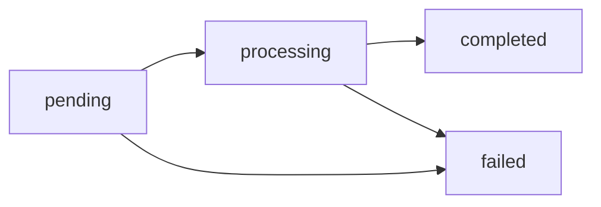

Los estados finales (`completed`/`failed`) llegan por
[webhook](#webhooks); no es necesario hacer polling.


## Comisiones

*Cómo se cobra cada servicio y dónde ver tus condiciones*

Las comisiones las configura CBPay por **servicio, país y activo**.
Si no hay nada configurado para una combinación, la comisión es **0**.

### Cómo se cobran los payouts

El pricing de un payout está en **tu tipo de cambio**: la tasa que ves en
`GET /v1/rates` es tu tasa, y es exactamente la que se usa al ejecutar. Si
dispersas el equivalente a 100 USDT, se debitan **100 USDT + el fijo** (si
tu cuenta lo tiene configurado) — sin porcentajes aparte:

```
usdt_amount = monto_local / tu_rate
total_debit = usdt_amount + fixed_amount
```

Lo que recibe el beneficiario en moneda local depende de la tasa de tu
cuenta para ese país. Cotizado = cobrado, siempre.

### Servicios con comisión fija u porcentual

| Servicio | Cómo se cobra | Cuándo |
|---|---|---|
| `payout` | Fijo por operación (el pricing FX ya está en tu tasa) | Al crear el payout (incluido en `total_debit`) |
| `payin` | `%` sobre el USDT bruto + fijo | Al acreditar (recibes `usdt_gross − fee`) |
| `funding` | `%` sobre el depósito + fijo | Al acreditar el depósito on-chain |
| `withdrawal` | `%` sobre el retiro + fijo | Al crear el retiro (incluido en `total_debit`) |
| `wallet_creation` | Fijo por wallet | Al crear cada wallet (personas: 1 por red; empresas: ilimitadas). Consultar wallets existentes es siempre gratis |
| `compliance_person` | Fijo por llamada | Al enviar el KYC de una persona |
| `compliance_company` | Fijo por llamada | Al enviar el KYB de una empresa |
| `compliance_rescreen` | Fijo por llamada | Al re-ejecutar un screening |
| `compliance_monitoring` | Fijo por activación | Al activar monitoreo continuo (desactivar es gratis) |
| `banking_customer` | Fijo por perfil | Al crear tu perfil bancario ([banking](#banking)) |
| `banking_account` | Fijo por cuenta | Al abrir cada cuenta bancaria |
| `banking_operation` | Fijo por pago | Al enviar cada pago bancario (cotizar con `prepare` es gratis) |

Para los servicios con `%`, la fórmula es
`fee = ceil(monto × percent / 100) + fixed_amount` (redondeo hacia arriba al
micro-USDT).

> **Nota**
Los cargos fijos standalone (compliance, creación de wallets y banking) se
reembolsan automáticamente si la operación falla aguas arriba
(`compliance_refund` / `wallet_creation_refund` / `banking_fee_refund`).
### Transferencias internas: siempre gratis

Las transferencias entre cuentas CBPay (`POST /v1/transfers`) **no tienen
comisión**, sin importar la combinación: persona↔persona, persona↔empresa o
empresa↔empresa. El dinero se mueve dentro del ecosistema.

### Tu tipo de cambio

`GET /v1/rates` devuelve **el tipo de cambio propio de tu cuenta** en cada
país — la misma tasa con la que se ejecutan tus operaciones, sin sorpresas:
`monto_local / rate = USDT`.

### Consulta tus condiciones

`GET /v1/rates` devuelve, junto a tus tasas, la configuración de comisiones
vigente para tu cuenta:

```json
{
  "base": "USD",
  "rates": { "chile": { "currency": "CLP", "rate": "950.25" } },
  "fees": [
    {
      "service": "payout",
      "country": "CL",
      "asset": "USDT",
      "percent": "0",
      "fixed_amount": "0.30"
    }
  ]
}
```

La comisión cobrada queda siempre explícita en la respuesta de cada
operación (campo `fee`) y en el ledger.

### Ejemplo completo

Payout equivalente a 100 USDT con `fixed_amount: "0.30"`:

```
usdt_amount = 100 USDT           (monto_local / tu_rate)
fee         = 0.30 USDT          (fijo)
total_debit = 100.30 USDT
```

El beneficiario recibe el monto local completo que indicaste; a ti se te
debita el equivalente a tu tasa más el fijo.


## Idempotencia

*Reintenta con seguridad sin duplicar operaciones*

Toda operación que mueve dinero exige una **clave de idempotencia**:

- `POST /v1/payouts`
- `POST /v1/transfers`
- `POST /v1/crypto/withdrawals`
- `POST /v1/accounts/{id}/adjustments` (admin, opcional pero recomendada)

### Cómo enviarla

Dos formas equivalentes (si mandas ambas, gana el body):

```bash Body
curl -X POST …/v1/payouts \
  -d '{ "idempotency_key": "pago-nomina-2026-07-001", … }'
```

```bash Header
curl -X POST …/v1/payouts \
  -H "Idempotency-Key: pago-nomina-2026-07-001" \
  -d '{ … }'
```

Si la omites recibes `400 idempotency_key_required`.

### Qué pasa al reintentar

La clave es única por **cuenta origen**. Si repites una llamada con la misma
clave:

- No se crea una operación nueva ni se mueve dinero otra vez.
- Recibes `200 OK` (en vez de `201`/`202`) con el objeto original más el
  campo `idempotency_hit: true`.

```json
{
  "payout_id": "el-mismo-de-la-primera-vez",
  "status": "processing",
  "idempotency_hit": true
}
```

### ¿Con qué clave reintento?

La regla de decisión completa, para no dudar nunca:

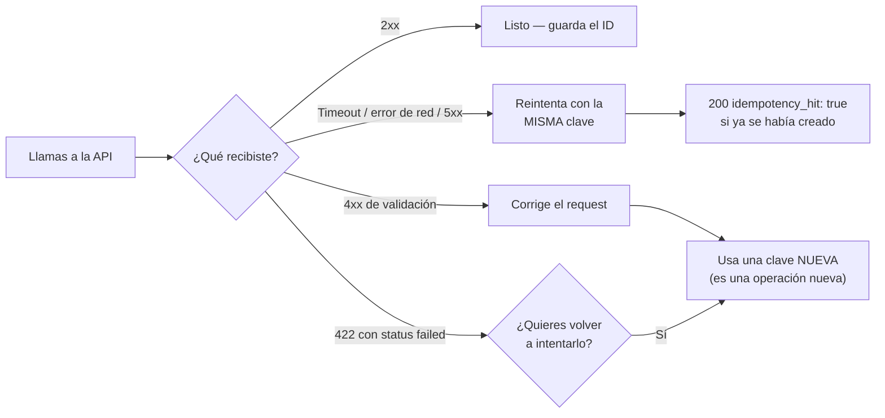

### Recomendaciones

- Usa un identificador de **tu** sistema (ID de orden, de nómina, etc.), no
  un timestamp ni un UUID generado al vuelo en cada retry.
- Guarda la clave antes de llamar a la API; así puedes reintentar tras un
  timeout con garantía de no duplicar.
- Ante un error de red o `5xx`, **reintenta con la misma clave**. Ante un
  `4xx` de validación, corrige el request y usa una clave nueva.


# Productos


## Payouts

*Dispersa fiat a cuentas bancarias locales debitando tu saldo USDT*

Un payout envía dinero en moneda local a una cuenta bancaria del país
destino. El monto se convierte de moneda local a USDT con **la tasa de tu
cuenta** (la de `GET /v1/rates`) y se debita `usdt_amount + fee` (el fijo,
si está configurado) de tu saldo.

Así se ve el ciclo completo, incluido qué pasa con tu saldo en cada paso:

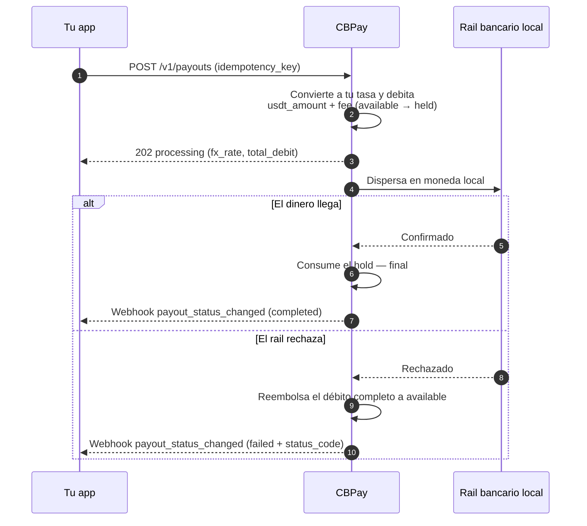

### 1. Descubre los corredores disponibles

Los países, monedas y métodos disponibles los define CBPay.
Consúltalos siempre por catálogo:

```bash
curl https://api.qbank.cl/platform/v1/payouts/methods \
  -H "Authorization: Bearer <token>"
```

```json
{
  "items": [
    { "country": "CL", "currency": "CLP", "method": "bank_transfer" },
    { "country": "PE", "currency": "PEN", "method": "bank_transfer" },
    { "country": "PE", "currency": "PEN", "method": "yape" },
    { "country": "BO", "currency": "BOB", "method": "qr" }
  ],
  "meta": { "retrieved": 4 }
}
```

Corredores y métodos disponibles:

| País | Moneda | Métodos |
|---|---|---|
| Chile | CLP | `bank_transfer` |
| Perú | PEN | `bank_transfer`, `yape` |
| México | MXN | `bank_transfer` (SPEI: CLABE o tarjeta de débito) |
| Venezuela | VES | `bank_transfer`, `pago_movil` |
| Bolivia | BOB / USD | `bank_transfer`, `qr` (ver [Payout QR](#payout-qr)) |
| Brasil | BRL | `pix` (por llave), `qr` (ver [Payout QR](#payout-qr)) |
| Paraguay | PYG | `bank_transfer` |

La disponibilidad puede variar; el catálogo (`GET /v1/payouts/methods`) es
siempre la fuente de verdad. Si un país tiene un solo método, `method` es
opcional. Todos los métodos se cobran igual: tu tasa + fijo.

Para transferencias bancarias necesitas además el catálogo de bancos (de
ahí sale el `bank_code` del beneficiario):

```bash
curl "https://api.qbank.cl/platform/v1/payouts/banks?country=CL" \
  -H "Authorization: Bearer <token>"
```

```json
{
  "items": [
    { "code": "001", "name": "Banco de Chile" },
    { "code": "012", "name": "Banco del Estado de Chile" },
    { "code": "016", "name": "Banco de Crédito e Inversiones" }
  ],
  "meta": { "retrieved": 3 }
}
```

### 2. Crea el payout

```bash
curl -X POST https://api.qbank.cl/platform/v1/payouts \
  -H "Authorization: Bearer <token>" \
  -H "Content-Type: application/json" \
  -d '{
    "country": "MX",
    "currency": "MXN",
    "method": "bank_transfer",
    "amount": "1500.00",
    "beneficiary": {
      "name": "María López",
      "account_type": "clabe",
      "account_number": "012180001234567895"
    },
    "description": "Pago factura 8841",
    "idempotency_key": "factura-8841"
  }'
```

> **Importante**
`beneficiary` es un objeto de pares clave/valor cuyos campos requeridos
dependen del corredor (RUT y banco en Chile, CLABE en México, CCI en Perú,
llave PIX en Brasil, etc.). El catálogo de métodos documenta los campos de
cada uno.
Respuesta `202 Accepted`:

```json
{
  "payout_id": "0d4f…",
  "account_id": "…",
  "idempotency_key": "factura-8841",
  "country": "MX",
  "currency": "MXN",
  "method": "bank_transfer",
  "local_amount": "1500.00",
  "fx_rate": "17.50",
  "usdt_amount": "85.714286",
  "fee": "0.300000",
  "total_debit": "86.014286",
  "status": "processing",
  "created_at": "2026-07-06T20:00:00Z"
}
```

En ese momento tu saldo ya refleja el débito: `total_debit` pasó de
`available` a `held`.

### 3. Recibe el estado final

Suscríbete al evento `payout_status_changed` ([webhooks](#webhooks)):

```json
{
  "payout_id": "0d4f…",
  "account_id": "…",
  "country": "MX",
  "currency": "MXN",
  "local_amount": "1500.00",
  "usdt_amount": "85.714286",
  "total_debit": "86.014286",
  "status": "completed",
  "status_code": ""
}
```

- **`completed`**: el dinero llegó; el hold se consume.
- **`failed`**: se reembolsa el débito completo automáticamente
  (`payout_refund` en tu ledger).

También puedes consultar en cualquier momento:

```bash
curl https://api.qbank.cl/platform/v1/payouts/0d4f… \
  -H "Authorization: Bearer <token>"
```

#### Estados del payout

| Estado | Significado | ¿Tu saldo? |
|---|---|---|
| `processing` | Aceptado y en ejecución en el rail local | Débito retenido en `held` |
| `completed` | El dinero llegó al beneficiario | Hold consumido — final |
| `failed` | El corredor lo rechazó o falló | **Reembolso automático completo** (monto + comisión) |

### Ejemplos por país

Cada corredor con su `beneficiary` real y la respuesta que recibes. Las
tasas (`fx_rate`) son ilustrativas — siempre aplican las de tu cuenta en
`GET /v1/rates`. En todos los casos el débito es
`usdt_amount + fee` (fijo, si está configurado; aquí `0.30`).

#### Chile

Transferencia bancaria en CLP. Requiere RUT, banco y cuenta:

```bash
curl -X POST https://api.qbank.cl/platform/v1/payouts \
  -H "Authorization: Bearer <token>" \
  -H "Content-Type: application/json" \
  -d '{
    "country": "CL",
    "currency": "CLP",
    "method": "bank_transfer",
    "amount": "100000",
    "beneficiary": {
      "name": "Pedro Soto Fuentes",
      "tax_id": "12.345.678-5",
      "bank_code": "012",
      "account_type": "checking",
      "account_number": "123456789"
    },
    "description": "Pago proveedor",
    "idempotency_key": "cl-prov-0091"
  }'
```

```json
{
  "payout_id": "b3e1…",
  "country": "CL",
  "currency": "CLP",
  "method": "bank_transfer",
  "local_amount": "100000",
  "fx_rate": "925.69",
  "usdt_amount": "108.027528",
  "fee": "0.300000",
  "total_debit": "108.327528",
  "status": "processing"
}
```

El catálogo de bancos (`GET /v1/payouts/banks?country=CL`) da los
`bank_code` vigentes.

#### Perú

Dos métodos: transferencia bancaria (CCI interbancario) y **Yape** (al
número de teléfono).

```bash bank_transfer (CCI)
curl -X POST https://api.qbank.cl/platform/v1/payouts \
  -H "Authorization: Bearer <token>" \
  -H "Content-Type: application/json" \
  -d '{
    "country": "PE",
    "currency": "PEN",
    "method": "bank_transfer",
    "amount": "1000.00",
    "beneficiary": {
      "name": "Rosa Álvarez Díaz",
      "account_number": "00219300123456789012"
    },
    "idempotency_key": "pe-cci-3310"
  }'
```

```bash yape (teléfono)
curl -X POST https://api.qbank.cl/platform/v1/payouts \
  -H "Authorization: Bearer <token>" \
  -H "Content-Type: application/json" \
  -d '{
    "country": "PE",
    "currency": "PEN",
    "method": "yape",
    "amount": "150.00",
    "beneficiary": {
      "name": "Luis Ramos Vega",
      "phone": "51987654321"
    },
    "idempotency_key": "pe-yape-8874"
  }'
```

```json
{
  "payout_id": "c7a2…",
  "country": "PE",
  "currency": "PEN",
  "method": "yape",
  "local_amount": "150.00",
  "fx_rate": "3.40",
  "usdt_amount": "44.117648",
  "fee": "0.300000",
  "total_debit": "44.417648",
  "status": "completed"
}
```

En `yape` el teléfono va en formato `51XXXXXXXXX` (11 dígitos con código de
país). El resultado suele ser síncrono.

#### México

SPEI en MXN, a CLABE (18 dígitos) o a tarjeta de débito:

```bash CLABE
curl -X POST https://api.qbank.cl/platform/v1/payouts \
  -H "Authorization: Bearer <token>" \
  -H "Content-Type: application/json" \
  -d '{
    "country": "MX",
    "currency": "MXN",
    "method": "bank_transfer",
    "amount": "1500.00",
    "beneficiary": {
      "name": "María López",
      "account_type": "clabe",
      "account_number": "012180001234567895"
    },
    "idempotency_key": "mx-clabe-8841"
  }'
```

```bash Tarjeta de débito
curl -X POST https://api.qbank.cl/platform/v1/payouts \
  -H "Authorization: Bearer <token>" \
  -H "Content-Type: application/json" \
  -d '{
    "country": "MX",
    "currency": "MXN",
    "method": "bank_transfer",
    "amount": "800.00",
    "beneficiary": {
      "name": "Jorge Herrera",
      "account_type": "debit_card",
      "account_number": "4152313412341234",
      "bank_code": "40012"
    },
    "idempotency_key": "mx-card-1102"
  }'
```

```json
{
  "payout_id": "0d4f…",
  "country": "MX",
  "currency": "MXN",
  "method": "bank_transfer",
  "local_amount": "1500.00",
  "fx_rate": "17.50",
  "usdt_amount": "85.714286",
  "fee": "0.300000",
  "total_debit": "86.014286",
  "status": "processing"
}
```

Con CLABE el banco destino se deriva de los primeros dígitos; con tarjeta
es obligatorio `bank_code`.

#### Venezuela

Dos métodos: **Pago Móvil** (teléfono + banco + cédula) y transferencia
bancaria (cuenta de 20 dígitos):

```bash pago_movil
curl -X POST https://api.qbank.cl/platform/v1/payouts \
  -H "Authorization: Bearer <token>" \
  -H "Content-Type: application/json" \
  -d '{
    "country": "VE",
    "currency": "VES",
    "method": "pago_movil",
    "amount": "2000.00",
    "beneficiary": {
      "phone": "04141234567",
      "bank_code": "0102",
      "document_value": "V12345678"
    },
    "idempotency_key": "ve-pm-5567"
  }'
```

```bash bank_transfer
curl -X POST https://api.qbank.cl/platform/v1/payouts \
  -H "Authorization: Bearer <token>" \
  -H "Content-Type: application/json" \
  -d '{
    "country": "VE",
    "currency": "VES",
    "method": "bank_transfer",
    "amount": "5000.00",
    "beneficiary": {
      "name": "Carmen Delgado",
      "account_number": "01020123456789012345",
      "document_value": "V87654321"
    },
    "idempotency_key": "ve-bank-7810"
  }'
```

```json
{
  "payout_id": "e9b4…",
  "country": "VE",
  "currency": "VES",
  "method": "pago_movil",
  "local_amount": "2000.00",
  "fx_rate": "666.00",
  "usdt_amount": "3.003004",
  "fee": "0.300000",
  "total_debit": "3.303004",
  "status": "completed"
}
```

`bank_code` usa códigos SUDEBAN; en `bank_transfer` puede derivarse de los
primeros 4 dígitos de la cuenta.

#### Bolivia

Transferencia ACH en BOB o USD (además del [QR](#payout-qr)):

```bash
curl -X POST https://api.qbank.cl/platform/v1/payouts \
  -H "Authorization: Bearer <token>" \
  -H "Content-Type: application/json" \
  -d '{
    "country": "BO",
    "currency": "BOB",
    "method": "bank_transfer",
    "amount": "1382.00",
    "beneficiary": {
      "name": "Juan Quispe Mamani",
      "tax_id": "4567890",
      "bank_code": "1016",
      "account_number": "1234567890"
    },
    "idempotency_key": "bo-ach-2204"
  }'
```

```json
{
  "payout_id": "f2c8…",
  "country": "BO",
  "currency": "BOB",
  "method": "bank_transfer",
  "local_amount": "1382.00",
  "fx_rate": "6.91",
  "usdt_amount": "200.000000",
  "fee": "0.300000",
  "total_debit": "200.300000",
  "status": "processing"
}
```

Para USD envía `currency: "USD"` con la misma estructura.

#### Brasil

PIX por llave (además del [QR PIX](#payout-qr)):

```bash
curl -X POST https://api.qbank.cl/platform/v1/payouts \
  -H "Authorization: Bearer <token>" \
  -H "Content-Type: application/json" \
  -d '{
    "country": "BR",
    "currency": "BRL",
    "method": "pix",
    "amount": "350.00",
    "beneficiary": {
      "name": "João da Silva",
      "tax_id": "123.456.789-09",
      "pix_key_type": "cpf",
      "pix_key": "12345678909"
    },
    "idempotency_key": "br-pix-3321"
  }'
```

```json
{
  "payout_id": "a6d1…",
  "country": "BR",
  "currency": "BRL",
  "method": "pix",
  "local_amount": "350.00",
  "fx_rate": "5.13",
  "usdt_amount": "68.226121",
  "fee": "0.300000",
  "total_debit": "68.526121",
  "status": "processing"
}
```

`pix_key_type`: `cpf`, `cnpj`, `phone`, `email` o `evp` (llave aleatoria).

#### Paraguay

Transferencia bancaria en PYG:

```bash
curl -X POST https://api.qbank.cl/platform/v1/payouts \
  -H "Authorization: Bearer <token>" \
  -H "Content-Type: application/json" \
  -d '{
    "country": "PY",
    "currency": "PYG",
    "method": "bank_transfer",
    "amount": "500000",
    "beneficiary": {
      "name": "Sofía Benítez",
      "tax_id": "4123456",
      "bank_code": "0011",
      "account_number": "600123456"
    },
    "idempotency_key": "py-bank-9917"
  }'
```

```json
{
  "payout_id": "d4e7…",
  "country": "PY",
  "currency": "PYG",
  "method": "bank_transfer",
  "local_amount": "500000",
  "fx_rate": "6055.76",
  "usdt_amount": "82.566020",
  "fee": "0.300000",
  "total_debit": "82.866020",
  "status": "processing"
}
```

`name` acepta hasta 35 caracteres en este corredor.

### Payout QR

En Bolivia (QR interoperable local) y Brasil (QR PIX) también puedes
**pagar a un QR de cobro** en dos pasos: escanear y confirmar. El escaneo
es **gratis**; solo se cobra al confirmar, igual que un payout normal (tu
tasa + fijo). Si no envías `country`/`currency`, se asume Bolivia (BOB);
para Brasil envía `country: "BR"` y `currency: "BRL"`.

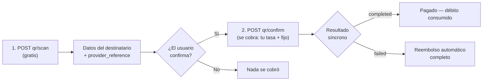

#### 1. Escanea el QR (gratis)

```bash
curl -X POST https://api.qbank.cl/platform/v1/payouts/qr/scan \
  -H "Authorization: Bearer <token>" \
  -H "Content-Type: application/json" \
  -d '{
    "qr_payload": "<contenido del QR>",
    "currency": "BOB"
  }'
```

Devuelve los datos del destinatario para que el usuario confirme a quién le
paga:

```json
{
  "scan_id": "…",
  "provider_reference": "…",
  "beneficiary_name": "Juan Quispe",
  "destination_account": "…",
  "amount": "700.00",
  "currency": "BOB",
  "glosa": "",
  "status": "…"
}
```

#### 2. Confirma el pago (se cobra aquí)

```bash
curl -X POST https://api.qbank.cl/platform/v1/payouts/qr/confirm \
  -H "Authorization: Bearer <token>" \
  -H "Content-Type: application/json" \
  -d '{
    "provider_reference": "<del scan>",
    "amount": "700.00",
    "currency": "BOB",
    "description": "Pago QR almuerzo",
    "idempotency_key": "qr-2026-07-07-a"
  }'
```

- Se debita `usdt_amount + fijo` a **tu tasa**, igual que un
  `bank_transfer`.
- El resultado es **síncrono**: la respuesta ya trae el estado final
  (`completed` o `failed` con reembolso automático) — sin esperas.
- Un mismo QR escaneado solo puede pagarse una vez; reintentos con la misma
  `idempotency_key` devuelven el payout original.
- En Brasil, `qr_payload` acepta el contenido del QR o el código
  "copia e cola" de PIX; el mismo flujo cubre QR estáticos y dinámicos.

### Errores frecuentes

| HTTP | `error` | Qué hacer |
|---|---|---|
| 400 | `idempotency_key_required` | Envía la clave en body o header |
| 400 | `beneficiary_required` | Incluye el objeto `beneficiary` |
| 402 | `insufficient_funds` | Fondea la cuenta; el payout no se creó |
| 403 | `account_blocked` | La cuenta no está activa; contacta al equipo de CBPay |
| 422 | `currency_not_supported` | No hay tasa FX para esa moneda |
| 422 | (payout con `status: failed`) | El corredor rechazó los datos; el débito ya fue reembolsado — corrige `beneficiary` y reintenta con clave nueva |

### Rechazo inmediato vs fallo posterior

Si el procesador rechaza el payout al crearlo, recibes `422` con el objeto
en `status: failed` y el reembolso ya aplicado. Si falla después (por
ejemplo, cuenta destino inexistente detectada por el banco), te llega el
webhook con `status: failed` y el reembolso automático en ese momento.


## Payins

*Cobra en moneda local y recibe el abono en USDT*

Un payin es un cobro fiat: tu cliente paga en moneda local y tu cuenta
recibe el abono en USDT automáticamente (convertido a la tasa del momento,
menos la comisión de payin).

Sea cual sea la modalidad, todos los caminos terminan igual — abono
automático + webhook:

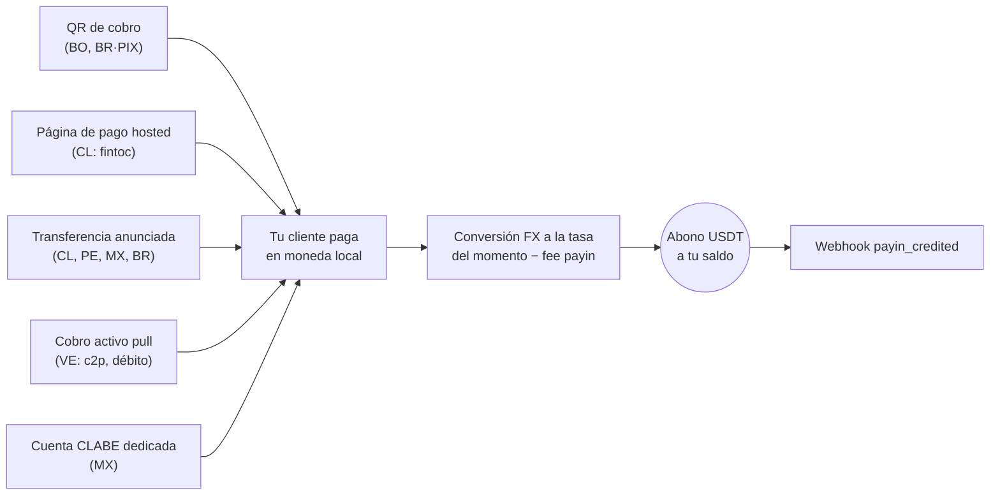

### 1. Descubre los corredores disponibles

Los países, monedas y modalidades disponibles los define CBPay.
Consúltalos siempre por catálogo:

```bash
curl https://api.qbank.cl/platform/v1/payins/methods \
  -H "Authorization: Bearer <token>"
```

```json
{
  "items": [
    { "country": "BO", "currency": "BOB", "method": "qr", "delivery": "push" },
    { "country": "VE", "currency": "VES", "method": "c2p", "delivery": "push+polling" },
    { "country": "MX", "currency": "MXN", "method": "bank_transfer", "delivery": "push" }
  ],
  "meta": { "retrieved": 3 }
}
```

`delivery` indica cómo se confirma el pago del lado de CBPay (notificación
del banco, sondeo o ambos) — no cambia nada en tu integración: tú siempre
recibes el webhook `payin_credited`.

Corredores y modalidades de cobro:

| País | Moneda | Modalidades |
|---|---|---|
| Chile | CLP | Página de pago hosted (`fintoc`), transferencia anunciada |
| Perú | PEN | Transferencia anunciada |
| México | MXN | Cuenta CLABE dedicada, transferencia anunciada |
| Venezuela | VES | Cobro activo `c2p` y `debito_inmediato` (pull) |
| Bolivia | BOB / USD | QR de cobro |
| Brasil | BRL | QR PIX dinámico, transferencia anunciada |

La disponibilidad puede variar; el catálogo (`GET /v1/payins/methods`) es
siempre la fuente de verdad. En todos los casos el abono llega igual: se
convierte a USDT a la tasa del momento y se acredita neto de la comisión
de payin.

### 2. Ejemplos por país

#### Chile

**Página de pago hosted (`fintoc`)** — recomendado: recibes una
`payment_url`; el pagador la abre y transfiere desde **cualquier banco o
billetera chilena** (Banco Estado, Santander, Mach, Tenpo, Mercado
Pago…). El pago se detecta y valida automáticamente — sin referencias
manuales.

```bash
curl -X POST https://api.qbank.cl/platform/v1/payins \
  -H "Authorization: Bearer <token>" \
  -H "Content-Type: application/json" \
  -d '{
    "country": "CL",
    "currency": "CLP",
    "method": "fintoc",
    "amount": "150000",
    "description": "Recarga pedido 8841",
    "idempotency_key": "topup-8841"
  }'
```

Respuesta `201`:

```json
{
  "payin_id": "7a2b…",
  "status": "pending",
  "reference": "7a2b…",
  "payment_url": "https://pay.fintoc.com/cs_li5531onlFDi235",
  "expires_at": "2026-07-08T18:48:25Z",
  "note": "share the payment_url with the payer; the deposit is credited automatically once the transfer is detected"
}
```

Comparte la `payment_url` con el pagador (link, redirección o WebView).
Cuando el pago se confirma, tu cuenta se acredita en USDT y recibes el
webhook `payin_credited`. El monto CLP debe ser entero (el peso chileno no
usa decimales) y la sesión de pago vence en 24 horas por defecto. Un retry
con la misma `idempotency_key` devuelve el mismo payin y la misma URL —
nunca abre una segunda sesión de pago.

**Transferencia anunciada** (alternativa manual): anuncias el depósito
entrante y compartes la referencia con quien transfiere.

```bash
curl -X POST https://api.qbank.cl/platform/v1/payins \
  -H "Authorization: Bearer <token>" \
  -H "Content-Type: application/json" \
  -d '{
    "country": "CL",
    "currency": "CLP",
    "method": "bank_transfer",
    "amount": "500000"
  }'
```

Respuesta `201`:

```json
{
  "payin_id": "4f81…",
  "status": "pending",
  "reference": "4f81…",
  "note": "include the reference in the transfer description so the deposit is credited automatically"
}
```

Cuando la transferencia llega, se matchea por la referencia en la glosa (o
por monto+moneda como respaldo) y tu cuenta se acredita automáticamente.

#### Perú

**Transferencia anunciada**, igual que Chile pero en soles:

```bash
curl -X POST https://api.qbank.cl/platform/v1/payins \
  -H "Authorization: Bearer <token>" \
  -H "Content-Type: application/json" \
  -d '{
    "country": "PE",
    "currency": "PEN",
    "method": "bank_transfer",
    "amount": "1800.00"
  }'
```

La respuesta trae la `reference` que debe viajar en la descripción de la
transferencia para el match automático.

#### México

**Cuenta CLABE dedicada** (recomendado): creas una CLABE fija vinculada a
tu cuenta — todo SPEI que llegue a ella se acredita automáticamente, sin
referencias:

```bash
curl -X POST https://api.qbank.cl/platform/v1/payins/deposit-accounts \
  -H "Authorization: Bearer <token>" \
  -H "Content-Type: application/json" \
  -d '{ "country": "MX", "currency": "MXN" }'
```

Respuesta `201`:

```json
{
  "instrument_id": "a1d4…",
  "account_id": "…",
  "country": "MX",
  "currency": "MXN",
  "method": "bank_transfer",
  "instrument": "734180000151000006",
  "status": "active"
}
```

`instrument` es la CLABE que compartes con tus pagadores. La creación es
gratis; cada depósito paga la comisión de payin normal. Lista tus cuentas
con `GET /v1/payins/deposit-accounts`.

También puedes usar la **transferencia anunciada** puntual
(`POST /v1/payins` con `method: "bank_transfer"`, `country: "MX"`).

#### Venezuela

**Cobro activo (pull)**: cobras directamente al pagador con su
autorización. El resultado es **síncrono** — si el cobro se aprueba, el
abono se acredita en la misma llamada.

Para `debito_inmediato`, primero solicita el OTP (gratis):

```bash
curl -X POST https://api.qbank.cl/platform/v1/payins/collect/otp \
  -H "Authorization: Bearer <token>" \
  -H "Content-Type: application/json" \
  -d '{
    "method": "debito_inmediato",
    "amount": "1200.00",
    "payer_document": "V12345678",
    "payer_phone": "04141234567",
    "payer_bank": "0102",
    "payer_account": "01020123456789012345"
  }'
```

```json
{
  "method": "debito_inmediato",
  "result": { "status": "sent", "otp_reference": "OTP-5521" }
}
```

Luego ejecuta el cobro:

```bash c2p (teléfono + cédula + OTP del pagador)
curl -X POST https://api.qbank.cl/platform/v1/payins/collect \
  -H "Authorization: Bearer <token>" \
  -H "Content-Type: application/json" \
  -d '{
    "method": "c2p",
    "amount": "1200.00",
    "description": "Cobro pedido 5512",
    "payer_document": "V12345678",
    "payer_phone": "04141234567",
    "payer_bank": "0102",
    "otp": "12345678",
    "idempotency_key": "cobro-5512"
  }'
```

```bash debito_inmediato (cuenta + OTP solicitado antes)
curl -X POST https://api.qbank.cl/platform/v1/payins/collect \
  -H "Authorization: Bearer <token>" \
  -H "Content-Type: application/json" \
  -d '{
    "method": "debito_inmediato",
    "amount": "1200.00",
    "description": "Cobro pedido 5512",
    "payer_document": "V12345678",
    "payer_account": "01020123456789012345",
    "payer_bank": "0102",
    "payer_account_type": "CNTA",
    "otp": "87654321",
    "otp_reference": "OTP-5521",
    "idempotency_key": "cobro-5512"
  }'
```

> **Nota**
El cobro activo ejecuta un débito real contra el pagador, así que
`idempotency_key` es **obligatoria** (body o header `Idempotency-Key`): un
reintento con la misma clave devuelve el resultado original con
`idempotency_hit` y nunca vuelve a cobrar.
Respuesta `200` (cobro aprobado y acreditado):

```json
{
  "payin_id": "7b3c…",
  "kind": "collect",
  "method": "c2p",
  "status": "credited",
  "local_amount": "1200.00",
  "fx_rate": "36.50",
  "usdt_gross": "32.876713",
  "fee": "0.328768",
  "usdt_credited": "32.547945",
  "paid": true,
  "provider_reference": "…"
}
```

Si el pagador rechaza o falla la autorización, `paid` es `false`, el payin
queda `failed` y no se cobra nada.

#### Bolivia

**QR de cobro** (estándar interoperable local): generas el QR y tu cliente
lo escanea con su app bancaria.

```bash
curl -X POST https://api.qbank.cl/platform/v1/payins \
  -H "Authorization: Bearer <token>" \
  -H "Content-Type: application/json" \
  -d '{
    "country": "BO",
    "currency": "BOB",
    "method": "qr",
    "amount": "700.00",
    "description": "Recarga app",
    "expires_in": 3600
  }'
```

Respuesta `201`:

```json
{
  "payin_id": "9c2a…",
  "status": "pending",
  "charge": {
    "charge_id": "…",
    "qr_image": "<base64>",
    "qr_payload": "<contenido del QR>",
    "our_reference": "482915073",
    "status": "pending"
  }
}
```

Muestra `qr_image` a tu cliente; cuando paga, tu cuenta se acredita
automáticamente. También funciona en USD (`currency: "USD"`).

#### Brasil

**QR PIX dinámico**: el mismo endpoint genera un QR PIX con el monto
embebido.

```bash
curl -X POST https://api.qbank.cl/platform/v1/payins \
  -H "Authorization: Bearer <token>" \
  -H "Content-Type: application/json" \
  -d '{
    "country": "BR",
    "currency": "BRL",
    "method": "qr",
    "amount": "120.00",
    "description": "Pedido 7719",
    "expires_in": 1800
  }'
```

En la respuesta, `charge.qr_payload` es el código **"copia e cola"** de
PIX, para que el pagador pueda pegarlo en su app bancaria si no escanea la
imagen (`charge.qr_image`).

También puedes usar la **transferencia anunciada**
(`method: "bank_transfer"`) compartiendo la referencia en la descripción
del PIX.

### 3. Recibe el abono

Cuando el pago llega (por cualquiera de las modalidades), tu cuenta se
acredita automáticamente y se emite el webhook `payin_credited`:

```json
{
  "payin_id": "9c2a…",
  "account_id": "…",
  "country": "BO",
  "currency": "BOB",
  "local_amount": "700.00",
  "fx_rate": "6.91",
  "usdt_credited": "100.310000",
  "fee": "1.000000"
}
```

El objeto payin queda con el detalle completo:

```bash
curl https://api.qbank.cl/platform/v1/payins/9c2a… \
  -H "Authorization: Bearer <token>"
```

```json
{
  "payin_id": "9c2a…",
  "kind": "qr",
  "status": "credited",
  "local_amount": "700.00",
  "fx_rate": "6.91",
  "usdt_gross": "101.310000",
  "fee": "1.000000",
  "usdt_credited": "100.310000"
}
```

### Estados

| Estado | Significado |
|---|---|
| `pending` | Cargo creado, esperando el pago |
| `credited` | Pago recibido y abonado en USDT |
| `unassigned` | Depósito recibido sin match automático (lo asigna el administrador) |
| `expired` | El cargo venció sin pago |
| `failed` | El cobro falló |

> **Nota**
Los depósitos que llegan por transferencia directa sin referencia clara
quedan `unassigned` hasta que el equipo de CBPay los asigna a una cuenta.
Al asignarse, se acreditan con las comisiones de la cuenta destino.


## Transferencias internas

*Mueve USDT entre cuentas CBPay, gratis y al instante*

Las transferencias internas mueven saldo entre dos cuentas **CBPay**, de
forma atómica en el ledger y **siempre sin comisión** — el dinero nunca sale
del ecosistema.

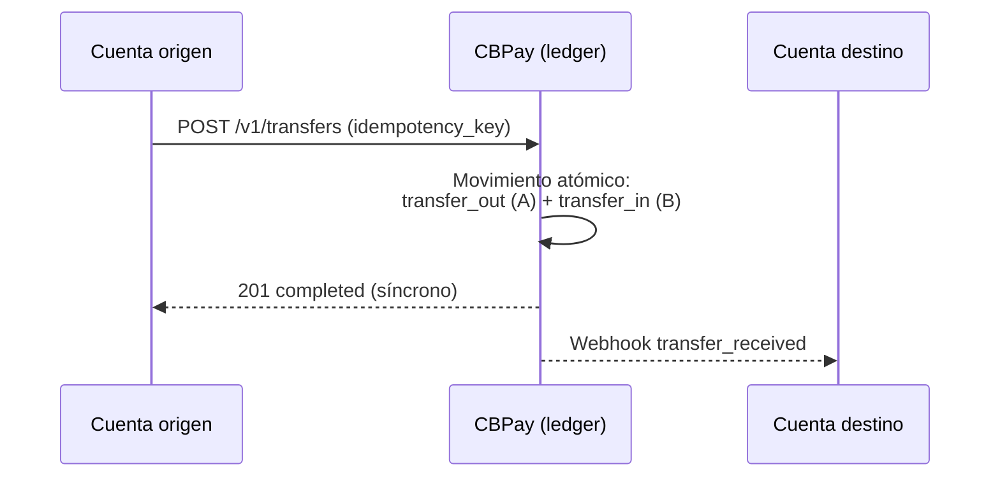

Funcionan entre **cualquier combinación de cuentas**:

| Origen | Destino | Comisión |
|---|---|---|
| Persona | Persona | 0 |
| Persona | Empresa | 0 |
| Empresa | Persona | 0 |
| Empresa | Empresa | 0 |

### Crear una transferencia

El destino se identifica por `to_account_id` **o** por `to_email`:

```bash Por email (persona → persona)
curl -X POST https://api.qbank.cl/platform/v1/transfers \
  -H "Authorization: Bearer <token>" \
  -H "Content-Type: application/json" \
  -d '{
    "to_email": "carlos@ejemplo.com",
    "amount": "25.000000",
    "description": "Split de gastos",
    "idempotency_key": "split-2026-07-06-a"
  }'
```

```bash Por account_id (persona → empresa)
curl -X POST https://api.qbank.cl/platform/v1/transfers \
  -H "Authorization: Bearer <token>" \
  -H "Content-Type: application/json" \
  -d '{
    "to_account_id": "ae8cf540-22a9-414d-82cc-8ac04732be4f",
    "amount": "120.500000",
    "description": "Pago servicio mensual",
    "idempotency_key": "serv-2026-07-a"
  }'
```

```bash Empresa → persona (nómina)
curl -X POST https://api.qbank.cl/platform/v1/transfers \
  -H "Authorization: Bearer <token de la empresa>" \
  -H "Content-Type: application/json" \
  -d '{
    "to_email": "empleado@ejemplo.com",
    "amount": "850.000000",
    "description": "Sueldo julio",
    "idempotency_key": "nomina-2026-07-emp01"
  }'
```

La forma del request es idéntica en todas las combinaciones (persona o
empresa, en cualquier dirección) — cambia solo la credencial que llama.

Respuesta `201` — la transferencia es **síncrona e inmediata**:

```json
{
  "transfer_id": "77b1…",
  "from_account_id": "…",
  "to_account_id": "…",
  "asset": "USDT",
  "amount": "25.000000",
  "description": "Split de gastos",
  "status": "completed",
  "created_at": "2026-07-06T20:10:00Z"
}
```

Replay con la misma `idempotency_key` — `200` con la transferencia
original:

```json
{
  "transfer_id": "77b1…",
  "amount": "25.000000",
  "status": "completed",
  "idempotency_hit": true
}
```

El receptor puede enterarse por el webhook `transfer_received` y ambos ven
el movimiento en su historial (`transfer_out` / `transfer_in`).

### Consultar transferencias

Lista las transferencias de tu cuenta (enviadas y recibidas), con
paginación y filtros de fecha:

```bash
curl "https://api.qbank.cl/platform/v1/transfers?from=2026-07-01&to=2026-07-07&page_size=50" \
  -H "Authorization: Bearer <token>"
```

O una en particular por su ID (solo visible para las dos partes):

```bash
curl https://api.qbank.cl/platform/v1/transfers/77b1… \
  -H "Authorization: Bearer <token>"
```

Cada fila trae `direction` (`sent` o `received`) desde tu perspectiva.

### Reglas

- Solo entre cuentas CBPay **activas**; las cuentas internas del sistema no
  pueden recibir.
- No puedes transferirte a ti mismo (`400 self_transfer`).
- Requiere `idempotency_key` (body o header `Idempotency-Key`); el replay
  devuelve `200` con `idempotency_hit: true`.
- `amount` acepta hasta 6 decimales.

### Errores

| HTTP | `error` | Causa |
|---|---|---|
| 400 | `recipient_required` | Falta `to_account_id` y `to_email` |
| 400 | `self_transfer` | Origen y destino son la misma cuenta |
| 402 | `insufficient_funds` | Saldo disponible insuficiente |
| 404 | `recipient_not_found` | El email/ID no corresponde a una cuenta CBPay |
| 422 | `recipient_unavailable` | La cuenta destino está bloqueada/cerrada |


## Crypto: wallets, depósitos y retiros

*Crea wallets on-chain, deposita, transfiere y consulta movimientos*

Tu saldo USDT vive conectado a la blockchain. Redes soportadas: **TRON**
(`tron`) y **Ethereum** (`eth`), activo **USDT**.

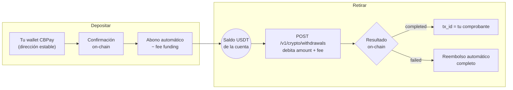

Las wallets son **puertas de entrada**: puedes tener varias (empresas), pero
el saldo de la cuenta es uno solo.

| Tipo de cuenta | Wallets por red |
|---|---|
| Persona | **1** |
| Empresa | **Ilimitadas** (usa `label` para distinguirlas) |

### Crear una wallet

```bash Persona (1 por red)
curl -X POST https://api.qbank.cl/platform/v1/crypto/wallets \
  -H "Authorization: Bearer <token>" \
  -H "Content-Type: application/json" \
  -d '{ "chain": "tron" }'
```

```bash Empresa (con label, ilimitadas)
curl -X POST https://api.qbank.cl/platform/v1/crypto/wallets \
  -H "Authorization: Bearer <token>" \
  -H "Content-Type: application/json" \
  -d '{
    "chain": "tron",
    "label": "Tesorería principal"
  }'
```

```bash Empresa, red Ethereum
curl -X POST https://api.qbank.cl/platform/v1/crypto/wallets \
  -H "Authorization: Bearer <token>" \
  -H "Content-Type: application/json" \
  -d '{
    "chain": "eth",
    "label": "Cobros e-commerce"
  }'
```

Respuesta `201`:

```json
{
  "wallet_id": "b7e3…",
  "chain": "tron",
  "asset": "USDT",
  "address": "TQmZ…",
  "label": "Tesorería principal",
  "created_at": "2026-07-07T12:00:00Z",
  "creation_fee": "1.000000"
}
```

Si una persona intenta una segunda wallet en la misma red — `422`:

```json
{
  "error": "wallet_limit_reached",
  "message": "person accounts can hold one wallet per network"
}
```

- Cada creación tiene un **costo fijo** (`wallet_creation`) configurado por
  CBPay — puede diferenciarse para personas y empresas, e incluso por
  cuenta. Con comisión 0 (el default) es gratis. Si la creación falla, el
  cargo se reembolsa automáticamente.
- Una **persona** que ya tiene wallet en esa red recibe
  `422 wallet_limit_reached`; las **empresas** pueden crear tantas como
  necesiten (una por proveedor, por sucursal, por producto…).
- `label` es opcional y solo descriptivo.

### Ver mis wallets

```bash
curl https://api.qbank.cl/platform/v1/crypto/wallets \
  -H "Authorization: Bearer <token>"
```

```json
{
  "wallets": [
    {
      "wallet_id": "b7e3…",
      "chain": "tron",
      "asset": "USDT",
      "address": "TQmZ…",
      "label": "Tesorería principal",
      "created_at": "2026-07-07T12:00:00Z"
    },
    {
      "wallet_id": "a1c9…",
      "chain": "eth",
      "asset": "USDT",
      "address": "0x8f3B…",
      "label": "Cobros e-commerce",
      "created_at": "2026-07-07T12:05:00Z"
    }
  ]
}
```

### Depositar

Envía USDT a la dirección de cualquiera de tus wallets, **por la red
correcta**. Cuando el depósito se confirma on-chain, tu saldo se acredita
automáticamente (neto de la comisión de `funding` si CBPay la configuró) y
se emite el webhook `crypto_deposit_credited`:

```json
{
  "account_id": "…",
  "chain": "tron",
  "asset": "USDT",
  "tx_id": "b1946ac9…",
  "amount": "499.000000",
  "fee": "1.000000"
}
```

> **Importante**
Envía **solo USDT por la red de la wallet**. Las direcciones son tuyas y
estables: puedes reutilizarlas para todos tus depósitos.
### Transferir (retiros on-chain)

Envía USDT desde tu saldo a cualquier dirección externa:

```bash
curl -X POST https://api.qbank.cl/platform/v1/crypto/withdrawals \
  -H "Authorization: Bearer <token>" \
  -H "Content-Type: application/json" \
  -d '{
    "chain": "tron",
    "to_address": "TVJ6…",
    "amount": "100.000000",
    "idempotency_key": "retiro-2026-07-07-b"
  }'
```

Respuesta `202` — se debita `amount + fee` y la transacción se transmite:

```json
{
  "withdrawal_id": "5e8c…",
  "chain": "tron",
  "asset": "USDT",
  "to_address": "TVJ6…",
  "amount": "100.000000",
  "fee": "1.000000",
  "total_debit": "101.000000",
  "status": "processing",
  "tx_id": "…"
}
```

El estado final llega por el webhook `crypto_withdrawal_status_changed`:
**`completed`** (el `tx_id` es tu comprobante) o **`failed`** (se reembolsa
el débito completo).

> **Nota**
Para mover saldo a **otra cuenta CBPay** no uses la blockchain: las
[transferencias internas](#transferencias-internas) son instantáneas y
gratis.
### Movimientos

```bash
# Actividad on-chain: depósitos + retiros, con tx_id
curl https://api.qbank.cl/platform/v1/crypto/transactions \
  -H "Authorization: Bearer <token>"

# Saldo actual (available + held)
curl https://api.qbank.cl/platform/v1/balances \
  -H "Authorization: Bearer <token>"

# Historial contable completo (funding, retiros, comisiones de wallet…)
curl "https://api.qbank.cl/platform/v1/movements?type=funding" \
  -H "Authorization: Bearer <token>"
```

Los depósitos acreditan el **saldo USDT de la cuenta** (las wallets son
puertas de entrada; el saldo es uno solo).

### Errores

| HTTP | `error` | Causa |
|---|---|---|
| 400 | `invalid_chain` | Red no soportada (usa `tron` o `eth`) |
| 400 | `to_address_required` | Falta la dirección destino del retiro |
| 402 | `insufficient_funds` | Saldo insuficiente (para el retiro o para la comisión de creación) |
| 422 | `wallet_limit_reached` | Una persona intentó crear una segunda wallet en la misma red |
| 422 | (retiro con `status: failed`) | Rechazado al transmitir; débito reembolsado |
| 503 | `withdrawals_unavailable` | Retiros no habilitados aún para este corredor |


## Banking

*Cuentas bancarias reales para tu cuenta: recibe, mantén y envía dinero por rieles bancarios internacionales*

Banking te da **cuentas bancarias reales** a nombre de tu perfil verificado:
recibes fondos por rieles internacionales (SEPA, SWIFT, ACH según la
moneda), mantienes saldo en moneda fiat y envías pagos a terceros. Es un
producto distinto de tu saldo USDT: **el dinero de banking vive en tus
cuentas bancarias**, no en el saldo CBPay.

| Concepto | Dónde vive | Se consulta con |
|---|---|---|
| Saldo USDT CBPay | Ledger CBPay | `GET /v1/balances` |
| Saldos bancarios | Tus cuentas bancarias | `GET /v1/banking/accounts/{id}/balance` |

> **Nota**
Las comisiones de banking (`banking_customer`, `banking_account`,
`banking_operation`) son fijas, se debitan de tu **saldo USDT** al ejecutar
cada operación y se **reembolsan automáticamente** si la operación falla.
Con comisión 0 (el default) el servicio es gratis. El campo `banking_fee`
de cada respuesta te muestra lo cobrado.
### El flujo completo

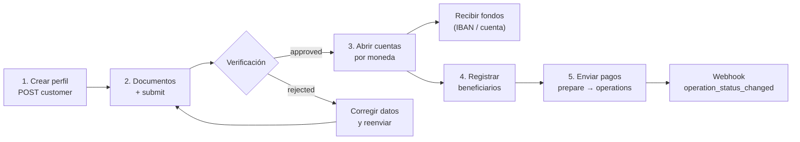

1. **Crea tu perfil bancario** (`POST /v1/banking/customer`) — una sola vez.
2. **Sube documentos** de verificación y **envíalo a revisión**.
3. Cuando quede `approved`, **abre cuentas** por moneda.
4. **Registra beneficiarios** (counterparties) para pagos a terceros.
5. **Envía pagos**: cotiza con `prepare` y ejecuta con `operations`.

Los cambios de estado te llegan por los webhooks
`banking_customer_status_changed` y `banking_operation_status_changed`
([webhooks](#webhooks)).

### 1. Crea tu perfil bancario

Una vez por cuenta. Si no envías `type`, `name` o `email`, se completan con
los datos de tu cuenta CBPay:

```bash
curl -X POST https://api.qbank.cl/platform/v1/banking/customer \
  -H "Authorization: Bearer <token>" \
  -H "Content-Type: application/json" \
  -d '{
    "currency": "USD",
    "address": { "countryIso": "CL", "city": "Santiago" }
  }'
```

Respuesta `201`:

```json
{
  "customer_id": "9f2b…",
  "provider_id": "…",
  "status": "draft",
  "data": { "item": { "…": "…" } },
  "created_at": "2026-07-07T12:00:00Z",
  "banking_fee": "5.000000"
}
```

Si tu cuenta ya tiene perfil bancario — `409 banking_customer_exists`.
Consulta el estado en cualquier momento:

```bash
curl https://api.qbank.cl/platform/v1/banking/customer \
  -H "Authorization: Bearer <token>"
```

### 2. Documentos y verificación

Sube cada documento en base64 (gratis):

```bash
curl -X POST https://api.qbank.cl/platform/v1/banking/customer/documents \
  -H "Authorization: Bearer <token>" \
  -H "Content-Type: application/json" \
  -d '{
    "type": "PASSPORT",
    "filename": "pasaporte.pdf",
    "attach": "<contenido en base64>"
  }'
```

Y envía el perfil a revisión (gratis):

```bash
curl -X POST https://api.qbank.cl/platform/v1/banking/customer/submit \
  -H "Authorization: Bearer <token>"
```

Estados del perfil: `draft` → `submitted` → `under_review` →
**`approved`** o `rejected`. El webhook
`banking_customer_status_changed` te avisa cada cambio:

```json
{
  "account_id": "…",
  "customer_id": "9f2b…",
  "kyc_status": "approved"
}
```

### 3. Abre cuentas bancarias

Con el perfil `approved`, crea una cuenta por moneda:

```bash
curl -X POST https://api.qbank.cl/platform/v1/banking/accounts \
  -H "Authorization: Bearer <token>" \
  -H "Content-Type: application/json" \
  -d '{ "currency": "USD", "name": "Operativa USD" }'
```

Respuesta `201` — `data` incluye los datos para **recibir** (número de
cuenta/IBAN, routing, banco):

```json
{
  "account_id": "c4d1…",
  "provider_id": "…",
  "status": "active",
  "data": { "…": "…" },
  "banking_fee": "1.000000"
}
```

Lista tus cuentas y consulta saldo:

```bash
curl https://api.qbank.cl/platform/v1/banking/accounts \
  -H "Authorization: Bearer <token>"

curl https://api.qbank.cl/platform/v1/banking/accounts/c4d1…/balance \
  -H "Authorization: Bearer <token>"
```

### 4. Registra beneficiarios

Para pagar a terceros, primero registra al beneficiario con sus datos
bancarios (gratis; pasa por moderación antes de poder usarse):

```bash
curl -X POST https://api.qbank.cl/platform/v1/banking/counterparties \
  -H "Authorization: Bearer <token>" \
  -H "Content-Type: application/json" \
  -d '{
    "description": "Proveedor ACME",
    "profile": {
      "name": "ACME LLC",
      "address": { "addressLine1": "1 Main St", "city": "New York", "stateIso": "NY", "countryIso": "US", "postalCode": "10001" },
      "additionalInfo": { "type": "CORPORATION" }
    },
    "accounts": [
      {
        "currencyCode": "USD",
        "bank": { "name": "Test Bank", "number": "011000138" },
        "fiat": {
          "number": "0532013000",
          "routingNumber": "011000138",
          "additionalInformation": { "type": "TYPE_FIAT_US", "accountType": "CHECKING", "supportedRails": ["ACH"] }
        }
      }
    ]
  }'
```

Lista los tuyos con `GET /v1/banking/counterparties` y agrega más cuentas a
un beneficiario existente con
`POST /v1/banking/counterparties/{id}/accounts`.

### 5. Envía pagos

Dos tipos de operación:

| `type` | Qué hace | `paymentType` |
|---|---|---|
| `TRANSFER` | Entre tus propias cuentas bancarias | `EMPTY` |
| `WITHDRAW` | A un beneficiario registrado | Según el rail (ej. `SEPA_CT`) |

Cotiza primero (gratis, no mueve dinero):

```bash
curl -X POST https://api.qbank.cl/platform/v1/banking/operations/prepare \
  -H "Authorization: Bearer <token>" \
  -H "Content-Type: application/json" \
  -d '{
    "currency": "USD",
    "type": "WITHDRAW",
    "paymentType": "SEPA_CT",
    "sourceRequisit": { "account": "c4d1…" },
    "destinationRequisit": { "beneficiar": "<cuenta del beneficiario>" },
    "amount": { "currencyCode": "USD", "units": "250", "nanos": 0 }
  }'
```

Ejecuta con clave de idempotencia (se cobra `banking_operation` aquí):

```bash WITHDRAW (a un beneficiario)
curl -X POST https://api.qbank.cl/platform/v1/banking/operations \
  -H "Authorization: Bearer <token>" \
  -H "Idempotency-Key: pago-acme-0071" \
  -H "Content-Type: application/json" \
  -d '{
    "currency": "USD",
    "type": "WITHDRAW",
    "paymentType": "SEPA_CT",
    "sourceRequisit": { "account": "c4d1…" },
    "destinationRequisit": { "beneficiar": "<cuenta del beneficiario>" },
    "amount": { "currencyCode": "USD", "units": "250", "nanos": 0 },
    "comment": "Factura 8841"
  }'
```

```bash TRANSFER (entre tus cuentas)
curl -X POST https://api.qbank.cl/platform/v1/banking/operations \
  -H "Authorization: Bearer <token>" \
  -H "Idempotency-Key: mov-interno-0012" \
  -H "Content-Type: application/json" \
  -d '{
    "currency": "USD",
    "type": "TRANSFER",
    "paymentType": "EMPTY",
    "sourceRequisit": { "account": "c4d1…" },
    "destinationRequisit": { "account": "<otra cuenta tuya>" },
    "amount": { "currencyCode": "USD", "units": "100", "nanos": 0 }
  }'
```

Respuesta `202`:

```json
{
  "operation_id": "7e8a…",
  "provider_id": "…",
  "status": "pending",
  "idempotency_key": "platform:…:pago-acme-0071",
  "data": { "…": "…" },
  "banking_fee": "2.000000"
}
```

- El estado final llega por el webhook `banking_operation_status_changed`
  (`completed` / `failed`); también puedes consultar
  `GET /v1/banking/operations/{id}`.
- Reintentos con la misma `Idempotency-Key` devuelven la operación original
  (`idempotency_hit: true`) **sin volver a cobrar** la comisión.
- El historial completo está en `GET /v1/banking/operations`
  (filtros: `type`, `status`, `from`, `to`, paginación).

### Estados de operación

| Estado | Significado |
|---|---|
| `pending` | Aceptada, esperando procesamiento |
| `processing` | En ejecución en el rail bancario |
| `completed` | El dinero llegó — final |
| `failed` | Falló; si hubo comisión de la operación, se reembolsó |
| `cancelled` | Cancelada antes de ejecutarse |

### Errores

| HTTP | `error` | Qué hacer |
|---|---|---|
| 400 | `idempotency_key_required` | Envía la clave en body o header |
| 402 | `insufficient_funds` | Saldo USDT insuficiente para la comisión de banking |
| 403 | `account_blocked` | La cuenta no está activa; contacta al equipo de CBPay |
| 409 | `banking_customer_exists` | Tu cuenta ya tiene perfil bancario (`GET /v1/banking/customer`) |
| 409 | `no_banking_customer` | Crea primero tu perfil (`POST /v1/banking/customer`) |
| 502 | `banking_request_failed` | Error del corredor bancario; la comisión se reembolsó — reintenta |


## KYC/KYB y compliance

*Verificación de personas (KYC) y empresas (KYB), rescreening y monitoreo continuo*

CBPay integra la verificación de identidad como servicio — **KYC** para
personas y **KYB** para empresas — con screening AML incluido: envías la
identidad de la cuenta y recibes el resultado del análisis. El estado de
verificación de la cuenta
(`kyc_status`) lo resuelve CBPay tras revisar el resultado.

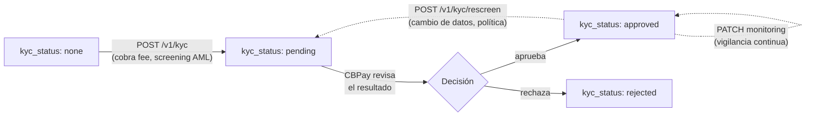

> **Nota**
Si CBPay configuró una comisión de compliance, se debita **antes** de
la llamada (verás `compliance_fee` en la respuesta) y se **reembolsa
automáticamente** si el screening falla. Con comisión 0 el servicio es
gratuito para ti.
### Enviar el screening

Un solo endpoint para persona y empresa; el tipo se detecta del payload:

```bash Persona (KYC)
curl -X POST https://api.qbank.cl/platform/v1/kyc \
  -H "Authorization: Bearer <token>" \
  -H "Content-Type: application/json" \
  -d '{
    "customer": {
      "person": {
        "full_name": "Ana Pérez Rojas",
        "birth_date": "1990-04-12",
        "document_type": "national_id",
        "document_value": "12.345.678-5"
      },
      "email": "ana@ejemplo.com",
      "country": "CL"
    },
    "monitor": false
  }'
```

```bash Empresa (KYB)
curl -X POST https://api.qbank.cl/platform/v1/kyc \
  -H "Authorization: Bearer <token>" \
  -H "Content-Type: application/json" \
  -d '{
    "customer": {
      "company": {
        "legal_name": "Comercial Andina SpA",
        "tax_id": "76.543.210-8"
      },
      "email": "legal@andina.cl",
      "country": "CL"
    },
    "monitor": true
  }'
```

```bash Mínimo (autocompletado)
curl -X POST https://api.qbank.cl/platform/v1/kyc \
  -H "Authorization: Bearer <token>" \
  -H "Content-Type: application/json" \
  -d '{ "customer": {}, "monitor": false }'
```

Si omites `person`/`company`, se completa con los datos de tu cuenta (el
tipo persona/empresa se toma del tipo de la cuenta).

Respuesta `201` — persona y empresa devuelven la misma forma; cambia
`compliance_service` (`compliance_person` vs `compliance_company`, cada uno
con su comisión):

```json Persona
{
  "customer_id": "cus_8f2e1a…",
  "status": "screened",
  "risk_level": "low",
  "screening_result": "no_match",
  "kyc_status": "pending",
  "compliance_service": "compliance_person",
  "compliance_fee": "0.500000"
}
```

```json Empresa
{
  "customer_id": "cus_5b7c33…",
  "status": "screened",
  "risk_level": "medium",
  "screening_result": "potential_match",
  "kyc_status": "pending",
  "compliance_service": "compliance_company",
  "compliance_fee": "1.000000"
}
```

Tu cuenta queda con `kyc_status: pending` hasta que CBPay apruebe o rechace
la verificación.

### Rescreening

Re-ejecuta el análisis de la misma identidad (por ejemplo, ante un cambio de
datos o por política periódica). No lleva body — usa el `customer_id` de tu
screening anterior:

```bash
curl -X POST https://api.qbank.cl/platform/v1/kyc/rescreen \
  -H "Authorization: Bearer <token>"
```

Respuesta `200` (cobra `compliance_rescreen`, si está configurada):

```json
{
  "customer_id": "cus_8f2e1a…",
  "status": "screened",
  "risk_level": "low",
  "screening_result": "no_match",
  "compliance_service": "compliance_rescreen",
  "compliance_fee": "0.250000"
}
```

Requiere haber enviado un KYC/KYB antes; si no, `409 no_kyc`.

### Monitoreo continuo

Activa (o desactiva) la vigilancia permanente de la identidad — cambios en
listas, PEP, prensa adversa:

```bash Activar (cobra compliance_monitoring)
curl -X PATCH https://api.qbank.cl/platform/v1/kyc/monitoring \
  -H "Authorization: Bearer <token>" \
  -H "Content-Type: application/json" \
  -d '{ "enabled": true }'
```

```bash Desactivar (siempre gratis)
curl -X PATCH https://api.qbank.cl/platform/v1/kyc/monitoring \
  -H "Authorization: Bearer <token>" \
  -H "Content-Type: application/json" \
  -d '{ "enabled": false }'
```

Respuesta `200`:

```json
{
  "customer_id": "cus_8f2e1a…",
  "monitoring": true,
  "compliance_service": "compliance_monitoring",
  "compliance_fee": "0.100000"
}
```

Al desactivar, `compliance_fee` vuelve `"0.000000"` — desactivar es
siempre gratis.

### Errores

| HTTP | `error` | Causa |
|---|---|---|
| 402 | `insufficient_funds` | Saldo insuficiente para la comisión de compliance |
| 409 | `no_kyc` | Rescreen/monitoreo sin un KYC/KYB previo |
| 502 | `compliance_unavailable` | Servicio temporalmente no disponible (la comisión se reembolsó) |


## Cartola (estado de cuenta)

*El estado de cuenta consolidado: JSON para tu web, PDF y Excel descargables, listos para tu contador*

La cartola consolida **todos** los movimientos de una cuenta en un período —
payouts, payins, depósitos y retiros crypto, transferencias internas y
cargos por servicio — en un solo documento auditable. Un mismo endpoint la
entrega en tres formatos:

| Formato | Para qué | Cómo pedirlo |
|---|---|---|
| `json` (default) | Mostrar la cartola en tu web/app | `format=json` |
| `pdf` | Documento formal con branding CBPay | `format=pdf` |
| `xlsx` | Excel con hojas por sección, filtros y celdas numéricas | `format=xlsx` |

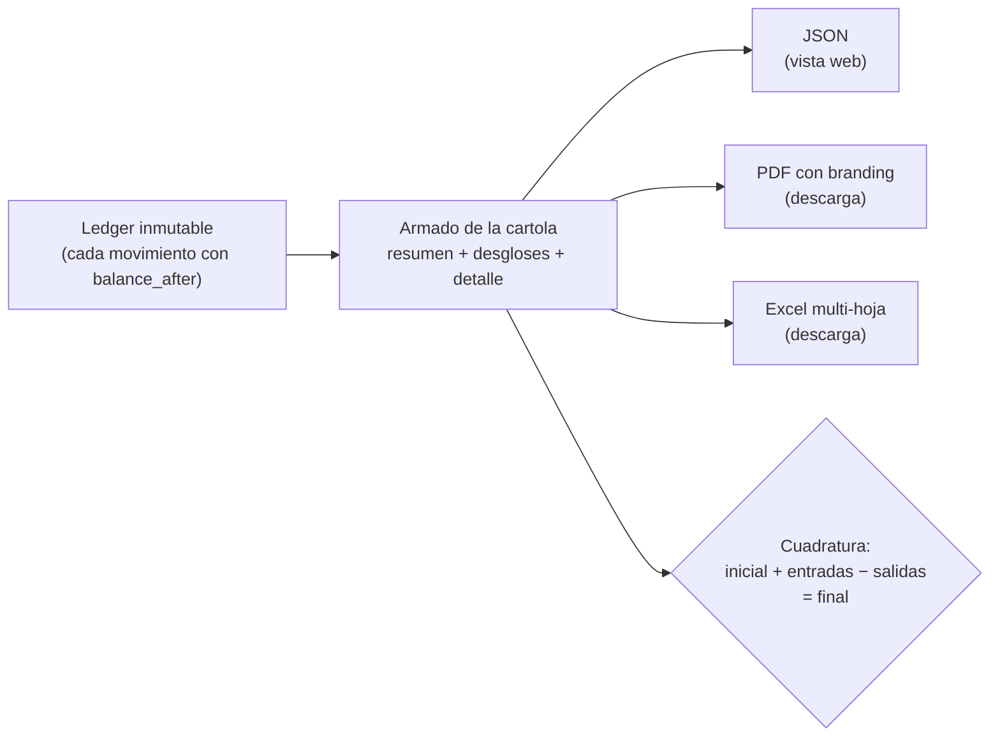

### Pedir la cartola

```bash
# JSON para tu front
curl "https://api.qbank.cl/platform/v1/reports/statement?from=2026-01-01&to=2026-07-07" \
  -H "Authorization: Bearer <token>"

# PDF descargable (branding CBPay)
curl -OJ "https://api.qbank.cl/platform/v1/reports/statement?from=2026-01-01&to=2026-07-07&format=pdf" \
  -H "Authorization: Bearer <token>"

# Excel descargable
curl -OJ "https://api.qbank.cl/platform/v1/reports/statement?from=2026-01-01&to=2026-07-07&format=xlsx" \
  -H "Authorization: Bearer <token>"
```

- `from` / `to`: fechas `YYYY-MM-DD` inclusive, en UTC. Rango máximo:
  400 días.
- `lang=es|en`: idioma del PDF/Excel (default `es`).
- Los archivos llegan con `Content-Disposition: attachment` y nombre
  `cartola_cbpay_<cuenta>_<from>_<to>.pdf/.xlsx`.

### Qué contiene

```json
{
  "account": { "account_id": "…", "display_name": "Empresa Ejemplo SpA", "type": "company" },
  "period": { "from": "2026-01-01", "to": "2026-07-07", "timezone": "UTC" },
  "generated_at": "2026-07-07T15:00:00Z",
  "summary": {
    "opening_balance": "0.000000",
    "total_in": "985633.540000",
    "total_out": "38099.870000",
    "net_change": "947533.670000",
    "closing_balance": "947533.670000",
    "balanced": true,
    "counts": { "payouts": 51, "payins": 12, "crypto_deposits": 18, "transfers": 4, "movements": 771 },
    "fees_by_service": { "payout": "15.300000", "funding": "897.550000" },
    "total_fees": "912.850000"
  },
  "breakdown": {
    "by_product": [ { "product": "payouts", "count": 51, "usdt_in": "0.000000", "usdt_out": "38099.870000", "fees": "15.300000" } ],
    "by_country": [ { "flow": "payouts", "country": "BO", "currency": "BOB", "count": 14, "local_amount": "28748.58", "usdt_amount": "2902.210000" } ],
    "by_currency": [ { "currency": "BOB", "payout_local": "28748.58", "payin_local": "700.00" } ],
    "by_month": [ { "month": "2026-01", "usdt_in": "985633.540000", "usdt_out": "35100.000000" } ]
  },
  "payouts": [ { "created_at": "…", "payout_id": "…", "country": "BO", "beneficiary": "Juan Quispe", "local_amount": "90.00", "fx_rate": "6.91", "usdt_amount": "13.024600", "fee": "0.300000", "total_debit": "13.324600", "status": "completed" } ],
  "payins": [ { "…": "…" } ],
  "crypto_deposits": [ { "chain": "tron", "tx_id": "…", "usdt_gross": "100.000000", "fee": "1.000000", "usdt_credited": "99.000000", "balance_after": "99.000000" } ],
  "crypto_withdrawals": [ { "…": "…" } ],
  "transfers": [ { "direction": "sent", "counterparty": "Ana Pérez", "amount": "25.000000" } ],
  "service_charges": [ { "type": "banking_fee", "service": "banking_customer", "amount": "-0.500000", "balance_after": "98.500000" } ],
  "movements": [ { "type": "funding", "amount": "99.000000", "balance_after": "99.000000", "created_at": "…" } ]
}
```

Secciones:

1. **`summary`** — saldo inicial, entradas, salidas, saldo final, comisiones
   por servicio y el flag `balanced`.
2. **`breakdown`** — por producto, por país (payouts y payins con monto
   local y USDT), por moneda fiat y por mes.
3. **Detalle por producto** — payouts (con beneficiario, tasa y débito),
   payins (por modalidad), crypto (con `tx_id`), transferencias (con
   contraparte) y cargos por servicio (con reembolsos).
4. **`movements`** — el ledger crudo: cada movimiento con su
   `balance_after`. Es la sección con la que un auditor cuadra todo.

### Cómo cuadrar la cartola (para tu contador)

La cartola cumple una identidad contable exacta, sin redondeos:

```
saldo_inicial + total_entradas − total_salidas = saldo_final
```

- `balanced: true` confirma que la identidad se cumple contra el ledger.
- Cada fila de `movements` trae el saldo resultante (`balance_after`):
  puedes seguir el saldo línea a línea desde el inicial hasta el final.
- El saldo final de la cartola de un período empalma con el inicial del
  período siguiente.
- Las comisiones nunca están escondidas en los montos: cada operación
  muestra bruto, comisión y neto por separado, y `fees_by_service` las
  totaliza.
- En el Excel, la hoja **Movimientos** tiene celdas numéricas reales:
  puedes sumar/pivotar sin limpiar nada.

### Para el administrador (org admin)

El equipo de CBPay puede generar la cartola de cualquiera de sus cuentas:

```bash
curl "https://api.qbank.cl/platform/v1/accounts/{accountID}/reports/statement?from=2026-01-01&to=2026-07-07&format=pdf" \
  -H "X-API-Key: <pk_org_admin>"
```

### Errores

| HTTP | `error` | Causa |
|---|---|---|
| 400 | `invalid_range` | Fechas faltantes/invalidas, `to` anterior a `from`, o rango mayor a 400 días |
| 400 | `invalid_format` | `format` distinto de `json`, `pdf`, `xlsx` |
| 404 | `not_found` | La cuenta no existe (solo org admin) |


# Integración


## Webhooks

*Recibe eventos firmados en tiempo real*

Los webhooks te notifican los eventos de tu cuenta en un callback HTTPS
propio, firmados criptográficamente.

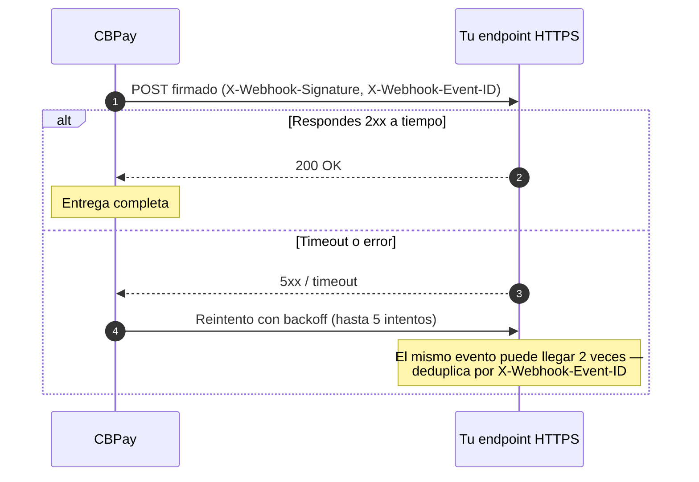

### Crear una suscripción

```bash
curl -X POST https://api.qbank.cl/platform/v1/webhooks/subscriptions \
  -H "Authorization: Bearer <token>" \
  -H "Content-Type: application/json" \
  -d '{
    "event_type": "payout_status_changed",
    "callback_url": "https://api.miapp.com/webhooks/cbpay",
    "secret": "un-secreto-de-al-menos-16-chars"
  }'
```

- `event_type`: uno de los eventos de la tabla siguiente, o `*` para todos.
- `callback_url`: **HTTPS obligatorio**; se rechazan localhost e IPs
  privadas.
- `secret`: mínimo 16 caracteres; se usa para firmar cada entrega. Se
  almacena cifrado y no puede recuperarse.

La suscripción recibe los eventos de **tu cuenta**.

### Eventos

| Evento | Cuándo se emite |
|---|---|
| `payin_credited` | Un cobro fiat fue recibido y abonado |
| `payout_status_changed` | Un payout cambió de estado |
| `transfer_received` | La cuenta recibió una transferencia interna |
| `crypto_deposit_credited` | Un depósito on-chain fue confirmado y abonado |
| `crypto_withdrawal_status_changed` | Un retiro on-chain cambió de estado |
| `banking_customer_status_changed` | Cambió la verificación de tu perfil bancario |
| `banking_operation_status_changed` | Un pago bancario cambió de estado |

#### Payload de cada evento

```json payin_credited
{
  "payin_id": "9c2a…",
  "account_id": "ae8c…",
  "country": "BO",
  "currency": "BOB",
  "local_amount": "700.00",
  "fx_rate": "6.91",
  "usdt_credited": "100.310000",
  "fee": "1.000000"
}
```

```json payout_status_changed
{
  "payout_id": "0d4f…",
  "account_id": "ae8c…",
  "country": "MX",
  "currency": "MXN",
  "local_amount": "1500.00",
  "usdt_amount": "85.714286",
  "total_debit": "86.014286",
  "status": "completed",
  "status_code": ""
}
```

```json transfer_received
{
  "transfer_id": "77b1…",
  "from_account_id": "389d…",
  "to_account_id": "ae8c…",
  "asset": "USDT",
  "amount": "25.000000",
  "description": "Split de gastos",
  "created_at": "2026-07-06T20:10:00Z"
}
```

```json crypto_deposit_credited
{
  "account_id": "ae8c…",
  "chain": "tron",
  "asset": "USDT",
  "tx_id": "b1946ac9…",
  "amount": "499.000000",
  "fee": "1.000000"
}
```

```json crypto_withdrawal_status_changed
{
  "withdrawal_id": "5e8c…",
  "account_id": "ae8c…",
  "chain": "tron",
  "asset": "USDT",
  "tx_id": "7d3f01aa…",
  "status": "completed",
  "amount": "100.000000"
}
```

```json banking_customer_status_changed
{
  "account_id": "ae8c…",
  "customer_id": "9f2b…",
  "kyc_status": "approved"
}
```

```json banking_operation_status_changed
{
  "account_id": "ae8c…",
  "customer_id": "9f2b…",
  "operation_id": "7e8a…",
  "type": "withdraw",
  "status": "completed"
}
```

En `payout_status_changed` y `crypto_withdrawal_status_changed`, `status`
puede ser `completed` o `failed` (con `failed` el débito ya fue
reembolsado cuando recibes el evento).

### Formato de entrega

Cada entrega es un `POST` JSON con estos headers:

| Header | Contenido |
|---|---|
| `X-Webhook-Event` | Tipo de evento |
| `X-Webhook-Event-ID` | ID único del evento |
| `X-Webhook-Delivery-ID` | ID de esta entrega (cambia entre reintentos) |
| `X-Webhook-Timestamp` | Unix timestamp (segundos, UTC) |
| `X-Webhook-Signature` | Firma HMAC (ver abajo) |

### Verificar la firma

```
X-Webhook-Signature = hex( HMAC-SHA256( secret, timestamp + "." + body ) )
```

```javascript Node.js
const crypto = require("crypto");

function verifyWebhook(req, secret) {
  const ts = req.headers["x-webhook-timestamp"];
  const sig = req.headers["x-webhook-signature"];
  const expected = crypto
    .createHmac("sha256", secret)
    .update(ts + "." + req.rawBody)
    .digest("hex");
  return crypto.timingSafeEqual(Buffer.from(sig), Buffer.from(expected));
}
```

```python Python
import hashlib, hmac

def verify_webhook(headers, raw_body: bytes, secret: str) -> bool:
    ts = headers["X-Webhook-Timestamp"]
    sig = headers["X-Webhook-Signature"]
    expected = hmac.new(
        secret.encode(), f"{ts}.".encode() + raw_body, hashlib.sha256
    ).hexdigest()
    return hmac.compare_digest(sig, expected)
```

> **Importante**
Calcula el HMAC sobre el **body crudo** (bytes tal como llegan), no sobre el
JSON re-serializado. Rechaza timestamps muy antiguos (> 5 minutos) para
prevenir replay.
### Reintentos e idempotencia

- Tu endpoint debe responder **2xx** dentro del timeout; cualquier otra
  respuesta se reintenta.
- Hasta **5 intentos** con backoff incremental (5s, 20s, 45s, 80s…).
- Usa `X-Webhook-Event-ID` para deduplicar: el mismo evento puede llegar más
  de una vez (entregas at-least-once).

### Buenas prácticas

- Responde `200` de inmediato y procesa en background.
- Registra el `X-Webhook-Delivery-ID` para trazabilidad.
- No dependas solo de webhooks para estados críticos: puedes consultar el
  objeto por API en cualquier momento (`GET /v1/payouts/{id}`, etc.).


## Errores

*Formato de error y catálogo completo de códigos*

Todos los errores comparten el mismo formato:

```json
{
  "error": "insufficient_funds",
  "message": "account balance is not enough for this operation"
}
```

- `error`: código estable en `snake_case` — úsalo en tu lógica.
- `message`: explicación legible — puede cambiar, no lo parsees.

### Códigos por categoría

#### Autenticación y permisos

| HTTP | `error` | Significado |
|---|---|---|
| 401 | `unauthorized` | Credencial ausente o inválida |
| 401 | `invalid_credentials` | Email o contraseña incorrectos (login) |
| 403 | `account_required` | El endpoint exige credencial de cuenta |
| 403 | `org_admin_required` | El endpoint exige credencial de administrador |
| 403 | `forbidden` | Nivel de credencial no permitido |
| 403 | `account_blocked` | La cuenta no está activa |
| 403 | `org_suspended` | El servicio está suspendido; contacta al equipo de CBPay |
| 403 | `company_only` | Función solo para cuentas empresa |

#### Validación (400)

| `error` | Significado |
|---|---|
| `invalid_json` | Body no es JSON válido o tiene campos desconocidos |
| `invalid_type` | `type` debe ser `person` o `company` |
| `invalid_email` / `invalid_display_name` | Campo requerido inválido |
| `weak_password` | Contraseña menor a 8 caracteres |
| `invalid_role` | Rol de miembro inválido |
| `unknown_org` | Slug de organización incorrecto (usa `cbpay`) |
| `invalid_request` | Faltan `country`/`currency` |
| `idempotency_key_required` | Falta la clave de idempotencia |
| `beneficiary_required` | Falta el beneficiario del payout |
| `invalid_amount` | Monto no es un decimal positivo válido |
| `recipient_required` / `self_transfer` | Destino de transferencia inválido |
| `invalid_chain` / `invalid_asset` | Red o activo no soportado |
| `to_address_required` | Falta dirección destino del retiro |
| `invalid_payload` | Falta `enabled` (monitoreo KYC/KYB) |
| `invalid_event_type` / `weak_secret` / `invalid_callback_url` | Suscripción de webhook inválida |
| `invalid_status` / `invalid_kyc_status` / `invalid_direction` / `reason_required` / `account_id_required` / `invalid_service` / `invalid_fee` | Validaciones de administración |

#### Dinero y estado (402 / 404 / 409 / 422)

| HTTP | `error` | Significado |
|---|---|---|
| 402 | `insufficient_funds` | Saldo disponible insuficiente |
| 404 | `not_found` | Recurso inexistente (o de otra cuenta) |
| 404 | `recipient_not_found` | Destino de transferencia inexistente |
| 409 | `duplicate` | El recurso ya existe |
| 409 | `no_kyc` | Rescreen/monitoreo sin KYC/KYB previo |
| 422 | `currency_not_supported` | Sin tasa FX para esa moneda |
| 422 | `core_rejected` | El procesador rechazó la operación |
| 422 | `recipient_unavailable` | La cuenta destino no puede recibir |
| 422 | `wallet_limit_reached` | Una cuenta persona intentó crear una segunda wallet en la misma red |

#### Servicio (5xx)

| HTTP | `error` | Significado |
|---|---|---|
| 500 | `internal_error` | Error inesperado; reintenta con la misma clave de idempotencia |
| 502 | `rates_unavailable` | Tasas FX temporalmente no disponibles |
| 502 | `core_unavailable` | Procesador temporalmente no disponible |
| 502 | `compliance_unavailable` | Screening temporalmente no disponible |
| 503 | `org_credential_missing` | Servicio en configuración; contacta al soporte de CBPay |
| 503 | `withdrawals_unavailable` | Retiros on-chain no habilitados para el corredor |

### Cómo manejarlos

- **4xx de validación**: corrige el request. No reintentes igual.
- **402**: fondea la cuenta y reintenta (clave de idempotencia nueva solo si
  la operación nunca se creó).
- **5xx / timeouts**: reintenta con **la misma** clave de idempotencia; la
  operación nunca se duplicará.


## Preguntas frecuentes

*Las dudas típicas al integrar, respondidas de una*

### Empezando

#### ¿Cuál es la URL base de la API?
`https://api.qbank.cl/platform` — todos los endpoints de esta
documentación cuelgan de ahí (por ejemplo
`https://api.qbank.cl/platform/v1/balances`).
#### ¿Hay un ambiente sandbox de pruebas?
No. La API opera directo en producción. Para probar tu integración usa
**montos pequeños reales**: deposita unos pocos USDT, haz un payout mínimo
y verifica el ciclo completo (débito → webhook → estado final). Si algo
falla, el débito se reembolsa automáticamente — no puedes "perder" saldo
por un error de datos.
#### ¿Cómo pongo saldo en mi cuenta para empezar?
Dos caminos: (1) **deposita USDT on-chain** — crea una wallet con
`POST /v1/crypto/wallets` y envía USDT a esa dirección (TRON o Ethereum);
(2) **cobra fiat** con un [payin](#payins) (QR, transferencia
anunciada, etc.). En ambos casos el saldo se acredita solo y te llega un
webhook.
#### ¿Necesito pasar KYC/KYB antes de operar?
La API funciona con tu cuenta **activa**; la política de verificación la
define el equipo de CBPay según tu caso (montos, país, tipo de cuenta). Si
tu cuenta requiere verificación, envíala con `POST /v1/kyc` — y si alguna
operación te responde `403 account_blocked`, contacta al equipo de CBPay.
#### ¿Qué credencial uso: sesión JWT o API key?
Para procesos servidor-a-servidor usa siempre una **API key** (`pk_…`, no
expira). Las sesiones JWT (24 h) son para front-ends con usuarios que
inician sesión. Ambas van en `Authorization: Bearer <token>` (o
`X-API-Key`).
### Dinero y tasas

#### ¿En qué moneda está mi saldo?
Solo **USDT con 6 decimales**. Todas las operaciones fiat (payouts en CLP,
cobros en BOB…) se convierten a/desde USDT con la tasa de tu cuenta al
momento de ejecutar. Ver [modelo de dinero](#modelo-de-dinero).
#### ¿Cómo sé cuánto me va a costar un payout antes de crearlo?
Consulta `GET /v1/rates` (devuelve **tu** tasa por país) y calcula:

```
usdt_amount ≈ monto_local / tasa       (redondeo hacia arriba, 6 decimales)
total_debit = usdt_amount + fee fijo   (tus fees vienen en la misma respuesta)
```

El objeto payout devuelve los valores exactos (`fx_rate`, `usdt_amount`,
`fee`, `total_debit`) calculados por el servidor.
#### ¿La tasa que veo en /v1/rates está garantizada?
No es una cotización congelada: el payout usa la tasa vigente **al momento
de crearlo**, que puede variar levemente respecto a la que consultaste. La
tasa aplicada queda registrada en el campo `fx_rate` del payout para
auditoría.
#### ¿Hay montos mínimos o máximos?
La API no impone mínimos técnicos; con montos muy chicos la comisión fija
puede superar el monto (recibirás `invalid_amount` o un débito
antieconómico). Los máximos dependen de tu configuración con CBPay.
#### ¿Qué comisiones me aplican y dónde las veo?
Las define CBPay para tu cuenta: por servicio (payout, payin, funding,
retiro, KYC, creación de wallet), por país y con componente % y/o fijo.
`GET /v1/rates` devuelve tu lista efectiva en el campo `fees` (y los
porcentajes de FX ya vienen dentro de la tasa cotizada). Detalle en
[comisiones](#comisiones).
### Payouts

#### ¿Cuánto tarda un payout en llegar?
Depende del corredor: varios son **síncronos o casi inmediatos** (Yape,
Pago Móvil, QR Bolivia) y otros procesan en minutos vía el rail bancario
local (SPEI, transferencias). Diseña tu integración alrededor del webhook
`payout_status_changed`: no asumas tiempos fijos ni hagas polling.
#### ¿Qué pasa exactamente si un payout falla?
Se reembolsa **el débito completo** (monto + comisión) a tu saldo
`available`, automáticamente, y te llega el webhook con `status: failed` y
un `status_code` explicando la causa. Corrige los datos y reintenta con
una `idempotency_key` **nueva**.
#### ¿Puedo reintentar sin riesgo de pagar dos veces?
Sí — ese es el propósito de la `idempotency_key`: si repites la misma
clave, recibes el payout original (`idempotency_hit: true`) sin crear ni
debitar nada nuevo. Usa una clave distinta solo cuando realmente quieras
crear otro pago. Ver [idempotencia](#idempotencia).
#### ¿Cómo sé qué campos lleva el beneficiary de cada país?
En la guía de [payouts](#payouts) hay un ejemplo
completo por país y método, y `GET /v1/payouts/banks?country=XX` te da los
códigos de banco vigentes cuando aplican.
#### ¿Un QR escaneado se puede pagar dos veces?
No: cada `provider_reference` del scan admite un solo confirm. Reintentos
con la misma `idempotency_key` devuelven el payout original.
### Payins y depósitos

#### ¿Cuándo se acredita mi saldo tras un cobro?
Cuando el proveedor confirma el pago: los QR y cobros activos suelen
acreditar en segundos; las transferencias bancarias cuando el depósito
llega y se matchea. Siempre recibes el webhook `payin_credited` con el
monto neto acreditado.
#### Mi cliente transfirió sin la referencia, ¿se perdió el dinero?
No. El depósito queda en estado `unassigned` y el equipo de CBPay lo
asigna manualmente a tu cuenta (se acredita con tus comisiones normales).
Para evitarlo, usa la **cuenta CLABE dedicada** en México o insiste en que
la referencia viaje en la descripción de la transferencia.
#### ¿Cómo saco un estado de cuenta para mi contador?
Con la [cartola](#cartola-estado-de-cuenta): un endpoint que consolida todos los
movimientos del período (payouts, payins, crypto, transferencias y
comisiones) con cuadratura contable exacta. Pide `format=pdf` o
`format=xlsx` para descargar el documento con branding CBPay, o `json`
para mostrarla en tu web.
#### ¿El saldo de banking y mi saldo USDT son lo mismo?
No. El dinero de [banking](#banking) vive en **tus cuentas
bancarias reales** (USD u otras monedas habilitadas) y se consulta con
`GET /v1/banking/accounts/{id}/balance`. Tu saldo CBPay es USDT y solo se
toca para cobrar las comisiones fijas de banking (que se reembolsan si la
operación falla).
#### ¿Un depósito crypto y un payin son lo mismo?
No: un **payin** es un cobro fiat (moneda local → USDT); un **depósito
crypto** es USDT on-chain que llega a tu wallet (`funding`). Ambos terminan
en el mismo saldo USDT, con webhooks distintos (`payin_credited` vs
`crypto_deposit_credited`).
### Webhooks y errores

#### ¿Los webhooks son obligatorios?
No, pero sí muy recomendados: los estados finales llegan por webhook sin
que hagas polling. De todas formas puedes consultar cualquier objeto por
API (`GET /v1/payouts/{id}`, `GET /v1/payins/{id}`…) en cualquier momento.
#### ¿Por qué recibí el mismo webhook dos veces?
Las entregas son **at-least-once**: ante timeouts se reintenta (hasta 5
veces). Deduplica con el header `X-Webhook-Event-ID`, que es único por
evento.
#### ¿Qué hago con un error 5xx o core_unavailable?
Es transitorio: reintenta con backoff usando la **misma**
`idempotency_key` (así nunca duplicas). Si el problema persiste, contacta
al equipo de CBPay con el `payout_id`/`payin_id` y la hora.


# Recursos


## Postman

*Colección lista para importar y probar toda la API*

Descarga la colección oficial de Postman de CBPay, generada desde la misma
especificación OpenAPI de esta documentación: incluye los 25 endpoints con
sus cuerpos de ejemplo y una respuesta guardada por operación.

- **CBPay API — Colección Postman** — Descargar `cbpay-api.postman_collection.json` (v2.1)

### Cómo usarla

### Importa la colección

En Postman: **Import** → arrastra el archivo descargado.
### Configura tus variables

La colección trae dos variables:

| Variable | Valor |
|---|---|
| `baseUrl` | `https://api.qbank.cl/platform` (ya configurada) |
| `token` | Tu JWT de sesión o API key `pk_...` |
### Prueba

Todas las requests heredan la autenticación Bearer con `{{token}}`.
Empieza por `GET /v1/me` para validar tu credencial y `GET /v1/balances`
para ver tu saldo.
> **Nota**
La colección se regenera con cada versión de la API — descárgala de nuevo
después de cada entrada del [changelog](#novedades) para tener los
últimos endpoints.


## Novedades

*Historial de cambios de la API y de esta documentación*

Todos los cambios de la API de CBPay y de esta documentación, del más
reciente al más antiguo. Los cambios que rompen compatibilidad se anuncian
con anticipación y quedan marcados como **Breaking**.

### v1.17 — 7 de julio de 2026

**Agregado**

- **Chile: página de pago hosted (`method: "fintoc"`)** en
  `POST /v1/payins`. La respuesta trae una `payment_url` que el pagador
  abre para transferir desde **cualquier banco o billetera chilena** (Banco
  Estado, Santander, Mach, Tenpo, Mercado Pago, entre otros); el
  depósito se detecta, valida y acredita automáticamente en USDT con el
  webhook `payin_credited` de siempre. Soporta `idempotency_key` opcional:
  un reintento devuelve el mismo payin y la misma URL sin abrir otra sesión
  de pago. Ver la [guía de payins](#payins).

### v1.16 — 7 de julio de 2026

**Agregado**

- **Filtros de fecha `from`/`to` en todos los listados**: `/v1/movements`,
  `/v1/payouts`, `/v1/payins` y `/v1/crypto/transactions` ahora aceptan
  `from`/`to` (YYYY-MM-DD, UTC, inclusive), además de la paginación de
  siempre (`page`, `page_size` hasta 200). Fechas inválidas devuelven
  `400 invalid_range`.
- **Consulta de transferencias**: `GET /v1/transfers` (lista con
  paginación y fechas) y `GET /v1/transfers/{id}` — antes solo se podían
  crear.
- **Listar suscripciones de webhook**: `GET /v1/webhooks/subscriptions`.
- **Idempotencia en cobros activos**: `POST /v1/payins/collect` ahora exige
  `idempotency_key` (ejecuta un cargo real; un reintento nunca vuelve a
  cobrar al pagador). Igual refuerzo en creación de wallet (no dobla el fee
  en reintentos) y en ajustes de administración.
- Paginación uniforme agregada a `members`, `crypto/wallets`,
  `deposit-accounts` y (admin) `orgs`.

- **Cartola / estado de cuenta** (`GET /v1/reports/statement`): consolida
  todos los movimientos del período — payouts, payins, crypto,
  transferencias y comisiones — en un solo documento auditable con
  cuadratura contable exacta (`saldo inicial + entradas − salidas = saldo
  final`, verificada contra el ledger). Tres formatos con el mismo
  endpoint: **JSON** para tu web, **PDF** con branding CBPay y **Excel**
  multi-hoja con celdas numéricas, filtros y hoja de movimientos para
  auditores (`format=json|pdf|xlsx`, `lang=es|en`). El org admin puede
  generar la cartola de cualquiera de sus cuentas. Ver la
  [guía](#cartola-estado-de-cuenta).

### v1.15 — 7 de julio de 2026

**Mejorado**

- **Diagramas de flujo visuales en toda la documentación**: mapa del
  dinero en la introducción (todo lo que entra y sale del saldo USDT),
  ciclo de vida del payout con débito/hold/reembolso, flujo QR en dos
  pasos, las 4 modalidades de payin convergiendo al abono, depósito y
  retiro crypto, ciclo completo de banking, estados del KYC, entrega y
  reintentos de webhooks, y la regla de decisión de idempotencia
  ("¿con qué clave reintento?").

### v1.14 — 7 de julio de 2026

**Cambiado**

- **Nueva URL base: `https://api.qbank.cl/platform`** (antes
  `exchange.qbank.cl/platform`). El dominio anterior sigue funcionando
  como alias, así que ninguna integración existente se rompe — pero usa
  `api.qbank.cl` para todo lo nuevo. Toda la documentación, el spec y el
  Postman ya apuntan a la URL nueva.

### v1.13 — 7 de julio de 2026

**Agregado**

- **Banking**: cuentas bancarias reales para tu cuenta — recibe, mantén y
  envía dinero por rieles bancarios internacionales (SEPA, SWIFT, ACH
  según la moneda). 14 endpoints nuevos bajo `/v1/banking/*`:
  - Perfil bancario: crear, consultar, subir documentos y enviar a
    verificación.
  - Cuentas: abrir por moneda, listar y consultar saldo en vivo.
  - Beneficiarios: registrar, listar y agregar cuentas destino.
  - Pagos: cotizar (`prepare`, gratis) y ejecutar `TRANSFER`/`WITHDRAW`
    con idempotencia.
- Webhooks nuevos: `banking_customer_status_changed` y
  `banking_operation_status_changed`.
- Comisiones nuevas (fijas, configurables, reembolsables si la operación
  falla): `banking_customer`, `banking_account`, `banking_operation` — el
  campo `banking_fee` de cada respuesta muestra lo cobrado.
- Guía completa de [Banking](#banking) con el flujo end-to-end y
  ejemplos de cada operación.

### v1.12 — 7 de julio de 2026

**Mejorado**

- **API Reference completamente en español**: títulos, descripciones,
  campos y grupos del sidebar ahora están traducidos cuando navegas la
  documentación en español (antes solo la interfaz cambiaba de idioma).
- Guía de payouts reordenada: PIX de Brasil vive ahora solo en
  "Ejemplos por país" (se eliminó la sección duplicada); el QR quedó como
  única sección de flujo aparte por ser un flujo distinto (scan +
  confirm).
- Webhooks: payload de ejemplo de **cada uno de los 5 eventos**.
- Quickstart: registro con ejemplos de persona **y** empresa.
- **Colección Postman ampliada a 53 requests**: los endpoints con varios
  casos de uso ahora traen un request por caso (un payout por país y
  método, payins por modalidad, KYC persona/empresa, etc.), cada uno con
  su body listo para enviar.
- **Guía de payins reestructurada por país**, igual que payouts: matriz de
  corredores con la modalidad de cada país y pestañas Chile / Perú /
  México / Venezuela / Bolivia / Brasil con sus ejemplos completos.
- **Nueva página de [preguntas frecuentes](#preguntas-frecuentes)**: sandbox, fondeo
  inicial, costos previos al payout, garantía de tasa, tiempos de llegada,
  reintentos seguros, depósitos sin referencia y más — las dudas del
  primer día respondidas en la misma docu.
- Quickstart abre con la tabla de **datos clave** (URL base, header de
  auth, slug, formato de montos, ambiente) y el ejemplo de respuesta de
  `GET /v1/rates` con la fórmula para estimar costos.
- Payouts: respuesta de ejemplo de los catálogos de métodos y bancos, y
  tabla de estados con el efecto en tu saldo. Payins: respuesta de ejemplo
  del catálogo con el significado de `delivery`.

### v1.11 — 7 de julio de 2026

**Mejorado**

- **Ejemplos completos por caso de uso en toda la documentación**:
  - Payouts: ejemplo de cada país y método con su `beneficiary` real y la
    respuesta (Chile, Perú CCI + Yape, México CLABE + tarjeta, Venezuela
    Pago Móvil + transferencia, Bolivia ACH, Brasil PIX, Paraguay).
  - Payins: QR de Bolivia y Brasil lado a lado, cobro activo `c2p` y
    `debito_inmediato` con la respuesta del OTP, cuenta de depósito
    dedicada.
  - KYC/KYB: requests de persona, empresa y mínimo autocompletado, con las
    respuestas de screening, rescreening y monitoreo (activar/desactivar).
  - Transferencias: por email, por `account_id`, empresa→persona (nómina) y
    replay idempotente.
  - Crypto: creación de wallet persona vs empresa, y el error
    `wallet_limit_reached`.
  - API Reference: ejemplos nombrados seleccionables en cada endpoint (10
    corredores en payouts, 3 modos en payins, persona/empresa en KYC…).

### v1.10 — 7 de julio de 2026

**Agregado**

- **Brasil (BRL) con PIX** documentado en payouts y payins:
  - Payout `pix` por llave (CPF/CNPJ, teléfono, email o llave aleatoria
    `evp`) vía `POST /v1/payouts`.
  - Payout a QR PIX (estático o "copia e cola") vía el flujo
    `qr/scan` + `qr/confirm` con `country: "BR"`.
  - Payin con QR PIX dinámico vía `POST /v1/payins` (`method: "qr"`,
    `country: "BR"`), con imagen del QR y código "copia e cola".
  - Payin por transferencia anunciada (`method: "bank_transfer"`).

La habilitación del corredor es gradual; el catálogo
(`GET /v1/payouts/methods`, `GET /v1/payins/methods`) refleja la
disponibilidad en cada momento.

### v1.9 — 7 de julio de 2026

**Agregado**

- **Todos los métodos de cobro (payins) disponibles por API**:
  - `POST /v1/payins` ahora acepta `method`: `qr` (cargo QR, como antes) o
    `bank_transfer` (anuncias un depósito entrante y recibes la referencia
    que debe incluir la transferencia para acreditarse sola).
  - `POST /v1/payins/collect` — cobro activo (pull) al pagador en los
    corredores que lo soportan (ej. Venezuela `c2p` / `debito_inmediato`),
    con acreditación síncrona; `POST /v1/payins/collect/otp` para el OTP
    previo cuando el método lo requiere.
  - `POST /v1/payins/deposit-accounts` — cuenta de depósito dedicada fija
    (ej. CLABE en México) vinculada a tu cuenta: todo lo que llega se
    acredita automáticamente. `GET /v1/payins/deposit-accounts` para
    listarlas.
- Matriz completa de corredores y métodos de payout en la guía (Chile,
  Perú con `yape`, México SPEI, Venezuela con `pago_movil`, Bolivia con
  `qr`, Paraguay).
- Venezuela (VES) se sumó a las tasas de `GET /v1/rates`.

### v1.8 — 7 de julio de 2026

**Agregado**

- **Payout QR Bolivia**: paga a cualquier QR de cobro boliviano en dos
  pasos — `POST /v1/payouts/qr/scan` (gratis, devuelve los datos del
  destinatario) y `POST /v1/payouts/qr/confirm` (se cobra igual que un
  payout: tu tasa + fijo, con resultado final síncrono y reembolso
  automático si falla).
- Bolivia (BOB) se sumó a las tasas de `GET /v1/rates`.

### v1.7 — 7 de julio de 2026

**Agregado**

- Nueva página **[Postman](#postman)**: colección oficial descargable
  con los 25 endpoints, cuerpos de ejemplo y autenticación preconfigurada.
  Se regenera con cada versión de la API.

**Cambiado**

- La página de Comisiones y los ejemplos de payout reflejan el modelo de
  pricing vigente: los payouts se cobran **a tu tasa + fijo por operación**
  (sin porcentaje aparte). Si dispersas el equivalente a 100 USDT, se
  debitan 100 USDT más el fijo configurado.

### v1.6 — 7 de julio de 2026

**Mejorado**

- `GET /v1/rates` ahora entrega **el tipo de cambio propio de tu cuenta**
  por país: la misma tasa con la que se ejecutan tus operaciones
  (`monto_local / rate = USDT`), sin diferencias entre lo cotizado y lo
  cobrado.

### v1.5 — 7 de julio de 2026

**Eliminado (Breaking)**

- Se eliminó definitivamente `GET /v1/crypto/deposit-address` (el alias que
  quedó deprecado en v1.4). Usa `POST /v1/crypto/wallets` para crear
  wallets y `GET /v1/crypto/wallets` para consultarlas.

### v1.4 — 7 de julio de 2026

**Agregado**

- **Wallets múltiples para empresas**: las cuentas empresa ahora pueden
  crear wallets **ilimitadas por red** (las personas mantienen 1 por red).
- Nuevos endpoints: `POST /v1/crypto/wallets` (crear wallet, con `label`
  opcional para distinguirlas) y `GET /v1/crypto/wallets` (listar mis
  wallets). Cada creación cobra la comisión fija `wallet_creation` si está
  configurada.
- Nuevo error `422 wallet_limit_reached` cuando una persona intenta crear
  una segunda wallet en la misma red.
- Las respuestas de wallet ahora incluyen `wallet_id` y `label`.

**Cambiado**

- La guía de Crypto se reorganizó en: **crear wallet, ver mis wallets,
  depositar, transferir y movimientos**.
- `GET /v1/crypto/deposit-address` queda como alias legacy (deprecado):
  usa los endpoints de wallets.

**Corregido**

- Pulido de redacción y traducciones en ambos idiomas; la tabla de
  movimientos ahora incluye los tipos `wallet_creation_fee` y
  `wallet_creation_refund`.

### v1.3 — 7 de julio de 2026

**Mejorado**

- API Reference de nivel profesional: los 25 endpoints ahora incluyen
  ejemplos de request y de respuesta para **todos los casos** (éxito,
  replay de idempotencia, y cada error posible con su cuerpo real), listos
  para probar desde el playground de la documentación.
- Los 5 webhooks ahora están documentados dentro de la propia API Reference
  (sección Webhooks del estándar OpenAPI), con esquema y payload de ejemplo
  de cada evento.
- Catálogos de métodos y bancos documentados con las formas de respuesta
  reales del sistema.
- Endpoint `GET /healthz` documentado (estado del servicio).
- La guía de Crypto agrega **"Saldo y actividad de tu wallet"**: cómo ver el
  saldo, la actividad on-chain con `tx_id` y el historial contable.
- Redacción en voz de marca: toda la documentación habla como **CBPay**
  (antes usaba términos genéricos como "tu operador" o "la organización").
- La verificación de identidad ahora se nombra **KYC/KYB** en toda la
  documentación (KYC para personas, KYB para empresas).
- Transferencias internas: documentado explícitamente que funcionan entre
  **cualquier combinación** de cuentas (persona↔persona, persona↔empresa,
  empresa↔empresa) y son **siempre sin comisión**.

### v1.2 — 7 de julio de 2026

**Agregado**

- Nuevo servicio de comisión `wallet_creation`: la primera creación de una
  dirección de depósito en cada red puede tener un cargo fijo configurado
  por CBPay (0 = gratis, valor por defecto). La respuesta de
  `GET /v1/crypto/deposit-address` ahora incluye `creation_fee`, y el
  historial de movimientos incorpora los tipos `wallet_creation_fee` y
  `wallet_creation_refund`. Consultar una dirección existente sigue siendo
  siempre gratis; si la creación falla, el cargo se reembolsa
  automáticamente.
- Nueva página **Novedades** (esta página) con el historial de versiones de
  la API y la documentación.

**Cambiado**

- La guía de Crypto ahora tiene una sección explícita **"Crear tu wallet"**
  que explica la creación por red (201 primera vez con `creation_fee`, 200
  gratis después), y la API Reference renombra el endpoint a "Create or get
  my wallet (deposit address)".

### v1.1 — 6 de julio de 2026

**Agregado**

- Comisiones de compliance por operación: `compliance_person`,
  `compliance_company`, `compliance_rescreen` y `compliance_monitoring`
  (cargo fijo por llamada; 0 = gratis). Las respuestas de KYC ahora incluyen
  `compliance_service` y `compliance_fee`.
- Endpoints `POST /v1/kyc/rescreen` y `PATCH /v1/kyc/monitoring`
  (desactivar monitoreo es gratis). Requieren un KYC previo (`409 no_kyc`).

**Cambiado**

- Identidad visual oficial de CBPay aplicada a toda la documentación.
- La documentación de administración se movió a un portal interno de CBPay;
  este sitio contiene solo la API de cuentas.

### v1.0 — 6 de julio de 2026

**Lanzamiento inicial**

- Documentación pública de la API de CBPay, bilingüe (español e inglés):
  autenticación (sesiones JWT y API keys `pk_`), modelo de dinero USDT,
  comisiones, idempotencia, payouts fiat multi-país, payins, transferencias
  internas, crypto (fondeo y retiros on-chain), KYC, webhooks firmados y
  catálogo completo de errores.
- API Reference interactiva generada desde OpenAPI 3.1.
