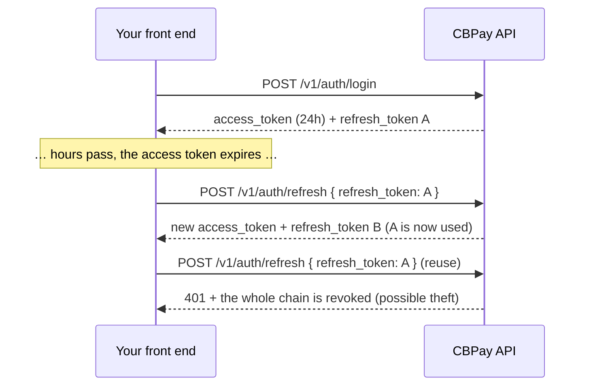

Every call (except register and login) requires a credential in the
`Authorization` header:

```
Authorization: Bearer <token>
```

`X-API-Key: <token>` is accepted as an alternative header.

## Credential types

<Tabs>
<Tab title="JWT session (users with login)">

Obtained from `POST /v1/auth/register` or `POST /v1/auth/login`, valid for
**24 hours**. Meant for apps where users sign in. Along with the
`access_token` you receive a **refresh token** to renew the session without
asking for the password again — see
[session renewal](#session-renewal-refresh-tokens).

```bash
curl -X POST https://api.qbank.cl/platform/v1/auth/login \
  -H "Content-Type: application/json" \
  -d '{ "org": "cbpay", "email": "ana@example.com", "password": "…" }'
```

```json
{
  "access_token": "eyJ…",
  "expires_at": "2026-07-14T15:20:49Z",
  "refresh_token": "rt_6a1e6c22-….XXXXXXXX…",
  "refresh_expires_at": "2026-08-12T15:20:49Z",
  "account_id": "…",
  "role": "owner"
}
```

Company accounts can have multiple **members** with roles — see
[company members](#company-members) below.

<Note>
If the account's policy requires **OTP on login**, the response carries
`otp_required: true` with a `pending_token` instead of the session: the
second step completes at `POST /v1/auth/login/otp` with the code received
over SMS/WhatsApp. Full flow in [security and 2FA](/en/security-2fa).
</Note>

<Note>
You can also offer **sign up and sign in with Google, Apple, Microsoft or
Facebook** (passwordless) — see [social login](/en/guides/social-login).
</Note>

</Tab>
<Tab title="API key (server to server)">

Format `pk_<key_id>.<secret>`. Never expires and is not tied to a session.
Issue one with:

```bash
curl -X POST https://api.qbank.cl/platform/v1/api-keys \
  -H "Authorization: Bearer <session-token>" \
  -H "Content-Type: application/json" \
  -d '{ "label": "production-backend" }'
```

```json
{
  "api_key_id": "…",
  "key_id": "a1b2c3d4e5f60718",
  "token": "pk_a1b2c3d4e5f60718.XXXXXXXX…",
  "note": "store this token now; it cannot be retrieved again"
}
```

<Warning>
The plaintext token is shown **exactly once**. Only a hash is stored server
side — if you lose it, issue a new key.
</Warning>

</Tab>
</Tabs>

## Session renewal (refresh tokens)

The `access_token` lasts 24 hours; the `refresh_token` (`rt_…`) lets you get
a fresh pair **without re-login** for 30 days, renewed on every use up to a
maximum of 90 days from the original login. It is **single-use**: every
exchange returns a new `refresh_token` and invalidates the previous one
(rotation).



```bash
curl -X POST https://api.qbank.cl/platform/v1/auth/refresh \
  -H "Content-Type: application/json" \
  -d '{ "refresh_token": "rt_6a1e6c22-….XXXXXXXX…" }'
```

```json
{
  "access_token": "eyJ…",
  "expires_at": "2026-07-14T15:20:50Z",
  "refresh_token": "rt_9f2b1c30-….YYYYYYYY…",
  "refresh_expires_at": "2026-08-12T15:20:50Z",
  "account_id": "…",
  "role": "owner"
}
```

Security rules your front end must know:

- **Strict rotation**: on exchange, the previous access token of that device
  is revoked immediately (only one live access token per chain). Always
  replace BOTH tokens with the ones in the response.
- **Reuse = theft**: if an already-exchanged refresh token is presented
  again, the device's entire chain is revoked (tokens and sessions) and a
  `refresh_token_reuse` event is recorded in
  `GET /v1/me/security/events`. The user must sign in again.
- **Dies with the session**: signing out (`DELETE /v1/me/sessions/{id}`),
  `POST /v1/me/sessions/revoke-all` or a password change/reset also
  invalidate the associated refresh tokens.
- Every rejection returns `401 invalid_refresh_token` — on that error, send
  the user to the login screen.
- Store the refresh token in secure storage (Keychain/Keystore on mobile; on
  web, prefer memory + re-login or an httpOnly cookie from your backend).
  `pk_` API keys do not use refresh: they never expire.

<AccordionGroup>
<Accordion title="How often should I refresh?">
When the access token is about to expire (use `expires_at`) or upon a `401`
on a normal call. Avoid refreshing in parallel from several places: if two
exchanges of the same token race, one wins and the other gets a `401`
without penalty — but exchanging a token that was ALREADY rotated revokes
the chain.
</Accordion>
<Accordion title="What happens after 90 days?">
The chain's absolute cap is 90 days from the original login: even refreshing
daily, once the limit is reached the refresh returns `401` and the user must
authenticate again (password, passkey or social login).
</Accordion>
<Accordion title="Does refresh work with API keys?">
Not applicable: `pk_` API keys never expire and have no session. Refresh is
only for JWT sessions of human users.
</Accordion>
</AccordionGroup>

## Access level

Your credential (session JWT or API key) operates **your own account**:
balances, payouts, payins, transfers, crypto, KYC/KYB and your own webhooks. If
an endpoint responds `403 account_required` or `403 org_admin_required`,
that operation belongs to a different credential level — contact the CBPay
team.

## Your account profile

```bash
# Read the profile (includes kyc_status and type)
curl https://api.qbank.cl/platform/v1/me \
  -H "Authorization: Bearer <token>"

# Update profile fields (all optional)
curl -X PATCH https://api.qbank.cl/platform/v1/me \
  -H "Authorization: Bearer <token>" \
  -H "Content-Type: application/json" \
  -d '{
    "display_name": "Comercial Andina SpA",
    "tax_id": "76.543.210-8",
    "phone": "+56 9 1234 5678",
    "country": "CL"
  }'
```

```json
{
  "id": "9b1deb4d-3b7d-4bad-9bdd-2b0d7b3dcb6d",
  "type": "company",
  "display_name": "Comercial Andina SpA",
  "email": "legal@andina.cl",
  "tax_id": "76.543.210-8",
  "phone": "+56 9 1234 5678",
  "country": "CL",
  "status": "active",
  "kyc_status": "approved",
  "created_at": "2026-06-01T12:00:00Z"
}
```

`PATCH /v1/me` accepts `display_name`, `tax_id`, `phone` and `country`
(send only the ones that change). `email`, `status` and `kyc_status` are
not self-managed: the administrator resolves them.

## Company members

**Company** accounts can have multiple users with their own login and
different permission levels:

| Role | Permissions |
|---|---|
| `owner` | Everything: operates, manages members and credentials |
| `operator` | Day-to-day operation (default when creating a member) |
| `viewer` | Read-only |

```bash
# Add a member (company accounts only)
curl -X POST https://api.qbank.cl/platform/v1/members \
  -H "Authorization: Bearer <token>" \
  -H "Content-Type: application/json" \
  -d '{
    "email": "finance@andina.cl",
    "password": "a-strong-password",
    "role": "viewer"
  }'

# List members
curl "https://api.qbank.cl/platform/v1/members?page_size=50" \
  -H "Authorization: Bearer <token>"
```

```json
{
  "page": 1,
  "page_size": 50,
  "members": [
    { "id": "…", "email": "legal@andina.cl", "role": "owner", "status": "active" },
    { "id": "…", "email": "finance@andina.cl", "role": "viewer", "status": "active" }
  ]
}
```

On a person account, `POST /v1/members` responds `403 company_only`.

## Best practices

- Store API keys in a secrets manager; never in code or in the browser.
- Use one key per environment/service (descriptive `label`) so you can
  rotate without downtime.

<Steps>
  <Step title="Zero-downtime rotation">
    Issue the new key with `POST /v1/api-keys` (new label).
  </Step>
  <Step title="Deploy">
    Update your service to use the new key.
  </Step>
  <Step title="Retire the old one">
    Ask the CBPay team to revoke the previous key once traffic migrated.
  </Step>
</Steps>

- JWT sessions are for front-ends; automated processes should always use
  API keys.
