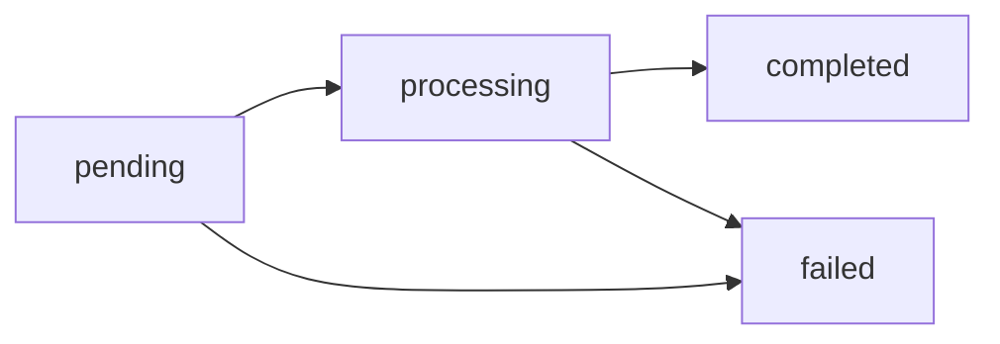

## One balance: USDT

Every account holds a virtual balance in **USDT with 6 decimal places**. All
operations — payouts in Chilean pesos, collections in soles, on-chain
withdrawals — settle against that single balance.

Amounts always travel as **decimal strings**:

```json
{ "asset": "USDT", "available": "125.430000", "held": "10.000000" }
```

<Note>
Internally amounts are stored as integers in micro-USDT
(1 USDT = 1,000,000 units) and computed with exact rational arithmetic.
There are no floats and no accumulated rounding errors.
</Note>

## `available` and `held`

| Field | Meaning |
|---|---|
| `available` | Balance available to operate |
| `held` | Reserved by in-flight operations (pending payouts and withdrawals) |

When you create a payout or withdrawal, the debit (`amount + fee`) leaves
`available` and sits in `held` until the operation reaches a final state:

- **`completed`** → the hold is consumed; the money left.
- **`failed`** → the full debit (amount + fee) is refunded to `available`.

## FX conversion (fiat ↔ USDT)

Fiat operations convert to USDT at **your account's rate** at execution
time (the same one returned by `GET /v1/rates`, USD base). Conversion
rounds **up** on the debit side, with at most 1 micro-USDT of difference.

Example — a 50,000 CLP payout at a 950.25 rate:

```
usdt_amount = ceil(50000 / 950.25 × 10^6) / 10^6 = 52.618258 USDT
total_debit = usdt_amount + fee
```

The rate used is recorded on the object (`fx_rate`) for auditability.

## Immutable ledger

Every movement produces an immutable entry with the resulting balance
(`balance_after`). Your full history lives at `GET /v1/movements`:

| `type` | What it represents |
|---|---|
| `payin_credit` | Credit from a fiat collection |
| `payout_debit` / `payout_refund` | Payout debit / refund on failure |
| `transfer_in` / `transfer_out` | Internal transfer received / sent |
| `funding` | On-chain USDT deposit credited |
| `withdrawal_debit` / `withdrawal_refund` | On-chain withdrawal / refund on failure |
| `compliance_fee` / `compliance_refund` | KYC/KYB service charge / refund |
| `wallet_creation_fee` / `wallet_creation_refund` | Wallet creation charge / refund |
| `adjustment` | Manual adjustment by CBPay (audited) |

```bash
curl "https://api.qbank.cl/platform/v1/movements?type=payout_debit&from=2026-07-01&to=2026-07-07&page_size=20" \
  -H "Authorization: Bearer <token>"
```

Every list endpoint (`/v1/movements`, `/v1/payouts`, `/v1/payins`,
`/v1/crypto/transactions`, `/v1/banking/operations`) accepts pagination
(`page`, `page_size` up to 200) and `from`/`to` date filters
(YYYY-MM-DD, UTC, inclusive).

## Operation states

Payouts and crypto withdrawals follow the same lifecycle:



Final states (`completed`/`failed`) arrive via [webhook](/en/webhooks); no
polling required.
