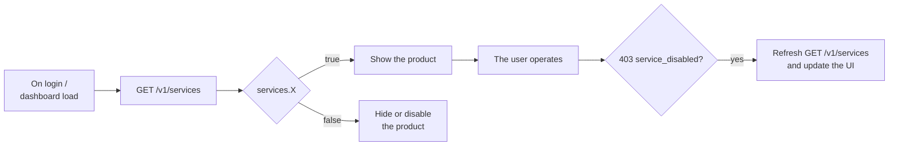

Every account has a **set of enabled services** according to its
commercial agreement with CBPay. Before showing a product in your UI (or
trying to use it), query the effective map:

```bash
curl https://api.qbank.cl/platform/v1/services \
  -H "Authorization: Bearer <token>"
```

```json
{
  "account_id": "9b1deb4d-3b7d-4bad-9bdd-2b0d7b3dcb6d",
  "services": {
    "payouts": true,
    "payins": true,
    "transfers": true,
    "crypto": true,
    "banking": false,
    "kyc": true,
    "cards": false
  }
}
```

## Service catalog

| Service | What it enables |
|---|---|
| `payouts` | Fiat dispersals (`POST /v1/payouts`, QR scan/confirm) |
| `payins` | Fiat collections (QR, transfer, payment page, collect, CLABE) |
| `transfers` | Internal transfers between CBPay accounts |
| `crypto` | On-chain wallets and USDT withdrawals |
| `banking` | International bank accounts (profile, accounts, payments) |
| `kyc` | Third-party KYC/KYB identity verification (links, submissions, documents, liveness) |
| `aml` | AML list screening, rescreening and monitoring |
| `cards` | Card issuing and operation |

## What happens when a service is off

The product's **actions** respond `403 service_disabled`:

```json
{
  "error": "service_disabled",
  "message": "this service is not enabled for your account"
}
```

Important rules:

- **Reads are never blocked**: you can always list and query your
  historical operations, balances and movements.
- **In-flight money finishes its cycle**: a `processing` payout completes
  (or refunds) even if the service is disabled afterwards.
- With `cards` off, card purchases stop authorizing instantly and no
  monthly fees are generated.

## Recommended integration pattern



1. Query `GET /v1/services` when your app loads (and cache for a few minutes).
2. Show only the products set to `true`.
3. Still handle `403 service_disabled` on any action: configuration can
   change between your cache and the operation.

<Note>
Services are enabled by your organization according to the commercial
agreement. If you need a product activated (for example `banking` or
`cards`), contact your CBPay administrator — the change is immediate, no
redeploy needed.
</Note>
