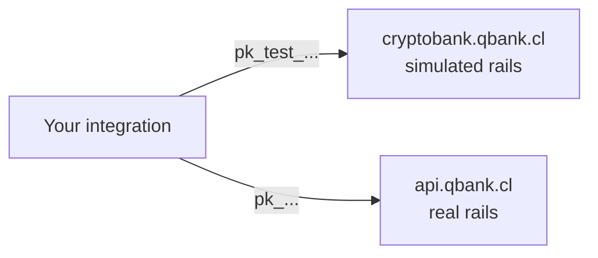

CBPay runs on **two environments**: **test** (sandbox, simulated money) and
**live** (production, real money). They are fully isolated — separate URLs,
separate API keys, separate data — and expose exactly the same API, so an
integration built against test works in live by swapping the base URL and
the key.

| | Test (sandbox) | Live (production) |
|---|---|---|
| Base URL | `https://cryptobank.qbank.cl/platform` | `https://api.qbank.cl/platform` |
| API keys | `pk_test_...` | `pk_...` |
| Money | Simulated (nothing real moves) | **Real and irreversible** |
| Providers | Internal simulator — always available, deterministic | Real banking rails |
| Response header | `CBPay-Environment: test` | `CBPay-Environment: live` |

<Note>
Keys never cross environments: a `pk_test_` key is rejected by live and a
live `pk_` key is rejected by test. There is no flag to flip — the
environment is defined by where you point your requests.
</Note>



## How the test environment behaves

The test environment is **fully self-contained**: every corridor (payouts,
payins, transfers, crypto, banking, cards, identity verification) is served
by an internal simulator, so it never depends on any third party being up.
Operations resolve **deterministically**:

- Any operation you create is accepted and reaches `completed` after a few
  seconds (default ~10s), firing the same webhooks as live.
- Specific **magic values** force every other outcome, so you can test your
  failure handling without guessing.

### Magic values

| Product | Value | Outcome |
|---|---|---|
| Payouts | Amount ending in `.99` (e.g. `100.99`) | Fails after the settle delay (`failed`, balance refunded) |
| Payouts | Amount ending in `.77` | Stays `processing` forever (test your timeout handling) |
| Payouts | Beneficiary name containing `REJECT` | Rejected immediately |
| Payins (QR / payment page) | Amount ending in `.99` | The charge expires unpaid |
| Payins (QR / payment page) | Amount ending in `.77` | Stays `pending` forever |
| Payins (QR / payment page) | Any other amount | Pays itself after the settle delay and credits your balance |
| Collect (pull charges) | OTP `000000` | Approves the charge; any other OTP fails |
| Login / 2FA codes | `000000` | Valid on every channel (SMS, WhatsApp, email) — no message is actually sent |
| Identity verification (KYC/KYB) | Name or external id containing `REJECT` | Verification ends `rejected` |
| Identity verification (KYC/KYB) | Anything else | Auto-approves after the settle delay (documents always pass OCR) |
| AML screening | Name containing `SANCTION` | Screens with hits, risk `prohibited` |
| AML screening | Name containing `PEP` | Screens with hits, risk `high` |
| Crypto withdrawal address | Ending in `SANC` | Blocked by the sanctions gate |
| Crypto withdrawal address | Ending in `HIGH` / `MED` | Screens as high / medium risk |
| Crypto withdrawals | Any address (not magic) | Confirms with a `SIMTX...` transaction id after the delay |

<Tip>
Crypto **deposits** in test are credited from the dashboard (or by your
platform administrator) — there is no real chain to send from. Withdrawals,
balances, holds and webhooks behave exactly like live.
</Tip>

### What differs from live

- No real money, cards, emails or SMS ever leave the test environment.
- Bank catalogs are fictitious (`Simulated National Bank`, ...).
- FX rates are real (same source as live) so amounts look realistic.
- Test data is periodically refreshed from a sanitized snapshot; treat the
  test dataset as disposable.

## Test mode from the dashboard

The dashboard's **test/live switch** moves your session between
environments with one click — no separate registration and no second login.
If your account does not exist in test yet, it is created automatically the
first time you switch. API keys are managed per environment: create your
`pk_test_` keys while in test mode.

## Testing webhooks in local development

Callback URLs must be **public HTTPS**: `localhost`, private IPs and
`.local` domains are rejected when creating the subscription. To develop
on your machine use an HTTPS tunnel:

<CodeGroup>

```bash Cloudflare Tunnel (free)
# Install cloudflared and expose your local port
cloudflared tunnel --url http://localhost:3000
# → https://<random>.trycloudflare.com  ← use it as callback_url
```

```bash ngrok
ngrok http 3000
# → https://<random>.ngrok-free.app  ← use it as callback_url
```

</CodeGroup>

Then create the subscription with that public URL (note the test base URL):

```bash
curl -X POST https://cryptobank.qbank.cl/platform/v1/webhooks/subscriptions \
  -H "X-API-Key: pk_test_..." \
  -H "Content-Type: application/json" \
  -d '{
    "event_type": "payin_credited",
    "callback_url": "https://your-tunnel.trycloudflare.com/webhooks/cbpay",
    "secret": "a-long-random-secret"
  }'
```

<Tip>
Failed deliveries retry up to **5 times with incremental backoff**, so if
your tunnel drops for a few minutes you will not lose the event. Always
verify the HMAC signature — full recipe in
[webhooks](/en/webhooks#signature-verification).
</Tip>

## Exercising every flow in test

| Product | How to test it |
|---|---|
| Payout | Create it with any beneficiary; it completes in seconds. Use the magic amounts to force failures |
| Payin | Create a QR charge or payment page; it pays itself after the delay and credits your balance |
| Transfer | Create a second test account and transfer between both (free) |
| Crypto | Credit a test deposit from the dashboard, then withdraw to any address |
| Identity (KYC/KYB) | Create the verification link; it auto-approves in seconds |
| AML | Screen `John SANCTION` and `Maria PEP` to exercise your hit handling |
| Cards | Issue a card and simulate purchases from the dashboard |
| 2FA | Enable it and use code `000000` everywhere |

## Go-live checklist

Before pointing your integration at the live environment:

- [ ] Swap the base URL to `https://api.qbank.cl/platform` and the key to your live `pk_...` (issued in live mode).
- [ ] API keys live in a secrets manager (never in the frontend or the repo).
- [ ] Every money operation sends an `idempotency_key` derived from YOUR internal id (not a random UUID per attempt).
- [ ] On timeout or `5xx` you **do not retry with a new key**: repeat with the same key or query the state with the `GET`.
- [ ] You verify the HMAC signature of every webhook and answer `2xx` fast (process async).
- [ ] You handle non-final states (`pending`, `processing`) without assuming success — in live, settlement takes longer than the 10 simulated seconds.
- [ ] You re-created your webhook subscriptions in live (test subscriptions do not carry over).
- [ ] You query `GET /v1/services` to show only enabled products — see [services](/en/concepts/services).
- [ ] You reconcile daily with `GET /v1/movements` or the [statement](/en/guides/statement).
- [ ] You have a channel with the CBPay team for `unassigned` deposits or incidents.

<Warning>
In **live** every operation is real and irreversible once completed. A
`completed` payout is already in the beneficiary's account; the only
reversal path is outside the API (contact the CBPay team).
</Warning>

<AccordionGroup>
  <Accordion title="Does test mode cost anything?">
    No. Fees are charged against simulated balances, so you can exercise
    the full pricing logic without spending real money.
  </Accordion>
  <Accordion title="Can I use my live key in test (or vice versa)?">
    No. Each environment only accepts its own keys (`pk_test_` in test,
    `pk_` in live). A key from the other environment returns `401`.
  </Accordion>
  <Accordion title="How do I know which environment answered?">
    Every response carries the `CBPay-Environment` header (`test` or
    `live`), and `GET /healthz` returns `livemode`.
  </Accordion>
  <Accordion title="Why did my test data disappear?">
    The test dataset is periodically refreshed from a sanitized snapshot of
    production. Rebuild your fixtures via API (they are cheap: everything
    resolves in seconds) and treat test data as disposable.
  </Accordion>
  <Accordion title="Do webhooks fire in test?">
    Yes — the exact same events, signed with your test subscription's
    secret. Point them at your development tunnel.
  </Accordion>
</AccordionGroup>
