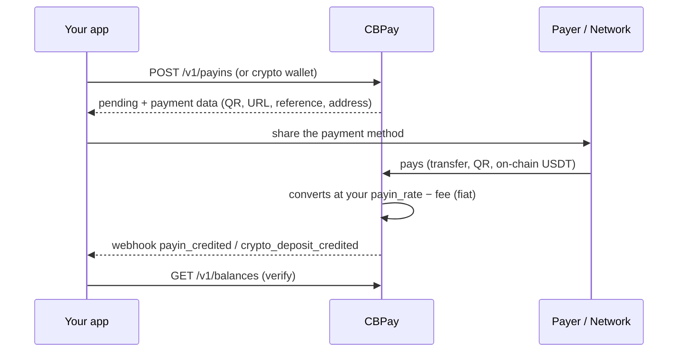
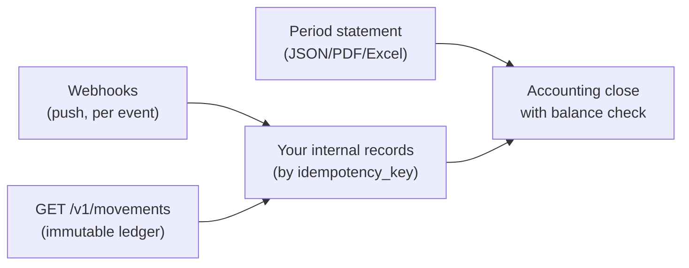
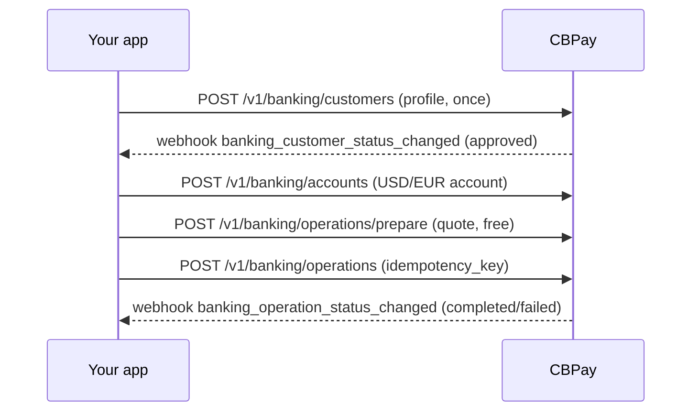

This page connects the products into **complete business flows**: what to
call, what to expect and which webhook closes each cycle. Every flow links
to its product's detailed guide.

## 1. Funding the account

Three paths for money to come in; all end with a USDT credit and a
webhook:



| Path | Endpoint | Closing webhook |
|---|---|---|
| Fiat collection (QR, transfer, payment page, pull) | `POST /v1/payins` / `/collect` | `payin_credited` |
| On-chain USDT deposit | `POST /v1/crypto/wallets` (fixed address) | `crypto_deposit_credited` |
| Internal transfer from another account | — (the sender initiates it) | `transfer_received` |

Details: [payins](/en/guides/payins) · [crypto](/en/guides/crypto) ·
[transfers](/en/guides/transfers).

## 2. Dispersing (payout)

```mermaid
sequenceDiagram
    participant App as Your app
    participant CB as CBPay
    participant Banco as Local rail
    App->>CB: POST /v1/payouts (idempotency_key)
    CB-->>App: 202 processing (fx_rate, total_debit; debit sits in held)
    CB->>Banco: executes the dispersal
    alt paid
        Banco-->>CB: confirmation
        CB-->>App: webhook payout_status_changed (completed)
    else rejection
        Banco-->>CB: rejection
        CB->>CB: refunds the FULL debit to available
        CB-->>App: webhook payout_status_changed (failed + status_code)
    end
    App->>CB: GET /v1/payouts/{id} (verify final state)
```

**QR** variant (Bolivia): `POST /v1/payouts/qr/scan` (free, decodes) →
show the data → `POST /v1/payouts/qr/confirm` (charged like a normal
payout). Details: [payouts](/en/guides/payouts).

## 3. Collecting from a customer

Pick the mode based on the country and the experience you want:

| Mode | Countries | Payer experience | Confirmation |
|---|---|---|---|
| Hosted payment page | CL | Opens a URL and pays from their bank | Automatic |
| QR | BO, BR (PIX) | Scans with their banking app | Automatic |
| Announced transfer | CL, PE, MX, BR | Transfers including the reference | Automatic by reference (or amount) |
| Dedicated CLABE | MX | Transfers to a fixed CLABE of yours | Automatic, no references |
| Pull collection (c2p / debit) | VE | Authorizes with OTP and you execute the charge | **Synchronous** in the same call |

All close with `payin_credited` and the net credit in your balance.
Details: [payins](/en/guides/payins).

## 4. Reconciling



Full recipe in
[movements and reconciliation](/en/concepts/movements-reconciliation) and
[statement](/en/guides/statement).

## 5. End-to-end international banking



Banking balances live in your bank accounts (separate from USDT); CBPay
only charges the configured fixed fees. Details:
[banking](/en/guides/banking).

<Tip>
First integration? Follow the [quickstart](/en/quickstart) (fund → payout
→ webhook) and come back here as you add products.
</Tip>
