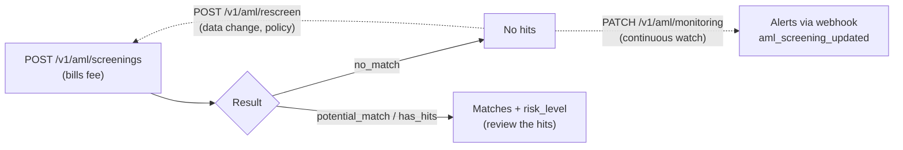

import { EnvUrls } from "/snippets/env-urls.jsx";

<EnvUrls lang="en" />

**AML screening** checks a person's or company's identity against global
lists — sanctions, PEP, adverse media — and returns the analysis result
with its risk level. It is a pure compliance product: it does **not**
verify identity with documents or a liveness check (that is
[KYC/KYB verification](/en/guides/kyc)); it analyzes whether the identity
carries list risk.



<Warning>
**Breaking change (v1.34)**: this product used to live at `POST /v1/kyc`,
`/v1/kyc/rescreen` and `PATCH /v1/kyc/monitoring`. Those routes were
**removed** and are now `POST /v1/aml/screenings`, `POST /v1/aml/rescreen`
and `PATCH /v1/aml/monitoring` (same semantics, same fees). The
`/v1/kyc/...` routes now belong to
[identity verification](/en/guides/kyc), a different product.
</Warning>

<Note>
If CBPay configured a compliance fee, it is debited **before** the call
(you will see `compliance_fee` in the response) and **automatically
refunded** if the screening fails. With a fee of 0 the service is free for
you. Requires your own
[approved identity verification](/en/guides/kyc#your-own-verification-onboarding).
</Note>

## Catalogs to build your form

Before building the screening (or verification) form, fetch the official
catalogs with `GET /v1/aml/catalogs`: genders, company statuses, address
types, legal entity forms (global list plus per-country cascade),
income/wealth sources, industry standards with their per-country default,
and the full ISO-3166 country and subdivision lists. Every entry carries
`value` (what you send to the API) and `label` (what you display). Static
data — safe to cache for hours.

```bash
curl https://api.qbank.cl/platform/v1/aml/catalogs \
  -H "Authorization: Bearer <token>"
```

```json
{
  "genders": [ { "value": "male", "label": "Male" } ],
  "company_types_by_country": {
    "CL": [ { "value": "Sociedad por Acciones", "label": "Sociedad por Acciones" } ]
  },
  "industry_code_type_by_country": { "CL": "ISIC" },
  "countries": [ { "value": "CL", "label": "Chile" } ],
  "meta": { "note": "value = send to the API; label = display in the UI." }
}
```

<Tip>
Cascades: the company's country fixes its legal forms
(`company_types_by_country[country]`, falling back to `company_types`) and
its industry standard (`industry_code_type_by_country[country]`, default
ISIC); with that standard you take the codes from
`industries_by_code_type[standard]`.
</Tip>

### Cities catalog (per country)

When the form asks for a city, fetch
`GET /v1/aml/catalogs/cities?country=US` once the country is picked — one
call per country, then filter by state on the client:

```bash
curl "https://api.qbank.cl/platform/v1/aml/catalogs/cities?country=US" \
  -H "Authorization: Bearer <token>"
```

```json
{
  "country": "US",
  "states": { "US-FL": ["Miami", "Orlando"] },
  "country_cities": [],
  "meta": { "state_count": 51, "city_count": 3200 }
}
```

- `states` keys are the same ISO 3166-2 subdivisions as
  `country_subdivisions` in the main catalog; `country_cities` lists the
  cities whose region could not be mapped to a subdivision — offer them too.
  Neither field is ever `null`.
- A country without coverage answers `200` with empty lists — fall back to a
  free-text city field. A malformed code gets `400 invalid_country`; an
  unknown one, `404 country_not_found`.
- Static data served with `Cache-Control: public, max-age=86400` — safe to
  cache for a day.

## Submit a screening

One endpoint for person and company; the type is detected from the payload
(other differences between account types are summarized in
[persons and companies](/en/concepts/persons-companies)):

<CodeGroup>

```bash Person
curl -X POST https://api.qbank.cl/platform/v1/aml/screenings \
  -H "Authorization: Bearer <token>" \
  -H "Content-Type: application/json" \
  -d '{
    "customer": {
      "person": {
        "full_name": "Ana Pérez Rojas",
        "date_of_birth": { "year": 1990, "month": 4, "day": 12 },
        "personal_identification": [
          { "issuing_country": "CL", "number": "12.345.678-5" }
        ]
      },
      "email": "ana@example.com",
      "country": "CL"
    },
    "monitor": false
  }'
```

```bash Company
curl -X POST https://api.qbank.cl/platform/v1/aml/screenings \
  -H "Authorization: Bearer <token>" \
  -H "Content-Type: application/json" \
  -d '{
    "customer": {
      "company": {
        "legal_name": "Comercial Andina SpA",
        "registration_authority_identification": "76.543.210-8"
      },
      "email": "legal@andina.cl",
      "country": "CL"
    },
    "monitor": true
  }'
```

```bash Minimal (autofilled from your account)
curl -X POST https://api.qbank.cl/platform/v1/aml/screenings \
  -H "Authorization: Bearer <token>" \
  -H "Content-Type: application/json" \
  -d '{ "customer": {}, "monitor": false }'
```

</CodeGroup>

If you omit `person`/`company`, it is filled from your account data (the
person/company type comes from your account type).

## Send every identity field you have (recommended)

The `customer` object accepts **many more fields, all optional**, forwarded
verbatim to the screening engine: **the more identity data you send, the
more precise the analysis** — date of birth, countries and strong documents
rule out namesakes and reduce false positives.

| Field (person) | What it is |
|---|---|
| `full_name` — or `first_name` / `middle_name` / `last_name` | Full or split name |
| `date_of_birth` | ONLY as an object `{ "year": 1990, "month": 4, "day": 12 }` (a plain `"YYYY-MM-DD"` string is rejected with `422`) |
| `nationality` | Nationalities as an **array** of ISO-3166 codes, e.g. `["CL"]` (a plain string is rejected with `422`) |
| `country_of_birth` | Country of birth |
| `residential_information[]` | Residences, each with `country_of_residence` |
| `personal_identification[]` | Strong documents: `{ "issuing_country", "number" }` (national id, passport…) — **no** `type` field (the engine rejects it) |
| `alias` / `aliases` | Other known names |

| Field (company) | What it is |
|---|---|
| `legal_name` | Legal name |
| `alias[]` | Trade names |
| `registration_authority_identification` | Tax/mercantile identifier (tax number, registry number) |
| `place_of_registration` | Registration/incorporation country (ISO-3166) |
| `incorporation_date` | Incorporation date as an object `{ "year": 2015, "month": 8, "day": 1 }` |
| `address[]` | Addresses, each with `country` |

<Warning>
The screening engine is strict about shapes and rejects mismatches with
`422`: inside `company`, do not send flat fields like `tax_id`,
`registration_number` or `country_of_incorporation` (the identifier goes in
`registration_authority_identification` and the country in
`place_of_registration`); inside `person`, `date_of_birth` goes ONLY as a
`{year, month, day}` object, `nationality` as an array, and
`personal_identification[]` without a `type` field (verified live
2026-07-18).
</Warning>

<Note>
A query with **exactly the same identity data** reuses the previous
screening (no new charge). Adding or changing identity fields (name, date,
country, document, alias) makes the search more specific and runs — and
bills — a new screening. Cosmetic fields (email, phone, textual address) do
not change the matching.
</Note>

`201` response — person and company share the same shape; only
`compliance_service` changes (`compliance_person` vs `compliance_company`,
each with its own fee):

<CodeGroup>

```json Person
{
  "customer_id": "cus_8f2e1a…",
  "status": "screened",
  "risk_level": "low",
  "screening_result": "no_match",
  "compliance_service": "compliance_person",
  "compliance_fee": "0.500000"
}
```

```json Company
{
  "customer_id": "cus_5b7c33…",
  "status": "screened",
  "risk_level": "medium",
  "screening_result": "potential_match",
  "compliance_service": "compliance_company",
  "compliance_fee": "1.000000"
}
```

</CodeGroup>

## Rescreening

Re-runs the analysis of the same identity (e.g. after a data change or on a
periodic policy). No body — it uses the `customer_id` of your previous
screening:

```bash
curl -X POST https://api.qbank.cl/platform/v1/aml/rescreen \
  -H "Authorization: Bearer <token>"
```

`200` response (bills `compliance_rescreen`, when configured):

```json
{
  "customer_id": "cus_8f2e1a…",
  "status": "screened",
  "risk_level": "low",
  "screening_result": "no_match",
  "compliance_service": "compliance_rescreen",
  "compliance_fee": "0.250000"
}
```

Requires a previous screening; otherwise `409 no_screening`.

## Continuous monitoring

Enables (or disables) permanent watch over the identity — list changes,
PEP, adverse media. Updates arrive via the `aml_screening_updated` webhook:

<CodeGroup>

```bash Enable (bills compliance_monitoring)
curl -X PATCH https://api.qbank.cl/platform/v1/aml/monitoring \
  -H "Authorization: Bearer <token>" \
  -H "Content-Type: application/json" \
  -d '{ "enabled": true }'
```

```bash Disable (always free)
curl -X PATCH https://api.qbank.cl/platform/v1/aml/monitoring \
  -H "Authorization: Bearer <token>" \
  -H "Content-Type: application/json" \
  -d '{ "enabled": false }'
```

</CodeGroup>

`200` response:

```json
{
  "customer_id": "cus_8f2e1a…",
  "monitoring": true,
  "compliance_service": "compliance_monitoring",
  "compliance_fee": "0.100000"
}
```

When disabling, `compliance_fee` returns `"0.000000"` — disabling is
always free.

## Screening PDF report

Every screening in your history can be downloaded as an **executive PDF
report** with your branding: a cover page with the decision and its risk
traffic light, indicators (sanctions, watchlists, PEP, terrorism,
narcotics, adverse media, fraud, corruption, arms), the consolidated
matches with their lists and links, aliases, a signal glossary and a final
backing section with the international data sources consulted. It is the
document you hand to an auditor or a counterparty as evidence of the
analysis.

First locate the `screening_id` in your history:

```bash
curl "https://api.qbank.cl/platform/v1/aml/screenings?from=2026-07-01&to=2026-07-14&page=1&page_size=50" \
  -H "Authorization: Bearer <token>"
```

Then download the report (pure read — no fee, no idempotency key):

<CodeGroup>

```bash English (default)
curl "https://api.qbank.cl/platform/v1/aml/screenings/a1b2c3d4-e5f6-7890-abcd-ef1234567890/report" \
  -H "Authorization: Bearer <token>" \
  -o aml_report.pdf
```

```bash Spanish
curl "https://api.qbank.cl/platform/v1/aml/screenings/a1b2c3d4-e5f6-7890-abcd-ef1234567890/report?lang=es" \
  -H "Authorization: Bearer <token>" \
  -o aml_report.pdf
```

```bash Chinese
curl "https://api.qbank.cl/platform/v1/aml/screenings/a1b2c3d4-e5f6-7890-abcd-ef1234567890/report?lang=zh" \
  -H "Authorization: Bearer <token>" \
  -o aml_report.pdf
```

</CodeGroup>

The response is `application/pdf` with a descriptive `Content-Disposition`
filename. `lang` accepts `en` (default), `es` and `zh`; any other value
returns `400 invalid_language`. A `screening_id` that belongs to another
account returns `404`.

<Note>
The report is generated from the screening's persisted evidence, so it is
always available even if the compliance engine is down. The analysis data
(list names, media headlines) stays in its original language; only the
report labels are translated.
</Note>

## Webhook

| Event | When |
|---|---|
| `aml_screening_updated` | The screening finished, a case changed, the risk changed or a monitored transaction was reviewed |

Example payload:

```json
{
  "account_id": "9b1deb4d-3b7d-4bad-9bdd-2b0d7b3dcb6d",
  "screening_event": "compliance_risk_changed",
  "customer_id": "cus_8f2e1a…",
  "data": { "risk_level": "high" }
}
```

Subscribe the same way as every other event (see [Webhooks](/en/webhooks)).

## Errors

| HTTP | `error` | Cause | Solution |
|---|---|---|---|
| 400 | `invalid_language` | The PDF report `lang` is not `en`, `es` or `zh` | Use one of the three supported languages |
| 402 | `insufficient_funds` | Balance cannot cover the compliance fee | Fund the account and retry |
| 403 | `verification_required` | Your account has not approved its identity verification yet | Complete your [onboarding](/en/guides/kyc#your-own-verification-onboarding) |
| 403 | `service_disabled` | The `aml` service is disabled for your account | Contact your operator |
| 409 | `no_screening` | Rescreen/monitoring without a previous screening | Send `POST /v1/aml/screenings` first |
| 502 | `compliance_unavailable` | Service temporarily unavailable (the fee was refunded) | Retry later |

## FAQ

<AccordionGroup>
<Accordion title="What is the difference between AML screening and KYC/KYB verification?">
Screening checks an identity against lists (sanctions, PEP, adverse media)
— no documents involved. [KYC/KYB verification](/en/guides/kyc) proves the
person/company is who they claim to be, with a form, documents and a video
liveness check. They complement each other: verify identity with KYC/KYB
and watch its risk with AML.
</Accordion>
<Accordion title="Can I screen my own customers?">
Yes: the `customer` object accepts any identity, not only your account's.
Each screening bills its fee (person or company depending on the payload).
</Accordion>
<Accordion title="Does screening change my account's verification state?">
No. Since v1.34 your account's `kyc_status` is managed exclusively by the
KYC/KYB identity verification (your onboarding). Screening only evaluates
list risk.
</Accordion>
<Accordion title="Why does an old screening not appear in the history or have a PDF report?">
The history and the PDF report are generated from each screening's
persisted evidence, available for operations executed since the history
exists (v1.55). Screenings older than that version have no persisted
evidence, so they do not appear in `GET /v1/aml/screenings` and cannot
download a report. If you need the document, run a new screening of the
same identity (identical data reuses the previous result without a new
charge) and download its report.
</Accordion>
</AccordionGroup>
