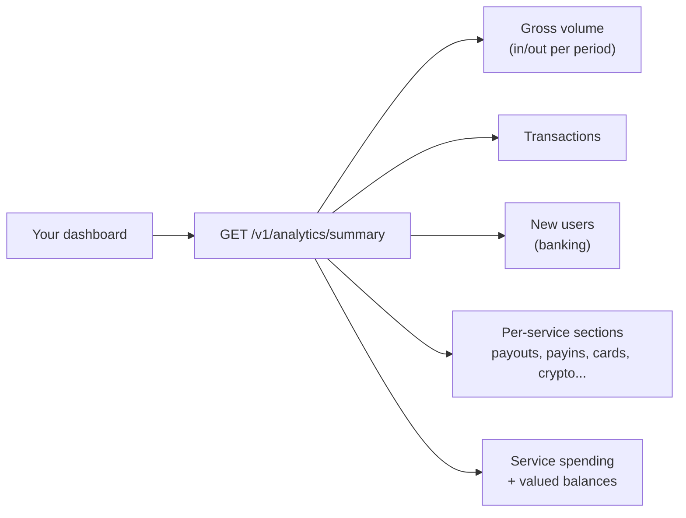

`GET /v1/analytics/summary` returns in **a single call** everything the
summary page of your account (person or company) needs: chart-ready time
series, the detail of every service with all its dimensions (country,
currency, method, status, chain, merchant), what you spent on services and
your balances valued in USD.



## Request

```bash
curl "https://api.qbank.cl/platform/v1/analytics/summary?from=2026-07-01&to=2026-07-10&granularity=day" \
  -H "Authorization: Bearer <token>"
```

| Parameter | Required | Description |
|---|---|---|
| `from` / `to` | Yes | `YYYY-MM-DD` range in UTC, both inclusive; 366 days max |
| `granularity` | No | `day` (default), `week` (Monday-Sunday) or `month` |

You only see **your own account's** data. All amounts are USD decimal
strings; buckets without activity come **zero-filled** so you can chart
directly.

## Global blocks (header KPIs and the 3 main charts)

```json
{
  "gross_volume": {
    "in": "636936.87",
    "out": "270118.87",
    "total": "907055.74",
    "series": [
      { "date": "2026-07-01", "in": "51023.10", "out": "31210.44", "total": "82233.54" }
    ],
    "previous_period": { "in": "512300.00", "out": "241000.10", "total": "753300.10" },
    "change_pct": "20.41",
    "unpriced_assets": []
  },
  "transactions": {
    "total": 92,
    "series": [ { "date": "2026-07-01", "in": 3, "out": 5, "total": 8 } ],
    "previous_period": { "total": 71 },
    "change_pct": "29.58"
  },
  "new_users": {
    "total": 11,
    "series": [ { "date": "2026-07-01", "count": 1 } ],
    "previous_period": { "total": 6 },
    "change_pct": "83.33"
  }
}
```

- **`gross_volume`**: USD value of everything that came IN (payins, crypto
  deposits, received transfers) and went OUT (payouts, withdrawals, sent
  transfers, card purchases). Refunds are netted against their service —
  they never inflate volume. Swaps are internal conversion and have their
  own section.
- **`transactions`**: operation count (fees and refunds excluded).
- **`new_users`**: third-party banking users your company registered (zero
  series for person accounts).
- **`change_pct`**: variation vs the immediately previous period of the
  same length — for the ▲▼ deltas (`null` when the previous period was 0).
- `BTC`/`GOLD` are valued at the current reference price; if a price is
  unavailable the asset is listed in `unpriced_assets` and its amounts stay
  out of the USD totals (we never invent a price).

## `by_country` — global view per country

Payouts and payins combined, ordered by volume — for the map or per-country
bars:

```json
"by_country": [
  {
    "country": "BR",
    "payouts": { "count": 18, "volume_usd": "3410.20" },
    "payins":  { "count": 4,  "volume_usd": "820.00" },
    "total_usd": "4230.20"
  }
]
```

## `sections` — the detail of EVERY service

Each section carries totals, its per-bucket series and its own dimensions:

<AccordionGroup>
<Accordion title="payouts — fiat sends">

```json
"payouts": {
  "count": 24, "volume_usd": "5120.40", "fees_usd": "7.20",
  "series": [ { "date": "2026-07-01", "count": 3 } ],
  "by_status": [ { "key": "completed", "count": 21, "volume_usd": "4980.10" } ],
  "by_country": [
    { "country": "BR", "count": 18, "volume_usd": "3410.20", "local_volume": { "BRL": "17550" } }
  ],
  "by_method": [ { "key": "pix", "count": 18, "volume_usd": "3410.20" } ]
}
```

`by_status` gives you the success rate; `by_country` includes local
currency volume per currency; `by_method` splits pix, bank_transfer, yape,
etc. Failed payouts are excluded from volume (they were refunded).

</Accordion>
<Accordion title="payins — fiat collections">

```json
"payins": {
  "count": 9, "volume_usd": "2210.00", "fees_usd": "0.00",
  "series": [ { "date": "2026-07-02", "count": 2 } ],
  "by_country": [ { "key": "BO", "count": 5, "volume_usd": "1400.00" } ],
  "by_method": [ { "key": "qr", "count": 5, "volume_usd": "1400.00" } ],
  "by_kind":   [ { "key": "qr", "count": 5, "volume_usd": "1400.00" } ]
}
```

Only **credited** payins count.

</Accordion>
<Accordion title="deposits / withdrawals — on-chain crypto">

```json
"deposits": {
  "count": 3, "volume_usd": "1500.00",
  "series": [ { "date": "2026-07-03", "count": 1 } ],
  "by_chain": [ { "chain": "tron", "asset": "USDT", "count": 2, "amount": "1000.000000" } ]
},
"withdrawals": {
  "count": 2, "volume_usd": "600.00",
  "series": [ { "date": "2026-07-04", "count": 1 } ],
  "by_chain": [ { "chain": "eth", "asset": "USDC", "count": 1, "status": "completed", "amount": "500.000000", "fees": "1.000000" } ]
}
```

</Accordion>
<Accordion title="transfers, swaps and cards">

```json
"transfers": {
  "in":  { "count": 4, "volume_usd": "300.00" },
  "out": { "count": 2, "volume_usd": "120.00" },
  "series": [ { "date": "2026-07-01", "count": 1 } ]
},
"swaps": {
  "count": 5, "volume_usd": "890.00",
  "series": [ { "date": "2026-07-05", "count": 2 } ],
  "by_pair": [ { "pair": "USDT/BTC", "count": 3, "volume_usd": "600.00" } ]
},
"cards": {
  "count": 12, "volume_usd": "230.50", "fees_usd": "5.00", "active_cards": 1,
  "series": [ { "date": "2026-07-06", "count": 4 } ],
  "by_status": [ { "status": "settled", "count": 10, "volume_usd": "205.00" } ],
  "top_merchants": [ { "merchant": "AMAZON", "count": 4, "volume_usd": "98.20" } ]
}
```

</Accordion>
<Accordion title="banking, verifications (KYC/KYB), aml and contacts">

```json
"banking": {
  "new_third_parties": 11,
  "third_parties_series": [ { "date": "2026-07-01", "count": 1 } ],
  "new_accounts": 14,
  "accounts_series": [ { "date": "2026-07-01", "count": 2 } ],
  "operations": 6,
  "fees_usd": "18.00",
  "fees_by_service": { "banking_customer": { "count": 11, "fees_usd": "11.00" } }
},
"verifications": {
  "submissions": [ { "kind": "kyc", "status": "approved", "count": 3 } ],
  "links":       [ { "kind": "kyb", "status": "pending", "count": 1 } ],
  "fees_usd": "9.00"
},
"aml": { "screenings": 4, "fees_usd": "2.00", "by_service": { "compliance_screening": { "count": 4, "fees_usd": "2.00" } } },
"contacts": { "new_contacts": 7, "series": [ { "date": "2026-07-02", "count": 2 } ] }
```

`new_third_parties` is the same metric as the "new users" chart: the
banking users your company registered.

</Accordion>
</AccordionGroup>

## `spending` — what you consumed in services

Every explicit fee you paid in the period, with how many times each service
was billed:

```json
"spending": {
  "total_usd": "34.50",
  "by_service": {
    "banking_customer": { "count": 11, "fees_usd": "11.00" },
    "wallet_creation":  { "count": 2,  "fees_usd": "1.00" },
    "verification_kyc": { "count": 3,  "fees_usd": "9.00" }
  }
}
```

## `balances` — your balances valued

```json
"balances": {
  "items": [
    { "asset": "USDT", "available": "1520.250000", "held": "0.000000", "usd_estimate": "1520.25" },
    { "asset": "BTC",  "available": "0.00500000",  "held": "0.00000000", "usd_estimate": "313.68" }
  ],
  "net_worth_usd_estimate": "1833.93"
}
```

## Errors

| HTTP | `error` | What to do |
|---|---|---|
| 400 | `invalid_range` | `from`/`to` are required (`YYYY-MM-DD`) and the range max is 366 days |
| 400 | `invalid_granularity` | Use `day`, `week` or `month` |
| 403 | `account_required` | The endpoint requires an account credential |

## FAQ

<AccordionGroup>
<Accordion title="Which timezone are buckets in?">
UTC, same as the `from`/`to` filters across the whole API. If your front
shows another timezone, convert the labels when rendering.
</Accordion>
<Accordion title="What counts as volume and what does not?">
Everything that moved money to/from your account: payins, crypto deposits
and received transfers (in); payouts, withdrawals, sent transfers and card
purchases (out). Refunds are netted, fees are reported separately in
`spending`, and swaps (conversion between your own balances) have their own
section.
</Accordion>
<Accordion title="How are BTC and GOLD valued?">
At the reference price in force at query time (the same as
`GET /v1/rates`). It is a display valuation: if a price is unavailable, the
asset appears in `unpriced_assets` and is not added to the USD totals.
</Accordion>
<Accordion title="Do totals match the account statement?">
Yes: both come from the same ledger. The statement
(`GET /v1/reports/statement`) is the line-by-line accounting document; the
analytics endpoint is the aggregated view for charts.
</Accordion>
<Accordion title="How fresh is the data?">
Real time: every credited operation appears in the next call.
</Accordion>
</AccordionGroup>
