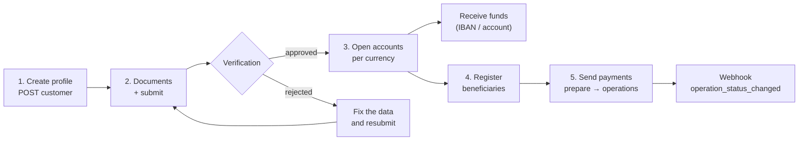
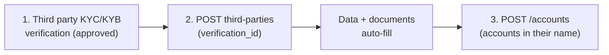

Banking gives you **real bank accounts** in the name of your verified
profile: you receive funds over international rails (SEPA, SWIFT, ACH
depending on the currency), hold fiat balances and send payments to third
parties. It is a separate product from your USDT balance: **banking money
lives in your bank accounts**, not in the CBPay balance.

| Concept | Where it lives | Queried with |
|---|---|---|
| CBPay USDT balance | CBPay ledger | `GET /v1/balances` |
| Bank balances | Your bank accounts | `GET /v1/banking/accounts/{id}/balance` |

<Note>
Banking fees (`banking_customer`, `banking_account`, `banking_operation`)
are fixed, debited from your **USDT balance** when each operation executes,
and **refunded automatically** if the operation fails. With a fee of 0
(the default) the service is free. The `banking_fee` field on each
response shows what was charged.
</Note>

## The full flow



1. **Create your banking profile** (`POST /v1/banking/customer`) — once.
2. **Upload verification documents** and **submit for review**.
3. Once `approved`, **open accounts** per currency.
4. **Register beneficiaries** (counterparties) for third-party payments.
5. **Send payments**: quote with `prepare`, execute with `operations`.

State changes arrive through the `banking_customer_status_changed` and
`banking_operation_status_changed` webhooks ([webhooks](/en/webhooks)).

## 1. Create your banking profile

Once per account. If you omit `type`, `name` or `email`, they are filled
from your CBPay account:

```bash
curl -X POST https://api.qbank.cl/platform/v1/banking/customer \
  -H "Authorization: Bearer <token>" \
  -H "Content-Type: application/json" \
  -d '{
    "currency": "USD",
    "address": { "countryIso": "CL", "city": "Santiago" }
  }'
```

Response `201`:

```json
{
  "customer_id": "9f2b…",
  "provider_id": "…",
  "status": "draft",
  "data": { "item": { "…": "…" } },
  "created_at": "2026-07-07T12:00:00Z",
  "banking_fee": "5.000000"
}
```

If your account already has a banking profile —
`409 banking_customer_exists`. Check the state at any time:

```bash
curl https://api.qbank.cl/platform/v1/banking/customer \
  -H "Authorization: Bearer <token>"
```

## 2. Documents and verification

Upload each document as base64 (free):

```bash
curl -X POST https://api.qbank.cl/platform/v1/banking/customer/documents \
  -H "Authorization: Bearer <token>" \
  -H "Content-Type: application/json" \
  -d '{
    "type": "PASSPORT",
    "filename": "passport.pdf",
    "attach": "<base64 content>"
  }'
```

Then submit the profile for review (free):

```bash
curl -X POST https://api.qbank.cl/platform/v1/banking/customer/submit \
  -H "Authorization: Bearer <token>"
```

Profile states: `draft` → `submitted` → `under_review` → **`approved`** or
`rejected`. The `banking_customer_status_changed` webhook notifies each
change — for your own profile (`customer_kind: self`) and for the third
parties you register (`customer_kind: third_party`, with their
`third_party_id`):

```json
{
  "account_id": "…",
  "customer_id": "9f2b…",
  "customer_kind": "self",
  "kyc_status": "approved"
}
```

## 3. Open bank accounts

With the profile `approved`, create one account per currency. Available
currencies: **USD** (ACH/Fedwire/SWIFT rails) and **EUR** (SEPA/SWIFT):

```bash
curl -X POST https://api.qbank.cl/platform/v1/banking/accounts \
  -H "Authorization: Bearer <token>" \
  -H "Content-Type: application/json" \
  -d '{ "currency": "USD", "name": "Operating USD" }'
```

Response `201` — `data` carries the details to **receive** funds (account
number/IBAN, routing, bank):

```json
{
  "account_id": "c4d1…",
  "provider_id": "…",
  "status": "active",
  "data": { "…": "…" },
  "banking_fee": "1.000000"
}
```

List your accounts, fetch the detail of a specific account, and check
balances:

```bash
curl https://api.qbank.cl/platform/v1/banking/accounts \
  -H "Authorization: Bearer <token>"

curl https://api.qbank.cl/platform/v1/banking/accounts/c4d1… \
  -H "Authorization: Bearer <token>"

curl https://api.qbank.cl/platform/v1/banking/accounts/c4d1…/balance \
  -H "Authorization: Bearer <token>"
```

The detail endpoint (`GET /v1/banking/accounts/{id}`) returns the account
LIVE — name, currency, status, and under `data` the **requirements to
receive funds** (wire and local rails: bank, account number/IBAN,
routing). Use it to show the deposit instructions of a specific account
without walking the list:

```json
{
  "account_id": "c4d1…",
  "provider_id": "…",
  "data": {
    "name": "Operativa USD",
    "currencyCode": "USD",
    "status": "ACCEPT",
    "requisites": [
      { "type": "SWIFT", "…": "…" },
      { "type": "LOCAL", "…": "…" }
    ]
  }
}
```

<Note>
The list exposes only the accounts **enabled for your operation**
according to the corridor configuration. A non-enabled account does not
appear in the list and its by-id queries respond `404 not_found`.
</Note>

<Note>
**Limit for person accounts**: a person account can hold **at most 1 bank
account**. Attempting a second one returns `409 banking_account_limit`.
Company accounts have no limit.
</Note>

## Third-party users (companies only)

If your account is a **company**, besides your own accounts you can
register **third-party banking users** — your end clients (persons or
companies) — each with their own identity and verification and **bank
accounts in their name**. No limit on third parties or accounts per third
party.



### Registering the third party

Registration requires the `verification_id` of an [**approved** KYC/KYB
verification](/en/guides/kyc) of the third party — their single identity
inside CBPay. The type comes from the verification kind (KYC ⇒
`INDIVIDUAL`, KYB ⇒ `COMPANY`), the data (name, email, address) auto-fills
from the verified profile (whatever you send explicitly wins), and the
**already-validated documents are re-delivered automatically** to the
banking provider. The banking profile fee is charged (refunded if the
registration fails):

```bash
curl -X POST https://api.qbank.cl/platform/v1/banking/third-parties \
  -H "Authorization: Bearer <token>" \
  -H "Content-Type: application/json" \
  -d '{
    "verification_id": "c3d4e5f6-a7b8-4c9d-0e1f-2a3b4c5d6e7f"
  }'
```

Response `201`:

```json
{
  "third_party_id": "7f2a…",
  "customer_id": "…",
  "kind": "third_party",
  "status": "pending",
  "verification_id": "c3d4e5f6-a7b8-4c9d-0e1f-2a3b4c5d6e7f",
  "documents_synced": 2,
  "registered_at": "2026-07-10T15:00:00Z",
  "banking_fee": "1.000000"
}
```

<Note>
`documents_synced` counts the verification documents that were loaded
automatically into the third party's banking profile. If one could not be
synced (or the bank requests additional categories), upload it through the
manual document flow below and then `submit`.
</Note>

Save the `third_party_id`: every third-party route uses it. List and fetch
(the GET carries the live verification status):

```bash
curl "https://api.qbank.cl/platform/v1/banking/third-parties?page=1&page_size=50" \
  -H "Authorization: Bearer <token>"

curl https://api.qbank.cl/platform/v1/banking/third-parties/7f2a… \
  -H "Authorization: Bearer <token>"
```

### Third-party verification (free)

Same as your own profile, but on the third party:

```bash
curl -X POST https://api.qbank.cl/platform/v1/banking/third-parties/7f2a…/documents \
  -H "Authorization: Bearer <token>" \
  -H "Content-Type: application/json" \
  -d '{ "type": "PASSPORT", "file_base64": "…" }'

curl -X POST https://api.qbank.cl/platform/v1/banking/third-parties/7f2a…/submit \
  -H "Authorization: Bearer <token>"
```

### Third-party accounts

Once the third party is approved, open accounts for them (same
`banking_account` fee) and operate just like your own:

```bash
curl -X POST https://api.qbank.cl/platform/v1/banking/third-parties/7f2a…/accounts \
  -H "Authorization: Bearer <token>" \
  -H "Content-Type: application/json" \
  -d '{ "currency": "USD", "name": "Carlos account" }'

curl https://api.qbank.cl/platform/v1/banking/third-parties/7f2a…/accounts \
  -H "Authorization: Bearer <token>"

curl https://api.qbank.cl/platform/v1/banking/third-parties/7f2a…/accounts/{bankAccountID}/balance \
  -H "Authorization: Bearer <token>"
```

- Each third party belongs to you and only you: another CBPay account can
  never see or operate it (it gets `404`).
- A **person** account attempting to create third parties receives
  `403 company_required`.
- Without `verification_id` (or with a non-approved verification) the
  registration answers `422 verification_required` /
  `422 verification_not_approved`. If you send a `type` that does not match
  the verification kind, `422 verification_kind_mismatch`. Third parties
  created before this rule keep operating normally.
- Registered third parties feed the "new users" metric of your
  [account summary](/en/guides/analytics).

## 4. Register beneficiaries

To pay third parties, first register the beneficiary with their banking
details (free; it goes through moderation before it can be used):

```bash
curl -X POST https://api.qbank.cl/platform/v1/banking/counterparties \
  -H "Authorization: Bearer <token>" \
  -H "Content-Type: application/json" \
  -d '{
    "description": "ACME supplier",
    "profile": {
      "name": "ACME LLC",
      "address": { "addressLine1": "1 Main St", "city": "New York", "stateIso": "NY", "countryIso": "US", "postalCode": "10001" },
      "additionalInfo": { "type": "CORPORATION" }
    },
    "accounts": [
      {
        "currencyCode": "USD",
        "bank": { "name": "Test Bank", "number": "011000138" },
        "fiat": {
          "number": "0532013000",
          "routingNumber": "011000138",
          "additionalInformation": { "type": "TYPE_FIAT_US", "accountType": "CHECKING", "supportedRails": ["ACH"] }
        }
      }
    ]
  }'
```

List yours with `GET /v1/banking/counterparties` and attach more accounts
to an existing beneficiary with
`POST /v1/banking/counterparties/{id}/accounts`.

## 5. Send payments

Two operation types:

| `type` | What it does | `paymentType` |
|---|---|---|
| `TRANSFER` | Between your own bank accounts | `EMPTY` |
| `WITHDRAW` | To a registered beneficiary | Per rail (e.g. `SEPA_CT`) |

Quote first (free, moves no money):

```bash
curl -X POST https://api.qbank.cl/platform/v1/banking/operations/prepare \
  -H "Authorization: Bearer <token>" \
  -H "Content-Type: application/json" \
  -d '{
    "currency": "USD",
    "type": "WITHDRAW",
    "paymentType": "SEPA_CT",
    "sourceRequisit": { "account": "c4d1…" },
    "destinationRequisit": { "beneficiar": "<beneficiary account>" },
    "amount": { "currencyCode": "USD", "units": "250", "nanos": 0 }
  }'
```

Execute with an idempotency key (`banking_operation` is charged here):

<CodeGroup>

```bash WITHDRAW (to a beneficiary)
curl -X POST https://api.qbank.cl/platform/v1/banking/operations \
  -H "Authorization: Bearer <token>" \
  -H "Idempotency-Key: acme-payment-0071" \
  -H "Content-Type: application/json" \
  -d '{
    "currency": "USD",
    "type": "WITHDRAW",
    "paymentType": "SEPA_CT",
    "sourceRequisit": { "account": "c4d1…" },
    "destinationRequisit": { "beneficiar": "<beneficiary account>" },
    "amount": { "currencyCode": "USD", "units": "250", "nanos": 0 },
    "comment": "Invoice 8841"
  }'
```

```bash TRANSFER (between your accounts)
curl -X POST https://api.qbank.cl/platform/v1/banking/operations \
  -H "Authorization: Bearer <token>" \
  -H "Idempotency-Key: internal-move-0012" \
  -H "Content-Type: application/json" \
  -d '{
    "currency": "USD",
    "type": "TRANSFER",
    "paymentType": "EMPTY",
    "sourceRequisit": { "account": "c4d1…" },
    "destinationRequisit": { "account": "<another account of yours>" },
    "amount": { "currencyCode": "USD", "units": "100", "nanos": 0 }
  }'
```

</CodeGroup>

Response `202`:

```json
{
  "operation_id": "7e8a…",
  "provider_id": "…",
  "status": "pending",
  "idempotency_key": "platform:…:acme-payment-0071",
  "data": { "…": "…" },
  "banking_fee": "2.000000"
}
```

- The final state arrives through the `banking_operation_status_changed`
  webhook (`completed` / `failed`); you can also poll
  `GET /v1/banking/operations/{id}`. Once the operation reaches a final
  state, the webhook includes its `receipt_url` and you can download the
  PDF receipt with `GET /v1/banking/operations/{id}/receipt`
  ([receipts](/en/guides/receipts)).
- Retries with the same `Idempotency-Key` return the original operation
  (`idempotency_hit: true`) **without charging the fee again**.

<Note>
**Complete traceability.** Every banking operation is recorded on your
account: it shows up in the `banking_operations` section of the
[statement](/en/guides/statement), its money reconciles in the
`BANK_USD`/`BANK_EUR` mirror balances (`assets` section), and its volume
adds to the `gross_volume` in [analytics](/en/guides/analytics). The
authoritative balance remains the bank's: the mirror is reconciled
periodically.
</Note>

The full history, with filters:

```bash
curl "https://api.qbank.cl/platform/v1/banking/operations?from=2026-07-01&to=2026-07-08&status=completed&type=WITHDRAW&page_size=50" \
  -H "Authorization: Bearer <token>"
```

```json
{
  "items": [
    {
      "id": "7e8a…",
      "type": "withdraw",
      "status": "completed"
    }
  ],
  "meta": { "page": 1, "page_size": 50, "retrieved": 1 }
}
```

## Operation statuses

| Status | Meaning |
|---|---|
| `pending` | Accepted, awaiting processing |
| `processing` | Executing on the banking rail |
| `completed` | The money arrived — final |
| `failed` | Failed; the operation fee (if any) was refunded |
| `cancelled` | Cancelled before execution |

## Errors

| HTTP | `error` | What to do |
|---|---|---|
| 400 | `idempotency_key_required` | Send the key in body or header |
| 402 | `insufficient_funds` | Not enough USDT balance for the banking fee |
| 403 | `account_blocked` | The account is not active; contact the CBPay team |
| 409 | `banking_customer_exists` | Your account already has a banking profile (`GET /v1/banking/customer`) |
| 409 | `no_banking_customer` | Create your profile first (`POST /v1/banking/customer`) |
| 409 | `banking_account_limit` | Person accounts can hold at most 1 bank account |
| 403 | `company_required` | Third-party users are available for company accounts only |
| 422 | `verification_required` | Third-party registration requires the `verification_id` of an approved verification ([verify first](/en/guides/kyc)) |
| 422 | `verification_not_approved` | The referenced verification is not approved yet; wait for approval |
| 422 | `verification_kind_mismatch` | The `type` sent does not match the verification kind (KYC ⇒ INDIVIDUAL, KYB ⇒ COMPANY) |
| 422 | `verification_invalid` | You referenced your onboarding verification; the third party needs their own |
| 404 | `not_found` | The third party (or the verification) does not exist or does not belong to your account |
| 502 | `banking_request_failed` | Banking corridor error; the fee was refunded — retry |
