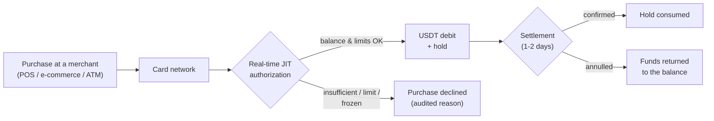

CBPay cards spend **Just-In-Time from the account's central USDT balance**:
no prefunding, no moving balance around. Every purchase is authorized in real
time against the available balance and the card's own limits, and the debit
shows up immediately in the movement history.



## How many cards you can hold

| Account type | Virtual | Physical | For third parties? |
|---|---|---|---|
| Person | **1** | **1** | No |
| Company | **Unlimited** | **Unlimited** | Yes: designated persons (e.g. employees) |

Every card of an account spends from the **same USDT balance**. Fine-grained
control is per-card spending limits (per transaction, daily, monthly), which
you can change at any time.

## Costs (configured by your operator, can be 0)

| Service | When it is billed |
|---|---|
| `card_creation_virtual` | When issuing a virtual card |
| `card_creation_physical` | When issuing a physical card |
| `card_monthly` | Monthly fee per active card (with no balance, the card is frozen — no debt) |
| `card_cancellation` | When cancelling a card |

Exact amounts come from `GET /v1/fees`. Every issuance charge is
**automatically refunded** if issuance fails.

## Create a card

The idempotency key is required: a retry with the same key returns the
original card and never double-charges.

<CodeGroup>

```bash Person — virtual
curl -X POST https://api.qbank.cl/platform/v1/cards \
  -H "Authorization: Bearer <token>" \
  -H "Content-Type: application/json" \
  -d '{ "physical": false, "idempotency_key": "card-v-1" }'
```

```bash Company — physical with limits
curl -X POST https://api.qbank.cl/platform/v1/cards \
  -H "Authorization: Bearer <token>" \
  -H "Content-Type: application/json" \
  -d '{
    "physical": true,
    "idempotency_key": "card-f-ops-1",
    "limits": { "per_transaction": "500.00", "monthly": "5000.00" }
  }'
```

```bash Company — for an employee
curl -X POST https://api.qbank.cl/platform/v1/cards \
  -H "Authorization: Bearer <token>" \
  -H "Content-Type: application/json" \
  -d '{
    "physical": false,
    "idempotency_key": "card-emp-77",
    "limits": { "monthly": "1500.00" },
    "cardholder": {
      "kind": "person",
      "first_name": "Maria",
      "last_name": "Perez",
      "email": "maria@empresa.com",
      "occupation": "Sales",
      "salary_usd": 1800,
      "id_front_url": "https://files.example.com/kyc/mp-front.jpg",
      "id_back_url": "https://files.example.com/kyc/mp-back.jpg",
      "residence_proof_url": "https://files.example.com/kyc/mp-address.pdf",
      "address": {
        "line1": "Av. Providencia 123",
        "city": "Santiago",
        "region": "RM",
        "postal_code": "7500000",
        "country": "CL"
      }
    }
  }'
```

</CodeGroup>

Response:

```json
{
  "card_id": "3c2b1a09-8d7e-6f5a-4b3c-2d1e0f9a8b7c",
  "account_id": "9b1deb4d-3b7d-4bad-9bdd-2b0d7b3dcb6d",
  "physical": false,
  "cardholder_kind": "account",
  "status": "active",
  "limits": { "monthly": "5000.000000" },
  "created_at": "2026-07-08T12:00:00Z",
  "updated_at": "2026-07-08T12:00:00Z",
  "creation_fee": "3.000000"
}
```

<Note>
When issuing for a **designated person** (companies), identity documents are
required (`id_front_url`, `id_back_url`, `residence_proof_url`): the holder
is verified immediately and the card is issued in the same call. The printed
name uses `first_name` + `last_name` (22 characters combined max).
</Note>

<Warning>
Documents are **actually validated** by the issuer: URLs must point to
legitimate, reachable documents (both sides of the ID, proof of address).
On a company account's **first issuance** (for the company itself), the
`cardholder` must also include the corporate documents by URL:
`certificate_of_good_standing_url`, `business_license_url`,
`register_shareholder_url`, `id_shareholders_url`,
`address_verification_shareholders_url`, plus `legal_representation`.
Subsequent issuances reuse the already verified holder.
</Warning>

## Physical cards: activation

A physical card is born `pending_activation` and travels **inactive** for
security. Once the holder has it in hand:

```bash
curl -X POST https://api.qbank.cl/platform/v1/cards/{card_id}/activate \
  -H "Authorization: Bearer <token>"
```

## Reveal PAN and CVV (sensitive data)

Only the **owning account** can reveal them (never the org admin). The
response is one-shot: display it to the holder and discard it.

```bash
curl -X POST https://api.qbank.cl/platform/v1/cards/{card_id}/reveal \
  -H "Authorization: Bearer <token>"
```

```json
{
  "card_id": "3c2b1a09-8d7e-6f5a-4b3c-2d1e0f9a8b7c",
  "pan": "5339880000001234",
  "cvv": "123",
  "exp_date": "202907",
  "note": "sensitive data: display once, never store"
}
```

<Warning>
**Never store or log the PAN/CVV.** CBPay does not persist it either: the
response comes straight from the issuer (PCI standard).
</Warning>

## Limits and freeze/unfreeze

```bash Update limits
curl -X PATCH https://api.qbank.cl/platform/v1/cards/{card_id} \
  -H "Authorization: Bearer <token>" \
  -H "Content-Type: application/json" \
  -d '{ "limits": { "per_transaction": "200.00", "daily": "0" } }'
```

`"0"` removes a limit. To freeze (declines every purchase instantly):

```bash Freeze
curl -X PATCH https://api.qbank.cl/platform/v1/cards/{card_id} \
  -H "Authorization: Bearer <token>" \
  -H "Content-Type: application/json" \
  -d '{ "frozen": true }'
```

## Transactions and their lifecycle

```bash
curl "https://api.qbank.cl/platform/v1/cards/{card_id}/transactions?page=1&page_size=50" \
  -H "Authorization: Bearer <token>"
```

| Status | Meaning |
|---|---|
| `authorized` | Approved in real time: the amount left the available balance and sits in a hold |
| `settled` | Confirmed at network settlement (the hold is consumed) |
| `reversed` | Annulled: funds fully returned to the balance |
| `declined` | Rejected, with the reason: `insufficient_funds`, `card_limit_exceeded`, `card_frozen`, `account_blocked` |

If settlement arrives for a different amount than authorized (tips, merchant
conversion), the adjustment is applied automatically: positive debits the
difference, negative returns it.

## Cancel a card

Irreversible. Bills `card_cancellation` when configured.

```bash
curl -X POST https://api.qbank.cl/platform/v1/cards/{card_id}/cancel \
  -H "Authorization: Bearer <token>"
```

## Webhooks

| Event | When |
|---|---|
| `card_transaction` | A purchase was authorized, annulled or adjusted |
| `card_status_changed` | The card changed state (including automatic freeze for unpaid monthly fee) |

Subscribe the same way as every other event (see [Webhooks](/en/webhooks)).

## FAQ

<AccordionGroup>
<Accordion title="Do I have to prefund the cards?">
No. Cards hold no balance of their own: every purchase is authorized in real
time against the account's USDT balance. If the balance covers it and the
purchase respects the limits, it is approved.
</Accordion>
<Accordion title="What if several of my company's cards purchase at the same time?">
They all spend from the same central balance. Each authorization debits
atomically: you can never spend more than the available balance, no matter
how many cards operate in parallel.
</Accordion>
<Accordion title="In which currency are purchases debited?">
Purchases are processed in USD and debited 1:1 in USDT (1 USD = 1 USDT),
with 6-decimal precision.
</Accordion>
<Accordion title="What happens if there is no balance for the monthly fee?">
The card is frozen automatically (`card_status_changed` event with
`reason: monthly_fee_unpaid`). No debt accrues; once the balance is topped
up, unfreeze it with `PATCH { "frozen": false }`.
</Accordion>
<Accordion title="Can I issue a card for someone outside my company?">
Company accounts can issue for any designated person by passing their data
and identity documents. The card always spends from the balance of the
issuing company account.
</Accordion>
</AccordionGroup>
