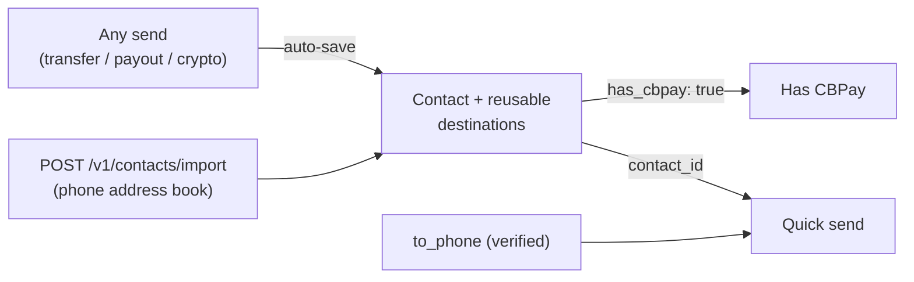

import { EnvUrls } from "/snippets/env-urls.jsx";

<EnvUrls lang="en" />

The **contact book** kills repeated typing: every send (internal transfer,
fiat payout or crypto withdrawal) saves the destination as a contact
automatically, you can **import the phone's address book** to discover
which of your contacts have CBPay, and transfers accept a **phone number**
or a `contact_id` directly as destination.



## Contacts create themselves

Every send saves its destination in your book (deduplicated: repeating the
same destination never creates duplicates, it only marks it as used):

| Send | What gets saved |
|---|---|
| Internal transfer | The destination CBPay account (name, email and its phone when verified) |
| Fiat payout | The full beneficiary (bank, account, document…) per country and method |
| Crypto withdrawal | The address per network (name it with `contact_name` on the withdrawal) |

Don't want to save a one-off destination? Add `"save_contact": false` to
the send body. Auto-save never affects the send: if anything fails, the
send goes through anyway.

## Import the phone address book

Upload the phone's contacts (up to **1,000 per request**; paginate beyond
that) and CBPay tells you **who already has an account** — matching is by
phone number, and only against accounts of the same operator:

```bash
curl -X POST https://api.qbank.cl/platform/v1/contacts/import \
  -H "Authorization: Bearer <token>" \
  -H "Content-Type: application/json" \
  -d '{
    "contacts": [
      { "name": "Carlos Soto", "phones": ["+56 9 8765 4321"] },
      { "name": "Ana Pérez", "phones": ["912345678"] },
      { "name": "Aunt Rosa", "phones": ["not-a-number"] }
    ]
  }'
```

`200` response:

```json
{
  "imported": 2,
  "matched": 1,
  "total": 3,
  "contacts": [
    { "name": "Carlos Soto", "phone": "+56987654321", "contact_id": "3f8a…", "has_cbpay": true },
    { "name": "Ana Pérez", "phone": "+56912345678", "contact_id": "9c1d…", "has_cbpay": false },
    { "name": "Aunt Rosa", "skipped": true, "reason": "no_valid_phone" }
  ]
}
```

- Numbers are normalized to **E.164** automatically: accepts `+…`, `00…`
  and local numbers (your account's country code is prepended). Invalid
  ones are skipped.
- Re-importing is safe: existing contacts are never duplicated.
- `has_cbpay: true` means that phone belongs to an active account of the
  same operator — you can transfer to it instantly.

## Send money by phone number

Internal transfers accept `to_phone` (besides `to_account_id`, `to_email`
and `to_contact_id`):

```bash
curl -X POST https://api.qbank.cl/platform/v1/transfers \
  -H "Authorization: Bearer <token>" \
  -H "Content-Type: application/json" \
  -d '{
    "to_phone": "+56987654321",
    "amount": "25.000000",
    "description": "Lunch",
    "idempotency_key": "lunch-2026-07-10"
  }'
```

<Warning>
For safety, `to_phone` only resolves accounts with an **OTP-verified**
phone (we never guess a money destination from an unverified number). If
the number is not verified: `404 recipient_not_found`; if more than one
account shares it: `422 recipient_ambiguous` (use `to_account_id` or
`to_email`).
</Warning>

## Send to a contact

Every send accepts the contact directly:

<CodeGroup>

```bash Transfer (contact with CBPay)
curl -X POST https://api.qbank.cl/platform/v1/transfers \
  -H "Authorization: Bearer <token>" \
  -H "Content-Type: application/json" \
  -d '{ "to_contact_id": "3f8a…", "amount": "10.000000", "idempotency_key": "t-991" }'
```

```bash Payout (saved beneficiary)
curl -X POST https://api.qbank.cl/platform/v1/payouts \
  -H "Authorization: Bearer <token>" \
  -H "Content-Type: application/json" \
  -d '{
    "country": "CL", "currency": "CLP", "amount": "45000",
    "beneficiary_contact_id": "7b2c…",
    "idempotency_key": "rent-07"
  }'
```

```bash Crypto withdrawal (saved address)
curl -X POST https://api.qbank.cl/platform/v1/crypto/withdrawals \
  -H "Authorization: Bearer <token>" \
  -H "Content-Type: application/json" \
  -d '{ "chain": "tron", "to_contact_id": "5d4e…", "amount": "100.000000", "idempotency_key": "w-2211" }'
```

</CodeGroup>

- **Payouts**: uses the contact's most recent saved beneficiary for that
  country (and method when sent; otherwise the saved destination's method
  applies). An explicit `beneficiary` in the body always wins. No saved
  destination for that corridor: `422 no_saved_destination`.
- **Crypto**: uses the saved address for that `chain`; an explicit
  `to_address` wins.
- **Transfers**: uses the contact's linked CBPay account; if the contact
  only has a phone, its (verified) number is tried. Neither:
  `422 contact_not_linked`.

## Manage the book

```bash
# Listing with search and filters
curl "https://api.qbank.cl/platform/v1/contacts?q=carlos&has_cbpay=true&page=1&page_size=50" \
  -H "Authorization: Bearer <token>"

# Create manually
curl -X POST https://api.qbank.cl/platform/v1/contacts \
  -H "Authorization: Bearer <token>" \
  -H "Content-Type: application/json" \
  -d '{ "display_name": "Carlos Soto", "phone": "+56987654321", "email": "carlos@mail.com", "favorite": true }'

# Detail (includes saved destinations)
curl https://api.qbank.cl/platform/v1/contacts/{contact_id} \
  -H "Authorization: Bearer <token>"

# Edit / delete
curl -X PATCH https://api.qbank.cl/platform/v1/contacts/{contact_id} \
  -H "Authorization: Bearer <token>" -H "Content-Type: application/json" \
  -d '{ "alias": "Carlitos", "favorite": true }'
curl -X DELETE https://api.qbank.cl/platform/v1/contacts/{contact_id} \
  -H "Authorization: Bearer <token>"
```

Contact detail (`200`):

```json
{
  "contact_id": "3f8a1b2c-…",
  "display_name": "Carlos Soto",
  "alias": "Carlitos",
  "phone": "+56987654321",
  "email": "carlos@mail.com",
  "has_cbpay": true,
  "cbpay_account_id": "389d34a3-…",
  "source": "import",
  "favorite": true,
  "destinations": [
    { "destination_id": "aa11…", "type": "cbpay", "last_used_at": "2026-07-10T15:00:00Z", "created_at": "2026-07-08T10:00:00Z" },
    { "destination_id": "bb22…", "type": "payout", "country": "CL", "currency": "CLP", "method": "bank_transfer",
      "details": { "name": "Carlos Soto", "tax_id": "12.345.678-5", "bank_code": "012", "account_type": "checking", "account_number": "123456789" },
      "last_used_at": "2026-07-09T18:30:00Z", "created_at": "2026-07-09T18:30:00Z" },
    { "destination_id": "cc33…", "type": "crypto", "chain": "tron", "address": "TVJ6njG5Fyrq6XwYok3xPQx8kR7HQx6vXk",
      "last_used_at": "2026-07-07T12:00:00Z", "created_at": "2026-07-07T12:00:00Z" }
  ],
  "created_at": "2026-07-07T12:00:00Z",
  "updated_at": "2026-07-10T15:00:00Z"
}
```

You can also add destinations manually (`POST
/v1/contacts/{id}/destinations` with `type: payout|crypto|cbpay` and its
fields) and delete them (`DELETE .../destinations/{destination_id}`).

## Errors

| HTTP | `error` | Cause | Solution |
|---|---|---|---|
| 400 | `invalid_phone` | The phone could not be normalized to E.164 | Send it as `+<country><number>` |
| 400 | `batch_too_large` | Import with more than 1,000 contacts | Paginate the upload |
| 404 | `not_found` | The contact/destination does not exist or is not yours | Check the id |
| 404 | `recipient_not_found` | No verified phone matches | Ask the recipient to verify their phone, or use email/account_id |
| 409 | `duplicate` | You already have a contact with that phone/email | Edit the existing one |
| 422 | `recipient_ambiguous` | More than one account shares the phone | Use `to_account_id` or `to_email` |
| 422 | `contact_not_linked` | The contact has no linked CBPay account | Transfer through another identifier, or pay them out |
| 422 | `no_saved_destination` | The contact has no saved destination for that corridor/chain | Send the explicit `beneficiary`/`to_address` (it will be saved) |

## FAQ

<AccordionGroup>
<Accordion title="Does the recipient know I saved them as a contact?">
No. The book is private to your account: importing your address book or
saving contacts never notifies anyone or shares your data. Only you see
your book.
</Accordion>
<Accordion title="Why does a contact I know has CBPay show has_cbpay: false?">
Matching is by exact phone number (E.164) against accounts of the same
operator. If that person registered a different number (or none) on their
account, there is no match. Once they register and verify that phone, a
re-import picks it up.
</Accordion>
<Accordion title="Can I transfer to a contact with has_cbpay: false?">
Not via internal transfer (there is no account to credit). But you can send
a fiat payout to their bank account or a crypto send to their wallet — and
those destinations get saved on the contact too.
</Accordion>
<Accordion title="What if two people in my org share the same number?">
Sending by phone fails explicitly with 422 recipient_ambiguous — we never
guess a money destination. Use to_account_id or to_email in that case.
</Accordion>
<Accordion title="Can the import be used to probe whether any number has CBPay?">
Matching is only against accounts of your same operator, with a cap of
1,000 contacts per request under the API's global rate limit. It exposes
nothing about the matched account beyond its existence (needed to be able
to transfer to it).
</Accordion>
</AccordionGroup>
