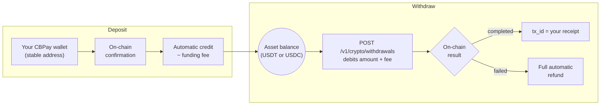

Your stablecoin balances are connected to the blockchain. Supported
combinations:

| Network | Asset | Balance credited |
|---|---|---|
| `tron` | `usdt` | USDT |
| `eth` | `usdt` | USDT |
| `eth` | `usdc` | USDC |

Every deposit credits the **balance of its own asset** (a USDC wallet
credits your USDC balance). `BTC` and `GOLD` are balances with no on-chain
rail: they move only via internal transfers and operator credits.



## Your account is born with its wallets

Every account — person and company — is created with **one deposit wallet
per supported combination** (`tron`/`usdt`, `eth`/`usdt` and `eth`/`usdc`),
**free of charge** and automatically: as soon as you register, your three
addresses are ready to receive funds.

```bash
# Right after creating the account, your addresses already exist:
curl https://api.qbank.cl/platform/v1/crypto/wallets \
  -H "Authorization: Bearer <token>"
```

```json
{
  "page": 1,
  "page_size": 50,
  "wallets": [
    { "wallet_id": "9d68…", "chain": "tron", "asset": "USDT", "address": "TXMD…", "label": "", "type": "deposit", "receive_only": true, "created_at": "2026-07-11T23:33:20Z" },
    { "wallet_id": "a83d…", "chain": "eth", "asset": "USDT", "address": "0xefe0…", "label": "", "type": "deposit", "receive_only": true, "created_at": "2026-07-11T23:33:20Z" },
    { "wallet_id": "fb88…", "chain": "eth", "asset": "USDC", "address": "0xa072…", "label": "", "type": "deposit", "receive_only": true, "created_at": "2026-07-11T23:33:20Z" }
  ]
}
```

<Note>
Provisioning runs in the background when the account is created: if you
query at the very second of registration an address may still be missing —
retry a few seconds later.
</Note>

Deposit wallets are **entry doors**, not operating wallets: they only
**receive** crypto that credits your virtual balance. They cannot send
funds, and cannot be exported or imported (that is what
[segregated wallets](/en/guides/segregated-wallets) are for).

<Note>
Two products, two routes: deposit wallets live under `/v1/crypto/wallets`
and segregated wallets under `/v1/segregated-wallets`. Every wallet
response carries a `type` discriminator (`deposit` / `segregated`) so you
can always tell them apart.
</Note>

| Account type | Deposit wallets per network+asset pair |
|---|---|
| Person | **1** (the birth wallets already take the slot) |
| Company | **1** (the birth wallets already take the slot) |

## Can I create more deposit wallets?

No. Every account — person and company — holds exactly **one deposit
wallet per network+asset pair**, and all of them are born with the account.
`POST /v1/crypto/wallets` exists only to restore a missing pair (an
exceptional case): with the three wallets already provisioned it responds
`422 wallet_limit_reached`.

```bash
curl -X POST https://api.qbank.cl/platform/v1/crypto/wallets \
  -H "Authorization: Bearer <token>" \
  -H "Content-Type: application/json" \
  -d '{ "chain": "eth", "asset": "usdc" }'
```

With the pair already provisioned — `422`:

```json
{
  "error": "wallet_limit_reached",
  "message": "accounts hold one deposit wallet per network/asset pair (created automatically with the account); use segregated wallets for additional wallets"
}
```

- Birth wallets are **always free**; the `wallet_creation` fee would only
  apply to a manual restoration (with a fee of 0, the default, it is free;
  if creation fails, the charge is refunded automatically).
- Need **several wallets** with their own balance (per client, per
  project, per business unit)? That is the
  [segregated wallets](/en/guides/segregated-wallets) product: companies
  have no limit, persons hold 1 per network+asset pair.

## View my wallets

```bash
curl https://api.qbank.cl/platform/v1/crypto/wallets \
  -H "Authorization: Bearer <token>"
```

```json
{
  "wallets": [
    {
      "wallet_id": "b7e3…",
      "chain": "tron",
      "asset": "USDT",
      "address": "TQmZ…",
      "label": "",
      "type": "deposit",
      "receive_only": true,
      "created_at": "2026-07-07T12:00:00Z"
    },
    {
      "wallet_id": "a1c9…",
      "chain": "eth",
      "asset": "USDT",
      "address": "0x8f3B…",
      "label": "",
      "type": "deposit",
      "receive_only": true,
      "created_at": "2026-07-07T12:00:00Z"
    },
    {
      "wallet_id": "fb88…",
      "chain": "eth",
      "asset": "USDC",
      "address": "0xa072…",
      "label": "",
      "type": "deposit",
      "receive_only": true,
      "created_at": "2026-07-07T12:00:00Z"
    }
  ]
}
```

## Deposit

Send the wallet's asset to its address, **over the correct network**. When
the deposit confirms on-chain, that asset's balance is credited
automatically (net of the `funding` fee if CBPay configured one) and the
`crypto_deposit_credited` webhook fires:

```json
{
  "account_id": "…",
  "chain": "tron",
  "asset": "USDT",
  "tx_id": "b1946ac9…",
  "amount": "499.000000",
  "fee": "1.000000"
}
```

<Warning>
Send **only the wallet's asset over its network** (USDT to a USDT wallet,
USDC to a USDC wallet). Addresses are yours and stable: you can reuse them
for every deposit.
</Warning>

### Confirmation times

| Network | Detection | Credit (network confirmation) |
|---|---|---|
| TRON | Near-instant | **~1 minute** (19 confirmations) |
| Ethereum | Near-instant | **A few minutes** depending on congestion |

The credit always arrives with the webhook and the `tx_id` so you can
verify it on the network explorer.

## Transfer (on-chain withdrawals)

Send USDT or USDC from its balance to any external address (`asset` is
optional, default `USDT`; USDC only over `eth`):

<CodeGroup>

```bash USDT over TRON
curl -X POST https://api.qbank.cl/platform/v1/crypto/withdrawals \
  -H "Authorization: Bearer <token>" \
  -H "Content-Type: application/json" \
  -d '{
    "chain": "tron",
    "to_address": "TVJ6…",
    "amount": "100.000000",
    "idempotency_key": "withdrawal-2026-07-07-b"
  }'
```

```bash USDC over Ethereum
curl -X POST https://api.qbank.cl/platform/v1/crypto/withdrawals \
  -H "Authorization: Bearer <token>" \
  -H "Content-Type: application/json" \
  -d '{
    "chain": "eth",
    "asset": "USDC",
    "to_address": "0x8f3B…",
    "amount": "50.000000",
    "idempotency_key": "withdrawal-usdc-2026-07-09-a"
  }'
```

</CodeGroup>

Response `202` — `amount + fee` is debited and the transaction broadcasts:

```json
{
  "withdrawal_id": "5e8c…",
  "chain": "tron",
  "asset": "USDT",
  "to_address": "TVJ6…",
  "amount": "100.000000",
  "fee": "1.000000",
  "total_debit": "101.000000",
  "status": "processing",
  "tx_id": "…"
}
```

<Note>
Every withdrawal saves the address as a [contact](/en/guides/contacts)
automatically — name it with `"contact_name"` in the body, or disable it
with `"save_contact": false`. To repeat a send, use `"to_contact_id"`
instead of `to_address` (the contact's saved address for that `chain` is
used).
</Note>

The final state arrives via the `crypto_withdrawal_status_changed` webhook:
**`completed`** (the `tx_id` is your receipt) or **`failed`** (the full
debit is refunded).

You can also query the withdrawal at any time:

```bash
curl https://api.qbank.cl/platform/v1/crypto/withdrawals/5e8c… \
  -H "Authorization: Bearer <token>"
```

```json
{
  "withdrawal_id": "5e8c…",
  "chain": "tron",
  "asset": "USDT",
  "to_address": "TVJ6…",
  "amount": "100.000000",
  "fee": "1.000000",
  "total_debit": "101.000000",
  "status": "completed",
  "status_code": "confirmed",
  "status_message": "confirmed on-chain",
  "tx_id": "7d1f…"
}
```

<Note>
To move balance to **another CBPay account**, skip the blockchain:
[internal transfers](/en/guides/transfers) are instant and free.
</Note>

### Travel Rule (withdrawals above the threshold)

International regulation (FATF R.16, the "Travel Rule") requires on-chain
withdrawals **from 1,000 USD** to declare who receives the funds before
moving the money. Below the threshold nothing changes. There are two
paths:

<Tabs>
<Tab title="Own wallet (self-hosted)">

If the destination is a wallet owned by the account holder (not an
exchange), declare `wallet_type` and the beneficiary name:

```bash
curl -X POST https://api.qbank.cl/platform/v1/crypto/withdrawals \
  -H "Authorization: Bearer <token>" \
  -H "Content-Type: application/json" \
  -d '{
    "chain": "tron",
    "to_address": "TVJ6…",
    "amount": "1500.000000",
    "wallet_type": "self_hosted",
    "beneficiary_name": "Maria Perez",
    "idempotency_key": "withdrawal-2026-07-12-a"
  }'
```

The response includes `"travel_rule_status": "self_hosted_attested"`.

</Tab>
<Tab title="Another institution (travel address)">

If the destination is an account at another compatible institution, ask
the beneficiary for their **travel address** (a code starting with `ta…`)
and send it along with their name — the payment address is provided by
the receiving institution, so `to_address` can be omitted:

```bash
curl -X POST https://api.qbank.cl/platform/v1/crypto/withdrawals \
  -H "Authorization: Bearer <token>" \
  -H "Content-Type: application/json" \
  -d '{
    "chain": "tron",
    "amount": "1500.000000",
    "travel_address": "ta2AQSjBotWQf38c8sxYYK2Kfis…",
    "beneficiary_name": "Maria Perez",
    "idempotency_key": "withdrawal-2026-07-12-b"
  }'
```

The exchange with the receiving institution happens inline. If it
approves, the withdrawal goes to the address it provided and the response
includes `"travel_rule_status": "approved"`. If the institution rejects
(`travel_rule_rejected`) or has not resolved yet (`travel_rule_pending`),
the withdrawal is not executed and nothing is debited — retry later with
the **same** `idempotency_key`.

</Tab>
</Tabs>

| Error | What it means | What to do |
|---|---|---|
| `travel_rule_required` | Withdrawal above the threshold without beneficiary data | Add `travel_address` or `wallet_type: "self_hosted"` + `beneficiary_name` |
| `travel_rule_beneficiary_required` | `beneficiary_name` is missing | Send the destination holder's name |
| `travel_rule_address_mismatch` | Your `to_address` does not match the address approved by the receiving institution | Omit `to_address` or use the address from the approved exchange |
| `travel_rule_rejected` | The receiving institution rejected the transfer | Verify the beneficiary data with the recipient |
| `travel_rule_pending` | The receiving institution has not resolved yet | Retry later with the same `idempotency_key` |
| `travel_rule_unavailable` | Exchange temporarily unavailable | Retry with the same `idempotency_key` |

## Movements

```bash
# On-chain activity: deposits + withdrawals, with tx_id and date filters
curl "https://api.qbank.cl/platform/v1/crypto/transactions?from=2026-07-01&to=2026-07-08" \
  -H "Authorization: Bearer <token>"
```

```json
{
  "page": 1,
  "page_size": 50,
  "deposits": [
    {
      "chain": "tron",
      "asset": "USDT",
      "tx_id": "b1946ac9…",
      "from_address": "TX9a…",
      "amount": "499.000000",
      "reference": "dep_8813…",
      "created_at": "2026-07-07T12:10:00Z"
    }
  ],
  "withdrawals": [
    {
      "withdrawal_id": "5e8c…",
      "chain": "tron",
      "asset": "USDT",
      "to_address": "TVJ6…",
      "amount": "100.000000",
      "fee": "1.000000",
      "total_debit": "101.000000",
      "status": "completed",
      "tx_id": "7d1f…",
      "created_at": "2026-07-07T15:00:00Z"
    }
  ]
}
```

```bash
# Current balance (available + held)
curl https://api.qbank.cl/platform/v1/balances \
  -H "Authorization: Bearer <token>"

# Full accounting history (funding, withdrawals, wallet fees…)
curl "https://api.qbank.cl/platform/v1/movements?type=funding&from=2026-07-01&to=2026-07-08" \
  -H "Authorization: Bearer <token>"
```

Every deposit credits the **balance of its wallet's asset** (USDT or
USDC); wallets are entry points, each currency has a single balance.

## Errors

| HTTP | `error` | Cause |
|---|---|---|
| 400 | `invalid_chain` | Unsupported network (use `tron` or `eth`) |
| 400 | `invalid_asset` | Network/asset pair without an on-chain rail (supported: `tron`/`usdt`, `eth`/`usdt`, `eth`/`usdc` — `BTC` and `GOLD` do not operate on-chain) |
| 400 | `to_address_required` | Missing withdrawal destination address |
| 402 | `insufficient_funds` | Not enough balance in that asset (for the withdrawal or the creation fee) |
| 422 | `wallet_limit_reached` | The account already holds its deposit wallet for that network+asset pair (applies to persons and companies) |
| 422 | (withdrawal with `status: failed`) | Rejected at broadcast; debit refunded |
| 503 | `withdrawals_unavailable` | Withdrawals not enabled for this corridor yet |
