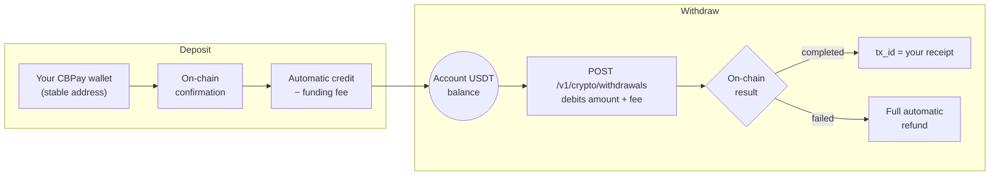

Your USDT balance is connected to the blockchain. Supported networks:
**TRON** (`tron`) and **Ethereum** (`eth`), asset **USDT**.



Wallets are **entry doors**: you can hold several (companies), but the
account balance is a single one.

| Account type | Wallets per network |
|---|---|
| Person | **1** |
| Company | **Unlimited** (use `label` to tell them apart) |

## Create a wallet

<CodeGroup>

```bash Person (1 per network)
curl -X POST https://api.qbank.cl/platform/v1/crypto/wallets \
  -H "Authorization: Bearer <token>" \
  -H "Content-Type: application/json" \
  -d '{ "chain": "tron" }'
```

```bash Company (with label, unlimited)
curl -X POST https://api.qbank.cl/platform/v1/crypto/wallets \
  -H "Authorization: Bearer <token>" \
  -H "Content-Type: application/json" \
  -d '{
    "chain": "tron",
    "label": "Main treasury"
  }'
```

```bash Company, Ethereum network
curl -X POST https://api.qbank.cl/platform/v1/crypto/wallets \
  -H "Authorization: Bearer <token>" \
  -H "Content-Type: application/json" \
  -d '{
    "chain": "eth",
    "label": "E-commerce collections"
  }'
```

</CodeGroup>

Response `201`:

```json
{
  "wallet_id": "b7e3…",
  "chain": "tron",
  "asset": "USDT",
  "address": "TQmZ…",
  "label": "Main treasury",
  "created_at": "2026-07-07T12:00:00Z",
  "creation_fee": "1.000000"
}
```

If a person attempts a second wallet on the same network — `422`:

```json
{
  "error": "wallet_limit_reached",
  "message": "person accounts can hold one wallet per network"
}
```

- Every creation carries a **fixed cost** (`wallet_creation`) configured by
  CBPay — it can differ for persons and companies, and even per account.
  With a fee of 0 (the default) it is free. If creation fails, the charge is
  refunded automatically.
- A **person** who already holds a wallet on that network receives
  `422 wallet_limit_reached`; **companies** can create as many as they need
  (one per supplier, per branch, per product…). All person/company
  differences live in
  [persons and companies](/en/concepts/persons-companies).
- `label` is optional and descriptive only.

## View my wallets

```bash
curl https://api.qbank.cl/platform/v1/crypto/wallets \
  -H "Authorization: Bearer <token>"
```

```json
{
  "wallets": [
    {
      "wallet_id": "b7e3…",
      "chain": "tron",
      "asset": "USDT",
      "address": "TQmZ…",
      "label": "Main treasury",
      "created_at": "2026-07-07T12:00:00Z"
    },
    {
      "wallet_id": "a1c9…",
      "chain": "eth",
      "asset": "USDT",
      "address": "0x8f3B…",
      "label": "E-commerce collections",
      "created_at": "2026-07-07T12:05:00Z"
    }
  ]
}
```

## Deposit

Send USDT to the address of any of your wallets, **over the correct
network**. When the deposit confirms on-chain, your balance is credited
automatically (net of the `funding` fee if CBPay configured one) and the
`crypto_deposit_credited` webhook fires:

```json
{
  "account_id": "…",
  "chain": "tron",
  "asset": "USDT",
  "tx_id": "b1946ac9…",
  "amount": "499.000000",
  "fee": "1.000000"
}
```

<Warning>
Send **only USDT over the wallet's network**. Addresses are yours and
stable: you can reuse them for every deposit.
</Warning>

### Confirmation times

| Network | Detection | Credit (network confirmation) |
|---|---|---|
| TRON | Near-instant | **~1 minute** (19 confirmations) |
| Ethereum | Near-instant | **A few minutes** depending on congestion |

The credit always arrives with the webhook and the `tx_id` so you can
verify it on the network explorer.

## Transfer (on-chain withdrawals)

Send USDT from your balance to any external address:

```bash
curl -X POST https://api.qbank.cl/platform/v1/crypto/withdrawals \
  -H "Authorization: Bearer <token>" \
  -H "Content-Type: application/json" \
  -d '{
    "chain": "tron",
    "to_address": "TVJ6…",
    "amount": "100.000000",
    "idempotency_key": "withdrawal-2026-07-07-b"
  }'
```

Response `202` — `amount + fee` is debited and the transaction broadcasts:

```json
{
  "withdrawal_id": "5e8c…",
  "chain": "tron",
  "asset": "USDT",
  "to_address": "TVJ6…",
  "amount": "100.000000",
  "fee": "1.000000",
  "total_debit": "101.000000",
  "status": "processing",
  "tx_id": "…"
}
```

The final state arrives via the `crypto_withdrawal_status_changed` webhook:
**`completed`** (the `tx_id` is your receipt) or **`failed`** (the full
debit is refunded).

You can also query the withdrawal at any time:

```bash
curl https://api.qbank.cl/platform/v1/crypto/withdrawals/5e8c… \
  -H "Authorization: Bearer <token>"
```

```json
{
  "withdrawal_id": "5e8c…",
  "chain": "tron",
  "asset": "USDT",
  "to_address": "TVJ6…",
  "amount": "100.000000",
  "fee": "1.000000",
  "total_debit": "101.000000",
  "status": "completed",
  "status_code": "confirmed",
  "status_message": "confirmed on-chain",
  "tx_id": "7d1f…"
}
```

<Note>
To move balance to **another CBPay account**, skip the blockchain:
[internal transfers](/en/guides/transfers) are instant and free.
</Note>

## Movements

```bash
# On-chain activity: deposits + withdrawals, with tx_id and date filters
curl "https://api.qbank.cl/platform/v1/crypto/transactions?from=2026-07-01&to=2026-07-08" \
  -H "Authorization: Bearer <token>"
```

```json
{
  "page": 1,
  "page_size": 50,
  "deposits": [
    {
      "chain": "tron",
      "asset": "USDT",
      "tx_id": "b1946ac9…",
      "from_address": "TX9a…",
      "amount": "499.000000",
      "reference": "dep_8813…",
      "created_at": "2026-07-07T12:10:00Z"
    }
  ],
  "withdrawals": [
    {
      "withdrawal_id": "5e8c…",
      "chain": "tron",
      "asset": "USDT",
      "to_address": "TVJ6…",
      "amount": "100.000000",
      "fee": "1.000000",
      "total_debit": "101.000000",
      "status": "completed",
      "tx_id": "7d1f…",
      "created_at": "2026-07-07T15:00:00Z"
    }
  ]
}
```

```bash
# Current balance (available + held)
curl https://api.qbank.cl/platform/v1/balances \
  -H "Authorization: Bearer <token>"

# Full accounting history (funding, withdrawals, wallet fees…)
curl "https://api.qbank.cl/platform/v1/movements?type=funding&from=2026-07-01&to=2026-07-08" \
  -H "Authorization: Bearer <token>"
```

Deposits credit the **account's USDT balance** (wallets are entry points;
the balance is one).

## Errors

| HTTP | `error` | Cause |
|---|---|---|
| 400 | `invalid_chain` | Unsupported network (use `tron` or `eth`) |
| 400 | `to_address_required` | Missing withdrawal destination address |
| 402 | `insufficient_funds` | Not enough balance (for the withdrawal or the creation fee) |
| 422 | `wallet_limit_reached` | A person tried to create a second wallet on the same network |
| 422 | (withdrawal with `status: failed`) | Rejected at broadcast; debit refunded |
| 503 | `withdrawals_unavailable` | Withdrawals not enabled for this corridor yet |
