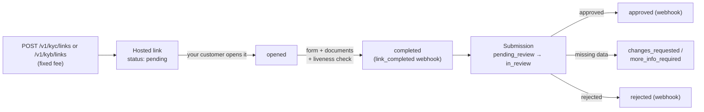

**Identity verification** proves a person (KYC) or company (KYB) is who
they claim to be, with real evidence: a complete form, document uploads
validated by OCR and a **video liveness check**. It has two sides:

1. **Your own verification (onboarding)** — mandatory: until approved, your
   account can only **fund** (payins, crypto deposits, incoming transfers)
   and read. Person ⇒ KYC; company ⇒ KYB.
2. **Verifying your customers (company accounts only)** — generate hosted
   links or send data through the API to verify your own end customers,
   with a fixed fee per verification.



## Your own verification (onboarding)

When you register, your account starts unverified (`kyc_status: none`) and
**can only fund and read**. Any outgoing-money action (payouts, transfers,
withdrawals, banking, cards) answers `403 verification_required` until you
are approved.

<Steps>
<Step title="Request your verification link">

```bash
curl -X POST https://api.qbank.cl/platform/v1/me/verification/link \
  -H "Authorization: Bearer <token>"
```

`201` response (if you already have an open link, the same one is returned
with `200`):

```json
{
  "link_id": "a1b2c3d4-e5f6-4a7b-8c9d-0e1f2a3b4c5d",
  "kind": "kyc",
  "url": "https://…/on/usd/individual/new?invite=abc123…",
  "status": "pending",
  "label": "Ana Pérez",
  "created_at": "2026-07-10T12:00:00Z",
  "updated_at": "2026-07-10T12:00:00Z"
}
```

The `kind` derives from your account type: person ⇒ `kyc`, company ⇒
`kyb`. Onboarding is **free** for you.
</Step>
<Step title="Complete the wizard">
Open the `url`: the hosted wizard guides you through the form, document
uploads (identity, proof of residence; corporate documents for companies)
and — for KYC — the camera liveness check.
</Step>
<Step title="Wait for review">
Check your state any time:

```bash
curl https://api.qbank.cl/platform/v1/me/verification \
  -H "Authorization: Bearer <token>"
```

```json
{
  "kyc_status": "pending",
  "required_kind": "kyc",
  "verified": false,
  "link": { "link_id": "a1b2c3d4-…", "kind": "kyc", "url": "https://…", "status": "completed" },
  "submission": { "submission_id": "f0e1d2c3-…", "kind": "kyc", "status": "in_review", "liveness_pending": false }
}
```

When compliance approves, your `kyc_status` becomes `approved`
**automatically** and every service unlocks (you receive the
`kyc_verification_status_changed` webhook with `self_onboarding: true`).
</Step>
</Steps>

<Note>
While you wait you can fund normally: payins on every method, crypto
deposits and incoming transfers work from day one. If your verification is
rejected (`kyc_status: rejected`), contact your operator — they may ask you
to retry with a new link.
</Note>

## Verifying your customers (company accounts only)

A verified **company** account can verify its own end customers. Each
created verification bills the configured fixed fee (`kyc_verification` /
`kyb_verification`; 0 = free), **automatically refunded** if creation
fails. Person accounts receive `403 company_account_required`.

### Option A — Hosted links (recommended)

Your customer completes EVERYTHING in the white-label wizard: form,
documents and liveness. You only generate the link and wait for the
webhook.

<CodeGroup>

```bash KYC link (person)
curl -X POST https://api.qbank.cl/platform/v1/kyc/links \
  -H "Authorization: Bearer <token>" \
  -H "Content-Type: application/json" \
  -d '{
    "external_customer_id": "cust_123",
    "label": "Ana Pérez",
    "expires_in_days": 14,
    "idempotency_key": "kyc-link-cust-123-1"
  }'
```

```bash KYB link (company, with country)
curl -X POST https://api.qbank.cl/platform/v1/kyb/links \
  -H "Authorization: Bearer <token>" \
  -H "Content-Type: application/json" \
  -d '{
    "external_customer_id": "cust_456",
    "country": "cl",
    "label": "Comercial Andina SpA",
    "expires_in_days": 14,
    "idempotency_key": "kyb-link-cust-456-1"
  }'
```

</CodeGroup>

- `external_customer_id` (required): YOUR reference for the verified
  customer — echoed back on every webhook and query. Values equal to
  `self` or ending in `:self` are reserved for account onboarding and are
  rejected with `400 invalid_payload`.
- `idempotency_key` (required): a retry with the same key returns the
  original link and **never double-charges**.
- `country` (KYB only): `us`, `cl`, `ve`, `br`, `mx`, `co`, `pe`, `bo`,
  `py`, `ar` or `generic` (with `generic_country` ISO alpha-2, e.g.
  `"ES"`). Individual KYC takes no country.
- `expires_in_days` (optional, 1–30): omitted, the link never expires.

`201` response:

```json
{
  "link_id": "b2c3d4e5-f6a7-4b8c-9d0e-1f2a3b4c5d6e",
  "kind": "kyb",
  "external_customer_id": "cust_456",
  "url": "https://…/on/cl/business/new?invite=abc123…",
  "status": "pending",
  "country": "cl",
  "label": "Comercial Andina SpA",
  "expires_at": 1721209600,
  "verification_fee": "2.000000",
  "created_at": "2026-07-10T12:00:00Z",
  "updated_at": "2026-07-10T12:00:00Z"
}
```

Query and history (every POST has its GET):

```bash
# Filtered listing
curl "https://api.qbank.cl/platform/v1/kyb/links?from=2026-07-01&to=2026-07-10&status=completed&page=1&page_size=50" \
  -H "Authorization: Bearer <token>"

# Detail (live link state)
curl https://api.qbank.cl/platform/v1/kyb/links/{link_id} \
  -H "Authorization: Bearer <token>"
```

| Link status | Meaning |
|---|---|
| `pending` | Created, your customer has not opened it |
| `opened` | Your customer opened the wizard |
| `completed` | Form submitted — the submission is born (`kyb_link_completed` / `kyc_link_completed` webhook) |
| `expired` | Expired without completion |

### Option B — Data through the API

If you already hold the customer's data, create the verification directly
(no wizard). The submission enters the same review queue:

```bash
curl -X POST https://api.qbank.cl/platform/v1/kyc/submissions \
  -H "Authorization: Bearer <token>" \
  -H "Content-Type: application/json" \
  -d '{
    "external_customer_id": "cust_789",
    "idempotency_key": "kyc-sub-cust-789-1",
    "person": {
      "first_name": "Ana",
      "last_name": "Pérez",
      "email": "ana@example.com",
      "phone": "+56912345678",
      "nationality": "CHL",
      "date_of_birth": "1990-04-12",
      "tax_id": "12.345.678-5",
      "id_type": "id_card",
      "id_number": "12345678",
      "address": {
        "line1": "Av. Siempre Viva 123",
        "city": "Santiago",
        "state": "RM",
        "postal_code": "8320000",
        "country": "CHL"
      },
      "primary_purpose": "personal_or_living_expenses",
      "most_recent_occupation": "Engineer",
      "source_of_funds": "salary"
    }
  }'
```

Data-mode notes:

- Countries in **ISO alpha-3** (`CHL`, `USA`, `VEN`…); dates `YYYY-MM-DD`;
  `id_type`: `passport | id_card | drivers_license`.
- KYB: body `{ external_customer_id, country?, business: {…}, ubos?,
  directors?, signers?, bank_info?, metadata? }` on
  `POST /v1/kyb/submissions`.
- **No liveness is required at creation**: the KYC submission carries
  `liveness_pending: true`; close it with a [liveness
  link](#liveness-check-liveness-link).
- Re-sending with the same `external_customer_id` while the submission is
  open (`pending_review`, `changes_requested`, `more_info_required`)
  **updates** the same submission and does not charge again.

`201` response:

```json
{
  "submission_id": "c3d4e5f6-a7b8-4c9d-0e1f-2a3b4c5d6e7f",
  "kind": "kyc",
  "external_customer_id": "cust_789",
  "status": "pending_review",
  "liveness_pending": true,
  "verification_fee": "1.500000",
  "created_at": "2026-07-10T12:05:00Z",
  "updated_at": "2026-07-10T12:05:00Z"
}
```

Query and history:

```bash
curl "https://api.qbank.cl/platform/v1/kyc/submissions?from=2026-07-01&to=2026-07-10&status=approved&page=1&page_size=50" \
  -H "Authorization: Bearer <token>"

curl https://api.qbank.cl/platform/v1/kyc/submissions/{submission_id} \
  -H "Authorization: Bearer <token>"
```

The detail adds what compliance requested: `pending_documents`,
`rejection_reason`, `changes_requested_comments`; on KYC also
`liveness_pending` and `documents_received`; on KYB `aml_decision`.

| Submission status | Meaning |
|---|---|
| `pending_review` | Received, in the compliance queue |
| `in_review` | Compliance took the case |
| `changes_requested` | Data must be fixed and re-sent |
| `more_info_required` | Documents missing ([upload them via API](#documents-through-the-api)) |
| `escalated` | Escalated to senior review |
| `approved` / `approved_partial` | Approved (final) |
| `rejected` | Rejected (final) |

### Documents through the API

Documents are optional at creation (if missing, compliance will request
them via `more_info_required`). 3-step flow:

<Steps>
<Step title="Presign">

```bash
curl -X POST https://api.qbank.cl/platform/v1/kyc/submissions/{submission_id}/documents \
  -H "Authorization: Bearer <token>" \
  -H "Content-Type: application/json" \
  -d '{
    "category": "identity",
    "filename": "cedula.jpg",
    "content_type": "image/jpeg",
    "file_size": 482133
  }'
```

```json
{ "upload_url": "https://storage…", "key": "public-api/…", "expires_in": 900 }
```

Categories — KYC: `identity`, `proofOfResidence`; KYB: `legalPresence`,
`ownershipStructure`, `controlStructure`, `companyDetails`. Types:
`application/pdf`, `image/png`, `image/jpeg`; 15 MB max; the upload URL
expires in 15 minutes.
</Step>
<Step title="Upload">
`PUT` the binary straight to `upload_url` with the same `Content-Type`.
</Step>
<Step title="Confirm">

```bash
curl -X POST https://api.qbank.cl/platform/v1/kyc/submissions/{submission_id}/documents/confirm \
  -H "Authorization: Bearer <token>" \
  -H "Content-Type: application/json" \
  -d '{ "key": "public-api/…", "category": "identity", "filename": "cedula.jpg", "content_type": "image/jpeg" }'
```

```json
{ "status": "received", "ocr": "queued" }
```

Confirming queues the OCR validation; the result arrives via the
`kyc_document_validated` / `kyb_document_validated` webhook and is
queryable with GET:

```bash
curl https://api.qbank.cl/platform/v1/kyc/submissions/{submission_id}/documents \
  -H "Authorization: Bearer <token>"
```

```json
{
  "items": [
    { "category": "identity", "status": "completed", "outcome": "MATCH", "score": 0.97, "summary": "Document matches the submitted identity", "filename": "cedula.jpg" }
  ],
  "meta": { "retrieved": 1 }
}
```

`outcome`: `MATCH`, `REVIEW` (manual review), `NO_MATCH`.
</Step>
</Steps>

### Liveness check (liveness link)

KYC submissions created through the API are born with
`liveness_pending: true` (the liveness check is a browser camera flow).
Generate a minimal hosted link for your customer to complete it:

```bash
curl -X POST https://api.qbank.cl/platform/v1/kyc/submissions/{submission_id}/liveness_link \
  -H "Authorization: Bearer <token>" \
  -H "Content-Type: application/json" \
  -d '{ "expires_in_days": 7 }'
```

```json
{ "url": "https://…/on/liveness/<token>", "status": "pending", "expires_at": 1751234567 }
```

- Free (the service was billed when the submission was created). If an
  open link exists, the POST returns the same one; if the check already
  passed, `400 liveness_already_completed`.
- `GET .../liveness_link` returns the latest link and the current check
  state (`{ "liveness": { "status", "outcome", "passed" } }`).
- On pass (outcome `PASS` or `REVIEW`): the submission clears
  `liveness_pending` and the `kyc_liveness_completed` webhook fires.

## Webhooks

| Event | When |
|---|---|
| `kyc_verification_status_changed` / `kyb_verification_status_changed` | The submission changed state (whole lifecycle: received, in review, changes requested, approved, rejected…) |
| `kyc_link_completed` / `kyb_link_completed` | Your customer completed a hosted link |
| `kyc_document_validated` / `kyb_document_validated` | OCR finished for a document uploaded through the API |
| `kyc_liveness_completed` | The liveness check was completed from a liveness link |

Example payload (`kyc_verification_status_changed`):

```json
{
  "account_id": "9b1deb4d-3b7d-4bad-9bdd-2b0d7b3dcb6d",
  "kind": "kyc",
  "event": "approved",
  "submission_id": "c3d4e5f6-a7b8-4c9d-0e1f-2a3b4c5d6e7f",
  "external_customer_id": "cust_789",
  "status": "approved",
  "risk_band": "low",
  "decision": "approved"
}
```

Your own onboarding arrives with `"self_onboarding": true` instead of
`external_customer_id`. Subscribe like every other event (see
[Webhooks](/en/webhooks)).

## Costs (configured by your operator, can be 0)

| Service | When it is billed |
|---|---|
| `kyc_verification` | When creating a third-party KYC link or submission |
| `kyb_verification` | When creating a third-party KYB link or submission |

The charge comes out of your default settlement balance, is refunded if
creation fails, and **your own onboarding never bills**. Re-sends of an
open submission and liveness links do not charge again.

## Errors

| HTTP | `error` | Cause | Solution |
|---|---|---|---|
| 400 | `idempotency_key_required` | Creation POST without a key | Send `idempotency_key` (body or header) |
| 400 | `invalid_payload` | Missing `external_customer_id` or another required field | Check the body |
| 400 | `liveness_already_completed` | The liveness check already passed | Nothing to do |
| 402 | `insufficient_funds` | Balance cannot cover the fee | Fund the account and retry |
| 403 | `verification_required` | Your account has not approved its own verification | Complete your [onboarding](#your-own-verification-onboarding) |
| 403 | `company_account_required` | A person account tried to verify third parties | Company accounts only |
| 403 | `service_disabled` | The `kyc` service is disabled for your account | Contact your operator |
| 404 | `not_found` | The link/submission does not exist or is not yours | Check the id |
| 409 | `already_verified` | Onboarding link requested with an already-approved account | Nothing to do |
| 503 | `verifications_unavailable` | Service temporarily unavailable (the fee was refunded) | Retry later |

## FAQ

<AccordionGroup>
<Accordion title="Why can't I create payouts right after registering?">
Every account must approve its identity verification before moving money
out (a regulatory requirement). Meanwhile you can fund (payins, crypto
deposits, incoming transfers) and explore the API. Request your link with
`POST /v1/me/verification/link` and complete it — approval unlocks
everything automatically.
</Accordion>
<Accordion title="Hosted links vs data through the API — which one?">
With links, your customer completes everything in the wizard (form +
documents + liveness) and you never handle sensitive data. With API data
you send the fields and upload documents via presign — useful if you have
your own form — but the liveness check still needs a liveness link (it is
a camera flow, impossible server-to-server).
</Accordion>
<Accordion title="When is the fee billed and when not?">
It bills when CREATING a third-party link or submission (live mode). Not
billed: your own onboarding, re-sends of an open submission (same
external_customer_id), liveness links, queries and documents. If creation
fails, the fee is refunded automatically.
</Accordion>
<Accordion title="Why can't my person account create links?">
Third-party verification is a B2B tool for integrators (company accounts).
A person account only needs its own onboarding, which is free and lives at
/v1/me/verification.
</Accordion>
<Accordion title="Compliance asked for more documents — how do I send them?">
You will receive `more_info_required` with `pending_documents` in the
submission detail. Upload each document with this page's presign → upload →
confirm flow; on confirmation the submission returns to the review queue.
</Accordion>
<Accordion title="Does this replace AML screening?">
No: they complement each other. Verification proves identity with evidence
(documents, video); [AML screening](/en/guides/aml) checks the identity
against sanctions/PEP/adverse-media lists and can watch it continuously.
</Accordion>
</AccordionGroup>
