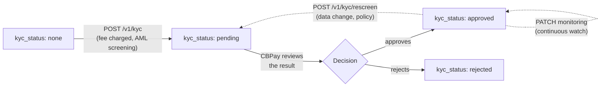

CBPay integrates identity verification as a service — **KYC** for persons
and **KYB** for companies — with AML screening included: you submit the
account's identity and receive the analysis result. The account's
verification state
(`kyc_status`) is resolved by CBPay after reviewing the result.



<Note>
If CBPay configured a compliance fee, it is debited **before** the
call (you'll see `compliance_fee` in the response) and **refunded
automatically** if the screening fails. With a fee of 0 the service is free
for you.
</Note>

## Submit the screening

One endpoint for person and company; the type is detected from the payload:

<CodeGroup>

```bash Person (KYC)
curl -X POST https://api.qbank.cl/platform/v1/kyc \
  -H "Authorization: Bearer <token>" \
  -H "Content-Type: application/json" \
  -d '{
    "customer": {
      "person": {
        "full_name": "Ana Perez Rojas",
        "date_of_birth": "1990-04-12",
        "personal_identification": [
          { "type": "national_id", "issuing_country": "CL", "number": "12.345.678-5" }
        ]
      },
      "email": "ana@example.com",
      "country": "CL"
    },
    "monitor": false
  }'
```

```bash Company (KYB)
curl -X POST https://api.qbank.cl/platform/v1/kyc \
  -H "Authorization: Bearer <token>" \
  -H "Content-Type: application/json" \
  -d '{
    "customer": {
      "company": {
        "legal_name": "Comercial Andina SpA",
        "tax_id": "76.543.210-8"
      },
      "email": "legal@andina.cl",
      "country": "CL"
    },
    "monitor": true
  }'
```

```bash Minimal (autofilled)
curl -X POST https://api.qbank.cl/platform/v1/kyc \
  -H "Authorization: Bearer <token>" \
  -H "Content-Type: application/json" \
  -d '{ "customer": {}, "monitor": false }'
```

</CodeGroup>

If you omit `person`/`company`, the account's own data is used (the
person/company type is taken from the account type).

## Send all the identity data you have (recommended)

The examples above are the minimum. The `customer` object accepts **many
more fields, all optional**, and they are forwarded whole to the screening
engine: **the more identity data you send, the more precise the
analysis** — date of birth, countries and strong identifiers rule out
homonyms and reduce false positives, so send everything you have about the
customer.

Identity fields that sharpen the matching:

| Field (person) | What it is |
|---|---|
| `full_name` — or `first_name` / `middle_name` / `last_name` | Full or structured name |
| `date_of_birth` | `"YYYY-MM-DD"` or an object `{ "year": 1990, "month": 4, "day": 12 }` |
| `nationality` / `nationalities` | Nationality(ies), ISO-3166 |
| `country_of_birth` | Country of birth |
| `residential_information[]` | Residences, each with `country_of_residence` |
| `personal_identification[]` | Strong documents: `{ "type", "issuing_country", "number" }` (national ID, passport…) |
| `alias` / `aliases` | Other known names |

| Field (company) | What it is |
|---|---|
| `legal_name` | Legal name |
| `alias[]` | Trade / brand names |
| `tax_id` / `registration_number` | Tax/mercantile identifiers |
| `registration_authority_identification` | Company registry number |
| `place_of_registration` / `country_of_incorporation` | Country of registration/incorporation |
| `incorporation_date` | Incorporation date |
| `address[]` | Addresses, each with `country` |

Person KYC example with full identity:

```bash
curl -X POST https://api.qbank.cl/platform/v1/kyc \
  -H "Authorization: Bearer <token>" \
  -H "Content-Type: application/json" \
  -d '{
    "customer": {
      "person": {
        "full_name": "Ana Perez Rojas",
        "date_of_birth": "1990-04-12",
        "nationality": "CL",
        "country_of_birth": "CL",
        "residential_information": [
          { "country_of_residence": "CL" }
        ],
        "personal_identification": [
          { "type": "national_id", "issuing_country": "CL", "number": "12.345.678-5" },
          { "type": "passport", "issuing_country": "CL", "number": "P0123456" }
        ]
      },
      "email": "ana@example.com",
      "country": "CL"
    },
    "monitor": false
  }'
```

And a company KYB:

```bash
curl -X POST https://api.qbank.cl/platform/v1/kyc \
  -H "Authorization: Bearer <token>" \
  -H "Content-Type: application/json" \
  -d '{
    "customer": {
      "company": {
        "legal_name": "Comercial Andina SpA",
        "alias": ["Andina Market"],
        "tax_id": "76.543.210-8",
        "registration_authority_identification": "76543210",
        "place_of_registration": "CL",
        "incorporation_date": "2015-08-01",
        "address": [{ "country": "CL" }]
      },
      "email": "legal@andina.cl",
      "country": "CL"
    },
    "monitor": true
  }'
```

<Note>
A query with **exactly the same identity data** reuses the previous
screening (no new charge). Adding or changing identity fields (name, date,
country, document, alias) makes the search more specific and runs — and
bills — a new screening. Cosmetic fields (email, phone, free-text address)
do not change the matching.
</Note>

Response `201` — person and company return the same shape;
`compliance_service` changes (`compliance_person` vs `compliance_company`,
each with its own fee):

<CodeGroup>

```json Person
{
  "customer_id": "cus_8f2e1a…",
  "status": "screened",
  "risk_level": "low",
  "screening_result": "no_match",
  "kyc_status": "pending",
  "compliance_service": "compliance_person",
  "compliance_fee": "0.500000"
}
```

```json Company
{
  "customer_id": "cus_5b7c33…",
  "status": "screened",
  "risk_level": "medium",
  "screening_result": "potential_match",
  "kyc_status": "pending",
  "compliance_service": "compliance_company",
  "compliance_fee": "1.000000"
}
```

</CodeGroup>

Your account stays at `kyc_status: pending` until CBPay approves or rejects
it.

## Rescreening

Re-run the analysis of the same identity (e.g. after a data change or as a
periodic policy). No body needed — it uses the `customer_id` from your
previous screening:

```bash
curl -X POST https://api.qbank.cl/platform/v1/kyc/rescreen \
  -H "Authorization: Bearer <token>"
```

Response `200` (bills `compliance_rescreen`, when configured):

```json
{
  "customer_id": "cus_8f2e1a…",
  "status": "screened",
  "risk_level": "low",
  "screening_result": "no_match",
  "compliance_service": "compliance_rescreen",
  "compliance_fee": "0.250000"
}
```

Requires a prior KYC/KYB submission; otherwise `409 no_kyc`.

## Continuous monitoring

Enable (or disable) permanent watching of the identity — list changes, PEP,
adverse media:

<CodeGroup>

```bash Enable (bills compliance_monitoring)
curl -X PATCH https://api.qbank.cl/platform/v1/kyc/monitoring \
  -H "Authorization: Bearer <token>" \
  -H "Content-Type: application/json" \
  -d '{ "enabled": true }'
```

```bash Disable (always free)
curl -X PATCH https://api.qbank.cl/platform/v1/kyc/monitoring \
  -H "Authorization: Bearer <token>" \
  -H "Content-Type: application/json" \
  -d '{ "enabled": false }'
```

</CodeGroup>

Response `200`:

```json
{
  "customer_id": "cus_8f2e1a…",
  "monitoring": true,
  "compliance_service": "compliance_monitoring",
  "compliance_fee": "0.100000"
}
```

When disabling, `compliance_fee` comes back as `"0.000000"` — disabling is
always free.

## Errors

| HTTP | `error` | Cause |
|---|---|---|
| 402 | `insufficient_funds` | Not enough balance for the compliance fee |
| 409 | `no_kyc` | Rescreen/monitoring without a prior KYC/KYB |
| 502 | `compliance_unavailable` | Service temporarily unavailable (the fee was refunded) |
