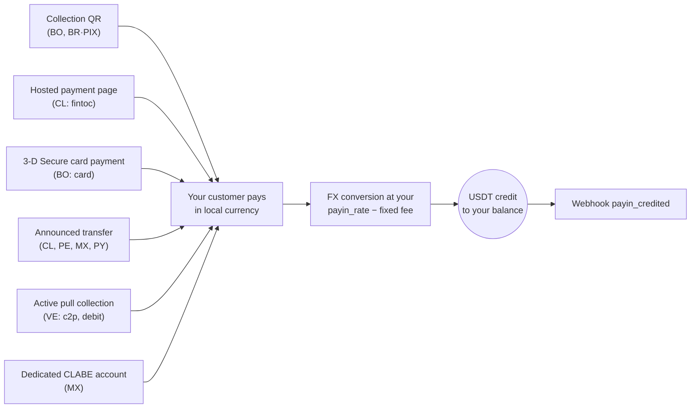
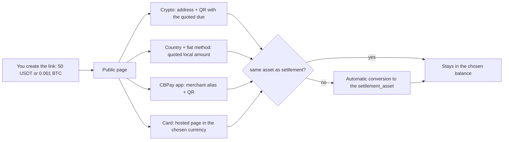

A payin is a fiat collection: your customer pays in local currency and your
account gets credited in USDT automatically, converted at **your payin
rate** (`payin_rate` in `GET /v1/rates`) minus the fixed payin fee when
configured for your account.

Whatever the mode, every path ends the same way — automatic credit +
webhook:



## 1. Discover the available corridors

The available countries, currencies and collection modes are defined by
CBPay. Always check the catalog:

```bash
curl https://api.qbank.cl/platform/v1/payins/methods \
  -H "Authorization: Bearer <token>"
```

```json
{
  "items": [
    { "country": "BO", "currency": "BOB", "method": "qr", "delivery": "push" },
    { "country": "VE", "currency": "VES", "method": "c2p", "delivery": "push+polling" },
    { "country": "MX", "currency": "MXN", "method": "bank_transfer", "delivery": "push" }
  ],
  "meta": { "retrieved": 3 }
}
```

`delivery` describes how the payment is confirmed on CBPay's side (bank
notification, polling or both) — it changes nothing in your integration:
you always receive the `payin_credited` webhook.

Collection corridors and modes:

| Country | Currency | Modes |
|---|---|---|
| Chile | CLP | Hosted payment page (`fintoc`), announced bank transfer |
| Peru | PEN | Announced bank transfer |
| Mexico | MXN | Dedicated CLABE account, announced bank transfer |
| Venezuela | VES | Active collection `c2p` and `debito_inmediato` (pull) |
| Bolivia | BOB / USD | Collection QR, card payment page (`card`) |
| Paraguay | PYG | Announced bank transfer |
| Brazil | BRL | Dynamic PIX QR |

Availability may vary; the catalog (`GET /v1/payins/methods`) is always the
source of truth. In every case the credit works the same way: converted to
USDT at your current `payin_rate` and credited net of the fixed payin fee.

## 2. Pick the mode and create the charge

Each country has its own collection mode. The real request and response of
each one:

<Tabs>
<Tab title="Chile">

**Hosted payment page (`fintoc`)** — recommended: you get a `payment_url`;
the payer opens it and transfers from **any Chilean bank or wallet** (Banco
Estado, Santander, Mach, Tenpo, Mercado Pago…). The payment is
detected and validated automatically — no manual references.

```bash
curl -X POST https://api.qbank.cl/platform/v1/payins \
  -H "Authorization: Bearer <token>" \
  -H "Content-Type: application/json" \
  -d '{
    "country": "CL",
    "currency": "CLP",
    "method": "fintoc",
    "amount": "150000",
    "description": "Top-up order 8841",
    "idempotency_key": "topup-8841"
  }'
```

Response `201`:

```json
{
  "payin_id": "7a2b…",
  "status": "pending",
  "reference": "7a2b…",
  "payment_url": "https://pay.fintoc.com/plink_K2zwNNSxPyx8w3GZ",
  "expires_at": "2026-07-08T18:48:25Z",
  "note": "share the payment_url with the payer; the deposit is credited automatically once the transfer is detected"
}
```

Share the `payment_url` with the payer (link, redirect or WebView). Once
the payment is confirmed your account is credited in USDT and you receive
the `payin_credited` webhook. The CLP amount must be an integer (the
Chilean peso has no decimals) and the payment session expires after 24
hours by default. A retry with the same `idempotency_key` returns the same
payin and the same URL — it never opens a second payment session.

**Announced bank transfer** (manual alternative): announce the incoming
deposit and share the reference with the sender.

```bash
curl -X POST https://api.qbank.cl/platform/v1/payins \
  -H "Authorization: Bearer <token>" \
  -H "Content-Type: application/json" \
  -d '{
    "country": "CL",
    "currency": "CLP",
    "method": "bank_transfer",
    "amount": "500000"
  }'
```

Response `201`:

```json
{
  "payin_id": "4f81…",
  "status": "pending",
  "reference": "CBJ6T3W9M2K5",
  "note": "include the reference in the transfer description so the deposit is credited automatically"
}
```

When the transfer arrives it is matched by the reference in the transfer
description (or by amount+currency as a fallback) and your account is
credited automatically.

</Tab>
<Tab title="Peru">

**Announced bank transfer**, same as Chile but in soles:

```bash
curl -X POST https://api.qbank.cl/platform/v1/payins \
  -H "Authorization: Bearer <token>" \
  -H "Content-Type: application/json" \
  -d '{
    "country": "PE",
    "currency": "PEN",
    "method": "bank_transfer",
    "amount": "1800.00"
  }'
```

Response `201`:

```json
{
  "payin_id": "6d20…",
  "status": "pending",
  "reference": "CBK7M2Q9X4T3",
  "note": "include the reference in the transfer description so the deposit is credited automatically"
}
```

The `reference` is a **short 12-character alphanumeric code** (it fits any
bank concept field) and must travel in the transfer description for the
automatic match; amount+currency is used as a fallback matcher.

</Tab>
<Tab title="Mexico">

**Dedicated CLABE account** (recommended): create a fixed CLABE bound to
your account — every SPEI arriving to it is credited automatically, no
references needed:

```bash
curl -X POST https://api.qbank.cl/platform/v1/payins/deposit-accounts \
  -H "Authorization: Bearer <token>" \
  -H "Content-Type: application/json" \
  -d '{ "country": "MX", "currency": "MXN" }'
```

Response `201`:

```json
{
  "instrument_id": "a1d4…",
  "account_id": "…",
  "country": "MX",
  "currency": "MXN",
  "method": "bank_transfer",
  "instrument": "734180000151000006",
  "status": "active"
}
```

`instrument` is the CLABE you share with your payers. Creation is free;
each deposit pays the regular payin fee. List your accounts with
`GET /v1/payins/deposit-accounts`.

You can also use a one-off **announced bank transfer**
(`POST /v1/payins` with `method: "bank_transfer"`, `country: "MX"`).

</Tab>
<Tab title="Venezuela">

**Active collection (pull)**: you charge the payer directly with their
authorization. The result is **synchronous** — if the charge is approved,
the credit lands in the same call.

For `debito_inmediato`, request the OTP first (free):

```bash
curl -X POST https://api.qbank.cl/platform/v1/payins/collect/otp \
  -H "Authorization: Bearer <token>" \
  -H "Content-Type: application/json" \
  -d '{
    "method": "debito_inmediato",
    "amount": "1200.00",
    "payer_document": "V12345678",
    "payer_phone": "04141234567",
    "payer_bank": "0102",
    "payer_account": "01020123456789012345"
  }'
```

```json
{
  "method": "debito_inmediato",
  "result": { "status": "sent", "otp_reference": "OTP-5521" }
}
```

Then execute the collection:

<CodeGroup>

```bash c2p (phone + ID + payer's OTP)
curl -X POST https://api.qbank.cl/platform/v1/payins/collect \
  -H "Authorization: Bearer <token>" \
  -H "Content-Type: application/json" \
  -d '{
    "method": "c2p",
    "amount": "1200.00",
    "description": "Order 5512",
    "payer_document": "V12345678",
    "payer_phone": "04141234567",
    "payer_bank": "0102",
    "otp": "12345678",
    "idempotency_key": "order-5512"
  }'
```

```bash debito_inmediato (account + previously requested OTP)
curl -X POST https://api.qbank.cl/platform/v1/payins/collect \
  -H "Authorization: Bearer <token>" \
  -H "Content-Type: application/json" \
  -d '{
    "method": "debito_inmediato",
    "amount": "1200.00",
    "description": "Order 5512",
    "payer_document": "V12345678",
    "payer_account": "01020123456789012345",
    "payer_bank": "0102",
    "payer_account_type": "CNTA",
    "otp": "87654321",
    "otp_reference": "OTP-5521",
    "idempotency_key": "order-5512"
  }'
```

<Note>
An active collection executes a real charge against the payer, so
`idempotency_key` is **required** (body or `Idempotency-Key` header): a
retry with the same key returns the original result with `idempotency_hit`
and never re-charges.
</Note>

</CodeGroup>

Response `200` (charge approved and credited):

```json
{
  "payin_id": "7b3c…",
  "kind": "collect",
  "method": "c2p",
  "status": "credited",
  "local_amount": "1200.00",
  "fx_rate": "36.50",
  "usdt_gross": "32.876712",
  "fee": "0.300000",
  "usdt_credited": "32.576712",
  "paid": true,
  "provider_reference": "…"
}
```

If the payer declines or the authorization fails, `paid` is `false`, the
payin is marked `failed`, and nothing is charged. The exact rejection
reason is persisted on the payin and exposed in the `failure` object (in
the synchronous response, in `GET /v1/payins/{payin_id}`, and on the
idempotent replay):

```json
{
  "payin_id": "7b3c…",
  "kind": "collect",
  "method": "c2p",
  "status": "failed",
  "paid": false,
  "failure": {
    "source": "provider",
    "code": "provider_rejected",
    "message": "Documento de identidad del receptor errado"
  }
}
```

- `source` tells you where the rejection originated (`provider` = the
  payer's bank declined; `core` = the pre-charge validation).
- `code` and `message` carry the concrete reason (invalid or expired OTP,
  wrong document, insufficient payer funds, etc.) so you can tell the
  payer what to fix before retrying with a new idempotency key.

</Tab>
<Tab title="Bolivia">

**Collection QR** (the local interoperable standard): you generate the QR
and your customer scans it with their banking app.

```bash
curl -X POST https://api.qbank.cl/platform/v1/payins \
  -H "Authorization: Bearer <token>" \
  -H "Content-Type: application/json" \
  -d '{
    "country": "BO",
    "currency": "BOB",
    "method": "qr",
    "amount": "700.00",
    "description": "App top-up",
    "expires_in": 3600
  }'
```

Response `201`:

```json
{
  "payin_id": "9c2a…",
  "status": "pending",
  "charge": {
    "charge_id": "…",
    "qr_image": "<base64>",
    "qr_image_url": "https://cdn.cbpayapp.com/public/payin-qr/<charge_id>.png",
    "qr_payload": "<QR content>",
    "our_reference": "482915073",
    "status": "pending"
  }
}
```

Display the QR to your customer — `qr_image_url` is a public CDN URL ready
for an `` tag (prefer it over the base64 `qr_image`); when they pay,
your account is credited automatically. It also works in USD
(`currency: "USD"`).

**Card payment page (`card`)**: you receive a `payment_url` for a hosted
3-D Secure checkout — the payer enters their card on a secure page branded
with your organization's identity and, when their bank requires it,
completes the authentication challenge right there. Card data never touches
your system or your integration.

```bash
curl -X POST https://api.qbank.cl/platform/v1/payins \
  -H "Authorization: Bearer <token>" \
  -H "Content-Type: application/json" \
  -d '{
    "country": "BO",
    "currency": "BOB",
    "method": "card",
    "amount": "700.00",
    "description": "App top-up",
    "customer": { "email": "payer@example.com", "first_name": "Ana", "last_name": "Rojas" },
    "success_url": "https://your-app.com/payment/ok",
    "failure_url": "https://your-app.com/payment/error",
    "idempotency_key": "topup-7719"
  }'
```

Response `201`:

```json
{
  "payin_id": "b41c…",
  "status": "pending",
  "reference": "b41c…",
  "payment_url": "https://api.qbank.cl/pay/cards/9f3XkT…",
  "expires_at": "2026-07-16T18:30:00Z",
  "note": "share the payment_url with the payer; the balance is credited automatically once the card payment is approved"
}
```

Share the `payment_url` (link, redirect or WebView). Flow details:

- `customer` is an **optional** prefill of the billing details (`email`,
  `first_name`, `last_name`, `address`, `city`, `country` — plain text,
  max 120 chars per field); the payer can complete/correct them on the
  page.
- `success_url` / `failure_url` (optional, public https) redirect the payer
  when done; without them the page shows the final result.
- `expires_at` (optional, RFC3339, at least 15 minutes ahead) shortens the
  session lifetime; the default is 24 hours. If it expires unpaid, the
  payin moves to `expired` and you receive the `payin_expired` webhook.
- The payer has a limited number of attempts; an issuer decline lets them
  retry with another card within the same session.
- Approval is online: once the charge is approved your account is credited
  in USDT at your `payin_rate` and you receive `payin_credited` — same as
  every other mode.
- A retry with the same `idempotency_key` returns the same payin and the
  same `payment_url`; it never opens a second payment session.
- It also works in USD (`currency: "USD"`).

</Tab>
<Tab title="Paraguay">

**Announced bank transfer** in guaraníes: you announce the deposit, your
payer transfers (interbank SIPAP or an internal transfer at the receiving
bank) with the reference in the transfer concept, and the credit is
detected automatically.

```bash
curl -X POST https://api.qbank.cl/platform/v1/payins \
  -H "Authorization: Bearer <token>" \
  -H "Content-Type: application/json" \
  -d '{
    "country": "PY",
    "currency": "PYG",
    "method": "bank_transfer",
    "amount": "596000"
  }'
```

Response `201`:

```json
{
  "payin_id": "8f41…",
  "status": "pending",
  "reference": "CBW4N8R2T6P9",
  "note": "include the reference in the transfer description so the deposit is credited automatically"
}
```

<Note>
Guaraníes use no decimals: announce the **exact integer amount** your
payer will transfer (e.g. `"596000"`). The `reference` is a short
12-character alphanumeric code — designed for the SIPAP concept field,
which accepts **at most 20 characters and no special characters** — and
putting it in the concept ensures the automatic match; amount+currency
matching works as a fallback.
</Note>

</Tab>
<Tab title="Brazil">

**Dynamic PIX QR**: the same endpoint generates a PIX QR with the amount
embedded.

```bash
curl -X POST https://api.qbank.cl/platform/v1/payins \
  -H "Authorization: Bearer <token>" \
  -H "Content-Type: application/json" \
  -d '{
    "country": "BR",
    "currency": "BRL",
    "method": "qr",
    "amount": "120.00",
    "description": "Order 7719",
    "expires_in": 1800
  }'
```

In the response, `charge.qr_payload` is the PIX **"copia e cola"** code,
so the payer can paste it into their banking app instead of scanning the
image (`charge.qr_image` base64 or `charge.qr_image_url`, the public CDN
URL). The QR expires per `expires_in` (default 1
hour); the payment is credited automatically once confirmed on the rail
(continuous reconciliation — check on demand with
`GET /v1/payins/{charge_id}`).

<Note>
In Brazil collections work exclusively through dynamic PIX QR (one QR = one
payment, exact amount embedded). Announced bank transfers will come later.
</Note>

</Tab>
</Tabs>

## Universal checkout link (`checkout`)

Create a **universal checkout link**: a single `POST /v1/payins` with
`method: "checkout"` returns a branded public URL where the payer chooses
how to pay. The charge is denominated in the **virtual balance you
choose** (`settlement_asset`: `USDT`, `USDC`, `BTC` or `GOLD`, default
`USDT`) and every payment is converted **automatically** to that balance
when it credits — unless the payer pays in the same asset, in which case
there is no conversion.

The page organizes the payment into **four tabs**:

- **CBPay** — direct payment with the app: the merchant's alias and QR;
  scanning with the app pays instantly through an internal transfer, in
  any of the 4 balances.
- **Crypto** — the available coins grouped by network (today USDT on
  TRON and Ethereum, USDC on Ethereum and BTC; new networks show up on
  their own once enabled), each with a deposit address exclusive to that
  charge and a **scannable QR** compatible with external wallets (Trust
  Wallet, MetaMask, Binance and similar apps).
- **Fiat** — the payer picks their country among **every country with a
  live payin corridor** and sees the available methods (QR, bank
  transfer, hosted payment) with the local amount quoted on the spot.
- **Card** — credit or debit card payment on a secure hosted page,
  listed **by charge currency** (today BOB and USD; currencies from
  future acquirers show up on their own). Each currency is an
  independent payment option with its own quoted amount.



```bash
curl -X POST https://api.qbank.cl/platform/v1/payins \
  -H "Authorization: Bearer <token>" \
  -H "Content-Type: application/json" \
  -d '{
    "method": "checkout",
    "amount": "50",
    "settlement_asset": "USDT",
    "description": "Order 8841",
    "country": "CL",
    "success_url": "https://your-app.com/payment/ok",
    "failure_url": "https://your-app.com/payment/error",
    "expires_in": 86400,
    "idempotency_key": "order-8841"
  }'
```

- `amount` is denominated **in the `settlement_asset`**: `"50"` with
  `USDT` means 50 USDT; `"0.001"` with `BTC` means 0.001 BTC; `"2"` with
  `GOLD` means 2 grams of gold. Do not send `currency` — that is the old
  contract and responds `400` (the charge is no longer tied to a local
  currency).
- `country` is **optional** and only preselects the country on the page;
  the payer can change it.
- `GOLD` has no payment rail of its own: the charge is always reached
  through automatic conversion from whatever the customer pays with.

Response `201`:

```json
{
  "payin_id": "d0135ed5-8e9c-4f8b-a522-8ec100470426",
  "kind": "checkout",
  "status": "pending",
  "settlement_asset": "USDT",
  "asset_amount": "50",
  "country": "CL",
  "description": "Order 8841",
  "reference": "CB68JZCT46QE",
  "checkout_url": "https://api.qbank.cl/platform/pay/fc4981b8e7c7…",
  "expires_at": "2026-07-17T17:57:44Z",
  "receipt_url": "https://api.qbank.cl/platform/v1/payins/d0135ed5-…/receipt"
}
```

Share the `checkout_url` (link, email, WhatsApp, printed QR). The page
requires no login, carries your organization's branding and updates by
itself: once the payment is confirmed through any method it shows "paid"
and redirects to your `success_url` if you set one.

### How each rail pays

- **Multi-country fiat**: the payer picks a country and a method; the
  local amount is quoted on the spot (target → USD → local currency using
  your corridor's `payin_rate`, rounded up) and is **frozen** when the
  method is chosen. The credit arrives with the normal payin conversion
  and fees, and is then converted to the `settlement_asset`. An announced
  payment SMALLER than the frozen quote still credits (the money is real)
  but does **not** mark the link as paid.
- **Card (multi-currency)**: the tab lists every available charge
  currency with its quoted amount; picking one opens the hosted payment
  page in that currency. Each currency is an independent materialization
  (you can quote BOB and USD on the same link; the first one to complete
  pays it).
- **Crypto (wallet per charge)**: choosing a currency generates an
  exclusive address with its `qr_payload` and `qr_png_base64` — BTC uses
  a BIP-21 URI (`bitcoin:<address>?amount=…`, autofills the amount);
  TRON/ETH carry the raw address in the QR (maximum compatibility) with
  the amount next to it to copy. If the paid asset differs from the
  `settlement_asset`, the quoted due **already includes the conversion**
  (the payer covers it; you receive your exact target). Partial payments
  accumulate and the page shows what's missing. Quotes involving BTC/GOLD
  refresh every 15 minutes.
- **CBPay app**: the merchant QR embeds the link
  (`cbpay:pay?to=…&checkout=…`). The app pays through an internal
  transfer in any of the 4 balances: same asset ⇒ exact target; different
  ⇒ due with the conversion included. The amount is validated server-side
  against a fresh quote — if it does not cover the charge it responds
  `422 checkout_amount_mismatch` with the current due. Integrators:
  `POST /v1/transfers` accepts the optional `checkout_token` field (or
  the extended QR in `to_qr_token`); the destination is forced to the
  link's account.

### Automatic conversion to the chosen balance

Every credit in an asset different from the `settlement_asset` is
converted with your account's conversion engine (same spreads and limits
as `POST /v1/swaps`). The aggregate state travels in `conversion_status`:

| `conversion_status` | Meaning |
|---|---|
| _(absent)_ | No conversion happened (you were paid in the same asset) |
| `done` | Every conversion of the link executed |
| `pending_retry` | A conversion failed temporarily (price unavailable or limit); funds stay in the received asset and it retries automatically |

### Public link endpoints (no auth, rate-limited)

- `GET {checkout_url}/state` — link state: `status`, `paid_method`,
  `settlement_asset`, `asset_amount`, frozen fiat materializations
  (`fiat_methods`), crypto progress (`crypto` with `due`/`received`) and
  `conversion_status`.
- `GET {checkout_url}/quote` — quotes BEFORE choosing: `countries`
  (catalog with currency and methods per country, card excluded), `cards`
  (card options per country and currency with their `local_amount`),
  `crypto` (indicative due per pair) and `cbpay` (alias + dues per
  asset). With `?country=XX` it adds `country_quote` with that country's
  local amount.
- `POST {checkout_url}/methods/{method}` — materializes the chosen
  option. Fiat methods require `?country=XX`; `card` also requires
  `&currency=YYY` (taken from the `cards` catalog — one country can
  accept cards in more than one currency); crypto uses
  `crypto:<chain>:<asset>` (e.g. `crypto:tron:usdt`) without a country.
  Re-POSTing the same combination returns the SAME materialization.

Useful if you prefer to render your own payment page on top of the same
link.

### Link rules

- **One link = one charge**: the first method that completes the payment
  wins; a later payment through another rail is not credited (picking a
  method does NOT lock the others while nobody has paid).
- `expires_in` accepts 600 to 604800 seconds (10 minutes to 7 days;
  default 24 hours). If it expires unpaid the payin flips to `expired`
  and you receive the `payin_expired` webhook.
- A retry with the same `idempotency_key` returns the **same link** (the
  URL never changes); a second charge is never opened.
- The `settlement_asset` must be enabled for your organization; if it is
  disabled the creation responds `422 settlement_asset_disabled`.

When the charge is paid you receive the `payin_credited` with
`settled_via` (e.g. `crypto:tron:usdt`, `qr`, `cbpay`),
`settlement_asset` and `asset_amount`; crypto payments add
`crypto_amount` and CBPay app payments add `transfer_id`, `asset` and
`amount`.

Link-specific errors (seen by whoever opens the page):

| HTTP | `error` | Meaning |
|---|---|---|
| 404 | `not_found` | Invalid token or non-existent link |
| 400 | `country_required` | Fiat method without `?country=XX` |
| 409 | `already_paid` | The link was already paid through another method |
| 410 | `checkout_expired` | The link expired unpaid |
| 422 | `method_unavailable` | That method is not available for this link or country |
| 422 | `country_unavailable` | That country has no available payment methods |
| 422 | `checkout_amount_mismatch` | The CBPay transfer does not cover the charge's current due |
| 429 | `too_many_attempts` | Per-IP rate limit of the public page |
| 503 | `pricing_unavailable` | Pricing temporarily unavailable; retry in a moment |

## 3. Receiving the credit

When the payment arrives (through any of the modes), your account is
credited automatically and the `payin_credited` webhook fires:

```json
{
  "payin_id": "9c2a…",
  "account_id": "…",
  "country": "BO",
  "currency": "BOB",
  "local_amount": "700.00",
  "fx_rate": "6.91",
  "usdt_credited": "100.302460",
  "fee": "1.000000"
}
```

`fx_rate` is your `payin_rate` at credit time — the conversion happens at
exactly that rate: `usdt_gross = 700.00 / 6.91`.

The payin object keeps the full detail:

```bash
curl https://api.qbank.cl/platform/v1/payins/9c2a… \
  -H "Authorization: Bearer <token>"
```

```json
{
  "payin_id": "9c2a…",
  "kind": "qr",
  "status": "credited",
  "local_amount": "700.00",
  "fx_rate": "6.91",
  "usdt_gross": "101.302460",
  "fee": "1.000000",
  "usdt_credited": "100.302460"
}
```

## Statuses

| Status | Meaning |
|---|---|
| `pending` | Charge created, waiting for the payment |
| `credited` | Payment received and credited in USDT |
| `unassigned` | Deposit received without an automatic match (routed by the administrator) |
| `expired` | The charge expired unpaid |
| `failed` | The collection failed |

<Info>
Deposits arriving by direct transfer without a clear reference stay
`unassigned` until the CBPay team routes them to an account. Once assigned,
they are credited with the destination account's rate and fees.
</Info>

<Note>
When an active charge (QR or checkout) dies unpaid, the payin moves from
`pending` to `expired` (or `failed`) automatically and you receive the
[`payin_expired`](/en/webhooks) webhook. No funds move: to retry the
collection, create a new payin.
</Note>

## Reads and history

```bash
# One payin
curl https://api.qbank.cl/platform/v1/payins/9c2a… \
  -H "Authorization: Bearer <token>"

# History with filters
curl "https://api.qbank.cl/platform/v1/payins?from=2026-07-01&to=2026-07-08&status=credited&country=BO&page_size=50" \
  -H "Authorization: Bearer <token>"
```

`from`/`to` use `YYYY-MM-DD` (UTC); an invalid date responds
`400 invalid_range`.

## Common errors

| HTTP | `error` | What to do |
|---|---|---|
| 400 | `invalid_request` | Check `method` (qr, bank_transfer, fintoc, card; collect has its own endpoint) |
| 400 | `idempotency_key_required` | Collect requires an idempotency key (real debit against the payer) |
| 403 | `service_disabled` | Payins is not enabled for your account — see [services](/en/concepts/services) |
| 422 | `core_rejected` | The processor rejected the charge; check the message |
| 502 | `core_unavailable` | The charge could not be created; retry the creation (nothing was charged) |
