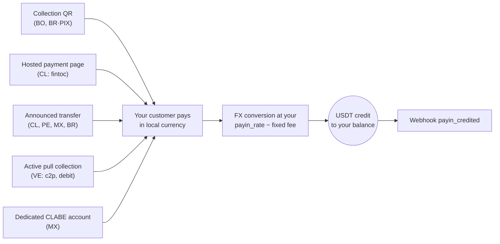

A payin is a fiat collection: your customer pays in local currency and your
account gets credited in USDT automatically, converted at **your payin
rate** (`payin_rate` in `GET /v1/rates`) minus the fixed payin fee when
configured for your account.

Whatever the mode, every path ends the same way — automatic credit +
webhook:



## 1. Discover the available corridors

The available countries, currencies and collection modes are defined by
CBPay. Always check the catalog:

```bash
curl https://api.qbank.cl/platform/v1/payins/methods \
  -H "Authorization: Bearer <token>"
```

```json
{
  "items": [
    { "country": "BO", "currency": "BOB", "method": "qr", "delivery": "push" },
    { "country": "VE", "currency": "VES", "method": "c2p", "delivery": "push+polling" },
    { "country": "MX", "currency": "MXN", "method": "bank_transfer", "delivery": "push" }
  ],
  "meta": { "retrieved": 3 }
}
```

`delivery` describes how the payment is confirmed on CBPay's side (bank
notification, polling or both) — it changes nothing in your integration:
you always receive the `payin_credited` webhook.

Collection corridors and modes:

| Country | Currency | Modes |
|---|---|---|
| Chile | CLP | Hosted payment page (`fintoc`), announced bank transfer |
| Peru | PEN | Announced bank transfer |
| Mexico | MXN | Dedicated CLABE account, announced bank transfer |
| Venezuela | VES | Active collection `c2p` and `debito_inmediato` (pull) |
| Bolivia | BOB / USD | Collection QR |
| Brazil | BRL | Dynamic PIX QR, announced bank transfer |

Availability may vary; the catalog (`GET /v1/payins/methods`) is always the
source of truth. In every case the credit works the same way: converted to
USDT at your current `payin_rate` and credited net of the fixed payin fee.

## 2. Pick the mode and create the charge

Each country has its own mode (QR, hosted payment page, announced
transfer, dedicated CLABE or pull collection). The complete reference with
real request and response for all 6 countries lives on its own page:

<Card title="Country reference" icon="earth-americas" href="/en/guides/payins-by-country">
  Chile, Peru, Mexico, Venezuela, Bolivia and Brazil — every collection
  mode with its full request and the response you get back.
</Card>

One example to set expectations (Bolivia, collection QR):

```bash
curl -X POST https://api.qbank.cl/platform/v1/payins \
  -H "Authorization: Bearer <token>" \
  -H "Content-Type: application/json" \
  -d '{
    "country": "BO",
    "currency": "BOB",
    "method": "qr",
    "amount": "700.00",
    "description": "App top-up",
    "expires_in": 3600
  }'
```

```json
{
  "payin_id": "9c2a…",
  "status": "pending",
  "charge": {
    "charge_id": "…",
    "qr_image": "<base64>",
    "qr_payload": "<QR content>",
    "our_reference": "482915073",
    "status": "pending"
  }
}
```

## 3. Receiving the credit

When the payment arrives (through any of the modes), your account is
credited automatically and the `payin_credited` webhook fires:

```json
{
  "payin_id": "9c2a…",
  "account_id": "…",
  "country": "BO",
  "currency": "BOB",
  "local_amount": "700.00",
  "fx_rate": "6.91",
  "usdt_credited": "100.302460",
  "fee": "1.000000"
}
```

`fx_rate` is your `payin_rate` at credit time — the conversion happens at
exactly that rate: `usdt_gross = 700.00 / 6.91`.

The payin object keeps the full detail:

```bash
curl https://api.qbank.cl/platform/v1/payins/9c2a… \
  -H "Authorization: Bearer <token>"
```

```json
{
  "payin_id": "9c2a…",
  "kind": "qr",
  "status": "credited",
  "local_amount": "700.00",
  "fx_rate": "6.91",
  "usdt_gross": "101.302460",
  "fee": "1.000000",
  "usdt_credited": "100.302460"
}
```

## Statuses

| Status | Meaning |
|---|---|
| `pending` | Charge created, waiting for the payment |
| `credited` | Payment received and credited in USDT |
| `unassigned` | Deposit received without an automatic match (routed by the administrator) |
| `expired` | The charge expired unpaid |
| `failed` | The collection failed |

<Info>
Deposits arriving by direct transfer without a clear reference stay
`unassigned` until the CBPay team routes them to an account. Once assigned,
they are credited with the destination account's rate and fees.
</Info>

## Reads and history

```bash
# One payin
curl https://api.qbank.cl/platform/v1/payins/9c2a… \
  -H "Authorization: Bearer <token>"

# History with filters
curl "https://api.qbank.cl/platform/v1/payins?from=2026-07-01&to=2026-07-08&status=credited&page_size=50" \
  -H "Authorization: Bearer <token>"
```

`from`/`to` use `YYYY-MM-DD` (UTC); an invalid date responds
`400 invalid_range`.

## Common errors

| HTTP | `error` | What to do |
|---|---|---|
| 400 | `invalid_request` | Check `method` (qr, bank_transfer, fintoc; collect has its own endpoint) |
| 400 | `idempotency_key_required` | Collect requires an idempotency key (real debit against the payer) |
| 403 | `service_disabled` | Payins is not enabled for your account — see [services](/en/concepts/services) |
| 422 | `core_rejected` | The processor rejected the charge; check the message |
| 502 | `core_unavailable` | The charge could not be created; retry the creation (nothing was charged) |
