A payin is a fiat collection: your customer pays in local currency and your
account gets credited in USDT automatically, converted at **your payin
rate** (`payin_rate` in `GET /v1/rates`) minus the fixed payin fee when
configured for your account.

Whatever the mode, every path ends the same way — automatic credit +
webhook:

```mermaid
flowchart LR
    qr["Collection QR<br/>(BO, BR·PIX)"] --> pay["Your customer pays<br/>in local currency"]
    hosted["Hosted payment page<br/>(CL: fintoc)"] --> pay
    announced["Announced transfer<br/>(CL, PE, MX, PY)"] --> pay
    pull["Active pull collection<br/>(VE: c2p, debit)"] --> pay
    clabe["Dedicated CLABE account<br/>(MX)"] --> pay
    pay --> conv["FX conversion at your<br/>payin_rate − fixed fee"]
    conv --> credit(("USDT credit<br/>to your balance"))
    credit --> wh["Webhook payin_credited"]
```



## 1. Discover the available corridors

The available countries, currencies and collection modes are defined by
CBPay. Always check the catalog:

```bash
curl https://api.qbank.cl/platform/v1/payins/methods \
  -H "Authorization: Bearer <token>"
```

```json
{
  "items": [
    { "country": "BO", "currency": "BOB", "method": "qr", "delivery": "push" },
    { "country": "VE", "currency": "VES", "method": "c2p", "delivery": "push+polling" },
    { "country": "MX", "currency": "MXN", "method": "bank_transfer", "delivery": "push" }
  ],
  "meta": { "retrieved": 3 }
}
```

`delivery` describes how the payment is confirmed on CBPay's side (bank
notification, polling or both) — it changes nothing in your integration:
you always receive the `payin_credited` webhook.

Collection corridors and modes:

| Country | Currency | Modes |
|---|---|---|
| Chile | CLP | Hosted payment page (`fintoc`), announced bank transfer |
| Peru | PEN | Announced bank transfer |
| Mexico | MXN | Dedicated CLABE account, announced bank transfer |
| Venezuela | VES | Active collection `c2p` and `debito_inmediato` (pull) |
| Bolivia | BOB / USD | Collection QR |
| Paraguay | PYG | Announced bank transfer |
| Brazil | BRL | Dynamic PIX QR |

Availability may vary; the catalog (`GET /v1/payins/methods`) is always the
source of truth. In every case the credit works the same way: converted to
USDT at your current `payin_rate` and credited net of the fixed payin fee.

## 2. Pick the mode and create the charge

Each country has its own collection mode. The real request and response of
each one:

<Tabs>
<Tab title="Chile">

**Hosted payment page (`fintoc`)** — recommended: you get a `payment_url`;
the payer opens it and transfers from **any Chilean bank or wallet** (Banco
Estado, Santander, Mach, Tenpo, Mercado Pago…). The payment is
detected and validated automatically — no manual references.

```bash
curl -X POST https://api.qbank.cl/platform/v1/payins \
  -H "Authorization: Bearer <token>" \
  -H "Content-Type: application/json" \
  -d '{
    "country": "CL",
    "currency": "CLP",
    "method": "fintoc",
    "amount": "150000",
    "description": "Top-up order 8841",
    "idempotency_key": "topup-8841"
  }'
```

Response `201`:

```json
{
  "payin_id": "7a2b…",
  "status": "pending",
  "reference": "7a2b…",
  "payment_url": "https://pay.fintoc.com/plink_K2zwNNSxPyx8w3GZ",
  "expires_at": "2026-07-08T18:48:25Z",
  "note": "share the payment_url with the payer; the deposit is credited automatically once the transfer is detected"
}
```

Share the `payment_url` with the payer (link, redirect or WebView). Once
the payment is confirmed your account is credited in USDT and you receive
the `payin_credited` webhook. The CLP amount must be an integer (the
Chilean peso has no decimals) and the payment session expires after 24
hours by default. A retry with the same `idempotency_key` returns the same
payin and the same URL — it never opens a second payment session.

**Announced bank transfer** (manual alternative): announce the incoming
deposit and share the reference with the sender.

```bash
curl -X POST https://api.qbank.cl/platform/v1/payins \
  -H "Authorization: Bearer <token>" \
  -H "Content-Type: application/json" \
  -d '{
    "country": "CL",
    "currency": "CLP",
    "method": "bank_transfer",
    "amount": "500000"
  }'
```

Response `201`:

```json
{
  "payin_id": "4f81…",
  "status": "pending",
  "reference": "CBJ6T3W9M2K5",
  "note": "include the reference in the transfer description so the deposit is credited automatically"
}
```

When the transfer arrives it is matched by the reference in the transfer
description (or by amount+currency as a fallback) and your account is
credited automatically.

</Tab>
<Tab title="Peru">

**Announced bank transfer**, same as Chile but in soles:

```bash
curl -X POST https://api.qbank.cl/platform/v1/payins \
  -H "Authorization: Bearer <token>" \
  -H "Content-Type: application/json" \
  -d '{
    "country": "PE",
    "currency": "PEN",
    "method": "bank_transfer",
    "amount": "1800.00"
  }'
```

Response `201`:

```json
{
  "payin_id": "6d20…",
  "status": "pending",
  "reference": "CBK7M2Q9X4T3",
  "note": "include the reference in the transfer description so the deposit is credited automatically"
}
```

The `reference` is a **short 12-character alphanumeric code** (it fits any
bank concept field) and must travel in the transfer description for the
automatic match; amount+currency is used as a fallback matcher.

</Tab>
<Tab title="Mexico">

**Dedicated CLABE account** (recommended): create a fixed CLABE bound to
your account — every SPEI arriving to it is credited automatically, no
references needed:

```bash
curl -X POST https://api.qbank.cl/platform/v1/payins/deposit-accounts \
  -H "Authorization: Bearer <token>" \
  -H "Content-Type: application/json" \
  -d '{ "country": "MX", "currency": "MXN" }'
```

Response `201`:

```json
{
  "instrument_id": "a1d4…",
  "account_id": "…",
  "country": "MX",
  "currency": "MXN",
  "method": "bank_transfer",
  "instrument": "734180000151000006",
  "status": "active"
}
```

`instrument` is the CLABE you share with your payers. Creation is free;
each deposit pays the regular payin fee. List your accounts with
`GET /v1/payins/deposit-accounts`.

You can also use a one-off **announced bank transfer**
(`POST /v1/payins` with `method: "bank_transfer"`, `country: "MX"`).

</Tab>
<Tab title="Venezuela">

**Active collection (pull)**: you charge the payer directly with their
authorization. The result is **synchronous** — if the charge is approved,
the credit lands in the same call.

For `debito_inmediato`, request the OTP first (free):

```bash
curl -X POST https://api.qbank.cl/platform/v1/payins/collect/otp \
  -H "Authorization: Bearer <token>" \
  -H "Content-Type: application/json" \
  -d '{
    "method": "debito_inmediato",
    "amount": "1200.00",
    "payer_document": "V12345678",
    "payer_phone": "04141234567",
    "payer_bank": "0102",
    "payer_account": "01020123456789012345"
  }'
```

```json
{
  "method": "debito_inmediato",
  "result": { "status": "sent", "otp_reference": "OTP-5521" }
}
```

Then execute the collection:

<CodeGroup>

```bash c2p (phone + ID + payer's OTP)
curl -X POST https://api.qbank.cl/platform/v1/payins/collect \
  -H "Authorization: Bearer <token>" \
  -H "Content-Type: application/json" \
  -d '{
    "method": "c2p",
    "amount": "1200.00",
    "description": "Order 5512",
    "payer_document": "V12345678",
    "payer_phone": "04141234567",
    "payer_bank": "0102",
    "otp": "12345678",
    "idempotency_key": "order-5512"
  }'
```

```bash debito_inmediato (account + previously requested OTP)
curl -X POST https://api.qbank.cl/platform/v1/payins/collect \
  -H "Authorization: Bearer <token>" \
  -H "Content-Type: application/json" \
  -d '{
    "method": "debito_inmediato",
    "amount": "1200.00",
    "description": "Order 5512",
    "payer_document": "V12345678",
    "payer_account": "01020123456789012345",
    "payer_bank": "0102",
    "payer_account_type": "CNTA",
    "otp": "87654321",
    "otp_reference": "OTP-5521",
    "idempotency_key": "order-5512"
  }'
```

<Note>
An active collection executes a real charge against the payer, so
`idempotency_key` is **required** (body or `Idempotency-Key` header): a
retry with the same key returns the original result with `idempotency_hit`
and never re-charges.
</Note>

</CodeGroup>

Response `200` (charge approved and credited):

```json
{
  "payin_id": "7b3c…",
  "kind": "collect",
  "method": "c2p",
  "status": "credited",
  "local_amount": "1200.00",
  "fx_rate": "36.50",
  "usdt_gross": "32.876712",
  "fee": "0.300000",
  "usdt_credited": "32.576712",
  "paid": true,
  "provider_reference": "…"
}
```

If the payer declines or the authorization fails, `paid` is `false`, the
payin is marked `failed`, and nothing is charged.

</Tab>
<Tab title="Bolivia">

**Collection QR** (the local interoperable standard): you generate the QR
and your customer scans it with their banking app.

```bash
curl -X POST https://api.qbank.cl/platform/v1/payins \
  -H "Authorization: Bearer <token>" \
  -H "Content-Type: application/json" \
  -d '{
    "country": "BO",
    "currency": "BOB",
    "method": "qr",
    "amount": "700.00",
    "description": "App top-up",
    "expires_in": 3600
  }'
```

Response `201`:

```json
{
  "payin_id": "9c2a…",
  "status": "pending",
  "charge": {
    "charge_id": "…",
    "qr_image": "<base64>",
    "qr_payload": "<QR content>",
    "our_reference": "482915073",
    "status": "pending"
  }
}
```

Display `qr_image` to your customer; when they pay, your account is
credited automatically. It also works in USD (`currency: "USD"`).

</Tab>
<Tab title="Paraguay">

**Announced bank transfer** in guaraníes: you announce the deposit, your
payer transfers (interbank SIPAP or an internal transfer at the receiving
bank) with the reference in the transfer concept, and the credit is
detected automatically.

```bash
curl -X POST https://api.qbank.cl/platform/v1/payins \
  -H "Authorization: Bearer <token>" \
  -H "Content-Type: application/json" \
  -d '{
    "country": "PY",
    "currency": "PYG",
    "method": "bank_transfer",
    "amount": "596000"
  }'
```

Response `201`:

```json
{
  "payin_id": "8f41…",
  "status": "pending",
  "reference": "CBW4N8R2T6P9",
  "note": "include the reference in the transfer description so the deposit is credited automatically"
}
```

<Note>
Guaraníes use no decimals: announce the **exact integer amount** your
payer will transfer (e.g. `"596000"`). The `reference` is a short
12-character alphanumeric code — designed for the SIPAP concept field,
which accepts **at most 20 characters and no special characters** — and
putting it in the concept ensures the automatic match; amount+currency
matching works as a fallback.
</Note>

</Tab>
<Tab title="Brazil">

**Dynamic PIX QR**: the same endpoint generates a PIX QR with the amount
embedded.

```bash
curl -X POST https://api.qbank.cl/platform/v1/payins \
  -H "Authorization: Bearer <token>" \
  -H "Content-Type: application/json" \
  -d '{
    "country": "BR",
    "currency": "BRL",
    "method": "qr",
    "amount": "120.00",
    "description": "Order 7719",
    "expires_in": 1800
  }'
```

In the response, `charge.qr_payload` is the PIX **"copia e cola"** code,
so the payer can paste it into their banking app instead of scanning the
image (`charge.qr_image`). The QR expires per `expires_in` (default 1
hour); the payment is credited automatically once confirmed on the rail
(continuous reconciliation — check on demand with
`GET /v1/payins/{charge_id}`).

<Note>
In Brazil collections work exclusively through dynamic PIX QR (one QR = one
payment, exact amount embedded). Announced bank transfers will come later.
</Note>

</Tab>
</Tabs>

## 3. Receiving the credit

When the payment arrives (through any of the modes), your account is
credited automatically and the `payin_credited` webhook fires:

```json
{
  "payin_id": "9c2a…",
  "account_id": "…",
  "country": "BO",
  "currency": "BOB",
  "local_amount": "700.00",
  "fx_rate": "6.91",
  "usdt_credited": "100.302460",
  "fee": "1.000000"
}
```

`fx_rate` is your `payin_rate` at credit time — the conversion happens at
exactly that rate: `usdt_gross = 700.00 / 6.91`.

The payin object keeps the full detail:

```bash
curl https://api.qbank.cl/platform/v1/payins/9c2a… \
  -H "Authorization: Bearer <token>"
```

```json
{
  "payin_id": "9c2a…",
  "kind": "qr",
  "status": "credited",
  "local_amount": "700.00",
  "fx_rate": "6.91",
  "usdt_gross": "101.302460",
  "fee": "1.000000",
  "usdt_credited": "100.302460"
}
```

## Statuses

| Status | Meaning |
|---|---|
| `pending` | Charge created, waiting for the payment |
| `credited` | Payment received and credited in USDT |
| `unassigned` | Deposit received without an automatic match (routed by the administrator) |
| `expired` | The charge expired unpaid |
| `failed` | The collection failed |

<Info>
Deposits arriving by direct transfer without a clear reference stay
`unassigned` until the CBPay team routes them to an account. Once assigned,
they are credited with the destination account's rate and fees.
</Info>

## Reads and history

```bash
# One payin
curl https://api.qbank.cl/platform/v1/payins/9c2a… \
  -H "Authorization: Bearer <token>"

# History with filters
curl "https://api.qbank.cl/platform/v1/payins?from=2026-07-01&to=2026-07-08&status=credited&page_size=50" \
  -H "Authorization: Bearer <token>"
```

`from`/`to` use `YYYY-MM-DD` (UTC); an invalid date responds
`400 invalid_range`.

## Common errors

| HTTP | `error` | What to do |
|---|---|---|
| 400 | `invalid_request` | Check `method` (qr, bank_transfer, fintoc; collect has its own endpoint) |
| 400 | `idempotency_key_required` | Collect requires an idempotency key (real debit against the payer) |
| 403 | `service_disabled` | Payins is not enabled for your account — see [services](/en/concepts/services) |
| 422 | `core_rejected` | The processor rejected the charge; check the message |
| 502 | `core_unavailable` | The charge could not be created; retry the creation (nothing was charged) |
