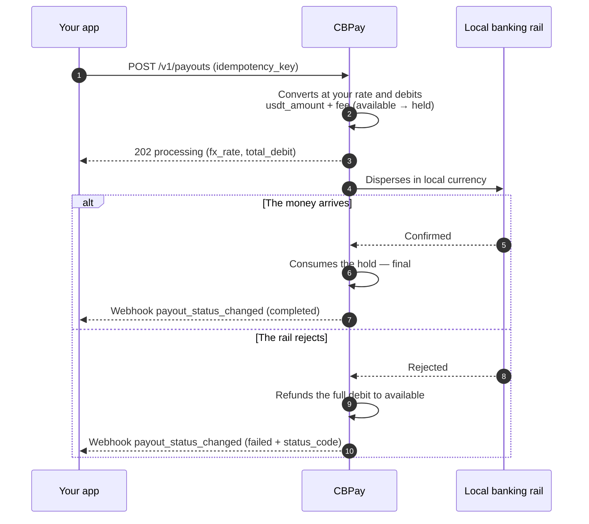
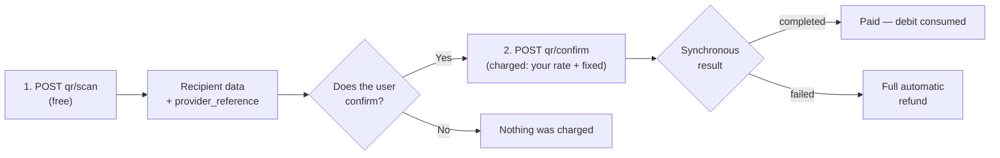

A payout sends money in local currency to a bank account in the destination
country. The amount converts from local currency to USDT at **your
account's rate** (the one from `GET /v1/rates`) and `usdt_amount + fee`
(the fixed fee, when configured) is debited from your balance.

This is the full lifecycle, including what happens to your balance at each
step:



## 1. Discover the available corridors

Countries, currencies and methods are defined by CBPay. Always check
the catalog:

```bash
curl https://api.qbank.cl/platform/v1/payouts/methods \
  -H "Authorization: Bearer <token>"
```

```json
{
  "items": [
    { "country": "CL", "currency": "CLP", "method": "bank_transfer" },
    { "country": "PE", "currency": "PEN", "method": "bank_transfer" },
    { "country": "PE", "currency": "PEN", "method": "yape" },
    { "country": "BO", "currency": "BOB", "method": "qr" }
  ],
  "meta": { "retrieved": 4 }
}
```

Available corridors and methods:

| Country | Currency | Methods |
|---|---|---|
| Chile | CLP | `bank_transfer` |
| Peru | PEN | `bank_transfer`, `yape` |
| Mexico | MXN | `bank_transfer` (SPEI: CLABE or debit card) |
| Venezuela | VES | `bank_transfer`, `pago_movil` |
| Bolivia | BOB / USD | `bank_transfer`, `qr` (see [QR payout](#qr-payout)) |
| Brazil | BRL | `pix` (by key), `qr` (see [QR payout](#qr-payout)) |
| Paraguay | PYG | `bank_transfer` |

Availability may vary; the catalog (`GET /v1/payouts/methods`) is always
the source of truth. If a country has a single method, `method` is
optional. Every method is charged the same way: your rate + fixed fee.

For bank transfers you also need the banks catalog (that is where the
beneficiary's `bank_code` comes from):

```bash
curl "https://api.qbank.cl/platform/v1/payouts/banks?country=CL" \
  -H "Authorization: Bearer <token>"
```

```json
{
  "items": [
    { "code": "001", "name": "Banco de Chile" },
    { "code": "012", "name": "Banco del Estado de Chile" },
    { "code": "016", "name": "Banco de Crédito e Inversiones" }
  ],
  "meta": { "retrieved": 3 }
}
```

## 2. Create the payout

```bash
curl -X POST https://api.qbank.cl/platform/v1/payouts \
  -H "Authorization: Bearer <token>" \
  -H "Content-Type: application/json" \
  -d '{
    "country": "MX",
    "currency": "MXN",
    "method": "bank_transfer",
    "amount": "1500.00",
    "beneficiary": {
      "name": "Maria Lopez",
      "account_type": "clabe",
      "account_number": "012180001234567895"
    },
    "description": "Invoice 8841",
    "idempotency_key": "invoice-8841"
  }'
```

<Warning>
`beneficiary` is a key/value object whose required fields depend on the
corridor (RUT and bank in Chile, CLABE in Mexico, CCI in Peru, PIX key in
Brazil, etc.). The methods catalog documents each one.
</Warning>

Response `202 Accepted`:

```json
{
  "payout_id": "0d4f…",
  "account_id": "…",
  "idempotency_key": "invoice-8841",
  "country": "MX",
  "currency": "MXN",
  "method": "bank_transfer",
  "local_amount": "1500.00",
  "fx_rate": "17.50",
  "usdt_amount": "85.714286",
  "fee": "0.300000",
  "total_debit": "86.014286",
  "status": "processing",
  "created_at": "2026-07-06T20:00:00Z"
}
```

At that moment your balance already reflects the debit: `total_debit` moved
from `available` into `held`.

## 3. Receive the final state

Subscribe to the `payout_status_changed` event ([webhooks](/en/webhooks)):

```json
{
  "payout_id": "0d4f…",
  "account_id": "…",
  "country": "MX",
  "currency": "MXN",
  "local_amount": "1500.00",
  "usdt_amount": "85.714286",
  "total_debit": "86.014286",
  "status": "completed",
  "status_code": ""
}
```

- **`completed`**: the money arrived; the hold is consumed.
- **`failed`**: the full debit is refunded automatically (`payout_refund`
  in your ledger).

You can also query at any time:

```bash
curl https://api.qbank.cl/platform/v1/payouts/0d4f… \
  -H "Authorization: Bearer <token>"
```

### Payout statuses

| Status | Meaning | Your balance |
|---|---|---|
| `processing` | Accepted and executing on the local rail | Debit held in `held` |
| `completed` | The money reached the beneficiary | Hold consumed — final |
| `failed` | The corridor rejected it or it failed | **Full automatic refund** (amount + fee) |

## Reads and history

Every payout can be read individually and the listing accepts filters:

```bash
# One payout
curl https://api.qbank.cl/platform/v1/payouts/0d4f… \
  -H "Authorization: Bearer <token>"

# History with filters: dates, status and pagination
curl "https://api.qbank.cl/platform/v1/payouts?from=2026-07-01&to=2026-07-08&status=failed&page=1&page_size=50" \
  -H "Authorization: Bearer <token>"
```

```json
{
  "page": 1,
  "page_size": 50,
  "payouts": [
    {
      "payout_id": "0d4f…",
      "country": "MX",
      "currency": "MXN",
      "method": "bank_transfer",
      "local_amount": "1500.00",
      "fx_rate": "17.50",
      "usdt_amount": "85.714286",
      "fee": "0.300000",
      "total_debit": "86.014286",
      "status": "failed",
      "status_code": "core_rejected",
      "status_message": "beneficiary account does not exist",
      "created_at": "2026-07-06T20:00:00Z"
    }
  ]
}
```

`from`/`to` use `YYYY-MM-DD` (UTC, both inclusive); an invalid date
responds `400 invalid_range`.

## Examples by country

Each corridor has its own `beneficiary` object (RUT and bank in Chile,
CLABE in Mexico, CCI in Peru, PIX key in Brazil…). The complete reference
with real request and response for all 7 countries lives on its own page:

<Card title="Country reference" icon="earth-americas" href="/en/guides/payouts-by-country">
  Chile, Peru, Mexico, Venezuela, Bolivia, Brazil and Paraguay — the exact
  `beneficiary`, the full request and the response of every corridor.
</Card>

## QR payout

In Bolivia (the local interoperable QR) and Brazil (PIX QR) you can also
**pay a collection QR** in two steps: scan and confirm. Scanning is
**free**; you are only charged on confirm, exactly like a regular payout
(your rate + fixed fee). Without `country`/`currency` Bolivia (BOB) is
assumed; for Brazil send `country: "BR"` and `currency: "BRL"`.



### 1. Scan the QR (free)

```bash
curl -X POST https://api.qbank.cl/platform/v1/payouts/qr/scan \
  -H "Authorization: Bearer <token>" \
  -H "Content-Type: application/json" \
  -d '{
    "qr_payload": "<QR content>",
    "currency": "BOB"
  }'
```

Returns the recipient's data so the user can confirm who they are paying:

```json
{
  "scan_id": "…",
  "provider_reference": "…",
  "beneficiary_name": "Juan Quispe",
  "destination_account": "…",
  "amount": "700.00",
  "currency": "BOB",
  "glosa": "",
  "status": "…"
}
```

### 2. Confirm the payment (charged here)

```bash
curl -X POST https://api.qbank.cl/platform/v1/payouts/qr/confirm \
  -H "Authorization: Bearer <token>" \
  -H "Content-Type: application/json" \
  -d '{
    "provider_reference": "<from the scan>",
    "amount": "700.00",
    "currency": "BOB",
    "description": "QR lunch payment",
    "idempotency_key": "qr-2026-07-07-a"
  }'
```

- `usdt_amount + fixed fee` is debited at **your rate**, just like a
  `bank_transfer`.
- The result is **synchronous**: the response already carries the final
  state (`completed`, or `failed` with an automatic refund) — no waiting.
- A scanned QR can only be paid once; retries with the same
  `idempotency_key` return the original payout.
- In Brazil, `qr_payload` accepts the QR content or the PIX "copia e cola"
  code; the same flow covers static and dynamic QRs.

## Common errors

| HTTP | `error` | What to do |
|---|---|---|
| 400 | `idempotency_key_required` | Send the key in body or header |
| 400 | `beneficiary_required` | Include the `beneficiary` object |
| 402 | `insufficient_funds` | Fund the account; the payout was not created |
| 403 | `account_blocked` | The account is not active; contact the CBPay team |
| 403 | `service_disabled` | Payouts is not enabled for your account — see [services](/en/concepts/services) |
| 422 | `currency_not_supported` | No FX rate for that currency |
| 422 | (payout with `status: failed`) | The corridor rejected the data; the debit was already refunded — fix `beneficiary` and retry with a new key |

## Immediate rejection vs later failure

If the processor rejects the payout at creation, you receive `422` with the
object in `status: failed` and the refund already applied. If it fails later
(e.g. the destination account does not exist), the webhook arrives with
`status: failed` and the automatic refund happens at that moment.

### Reading `status_code` on a failed payout

| `status_code` | Meaning | Action |
|---|---|---|
| `core_rejected` | The processor rejected the operation at creation (invalid beneficiary data, corridor unavailable) | Read `status_message`, fix the data and create a new payout with a new key |
| *another code* | Later rejection by the banking rail (e.g. destination account closed) | Same: fix the data and create a new operation |
| *(empty)* | Generic corridor failure | Check `status_message`; if unclear, contact support with the `payout_id` |

In every case the refund is already applied — verify it with the
`payout_refund` entry in
[movements](/en/concepts/movements-reconciliation).

<Note>
A payout in `processing` cannot be cancelled through the API: the rail
already has it. Wait for the final state via webhook or `GET` — it always
arrives, with an automatic refund on failure.
</Note>
