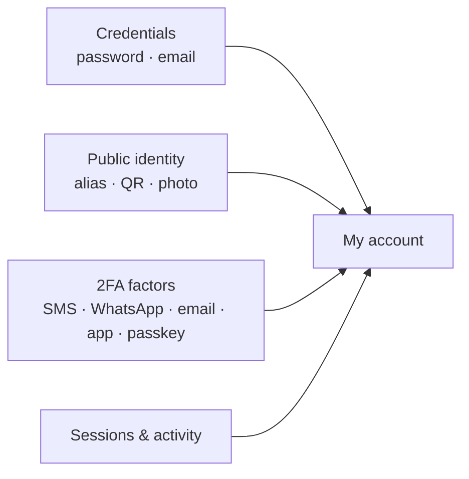

import { EnvUrls } from "/snippets/env-urls.jsx";

<EnvUrls lang="en" />

Everything an end user manages about **their own account**: credentials
(password and email), their public identity to receive money (alias, QR and
photo), two-factor authentication (2FA) factors, and control over their
sessions and security activity. It all lives under `/v1/me/*` and `/v1/auth/*`
and requires a **user session** (JWT); API keys do not apply.



## Profile data and verified identity

`PATCH /v1/me` updates your profile data (`display_name`, `tax_id`, `phone`,
`country`). But once your identity verification (KYC/KYB) is **approved**,
your name, tax ID and country are **filled automatically from the verified
identity** — what the verification confirmed, not what was self-declared —
and they become **immutable** through this endpoint:

```json
{
  "error": "identity_locked",
  "message": "display_name, tax_id and country come from your approved identity verification and cannot be changed here; contact support to update your verified identity"
}
```

To correct verified data (a legal name change, for example) contact your
platform's support: it takes a new verification or an operational override by
an administrator. `phone` stays editable at any time with its own
verification flow (OTP to the previous number when the policy requires it).

## Password

<Steps>
<Step title="Change it (with a session)">
`POST /v1/me/password` with `current_password` and `new_password`. If your
account was created via social login and has no password yet, leave
`current_password` empty to set the first one. Changing it **revokes all other
sessions** and the response carries a fresh one.

```bash
curl -X POST https://api.qbank.cl/platform/v1/me/password \
  -H "Authorization: Bearer $TOKEN" \
  -d '{"current_password":"old-pass","new_password":"my-new-strong-pass"}'
```
</Step>
<Step title="Recover it (no session)">
`POST /v1/auth/password/forgot` with `org` and `email`. It **always** returns
200 with the same body whether or not the account exists (it never reveals if
the email is registered). The code goes to the email; with `channel:"sms"` it
goes to the verified phone.

```bash
curl -X POST https://api.qbank.cl/platform/v1/auth/password/forgot \
  -d '{"org":"cbpay","email":"taylor@example.com"}'
```

Then `POST /v1/auth/password/reset` with `code` and `new_password`. Revokes all
sessions.
</Step>
</Steps>

## Login email

The email can be changed, but the **new email is always verified**: the code
goes to the new address and the change only applies once you confirm it. This
prevents anyone from pointing the login at a mailbox they do not control.

<Steps>
<Step title="Start the change">
`POST /v1/me/email/change` with `new_email`. If the 2FA policy requires it,
also send the `X-OTP-Token` header for the `email_change` action.
</Step>
<Step title="Confirm with the code">
`POST /v1/me/email/confirm` with the `code` received at the new email. The old
email is notified of the change.
</Step>
</Steps>

<Note>
Changing your email does **not** break your already-linked social logins
(Google, Apple, etc.): they are identified by the provider, not the email.
</Note>

## Alias and QR to get paid

Each account has two **permanent** public identifiers so others can send you
money between CBPay accounts:

- **Alias** — you choose it once with `PUT /v1/me/alias` (4-20 chars
  `a-z 0-9 . _ -`, no reserved words). It cannot be changed.
- **Profile QR** — `GET /v1/me/qr` returns the `qr_token`, the payload
  `cbpay:pay?to=<token>` and a ready-to-render PNG. It only lets others
  **receive** money to you, so it never changes.

Whoever is about to send can confirm your identity first with
`GET /v1/resolve?alias=taylor.code` (or `?qr=<token>`), which returns your
name, type and avatar. And transfers accept the destination directly:

```bash
curl -X POST https://api.qbank.cl/platform/v1/transfers \
  -H "Authorization: Bearer $TOKEN" \
  -d '{"to_alias":"taylor.code","amount":"10.00","idempotency_key":"t-001"}'
```

`to_qr_token` works the same (accepts the token or the `cbpay:pay?to=…`
payload).

## Profile photo

`PUT /v1/me/avatar` with the image bytes (JPEG, PNG or WebP, max 512 KB; the
type is detected from the content). `DELETE /v1/me/avatar` removes it and
`GET /v1/avatars/{accountID}` serves it for previews.

The response includes `avatar_url`: when the image is published to the public
CDN it is an **absolute URL that loads without authentication** (ideal for the
front end — use it directly in an ``); in that case
`GET /v1/avatars/{accountID}` answers with a `302` redirect to the same URL.

```json
{
  "status": "avatar_updated",
  "content_type": "image/png",
  "size_bytes": 20481,
  "avatar_url": "https://cdn.cbpayapp.com/public/avatars/1fa63bd1-…/9b1deb4d-…"
}
```

## Two-factor authentication (2FA)

CBPay protects sensitive actions with a one-time code. You choose, per action,
whether it is required and over **which channel**:

| Channel | How the code arrives | Notes |
|---|---|---|
| `sms` / `whatsapp` | Message to the phone | Subject to channel availability |
| `email` | Email to the verified address | Requires the email verified |
| `totp` | Authenticator app (Google Authenticator, Authy) | Immune to SIM swap; sends nothing |

`GET /v1/otp/preferences` shows your effective policy (and what your
organization requires, which is the **floor**: you can harden, not go below).
`PUT /v1/otp/preferences` adjusts it. **Weakening** your 2FA (disabling an
action or lowering the channel) first requires verifying your current factor.

<Warning>
Enabling **login** 2FA over `sms` or `whatsapp` requires your phone number
already **verified** (complete any SMS/WhatsApp OTP challenge first:
`POST /v1/otp/challenges` + verify). If the number is not verified the API
responds `409 phone_verification_required` — so a mistyped number cannot lock
you out of your account.
</Warning>

### Authenticator app (TOTP)

<Steps>
<Step title="Enroll">
`POST /v1/me/totp/enroll` returns the `otpauth://` and a QR. Scan it in your
app.
</Step>
<Step title="Confirm">
`POST /v1/me/totp/confirm` with the first code. It hands you **10 one-time
backup codes** — store them, they are shown only once.
</Step>
</Steps>

Regenerate the codes with `POST /v1/me/totp/recovery-codes` or remove the app
with `DELETE /v1/me/totp` (both require a valid code).

### Passkeys

**Passkeys** let you sign in without a password using the device's biometrics
(Face ID, Touch ID, Windows Hello, or a security key).

<Steps>
<Step title="Register">
`POST /v1/me/passkeys/register/begin` → pass `options.publicKey` to
`navigator.credentials.create()` → `POST /v1/me/passkeys/register/finish` with
the result and a name ("Taylor's MacBook").
</Step>
<Step title="Sign in">
`POST /v1/auth/passkey/login/begin` with `org` → `navigator.credentials.get()`
→ `POST /v1/auth/passkey/login/finish`. Since a passkey is already two factors
(device + biometrics), this login does not ask for a second code.
</Step>
</Steps>

List and remove your passkeys with `GET`/`DELETE /v1/me/passkeys`. You cannot
remove your **only** sign-in method.

<Note>
Passkeys and passkey registration depend on your organization having its domain
configured; otherwise they return `passkeys_unavailable`.
</Note>

## Sessions and activity

- `GET /v1/me/sessions` lists your active sessions (device, IP, login method,
  which one is current). `DELETE /v1/me/sessions/{id}` closes one;
  `POST /v1/me/sessions/revoke-all` closes all but the current.
- `GET /v1/me/security/events?from=&to=` is your account's security history:
  logins, password or email changes, factors added or removed.

On top of that, CBPay **emails you** when your password or email changes or a
factor is added/removed — your safety net against unauthorized access.

## Common errors

| Code | HTTP | What to do |
|---|---|---|
| `invalid_password` | 403 | The current password does not match |
| `alias_already_set` | 409 | The alias is already set; it is permanent |
| `alias_taken` | 409 | That alias is taken; choose another |
| `email_in_use` | 409 | Another login already uses that email |
| `no_pending_email` | 409 | No pending email change; start it again |
| `policy_locked_by_org` | 403 | Your organization requires that action/channel; it cannot be weakened |
| `totp_enrollment_required` | 409 | Enroll the app before requiring the `totp` channel |
| `phone_verification_required` | 409 | Verify your phone (OTP challenge) before enabling login 2FA over SMS/WhatsApp |
| `last_login_method` | 409 | You cannot remove your only sign-in method |
| `passkeys_unavailable` | 503 | Your organization has no passkeys configured |
| `image_too_large` / `unsupported_image` | 413 / 415 | Avatar max 512 KB, JPEG/PNG/WebP |

<AccordionGroup>
<Accordion title="Can I change my alias or QR later?">
No. Both are permanent by design: they are your stable identity to receive
money. The QR only allows receiving, so sharing it is not a risk.
</Accordion>
<Accordion title="I lost the phone with my authenticator app">
Use one of your **backup codes** (the ones you got when confirming TOTP) in any
verification or login. If you do not have them, recover access with another
factor (passkey or password + another channel) and regenerate everything.
</Accordion>
<Accordion title="Does changing my email disconnect me from Google/Apple?">
No. Social logins are identified by the provider, not the email, so they keep
working.
</Accordion>
</AccordionGroup>
