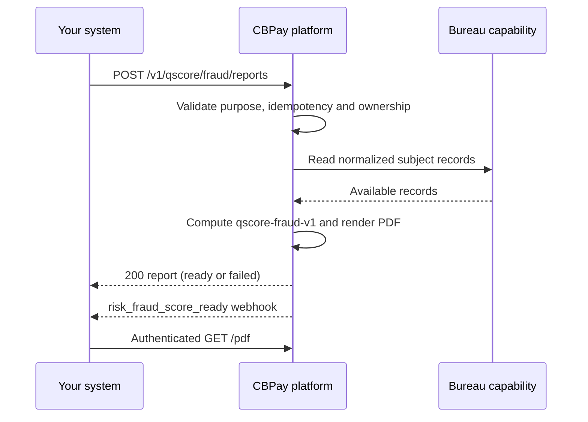

import { EnvUrls } from "/snippets/env-urls.jsx";

<EnvUrls lang="en" />

Qscore fraud and identity is a product separate from the credit report. It
returns a **fraud-risk** score: a higher value means higher fraud risk. The
report combines the subject's recent query velocity, verified-platform
signals, contact consistency, shared device/IP evidence and available bureau
coverage. It is designed for fraud prevention, identity verification and
onboarding decisions; it is not a credit score.

<Note>
This product is gated by the account's `risk` service flag and charged with
the fixed-only `risk_fraud_score` service. A failed generation is refunded
automatically. The PDF and detailed signals are never sent by email.
</Note>

## Flow



## Create a report

`POST /v1/qscore/fraud/reports` is authenticated and requires a verified
account. The idempotency key can be in the JSON body or in the
`Idempotency-Key` header.

| Field | Required | Description |
|---|---:|---|
| `country` | yes | ISO 3166-1 alpha-2 country of the document. |
| `doc_id` | yes | Subject document. Chilean IDs are normalized and validated. |
| `subject_type` | no | `person` or `company`; omitted values are inferred when possible. |
| `purpose` | yes | `fraud_prevention`, `identity_verification`, `onboarding` or `other`. |
| `lang` | no | `en`, `es` or `zh`; defaults to `en`. |
| `idempotency_key` | yes | Unique key for this purchase. |

```bash Create a fraud report
curl -X POST "https://api.qbank.cl/platform/v1/qscore/fraud/reports" \
  -H "Authorization: Bearer pk_live_..." \
  -H "Content-Type: application/json" \
  -H "Idempotency-Key: fraud-check-2026-09-06-001" \
  -d '{
    "country": "CL",
    "doc_id": "76.123.456-0",
    "subject_type": "company",
    "purpose": "identity_verification",
    "lang": "en"
  }'
```

```json 200 OK
{
  "report_id": "9f1c2d3e-4a5b-4c6d-8e7f-0a1b2c3d4e5f",
  "kind": "qscore_fraud",
  "subject_id": "3fa85f64-5717-4562-b3fc-2c963f66afa6",
  "country": "CL",
  "doc_id": "76123456-0",
  "subject_type": "company",
  "purpose": "identity_verification",
  "status": "ready",
  "model_version": "qscore-fraud-v1",
  "lang": "en",
  "score": 280,
  "band": "B",
  "reason_codes": [
    {"code": "NEW_SUBJECT", "direction": "negative", "weight": "high"}
  ],
  "verify_code": "F9f1c2d3e4a5b6c7d8e9f00112233445566778899aabbccddeeff0011223344",
  "verify_url": "https://business.cbpayapp.com/verify/qscore-fraud/F9f1c2d3e4a5b6c7d8e9f00112233445566778899aabbccddeeff0011223344",
  "pdf_url": "/v1/qscore/fraud/reports/9f1c2d3e-4a5b-4c6d-8e7f-0a1b2c3d4e5f/pdf",
  "created_at": "2026-09-06T15:04:12Z"
}
```

A replay with the same account and key returns the original report with
`"idempotency_hit": true`; it never charges or generates a second report.

## Read the report

### List

`GET /v1/qscore/fraud/reports` returns the reports visible to the caller.
`from` and `to` are required date filters (`YYYY-MM-DD`, organization
timezone, inclusive). `status` is optional. Pagination defaults to 50 and is
capped at 200.

```bash List fraud reports
curl "https://api.qbank.cl/platform/v1/qscore/fraud/reports?from=2026-09-01&to=2026-09-30&status=ready&page=1&page_size=50" \
  -H "Authorization: Bearer pk_live_..."
```

```json 200 OK
{
  "items": [
    {
      "report_id": "9f1c2d3e-4a5b-4c6d-8e7f-0a1b2c3d4e5f",
      "kind": "qscore_fraud",
      "subject_id": "3fa85f64-5717-4562-b3fc-2c963f66afa6",
      "country": "CL",
      "doc_id": "76123456-0",
      "subject_type": "company",
      "purpose": "identity_verification",
      "status": "ready",
      "score": 280,
      "band": "B",
      "created_at": "2026-09-06T15:04:12Z"
    }
  ],
  "meta": {"page": 1, "page_size": 50, "total": 1}
}
```

### Detail

`GET /v1/qscore/fraud/reports/{report_id}` returns the same report metadata,
reason codes and verification/PDF links when the report is ready. An ID that
is not a UUID, does not belong to the caller's scope or does not exist returns
`404 not_found`.

### PDF

`GET /v1/qscore/fraud/reports/{report_id}/pdf` downloads the branded PDF with
`Content-Type: application/pdf` and
`Content-Disposition: attachment; filename="qxrisk_fraud_<report_id>.pdf"`.
The download is authenticated and is available only when the report is
`ready`; otherwise the endpoint returns `404 not_found`.

## Score and statuses

The model is `qscore-fraud-v1`, ranges from 1 to 999 and uses the following
fraud-risk bands:

| Band | Score | Meaning |
|---|---:|---|
| `A` | 1–199 | Lower observed fraud risk |
| `B` | 200–399 | Low-to-moderate observed risk |
| `C` | 400–599 | Moderate observed risk |
| `D` | 600–799 | High observed risk |
| `E` | 800–999 | Very high observed risk |

The implemented reason codes are `NEW_SUBJECT`, `VELOCITY`,
`CONTACT_MISMATCH`, `SHARED_DEVICE_IP` and `THIN_FILE`. A missing internal
age signal does not itself create `NEW_SUBJECT`; a thin file is reported when
there is neither usable internal history nor bureau coverage.

| Status | Meaning | What to do |
|---|---|---|
| `pending` | Report row exists while generation is running | Poll the detail endpoint |
| `ready` | Score, reasons, verification code and PDF are available | Read or download it |
| `failed` | Generation failed after the charge path | Read `error_code`; the fee is refunded; retry with a new key |

## Webhook and email

When the report completes, the account receives one signed
`risk_fraud_score_ready` webhook:

```json risk_fraud_score_ready
{
  "report_id": "9f1c2d3e-4a5b-4c6d-8e7f-0a1b2c3d4e5f",
  "kind": "qscore_fraud",
  "subject_id": "3fa85f64-5717-4562-b3fc-2c963f66afa6",
  "country": "CL",
  "doc_id": "76••••••-0",
  "score": 280,
  "band": "B",
  "status": "ready"
}
```

The email is best-effort and branded for the organization. It contains only a
short report reference, the subject document and a link to the account; it
does not include the PDF, score, band or fraud signals.

## Public authenticity verification

`GET /verify/qscore-fraud/{code}` is public and rate-limited. A valid code
returns only authenticity, current status, issue date and issuer:

```json 200 OK
{
  "valid": true,
  "type": "qscore_fraud",
  "status": "ready",
  "date": "2026-09-06",
  "issued_by": "CBPay"
}
```

An invalid or tampered code returns `404` with `valid: false`; the public
endpoint never reveals the document, score or signals.

## Errors

| HTTP | Code | Solution |
|---:|---|---|
| 400 | `invalid_doc_id` | Send a valid document for the selected country |
| 400 | `invalid_purpose` | Use one of the four closed purposes |
| 400 | `invalid_subject_type` | Send `person` or `company` |
| 400 | `idempotency_key_required` | Send the body field or `Idempotency-Key` header |
| 403 | `verification_required` | Complete KYC/KYB for the account |
| 403 | `service_disabled` | Enable the `risk` service for the account |
| 404 | `not_found` | Check the report ID or wait for a ready PDF |
| 429 | `too_many_attempts` | Slow down public verification requests |
| 502 | `generation_failed` | The charge was refunded; retry later with a new key |

## FAQ

<AccordionGroup>
  <Accordion title="Is this a credit score?">
    No. This is a separate fraud and identity risk score. Higher values mean
    higher observed fraud risk; it must not be interpreted as creditworthiness.
  </Accordion>
  <Accordion title="Can I generate a score-only response?">
    No. The product always creates the full report, PDF and verification code.
  </Accordion>
  <Accordion title="Does a retry charge twice?">
    No. Reuse the same idempotency key to replay the original result. Use a new
    key only when you intentionally start a new assessment.
  </Accordion>
  <Accordion title="Does the public verification page show the score?">
    No. It confirms authenticity without exposing the document, score or
    signals.
  </Accordion>
</AccordionGroup>
