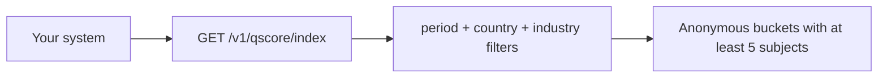

import { EnvUrls } from "/snippets/env-urls.jsx";

<EnvUrls lang="en" />

The Qscore Index is a public, aggregate view of quarterly score
distributions. It is an informational index, not a lookup of a person or
company. It never exposes RUTs, account IDs or a population smaller than the
minimum bucket size.



## Read the index

`GET /v1/qscore/index` is public and requires no credential. If `period` is
omitted, the API selects the most recently closed UTC quarter. Optional
filters are:

| Query | Description |
|---|---|
| `period` | Closed quarter in the exact `YYYY-Q1`…`YYYY-Q4` format. |
| `country` | ISO 3166-1 alpha-2 country filter. |
| `industry_code` | Industry/ISIC code filter. |

```bash Public index
curl "https://api.qbank.cl/platform/v1/qscore/index?period=2026-Q2&country=CL&industry_code=6499"
```

```json 200 OK
{
  "period": "2026-Q2",
  "country": "CL",
  "industry_code": "6499",
  "items": [
    {
      "period": "2026-Q2",
      "country": "CL",
      "industry_code": "6499",
      "band": "B",
      "subject_count": 12,
      "avg_score": 742,
      "created_at": "2026-07-01T00:00:00Z"
    }
  ],
  "methodology": "quarterly anonymous buckets; each bucket requires at least five subjects"
}
```

`items` is ordered by country, industry code and band. There is no pagination:
the endpoint returns the filtered snapshot.

## Methodology and privacy

At the end of each quarter, the index takes the latest score of each subject
whose score existed before the quarter closed. It groups by country, industry
code and score band (`A`, `B`, `C`, `D`, `E` or `SC`). A bucket is published
only when it contains at least **five subjects**. `avg_score` is the rounded
integer average of the scores in that bucket.

The index is append-only by period and bucket. It is not a live score for any
individual, and the API does not expose a subject-level drill-down.

## Response states and period validation

| HTTP | Meaning | Action |
|---:|---|---|
| `200` | Filtered quarterly snapshot | Read the anonymous `items` |
| `400 invalid_period` | The period is malformed or outside the supported format | Send a closed `YYYY-Qn` value |

Valid values are `YYYY-Q1`, `YYYY-Q2`, `YYYY-Q3` and `YYYY-Q4`. The year must
be between 2020 and 9999. An invalid value returns `400 invalid_period`.
See the [error catalog](/en/errors).

## Authenticated equivalent

`GET /v1/qscore/index/account` returns the same snapshot and filters for an
authenticated account or organization read scope. Account-level callers must
have the `risk` service enabled; administrative read scopes are not tied to a
single account flag.

The index does not charge a fee, emit a webhook or send an email.

## FAQ

<AccordionGroup>
  <Accordion title="Can I identify a subject from a bucket?">
    No. Buckets with fewer than five subjects are omitted and the response
    never contains document or account identifiers.
  </Accordion>
  <Accordion title="Does an omitted period mean the current quarter?">
    No. It means the most recently closed UTC quarter, so a partially completed
    quarter is never presented as final.
  </Accordion>
  <Accordion title="Can I request only one industry?">
    Yes. Send `industry_code` together with `country` and `period`.
  </Accordion>
</AccordionGroup>
