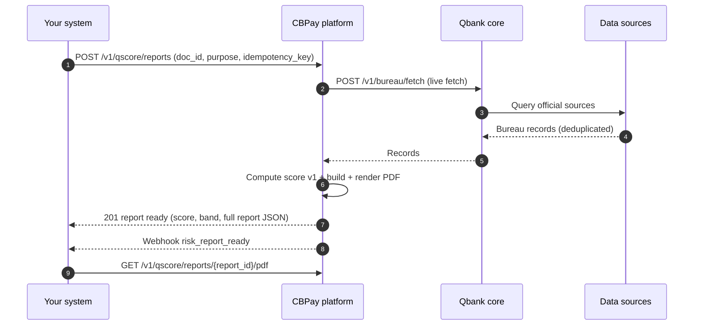

import { EnvUrls } from "/snippets/env-urls.jsx";

<EnvUrls lang="en" />

Qscore is the API-first credit bureau of the platform. One call returns a **complete credit report** of a person or company — identity, tradelines, delinquencies, bankruptcies, commercial activity, alternative data — plus a **credit score (1–999) with its band and explainable reason codes**, rendered as a branded PDF and exposed as JSON.

- **Chile first, country-agnostic design**: today subjects are Chilean (`country: "CL"`, RUT as `doc_id`); new countries plug in without contract changes.
- **Live freshness**: every report queries the data sources at purchase time and declares, per source, whether the data is `live`, `cached` or `unavailable`. No silent stale data.
- **Compliance built in**: the declared `purpose` is mandatory (Chilean data protection law), every score carries its reason codes, and every report includes a public verification code.

<Note>
Qscore is a paid product gated by the `risk` service flag of your account and billed per report (`risk_report_person` / `risk_report_company` standalone fees). If the generation fails after the charge, the fee is **refunded automatically** and the report ends `failed` with its `error_code`. The exception is **your own report**: a verified account holder generates their self report for free — see "Your own report (self)" below.
</Note>

## How it works



Generation is **synchronous**: the `POST` fetches the bureau records, computes the score, renders the PDF and returns the ready report in a single response. A source that is down does **not** fail a paid report — it is generated with the persisted data and the source is declared `cached` (or `unavailable` if it contributed nothing) in the `sources` section.

## Your own report (self)

If you hold a **verified account** (approved KYC/KYB), you can generate and download **your own Qscore report** directly. This is your right of access to your personal data (ARCO / Chilean Law 21.719), not a purchase:

- **Free**: no fee is charged, ever.
- **No score penalty**: self reports are excluded from the inquiry count of your score — checking your own report never hurts it.
- **Anti-oracle by design**: the subject identity comes from the `tax_id` verified in your KYC/KYB. The request does **not** accept a `doc_id` — asking for someone else's report through these endpoints is impossible.
- **Frequency limit**: one **new** report every 30 days. If you already have a `ready` report within the window, the `POST` returns it with `idempotency_hit: true` (HTTP 200) instead of generating another.

### Generate (or reuse) your report

`POST /v1/qscore/my-report` — the body is optional: `{"lang": "es"|"en"|"zh"}` (default `es`). Generation is **synchronous**: the response carries the finished report. No `idempotency_key` is needed — idempotency is deterministic per account, subject and day (a double submit on the same day returns the already-created report).

```bash Generate your own report
curl -X POST "https://api.qbank.cl/platform/v1/qscore/my-report" \
  -H "Authorization: Bearer pk_live_..." \
  -H "Content-Type: application/json" \
  -d '{"lang": "es"}'
```

```json 201 Created (new report generated)
{
  "report_id": "9f1c2d3e-4a5b-4c6d-8e7f-0a1b2c3d4e5f",
  "subject_id": "3fa85f64-5717-4562-b3fc-2c963f66afa6",
  "status": "ready",
  "purpose": "self_access",
  "lang": "es",
  "band": "B",
  "model_version": "qscore-v2",
  "verify_code": "Q9f1c2d3e4a5b4c6d8e7f0a1b2c3d4e5f1a2b3c4d5e6f",
  "created_at": "2026-08-08T15:04:12Z",
  "score": 742,
  "reason_codes": ["RC01", "RC07"],
  "completed_at": "2026-08-08T15:04:19Z",
  "report": { "...": "full report JSON" }
}
```

A second call within 30 days answers `200 OK` with the same report and `"idempotency_hit": true`. If the generation fails, the response is `201` with `status: "failed"` and its `error_code` / `error_message` (nothing was charged — the self report is free).

### Read your latest report

`GET /v1/qscore/my-report` returns your most recent self report (any status) without generating a new one — `404 not_found` if you never generated one.

### Download the PDF

`GET /v1/qscore/my-report/pdf` downloads the PDF of your latest self report (`Content-Disposition: attachment; filename="qscore_self_<id>.pdf"`). If the report is not `ready` yet, it answers `404 pdf_not_ready`.

The PDF carries the same public verification code as any Qscore report — anyone holding it can check its authenticity at `GET /verify/qscore/{code}` (see "Public verification" below).

### Self-report errors

| HTTP | Code | When | Solution |
|---|---|---|---|
| 403 | `kyc_required` | Your account's KYC/KYB is not approved | Complete identity verification first |
| 409 | `no_tax_id` | Your account has no verified tax id on file | Complete your verified profile or contact support |
| 400 | `invalid_tax_id` | The tax id on file is not valid for the account country | Contact support to fix your verified data |
| 409 | `identity_mismatch` | The account `tax_id` does not match the verified identity document (it was overridden) | Contact support — your verified data must be consistent |
| 404 | `not_found` | You never generated a self report (`GET`) | Generate one with `POST /v1/qscore/my-report` |
| 404 | `pdf_not_ready` | The report is not `ready` yet or has no PDF | Retry the download once the report is `ready` |

<Note>
The commercial endpoint `POST /v1/qscore/reports` **rejects** `purpose: "self_access"` with `400 invalid_purpose` — self access only goes through `/v1/qscore/my-report`. The `risk_report_ready` webhook of a self report carries an extra `"purpose": "self_access"` field in its payload.
</Note>

## 1. Buy a report

`POST /v1/qscore/reports` creates and generates the full report. `idempotency_key` is **mandatory** (the report charges a fee: a retry with the same key returns the original report with `idempotency_hit: true` and never double-charges).

| Field | Type | Required | Description |
|---|---|---|---|
| `doc_id` | string | yes | Document ID of the subject. In Chile, the RUT (`11.111.111-1`); it is normalized to canonical form. |
| `country` | string | yes | ISO 3166-1 alpha-2 country of the document. Today `CL`. |
| `subject_type` | string | no | `person` or `company`. If omitted it is inferred from the document. |
| `purpose` | string | yes | Declared purpose (data protection law): `credit_evaluation`, `tenant_screening`, `hiring`, `supplier_onboarding`, `other`. |
| `lang` | string | no | Report language: `es` (default), `en`, `zh`. |
| `idempotency_key` | string | yes | Your unique key for this purchase. |

<Tabs>
  <Tab title="Person">

```bash Create person report
curl -X POST "https://api.qbank.cl/platform/v1/qscore/reports" \
  -H "Authorization: Bearer pk_live_..." \
  -H "Content-Type: application/json" \
  -d '{
    "doc_id": "11.111.111-1",
    "country": "CL",
    "purpose": "credit_evaluation",
    "lang": "en",
    "idempotency_key": "qscore-2026-08-08-0001"
  }'
```

  </Tab>
  <Tab title="Company">

```bash Create company report
curl -X POST "https://api.qbank.cl/platform/v1/qscore/reports" \
  -H "Authorization: Bearer pk_live_..." \
  -H "Content-Type: application/json" \
  -d '{
    "doc_id": "76.123.456-0",
    "country": "CL",
    "subject_type": "company",
    "purpose": "supplier_onboarding",
    "lang": "en",
    "idempotency_key": "qscore-2026-08-08-0002"
  }'
```

  </Tab>
</Tabs>

```json 201 Created (report ready)
{
  "report_id": "f47ac10b-58cc-4372-a567-0e02b2c3d479",
  "subject_id": "3fa85f64-5717-4562-b3fc-2c963f66afa6",
  "status": "ready",
  "purpose": "credit_evaluation",
  "lang": "en",
  "band": "B",
  "model_version": "qscore-v1",
  "verify_code": "Qf47ac10b58cc4372a5670e02b2c3d4791a2b3c4d5e6f",
  "created_at": "2026-08-08T15:04:22Z",
  "score": 742,
  "completed_at": "2026-08-08T15:04:25Z",
  "report": {
    "meta": {
      "report_id": "QSR-f47ac10b58cc",
      "lang": "en",
      "purpose": "credit_evaluation",
      "generated_at": "2026-08-08T15:04:25Z",
      "verification_code": "Qf47ac10b58cc4372a5670e02b2c3d4791a2b3c4d5e6f",
      "verification_url": "https://business.cbpayapp.com/verify/qscore/Qf47ac10b58cc4372a5670e02b2c3d4791a2b3c4d5e6f"
    },
    "identity": {
      "subject_type": "person",
      "doc_id": "11111111-1",
      "name": "Juan Pérez González",
      "country": "CL"
    },
    "score": {
      "score": 742,
      "band": "B",
      "model_version": "qscore-v1",
      "reason_codes": [
        {"code": "ACTIVE_TRADELINES", "direction": "positive", "weight": "medium"},
        {"code": "CREDIT_HISTORY_DEPTH", "direction": "positive", "weight": "low"}
      ],
      "computed_at": "2026-08-08T15:04:25Z"
    },
    "summary": ["No open delinquencies on record", "Active tax status"],
    "internal_score": {"available": false},
    "sources": [
      {"source": "res_chile", "label": "Registro de Empresas y Sociedades (RES)", "records": 2, "fetched_at": "2026-08-08T15:04:23Z", "freshness": "live"}
    ]
  }
}
```

If something fails after the fee was charged, the fee is refunded and the response is the error with `error_code: "generation_failed"` persisted on the report. Re-running with the **same** `idempotency_key` returns the original report (or its failure) — it never charges twice.

## 2. The score (model v1)

The score runs `qscore-v1`: base **600**, range **1–999**, adjusted by adverse facts (open delinquencies, protests, bankruptcies, recent queries) and positive signals (active tradelines, credit history depth, company activity, alternative data).

| Band | Range | Reading |
|---|---|---|
| `A` | 800–999 | Excellent |
| `B` | 650–799 | Good |
| `C` | 500–649 | Fair |
| `D` | 350–499 | Weak |
| `E` | 1–349 | High risk |
| `SC` | — | No data found for the subject (score is `null`) |

Every report carries its `reason_codes` — the explainability layer of the score:

| Code | Direction | Meaning |
|---|---|---|
| `NO_DATA` | negative | No records found for the subject (band `SC`) |
| `BANKRUPTCY_OPEN` | negative | Open insolvency/bankruptcy proceeding |
| `OPEN_DELINQUENCY` | negative | Open delinquency in collections |
| `PROTESTO_OPEN` | negative | Unpaid protested document (bounced check/promissory note) |
| `RECENT_DELINQUENCY` | negative | Delinquency reported recently |
| `MANY_RECENT_QUERIES` | negative | Many reports purchased on the subject in the last 90 days |
| `ACTIVE_TRADELINES` | positive | Active, up-to-date credit lines |
| `CREDIT_HISTORY_DEPTH` | positive | Long credit history |
| `COMPANY_ACTIVE` | positive | Active company with tax activity |
| `COMPANY_NEW` | negative | Recently incorporated company |
| `ALTERNATIVE_POSITIVE` | positive | Positive alternative data (utilities, open finance) |
| `INTERNAL_ACTIVITY` | positive | Positive internal platform signals |

### Industry peer benchmark (company reports only)

**Company** reports may include the `peer_benchmark` block: the score's position **within its segment** — same country and same industry (ISIC classification, from the tax registry).

```json
"peer_benchmark": {
  "available": true,
  "segment_code": "6499",
  "segment_label": "Other financial service activities",
  "peers": 12,
  "percentile": 75,
  "median_score": 640
}
```

| Field | Type | Description |
|---|---|---|
| `available` | boolean | `true` when there is a large enough comparable population. |
| `segment_code` / `segment_label` | string | The subject's industry code and label (ISIC). |
| `peers` | number | Comparable companies considered. |
| `percentile` | number | Percentage of peers with a **lower** score (75 = better than 75% of the segment). |
| `median_score` | number | Segment median score. |

Benchmark rules:

- **Company reports only** — person reports never include it (the block is omitted).
- **The industry comes from the tax registry** and is stamped on the subject (the latest known value wins).
- **The comparable population is the latest score of each company** in the same country and industry, excluding the evaluated subject.
- **Published only with at least 5 comparable companies** — below that, the block is omitted from the report (statistical context is never invented).
- `percentile` reads as "better than N% of the segment"; `median_score` is the segment median.

The report PDF includes the peer comparison section only when the block is available.

## 3. Query and history

### List reports

`GET /v1/qscore/reports` lists the reports purchased by your account. `from` and `to` (dates `YYYY-MM-DD`, organization timezone, both inclusive) are **mandatory**; filters `subject_id` and `status` (`pending`, `ready`, `failed`) are optional; pagination with `page` / `page_size` (default 50, max 200).

```bash List reports
curl "https://api.qbank.cl/platform/v1/qscore/reports?from=2026-08-01&to=2026-08-31&status=ready&page=1&page_size=50" \
  -H "Authorization: Bearer pk_live_..."
```

```json 200 OK
{
  "items": [
    {
      "report_id": "f47ac10b-58cc-4372-a567-0e02b2c3d479",
      "account_id": "ae8c91f2-…",
      "subject_id": "3fa85f64-5717-4562-b3fc-2c963f66afa6",
      "purpose": "credit_evaluation",
      "status": "ready",
      "lang": "en",
      "score": 742,
      "band": "B",
      "score_model_version": "qscore-v1",
      "reason_codes": [{"code": "ACTIVE_TRADELINES", "direction": "positive", "weight": "medium"}],
      "verify_code": "Qf47ac10b58cc4372a5670e02b2c3d4791a2b3c4d5e6f",
      "created_at": "2026-08-08T15:04:22Z",
      "completed_at": "2026-08-08T15:04:25Z"
    }
  ],
  "meta": {"page": 1, "page_size": 50, "total": 1}
}
```

### Report detail

`GET /v1/qscore/reports/{report_id}` returns the report; when `ready` it includes the full `report` object (same shape as the creation response).

### Download the PDF

`GET /v1/qscore/reports/{report_id}/pdf` downloads the branded PDF (`application/pdf`, filename `qscore_<report_id>.pdf`). Until the report is `ready` it answers `404 pdf_not_ready`. The PDF is a private document: download it **authenticated** — it is never attached to emails nor exposed on public URLs.

### Subject file and current score (without buying a new report)

`GET /v1/qscore/subjects/{doc_id}?country=CL` returns the subject file (identity + latest score) for a document you already reported on:

```json 200 OK (subject file)
{
  "subject_id": "3fa85f64-5717-4562-b3fc-2c963f66afa6",
  "country": "CL",
  "doc_id": "11111111-1",
  "subject_type": "person",
  "display_name": "Juan Pérez González",
  "last_score": 742,
  "last_band": "B",
  "last_score_at": "2026-08-08T15:04:25Z"
}
```

`GET /v1/qscore/subjects/{doc_id}/score?country=CL` returns just the current score (`404 no_score` if the subject has none yet):

```json 200 OK (current score)
{
  "subject_id": "3fa85f64-5717-4562-b3fc-2c963f66afa6",
  "doc_id": "11111111-1",
  "country": "CL",
  "band": "B",
  "model_version": "qscore-v1",
  "computed_at": "2026-08-08T15:04:25Z",
  "score": 742
}
```

## 4. Report statuses

| Status | Meaning | What to do |
|---|---|---|
| `pending` | Report created, generation in progress (transient inside the synchronous call) | Nothing — the `POST` response carries the final state |
| `ready` | Report generated: score, full JSON and PDF available (final) | Read the JSON, download the PDF, share the verification link |
| `failed` | Generation failed; the fee was **refunded** (final) | Read `error_code` / `error_message`, fix the cause, buy a new report with a **new** `idempotency_key` |

## 5. Errors

| HTTP | Code | When | Solution |
|---|---|---|---|
| 400 | `invalid_payload` | `doc_id`/`country` missing or malformed JSON | Send both fields with a valid JSON body |
| 400 | `purpose_required` | `purpose` missing | Declare the purpose (data protection law) |
| 400 | `invalid_purpose` | `purpose` outside the closed list, or `self_access` sent to the commercial endpoint | Use `credit_evaluation`, `tenant_screening`, `hiring`, `supplier_onboarding` or `other` — self access goes through `POST /v1/qscore/my-report` |
| 400 | `invalid_doc_id` | The document is not valid for the country (e.g. bad RUT check digit) | Fix the `doc_id` format for the country |
| 400 | `invalid_subject_type` | `subject_type` is not `person`/`company` and could not be inferred | Send `subject_type` explicitly |
| 400 | `idempotency_key_required` | Missing `idempotency_key` | Send a unique key per purchase |
| 404 | `not_found` | Report/subject does not exist (or belongs to another account) | Check the ID |
| 404 | `no_score` | The subject has no computed score yet | Buy a report first |
| 404 | `pdf_not_ready` | The report is not `ready` yet | Poll the detail until `status=ready` |
| 502 | `generation_failed` | The report could not be generated after charging | The fee was refunded; retry later or contact support |

See the full catalogue in [Errors](/en/errors).

## 6. Webhooks

Subscribe to the Qscore events in your [webhook settings](/en/webhooks). All three are account-audience events, signed like every other webhook.

<AccordionGroup>
  <Accordion title="risk_report_ready — a report finished generating">

```json risk_report_ready
{
  "report_id": "f47ac10b-58cc-4372-a567-0e02b2c3d479",
  "subject_id": "3fa85f64-5717-4562-b3fc-2c963f66afa6",
  "doc_id": "11111111-1",
  "country": "CL",
  "subject_type": "person",
  "score": 742,
  "band": "B",
  "verify_code": "Qf47ac10b58cc4372a5670e02b2c3d4791a2b3c4d5e6f"
}
```

A self report (see "Your own report (self)") emits the same event with an extra `"purpose": "self_access"` field; commercial reports omit it.

  </Accordion>
  <Accordion title="risk_score_changed — the subject's score moved">

Fired when a new report computes a score different from the subject's previous one.

```json risk_score_changed
{
  "subject_id": "3fa85f64-5717-4562-b3fc-2c963f66afa6",
  "report_id": "f47ac10b-58cc-4372-a567-0e02b2c3d479",
  "old_score": 715,
  "new_score": 742,
  "old_band": "B",
  "new_band": "B"
}
```

  </Accordion>
  <Accordion title="risk_monitoring_alert — a monitored subject changed">

Fired for every active monitoring subscription when the subject's score drops below your `monitor_since_score` floor, new bureau records appear, or records are removed. The first evaluation after subscribing only seeds the baseline and never alerts.

```json risk_monitoring_alert
{
  "monitoring_id": "2f7b1c94-8d3a-4c5e-9f01-6a7b8c9d0e11",
  "subject_id": "3fa85f64-5717-4562-b3fc-2c963f66afa6",
  "doc_id": "11111111-1",
  "country": "CL",
  "subject_type": "person",
  "triggers": ["score_drop_below", "new_records"],
  "previous_score": 688,
  "score": 612,
  "band": "C",
  "record_count": 4,
  "new_records": [
    {
      "source": "res_chile",
      "record_type": "debt_collection",
      "reported_at": "2026-08-08",
      "amount": "350000",
      "currency": "CLP",
      "status": "open"
    }
  ],
  "detected_at": "2026-08-08T16:30:00Z"
}
```

  </Accordion>
</AccordionGroup>

## 7. Public verification

Every report PDF prints a **verification code** and URL. Anyone holding the code can check the report's authenticity — without PII — at `GET /verify/qscore/{code}` (no auth):

```json 200 OK (valid report)
{
  "valid": true,
  "type": "verification_report",
  "kind": "qscore",
  "status": "ready",
  "decision": "B",
  "date": "2026-08-08",
  "issued_by": "CBPay"
}
```

An invalid or tampered code answers `404` with `{"valid": false, ...}`. The endpoint is rate-limited per IP and reveals nothing beyond validity, band and date.

## 8. ARCO disputes

Data subjects can exercise their ARCO rights (access, rectification, cancellation, opposition). Your account opens a dispute against a specific record of a subject:

```bash Open a dispute
curl -X POST "https://api.qbank.cl/platform/v1/qscore/subjects/11111111-1/disputes?country=CL" \
  -H "Authorization: Bearer pk_live_..." \
  -H "Content-Type: application/json" \
  -d '{
    "record_source": "res_chile",
    "record_ref": "RES-2026-04512",
    "reason": "The reported delinquency was paid on 2026-07-30",
    "report_id": "f47ac10b-58cc-4372-a567-0e02b2c3d479"
  }'
```

```json 201 Created
{
  "dispute_id": "7c9e6679-7425-40de-944b-e07fc1f90ae7",
  "subject_id": "3fa85f64-5717-4562-b3fc-2c963f66afa6",
  "report_id": "f47ac10b-58cc-4372-a567-0e02b2c3d479",
  "record_source": "res_chile",
  "record_ref": "RES-2026-04512",
  "reason": "The reported delinquency was paid on 2026-07-30",
  "status": "open",
  "created_by": "ae8c91f2-…",
  "created_at": "2026-08-08T16:11:00Z"
}
```

Dispute lifecycle: `open` → `under_review` → `resolved_corrected` | `resolved_rejected` (final). List them with `GET /v1/qscore/subjects/{doc_id}/disputes?country=CL&status=open` (paginated) and read one with `GET /v1/qscore/disputes/{dispute_id}`. Resolution is handled by your org admin from the admin panel.

## 9. Monitoring

Once you own a `ready` report on a subject, subscribe to **continuous monitoring** and receive a `risk_monitoring_alert` webhook every time something relevant changes: the score drops below your threshold, new bureau records appear, or records are removed. Monitoring is **free** — the only requirement is the purchased report (the same policy as the score endpoint: nobody watches a third party without paying to know them first).

```bash Subscribe (or update thresholds)
curl -X PUT "https://api.qbank.cl/platform/v1/qscore/subjects/11111111-1/monitoring" \
  -H "Authorization: Bearer pk_live_..." \
  -H "Content-Type: application/json" \
  -d '{
    "country": "CL",
    "monitor_since_score": 640,
    "only_material": true
  }'
```

```json 200 OK
{
  "monitoring_id": "2f7b1c94-8d3a-4c5e-9f01-6a7b8c9d0e11",
  "subject_id": "3fa85f64-5717-4562-b3fc-2c963f66afa6",
  "doc_id": "11111111-1",
  "country": "CL",
  "subject_type": "person",
  "active": true,
  "only_material": true,
  "monitor_since_score": 640,
  "last_score": 688,
  "last_record_count": 3,
  "created_at": "2026-08-08T16:20:00Z",
  "last_checked_at": "2026-08-08T16:25:00Z"
}
```

- `monitor_since_score` (optional, 1–999): alert when the score falls below this threshold (`score_drop_below` trigger).
- `only_material` (default `false`): when `true`, only material changes fire the alert.
- The worker re-evaluates every monitored subject every **~5 minutes**. The first pass only seeds the baseline — it never alerts on data you already saw in the report you paid for.

Read one subscription with `GET /v1/qscore/subjects/{doc_id}/monitoring`, list every monitored subject of the account with `GET /v1/qscore/monitoring?active=true&page=1&page_size=50` (paginated: `items`, `page`, `page_size`, `total`), and deactivate with `DELETE`:

```bash Deactivate monitoring
curl -X DELETE "https://api.qbank.cl/platform/v1/qscore/subjects/11111111-1/monitoring?country=CL" \
  -H "Authorization: Bearer pk_live_..."
```

```json 200 OK
{
  "subject_id": "3fa85f64-5717-4562-b3fc-2c963f66afa6",
  "doc_id": "11111111-1",
  "active": false
}
```

`DELETE` deactivates (`active: false`) — the subscription history is never deleted, and a new `PUT` reactivates it with fresh thresholds.

<Warning>
Without a purchased `ready` report for the subject, `PUT` answers `403 report_required` — the **same** response a non-existent subject gets, by design, so the endpoint never reveals whether a document exists in the bureau. See [errors](/en/errors).
</Warning>

The alert payload (`risk_monitoring_alert`) carries the triggers (`score_drop_below`, `new_records`, `records_removed`), the current and previous score, the band and the new records — full example in [webhooks](/en/webhooks).

## 10. Batch scoring (portfolios)

To score a whole portfolio instead of one subject at a time, submit a **batch** with `POST /v1/qscore/batches`: up to 5,000 subjects (JSON or CSV), one shared `country` and `purpose`, and an estimated fee computed up front. The API answers `202 Accepted` immediately and a background worker generates the individual reports one by one — each item is a standard Qscore report with its own PDF, fee and automatic refund if its generation fails.

- **Terminal fan-out**: when the batch finishes you receive exactly **one** `risk_batch_completed` webhook and **one** summary email (never one per subject).
- **Follow-up**: list and inspect batches, page through their items and download the consolidated CSV at `GET /v1/qscore/batches/{id}/results.csv`.

The full flow (mermaid diagram, per-item rejection, statuses, errors and FAQ) lives in the [batch scoring guide](/en/guides/qscore-batch).

## FAQ

<AccordionGroup>
  <Accordion title="Is the score recomputed on every report?">
    Yes. Every purchase fetches the sources live and recomputes the score with the current `qscore-v1` model. If a source is down, the report is generated with persisted data and the source is declared `cached`/`unavailable` in the `sources` section — never silently.
  </Accordion>
  <Accordion title="What happens if the report fails after charging me?">
    The fee is refunded automatically in the same flow and the report ends `failed` with its `error_code`. Your `idempotency_key` replays to that failed report; to try again, use a new key.
  </Accordion>
  <Accordion title="Why is purpose mandatory?">
    Chilean data protection law requires a declared, legitimate purpose to query a person's or company's credit data. It is stored with the report and printed in it (auditability for the data subject).
  </Accordion>
  <Accordion title="Can I check someone's score without paying a report?">
    Yes — if you already purchased a report on that subject, `GET /v1/qscore/subjects/{doc_id}/score` returns the latest computed score at no extra cost. The first report on a subject is always a paid full report.
  </Accordion>
  <Accordion title="Is the PDF sent by email?">
    No. The "report ready" email carries no attachment on purpose (third-party data minimization). The PDF only downloads authenticated from the API.
  </Accordion>
  <Accordion title="Which countries are supported?">
    Chile today (`country: "CL"`, RUT as `doc_id`). The contract is country-agnostic: new countries will work with the same endpoints once their sources are plugged in.
  </Accordion>
  <Accordion title="How often is a monitored subject checked?">
    Every ~5 minutes. The `risk_monitoring_alert` webhook only fires when something changed against the baseline (or only on material changes with `only_material: true`) — you never get paged for a no-op.
  </Accordion>
</AccordionGroup>
