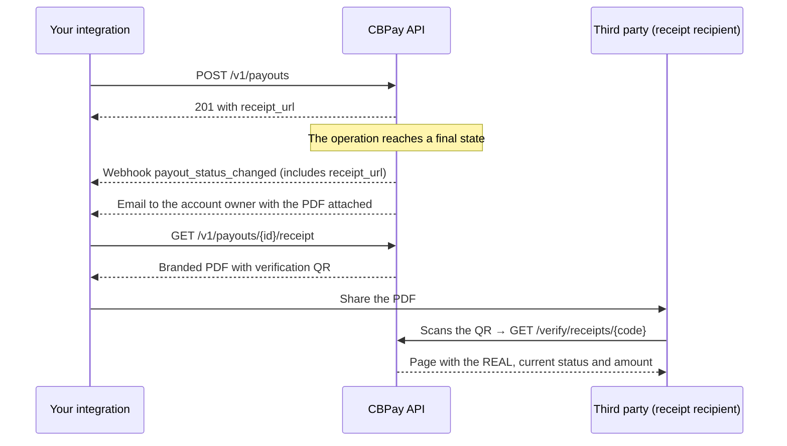

import { EnvUrls } from "/snippets/env-urls.jsx";

<EnvUrls lang="en" />

Every operation on your account — payouts, payins, transfers, crypto
deposits and withdrawals, swaps and card purchases — has a downloadable
**branded PDF receipt**: logo, colors, the operation status and a **signed
verification code with a QR** that anyone can check publicly to confirm the
document is authentic.

There is nothing to build: every response and webhook of an operation
includes its `receipt_url` ready to download, and when the operation reaches
a final state the receipt is also **emailed automatically** to the account
owner (with opt-out).



## Downloading a receipt

Every transactional resource with `GET /{id}` has its `GET .../receipt`.
The PDF defaults to English; pass `?lang=es` or `?lang=zh` for Spanish or Chinese. Payer pages may also persist `cbpay_pay_locale`.

| Operation | Endpoint |
|---|---|
| Payout | `GET /v1/payouts/{payoutID}/receipt` |
| Payin | `GET /v1/payins/{payinID}/receipt` |
| Internal transfer | `GET /v1/transfers/{transferID}/receipt` |
| Crypto withdrawal | `GET /v1/crypto/withdrawals/{withdrawalID}/receipt` |
| Crypto deposit | `GET /v1/crypto/deposits/{depositID}/receipt` |
| Swap | `GET /v1/swaps/{swapID}/receipt` |
| Card purchase | `GET /v1/cards/{cardID}/transactions/{transactionID}/receipt` |
| Banking operation | `GET /v1/banking/operations/{operationID}/receipt` |
| Segregated wallet send | `GET /v1/segregated-wallets/{walletID}/sends/{sendID}/receipt` |
| Segregated wallet deposit | `GET /v1/segregated-wallets/{walletID}/deposits/{depositID}/receipt` |

```bash
curl "https://api.qbank.cl/platform/v1/payouts/9b1deb4d-3b7d-4bad-9bdd-2b0d7b3dcb6d/receipt?lang=en" \
  -H "Authorization: Bearer $CBPAY_TOKEN" \
  -o receipt.pdf
```

The crypto deposit `depositID` comes from `GET /v1/crypto/transactions`
(each deposit's `deposit_id` field, next to its `receipt_url`).

<Note>
Only the operation's owner (or the organization admin) can download the
receipt: a foreign ID returns `404 not_found`. The PDF shows the beneficiary
data exactly as you submitted it.
</Note>

<Note>
A payout receipt includes a **Bank reference** line — the transaction id
assigned by the destination bank — as soon as the bank confirms the
payment. While the payout is in transit the line simply does not appear:
download the receipt again once it is `completed`.
</Note>

## `receipt_url` in responses and webhooks

Never build the URLs by hand: every payout, payin, transfer, withdrawal,
deposit, swap and card transaction response includes `receipt_url`, and the
final-state webhooks (`payout_status_changed`, `payin_credited`,
`transfer_received`, `crypto_deposit_credited`,
`crypto_withdrawal_status_changed`, `card_transaction`) carry it in the
payload too.

```json
{
  "payout_id": "9b1deb4d-3b7d-4bad-9bdd-2b0d7b3dcb6d",
  "status": "completed",
  "local_amount": "800.00",
  "currency": "VES",
  "receipt_url": "https://api.qbank.cl/platform/v1/payouts/9b1deb4d-3b7d-4bad-9bdd-2b0d7b3dcb6d/receipt"
}
```

## Statuses and watermark

The receipt reflects the operation status **at download time**:

| Operation status | Badge | Watermark |
|---|---|---|
| `completed` / `credited` / `confirmed` | Green "Completed" | No |
| `pending` / `processing` | Amber "Processing" | Yes — diagonal "PROCESSING" |
| `failed` / `declined` / `reversed` | Red "Failed" | Yes — diagonal "FAILED" |

<Warning>
A watermarked receipt is **not proof of payment**: the operation has not
completed yet (or it failed). Download it again after the final-state
webhook and it will come out clean.
</Warning>

## Authenticity verification (QR)

Every PDF carries a printed **signed verification code** and its QR. The QR
opens a public URL — no credentials — that answers with the operation's
**real, current** data:

```bash
curl "https://api.qbank.cl/platform/verify/receipts/P9b1deb4d3b7d4bad9bdd2b0d7b3dcb6d16827185..."
```

```json
{
  "valid": true,
  "type": "payout",
  "status": "ok",
  "raw_status": "completed",
  "amount": "800.00 VES",
  "detail": "Venezuela — Pago Móvil",
  "date": "2026-07-11 15:29 UTC",
  "issued_by": "CBPay"
}
```

If the same URL is opened in a **browser** (for example by scanning the QR
with a phone), it redirects to the **public tracking page** — a Wise-style
hosted page with the live status, a step-by-step timeline and the PDF
download. See [Transaction tracking link](/en/guides/tracking).

- The response **never** includes the beneficiary's personal data, accounts
  or addresses: only type, status, amount and date.
- The code is cryptographically signed: a tampered or made-up one answers
  `404` with `"valid": false`.
- The verification shows the **current** data: if someone edits the PDF to
  inflate the amount, the QR exposes it instantly.
- The `verify_url` included in receipt payloads and receipt emails points
  directly to the tracking page, so recipients land on the timeline view.

## Automatic receipt email

When an operation reaches a final state (completed or failed), the account
owner receives an email with the PDF attached and the verification link.
It applies to payouts, payins, sent transfers, crypto deposits and
withdrawals and swaps (card purchases do not email, to avoid flooding your
inbox).

To disable it (or turn it back on) per account:

```bash
curl -X PATCH "https://api.qbank.cl/platform/v1/me" \
  -H "Authorization: Bearer $CBPAY_TOKEN" \
  -H "Content-Type: application/json" \
  -d '{"receipt_emails": false}'
```

## Errors

| HTTP | Code | Cause and solution |
|---|---|---|
| 404 | `not_found` | The ID does not exist or does not belong to your account. Check the ID in the product listing. |
| 429 | `too_many_attempts` | Too many public verifications from your IP. Wait a moment and retry. |
| 500 | `receipt_render_failed` | Transient error rendering the PDF. Retry the download. |

## FAQ

<AccordionGroup>
  <Accordion title="Is the receipt generated once, or can I download it any time?">
    As many times as you want: it is rendered on the fly with the
    operation's current data. That is why a receipt downloaded while
    `pending` comes out watermarked, and the same endpoint returns the clean
    version after the final webhook.
  </Accordion>
  <Accordion title="Can I share the receipt with the beneficiary or an auditor?">
    Yes — that is what it is for. Whoever receives it can scan the QR and
    confirm against the platform that the document is authentic and that
    the status and amount are real, no credentials needed.
  </Accordion>
  <Accordion title="What if someone edits the PDF?">
    The PDF is only a representation: the truth lives in the platform. The
    QR and code carry a cryptographic signature bound to the real
    operation; checking them shows the true amount and status, so any
    tampering is exposed.
  </Accordion>
  <Accordion title="Which languages is the receipt available in?">
    English (`?lang=en`), Spanish (`?lang=es`) and Simplified Chinese
    (`?lang=zh`). The public tracking page auto-detects the visitor's
    browser language.
  </Accordion>
  <Accordion title="Which brand appears on the receipt?">
    The branding of the platform you operate on (the operator's logo,
    colors and contact details). The PDF/Excel statement uses the same
    identity.
  </Accordion>
  <Accordion title="Does the QR expire?">
    No. The code verifies for as long as the operation exists, and it
    always answers its current status.
  </Accordion>
</AccordionGroup>

<CardGroup cols={1}>
  <Card title="Transaction tracking link" icon="location-arrow" href="/en/guides/tracking">
    Every receipt also has a shareable public tracking page with a live status timeline — no sign-in required.
  </Card>
</CardGroup>
