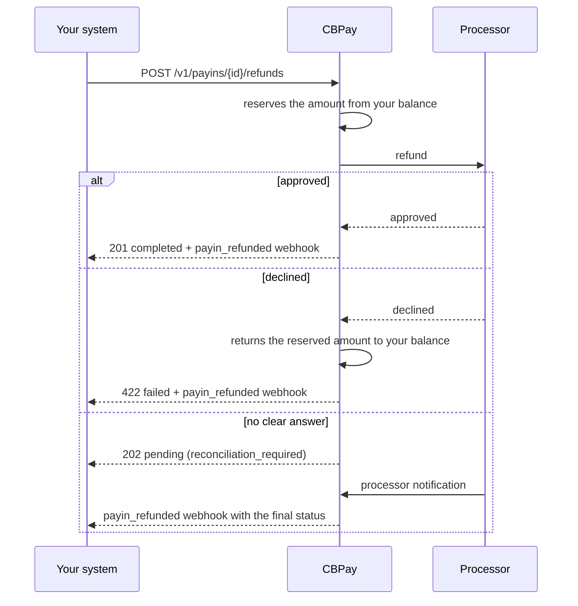

import { EnvUrls } from "/snippets/env-urls.jsx";

<EnvUrls lang="en" />

When you need to return money to a cardholder — a cancelled order, a
duplicate charge, a dispute resolved in the customer's favour — the
refund is an operation **on your account**: the processor returns the
money to the card and we **debit that same value from your balance**,
with its own ledger entry on your statement, its verifiable receipt and
its webhook.

It is the mirror image of a payin: a payin credits, a refund debits.

## What can be refunded

| Requirement | Detail |
|---|---|
| Method | Card payins only (`method: "card"`, including checkout paid by card and MIT charges on a stored card) |
| Status | The payin must be `credited` (the money reached your balance) |
| Balance | You need enough **USDT balance** at the time you request it |
| Amount | Full or partial; several partials on the same payin add up to the cap |

QR, announced transfer, dedicated deposit account and collect payins
**cannot** be refunded through this path (`refund_not_supported`): those
rails have no refund capability at the processor. POS charges are
refunded through the crypto rail with
`POST /v1/pos/charges/{id}/refunds`.

<Warning>
**Fees and the FX margin are not refundable.** We debit the value the
payin brought in (gross), not the net that was credited: if you charged
100.00 USD and we credited 97.10 USDT after a 2.90 fee, refunding the
full amount debits **100.000000 USDT**. You cover the difference, just
like with any card processor.
</Warning>

## Lifecycle



| Status | What it means | What to do |
|---|---|---|
| `pending` | We asked the processor and there is no definitive answer yet. Your balance is already reserved. | Wait for the webhook. Do **not** retry with a different key: you would refund twice. |
| `completed` | The processor approved it. The debit is final on your statement. | Nothing. Final status. |
| `failed` | The processor declined it. The reserved amount went back to your balance, exactly. | Check `failure_reason` and decide whether to retry with a new key. |

<Warning>
A `202 pending` **is not an error**: the refund may already be done. If
you retry with a different `idempotency_key`, the payer receives the
money twice. Always retry with the **same** key (we return the original
object) or wait for the webhook.
</Warning>

## Request a refund

<Steps>
<Step title="Refund the full payin">

Omit `amount` to refund everything that is left to refund:

```bash
curl -X POST https://api.qbank.cl/platform/v1/payins/9f1c2b30-…/refunds \
  -H "Authorization: Bearer <token>" \
  -H "Content-Type: application/json" \
  -d '{
    "reason": "order cancelled by the customer",
    "idempotency_key": "refund-order-8841"
  }'
```

```json
{
  "refund_id": "3a7d51c8-…",
  "payin_id": "9f1c2b30-…",
  "account_id": "c57f05b6-…",
  "kind": "refund",
  "status": "completed",
  "currency": "USD",
  "local_amount": "100.00",
  "usdt_debited": "100.000000",
  "requested_by": "account",
  "reason": "order cancelled by the customer",
  "idempotency_key": "refund-order-8841",
  "receipt_url": "https://api.qbank.cl/platform/v1/payin-refunds/3a7d51c8-…/receipt",
  "created_at": "2026-07-25T14:02:11Z",
  "updated_at": "2026-07-25T14:02:14Z"
}
```

The response is `201` when the processor approves right away, `202` when
it is still in flight and `422` when it declines.

</Step>
<Step title="Or refund part of it">

Send `amount` in the **payin currency** (not in USDT). The debit is
computed proportionally to the value that payin brought in:

```bash
curl -X POST https://api.qbank.cl/platform/v1/payins/9f1c2b30-…/refunds \
  -H "Authorization: Bearer <token>" \
  -H "Content-Type: application/json" \
  -d '{
    "amount": "40.00",
    "reason": "partial refund for a missing item",
    "idempotency_key": "refund-order-8841-partial-1"
  }'
```

```json
{
  "refund_id": "b02e77af-…",
  "payin_id": "9f1c2b30-…",
  "kind": "refund",
  "status": "completed",
  "currency": "USD",
  "local_amount": "40.00",
  "usdt_debited": "40.000000",
  "requested_by": "account",
  "receipt_url": "https://api.qbank.cl/platform/v1/payin-refunds/b02e77af-…/receipt",
  "created_at": "2026-07-25T14:20:03Z",
  "updated_at": "2026-07-25T14:20:06Z"
}
```

You can request several partials on the same payin. When the sum exceeds
what is left to refund, we answer `422 refund_exceeds_payin` without
touching your balance.

</Step>
<Step title="Void instead of refunding (same day)">

If the payin has not settled at the processor yet, `kind: "void"` voids
it instead of creating a refund. The effect on your balance is the same;
for the cardholder, a void usually shows up on their statement sooner.

```bash
curl -X POST https://api.qbank.cl/platform/v1/payins/9f1c2b30-…/refunds \
  -H "Authorization: Bearer <token>" \
  -H "Content-Type: application/json" \
  -d '{ "kind": "void", "idempotency_key": "void-order-8841" }'
```

If the payin can no longer be voided, the processor declines it and you
can request a regular refund.

</Step>
<Step title="Check the status">

```bash
curl https://api.qbank.cl/platform/v1/payin-refunds/3a7d51c8-… \
  -H "Authorization: Bearer <token>"
```

And the history of one payin:

```bash
curl "https://api.qbank.cl/platform/v1/payins/9f1c2b30-…/refunds?from=2026-07-01&to=2026-07-25" \
  -H "Authorization: Bearer <token>"
```

</Step>
</Steps>

## Second factor

`POST /v1/payins/{payinID}/refunds` **takes money out of your account**,
so it requires a second factor when a person originates it with their
session (action `payin_refund`). If your organization has it enabled,
the first call answers `403 otp_required` with a `challenge_id`: verify
the code and repeat the request with the challenge token.

**API keys are exempt** by design, same as everywhere else on the
platform: your backend integrates without friction.

## History and filters

```bash
curl "https://api.qbank.cl/platform/v1/payin-refunds?from=2026-07-01&to=2026-07-25&status=completed&kind=refund&page=1&page_size=50" \
  -H "Authorization: Bearer <token>"
```

```json
{
  "page": 1,
  "page_size": 50,
  "refunds": [{
    "refund_id": "3a7d51c8-…",
    "payin_id": "9f1c2b30-…",
    "kind": "refund",
    "status": "completed",
    "currency": "USD",
    "local_amount": "100.00",
    "usdt_debited": "100.000000",
    "requested_by": "account",
    "receipt_url": "https://api.qbank.cl/platform/v1/payin-refunds/3a7d51c8-…/receipt",
    "created_at": "2026-07-25T14:02:11Z",
    "updated_at": "2026-07-25T14:02:14Z"
  }]
}
```

Filters: `status` (`pending`, `completed`, `failed`), `kind` (`refund`,
`void`, `chargeback`), `payin_id`, `from`/`to` and pagination.

### How much of each payin is refunded

Every payin exposes its refund progress, and you can filter the payin
list by it:

```bash
curl "https://api.qbank.cl/platform/v1/payins?from=2026-07-01&to=2026-07-25&refund_status=partial" \
  -H "Authorization: Bearer <token>"
```

```json
{
  "page": 1,
  "page_size": 50,
  "payins": [{
    "payin_id": "9f1c2b30-…",
    "status": "credited",
    "currency": "USD",
    "local_amount": "100.00",
    "refund_status": "partial",
    "refunded_amount": "40.000000",
    "refunded_local": "40.00"
  }]
}
```

| `refund_status` | Meaning |
|---|---|
| `none` | No refunds |
| `partial` | Partially refunded |
| `full` | Fully refunded (or covered by a chargeback) |

The payin **does not change status**: it stays `credited`. Your
financial history is never rewritten; the refund is a new movement.

## Chargebacks

When the card issuer imposes a **chargeback**, the money is already
gone: it is neither your decision nor ours. In that case:

- We debit the amount from your balance **automatically**, with `kind: "chargeback"`.
- The debit is applied **even if you have no balance**: the account can
  go negative and that debt is netted against your next credits.
- You receive the `payin_refunded` webhook with `kind: "chargeback"`
  and, if the balance went negative, the `balance_after` field.

A chargeback **cannot be requested through the API**: it arrives from
the issuer. All you can do is see it on your statement, your history and
its receipt.

<Note>
What we debit across refunds and chargebacks on the same payin never
exceeds what that payin brought in. If a chargeback arrives after you
already refunded, the debit is capped to whatever was left — or lands at
zero with the reason recorded — so we never charge you the same money
twice.
</Note>

## The `payin_refunded` webhook

Emitted on every final state (`completed` or `failed`) and on
chargebacks. `pending` refunds do not emit: wait for the final state.

```json
{
  "event_type": "payin_refunded",
  "data": {
    "refund_id": "3a7d51c8-…",
    "payin_id": "9f1c2b30-…",
    "account_id": "c57f05b6-…",
    "kind": "refund",
    "status": "completed",
    "currency": "USD",
    "local_amount": "100.00",
    "usdt_debited": "100.000000",
    "receipt_url": "https://api.qbank.cl/platform/v1/payin-refunds/3a7d51c8-…/receipt"
  }
}
```

A decline also carries `failure_reason`; a chargeback that leaves the
account negative carries `balance_after`.

## Receipt

Every refund has its PDF receipt with your organization's branding and a
public verification code:

```bash
curl -L https://api.qbank.cl/platform/v1/payin-refunds/3a7d51c8-…/receipt \
  -H "Authorization: Bearer <token>" -o refund.pdf
```

Anyone can validate that code on the public verification page, without
credentials and without seeing personal data. Details in
[Receipts](/en/guides/receipts).

## Errors

| HTTP | Code | Fix |
|---|---|---|
| 400 | `idempotency_key_required` | Send `idempotency_key` in the body or the `Idempotency-Key` header. |
| 400 | `invalid_payload` | `kind` only accepts `refund` or `void`. |
| 400 | `invalid_amount` | `amount` must be a positive decimal in the payin currency. |
| 402 | `insufficient_funds` | Top up the account and retry **with the same** `idempotency_key`. |
| 404 | `not_found` | The payin (or the refund) does not exist on your account. |
| 409 | `idempotency_conflict` | Another refund with that key is in flight; check its status. |
| 422 | `payin_not_refundable` | The payin is not credited or has no processor reference. |
| 422 | `refund_not_supported` | That rail cannot be refunded (QR, transfer, dedicated account, collect). POS charges are refunded through the crypto rail. |
| 422 | `refund_exceeds_payin` | The requested sum exceeds what is left to refund. |

Full catalogue in [Errors](/en/errors).

## FAQ

<AccordionGroup>
<Accordion title="Do I get the fee back when I refund?">
No. The fee and the FX margin of the original payin are not refundable:
we debit the gross value the payin brought in and the house keeps what
it charged. This is the standard behaviour of the card industry.
</Accordion>

<Accordion title="I requested a refund and got a 202. Should I retry?">
Not with another key. A `202` means the refund may already have been
executed and we do not have confirmation yet. Retrying with a new key
would be a second real refund. Repeat the request with the **same**
`idempotency_key` (we return the same object) or wait for the
`payin_refunded` webhook.
</Accordion>

<Accordion title="Which currency is debited?">
Always **USDT**, the currency the payin was credited in, even if your
account has a different default settlement asset for payins. We never
convert on your behalf: if you do not have enough USDT, we answer
`insufficient_funds`.
</Accordion>

<Accordion title="Can I refund a payin from months ago?">
As long as the payin is `credited` and has refundable value left, yes on
our side. The real limit comes from the processor and the card scheme
rules (usually 180 days); past that window the refund is declined with
`failed` and the reserved amount returns to your balance untouched.
</Accordion>

<Accordion title="What if a chargeback leaves my balance negative?">
The account is allowed to go negative for this reason only. The debt is
settled automatically against your next credits; meanwhile, operations
that move money out still require available balance.
</Accordion>

<Accordion title="Can my organization admin refund too?">
Yes. The admin panel can originate the refund on any account of the
organization; it is audited with the admin who executed it and shows up
in your history with `requested_by: "admin"`.
</Accordion>
</AccordionGroup>
