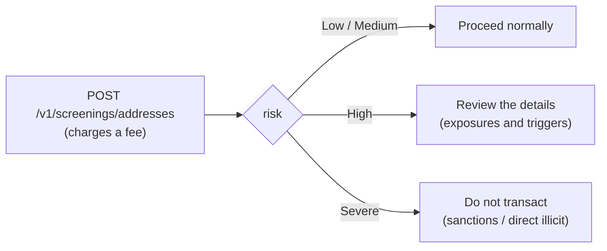

import { EnvUrls } from "/snippets/env-urls.jsx";

<EnvUrls lang="en" />

**Wallet screening** evaluates a blockchain address against global on-chain
intelligence and returns its risk level: whether it belongs to a sanctioned
entity, whether it received funds of illicit origin (ransomware, darknet
markets, thefts) and which categories it is exposed to. Use it before
sending funds to a third-party address, when a customer hands you a new
wallet, or as part of your own compliance program.

It is the on-chain counterpart of [AML screening](/en/guides/aml) (which
evaluates person/company identities): here the subject is the **address**.



<Note>
The `address_screening` service fee (fixed, per scan) is debited on
execution and **automatically refunded** if the screening fails. With a fee
of 0 the service is free for you. It requires your own
[identity verification approved](/en/guides/kyc#your-own-verification-onboarding)
and the `screenings` service enabled on your account.
</Note>

## Run a screening

The assessment is **network-agnostic**: the same address is evaluated
across every supported blockchain at once. The `chain` field is optional
and only labels your record. Since the scan charges a fee, the
`idempotency_key` is **required** — retrying with the same key never
charges twice.

<Steps>
<Step title="Submit the address">

```bash
curl -X POST https://api.qbank.cl/platform/v1/screenings/addresses \
  -H "Authorization: Bearer <token>" \
  -H "Content-Type: application/json" \
  -d '{
    "address": "TN2BBWc9EF8MMB6i1c4HZHXAssTEXstMDo",
    "chain": "tron",
    "idempotency_key": "scan-customer-742-1"
  }'
```

</Step>
<Step title="Read the risk level">

Response `201` — a clean address:

```json
{
  "screening_id": "5f0b1c9a-2f3e-4a7b-9c1d-8e6f5a4b3c2d",
  "account_id": "9b1deb4d-3b7d-4bad-9bdd-2b0d7b3dcb6d",
  "address": "TN2BBWc9EF8MMB6i1c4HZHXAssTEXstMDo",
  "chain": "tron",
  "risk": "Low",
  "screening_fee": "0.500000",
  "fee_asset": "USDT",
  "idempotency_key": "scan-customer-742-1",
  "created_at": "2026-07-12T14:30:00Z",
  "assessment": {
    "address": "TN2BBWc9EF8MMB6i1c4HZHXAssTEXstMDo",
    "risk": "Low",
    "address_identifications": [],
    "exposures": [
      { "category": "exchange", "value_usd": "1250.75" }
    ],
    "triggers": []
  }
}
```

And a sanctioned address:

```json
{
  "screening_id": "7a2c4e6f-8b1d-4c3a-9e5f-1a2b3c4d5e6f",
  "account_id": "9b1deb4d-3b7d-4bad-9bdd-2b0d7b3dcb6d",
  "address": "0x098B716B8Aaf21512996dC57EB0615e2383E2f96",
  "chain": "eth",
  "risk": "Severe",
  "risk_reason": "Identified as Sanctioned Entity",
  "screening_fee": "0.500000",
  "fee_asset": "USDT",
  "idempotency_key": "scan-suspicious-9",
  "created_at": "2026-07-12T14:31:00Z",
  "assessment": {
    "address": "0x098B716B8Aaf21512996dC57EB0615e2383E2f96",
    "risk": "Severe",
    "risk_reason": "Identified as Sanctioned Entity",
    "cluster_name": "OFAC SDN Ronin Bridge Exploiter",
    "cluster_category": "sanctioned entity",
    "address_identifications": [
      {
        "name": "SANCTIONS: OFAC SDN Ronin Bridge Exploiter",
        "category": "sanctioned entity",
        "description": "This specific address 0x098b716b8aaf21512996dc57eb0615e2383e2f96 within this cluster has been identified as belonging to a sanctioned entity."
      }
    ],
    "exposures": [],
    "triggers": []
  }
}
```

</Step>
<Step title="Decide based on the risk">

Apply your policy on `risk` (level table below). The `assessment` object
carries the full evidence for your records: point identifications, USD
exposure per category and the risk rules triggered.

</Step>
</Steps>

Retrying with the same `idempotency_key` returns the original screening
with `idempotency_hit: true` and **does not charge again**:

```json
{
  "screening_id": "5f0b1c9a-2f3e-4a7b-9c1d-8e6f5a4b3c2d",
  "account_id": "9b1deb4d-3b7d-4bad-9bdd-2b0d7b3dcb6d",
  "address": "TN2BBWc9EF8MMB6i1c4HZHXAssTEXstMDo",
  "risk": "Low",
  "screening_fee": "0.500000",
  "fee_asset": "USDT",
  "idempotency_key": "scan-customer-742-1",
  "created_at": "2026-07-12T14:30:00Z",
  "idempotency_hit": true
}
```

## Query the history

Every screening is stored. The list requires `from`/`to` and supports
pagination and a risk filter:

```bash
curl "https://api.qbank.cl/platform/v1/screenings/addresses?from=2026-07-01&to=2026-07-12&risk=severe&page=1&page_size=50" \
  -H "Authorization: Bearer <token>"
```

```json
{
  "page": 1,
  "page_size": 50,
  "screenings": [
    {
      "screening_id": "7a2c4e6f-8b1d-4c3a-9e5f-1a2b3c4d5e6f",
      "account_id": "9b1deb4d-3b7d-4bad-9bdd-2b0d7b3dcb6d",
      "address": "0x098B716B8Aaf21512996dC57EB0615e2383E2f96",
      "chain": "eth",
      "risk": "Severe",
      "risk_reason": "Identified as Sanctioned Entity",
      "screening_fee": "0.500000",
      "fee_asset": "USDT",
      "idempotency_key": "scan-suspicious-9",
      "created_at": "2026-07-12T14:31:00Z"
    }
  ]
}
```

And the detail by id (includes the full `assessment`):

```bash
curl https://api.qbank.cl/platform/v1/screenings/addresses/7a2c4e6f-8b1d-4c3a-9e5f-1a2b3c4d5e6f \
  -H "Authorization: Bearer <token>"
```

## Risk levels

| `risk` | What it means | What to do |
|---|---|---|
| `Low` | No relevant risk signals | Proceed normally |
| `Medium` | Minor exposure to risk categories | Proceed; consider keeping an internal record |
| `High` | Significant exposure to illicit funds | Review `exposures`/`triggers` before transacting |
| `Severe` | Sanctioned entity or direct illicit activity | **Do not transact** with the address |

Levels are **final** (a screening is a snapshot at query time): if you need
to re-assess the same address later, run a fresh scan with a new
`idempotency_key`.

## Automatic protection (free of charge)

Beyond on-demand screening, the platform **protects your crypto operations
automatically and for free**:

- **On-chain withdrawals**: the destination address is assessed before
  signing. If it is severe-risk, the withdrawal is rejected and the held
  amount is **fully refunded** to your balance (you will see the withdrawal
  `failed` with `core_rejected` and its
  `crypto_withdrawal_status_changed` webhook).
- **Incoming deposits**: the sender of every deposit is assessed before
  crediting. A severe-risk sender leaves the deposit **held for compliance
  review** (`crypto_deposit_held` webhook); a high-risk one is credited
  normally with an informational alert (`crypto_deposit_alert` webhook).

<Warning>
A held deposit is NOT lost: your operator's compliance team reviews it and
decides to release it (it is credited with its normal funding fee) or
reject it. If you receive a `crypto_deposit_held`, contact your operator
with the `tx_id`.
</Warning>

## Webhooks

| Event | When |
|---|---|
| `crypto_deposit_held` | An incoming deposit was held due to sender risk |
| `crypto_deposit_alert` | A deposit was credited but the sender shows high risk (informational) |

```json crypto_deposit_held
{
  "account_id": "ae8c…",
  "hold_id": "c1d2e3f4-…",
  "chain": "tron",
  "asset": "usdt",
  "tx_id": "8a5b3c…",
  "risk": "Severe",
  "status": "held"
}
```

Subscribe just like the rest of the events (see [Webhooks](/en/webhooks)).

## Errors

| HTTP | `error` | Cause | Solution |
|---|---|---|---|
| 400 | `idempotency_key_required` | Missing idempotency key | Send `idempotency_key` in the body or the `Idempotency-Key` header |
| 400 | `invalid_payload` | Missing `address` or it is too long | Check the `address` field |
| 400 | `invalid_range` | Missing or invalid `from`/`to` on the list | Use `YYYY-MM-DD` for both |
| 402 | `insufficient_funds` | Insufficient balance for the fee | Fund the account and retry with the SAME key |
| 403 | `verification_required` | Your account has not passed verification yet | Complete your [onboarding](/en/guides/kyc#your-own-verification-onboarding) |
| 403 | `service_disabled` | The `screenings` service is disabled for your account | Contact your operator |
| 404 | `not_found` | The `screening_id` does not exist or is not yours | Check the id |
| 422 | `invalid_address` | The address could not be screened (format) | Check the address format |
| 502 | `screening_unavailable` | Service temporarily unavailable (the fee was refunded) | Retry later with the SAME key |

## FAQ

<AccordionGroup>
<Accordion title="Do I need to specify the address network (chain)?">
No. The assessment covers every supported network at once: an ETH address
is evaluated with all of its known on-chain activity. `chain` is just an
optional label for your own records.
</Accordion>
<Accordion title="Can I scan addresses that are not mine or my customers'?">
Yes. The product accepts any blockchain address — that is exactly the use
case of assessing a third party before transacting with them. Each scan
charges its fee.
</Accordion>
<Accordion title="Does the result expire?">
A screening is a snapshot at query time and is stored as evidence with its
date. An address' risk can change (new sanctions, new activity): for
sensitive decisions, re-assess with a fresh scan.
</Accordion>
<Accordion title="Am I charged for the automatic protection scans?">
No. The automatic screening of withdrawals and deposits is part of the
platform's compliance program and has no cost. Only the on-demand scan
(`POST /v1/screenings/addresses`) charges the `address_screening` fee.
</Accordion>
<Accordion title="What happens if the screening service is down when I withdraw?">
For safety, withdrawals are not signed without assessing the destination:
the withdrawal is rejected with a full refund and you can retry later.
Incoming deposits are NOT held because of a service outage — they are
credited normally.
</Accordion>
</AccordionGroup>
