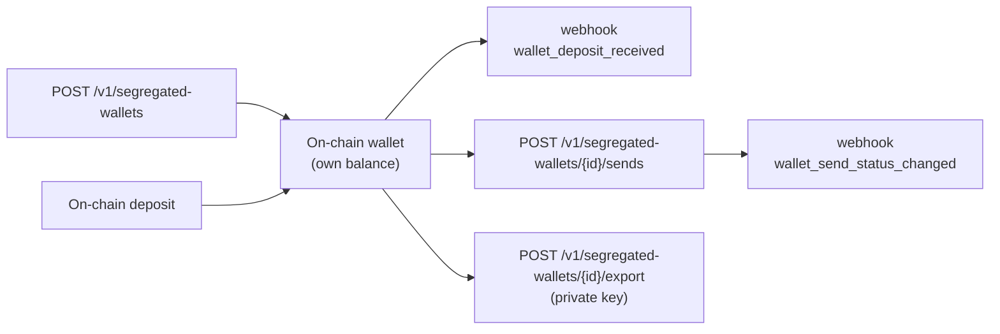

**Segregated wallets** are on-chain wallets **owned by your account**:
their balance **is** the on-chain balance of the address, not a
virtual balance in the CBPay ledger. You can
receive and **send crypto directly from each wallet**, **import** external
wallets with their private key, and **export** the key whenever you want
(shared custody). They are ideal for segregating funds per client, per
project or per business unit, with full control of the keys.

<Note>
Available to persons and companies, with different limits: **company**
accounts can create **unlimited** segregated wallets; **person** accounts
can hold **1 per network+asset pair** (a second one responds
`422 wallet_limit_reached`).
</Note>

<Warning>
Don't confuse them with the [crypto](/en/guides/crypto) product: there,
deposits **credit your USDT/USDC ledger balance** and withdrawals leave from
a hot wallet. With segregated wallets the balance **lives on-chain in the
wallet** and sends leave **from that same wallet**. **Gas** (TRX on TRON, ETH
on Ethereum) is on you: each wallet must hold gas to be able to send.
</Warning>

<Note>
Two products, two routes: deposit wallets live under `/v1/crypto/wallets`
and segregated wallets under `/v1/segregated-wallets`. Every wallet
response carries a `type` discriminator (`deposit` / `segregated`) so you
can always tell them apart.
</Note>



## Supported pairs

| Chain | Asset | Network gas |
|---|---|---|
| `tron` | `usdt` | TRX |
| `eth` | `usdt` | ETH |
| `eth` | `usdc` | ETH |

Native `eth` can be sent from any wallet on an `eth` chain (it is the
network gas).

## 1. Create a wallet

<CodeGroup>

```bash TRON USDT
curl -X POST https://api.qbank.cl/platform/v1/segregated-wallets \
  -H "Authorization: Bearer <token>" \
  -H "Content-Type: application/json" \
  -H "Idempotency-Key: wallet-client-001" \
  -d '{ "chain": "tron", "asset": "usdt", "label": "Acme Client" }'
```

```bash ETH USDC
curl -X POST https://api.qbank.cl/platform/v1/segregated-wallets \
  -H "Authorization: Bearer <token>" \
  -H "Content-Type: application/json" \
  -H "Idempotency-Key: wallet-project-x" \
  -d '{ "chain": "eth", "asset": "usdc", "label": "Project X" }'
```

</CodeGroup>

Response `201`:

```json
{
  "wallet_id": "b7e3a1c2-9f4d-4a8b-8c1e-2d3f4a5b6c7d",
  "type": "segregated",
  "chain": "tron",
  "asset": "USDT",
  "address": "TRmSZRaMAqLEevAdGwo3R43bRBXamWR5bd",
  "label": "Acme Client",
  "origin": "created",
  "custody": "cbpay",
  "exported": false,
  "created_at": "2026-07-11T12:00:00Z"
}
```

The `custody` field reflects the key custody regime:

| `custody` | Meaning |
|---|---|
| `cbpay` | Created by the platform and key never exported: only your API operations can move the balance |
| `client` | Imported, or whose key was exported: you can also sign outside the platform |

Under `client` custody the platform syncs the wallet's complete on-chain
activity — including movements signed outside — and flags them as external,
so your records and statement stay complete.

Under `cbpay` custody the wallet's accounting is **guaranteed**: the
statement shows its lifetime reconciliation (`lifetime_in` −
`lifetime_out` = `computed_balance`) and each send's detail
(`GET /v1/segregated-wallets/{walletID}/sends/{sendID}`) includes `funding_sources`:
the FIFO attribution of which deposits funded that send, with `tx_id`,
origin address and per-tranche amount.

The `Idempotency-Key` (or `idempotency_key` in the body) makes retries safe:
a repeat returns the SAME wallet with `idempotency_hit: true` and **never**
creates a second one. Creating a wallet may charge the `wallet_creation` fee
(fixed; 0 = free, the default).

## 2. Import an external wallet

Bring in a wallet you already control by providing its private key. The key
**travels encrypted in transit to the custodian and is never stored or logged
in the platform**.

```bash
curl -X POST https://api.qbank.cl/platform/v1/segregated-wallets/import \
  -H "Authorization: Bearer <token>" \
  -H "Content-Type: application/json" \
  -H "X-OTP-Token: <otp-token>" \
  -d '{
    "chain": "tron",
    "asset": "usdt",
    "private_key_hex": "<64 hex>",
    "label": "Migrated wallet",
    "idempotency_key": "import-001"
  }'
```

Response `201` with the same shape as create (`origin: "imported"`). Charges
the `wallet_import` fee.

<Warning>
Import and export handle private key material: they **require a signed-in
user session with 2FA** (API keys are not allowed) and OTP. If the
chain/address pair already exists, the core responds `core_rejected`.
</Warning>

## 3. Check balance, deposits and transactions

The balance comes **live from the blockchain** and includes network gas (so
you can see if the wallet is short on TRX/ETH to send).

```bash
# Live on-chain balance (includes gas)
curl https://api.qbank.cl/platform/v1/segregated-wallets/{walletID}/balance \
  -H "Authorization: Bearer <token>"

# Received deposits (with pagination and dates)
curl "https://api.qbank.cl/platform/v1/segregated-wallets/{walletID}/deposits?from=2026-07-01&to=2026-07-11&page=1&page_size=50" \
  -H "Authorization: Bearer <token>"

# Full on-chain activity (deposits + sends)
curl "https://api.qbank.cl/platform/v1/segregated-wallets/{walletID}/transactions?from=2026-07-01&to=2026-07-11" \
  -H "Authorization: Bearer <token>"
```

When a confirmed deposit arrives, CBPay emits the
[`wallet_deposit_received`](/en/webhooks) webhook — **without touching your
ledger**, because the balance is already in the wallet.

## 4. Send crypto from the wallet

The send leaves **from the wallet itself** (real source address), signed by
the custodian. `idempotency_key` is required.

<CodeGroup>

```bash By amount
curl -X POST https://api.qbank.cl/platform/v1/segregated-wallets/{walletID}/sends \
  -H "Authorization: Bearer <token>" \
  -H "Content-Type: application/json" \
  -H "X-OTP-Token: <otp-token>" \
  -d '{
    "asset": "usdt",
    "to_address": "TXYZ...destination",
    "amount": "25.50",
    "idempotency_key": "send-2026-07-11-a"
  }'
```

```bash By minimal units
curl -X POST https://api.qbank.cl/platform/v1/segregated-wallets/{walletID}/sends \
  -H "Authorization: Bearer <token>" \
  -H "Content-Type: application/json" \
  -H "X-OTP-Token: <otp-token>" \
  -d '{
    "asset": "usdt",
    "to_address": "TXYZ...destination",
    "amount_raw": "25500000",
    "idempotency_key": "send-2026-07-11-b"
  }'
```

</CodeGroup>

Response `202` (the send is asynchronous; the final state arrives by
webhook):

```json
{
  "send_id": "9c8b7a6d-5e4f-3a2b-1c0d-9e8f7a6b5c4d",
  "wallet_id": "b7e3a1c2-9f4d-4a8b-8c1e-2d3f4a5b6c7d",
  "chain": "tron",
  "asset": "USDT",
  "to_address": "TXYZ...destination",
  "amount_raw": "25500000",
  "fee": "0.000000",
  "fee_asset": "USDT",
  "status": "processing",
  "tx_id": "b1946ac92492d2347c6235b4d2611184...",
  "idempotency_key": "send-2026-07-11-a",
  "created_at": "2026-07-11T12:05:00Z"
}
```

Before sending, CBPay verifies the wallet holds enough **gas**; if not, it
responds `422 insufficient_gas` with the required minimum — charging nothing.
The send may charge the `wallet_send` fee (from your account's settlement
balance in the ledger; **the wallet's on-chain funds are never touched**),
refunded if the custodian rejects the send.

A replay with the same `idempotency_key` → `200` with the original send and
`idempotency_hit: true` — **never re-sent**. On an ambiguous failure
(timeout/network) the send stays `pending`: retry with the **same** key; the
dedupe guarantees it is not duplicated.

Check the history:

```bash
curl "https://api.qbank.cl/platform/v1/segregated-wallets/{walletID}/sends?from=2026-07-01&to=2026-07-11" \
  -H "Authorization: Bearer <token>"

curl https://api.qbank.cl/platform/v1/segregated-wallets/{walletID}/sends/{sendID} \
  -H "Authorization: Bearer <token>"
```

## 5. Export the private key

Retrieve the wallet's private key. It is **shared custody**: after export,
the wallet **remains fully operational** in CBPay (it can receive and send),
but you also control the funds with the key.

```bash
curl -X POST https://api.qbank.cl/platform/v1/segregated-wallets/{walletID}/export \
  -H "Authorization: Bearer <token>" \
  -H "X-OTP-Token: <otp-token>" \
  -H "Content-Type: application/json" \
  -d '{ "reason": "Custody migration to the client cold wallet" }'
```

Response `200`:

```json
{
  "wallet": {
    "wallet_id": "b7e3a1c2-9f4d-4a8b-8c1e-2d3f4a5b6c7d",
    "type": "segregated",
    "chain": "tron",
    "asset": "USDT",
    "address": "TRmSZRaMAqLEevAdGwo3R43bRBXamWR5bd",
    "exported": true,
    "exported_at": "2026-07-11T12:10:00Z"
  },
  "private_key_hex": "<64 hex>",
  "export": {
    "custody": "shared",
    "warning": "anyone holding this private key controls the wallet funds; the wallet remains operational in the platform"
  }
}
```

<Warning>
This is the most sensitive operation of the product. It requires a
**signed-in user session with 2FA** (no API keys), a **verified account**,
and a `reason` of at least 20 characters kept in the audit trail. Each export
fires the `wallet_key_exported` webhook to your organization. Charges the
`wallet_export` fee. Whoever holds the private key controls the funds: store
it securely.
</Warning>

## 6. Auto-forward

Automatically forward everything that arrives at the wallet to an address of
yours (useful to consolidate into cold storage). Since it redirects future
funds, it requires verification and OTP.

```bash
# Read the current rule
curl https://api.qbank.cl/platform/v1/segregated-wallets/{walletID}/auto-forward \
  -H "Authorization: Bearer <token>"

# Enable / update
curl -X POST https://api.qbank.cl/platform/v1/segregated-wallets/{walletID}/auto-forward \
  -H "Authorization: Bearer <token>" \
  -H "X-OTP-Token: <otp-token>" \
  -H "Content-Type: application/json" \
  -d '{ "linked_address": "TColdWallet...destination", "enabled": true }'

# Disable
curl -X POST https://api.qbank.cl/platform/v1/segregated-wallets/{walletID}/auto-forward \
  -H "Authorization: Bearer <token>" \
  -H "X-OTP-Token: <otp-token>" \
  -H "Content-Type: application/json" \
  -d '{ "enabled": false }'
```

## Send statuses

| `status` | Type | Meaning / what to do |
|---|---|---|
| `processing` | Transient | Broadcast on-chain; wait for the webhook confirmation |
| `pending` | Transient | Ambiguous dispatch failure; retry with the **same** `idempotency_key` |
| `completed` | Final | Confirmed on-chain |
| `failed` | Final | Rejected; no funds moved |

## Product errors

| HTTP | `error` | Fix |
|---|---|---|
| 422 | `wallet_limit_reached` | A person account already holds its segregated wallet for that network+asset pair (companies have no limit) |
| 403 | `human_session_required` | Import and export require a signed-in user session with 2FA (no API keys) |
| 403 | `verification_required` | Complete your account onboarding ([verification](/en/guides/kyc)) |
| 403 | `service_disabled` | The `wallets` service is not enabled; contact your operator |
| 400 | `idempotency_key_required` | Send `idempotency_key` (body or `Idempotency-Key` header) |
| 400 | `invalid_asset` / `invalid_chain` | Check the supported chain/asset pair |
| 422 | `insufficient_gas` | The wallet has no gas (TRX/ETH) for the network fee; fund it and retry |
| 409 | `idempotency_conflict` | Another request with the same key is still in flight; retry with the same key |
| 503 | `export_unavailable` | Key export is not enabled in this environment |

## Related webhooks

| Event | When |
|---|---|
| `wallet_deposit_received` | An on-chain deposit arrived at a segregated wallet (does not touch the ledger) |
| `wallet_send_status_changed` | A send from the wallet changed status |
| `wallet_key_exported` | A wallet's private key was exported (security alert) |
| `wallet_external_movement` | The sync detected an on-chain movement that did not go through the platform (expected under `client` custody) |
| `wallet_key_compromise_suspected` | **Critical alarm**: funds left a `cbpay`-custody wallet without going through the platform — treat the key as compromised and contact support immediately |

Example payloads are on the [webhooks page](/en/webhooks).

## FAQ

<AccordionGroup>
<Accordion title="How do they differ from the crypto product wallets?">
In the [crypto](/en/guides/crypto) product, deposits credit your USDT/USDC
virtual ledger balance and withdrawals leave from a hot wallet — CBPay
custodies and consolidates the funds. With segregated wallets the balance
lives on-chain in each wallet, sends leave from that same address, and you
can export the key. None of its balance goes through the ledger or gets
swept to treasury.
</Accordion>
<Accordion title="Why did my send fail with insufficient_gas?">
Sending on-chain requires gas IN the wallet (TRX on TRON, ETH on Ethereum).
Unlike the crypto product, here the gas is on you. Fund the wallet address
with a bit of the native coin and retry. `GET .../balance` shows the
available gas and the required minimum.
</Accordion>
<Accordion title="Does the wallet stop working after exporting the key?">
No. It is shared custody: the wallet stays operational in CBPay (receives and
sends normally) and is flagged `exported`. You now also hold the key, so
keep it safe.
</Accordion>
<Accordion title="Can treasury move my segregated wallets' balance?">
Never. These wallets are created exempt from the treasury sweep: their
on-chain balance is exclusively yours. It only moves when you send or when
you configure auto-forward.
</Accordion>
<Accordion title="How many wallets can I create?">
**Company** accounts have no limit: this is typical for segregating per
client, project or business unit, using `label` to tell them apart.
**Person** accounts can hold 1 segregated wallet per network+asset pair (a
second one responds `422 wallet_limit_reached`).
</Accordion>
</AccordionGroup>
