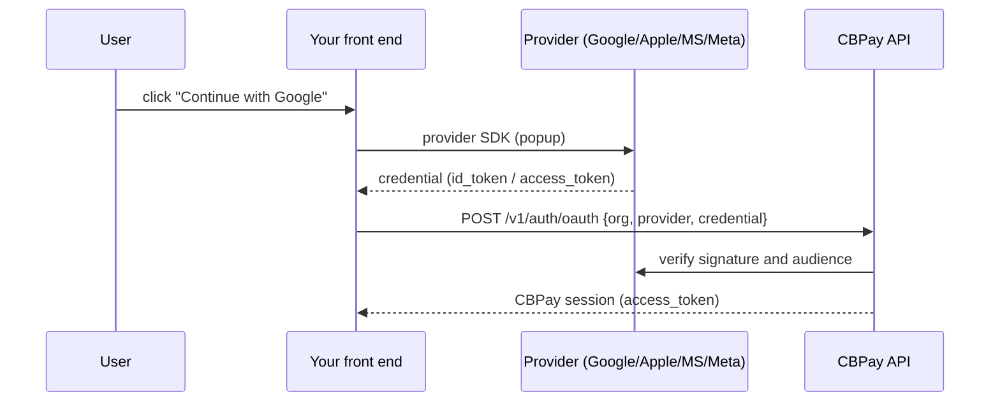
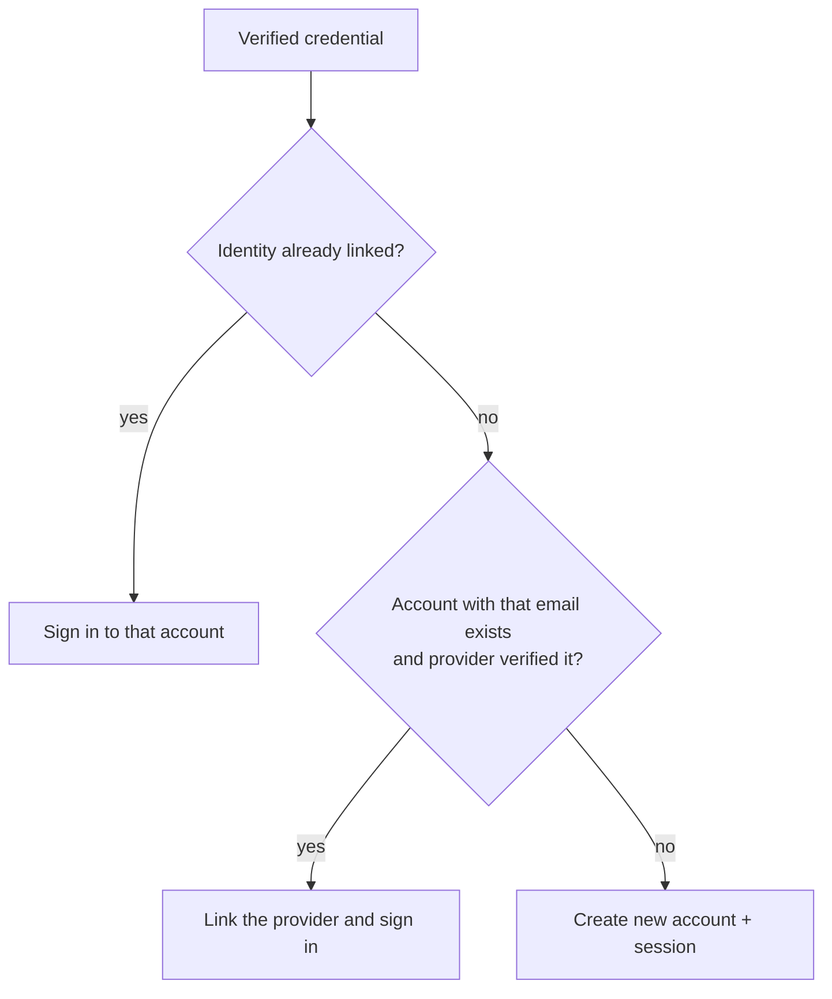

Your users can sign up and sign in with **Google, Apple, Microsoft or
Facebook** — no passwords to create or remember. CBPay uses the **token
exchange** model: the "Continue with…" button lives in your front end, the
user approves at the provider, your front end receives a credential and
passes it to the API; CBPay **verifies it cryptographically** and returns
the session.



<Note>
Social login is enabled by your operator (organization), and **each
organization uses its own** Google/Apple/Microsoft/Meta apps, so the user
sees YOUR brand on the consent screen. Check which providers are active
with `GET /v1/auth/oauth/providers`.
</Note>

## 1. Discover the enabled providers

To render the right buttons, your front end asks which providers are active
and with which `client_id`:

```bash
curl "https://api.qbank.cl/platform/v1/auth/oauth/providers?org=cbpay"
```

```json
{
  "providers": [
    { "provider": "google", "client_id": "1234567890-abc.apps.googleusercontent.com" },
    { "provider": "apple", "client_id": "com.yourcompany.cbpay.web" }
  ]
}
```

It is a public endpoint (no token needed): the `client_id` is not secret.

## 2. Get the credential in your front end

Each provider hands you a credential through its own SDK. Minimal examples:

<Tabs>
<Tab title="Google">

With [Google Identity Services](https://developers.google.com/identity/gsi/web):

```html
<script src="https://accounts.google.com/gsi/client" async></script>
<div id="g_id_onload"
     data-client_id="YOUR_CLIENT_ID"
     data-callback="onGoogle"></div>
<div class="g_id_signin"></div>
<script>
function onGoogle(response) {
  // response.credential is the id_token (JWT) you send to CBPay
  fetch("https://api.qbank.cl/platform/v1/auth/oauth", {
    method: "POST",
    headers: { "Content-Type": "application/json" },
    body: JSON.stringify({
      org: "cbpay", provider: "google", credential: response.credential
    })
  });
}
</script>
```

</Tab>
<Tab title="Apple">

With [Sign in with Apple JS](https://developer.apple.com/documentation/sign_in_with_apple/sign_in_with_apple_js):
the response object carries `authorization.id_token`, which is what you send
as `credential`.

```js
const data = await AppleID.auth.signIn();
await fetch("https://api.qbank.cl/platform/v1/auth/oauth", {
  method: "POST",
  headers: { "Content-Type": "application/json" },
  body: JSON.stringify({
    org: "cbpay", provider: "apple", credential: data.authorization.id_token
  })
});
```

Apple returns the user's name **only the first time**; store it in your
front end if you need it. The email may be a private relay alias
(`...@privaterelay.appleid.com`) — it is valid and stable.

</Tab>
<Tab title="Microsoft">

With [MSAL.js](https://learn.microsoft.com/entra/identity-platform/msal-overview):
after `loginPopup`, the result's `idToken` is the credential.

```js
const result = await msalInstance.loginPopup({ scopes: ["openid", "email", "profile"] });
await fetch("https://api.qbank.cl/platform/v1/auth/oauth", {
  method: "POST",
  headers: { "Content-Type": "application/json" },
  body: JSON.stringify({
    org: "cbpay", provider: "microsoft", credential: result.idToken
  })
});
```

</Tab>
<Tab title="Meta (Facebook)">

With the [Facebook Login SDK](https://developers.facebook.com/docs/facebook-login/web):
Facebook is not OIDC, so you send the session's **access_token**.

```js
FB.login(function(response) {
  if (response.authResponse) {
    fetch("https://api.qbank.cl/platform/v1/auth/oauth", {
      method: "POST",
      headers: { "Content-Type": "application/json" },
      body: JSON.stringify({
        org: "cbpay", provider: "facebook",
        credential: response.authResponse.accessToken
      })
    });
  }
}, { scope: "email" });
```

</Tab>
</Tabs>

## 3. Exchange the credential for a session

```bash
curl -X POST https://api.qbank.cl/platform/v1/auth/oauth \
  -H "Content-Type: application/json" \
  -d '{
    "org": "cbpay",
    "provider": "google",
    "credential": "eyJhbGciOiJSUzI1Ni…",
    "type": "person"
  }'
```

**New user** → the account is created and returns `201`:

```json
{
  "account": { "id": "9b1deb4d-…", "type": "person", "email": "ana@gmail.com", "display_name": "Ana" },
  "access_token": "eyJhbGciOiJIUzI1Ni…",
  "expires_at": "2026-07-09T21:00:00Z",
  "created": true
}
```

**Existing user** → signs in and returns `200` with `access_token`,
`account_id` and `role` (same as password login).

The `type` field (`person` | `company`, default `person`) is only used when
creating the account; it is ignored if the account already exists.

### How create vs. sign-in is decided



## 4. Social login and 2FA

If the account has **OTP enabled on login**
([security and 2FA](/en/security-2fa)), social login respects that second
step: instead of the session, `POST /v1/auth/oauth` returns
`otp_required: true` + `pending_token`, and you complete it with
`POST /v1/auth/login/otp` just like password login.

## 5. Link and unlink providers

A signed-in user can manage their sign-in methods:

```bash
# List linked providers
curl https://api.qbank.cl/platform/v1/me/identities \
  -H "Authorization: Bearer <token>"

# Link another provider (with a fresh credential from that provider)
curl -X POST https://api.qbank.cl/platform/v1/me/identities \
  -H "Authorization: Bearer <token>" \
  -H "Content-Type: application/json" \
  -d '{ "provider": "apple", "credential": "eyJhbGci…" }'

# Unlink
curl -X DELETE https://api.qbank.cl/platform/v1/me/identities/apple \
  -H "Authorization: Bearer <token>"
```

You cannot unlink your **only** sign-in method: if the account has no
password and that provider is the only one linked, the API responds
`409 last_login_method` (set a password or link another provider first).

## Errors

| HTTP | `error` | What it means |
|---|---|---|
| 400 | `invalid_provider` | Provider outside `google/apple/microsoft/facebook` |
| 400 | `provider_not_configured` | Your organization has not enabled that provider |
| 401 | `invalid_credential` | The credential is invalid, expired or from another app |
| 409 | `email_conflict` | An account with that email already exists; sign in with your current method and link the provider from your session |
| 409 | `identity_taken` | That provider is already linked to another account |
| 409 | `last_login_method` | You cannot unlink your only sign-in method |

## FAQ

<AccordionGroup>
  <Accordion title="Do I need to handle redirects or OAuth callbacks?">
    No. The consent flow happens in your front end with the provider SDK;
    you only send the resulting credential to CBPay. There are no callback
    pages or server-side state.
  </Accordion>
  <Accordion title="Can a user have both a password AND social login?">
    Yes. They can register with email/password and later link Google, or
    the other way around. All methods point to the same account as long as
    the email matches and is verified.
  </Accordion>
  <Accordion title="What if the provider does not return a verified email?">
    No automatic linking by email (prevents someone from claiming another
    person's email). A standalone account tied to that identity is created;
    the user can add email/password later.
  </Accordion>
  <Accordion title="Is the provider credential usable as a CBPay token?">
    No. The provider credential is used once to verify you; every following
    call uses the CBPay `access_token`.
  </Accordion>
</AccordionGroup>
