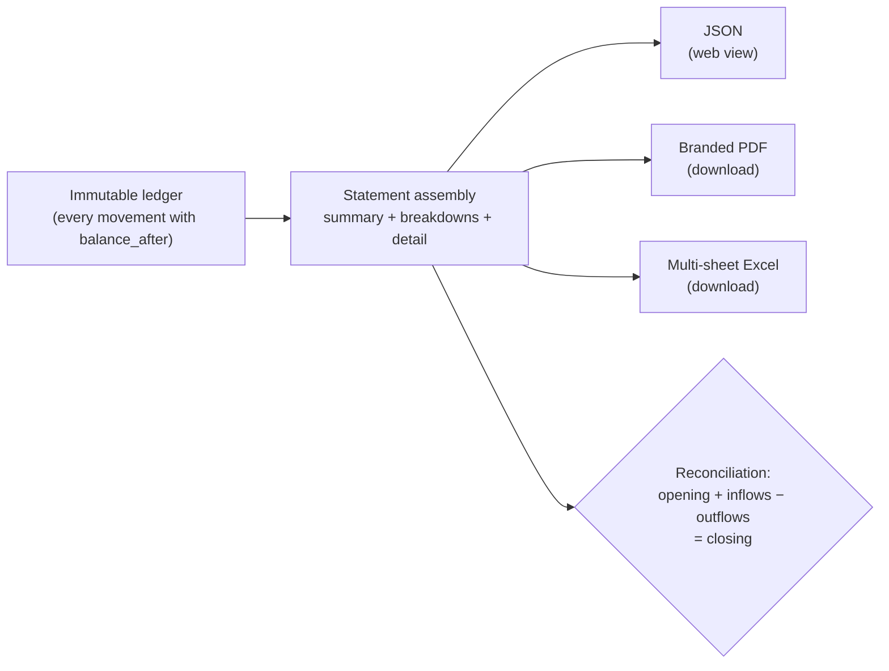

The statement consolidates **every** movement of an account in a period —
payouts, payins, crypto deposits and withdrawals, internal transfers and
service charges — into one auditable document. A single endpoint serves it
in three formats:

| Format | What for | How to request it |
|---|---|---|
| `json` (default) | Rendering the statement in your web/app | `format=json` |
| `pdf` | Formal document with CBPay branding | `format=pdf` |
| `xlsx` | Excel with per-section sheets, filters and numeric cells | `format=xlsx` |



## Requesting the statement

```bash
# JSON for your front end
curl "https://api.qbank.cl/platform/v1/reports/statement?from=2026-01-01&to=2026-07-07" \
  -H "Authorization: Bearer <token>"

# Downloadable PDF (CBPay branding)
curl -OJ "https://api.qbank.cl/platform/v1/reports/statement?from=2026-01-01&to=2026-07-07&format=pdf" \
  -H "Authorization: Bearer <token>"

# Downloadable Excel
curl -OJ "https://api.qbank.cl/platform/v1/reports/statement?from=2026-01-01&to=2026-07-07&format=xlsx" \
  -H "Authorization: Bearer <token>"
```

- `from` / `to`: `YYYY-MM-DD` dates, inclusive, in UTC. Maximum range:
  400 days.
- `lang=es|en`: language of the PDF/Excel (default `es`).
- Files arrive with `Content-Disposition: attachment` and the name
  `cartola_cbpay_<account>_<from>_<to>.pdf/.xlsx`.

## What it contains

```json
{
  "account": { "account_id": "…", "display_name": "Example Company SpA", "type": "company" },
  "period": { "from": "2026-01-01", "to": "2026-07-07", "timezone": "UTC" },
  "generated_at": "2026-07-07T15:00:00Z",
  "summary": {
    "opening_balance": "0.000000",
    "total_in": "985633.540000",
    "total_out": "38099.870000",
    "net_change": "947533.670000",
    "closing_balance": "947533.670000",
    "balanced": true,
    "counts": { "payouts": 51, "payins": 12, "crypto_deposits": 18, "transfers": 4, "movements": 771 },
    "fees_by_service": { "payout": "15.300000", "funding": "897.550000" },
    "total_fees": "912.850000"
  },
  "breakdown": {
    "by_product": [ { "product": "payouts", "count": 51, "usdt_in": "0.000000", "usdt_out": "38099.870000", "fees": "15.300000" } ],
    "by_country": [ { "flow": "payouts", "country": "BO", "currency": "BOB", "count": 14, "local_amount": "28748.58", "usdt_amount": "2902.210000" } ],
    "by_currency": [ { "currency": "BOB", "payout_local": "28748.58", "payin_local": "700.00" } ],
    "by_month": [ { "month": "2026-01", "usdt_in": "985633.540000", "usdt_out": "35100.000000" } ]
  },
  "payouts": [ { "created_at": "…", "payout_id": "…", "country": "BO", "beneficiary": "Juan Quispe", "local_amount": "90.00", "fx_rate": "6.91", "usdt_amount": "13.024600", "fee": "0.300000", "total_debit": "13.324600", "status": "completed" } ],
  "payins": [ { "…": "…" } ],
  "assets": [
    {
      "asset": "GOLD",
      "opening_balance": "0.000000",
      "total_in": "12.500000",
      "total_out": "2.000000",
      "net_change": "10.500000",
      "closing_balance": "10.500000",
      "balanced": true,
      "movements": [ { "type": "adjustment", "amount": "12.500000", "balance_after": "12.500000", "created_at": "…" } ]
    }
  ],
  "crypto_deposits": [ { "chain": "tron", "asset": "USDT", "tx_id": "…", "usdt_gross": "100.000000", "fee": "1.000000", "usdt_credited": "99.000000", "balance_after": "99.000000" } ],
  "crypto_withdrawals": [ { "…": "…" } ],
  "transfers": [ { "direction": "sent", "counterparty": "Ana Perez", "asset": "USDT", "amount": "25.000000" } ],
  "service_charges": [ { "type": "banking_fee", "service": "banking_customer", "amount": "-0.500000", "balance_after": "98.500000" } ],
  "movements": [ { "type": "funding", "amount": "99.000000", "balance_after": "99.000000", "created_at": "…" } ]
}
```

Sections:

1. **`summary`** — opening balance, inflows, outflows, closing balance,
   fees by service and the `balanced` flag of the **USDT balance** (the
   operating currency).
2. **`assets`** — one reconciled section per non-USDT balance with activity
   or balance (USDC, BTC, GOLD): opening/closing balance, inflows,
   outflows, its own `balanced` flag and its movements, in each currency's
   precision. Empty if you only operate USDT.
3. **`breakdown`** — by product, by country (payouts and payins with local
   amount and USDT), by fiat currency and by month.
4. **Per-product detail** — payouts (beneficiary, rate and debit), payins
   (per mode), crypto (with `tx_id` and its `asset`), transfers (with
   counterparty and `asset`) and service charges (with refunds).
5. **`movements`** — the raw USDT ledger: every movement with its
   `balance_after`. This is the section an auditor uses to tie everything
   out (other currencies' movements live inside their `assets` section).

## How to reconcile it (for your accountant)

The statement satisfies an exact accounting identity, with no rounding:

```
opening_balance + total_in − total_out = closing_balance
```

- `balanced: true` confirms the identity holds against the ledger — both
  on the USDT summary and inside each `assets` section (every currency
  reconciles separately; amounts of different currencies are never summed).
- Every `movements` row carries the resulting balance (`balance_after`):
  you can follow the balance line by line from opening to closing.
- The closing balance of one period matches the opening of the next.
- Fees are never hidden inside amounts: every operation shows gross, fee
  and net separately, and `fees_by_service` totals them.
- In the Excel file, the **Movements** sheet uses real numeric cells: you
  can sum/pivot without cleaning anything.

## For the administrator (org admin)

The CBPay team can generate any of its accounts' statements:

```bash
curl "https://api.qbank.cl/platform/v1/accounts/{accountID}/reports/statement?from=2026-01-01&to=2026-07-07&format=pdf" \
  -H "X-API-Key: <pk_org_admin>"
```

## Errors

| HTTP | `error` | Cause |
|---|---|---|
| 400 | `invalid_range` | Missing/invalid dates, `to` before `from`, or range over 400 days |
| 400 | `invalid_format` | `format` other than `json`, `pdf`, `xlsx` |
| 404 | `not_found` | The account does not exist (org admin only) |
