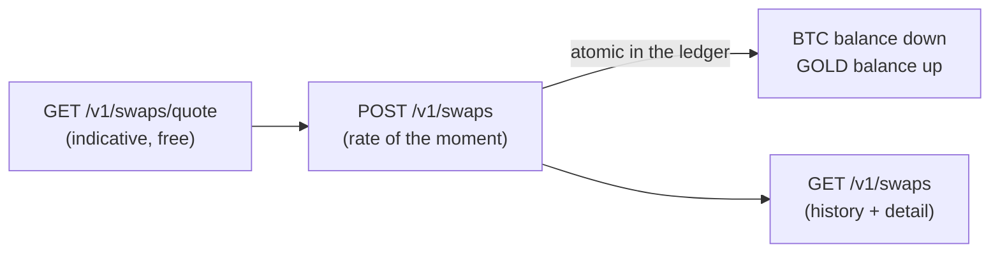

**Swaps** convert balance between your four currencies — `USDT`, `USDC`,
`BTC` and `GOLD` — **synchronously and instantly**, without the money ever
leaving your account. Any pair works (including direct `BTC` ↔ `GOLD`).
The rate you see in the quote is the rate you execute at: **no separate
fees** — quoted = received.



## 1. Quote (optional, free)

```bash
curl "https://api.qbank.cl/platform/v1/swaps/quote?from_asset=USDT&to_asset=BTC&amount=1000" \
  -H "Authorization: Bearer <token>"
```

```json
{
  "from_asset": "USDT",
  "to_asset": "BTC",
  "from_amount": "1000.000000",
  "to_amount": "0.01568419",
  "rate": "0.00001568",
  "indicative": true
}
```

The quote is **indicative**: the swap executes at the rate of the `POST`
moment (BTC and GOLD prices move). Stablecoin pairs (`USDT` ↔ `USDC`) are
stable.

## 2. Execute the swap

<CodeGroup>

```bash USDT → BTC
curl -X POST https://api.qbank.cl/platform/v1/swaps \
  -H "Authorization: Bearer <token>" \
  -H "Content-Type: application/json" \
  -d '{
    "from_asset": "USDT",
    "to_asset": "BTC",
    "amount": "1000",
    "idempotency_key": "swap-2026-07-10-a"
  }'
```

```bash BTC → GOLD (direct)
curl -X POST https://api.qbank.cl/platform/v1/swaps \
  -H "Authorization: Bearer <token>" \
  -H "Content-Type: application/json" \
  -d '{
    "from_asset": "BTC",
    "to_asset": "GOLD",
    "amount": "0.01",
    "idempotency_key": "swap-2026-07-10-b"
  }'
```

```bash USDT → USDC
curl -X POST https://api.qbank.cl/platform/v1/swaps \
  -H "Authorization: Bearer <token>" \
  -H "Content-Type: application/json" \
  -d '{
    "from_asset": "USDT",
    "to_asset": "USDC",
    "amount": "500",
    "idempotency_key": "swap-2026-07-10-c"
  }'
```

</CodeGroup>

`amount` is in the **source** currency (`from_asset`), with up to its
decimals (6 for USDT/USDC/GOLD, 8 for BTC).

`201` response — the swap is synchronous, your balance changes instantly:

```json
{
  "swap_id": "8a1b2c3d-4e5f-6a7b-8c9d-0e1f2a3b4c5d",
  "from_asset": "USDT",
  "to_asset": "BTC",
  "from_amount": "1000.000000",
  "to_amount": "0.01568419",
  "rate": "0.00001568",
  "status": "completed",
  "idempotency_key": "swap-2026-07-10-a",
  "created_at": "2026-07-10T15:00:00Z"
}
```

Replaying with the same `idempotency_key` → `200` with the original swap
and `idempotency_hit: true` — **never re-executed**.

## 3. Query and history

```bash
# History with pagination, dates and currency filter (matches both legs)
curl "https://api.qbank.cl/platform/v1/swaps?from=2026-07-01&to=2026-07-10&asset=BTC&page=1&page_size=50" \
  -H "Authorization: Bearer <token>"

# Detail
curl https://api.qbank.cl/platform/v1/swaps/{swap_id} \
  -H "Authorization: Bearer <token>"
```

In your movements (`GET /v1/movements`) and in the
[statement](/en/guides/statement) the swap shows as `swap_out` in the
source currency and `swap_in` in the destination, each reconciling in its
own section.

## Rules and limits

- **Same account**: the money never leaves your account — it only changes
  currency. That is why no OTP is required.
- **Any pair** between `USDT`, `USDC`, `BTC` and `GOLD` (source ≠
  destination).
- **Execution rate of the moment**: BTC and GOLD use the live execution
  price; if it is unavailable or stale the swap is rejected with
  `503 pricing_unavailable` (it never executes on an old price).
- **Volatile-currency limits** (BTC/GOLD, shared with payouts and card
  purchases): per-operation cap and 24h rolling volume cap per account
  (`GET /v1/settlement` shows yours). USDT ↔ USDC has no limit.
- Requires your approved [identity verification](/en/guides/kyc) and the
  `swaps` service enabled.

## Errors

| HTTP | `error` | Cause | Solution |
|---|---|---|---|
| 400 | `invalid_asset` | Currency outside USDT/USDC/BTC/GOLD | Check `from_asset`/`to_asset` |
| 400 | `invalid_pair` | Source and destination are the same currency | Pick different currencies |
| 400 | `invalid_amount` | Invalid amount or too many decimals | Respect the source currency's decimals |
| 400 | `amount_too_small` | The amount does not reach the destination's minimum unit | Increase the amount |
| 400 | `swap_asset_disabled` | One of the currencies is disabled for your organization | Contact your operator |
| 400 | `idempotency_key_required` | Missing idempotency key | Send it in the body or header |
| 402 | `insufficient_funds` | Not enough balance in the source currency | Fund or lower the amount |
| 403 | `verification_required` / `service_disabled` | Unverified account or service off | Complete onboarding / contact your operator |
| 422 | `settlement_limit_exceeded` | The swap exceeds the per-operation cap for volatile currencies | Split the operation |
| 422 | `settlement_daily_limit_exceeded` | You exceeded your 24h volume for volatile currencies | Retry later |
| 503 | `pricing_unavailable` | Execution price unavailable or stale | Retry in a few minutes |

## FAQ

<AccordionGroup>
<Accordion title="Why does the swap rate differ from the market price I see elsewhere?">
The quoted rate is your account's **execution** rate: it includes the cost
of providing instant, guaranteed conversion (immediate liquidity, no
slippage, without leaving your account). Same philosophy as payout and
payin rates: what is quoted is exactly what you receive, with no surprise
fees afterwards.
</Accordion>
<Accordion title="Is the quote guaranteed?">
No — it is indicative. BTC and GOLD move, so execution uses the price at
the POST moment. Between stablecoins (USDT ↔ USDC) the difference is
negligible. For the final figure, check the `to_amount` in the swap
response (already credited).
</Accordion>
<Accordion title="Can I undo a swap?">
There is no undo: an executed swap is final (your balance already changed).
You can swap back any time, at that moment's rate.
</Accordion>
<Accordion title="Why was my BTC→GOLD swap rejected by limit if it was my first swap of the day?">
Volatile-currency limits are shared across swaps, payouts paid from
BTC/GOLD and card purchases from BTC/GOLD — they all count against the same
24h rolling volume of your account. Check your caps at
`GET /v1/settlement`.
</Accordion>
<Accordion title="What do I gain by holding GOLD or BTC balance?">
GOLD represents grams of fine gold and BTC bitcoin: price exposure without
leaving the ecosystem. You can pay payouts, fees and card purchases straight
from those balances (multi-asset settlement), and swap back to USDT/USDC
whenever you want.
</Accordion>
</AccordionGroup>
