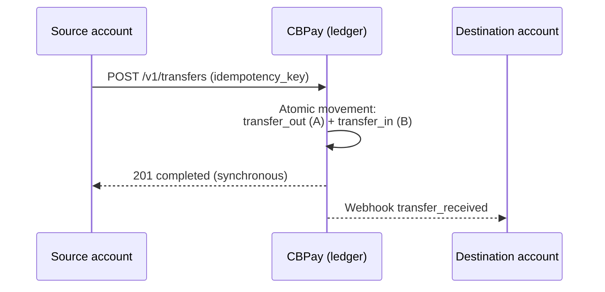

import { EnvUrls } from "/snippets/env-urls.jsx";

<EnvUrls lang="en" />

Internal transfers move balance between two **CBPay accounts**, atomically
in the ledger and **always free of charge** — the money never leaves the
ecosystem. They work with all four currencies (`USDT`, `USDC`, `BTC`,
`GOLD`) and always **between balances of the same currency**: the `asset`
you send is the `asset` the destination receives, with no conversion.



They work between **any combination of accounts**:

| From | To | Fee |
|---|---|---|
| Person | Person | 0 |
| Person | Company | 0 |
| Company | Person | 0 |
| Company | Company | 0 |

## Create a transfer

The destination is identified by `to_account_id`, `to_email`,
**`to_phone`** (verified phone) or **`to_contact_id`** (a
[contact](/en/guides/contacts) from your book):

<CodeGroup>

```bash By phone (verified)
curl -X POST https://api.qbank.cl/platform/v1/transfers \
  -H "Authorization: Bearer <token>" \
  -H "Content-Type: application/json" \
  -d '{
    "to_phone": "+56987654321",
    "amount": "25.000000",
    "description": "Lunch",
    "idempotency_key": "lunch-2026-07-10-a"
  }'
```

```bash By contact
curl -X POST https://api.qbank.cl/platform/v1/transfers \
  -H "Authorization: Bearer <token>" \
  -H "Content-Type: application/json" \
  -d '{
    "to_contact_id": "3f8a1b2c-…",
    "amount": "10.000000",
    "idempotency_key": "t-991"
  }'
```

```bash By email (person → person)
curl -X POST https://api.qbank.cl/platform/v1/transfers \
  -H "Authorization: Bearer <token>" \
  -H "Content-Type: application/json" \
  -d '{
    "to_email": "carlos@example.com",
    "amount": "25.000000",
    "description": "Expense split",
    "idempotency_key": "split-2026-07-06-a"
  }'
```

```bash By account_id (person → company)
curl -X POST https://api.qbank.cl/platform/v1/transfers \
  -H "Authorization: Bearer <token>" \
  -H "Content-Type: application/json" \
  -d '{
    "to_account_id": "ae8cf540-22a9-414d-82cc-8ac04732be4f",
    "amount": "120.500000",
    "description": "Monthly service payment",
    "idempotency_key": "serv-2026-07-a"
  }'
```

```bash Company → person (payroll)
curl -X POST https://api.qbank.cl/platform/v1/transfers \
  -H "Authorization: Bearer <company token>" \
  -H "Content-Type: application/json" \
  -d '{
    "to_email": "employee@example.com",
    "amount": "850.000000",
    "description": "July salary",
    "idempotency_key": "payroll-2026-07-emp01"
  }'
```

```bash In another currency (GOLD, grams of gold)
curl -X POST https://api.qbank.cl/platform/v1/transfers \
  -H "Authorization: Bearer <token>" \
  -H "Content-Type: application/json" \
  -d '{
    "to_email": "carlos@example.com",
    "asset": "GOLD",
    "amount": "2.500000",
    "description": "Gold gift",
    "idempotency_key": "gold-2026-07-09-a"
  }'
```

</CodeGroup>

The request shape is identical for every combination (person or company,
in any direction) — only the calling credential changes. `asset` is
optional and defaults to `USDT`; it accepts `USDT`, `USDC`, `BTC` or
`GOLD`, and the destination receives **in that same currency**.

Response `201` — the transfer is **synchronous and immediate**:

```json
{
  "transfer_id": "77b1…",
  "from_account_id": "…",
  "to_account_id": "…",
  "asset": "USDT",
  "amount": "25.000000",
  "description": "Expense split",
  "status": "completed",
  "created_at": "2026-07-06T20:10:00Z"
}
```

Replay with the same `idempotency_key` — `200` with the original transfer:

```json
{
  "transfer_id": "77b1…",
  "amount": "25.000000",
  "status": "completed",
  "idempotency_hit": true
}
```

The recipient can be notified via the `transfer_received` webhook, and both
sides see the movement in their history (`transfer_out` / `transfer_in`).

<Note>
Every transfer saves the recipient as a [contact](/en/guides/contacts)
automatically (send `"save_contact": false` to skip it). For safety,
`to_phone` only resolves accounts with an **OTP-verified** phone; if more
than one account shares the number it answers `422 recipient_ambiguous`.
</Note>

## Querying transfers

List your account's transfers (sent and received), with pagination and date
filters:

```bash
curl "https://api.qbank.cl/platform/v1/transfers?from=2026-07-01&to=2026-07-07&page_size=50" \
  -H "Authorization: Bearer <token>"
```

Or fetch one by ID (visible only to the two parties):

```bash
curl https://api.qbank.cl/platform/v1/transfers/77b1… \
  -H "Authorization: Bearer <token>"
```

Each row carries `direction` (`sent` or `received`) from your perspective.

## Rules

- Only between **active** CBPay accounts; internal system accounts cannot
  receive.
- Always the **same currency on both sides**: there is no conversion
  between balances (`USDT`→`USDT`, `GOLD`→`GOLD`, …).
- You cannot transfer to yourself (`400 self_transfer`).
- Requires `idempotency_key` (body or `Idempotency-Key` header); replays
  return `200` with `idempotency_hit: true`.
- `amount` accepts up to the currency's decimals: 6 for `USDT`/`USDC`/
  `GOLD`, 8 for `BTC`.

## Errors

| HTTP | `error` | Cause |
|---|---|---|
| 400 | `recipient_required` | Missing `to_account_id`, `to_email`, `to_phone` and `to_contact_id` |
| 400 | `invalid_amount` | Invalid amount, too many decimals or unsupported `asset` |
| 400 | `invalid_phone` | `to_phone` could not be normalized to E.164 |
| 400 | `self_transfer` | Source and destination are the same account |
| 402 | `insufficient_funds` | Not enough available balance in that currency |
| 404 | `recipient_not_found` | The email/ID does not match a CBPay account, or no verified phone matches |
| 422 | `recipient_ambiguous` | More than one account shares that phone (use `to_account_id` or `to_email`) |
| 422 | `contact_not_linked` | The contact has no linked CBPay account |
| 422 | `recipient_unavailable` | The destination account is blocked/closed |
## FAQ

<AccordionGroup>
<Accordion title="Do internal transfers cost anything?">
No — transfers between accounts of your organization are free and
instantaneous.
</Accordion>
<Accordion title="Can I transfer between different assets?">
No — both sides move the **same** asset (USDT to USDT, USDC to USDC…). To
change asset, convert first with [Swaps](/en/guides/swaps).
</Accordion>
<Accordion title="Can a transfer be reversed?">
No — transfers are instantaneous and irreversible. If you sent to the wrong
account, coordinate the return with the counterparty.
</Accordion>
<Accordion title="How does sending by phone work?">
`to_phone` only resolves **verified** phone numbers of your organization.
An unverified or unknown number answers 404; if more than one account
matches you get `recipient_ambiguous` (422) — use `to_alias` or the account
ID instead.
</Accordion>
<Accordion title="What are to_alias and to_qr_token?">
Alternative recipients: the account's immutable alias and its profile QR
token (`GET /v1/me/qr`). All resolve within your organization only.
</Accordion>
<Accordion title="What is checkout_token for?">
It settles a [checkout link](/en/guides/checkout) by internal transfer: the
destination is forced to the link's account and the amount must cover the
quoted due (`checkout_amount_mismatch`, 422, otherwise).
</Accordion>
</AccordionGroup>
