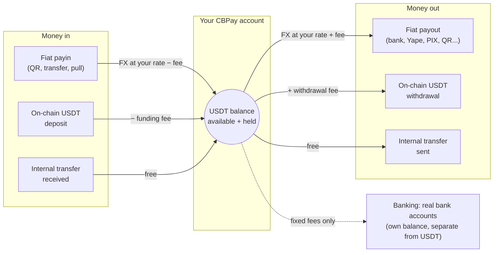

CBPay is a multi-currency payment platform for Latin America. Every
account holds **four independent virtual balances** — `USDT` (the operating
currency), `USDC`, `BTC` and `GOLD` (grams of gold) — and operates against
them:

<CardGroup cols={2}>
  <Card title="Fiat payouts" icon="money-bill-transfer" href="/en/guides/payouts">
    Send money to local bank accounts in Chile, Peru, Mexico, Venezuela,
    Bolivia, Brazil, Paraguay, Ecuador and Argentina — including paying
    scanned PIX QRs.
  </Card>
  <Card title="Fiat payins" icon="qrcode" href="/en/guides/payins">
    Collect in local currency (QR, transfers, dedicated accounts, pull
    collections) and get credited automatically.
  </Card>
  <Card title="Checkout" icon="cart-shopping" href="/en/guides/checkout">
    A universal payment link: your payer picks their country, method or
    crypto on a hosted page and you settle in the asset you choose.
  </Card>
  <Card title="Cards & subscriptions" icon="credit-card" href="/en/guides/cards">
    Issue cards that spend from any balance in real time, accept card
    payments, [save cards on file and schedule recurring
    charges](/en/guides/stored-cards-subscriptions).
  </Card>
  <Card title="QR POS" icon="store" href="/en/guides/qr-pos">
    Register verified merchants and generate amount-bound crypto QR
    charges for physical points of sale.
  </Card>
  <Card title="On-chain crypto" icon="link" href="/en/guides/crypto">
    Fund and withdraw USDT/USDC over TRON and Ethereum, and native BTC
    over Bitcoin — every account is born with its deposit wallets.
  </Card>
  <Card title="Swaps" icon="arrows-rotate" href="/en/guides/swaps">
    Convert between your USDT, USDC, BTC and GOLD balances at your
    account's rate, instantly.
  </Card>
  <Card title="Internal transfers" icon="arrows-left-right" href="/en/guides/transfers">
    Move balance to any other CBPay account — by ID, alias, QR or verified
    phone — instantly and free of charge.
  </Card>
  <Card title="Banking" icon="building-columns" href="/en/guides/banking">
    Real bank accounts in your name: receive, hold and send money over
    international rails (SEPA, SWIFT, ACH), including third-party
    accounts.
  </Card>
  <Card title="Segregated wallets" icon="wallet" href="/en/guides/segregated-wallets">
    Dedicated on-chain wallets with their own balance, isolated from the
    ledger — create, import and export them.
  </Card>
  <Card title="KYC/KYB & compliance" icon="user-check" href="/en/guides/kyc">
    Person and company verification, plus standalone
    [AML screening](/en/guides/aml) and
    [crypto address screening](/en/guides/screenings).
  </Card>
  <Card title="Statement & analytics" icon="file-invoice" href="/en/guides/statement">
    Full statement per period (JSON, PDF, Excel) with guaranteed
    accounting balance, [receipts](/en/guides/receipts) per operation and
    an [analytics summary](/en/guides/analytics) ready to chart.
  </Card>
</CardGroup>

Every event reaches your **signed webhooks** ([guide](/en/webhooks)).

## How it works

Fiat operations revolve around the USDT balance — money comes in on one
side, converts, and goes out the other. The USDC, BTC and GOLD balances
move via [swaps](/en/guides/swaps), on-chain deposits and withdrawals,
internal transfers, payout settlement (`settlement_asset`) and automatic
payin conversion (`default_payin_asset`):

1. CBPay gives you access: email/password
   registration or a direct API key.
2. You fund your account: with a fiat payin or an on-chain USDT deposit.
3. You operate: payouts, transfers, withdrawals — everything debits and
   credits your USDT balance with FX conversion at execution time.
4. You stay informed: every movement lands in an immutable history
   (`GET /v1/movements`) and events reach your webhooks.

## Base URLs and environments

CBPay runs two fully isolated environments with the exact same API:

| Environment | Base URL | API keys | Money |
|---|---|---|---|
| **Test** | `https://cryptobank.qbank.cl/platform` | `pk_test_...` | Simulated — every rail served by a deterministic simulator |
| **Live** | `https://api.qbank.cl/platform` | `pk_...` | Real and irreversible |

All paths in this documentation are relative to those base URLs. Build
against **test** first and go live by swapping the URL and the key —
details, magic values and the go-live checklist in
[environments and testing](/en/environment-testing).

<Note>
Amounts are always **decimal strings** (e.g. `"10.500000"`), never floating
point numbers. Each currency uses its own precision: 6 decimals for
`USDT`/`USDC`/`GOLD` and 8 for `BTC`.
</Note>

## Next steps

<Steps>
  <Step title="Create your account and token">
    Follow the [quickstart](/en/quickstart) to register and make your first
    call.
  </Step>
  <Step title="Understand the money model">
    Read [money model](/en/concepts/money-model) and
    [fees](/en/concepts/fees).
  </Step>
  <Step title="Integrate your first product">
    Start with [payouts](/en/guides/payouts) or [payins](/en/guides/payins).
  </Step>
</Steps>
