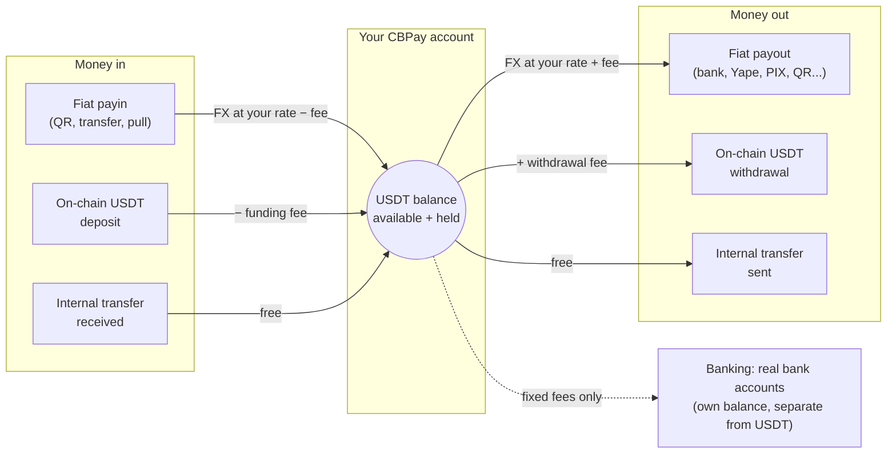

CBPay is a multi-currency payment platform for Latin America. Every account
holds a virtual **USDT** balance and operates against it:

<CardGroup cols={2}>
  <Card title="Fiat payouts" icon="money-bill-transfer" href="/en/guides/payouts">
    Send money to local bank accounts in Chile, Peru, Mexico, Venezuela,
    Bolivia and Paraguay, debited from your USDT balance.
  </Card>
  <Card title="Fiat payins" icon="qrcode" href="/en/guides/payins">
    Collect in local currency (QR and transfers) and get credited
    automatically in USDT.
  </Card>
  <Card title="Internal transfers" icon="arrows-left-right" href="/en/guides/transfers">
    Move balance to any other CBPay account, instantly and
    free of charge.
  </Card>
  <Card title="On-chain crypto" icon="link" href="/en/guides/crypto">
    Fund with USDT over TRON or Ethereum and withdraw on-chain to any
    address.
  </Card>
  <Card title="Banking" icon="building-columns" href="/en/guides/banking">
    Real bank accounts in your name: receive, hold and send money over
    international rails (SEPA, SWIFT, ACH).
  </Card>
  <Card title="KYC/KYB" icon="user-check" href="/en/guides/kyc">
    Person and company verification with AML screening, rescreening and
    continuous monitoring.
  </Card>
</CardGroup>

Every event reaches your **signed webhooks** ([guide](/en/webhooks)).

## How it works

Everything revolves around a single USDT balance per account — money comes
in on one side, converts, and goes out the other:



1. CBPay gives you access: email/password
   registration or a direct API key.
2. You fund your account: with a fiat payin or an on-chain USDT deposit.
3. You operate: payouts, transfers, withdrawals — everything debits and
   credits your USDT balance with FX conversion at execution time.
4. You stay informed: every movement lands in an immutable history
   (`GET /v1/movements`) and events reach your webhooks.

## Base URL

```
https://api.qbank.cl/platform
```

All paths in this documentation are relative to that base URL.

<Note>
Amounts are always **decimal strings** (e.g. `"10.500000"`), never floating
point numbers. Balances use 6 decimal places (USDT precision).
</Note>

## Next steps

<Steps>
  <Step title="Create your account and token">
    Follow the [quickstart](/en/quickstart) to register and make your first
    call.
  </Step>
  <Step title="Understand the money model">
    Read [money model](/en/concepts/money-model) and
    [fees](/en/concepts/fees).
  </Step>
  <Step title="Integrate your first product">
    Start with [payouts](/en/guides/payouts) or [payins](/en/guides/payins).
  </Step>
</Steps>
