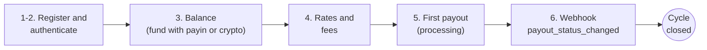

This is the full path of a first integration: register → balance → rates →
payout → webhook. By the end you will have closed the entire cycle:



Before you start, the data you will need everywhere:

| Item | Value |
|---|---|
| **Base URL** | `https://api.qbank.cl/platform` |
| **Authentication** | `Authorization: Bearer <token>` header (or `X-API-Key`) |
| **Organization slug** | `cbpay` (for register and login) |
| **Balance currencies** | 4 independent balances: USDT (operating), USDC, BTC and GOLD — amounts always as strings (`"52.618258"`) |
| **Environment** | Direct production — no sandbox; test with small amounts |

<Info>
If CBPay already created your account and handed you a `pk_...` API key,
skip to step 3. Common questions are answered upfront in the
[FAQ](/en/faq).
</Info>

<Steps>

<Step title="Register">

Create your account (person or company — same endpoint, `type` changes):

<CodeGroup>

```bash Person
curl -X POST https://api.qbank.cl/platform/v1/auth/register \
  -H "Content-Type: application/json" \
  -d '{
    "org": "cbpay",
    "type": "person",
    "email": "ana@example.com",
    "password": "a-secure-password",
    "display_name": "Ana Perez",
    "country": "CL"
  }'
```

```bash Company
curl -X POST https://api.qbank.cl/platform/v1/auth/register \
  -H "Content-Type: application/json" \
  -d '{
    "org": "cbpay",
    "type": "company",
    "email": "legal@andina.cl",
    "password": "a-secure-password",
    "display_name": "Comercial Andina SpA",
    "tax_id": "76.543.210-8",
    "country": "CL"
  }'
```

</CodeGroup>

The response includes your `access_token` (24-hour session):

```json
{
  "account": { "id": "…", "type": "person", "kyc_status": "none", "…": "…" },
  "access_token": "eyJhbGciOiJIUzI1NiIs…",
  "expires_at": "2026-07-08T00:00:00Z"
}
```

</Step>

<Step title="Authenticate every call">

Send the token in the `Authorization` header:

```bash
curl https://api.qbank.cl/platform/v1/me \
  -H "Authorization: Bearer <access_token>"
```

For server-to-server integrations, issue a **permanent API key** with
`POST /v1/api-keys` — shown exactly once. More in
[authentication](/en/authentication).

</Step>

<Step title="Check your balance">

```bash
curl https://api.qbank.cl/platform/v1/balances \
  -H "Authorization: Bearer <token>"
```

```json
{
  "account_id": "…",
  "balances": [
    { "asset": "USDT", "available": "0.000000", "held": "0.000000" },
    { "asset": "USDC", "available": "0.000000", "held": "0.000000" },
    { "asset": "BTC", "available": "0.00000000", "held": "0.00000000" },
    { "asset": "GOLD", "available": "0.000000", "held": "0.000000" }
  ]
}
```

To operate you need funds: create a [payin](/en/guides/payins) or deposit
USDT on-chain via [crypto funding](/en/guides/crypto).

</Step>

<Step title="Check rates and fees">

Before a payout, check the current FX rate and your effective fees:

```bash
curl https://api.qbank.cl/platform/v1/rates \
  -H "Authorization: Bearer <token>"
```

```json
{
  "base": "USD",
  "rates": {
    "chile": { "currency": "CLP", "rate": "950.25" },
    "mexico": { "currency": "MXN", "rate": "17.50" },
    "bolivia": { "currency": "BOB", "rate": "6.91" }
  },
  "fees": [
    { "service": "payout", "country": "CL", "percent": "0", "fixed": "0.50" }
  ],
  "updated_at": "2026-07-07T12:00:00Z"
}
```

The rates already include your FX margin, so you can estimate the cost
before creating: `usdt_amount ≈ local_amount / rate` (rounded up) and
`total_debit = usdt_amount + fixed`.

</Step>

<Step title="Create your first payout">

```bash
curl -X POST https://api.qbank.cl/platform/v1/payouts \
  -H "Authorization: Bearer <token>" \
  -H "Content-Type: application/json" \
  -d '{
    "country": "CL",
    "currency": "CLP",
    "method": "bank_transfer",
    "amount": "50000",
    "beneficiary": {
      "name": "Juan Soto",
      "rut": "12345678-9",
      "bank_code": "012",
      "account_type": "checking",
      "account_number": "001122334455"
    },
    "description": "Supplier payment",
    "idempotency_key": "my-payment-0001"
  }'
```

Response `202 Accepted` — the payout is `processing` and the final state
arrives via [webhook](/en/webhooks) (`payout_status_changed`):

```json
{
  "payout_id": "…",
  "status": "processing",
  "local_amount": "50000",
  "fx_rate": "950.25",
  "usdt_amount": "52.618258",
  "fee": "0.500000",
  "total_debit": "53.118258"
}
```

<Warning>
`beneficiary` fields depend on the country and method. Check
`GET /v1/payouts/methods` and `GET /v1/payouts/banks?country=CL` for each
corridor's requirements — the full reference lives in
the [country examples in the payouts guide](/en/guides/payouts#examples-by-country).
</Warning>

</Step>

<Step title="Close the cycle: subscribe to the webhook">

The payout's final state arrives via push. Subscribe your HTTPS endpoint
(in development use a
[tunnel](/en/environment-testing#testing-webhooks-in-local-development)):

```bash
curl -X POST https://api.qbank.cl/platform/v1/webhooks/subscriptions \
  -H "Authorization: Bearer <token>" \
  -H "Content-Type: application/json" \
  -d '{
    "event_type": "payout_status_changed",
    "callback_url": "https://yourapp.com/webhooks/cbpay",
    "secret": "a-long-random-secret"
  }'
```

Minutes later you will receive the closure of the step-5 payout:

```json
{
  "payout_id": "…",
  "status": "completed",
  "local_amount": "50000",
  "usdt_amount": "52.618258",
  "total_debit": "53.118258",
  "status_code": ""
}
```

**Always** verify the delivery's HMAC signature (`X-Webhook-Signature`) —
recipe with code in [webhooks](/en/webhooks). Had the payout failed,
`status: failed` arrives with the full refund already applied.

</Step>

</Steps>

## What's next?

<CardGroup cols={2}>
  <Card title="Integration flows" icon="route" href="/en/flows">
    Funding, dispersing, collecting, reconciling and banking — the five
    E2E flows with diagrams.
  </Card>
  <Card title="Money model" icon="coins" href="/en/concepts/money-model">
    Debits, holds, refunds and the immutable ledger.
  </Card>
  <Card title="Environment and testing" icon="flask" href="/en/environment-testing">
    How to test safely and the go-live checklist.
  </Card>
  <Card title="FAQ" icon="circle-question" href="/en/faq">
    Real integrator questions, answered — and the full API Reference lives
    in its own tab, with an interactive playground.
  </Card>
</CardGroup>
