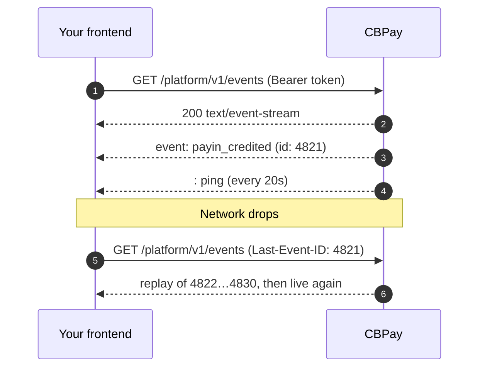

Webhooks push events to **your server**. The real-time event stream pushes the
same events to **your frontend**: one long-lived `GET` that receives every
event as it happens, with guaranteed replay if the connection drops.

Use the stream to keep a dashboard live (balances, payins landing, payouts
settling, card authorizations, KYT alerts for admins). Use
[webhooks](/en/webhooks) for anything that must survive your browser being
closed — the two channels carry the **same events with the same payloads** and
the same `event_id`, so you can consume both without writing two mappings.



## Open the stream

The endpoint requires the same `Authorization: Bearer` credential as the rest
of the API, so the browser's native `EventSource` (which cannot send headers)
is **not** an option. Use `fetch` with a streaming reader:

<CodeGroup>

```js Browser (fetch)
const res = await fetch("https://api.qbank.cl/platform/v1/events", {
  headers: {
    Authorization: `Bearer ${token}`,
    Accept: "text/event-stream",
  },
});

const reader = res.body.pipeThrough(new TextDecoderStream()).getReader();
let buffer = "";
let lastEventId = null;

while (true) {
  const { value, done } = await reader.read();
  if (done) break;
  buffer += value;

  // SSE frames are separated by a blank line
  let sep;
  while ((sep = buffer.indexOf("\n\n")) !== -1) {
    const frame = buffer.slice(0, sep);
    buffer = buffer.slice(sep + 2);
    if (frame.startsWith(":")) continue; // heartbeat

    const id = frame.match(/^id: (.+)$/m)?.[1];
    const type = frame.match(/^event: (.+)$/m)?.[1];
    const data = frame.match(/^data: (.+)$/m)?.[1];
    if (id) lastEventId = id; // remember it: this is your replay cursor
    handle(type, data ? JSON.parse(data) : null);
  }
}
```

```bash curl
curl -N https://api.qbank.cl/platform/v1/events \
  -H "Authorization: Bearer <token>" \
  -H "Accept: text/event-stream"
```

</CodeGroup>

```text Response
: cbpay event stream

retry: 3000

id: 4821
event: payin_credited
data: {"event_id":"9f1c…","type":"payin_credited","account_id":"ae8c…","created_at":"2026-07-25T18:42:07Z","cursor":"4821","data":{"payin_id":"7d2f…","usdt_credited":"99.700000","status":"credited"}}

: ping
```

Every event frame carries three lines:

| Line | Meaning |
|---|---|
| `id:` | Monotonic cursor of the log. Store the last one you processed — it is your `Last-Event-ID`. |
| `event:` | The event type (`payin_credited`, `payout_status_changed`, …), identical to the webhook catalog. |
| `data:` | JSON envelope: `event_id`, `type`, `account_id`, `created_at`, `cursor` and `data` (the **same payload** the webhook delivers). |

## Reconnect without gaps

If the connection drops, reconnect sending the last cursor you processed. The
server replays everything you missed **from the log** before switching back to
live, so a flaky network never loses an event.

<CodeGroup>

```js Header
await fetch("https://api.qbank.cl/platform/v1/events", {
  headers: {
    Authorization: `Bearer ${token}`,
    "Last-Event-ID": lastEventId, // e.g. "4821"
  },
});
```

```bash Query param
curl -N "https://api.qbank.cl/platform/v1/events?last_event_id=4821" \
  -H "Authorization: Bearer <token>"
```

</CodeGroup>

<Note>
The replay is capped at **1,000 events**. If you were offline long enough to
miss more, the stream emits a `replay_truncated` control event and you should
reconcile with `?snapshot=true` or with
[`GET /v1/events/history`](#queryable-history) instead of assuming continuity.
</Note>

## Initial snapshot

Opening with `?snapshot=true` sends the **current state** first, then the
deltas. It removes the classic race of "read the REST endpoints, then
subscribe, and lose whatever happened in between": the cursor is taken after
the subscription is open, so nothing falls through the crack.

```bash
curl -N "https://api.qbank.cl/platform/v1/events?snapshot=true" \
  -H "Authorization: Bearer <token>"
```

```text
id: 4820
event: snapshot
data: {"generated_at":"2026-07-25T18:42:00Z","scope":{"org_admin":false,"account_id":"ae8c…","types":[]},"balances":[{"asset":"USDT","available":"1025.000000","held":"0.000000"}]}

id: 4821
event: payin_credited
data: {…}
```

The snapshot is **absolute state**, never deltas — applying it twice is
harmless. It contains `balances` for an account credential (same fields as
[`GET /v1/balances`](/en/guides/analytics)) and, for an organization admin,
the operational `health` counters.

## Filter by event type

`?types=` narrows what you receive. It can only **restrict** what your
credential already sees, never widen it. An unknown type is rejected with
`400 invalid_event_type` instead of silently returning nothing.

```bash
curl -N "https://api.qbank.cl/platform/v1/events?types=payin_credited,payout_status_changed" \
  -H "Authorization: Bearer <token>"
```

## Scope: account vs organization admin

| Credential | What the stream delivers |
|---|---|
| Account (`pk_…` or member session) | Only that account's events. |
| Organization admin with `ops:read` | Every account in the organization, plus org-wide events (KYT alerts, corridor health, approvals). Optional `?account_id=` filters within the organization. |

An account never sees another account's events, and never sees the org-wide
compliance surface. The stream never delivers a field that the same credential
could not already read over REST.

## Control events

Besides your business events, the stream emits protocol events. They carry no
`id:` (except `snapshot`), so they never move your replay cursor.

| `event:` | When | What to do |
|---|---|---|
| `snapshot` | You opened with `?snapshot=true` | Replace local state with the payload. |
| `reconnect` | Max lifetime reached (30 min) or the server buffer overflowed | Reconnect with `Last-Event-ID`. |
| `unauthorized` | Session revoked, key disabled or account blocked | Authenticate again. |
| `replay_truncated` | More than 1,000 missed events | Reconcile with `?snapshot=true` or the history endpoint. |
| `error` | Replay or snapshot could not be built | Retry; fall back to REST. |

A `: ping` comment arrives every 20 seconds to keep proxies from closing an
idle connection — ignore lines starting with `:`.

## Limits

| Limit | Value | Why |
|---|---|---|
| Concurrent streams per account | 5 | One tab per device is plenty; leaked connections are a bug. |
| Concurrent streams per organization | 50 | Protects the shared hub. |
| Connection lifetime | 30 min | Ends with `reconnect`; the cursor makes it seamless. |
| Heartbeat | every 20 s | Stays under the proxy read timeout. |
| Credential revalidation | every 60 s | A revoked session stops receiving events immediately. |
| Stream openings per IP | 600 per hour | Absorbs legitimate reconnects; stops a broken retry loop. |

Exceeding the concurrency limit returns `429 too_many_streams`. Exceeding the
openings quota returns `429 rate_limited` — that one counts *attempts*, so a
client reconnecting in a tight loop burns it even with no stream open. Always
honour the `retry:` hint (3 s) plus exponential backoff.

## Queryable history

The same log that feeds the stream is readable over REST — useful for
auditing, for a "what did I miss" view, or when the replay was truncated.

```bash
curl "https://api.qbank.cl/platform/v1/events/history?from=2026-07-01&to=2026-07-25&event_type=payin_credited&page=1&page_size=50" \
  -H "Authorization: Bearer <token>"
```

```json
{
  "page": 1,
  "page_size": 50,
  "total": 3,
  "events": [
    {
      "event_id": "9f1c0d3a-6b52-4c81-9f0e-2a7d5b1c8e44",
      "type": "payin_credited",
      "account_id": "ae8c…",
      "created_at": "2026-07-25T18:42:07Z",
      "cursor": "4821",
      "data": { "payin_id": "7d2f…", "usdt_credited": "99.700000" }
    }
  ]
}
```

A single event by its public id:

```bash
curl https://api.qbank.cl/platform/v1/events/9f1c0d3a-6b52-4c81-9f0e-2a7d5b1c8e44 \
  -H "Authorization: Bearer <token>"
```

<Warning>
The event log keeps **90 days**. It is a notification buffer, not the financial
record: balances, payins, payouts, transfers and ledger entries are immutable
and stay available for as long as regulation requires through their own
endpoints and the [statement](/en/guides/statement).
</Warning>

## Errors

| HTTP | Code | Solution |
|---|---|---|
| 400 | `invalid_event_type` | Use a type from the [webhook catalog](/en/webhooks#events). |
| 400 | `invalid_range` | `from`/`to` are required in the history endpoint (`YYYY-MM-DD`, `from` before `to`). |
| 404 | `not_found` | The event does not exist or belongs to another account. |
| 429 | `too_many_streams` | Close an open stream before opening another. |
| 429 | `rate_limited` | Too many openings from this IP (600/h). Back off; never reconnect in a loop. |
| 503 | `stream_unavailable` | Retry with backoff; the stream is temporarily unavailable. |

Full list in [Errors](/en/errors).

## FAQ

<AccordionGroup>
  <Accordion title="Should I replace webhooks with the stream?">
    No. The stream lives as long as the browser tab; webhooks reach your
    backend even when nobody is looking. Use the stream for the UI and
    webhooks for anything that triggers business logic (reconciliation,
    accounting, notifications).
  </Accordion>
  <Accordion title="Can I get the same event twice?">
    Yes — after a reconnect the replay may re-deliver the boundary event, and
    both channels (webhook and stream) share the same `event_id`. Deduplicate
    by `event_id` and treat every payload as absolute state.
  </Accordion>
  <Accordion title="Why does my connection close after 30 minutes?">
    By design. A stream with no lifetime cap hides leaked connections. The
    server sends a `reconnect` control event first, and reconnecting with
    `Last-Event-ID` continues exactly where you were.
  </Accordion>
  <Accordion title="Do I need a subscription like with webhooks?">
    No. The stream needs no configuration: it delivers everything your
    credential is allowed to see. Webhook subscriptions only control HTTP
    deliveries to your server.
  </Accordion>
  <Accordion title="Nothing arrives, not even the heartbeat.">
    Check that your HTTP client is not buffering the response (in `fetch`,
    read `res.body` as a stream instead of awaiting `res.text()`), and that no
    proxy of yours is buffering `text/event-stream`. CBPay already disables
    buffering on its side.
  </Accordion>
  <Accordion title="Can an organization admin stream a single account?">
    Yes, with `?account_id=`. The filter only works inside your own
    organization; anything else returns 404.
  </Accordion>
</AccordionGroup>
