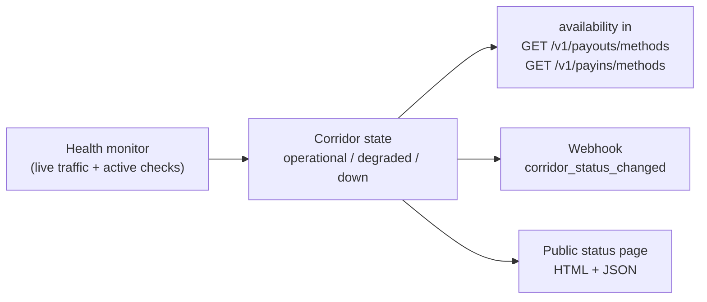

import { EnvUrls } from "/snippets/env-urls.jsx";

<EnvUrls lang="en" />

Payment rails can degrade or go down — a banking network outage, a channel
maintenance window, an upstream incident. The platform monitors the health of
every corridor (country / currency / method) **in real time**, combining the
outcome of live traffic with active health checks, and exposes that state to
you through three surfaces so your product can react before your users do:

1. **`availability` in the method catalogs** — decide at render time whether
   to show, warn about or hide a corridor.
2. **`corridor_status_changed` webhook** — get pushed the moment a corridor
   changes state, without polling.
3. **Public status page** — a hosted, branded page (HTML + JSON) you can link
   from your app or your own status tooling.



<Note>
The monitor is **observability, not a gate**: a `down` corridor does not
block your requests. You stay in control — you can keep sending (requests
will fail with the usual error codes and refunds apply as always) or pause
that corridor in your UI until it recovers.
</Note>

## Corridor states

| State | Meaning | What to do |
|---|---|---|
| `operational` | The corridor is processing normally. | Nothing — business as usual. |
| `degraded` | An elevated infrastructure error rate was detected in the recent window. Some operations may fail or take longer. | Consider showing a warning in your UI; retries with the same `idempotency_key` are safe. |
| `down` | Consecutive infrastructure failures or failing health checks. New dispatches are very likely to fail. | Prefer hiding or disabling the corridor in your UI until it recovers; anything you do send will resolve to the usual final states (failed operations are refunded as always). |

Transitions are governed by hysteresis: a single timeout never declares an
outage, and recovery requires a sustained stable window — the state you read
is meaningful, not noisy.

## 1. Availability in the method catalogs

`GET /v1/payouts/methods` and `GET /v1/payins/methods` now include an
additive `availability` field per corridor. The rest of the shape is
unchanged.

```bash
curl "https://api.qbank.cl/platform/v1/payouts/methods" \
  -H "Authorization: Bearer pk_..."
```

```json
{
  "items": [
    {
      "country": "VE",
      "currency": "VES",
      "method": "bank_transfer",
      "availability": "down"
    },
    {
      "country": "MX",
      "currency": "MXN",
      "method": "bank_transfer",
      "availability": "operational"
    }
  ]
}
```

A corridor with no recorded incident is always `operational` — the monitor
only persists what it has observed.

## 2. The `corridor_status_changed` webhook

Subscribe your endpoint to the `corridor_status_changed` event
([webhooks guide](/en/webhooks)) and you will receive every transition the
moment it happens — outage **and** recovery:

```json
{
  "event_type": "corridor_status_changed",
  "data": {
    "flow": "payout",
    "country": "VE",
    "currency": "VES",
    "method": "bank_transfer",
    "status": "down",
    "previous_status": "operational",
    "since": "2026-07-24T22:10:00Z",
    "reason": "consecutive infrastructure failures"
  }
}
```

| Field | Description |
|---|---|
| `flow` | `payout` or `payin` — the direction of the affected corridor. |
| `country` / `currency` / `method` | The corridor key, exactly as in the method catalogs. |
| `status` | New state: `operational`, `degraded` or `down`. |
| `previous_status` | State before the transition. |
| `since` | When the new state started (RFC 3339, UTC). |
| `reason` | Short human-readable cause (never includes internal channel identities). |

The event is a **broadcast**: it is not tied to one of your operations, so it
carries no `account_id`. Idempotent consumption applies as with every webhook
(dedupe by delivery id).

## 3. Public status page

Your organization has a hosted status page with the live state of every
corridor, the uptime of the last 90 days and the incident history. It is
public (no auth), branded with your organization's identity and safe to
share with your own customers.

- **HTML**: `GET /status/{orgToken}` — a self-contained page you can link or
  embed.
- **JSON**: `GET /v1/status/{orgToken}` — the same data for your own status
  tooling or monitors.

The page picks up your organization's logo, colors and website, and shows for
every corridor the country flag, a payment-method icon, a day-by-day
availability bar for the last 90 days and the current state. A summary card at
the top reports the overall state, how many corridors are operational,
degraded or down, and the average uptime; the incident timeline at the bottom
spells out each reason in plain language. The HTML loads no JavaScript and no
external resources, so you can safely embed it in an iframe.

The `orgToken` is an opaque token your operator shares with you (org admins
can read it as `status_page_url` in `GET /v1/org/branding`).

```bash
curl "https://api.qbank.cl/platform/v1/status/{orgToken}"
```

```json
{
  "status": "degraded",
  "generated_at": "2026-07-24T22:15:00Z",
  "corridors": [
    {
      "flow": "payout",
      "country": "VE",
      "currency": "VES",
      "method": "bank_transfer",
      "status": "down",
      "since": "2026-07-24T22:10:00Z",
      "uptime_90d_pct": 99.62
    }
  ],
  "incidents": [
    {
      "flow": "payout",
      "country": "VE",
      "currency": "VES",
      "method": "bank_transfer",
      "from_status": "operational",
      "to_status": "down",
      "reason": "consecutive infrastructure failures",
      "at": "2026-07-24T22:10:00Z"
    }
  ]
}
```

| Field | Description |
|---|---|
| `status` | Overall page state: the worst state among all corridors. |
| `corridors[]` | Current state per corridor plus `uptime_90d_pct` (percentage of the last 90 days spent `operational`). |
| `incidents[]` | Most recent transitions (both outages and recoveries), newest first. |

An unknown or malformed token returns `404` — the token does not reveal
whether an organization exists. The endpoint is rate-limited per IP.

## FAQ

<AccordionGroup>
  <Accordion title="Does a down corridor reject my requests?">
    No. The monitor never blocks dispatches. A `down` corridor means new
    operations are very likely to fail with the usual error codes
    (`channel_unavailable`, provider rejection, timeout states) — failed
    operations are refunded exactly as always. Use `availability` to decide
    what to show in your UI.
  </Accordion>
  <Accordion title="How fast is an outage detected?">
    The monitor evaluates continuously, combining every real dispatch with
    periodic active health checks, so outages are typically detected within
    a few minutes even on corridors with little traffic. Hysteresis prevents
    a single timeout from flapping the state.
  </Accordion>
  <Accordion title="Do I need to poll the catalogs to track availability?">
    No — subscribe to `corridor_status_changed` and you will be pushed every
    transition. The catalogs are a convenient snapshot for render time; the
    webhook is the change feed.
  </Accordion>
  <Accordion title="What happens to operations in flight when a corridor goes down?">
    They resolve on their own: each operation reaches a final state
    (`completed` or `failed` with refund) through the usual webhook and
    reconciliation machinery. You never need to re-send — retrying with the
    same `idempotency_key` is always safe.
  </Accordion>
  <Accordion title="Can I white-label the status page?">
    Yes. The page uses your organization's branding (logo, colors, name)
    automatically — the same configuration used by receipts and hosted pages.
    Ask your operator for your organization's status page URL, or read it
    from <code>GET /v1/org/branding</code> if you are an org admin.
  </Accordion>
  <Accordion title="Why don't I see which provider is behind an incident?">
    By design the platform is provider-agnostic: corridors are identified by
    country, currency and method only. Incident reasons are normalized and
    never include internal channel identities.
  </Accordion>
</AccordionGroup>
