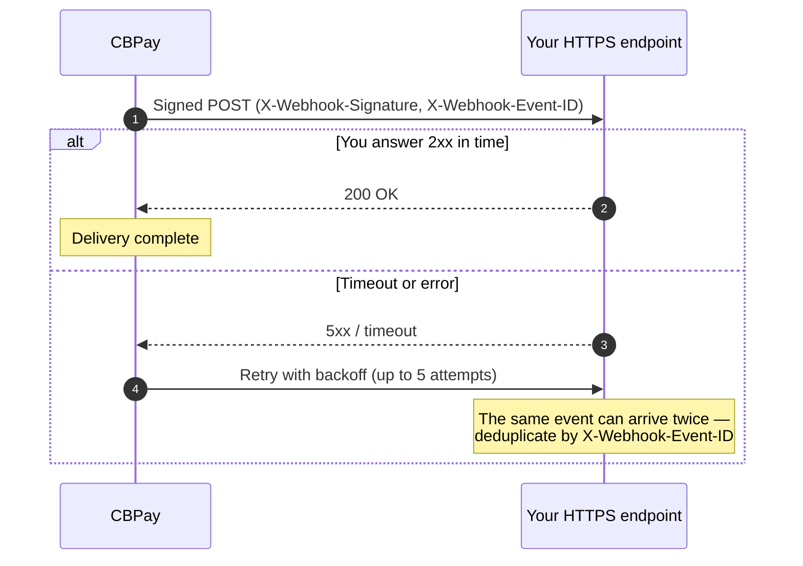

Webhooks notify your own HTTPS callback about your account's events,
cryptographically signed.



## Create a subscription

```bash
curl -X POST https://api.qbank.cl/platform/v1/webhooks/subscriptions \
  -H "Authorization: Bearer <token>" \
  -H "Content-Type: application/json" \
  -d '{
    "event_type": "payout_status_changed",
    "callback_url": "https://api.myapp.com/webhooks/cbpay",
    "secret": "a-secret-of-at-least-16-chars"
  }'
```

- `event_type`: one of the events below, or `*` for all.
- `callback_url`: **HTTPS required**; localhost and private IPs are
  rejected — for local development use an
  [HTTPS tunnel](/en/environment-testing#testing-webhooks-in-local-development).
- `secret`: at least 16 characters; used to sign every delivery. Stored
  encrypted and cannot be retrieved.

The subscription receives **your account's** events. You can list active
subscriptions at any time:

```bash
curl https://api.qbank.cl/platform/v1/webhooks/subscriptions \
  -H "Authorization: Bearer <token>"
```

```json
{
  "page": 1,
  "page_size": 50,
  "subscriptions": [
    {
      "id": "5f3a…",
      "event_type": "payout_status_changed",
      "callback_url": "https://api.myapp.com/webhooks/cbpay",
      "status": "active",
      "created_at": "2026-07-01T12:00:00Z"
    }
  ]
}
```

## Disabling and reactivating a subscription

When a callback is no longer used, disable it instead of deleting it
(subscriptions are **never deleted**: they stay `disabled` and you can
reactivate them at any time):

```bash
curl -X PATCH https://api.qbank.cl/platform/v1/webhooks/subscriptions/5f3a… \
  -H "Authorization: Bearer <token>" \
  -H "Content-Type: application/json" \
  -d '{ "status": "disabled" }'
```

```json
{
  "id": "5f3a…",
  "event_type": "payout_status_changed",
  "callback_url": "https://api.myapp.com/webhooks/cbpay",
  "status": "disabled",
  "created_at": "2026-07-01T12:00:00Z"
}
```

To reactivate it, same call with `{ "status": "active" }`.

- The toggle governs **future** events: a `disabled` subscription stops
  receiving new events, but deliveries **already queued** are still sent.
- It is **idempotent**: repeating the current status answers `200` with no
  change.
- You can only touch **your account's** subscriptions: a subscription of
  another account answers `404` (it is indistinguishable from an inexistent
  one).

| HTTP | `error` | Fix |
|---|---|---|
| 400 | `invalid_status` | Status must be `active` or `disabled` |
| 404 | `not_found` | The subscription does not exist or belongs to another account |

## Events

| Event | When it fires |
|---|---|
| `payin_credited` | A fiat collection was received and credited |
| `payin_expired` | An active collection (QR / checkout) expired or failed without receiving the payment |
| `payin_refunded` | A [refund](/en/guides/refunds) of a card payin reached a final state (includes issuer-imposed chargebacks) |
| `payout_status_changed` | A payout changed state |
| `transfer_received` | The account received an internal transfer |
| `crypto_deposit_credited` | An on-chain deposit was confirmed and credited |
| `crypto_deposit_held` | An incoming deposit was held due to sender risk ([screening](/en/guides/screenings)) |
| `crypto_deposit_alert` | A deposit was credited but the sender shows high risk (informational) |
| `crypto_withdrawal_status_changed` | An on-chain withdrawal changed state |
| `banking_customer_status_changed` | A banking profile verification changed (your own or a registered third party's — `customer_kind` tells them apart) |
| `banking_operation_status_changed` | A bank payment changed state |
| `card_transaction` | A card purchase was authorized, annulled or adjusted |
| `card_status_changed` | A card changed state (including automatic freezes) |
| `card_stored` | A payer's card was tokenized and saved with consent ([stored cards](/en/guides/payins#stored-cards)) |
| `stored_card_revoked` | A stored card credential was revoked (merchant-initiated charges stop working) |
| `subscription_status_changed` | A subscription on a stored card changed state (`active` / `paused` / `past_due` / `canceled`) |
| `kyc_verification_status_changed` / `kyb_verification_status_changed` | An identity verification changed state (including your own onboarding, with `self_onboarding: true`) |
| `kyc_link_completed` / `kyb_link_completed` | A hosted verification link was completed |
| `kyc_document_validated` / `kyb_document_validated` | OCR finished for a document uploaded through the API |
| `kyc_liveness_completed` | A liveness check was completed from a liveness link |
| `aml_screening_updated` | AML screening updates (result, cases, risk, reviewed transaction) |
| `risk_report_ready` | A [Qscore](/en/guides/qscore) credit report finished generating (it carries the score and band) |
| `risk_score_changed` | The score of a monitored subject moved (re-evaluation after new bureau data) |
| `risk_monitoring_alert` | A monitored [Qscore](/en/guides/qscore) subject triggered an alert: the score dropped below your threshold, new bureau records appeared, or records were removed |
| `risk_batch_completed` | A [batch](/en/guides/qscore-batch) of Qscore reports finished processing (exactly one webhook per batch, with item counts — never per subject) |
| `wallet_deposit_received` | An on-chain deposit arrived at a [segregated wallet](/en/guides/segregated-wallets) (does not touch the ledger) |
| `wallet_send_status_changed` | A send from a segregated wallet changed status |
| `wallet_key_exported` | A segregated wallet's private key was exported (security alert) |
| `wallet_external_movement` | On-chain movement of a segregated wallet that did not go through the platform (expected under `client` custody) |
| `wallet_key_compromise_suspected` | **Critical alarm**: external outflow from a `cbpay`-custody wallet — possible key compromise |
| `txn_review_status_changed` | An operation held by the [transactional firewall](/en/guides/transaction-reviews) changed review state (`in_review` / `info_requested` / `released` / `rejected`) — neutral payload, internal reasons never travel; a rejection can also come from the automatic deadline sweep (auto-rejection) |
| `corridor_status_changed` | A payment corridor changed availability (`operational` / `degraded` / `down`) — broadcast, see the [service status guide](/en/service-status) |
| `balance_adjusted` | An administrator applied a manual credit or debit to a balance |
| `account_status_changed` | The account's administrative status changed (`active` / `blocked` / `closed`) |
| `member_security_event` | A security event of one of the account's users (sign-in, credential change, new factor, revoked session) |

### Payload of each event

<CodeGroup>

```json payin_credited
{
  "payin_id": "9c2a…",
  "account_id": "ae8c…",
  "country": "BO",
  "currency": "BOB",
  "local_amount": "700.00",
  "fx_rate": "6.91",
  "usdt_credited": "100.302460",
  "fee": "1.000000"
}
```

```json payin_expired
{
  "payin_id": "567d…",
  "account_id": "ae8c…",
  "status": "expired",
  "country": "BO",
  "currency": "BOB",
  "local_amount": "60.99",
  "reference": "CBK7Q2M4XZ9P"
}
```

```json payin_refunded
{
  "refund_id": "3a7d…",
  "payin_id": "9f1c…",
  "account_id": "c57f…",
  "kind": "refund",
  "status": "completed",
  "currency": "USD",
  "local_amount": "40.00",
  "usdt_debited": "40.000000",
  "receipt_url": "https://api.qbank.cl/platform/v1/payin-refunds/3a7d…/receipt"
}
```

```json payout_status_changed
{
  "payout_id": "0d4f…",
  "account_id": "ae8c…",
  "country": "MX",
  "currency": "MXN",
  "local_amount": "1500.00",
  "usdt_amount": "85.714286",
  "total_debit": "86.014286",
  "status": "completed",
  "status_code": "",
  "bank_reference": "00761123456"
}
```

```json txn_review_status_changed
{
  "account_id": "ae8c…",
  "review_id": "7a3f…",
  "kind": "payout",
  "resource_id": "0d4f…",
  "status": "info_requested",
  "previous_status": "in_review",
  "amount": "1500.00",
  "asset": "USD"
}
```

```json transfer_received
{
  "transfer_id": "77b1…",
  "from_account_id": "389d…",
  "to_account_id": "ae8c…",
  "asset": "USDT",
  "amount": "25.000000",
  "description": "Expense split",
  "created_at": "2026-07-06T20:10:00Z"
}
```

```json crypto_deposit_credited
{
  "account_id": "ae8c…",
  "chain": "tron",
  "asset": "USDT",
  "tx_id": "b1946ac9…",
  "amount": "499.000000",
  "fee": "1.000000"
}
```

```json crypto_deposit_held
{
  "account_id": "ae8c…",
  "hold_id": "c1d2e3f4…",
  "chain": "tron",
  "asset": "usdt",
  "tx_id": "8a5b3c…",
  "risk": "Severe",
  "status": "held"
}
```

```json crypto_deposit_alert
{
  "account_id": "ae8c…",
  "chain": "tron",
  "asset": "usdt",
  "tx_id": "9c6d4e…",
  "risk": "High",
  "status": "credited"
}
```

```json crypto_withdrawal_status_changed
{
  "withdrawal_id": "5e8c…",
  "account_id": "ae8c…",
  "chain": "tron",
  "asset": "USDT",
  "tx_id": "7d3f01aa…",
  "status": "completed",
  "amount": "100.000000"
}
```

```json banking_customer_status_changed
{
  "account_id": "ae8c…",
  "customer_id": "9f2b…",
  "customer_kind": "third_party",
  "third_party_id": "77aa…",
  "kyc_status": "approved"
}
```

In `banking_customer_status_changed`, `customer_kind` tells your own
profile (`self`) apart from a third party you registered (`third_party`,
with its `third_party_id` — the same id as `GET /v1/banking/third-parties/{id}`).

```json banking_operation_status_changed
{
  "account_id": "ae8c…",
  "customer_id": "9f2b…",
  "operation_id": "7e8a…",
  "type": "withdraw",
  "status": "completed"
}
```

```json card_transaction
{
  "account_id": "ae8c…",
  "card_id": "3c2b…",
  "transaction_id": "5e4d…",
  "status": "authorized",
  "amount_usdt": "16.170000",
  "merchant": "AMZN Mktp"
}
```

```json card_status_changed
{
  "account_id": "ae8c…",
  "card_id": "3c2b…",
  "status": "frozen",
  "reason": "monthly_fee_unpaid"
}
```

```json card_stored
{
  "stored_card_id": "a9b8…",
  "account_id": "ae8c…",
  "payer_reference": "payer@email.com",
  "brand": "VISA",
  "last4": "1234",
  "country": "BO",
  "currency": "BOB",
  "seed_payin_id": "9c2a…"
}
```

```json stored_card_revoked
{
  "stored_card_id": "a9b8…",
  "account_id": "ae8c…",
  "payer_reference": "payer@email.com",
  "brand": "VISA",
  "last4": "1234"
}
```

```json subscription_status_changed
{
  "subscription_id": "4f1e…",
  "account_id": "ae8c…",
  "stored_card_id": "a9b8…",
  "status": "past_due",
  "period": 3,
  "next_charge_at": "2026-08-01T12:00:00Z",
  "payer_reference": "payer@email.com",
  "reason": "dunning_exhausted",
  "failed_attempts": 3
}
```

```json kyc_verification_status_changed
{
  "account_id": "ae8c…",
  "kind": "kyc",
  "event": "approved",
  "submission_id": "c3d4…",
  "external_customer_id": "cust_789",
  "status": "approved",
  "risk_band": "low",
  "decision": "approved",
  "decision_source": "auto"
}
```

When the event carries a final decision (`approved`, `rejected` or
`changes_requested`), the payload includes `decision_source`: `"auto"` if the
automatic decision engine resolved it (clean applications are approved in
seconds without human intervention), `"admin"` if a compliance officer decided
it from the review console. The field is omitted for older submissions without
engine data.

```json kyb_link_completed
{
  "account_id": "ae8c…",
  "kind": "kyb",
  "event": "link_completed",
  "link_id": "b2c3…",
  "submission_id": "d4e5…",
  "external_customer_id": "cust_456",
  "status": "completed"
}
```

```json kyc_document_validated
{
  "account_id": "ae8c…",
  "kind": "kyc",
  "submission_id": "c3d4…",
  "external_customer_id": "cust_789",
  "category": "identity",
  "outcome": "MATCH",
  "score": 0.97,
  "summary": "Document matches the submitted identity"
}
```

```json kyc_liveness_completed
{
  "account_id": "ae8c…",
  "kind": "kyc",
  "submission_id": "c3d4…",
  "external_customer_id": "cust_789",
  "outcome": "PASS",
  "passed": true
}
```

```json aml_screening_updated
{
  "account_id": "ae8c…",
  "screening_event": "compliance_risk_changed",
  "customer_id": "cus_8f2e…",
  "data": { "risk_level": "high" }
}
```

```json wallet_deposit_received
{
  "wallet_id": "b7e3…",
  "account_id": "ae8c…",
  "chain": "tron",
  "asset": "USDT",
  "tx_id": "b1946ac9…",
  "amount_raw": "125000000",
  "from_address": "TDonor…"
}
```

```json wallet_send_status_changed
{
  "send_id": "9c8b…",
  "wallet_id": "b7e3…",
  "account_id": "ae8c…",
  "chain": "tron",
  "asset": "USDT",
  "tx_id": "b1946ac9…",
  "status": "completed",
  "amount_raw": "25500000"
}
```

```json wallet_key_exported
{
  "wallet_id": "b7e3…",
  "account_id": "ae8c…",
  "chain": "tron",
  "asset": "USDT",
  "address": "TRmSZRaMAqLEevAdGwo3R43bRBXamWR5bd"
}
```

```json wallet_external_movement
{
  "wallet_id": "b7e3…",
  "account_id": "ae8c…",
  "chain": "tron",
  "asset": "USDT",
  "direction": "out",
  "tx_id": "9a3c1e5f…",
  "amount_raw": "25000000",
  "custody": "client"
}
```

```json wallet_key_compromise_suspected
{
  "wallet_id": "b7e3…",
  "account_id": "ae8c…",
  "chain": "tron",
  "asset": "USDT",
  "direction": "out",
  "tx_id": "9a3c1e5f…",
  "amount_raw": "25000000",
  "custody": "cbpay"
}
```

```json risk_report_ready
{
  "report_id": "9f1c…",
  "subject_id": "6aa2…",
  "doc_id": "76.123.456-7",
  "country": "CL",
  "subject_type": "person",
  "score": 712,
  "band": "B",
  "verify_code": "Q9f1c2e7a5b6d4c8e9a0f1d2b3c4d5e6f0123456789ab"
}
```

```json risk_score_changed
{
  "subject_id": "6aa2…",
  "report_id": "9f1c…",
  "old_score": 688,
  "new_score": 712,
  "old_band": "C",
  "new_band": "B"
}
```

```json risk_monitoring_alert
{
  "monitoring_id": "7c9e2f14-5b6a-4c8d-9e1f-3a7b5c2d8e91",
  "subject_id": "8f5fb0d2-1d45-4a0e-9d5c-2d39f2b7a112",
  "doc_id": "12.345.678-5",
  "country": "CL",
  "subject_type": "person",
  "triggers": ["score_drop_below", "new_records"],
  "score": 487,
  "previous_score": 512,
  "band": "D",
  "record_count": 3,
  "detected_at": "2026-08-08T18:41:12Z",
  "new_records": [
    {
      "source": "res_chile",
      "record_type": "debt_collection",
      "reported_at": "2026-08-05T00:00:00Z",
      "amount": "450000",
      "currency": "CLP",
      "status": "open"
    }
  ]
}
```

```json risk_batch_completed
{
  "batch_id": "b7f2c1a4-3e5d-4f8a-9c2b-1d0e6a8f4c5d",
  "status": "completed_with_errors",
  "total_items": 4,
  "succeeded_items": 3,
  "failed_items": 1,
  "country": "CL",
  "purpose": "credit_evaluation"
}
```

```json corridor_status_changed
{
  "flow": "payout",
  "country": "VE",
  "currency": "VES",
  "method": "bank_transfer",
  "status": "down",
  "previous_status": "operational",
  "since": "2026-07-24T22:10:00Z",
  "reason": "consecutive infrastructure failures"
}
```

```json balance_adjusted
{
  "account_id": "ae8c…",
  "asset": "USDT",
  "amount": "25.000000",
  "direction": "credit",
  "reason": "goodwill credit",
  "available": "1025.000000",
  "held": "0.000000"
}
```

```json account_status_changed
{
  "account_id": "ae8c…",
  "status": "blocked",
  "previous_status": "active"
}
```

```json member_security_event
{
  "account_id": "ae8c…",
  "member_id": "3f7b…",
  "event_type": "password_changed",
  "ip": "200.83.14.7",
  "user_agent": "Mozilla/5.0 (Macintosh; Intel Mac OS X 10_15_7)"
}
```

</CodeGroup>

In `payout_status_changed` and `crypto_withdrawal_status_changed`, `status`
can be `completed` or `failed` (with `failed`, the debit has already been
refunded by the time you receive the event).

## Delivery format

Every delivery is a JSON `POST` with these headers:

| Header | Content |
|---|---|
| `X-Webhook-Event` | Event type |
| `X-Webhook-Event-ID` | Unique event ID |
| `X-Webhook-Delivery-ID` | This delivery's ID (changes across retries) |
| `X-Webhook-Timestamp` | Unix timestamp (seconds, UTC) |
| `X-Webhook-Signature` | HMAC signature (see below) |

## Verify the signature

```
X-Webhook-Signature = hex( HMAC-SHA256( secret, timestamp + "." + body ) )
```

<CodeGroup>

```javascript Node.js
const crypto = require("crypto");

function verifyWebhook(req, secret) {
  const ts = req.headers["x-webhook-timestamp"];
  const sig = req.headers["x-webhook-signature"];
  const expected = crypto
    .createHmac("sha256", secret)
    .update(ts + "." + req.rawBody)
    .digest("hex");
  return crypto.timingSafeEqual(Buffer.from(sig), Buffer.from(expected));
}
```

```python Python
import hashlib, hmac

def verify_webhook(headers, raw_body: bytes, secret: str) -> bool:
    ts = headers["X-Webhook-Timestamp"]
    sig = headers["X-Webhook-Signature"]
    expected = hmac.new(
        secret.encode(), f"{ts}.".encode() + raw_body, hashlib.sha256
    ).hexdigest()
    return hmac.compare_digest(sig, expected)
```

</CodeGroup>

<Warning>
Compute the HMAC over the **raw body** (bytes as received), not over
re-serialized JSON. Reject old timestamps (> 5 minutes) to prevent replay.
</Warning>

## Retries and idempotency

- Your endpoint must respond **2xx** within the timeout; anything else is
  retried.
- Up to **5 attempts** with incremental backoff:

| Attempt | 1 | 2 | 3 | 4 | 5 |
|---|---|---|---|---|---|
| Approx. wait | immediate | ~5s | ~20s | ~45s | ~80s |

- Use `X-Webhook-Event-ID` to deduplicate: the same event can arrive more
  than once (at-least-once delivery).
- If all 5 attempts fail the event is not resent — recover the state with
  the resource's `GET` (which is why no flow should depend ONLY on the
  webhook).

## Best practices

- Respond `200` immediately and process in the background.
- Log the `X-Webhook-Delivery-ID` for traceability.
- Don't rely solely on webhooks for critical states: you can always query
  the object by API (`GET /v1/payouts/{id}`, etc.).
