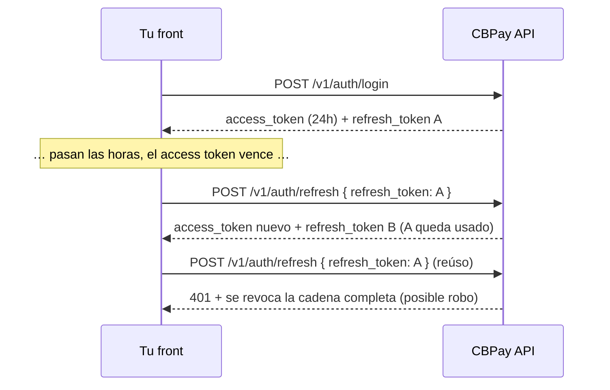

Todas las llamadas (salvo registro y login) requieren una credencial en el
header `Authorization`:

```
Authorization: Bearer <token>
```

También se acepta `X-API-Key: <token>` como header alternativo.

## Tipos de credencial

<Tabs>
<Tab title="Sesión JWT (personas con login)">

Se obtiene con `POST /v1/auth/register` o `POST /v1/auth/login` y dura
**24 horas**. Pensada para apps con usuarios que inician sesión. Junto al
`access_token` recibes un **refresh token** para renovar la sesión sin pedir
la contraseña de nuevo — ver [renovación de sesión](#renovacion-de-sesion-refresh-tokens).

```bash
curl -X POST https://api.qbank.cl/platform/v1/auth/login \
  -H "Content-Type: application/json" \
  -d '{ "org": "cbpay", "email": "ana@ejemplo.com", "password": "…" }'
```

```json
{
  "access_token": "eyJ…",
  "expires_at": "2026-07-14T15:20:49Z",
  "refresh_token": "rt_6a1e6c22-….XXXXXXXX…",
  "refresh_expires_at": "2026-08-12T15:20:49Z",
  "account_id": "…",
  "role": "owner"
}
```

Las cuentas empresa pueden tener varios **miembros** con roles — ver
[miembros de una empresa](#miembros-de-una-empresa) más abajo.

<Note>
Si la política de la cuenta exige **OTP en el login**, la respuesta trae
`otp_required: true` con un `pending_token` en vez de la sesión: el segundo
paso se completa en `POST /v1/auth/login/otp` con el código recibido por
SMS/WhatsApp. Flujo completo en [seguridad y 2FA](/es/seguridad-2fa).
</Note>

<Note>
También puedes ofrecer **registro e inicio de sesión con Google, Apple,
Microsoft o Facebook** (sin contraseña) — ver [login social](/es/guias/login-social).
</Note>

</Tab>
<Tab title="API key (servidor a servidor)">

Formato `pk_<key_id>.<secret>`. No expira y no depende de una sesión.
Se emite con:

```bash
curl -X POST https://api.qbank.cl/platform/v1/api-keys \
  -H "Authorization: Bearer <token-de-sesion>" \
  -H "Content-Type: application/json" \
  -d '{ "label": "backend-produccion" }'
```

```json
{
  "api_key_id": "…",
  "key_id": "a1b2c3d4e5f60718",
  "token": "pk_a1b2c3d4e5f60718.XXXXXXXX…",
  "note": "store this token now; it cannot be retrieved again"
}
```

<Warning>
El token en claro se muestra **una sola vez**. En el servidor solo se guarda
un hash — si lo pierdes, emite una key nueva.
</Warning>

</Tab>
</Tabs>

## Renovación de sesión (refresh tokens)

El `access_token` dura 24 horas; el `refresh_token` (`rt_…`) permite obtener
un par nuevo **sin re-login** durante 30 días, renovables en cada uso hasta
un máximo de 90 días desde el login original. Es de **un solo uso**: cada
canje devuelve un `refresh_token` nuevo y el anterior queda invalidado
(rotación).



```bash
curl -X POST https://api.qbank.cl/platform/v1/auth/refresh \
  -H "Content-Type: application/json" \
  -d '{ "refresh_token": "rt_6a1e6c22-….XXXXXXXX…" }'
```

```json
{
  "access_token": "eyJ…",
  "expires_at": "2026-07-14T15:20:50Z",
  "refresh_token": "rt_9f2b1c30-….YYYYYYYY…",
  "refresh_expires_at": "2026-08-12T15:20:50Z",
  "account_id": "…",
  "role": "owner"
}
```

Reglas de seguridad que tu front debe conocer:

- **Rotación estricta**: al canjear, el access token anterior de ese
  dispositivo queda revocado al instante (solo hay un access token vivo por
  cadena). Reemplaza siempre AMBOS tokens con los de la respuesta.
- **Reúso = robo**: si un refresh token ya canjeado vuelve a presentarse, la
  cadena completa del dispositivo se revoca (tokens y sesiones) y queda un
  evento `refresh_token_reuse` en `GET /v1/me/security/events`. El usuario
  debe iniciar sesión de nuevo.
- **Muere con la sesión**: cerrar sesión (`DELETE /v1/me/sessions/{id}`),
  `POST /v1/me/sessions/revoke-all` o un cambio/reset de contraseña
  invalidan también los refresh tokens asociados.
- Cualquier rechazo responde `401 invalid_refresh_token` — ante ese error,
  manda al usuario al login.
- Guarda el refresh token en almacenamiento seguro (Keychain/Keystore en
  móvil; en web, preferir memoria + re-login o cookie httpOnly de tu
  backend). Las API keys `pk_` no usan refresh: no expiran.

<AccordionGroup>
<Accordion title="¿Cada cuánto debo refrescar?">
Cuando el access token esté por vencer (usa `expires_at`) o al recibir un
`401` en una llamada normal. Evita refrescar en paralelo desde varios
lugares: si dos canjes del mismo token llegan a la vez, uno gana y el otro
recibe `401` sin castigo — pero un canje de un token YA rotado revoca la
cadena.
</Accordion>
<Accordion title="¿Qué pasa a los 90 días?">
El tope absoluto de la cadena es 90 días desde el login original: aunque
refresques a diario, al llegar al límite el refresh devuelve `401` y el
usuario debe autenticarse de nuevo (con su contraseña, passkey o login
social).
</Accordion>
<Accordion title="¿El refresh funciona con API keys?">
No aplica: las API keys `pk_` no expiran ni tienen sesión. El refresh es
solo para sesiones JWT de usuarios humanos.
</Accordion>
</AccordionGroup>

## Nivel de acceso

Tu credencial (JWT de sesión o API key) opera **tu propia cuenta**: saldos,
payouts, payins, transferencias, crypto, KYC/KYB y webhooks propios. Si un
endpoint responde `403 account_required` o `403 org_admin_required`, esa
operación corresponde a otro nivel de credencial — contacta al equipo de
CBPay.

## Tu perfil de cuenta

```bash
# Leer el perfil (incluye kyc_status y type)
curl https://api.qbank.cl/platform/v1/me \
  -H "Authorization: Bearer <token>"

# Actualizar campos del perfil (todos opcionales)
curl -X PATCH https://api.qbank.cl/platform/v1/me \
  -H "Authorization: Bearer <token>" \
  -H "Content-Type: application/json" \
  -d '{
    "display_name": "Comercial Andina SpA",
    "tax_id": "76.543.210-8",
    "phone": "+56 9 1234 5678",
    "country": "CL",
    "locale": "en"
  }'
```

```json
{
  "id": "9b1deb4d-3b7d-4bad-9bdd-2b0d7b3dcb6d",
  "type": "company",
  "display_name": "Comercial Andina SpA",
  "email": "legal@andina.cl",
  "tax_id": "76.543.210-8",
  "phone": "+56 9 1234 5678",
  "country": "CL",
  "locale": "en",
  "status": "active",
  "kyc_status": "approved",
  "created_at": "2026-06-01T12:00:00Z"
}
```

`PATCH /v1/me` acepta `display_name`, `tax_id`, `phone`, `country` y `locale` (envía
solo los que cambian). Un `locale` vacío guarda `en`; valores inválidos devuelven `400 invalid_locale`.
El `email`, `status` y `kyc_status` no se autogestionan: los resuelve el administrador.
Ver [Idioma y locale](/es/guias/idioma).

## Miembros de una empresa

Las cuentas **empresa** pueden tener varios usuarios con login propio y
distinto nivel de permiso:

| Rol | Permisos |
|---|---|
| `owner` | Todo: opera, administra miembros y credenciales |
| `operator` | Opera el día a día (default al crear un miembro) |
| `viewer` | Solo lectura |

```bash
# Agregar un miembro (solo cuentas company)
curl -X POST https://api.qbank.cl/platform/v1/members \
  -H "Authorization: Bearer <token>" \
  -H "Content-Type: application/json" \
  -d '{
    "email": "finanzas@andina.cl",
    "password": "una-clave-segura",
    "role": "viewer"
  }'

# Listar miembros
curl "https://api.qbank.cl/platform/v1/members?page_size=50" \
  -H "Authorization: Bearer <token>"
```

```json
{
  "page": 1,
  "page_size": 50,
  "members": [
    { "id": "…", "email": "legal@andina.cl", "role": "owner", "status": "active" },
    { "id": "…", "email": "finanzas@andina.cl", "role": "viewer", "status": "active" }
  ]
}
```

En una cuenta persona, `POST /v1/members` responde `403 company_only`.

## Buenas prácticas

- Guarda las API keys en un gestor de secretos; nunca en el código ni en el
  navegador.
- Usa una key por ambiente/servicio (`label` descriptivo) para poder rotar
  sin downtime.

<Steps>
  <Step title="Rotación sin downtime">
    Emite la key nueva con `POST /v1/api-keys` (label nuevo).
  </Step>
  <Step title="Despliega">
    Actualiza tu servicio para usar la key nueva.
  </Step>
  <Step title="Retira la antigua">
    Pide al equipo de CBPay revocar la key anterior una vez que el tráfico
    migró.
  </Step>
</Steps>

- Las sesiones JWT son para front-ends; para procesos automatizados usa
  siempre API keys.
