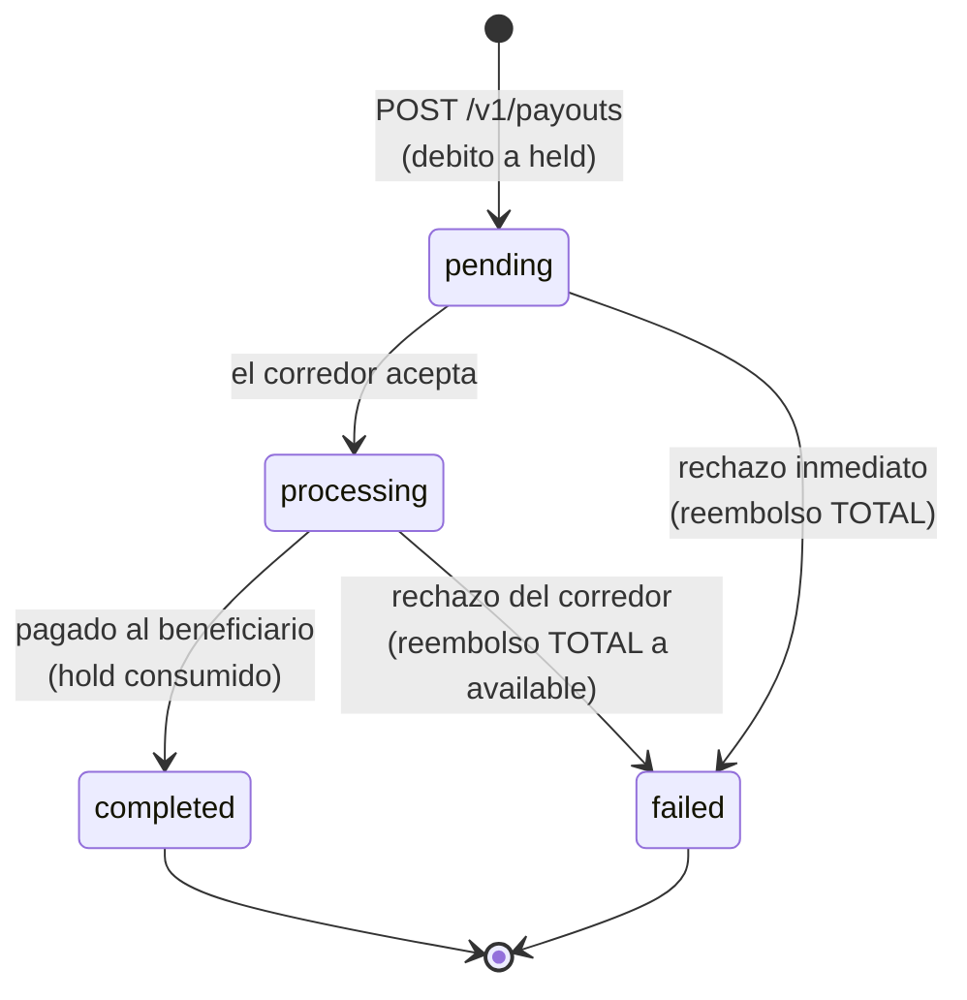

Todas las operaciones de CBPay siguen ciclos de vida explícitos. Esta
página reúne **todos los estados de todos los productos** en un solo lugar,
con la regla de oro: nunca asumas éxito hasta ver un **estado final**.

## Tabla unificada

| Producto | Estados | Finales | Evento webhook |
|---|---|---|---|
| Payout | `pending` → `processing` → `completed` / `failed` | `completed`, `failed` | `payout_status_changed` |
| Payin | `pending` → `credited` / `expired` / `failed` (+ `unassigned`) | `credited`, `expired`, `failed` | `payin_credited` |
| Transferencia | `completed` (síncrona) | `completed` | `transfer_received` (al receptor) |
| Depósito crypto | detección → `credited` al confirmar la red | `credited` | `crypto_deposit_credited` |
| Retiro crypto | `pending` → `processing` → `completed` / `failed` | `completed`, `failed` | `crypto_withdrawal_status_changed` |
| Banking (pago) | según riel: `pending` → `processing` → `completed` / `failed` | `completed`, `failed` | `banking_operation_status_changed` |
| Tarjeta | `pending_activation` → `active` ⇄ `frozen` → `cancelled` | `cancelled` | `card_status_changed` |
| KYC de la cuenta | `none` → `pending` → `approved` / `rejected` | `approved`, `rejected` | — (consultar `GET /v1/me`) |

## Payouts: el ciclo con dinero retenido

- El débito completo (`total_debit`) sale de `available` y queda en `held`
  mientras la operación está en vuelo.
- `failed` **siempre reembolsa el débito completo** (monto + comisión) a
  `available`, automáticamente.
- Un payout en `processing` no se puede cancelar por API: espera el estado
  final (webhook o `GET /v1/payouts/{id}`).

### Catálogo de `status_code` en payouts fallidos

Cuando un payout falla, `status_code` y `status_message` explican la causa
en términos neutros:

| `status_code` | Significado | Qué hacer |
|---|---|---|
| `core_rejected` | El procesador rechazó la operación al crearla (datos del beneficiario inválidos, cuenta destino inexistente, corredor no disponible) | Lee `status_message`, corrige los datos y crea un payout nuevo (clave nueva) |
| *código del corredor* | Rechazo posterior del riel bancario (p. ej. cuenta cerrada) | Igual: corrige y reintenta como operación nueva |
| *(vacío)* con `failed` | Fallo genérico reportado por el corredor | Revisa `status_message`; si no es claro, contacta soporte con el `payout_id` |

El reembolso ya ocurrió en todos los casos: verifícalo en
`GET /v1/movements` (entrada `payout_refund`).

## Payins: estados de un cobro

- `pending` — el cargo existe y espera el pago. Los QR y páginas de pago
  tienen vencimiento (`expired` si nadie paga).
- `credited` — pago recibido, convertido a tu `payin_rate` y abonado.
- `unassigned` — llegó un depósito que no se pudo asociar a ninguna cuenta;
  el administrador lo asigna manualmente y entonces se acredita con la tasa
  y comisiones de la cuenta destino.
- `failed` — el cobro falló (p. ej. un collect rechazado por el pagador).
  No se movió dinero.

## Retiros crypto: confirmación on-chain

Un retiro pasa a `completed` cuando la transacción se confirma en la red.
Tiempos típicos: **TRON ~1 minuto** (19 confirmaciones), **Ethereum algunos
minutos** según congestión. El `tx_id` viene en la respuesta y en el
webhook para que lo verifiques en el explorador.

Si el retiro falla antes de transmitirse, el débito completo se reembolsa
(entrada `withdrawal_refund`).

## Tarjetas

- `pending_activation` — física emitida, viaja inactiva; se activa con
  `POST /v1/cards/{id}/activate`.
- `active` — autoriza compras en tiempo real contra el saldo del asset de
  gasto de la tarjeta (`spending_asset`: USDT, USDC, BTC o GOLD).
- `frozen` — congelada (manual o por mensualidad impaga); las compras se
  rechazan con `unfunded_card_frozen`. Se descongela pagando lo pendiente.
- `cancelled` — final; no se puede revertir.

## Reglas transversales

<AccordionGroup>
<Accordion title="¿Cuándo confío en un estado?">
Estado final por webhook **o** por `GET` del recurso — ambos son fuentes de
verdad equivalentes. El webhook es push (recomendado); el `GET` es tu
respaldo si un webhook se pierde.
</Accordion>
<Accordion title="¿Qué hago ante timeout creando una operación?">
NO reintentes con clave nueva. Repite el mismo request con la **misma**
`idempotency_key` (te devuelve el original con `idempotency_hit: true`) o
consulta el listado del recurso. Detalle en
[idempotencia](/es/conceptos/idempotencia).
</Accordion>
<Accordion title="¿Un estado puede retroceder?">
No. Los ciclos son monótonos: `completed` y `failed` son definitivos, y una
operación nunca vuelve a un estado anterior.
</Accordion>
<Accordion title="¿Dónde veo el efecto de cada estado en mi saldo?">
En `GET /v1/movements`: cada transición con efecto económico deja una
entrada inmutable (`payout_debit`, `payout_refund`, `payin_credit`…). Ver
[movimientos y conciliación](/es/conceptos/movimientos-y-conciliacion).
</Accordion>
</AccordionGroup>
