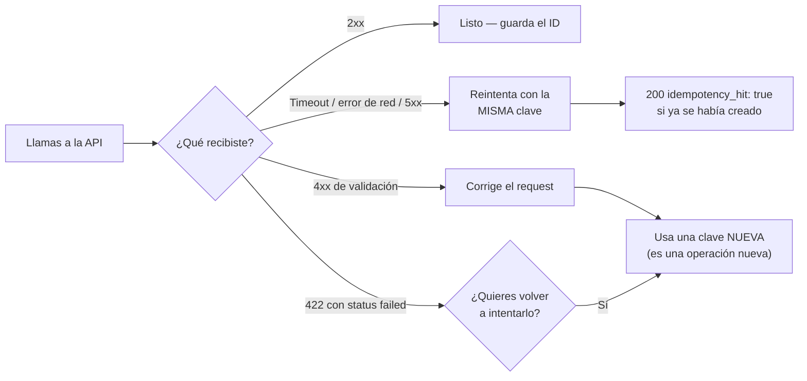

Toda operación que mueve dinero exige una **clave de idempotencia**. La
tabla completa:

| Endpoint | Clave | Por qué |
|---|---|---|
| `POST /v1/payouts` | **Obligatoria** | Debita tu saldo y dispersa |
| `POST /v1/payouts/qr/confirm` | **Obligatoria** | Debita y paga el QR (el `scan` es gratis y no la necesita) |
| `POST /v1/payins/collect` | **Obligatoria** | Ejecuta un débito real contra el pagador |
| `POST /v1/transfers` | **Obligatoria** | Mueve saldo entre cuentas |
| `POST /v1/crypto/withdrawals` | **Obligatoria** | Debita y transmite on-chain |
| `POST /v1/banking/operations` | **Obligatoria** | Envía un pago bancario (el `prepare` es gratis y no la necesita) |
| `POST /v1/cards` | **Obligatoria** | Puede cobrar el fee de emisión |
| `POST /v1/payins` con `method: "fintoc"` | Opcional, **recomendada** | Un retry con la misma clave devuelve la misma sesión de pago (no abre una segunda) |
| `POST /v1/payins` (qr / bank_transfer) | No aplica | El cargo no mueve dinero hasta que alguien paga; un duplicado sin pagar simplemente vence |

## Cómo enviarla

Dos formas equivalentes (si mandas ambas, gana el body):

<CodeGroup>

```bash Body
curl -X POST …/v1/payouts \
  -d '{ "idempotency_key": "pago-nomina-2026-07-001", … }'
```

```bash Header
curl -X POST …/v1/payouts \
  -H "Idempotency-Key: pago-nomina-2026-07-001" \
  -d '{ … }'
```

</CodeGroup>

Si la omites recibes `400 idempotency_key_required`.

## Qué pasa al reintentar

La clave es única por **cuenta origen**. Si repites una llamada con la misma
clave:

- No se crea una operación nueva ni se mueve dinero otra vez.
- Recibes `200 OK` (en vez de `201`/`202`) con el objeto original más el
  campo `idempotency_hit: true`.

```json
{
  "payout_id": "el-mismo-de-la-primera-vez",
  "status": "processing",
  "idempotency_hit": true
}
```

## ¿Con qué clave reintento?

La regla de decisión completa, para no dudar nunca:



## Recomendaciones

- Usa un identificador de **tu** sistema (ID de orden, de nómina, etc.), no
  un timestamp ni un UUID generado al vuelo en cada retry.
- Guarda la clave antes de llamar a la API; así puedes reintentar tras un
  timeout con garantía de no duplicar.
- Ante un error de red o `5xx`, **reintenta con la misma clave**. Ante un
  `4xx` de validación, corrige el request y usa una clave nueva.
