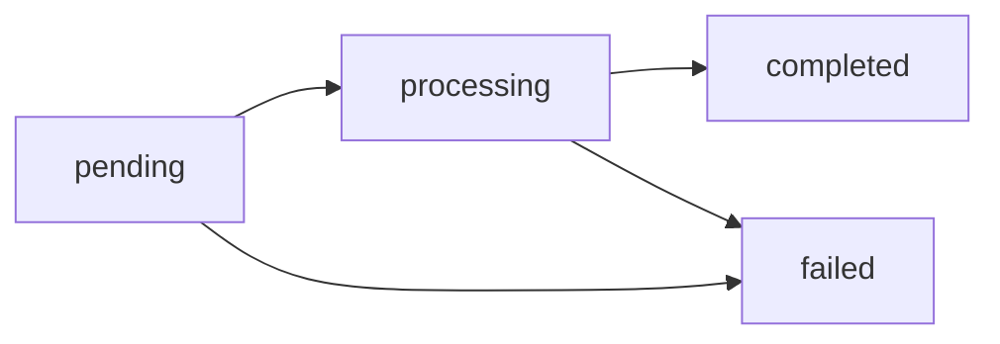

## Un solo saldo: USDT

Cada cuenta tiene un saldo virtual en **USDT con 6 decimales**. Todas las
operaciones — payouts en pesos chilenos, cobros en soles, retiros on-chain —
se liquidan contra ese único saldo.

Los montos viajan siempre como **strings decimales**:

```json
{ "asset": "USDT", "available": "125.430000", "held": "10.000000" }
```

<Note>
Internamente los montos se almacenan como enteros en micro-USDT
(1 USDT = 1.000.000 unidades) y se calculan con aritmética racional exacta.
Nunca hay floats ni errores de redondeo acumulados.
</Note>

## `available` y `held`

| Campo | Significado |
|---|---|
| `available` | Saldo disponible para operar |
| `held` | Reservado por operaciones en vuelo (payouts y retiros pendientes) |

Cuando creas un payout o retiro, el débito (`monto + comisión`) sale de
`available` y queda en `held` hasta que la operación llega a estado final:

- **`completed`** → el hold se consume; el dinero salió.
- **`failed`** → se reembolsa el débito completo (monto + comisión) a
  `available`.

## Conversión FX (fiat ↔ USDT)

Las operaciones fiat se convierten a USDT con **la tasa de tu cuenta** al
momento de ejecutar (la misma que devuelve `GET /v1/rates`, base USD). La
conversión redondea **hacia arriba** en el débito, con una diferencia
máxima de 1 micro-USDT.

Ejemplo de un payout de 50.000 CLP con tasa 950.25:

```
usdt_amount = ceil(50000 / 950.25 × 10^6) / 10^6 = 52.618258 USDT
total_debit = usdt_amount + fee
```

La tasa usada queda registrada en el objeto (`fx_rate`) para auditoría.

## Ledger inmutable

Cada movimiento genera una entrada inmutable con saldo resultante
(`balance_after`). Tu historial completo está en `GET /v1/movements`:

| `type` | Qué representa |
|---|---|
| `payin_credit` | Abono de un cobro fiat |
| `payout_debit` / `payout_refund` | Débito de payout / reembolso si falló |
| `transfer_in` / `transfer_out` | Transferencia interna recibida / enviada |
| `funding` | Depósito USDT on-chain acreditado |
| `withdrawal_debit` / `withdrawal_refund` | Retiro on-chain / reembolso si falló |
| `compliance_fee` / `compliance_refund` | Cargo por servicio KYC/KYB / reembolso |
| `wallet_creation_fee` / `wallet_creation_refund` | Cargo por creación de wallet / reembolso |
| `adjustment` | Ajuste manual de CBPay (auditado) |

```bash
curl "https://exchange.qbank.cl/platform/v1/movements?type=payout_debit&page_size=20" \
  -H "Authorization: Bearer <token>"
```

## Estados de operación

Payouts y retiros crypto siguen el mismo ciclo:



Los estados finales (`completed`/`failed`) llegan por
[webhook](/es/webhooks); no es necesario hacer polling.
