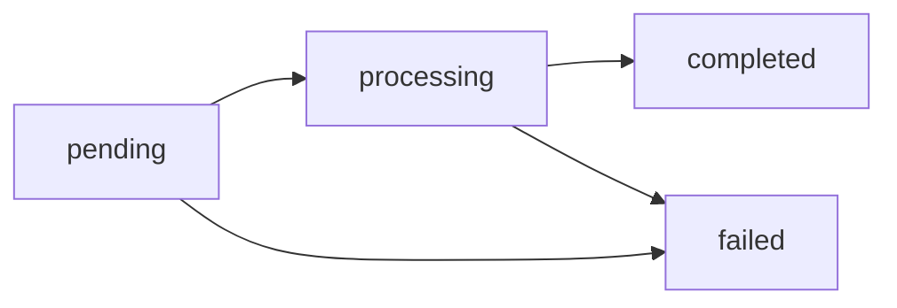

## Cuatro saldos virtuales independientes

Cada cuenta mantiene **cuatro saldos virtuales, uno por moneda**. Son
totalmente independientes entre sí: nunca se mezclan ni se convierten
automáticamente.

| Moneda | Qué es | Decimales | Cómo se fondea |
|---|---|---|---|
| `USDT` | Stablecoin USD — **la moneda operativa** | 6 | Payins fiat, depósitos on-chain (TRON/Ethereum), transferencias |
| `USDC` | Stablecoin USD | 6 | Depósitos on-chain (Ethereum), transferencias |
| `BTC` | Bitcoin | 8 (satoshis) | Abonos del operador y transferencias internas |
| `GOLD` | **Gramos de oro fino** con respaldo en custodio | 6 | Abonos del operador y transferencias internas |

`GET /v1/balances` devuelve siempre los cuatro (con ceros si no has operado
esa moneda), como **strings decimales**:

```json
{
  "account_id": "…",
  "balances": [
    { "asset": "USDT", "available": "125.430000", "held": "10.000000" },
    { "asset": "USDC", "available": "50.000000", "held": "0.000000" },
    { "asset": "BTC", "available": "0.00060000", "held": "0.00000000" },
    { "asset": "GOLD", "available": "12.500000", "held": "0.000000" }
  ]
}
```

<Note>
Internamente cada monto se almacena como entero en la unidad mínima de su
moneda (micro-USDT, satoshis, micro-gramos) y se calcula con aritmética
racional exacta. Nunca hay floats ni errores de redondeo acumulados.
</Note>

**USDT es la moneda operativa**: los payouts y payins fiat, las tarjetas y
todas las comisiones de servicios se liquidan siempre contra el saldo USDT.
Los otros saldos se mueven con [transferencias
internas](/es/guias/transferencias) (siempre entre saldos de la misma
moneda), depósitos on-chain (USDC) o abonos de tu operador (BTC y GOLD).

## `available` y `held`

Cada saldo tiene sus dos contadores:

| Campo | Significado |
|---|---|
| `available` | Saldo disponible para operar |
| `held` | Reservado por operaciones en vuelo (payouts y retiros pendientes) |

Cuando creas un payout o retiro, el débito (`monto + comisión`) sale de
`available` y queda en `held` hasta que la operación llega a estado final:

- **`completed`** → el hold se consume; el dinero salió.
- **`failed`** → se reembolsa el débito completo (monto + comisión) a
  `available`.

## Conversión FX (fiat ↔ USDT)

Las operaciones fiat se convierten a USDT con **las tasas de tu cuenta** al
momento de ejecutar (las mismas que devuelve `GET /v1/rates`, base USD):
`rate` para payouts y `payin_rate` para payins. La conversión redondea
**hacia arriba** en los débitos y **hacia abajo** en los abonos, con una
diferencia máxima de 1 micro-USDT.

Ejemplo de un payout de 50.000 CLP con tasa 950.25:

```
usdt_amount = ceil(50000 / 950.25 × 10^6) / 10^6 = 52.618258 USDT
total_debit = usdt_amount + fee
```

Ejemplo de un payin de 50.000 CLP con `payin_rate` 955.10:

```
usdt_gross    = floor(50000 / 955.10 × 10^6) / 10^6 = 52.350539 USDT
usdt_credited = usdt_gross − fee
```

La tasa usada queda registrada en el objeto (`fx_rate`) para auditoría.

## Precios de referencia

`GET /v1/rates` incluye un bloque `asset_prices` con el **precio USD de
referencia** de cada moneda (BTC por unidad, GOLD por gramo; USDT y USDC
valen 1 por convención). Es solo para valorizar tus saldos en pantalla — no
implica conversión ni spread:

```json
{
  "asset_prices": {
    "USDT": { "currency": "USD", "unit": "usdt", "price": "1" },
    "USDC": { "currency": "USD", "unit": "usdc", "price": "1" },
    "BTC": { "currency": "USD", "unit": "btc", "price": "109853.24" },
    "GOLD": { "currency": "USD", "unit": "gram", "price": "107.5341" }
  }
}
```

## Ledger inmutable

Cada movimiento genera una entrada inmutable con saldo resultante
(`balance_after`) **en la moneda del movimiento**. Tu historial completo
está en `GET /v1/movements` (filtra por moneda con `?asset=`):

| `type` | Qué representa |
|---|---|
| `payin_credit` | Abono de un cobro fiat |
| `payout_debit` / `payout_refund` | Débito de payout / reembolso si falló |
| `transfer_in` / `transfer_out` | Transferencia interna recibida / enviada |
| `funding` | Depósito on-chain acreditado (USDT o USDC, cada uno en su saldo) |
| `withdrawal_debit` / `withdrawal_refund` | Retiro on-chain / reembolso si falló |
| `compliance_fee` / `compliance_refund` | Cargo por servicio KYC/KYB / reembolso |
| `wallet_creation_fee` / `wallet_creation_refund` | Cargo por creación de wallet / reembolso |
| `adjustment` | Ajuste manual de CBPay (auditado) |

```bash
curl "https://api.qbank.cl/platform/v1/movements?type=payout_debit&from=2026-07-01&to=2026-07-07&page_size=20" \
  -H "Authorization: Bearer <token>"

# Solo los movimientos del saldo GOLD
curl "https://api.qbank.cl/platform/v1/movements?asset=GOLD&from=2026-07-01&to=2026-07-07" \
  -H "Authorization: Bearer <token>"
```

Todos los listados (`/v1/movements`, `/v1/payouts`, `/v1/payins`,
`/v1/crypto/transactions`, `/v1/banking/operations`) aceptan paginación
(`page`, `page_size` hasta 200) y filtros de fecha `from`/`to`
(YYYY-MM-DD, UTC, inclusive).

## Estados de operación

Payouts y retiros crypto siguen el mismo ciclo:



Los estados finales (`completed`/`failed`) llegan por
[webhook](/es/webhooks); no es necesario hacer polling.
