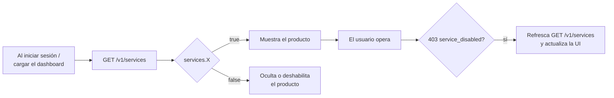

Cada cuenta tiene un **conjunto de servicios habilitados** según su acuerdo
comercial con CBPay. Antes de mostrar un producto en tu UI (o de intentar
usarlo), consulta el mapa efectivo:

```bash
curl https://api.qbank.cl/platform/v1/services \
  -H "Authorization: Bearer <token>"
```

```json
{
  "account_id": "9b1deb4d-3b7d-4bad-9bdd-2b0d7b3dcb6d",
  "services": {
    "payouts": true,
    "payins": true,
    "transfers": true,
    "crypto": true,
    "banking": false,
    "kyc": true,
    "cards": false
  }
}
```

## Catálogo de servicios

| Servicio | Qué habilita |
|---|---|
| `payouts` | Dispersiones fiat (`POST /v1/payouts`, QR scan/confirm) |
| `payins` | Cobros fiat (QR, transferencia, página de pago, collect, CLABE) |
| `transfers` | Transferencias internas entre cuentas CBPay |
| `crypto` | Wallets on-chain y retiros USDT |
| `banking` | Cuentas bancarias internacionales (perfil, cuentas, pagos) |
| `kyc` | Verificación KYC/KYB, rescreening y monitoreo |
| `cards` | Emisión y operación de tarjetas |

## Qué pasa cuando un servicio está apagado

Las **acciones** del producto responden `403 service_disabled`:

```json
{
  "error": "service_disabled",
  "message": "this service is not enabled for your account"
}
```

Reglas importantes:

- **Las lecturas nunca se bloquean**: siempre puedes listar y consultar tus
  operaciones históricas, saldos y movimientos.
- **El dinero en tránsito termina su ciclo**: un payout `processing` se
  completa (o reembolsa) aunque el servicio se apague después.
- Con `cards` apagado, las compras con tarjeta dejan de autorizarse al
  instante y no se generan mensualidades.

## Patrón recomendado en tu integración



1. Consulta `GET /v1/services` al cargar tu aplicación (y cachea unos minutos).
2. Muestra solo los productos en `true`.
3. Aun así, maneja `403 service_disabled` en cualquier acción: la
   configuración puede cambiar entre tu caché y la operación.

<Note>
Los servicios los habilita tu organización según el acuerdo comercial. Si
necesitas activar un producto (por ejemplo `banking` o `cards`), contacta a
tu administrador CBPay — el cambio es inmediato, sin redeploy.
</Note>
