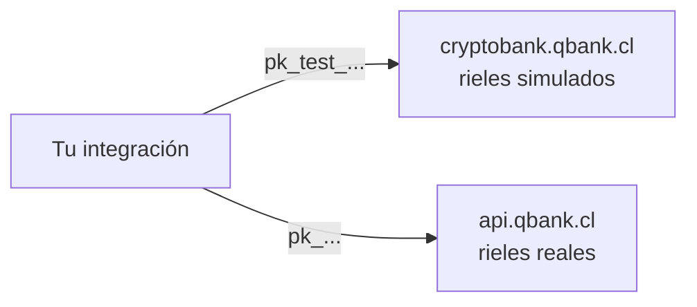

CBPay opera sobre **dos ambientes**: **test** (sandbox, dinero simulado) y
**live** (producción, dinero real). Están completamente aislados — URLs
separadas, API keys separadas, datos separados — y exponen exactamente la
misma API: una integración construida contra test funciona en live
cambiando la base URL y la key.

| | Test (sandbox) | Live (producción) |
|---|---|---|
| Base URL | `https://cryptobank.qbank.cl/platform` | `https://api.qbank.cl/platform` |
| API keys | `pk_test_...` | `pk_...` |
| Dinero | Simulado (nada real se mueve) | **Real e irreversible** |
| Proveedores | Simulador interno — siempre disponible, determinista | Rieles bancarios reales |
| Header de respuesta | `CBPay-Environment: test` | `CBPay-Environment: live` |

<Note>
Las keys jamás cruzan de ambiente: una key `pk_test_` es rechazada por
live y una key `pk_` de live es rechazada por test. No hay ningún flag que
cambiar — el ambiente lo define hacia dónde apuntas tus requests.
</Note>



## Cómo se comporta el ambiente de test

El ambiente de test es **100% autocontenido**: todos los corredores
(payouts, payins, transferencias, crypto, banking, tarjetas, verificación
de identidad) los atiende un simulador interno, así que nunca depende de
que un tercero esté disponible. Las operaciones se resuelven de forma
**determinista**:

- Toda operación que crees se acepta y llega a `completed` a los pocos
  segundos (default ~10s), disparando los mismos webhooks que live.
- Los **valores mágicos** fuerzan cada resultado alternativo, para que
  pruebes tu manejo de errores sin adivinar.

### Valores mágicos

| Producto | Valor | Resultado |
|---|---|---|
| Payouts | Monto terminado en `.99` (ej. `100.99`) | Falla tras el delay (`failed`, saldo reembolsado) |
| Payouts | Monto terminado en `.77` | Queda `processing` para siempre (prueba tu manejo de timeouts) |
| Payouts | Beneficiario con nombre que contenga `REJECT` | Rechazo inmediato |
| Payins (QR / página de pago) | Monto terminado en `.99` | El cobro expira sin pagarse |
| Payins (QR / página de pago) | Monto terminado en `.77` | Queda `pending` para siempre |
| Payins (QR / página de pago) | Cualquier otro monto | Se paga solo tras el delay y acredita tu saldo |
| Collect (cobros pull) | OTP `000000` | Aprueba el cobro; cualquier otro OTP falla |
| Códigos de login / 2FA | `000000` | Válido en todos los canales (SMS, WhatsApp, email) — no se envía ningún mensaje real |
| Verificación de identidad (KYC/KYB) | Nombre o external id que contenga `REJECT` | La verificación termina `rejected` |
| Verificación de identidad (KYC/KYB) | Cualquier otro | Se auto-aprueba tras el delay (los documentos siempre pasan el OCR) |
| Screening AML | Nombre que contenga `SANCTION` | Screening con coincidencias, riesgo `prohibited` |
| Screening AML | Nombre que contenga `PEP` | Screening con coincidencias, riesgo `high` |
| Dirección de retiro crypto | Terminada en `SANC` | Bloqueada por el gate de sanciones |
| Dirección de retiro crypto | Terminada en `HIGH` / `MED` | Evaluada como riesgo alto / medio |
| Retiros crypto | Cualquier dirección (no mágica) | Confirma con un tx id `SIMTX...` tras el delay |

<Tip>
Los **depósitos** crypto en test se acreditan desde el dashboard (o por tu
administrador de plataforma) — no hay chain real desde dónde enviar. Los
retiros, saldos, holds y webhooks se comportan exactamente igual que live.
</Tip>

### Qué difiere de live

- Ningún dinero, tarjeta, email ni SMS real sale jamás del ambiente de test.
- **Las cuentas nacen verificadas**: toda cuenta nueva de test parte con
  `kyc_status: approved`, así puedes ejercitar todos los productos de
  inmediato — sin gate de onboarding. En live las cuentas nacen sin
  verificar y deben completar su KYC/KYB antes de que salga dinero.
- Los catálogos de bancos son ficticios (`Simulated National Bank`, ...).
- Las tasas FX son reales (misma fuente que live), así los montos se ven realistas.
- Los datos de test se refrescan periódicamente desde un snapshot
  sanitizado; trata el dataset de test como desechable.

## Modo test desde el dashboard

El **switch test/live** del dashboard mueve tu sesión entre ambientes con
un click — sin registro aparte ni segundo login. Si tu cuenta aún no existe
en test, se crea automáticamente la primera vez que cambias. Las API keys
se administran por ambiente: crea tus keys `pk_test_` estando en modo test.

## Probar webhooks en desarrollo local

Las callback URLs deben ser **HTTPS públicas**: `localhost`, IPs privadas y
dominios `.local` se rechazan al crear la suscripción. Para desarrollar en
tu máquina usa un túnel HTTPS:

<CodeGroup>

```bash Cloudflare Tunnel (gratis)
# Instala cloudflared y expone tu puerto local
cloudflared tunnel --url http://localhost:3000
# → https://<random>.trycloudflare.com  ← úsala como callback_url
```

```bash ngrok
ngrok http 3000
# → https://<random>.ngrok-free.app  ← úsala como callback_url
```

</CodeGroup>

Luego crea la suscripción con esa URL pública (nota la base URL de test):

```bash
curl -X POST https://cryptobank.qbank.cl/platform/v1/webhooks/subscriptions \
  -H "X-API-Key: pk_test_..." \
  -H "Content-Type: application/json" \
  -d '{
    "event_type": "payin_credited",
    "callback_url": "https://tu-tunel.trycloudflare.com/webhooks/cbpay",
    "secret": "un-secreto-largo-y-aleatorio"
  }'
```

<Tip>
Las entregas fallidas reintentan hasta **5 veces con backoff incremental**,
así que si tu túnel se cae unos minutos no pierdes el evento. Verifica
siempre la firma HMAC — receta completa en
[webhooks](/es/webhooks#verificacion-de-firma).
</Tip>

## Ejercitar cada flujo en test

| Producto | Cómo probarlo |
|---|---|
| Payout | Créalo con cualquier beneficiario; completa en segundos. Usa los montos mágicos para forzar fallas |
| Payin | Crea un cobro QR o página de pago; se paga solo tras el delay y acredita tu saldo |
| Transferencia | Crea una segunda cuenta de test y transfiere entre ambas (gratis) |
| Crypto | Acredita un depósito de test desde el dashboard y retira a cualquier dirección |
| Identidad (KYC/KYB) | Tu propia cuenta ya nace aprobada. Para probar el flujo de verificación, corre verificaciones KYC/KYB de terceros — se auto-aprueban en segundos (`REJECT` en el nombre fuerza el rechazo) |
| AML | Screenea a `John SANCTION` y `Maria PEP` para ejercitar tu manejo de coincidencias |
| Tarjetas | Emite una tarjeta y simula compras desde el dashboard |
| 2FA | Actívalo y usa el código `000000` en todas partes |

## Checklist de go-live

Antes de apuntar tu integración al ambiente live:

- [ ] Cambia la base URL a `https://api.qbank.cl/platform` y la key a tu `pk_...` de live (emitida en modo live).
- [ ] Las API keys viven en un secrets manager (nunca en el frontend ni en el repo).
- [ ] Toda operación de dinero envía un `idempotency_key` derivado de TU id interno (no un UUID aleatorio por intento).
- [ ] Ante timeout o `5xx` **no reintentas con una key nueva**: repite con la misma key o consulta el estado con el `GET`.
- [ ] Verificas la firma HMAC de cada webhook y respondes `2xx` rápido (procesa async).
- [ ] Manejas los estados no finales (`pending`, `processing`) sin asumir éxito — en live la liquidación tarda más que los 10 segundos simulados.
- [ ] Re-creaste tus suscripciones de webhook en live (las de test no se traspasan).
- [ ] Consultas `GET /v1/services` para mostrar solo productos habilitados — ver [servicios](/es/conceptos/servicios).
- [ ] Concilias a diario con `GET /v1/movements` o la [cartola](/es/guias/cartola).
- [ ] Tienes un canal con el equipo CBPay para depósitos `unassigned` o incidentes.

<Warning>
En **live** toda operación es real e irreversible una vez completada. Un
payout `completed` ya está en la cuenta del beneficiario; la única vía de
reversa es fuera de la API (contactar al equipo CBPay).
</Warning>

<AccordionGroup>
  <Accordion title="¿El modo test cuesta algo?">
    No. Las comisiones se cobran contra saldos simulados, así que puedes
    ejercitar toda la lógica de pricing sin gastar dinero real.
  </Accordion>
  <Accordion title="¿Puedo usar mi key de live en test (o al revés)?">
    No. Cada ambiente acepta solo sus propias keys (`pk_test_` en test,
    `pk_` en live). Una key del otro ambiente devuelve `401`.
  </Accordion>
  <Accordion title="¿Cómo sé qué ambiente me respondió?">
    Toda respuesta lleva el header `CBPay-Environment` (`test` o `live`),
    y `GET /healthz` devuelve `livemode`.
  </Accordion>
  <Accordion title="¿Por qué desaparecieron mis datos de test?">
    El dataset de test se refresca periódicamente desde un snapshot
    sanitizado de producción. Reconstruye tus fixtures por API (es barato:
    todo se resuelve en segundos) y trata los datos de test como
    desechables.
  </Accordion>
  <Accordion title="¿Los webhooks se disparan en test?">
    Sí — exactamente los mismos eventos, firmados con el secreto de tu
    suscripción de test. Apúntalos a tu túnel de desarrollo.
  </Accordion>
</AccordionGroup>
