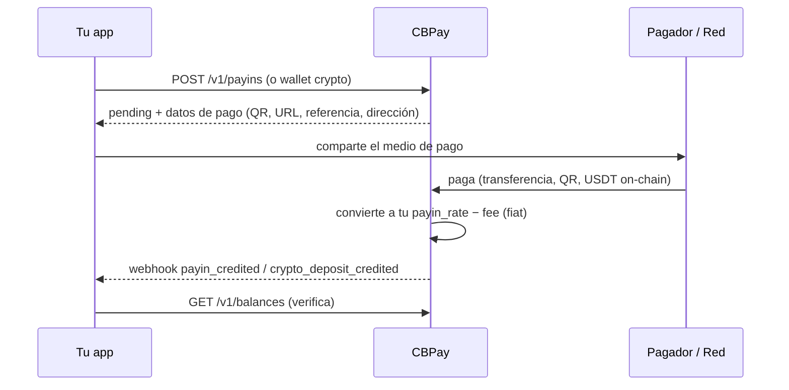
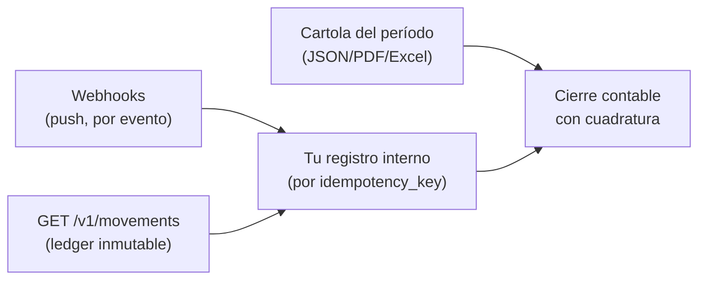
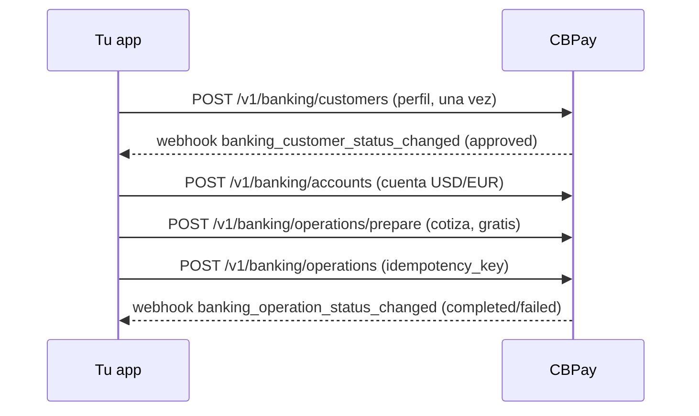

Esta página conecta los productos en **flujos completos de negocio**: qué
llamar, qué esperar y qué webhook cierra cada ciclo. Cada flujo linkea a la
guía detallada de su producto.

## 1. Fondear la cuenta

Tres caminos para que entre dinero; todos terminan en un abono al saldo
USDT y un webhook:



| Camino | Endpoint | Webhook de cierre |
|---|---|---|
| Cobro fiat (QR, transferencia, página de pago, pull) | `POST /v1/payins` / `/collect` | `payin_credited` |
| Depósito USDT on-chain | `POST /v1/crypto/wallets` (dirección fija) | `crypto_deposit_credited` |
| Transferencia interna de otra cuenta | — (la inicia el emisor) | `transfer_received` |

Detalle: [payins](/es/guias/payins) · [crypto](/es/guias/crypto) ·
[transferencias](/es/guias/transferencias).

## 2. Dispersar (payout)

```mermaid
sequenceDiagram
    participant App as Tu app
    participant CB as CBPay
    participant Banco as Riel local
    App->>CB: POST /v1/payouts (idempotency_key)
    CB-->>App: 202 processing (fx_rate, total_debit; débito queda en held)
    CB->>Banco: ejecuta la dispersión
    alt pagado
        Banco-->>CB: confirmación
        CB-->>App: webhook payout_status_changed (completed)
    else rechazo
        Banco-->>CB: rechazo
        CB->>CB: reembolsa el débito COMPLETO a available
        CB-->>App: webhook payout_status_changed (failed + status_code)
    end
    App->>CB: GET /v1/payouts/{id} (verifica estado final)
```

Variante **QR** (Bolivia): `POST /v1/payouts/qr/scan` (gratis, decodifica)
→ muestra los datos → `POST /v1/payouts/qr/confirm` (cobra como un payout
normal). Detalle: [payouts](/es/guias/payouts).

## 3. Cobrar a un cliente

Elige la modalidad según el país y la experiencia que quieras dar:

| Modalidad | Países | Experiencia del pagador | Confirmación |
|---|---|---|---|
| Página de pago hosted | CL | Abre una URL y paga desde su banco | Automática |
| QR | BO, BR (PIX) | Escanea con su app bancaria | Automática |
| Transferencia anunciada | CL, PE, MX, BR | Transfiere incluyendo la referencia | Automática por referencia (o monto) |
| CLABE dedicada | MX | Transfiere a una CLABE fija tuya | Automática, sin referencias |
| Cobro pull (c2p / débito) | VE | Autoriza con OTP y tú ejecutas el cobro | **Síncrona** en la misma llamada |

Todos cierran con `payin_credited` y el abono neto en tu saldo.
Detalle: [payins](/es/guias/payins).

## 4. Conciliar



Receta completa en
[movimientos y conciliación](/es/conceptos/movimientos-y-conciliacion) y
[cartola](/es/guias/cartola).

## 5. Banking internacional end-to-end



El saldo banking vive en tus cuentas bancarias (separado del USDT); CBPay
solo cobra los fees fijos configurados. Detalle:
[banking](/es/guias/banking).

<Tip>
¿Primera integración? Sigue el [inicio rápido](/es/inicio-rapido) (fondeo →
payout → webhook) y vuelve aquí cuando agregues productos.
</Tip>
