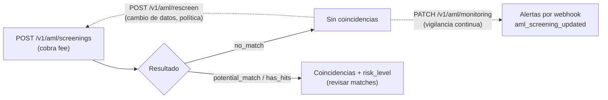

import { EnvUrls } from "/snippets/env-urls.jsx";

<EnvUrls lang="es" />

El **AML screening** contrasta la identidad de una persona o empresa contra
listas globales — sanciones, PEP, prensa adversa — y devuelve el resultado
del análisis con su nivel de riesgo. Es un producto de compliance puro:
**no** verifica la identidad con documentos ni prueba de vida (eso es la
[verificación KYC/KYB](/es/guias/kyc)); analiza si la identidad presenta
riesgo en listas.



<Warning>
**Breaking change (v1.34)**: este producto vivía en `POST /v1/kyc`,
`/v1/kyc/rescreen` y `PATCH /v1/kyc/monitoring`. Esas rutas se **eliminaron**
y ahora son `POST /v1/aml/screenings`, `POST /v1/aml/rescreen` y
`PATCH /v1/aml/monitoring` (misma semántica y mismas comisiones). Las rutas
`/v1/kyc/...` ahora pertenecen a la
[verificación de identidad](/es/guias/kyc), que es otro producto.
</Warning>

<Note>
Si CBPay configuró una comisión de compliance, se debita **antes** de la
llamada (verás `compliance_fee` en la respuesta) y se **reembolsa
automáticamente** si el screening falla. Con comisión 0 el servicio es
gratuito para ti. Requiere tener tu propia
[verificación de identidad aprobada](/es/guias/kyc#tu-propia-verificacion-onboarding).
</Note>

## Catálogos para construir el formulario

Antes de armar el formulario de screening (o de verificación), obtén los
catálogos oficiales con `GET /v1/aml/catalogs`: géneros, estados de empresa,
tipos de dirección, formas jurídicas (globales y en cascada por país),
fuentes de ingreso/patrimonio, estándares de industria con su default por
país, y las listas ISO-3166 de países y subdivisiones. Cada entrada trae
`value` (lo que envías a la API) y `label` (lo que muestras). Es data
estática: puedes cachearla por horas.

```bash
curl https://api.qbank.cl/platform/v1/aml/catalogs \
  -H "Authorization: Bearer <token>"
```

```json
{
  "genders": [ { "value": "male", "label": "Male" } ],
  "company_types_by_country": {
    "CL": [ { "value": "Sociedad por Acciones", "label": "Sociedad por Acciones" } ]
  },
  "industry_code_type_by_country": { "CL": "ISIC" },
  "countries": [ { "value": "CL", "label": "Chile" } ],
  "meta": { "note": "value = send to the API; label = display in the UI." }
}
```

<Tip>
Cascadas: el país de la empresa fija sus formas jurídicas
(`company_types_by_country[país]`, con `company_types` como fallback) y su
estándar de industria (`industry_code_type_by_country[país]`, default ISIC);
con ese estándar tomas los códigos de `industries_by_code_type[estándar]`.
</Tip>

## Enviar el screening

Un solo endpoint para persona y empresa; el tipo se detecta del payload
(las demás diferencias entre ambos tipos de cuenta están en
[personas y empresas](/es/conceptos/personas-y-empresas)):

<CodeGroup>

```bash Persona
curl -X POST https://api.qbank.cl/platform/v1/aml/screenings \
  -H "Authorization: Bearer <token>" \
  -H "Content-Type: application/json" \
  -d '{
    "customer": {
      "person": {
        "full_name": "Ana Pérez Rojas",
        "date_of_birth": { "year": 1990, "month": 4, "day": 12 },
        "personal_identification": [
          { "issuing_country": "CL", "number": "12.345.678-5" }
        ]
      },
      "email": "ana@ejemplo.com",
      "country": "CL"
    },
    "monitor": false
  }'
```

```bash Empresa
curl -X POST https://api.qbank.cl/platform/v1/aml/screenings \
  -H "Authorization: Bearer <token>" \
  -H "Content-Type: application/json" \
  -d '{
    "customer": {
      "company": {
        "legal_name": "Comercial Andina SpA",
        "registration_authority_identification": "76.543.210-8"
      },
      "email": "legal@andina.cl",
      "country": "CL"
    },
    "monitor": true
  }'
```

```bash Mínimo (autocompletado con tu cuenta)
curl -X POST https://api.qbank.cl/platform/v1/aml/screenings \
  -H "Authorization: Bearer <token>" \
  -H "Content-Type: application/json" \
  -d '{ "customer": {}, "monitor": false }'
```

</CodeGroup>

Si omites `person`/`company`, se completa con los datos de tu cuenta (el
tipo persona/empresa se toma del tipo de la cuenta).

## Envía toda la identidad que tengas (recomendado)

El objeto `customer` acepta **muchos más campos, todos opcionales**, y se
reenvían íntegros al motor de screening: **mientras más datos de identidad
envíes, más preciso es el análisis** — la fecha de nacimiento, los países y
los documentos fuertes descartan homónimos y reducen falsos positivos.

| Campo (persona) | Qué es |
|---|---|
| `full_name` — o `first_name` / `middle_name` / `last_name` | Nombre completo o por partes |
| `date_of_birth` | SOLO como objeto `{ "year": 1990, "month": 4, "day": 12 }` (el string `"YYYY-MM-DD"` se rechaza con `422`) |
| `nationality` | Nacionalidades como **array** de códigos ISO-3166, ej. `["CL"]` (un string suelto se rechaza con `422`) |
| `country_of_birth` | País de nacimiento |
| `residential_information[]` | Domicilios, cada uno con `country_of_residence` |
| `personal_identification[]` | Documentos fuertes: `{ "issuing_country", "number" }` (cédula, pasaporte, RUT…) — **sin** campo `type` (el motor lo rechaza) |
| `alias` / `aliases` | Otros nombres conocidos |

| Campo (empresa) | Qué es |
|---|---|
| `legal_name` | Razón social |
| `alias[]` | Nombres comerciales / de fantasía |
| `registration_authority_identification` | Identificador tributario/mercantil (RUT, número de registro) |
| `place_of_registration` | País de registro/constitución (ISO-3166) |
| `incorporation_date` | Fecha de constitución como objeto `{ "year": 2015, "month": 8, "day": 1 }` |
| `address[]` | Domicilios, cada uno con `country` |

<Warning>
El motor de screening es estricto con los shapes y rechaza con `422` lo que
no calza: en `company` no envíes campos planos tipo `tax_id`,
`registration_number` ni `country_of_incorporation` (el identificador va en
`registration_authority_identification` y el país en
`place_of_registration`); en `person`, `date_of_birth` va SOLO como objeto
`{year, month, day}`, `nationality` como array y
`personal_identification[]` sin campo `type` (verificado en vivo
2026-07-18).
</Warning>

<Note>
Una consulta con **exactamente los mismos datos de identidad** reutiliza el
screening anterior (no se cobra uno nuevo). Agregar o cambiar campos de
identidad (nombre, fecha, país, documento, alias) hace la búsqueda más
específica y ejecuta — y cobra — un screening nuevo. Los campos cosméticos
(email, teléfono, dirección textual) no cambian el matching.
</Note>

Respuesta `201` — persona y empresa devuelven la misma forma; cambia
`compliance_service` (`compliance_person` vs `compliance_company`, cada uno
con su comisión):

<CodeGroup>

```json Persona
{
  "customer_id": "cus_8f2e1a…",
  "status": "screened",
  "risk_level": "low",
  "screening_result": "no_match",
  "compliance_service": "compliance_person",
  "compliance_fee": "0.500000"
}
```

```json Empresa
{
  "customer_id": "cus_5b7c33…",
  "status": "screened",
  "risk_level": "medium",
  "screening_result": "potential_match",
  "compliance_service": "compliance_company",
  "compliance_fee": "1.000000"
}
```

</CodeGroup>

## Rescreening

Re-ejecuta el análisis de la misma identidad (por ejemplo, ante un cambio de
datos o por política periódica). No lleva body — usa el `customer_id` de tu
screening anterior:

```bash
curl -X POST https://api.qbank.cl/platform/v1/aml/rescreen \
  -H "Authorization: Bearer <token>"
```

Respuesta `200` (cobra `compliance_rescreen`, si está configurada):

```json
{
  "customer_id": "cus_8f2e1a…",
  "status": "screened",
  "risk_level": "low",
  "screening_result": "no_match",
  "compliance_service": "compliance_rescreen",
  "compliance_fee": "0.250000"
}
```

Requiere haber enviado un screening antes; si no, `409 no_screening`.

## Monitoreo continuo

Activa (o desactiva) la vigilancia permanente de la identidad — cambios en
listas, PEP, prensa adversa. Las novedades llegan por el webhook
`aml_screening_updated`:

<CodeGroup>

```bash Activar (cobra compliance_monitoring)
curl -X PATCH https://api.qbank.cl/platform/v1/aml/monitoring \
  -H "Authorization: Bearer <token>" \
  -H "Content-Type: application/json" \
  -d '{ "enabled": true }'
```

```bash Desactivar (siempre gratis)
curl -X PATCH https://api.qbank.cl/platform/v1/aml/monitoring \
  -H "Authorization: Bearer <token>" \
  -H "Content-Type: application/json" \
  -d '{ "enabled": false }'
```

</CodeGroup>

Respuesta `200`:

```json
{
  "customer_id": "cus_8f2e1a…",
  "monitoring": true,
  "compliance_service": "compliance_monitoring",
  "compliance_fee": "0.100000"
}
```

Al desactivar, `compliance_fee` vuelve `"0.000000"` — desactivar es
siempre gratis.

## Informe PDF del screening

Cada screening de tu historial puede descargarse como **informe PDF
ejecutivo** con tu branding: portada con la decisión y su semáforo de
riesgo, indicadores (sanciones, watchlists, PEP, terrorismo, narcóticos,
prensa adversa, fraude, corrupción, armas), las coincidencias consolidadas
con sus listas y vínculos, alias, glosario de señales y una sección final
de respaldo con las fuentes internacionales consultadas. Es el documento
que entregas a un auditor o a una contraparte como evidencia del análisis.

Primero ubica el `screening_id` en tu historial:

```bash
curl "https://api.qbank.cl/platform/v1/aml/screenings?from=2026-07-01&to=2026-07-14&page=1&page_size=50" \
  -H "Authorization: Bearer <token>"
```

Y descarga el informe (lectura pura — sin comisión ni clave de
idempotencia):

<CodeGroup>

```bash Inglés (default)
curl "https://api.qbank.cl/platform/v1/aml/screenings/a1b2c3d4-e5f6-7890-abcd-ef1234567890/report" \
  -H "Authorization: Bearer <token>" \
  -o informe_aml.pdf
```

```bash Español
curl "https://api.qbank.cl/platform/v1/aml/screenings/a1b2c3d4-e5f6-7890-abcd-ef1234567890/report?lang=es" \
  -H "Authorization: Bearer <token>" \
  -o informe_aml.pdf
```

```bash Chino
curl "https://api.qbank.cl/platform/v1/aml/screenings/a1b2c3d4-e5f6-7890-abcd-ef1234567890/report?lang=zh" \
  -H "Authorization: Bearer <token>" \
  -o informe_aml.pdf
```

</CodeGroup>

La respuesta es `application/pdf` con `Content-Disposition` y nombre de
archivo descriptivo. `lang` acepta `en` (default), `es` y `zh`; otro valor
devuelve `400 invalid_language`. Un `screening_id` de otra cuenta devuelve
`404`.

<Note>
El informe se genera desde la evidencia persistida del screening, por lo
que siempre está disponible aunque el motor de compliance esté caído. Los
datos del análisis (nombres de listas, títulos de prensa) se muestran en su
idioma original; solo las etiquetas del informe se traducen.
</Note>

## Webhook

| Evento | Cuándo |
|---|---|
| `aml_screening_updated` | El screening terminó, un caso cambió, el riesgo cambió o una transacción monitoreada fue revisada |

Payload de ejemplo:

```json
{
  "account_id": "9b1deb4d-3b7d-4bad-9bdd-2b0d7b3dcb6d",
  "screening_event": "compliance_risk_changed",
  "customer_id": "cus_8f2e1a…",
  "data": { "risk_level": "high" }
}
```

Suscríbete igual que al resto de eventos (ver [Webhooks](/es/webhooks)).

## Errores

| HTTP | `error` | Causa | Solución |
|---|---|---|---|
| 400 | `invalid_language` | `lang` del informe PDF no es `en`, `es` ni `zh` | Usa uno de los tres idiomas soportados |
| 402 | `insufficient_funds` | Saldo insuficiente para la comisión de compliance | Fondea la cuenta y reintenta |
| 403 | `verification_required` | Tu cuenta aún no aprobó su verificación de identidad | Completa tu [onboarding](/es/guias/kyc#tu-propia-verificacion-onboarding) |
| 403 | `service_disabled` | El servicio `aml` está deshabilitado para tu cuenta | Contacta a tu operador |
| 409 | `no_screening` | Rescreen/monitoreo sin un screening previo | Envía primero `POST /v1/aml/screenings` |
| 502 | `compliance_unavailable` | Servicio temporalmente no disponible (la comisión se reembolsó) | Reintenta más tarde |

## Preguntas frecuentes

<AccordionGroup>
<Accordion title="¿Cuál es la diferencia entre AML screening y la verificación KYC/KYB?">
El screening contrasta una identidad contra listas (sanciones, PEP, prensa
adversa) — no pide documentos. La [verificación KYC/KYB](/es/guias/kyc)
comprueba que la persona/empresa es quien dice ser, con formulario,
documentos y prueba de vida en video. Se complementan: verifica la identidad
con KYC/KYB y vigila su riesgo con AML.
</Accordion>
<Accordion title="¿Puedo screenear a mis propios clientes?">
Sí: el objeto `customer` acepta cualquier identidad, no solo la de tu
cuenta. Cada screening cobra su comisión (persona o empresa según el
payload).
</Accordion>
<Accordion title="¿El screening cambia el estado de verificación de mi cuenta?">
No. Desde v1.34 el `kyc_status` de tu cuenta lo maneja exclusivamente la
verificación de identidad KYC/KYB (tu onboarding). El screening solo evalúa
riesgo en listas.
</Accordion>
<Accordion title="¿Por qué un screening antiguo no aparece en el historial ni tiene informe PDF?">
El historial y el informe PDF se generan desde la evidencia persistida de
cada screening, disponible para las operaciones ejecutadas desde que el
historial existe (v1.55). Los screenings anteriores a esa versión no tienen
evidencia persistida, por lo que no aparecen en `GET /v1/aml/screenings` ni
pueden descargar informe. Si necesitas el documento, ejecuta un screening
nuevo de la misma identidad (si los datos son idénticos, reutiliza el
resultado sin cobrar de nuevo) y descarga su informe.
</Accordion>
</AccordionGroup>
