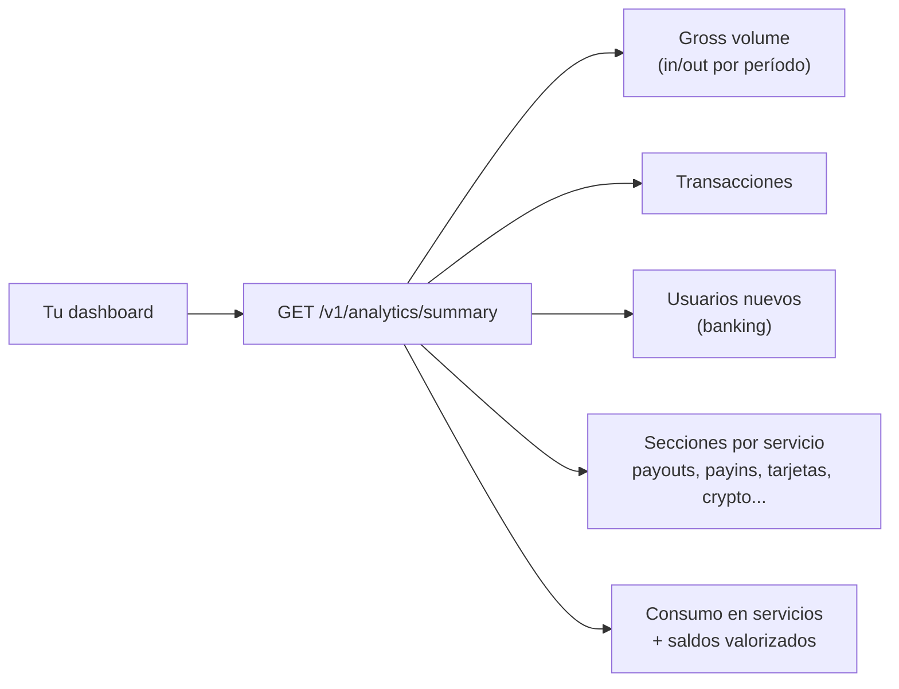

import { EnvUrls } from "/snippets/env-urls.jsx";

<EnvUrls lang="es" />

`GET /v1/analytics/summary` entrega en **una sola llamada** todo lo que
necesita la página de resumen de tu cuenta (persona o empresa): series
temporales listas para graficar, el detalle de cada servicio con todas sus
dimensiones (país, moneda, método, estado, chain, comercio), lo que
gastaste en servicios y tus saldos valorizados.



## Petición

```bash
curl "https://api.qbank.cl/platform/v1/analytics/summary?from=2026-07-01&to=2026-07-10&granularity=day" \
  -H "Authorization: Bearer <token>"
```

| Parámetro | Requerido | Descripción |
|---|---|---|
| `from` / `to` | Sí | Rango `YYYY-MM-DD` en UTC, ambos inclusive; máximo 366 días |
| `granularity` | No | `day` (default), `week` (semanas lunes-domingo) o `month` |

Solo ves los datos de **tu propia cuenta**. Todos los montos van como
strings decimales en USD; los buckets sin actividad vienen **rellenos con
ceros** para graficar directo.

## Bloques globales (los KPI del header y los 3 gráficos principales)

```json
{
  "gross_volume": {
    "in": "636936.87",
    "out": "270118.87",
    "total": "907055.74",
    "series": [
      { "date": "2026-07-01", "in": "51023.10", "out": "31210.44", "total": "82233.54" }
    ],
    "previous_period": { "in": "512300.00", "out": "241000.10", "total": "753300.10" },
    "change_pct": "20.41",
    "unpriced_assets": []
  },
  "transactions": {
    "total": 92,
    "series": [ { "date": "2026-07-01", "in": 3, "out": 5, "total": 8 } ],
    "previous_period": { "total": 71 },
    "change_pct": "29.58"
  },
  "new_users": {
    "total": 11,
    "series": [ { "date": "2026-07-01", "count": 1 } ],
    "previous_period": { "total": 6 },
    "change_pct": "83.33"
  }
}
```

- **`gross_volume`**: valor USD de todo lo que ENTRÓ (payins, depósitos
  crypto, transferencias recibidas) y SALIÓ (payouts, retiros,
  transferencias enviadas, compras con tarjeta). Los reembolsos se netean
  contra su servicio — jamás inflan el volumen. Los swaps son conversión
  interna y tienen su propia sección.
- **`transactions`**: conteo de operaciones (sin fees ni reembolsos).
- **`new_users`**: usuarios banking de terceros que tu empresa dio de alta
  (para cuentas persona la serie va en cero).
- **`change_pct`**: variación contra el período inmediatamente anterior del
  mismo largo — para los deltas ▲▼ (es `null` si el período anterior fue 0).
- Los saldos en `BTC`/`GOLD` se valorizan al precio referencial vigente; si
  un precio no está disponible, el asset aparece en `unpriced_assets` y sus
  montos quedan fuera del USD (nunca inventamos un precio).

## `by_country` — vista global por país

Payouts y payins combinados, ordenados por volumen — para el mapa o las
barras por país:

```json
"by_country": [
  {
    "country": "BR",
    "payouts": { "count": 18, "volume_usd": "3410.20" },
    "payins":  { "count": 4,  "volume_usd": "820.00" },
    "total_usd": "4230.20"
  }
]
```

## `sections` — el detalle de CADA servicio

Cada sección trae totales, su serie por bucket y sus dimensiones propias:

<AccordionGroup>
<Accordion title="payouts — envíos fiat">

```json
"payouts": {
  "count": 24, "volume_usd": "5120.40", "fees_usd": "7.20",
  "series": [ { "date": "2026-07-01", "count": 3 } ],
  "by_status": [ { "key": "completed", "count": 21, "volume_usd": "4980.10" } ],
  "by_country": [
    { "country": "BR", "count": 18, "volume_usd": "3410.20", "local_volume": { "BRL": "17550" } }
  ],
  "by_method": [ { "key": "pix", "count": 18, "volume_usd": "3410.20" } ]
}
```

`by_status` te da el success rate; `by_country` incluye el volumen en
moneda local por cada moneda; `by_method` separa pix, bank_transfer, yape,
etc. Los fallidos quedan fuera del volumen (fueron reembolsados).

</Accordion>
<Accordion title="payins — cobros fiat">

```json
"payins": {
  "count": 9, "volume_usd": "2210.00", "fees_usd": "0.00",
  "series": [ { "date": "2026-07-02", "count": 2 } ],
  "by_country": [ { "key": "BO", "count": 5, "volume_usd": "1400.00" } ],
  "by_method": [ { "key": "qr", "count": 5, "volume_usd": "1400.00" } ],
  "by_kind":   [ { "key": "qr", "count": 5, "volume_usd": "1400.00" } ]
}
```

Solo cuentan los payins **acreditados**.

</Accordion>
<Accordion title="deposits / withdrawals — crypto on-chain">

```json
"deposits": {
  "count": 3, "volume_usd": "1500.00",
  "series": [ { "date": "2026-07-03", "count": 1 } ],
  "by_chain": [ { "chain": "tron", "asset": "USDT", "count": 2, "amount": "1000.000000" } ]
},
"withdrawals": {
  "count": 2, "volume_usd": "600.00",
  "series": [ { "date": "2026-07-04", "count": 1 } ],
  "by_chain": [ { "chain": "eth", "asset": "USDC", "count": 1, "status": "completed", "amount": "500.000000", "fees": "1.000000" } ]
}
```

</Accordion>
<Accordion title="transfers, swaps y cards">

```json
"transfers": {
  "in":  { "count": 4, "volume_usd": "300.00" },
  "out": { "count": 2, "volume_usd": "120.00" },
  "series": [ { "date": "2026-07-01", "count": 1 } ]
},
"swaps": {
  "count": 5, "volume_usd": "890.00",
  "series": [ { "date": "2026-07-05", "count": 2 } ],
  "by_pair": [ { "pair": "USDT/BTC", "count": 3, "volume_usd": "600.00" } ]
},
"cards": {
  "count": 12, "volume_usd": "230.50", "fees_usd": "5.00", "active_cards": 1,
  "series": [ { "date": "2026-07-06", "count": 4 } ],
  "by_status": [ { "status": "settled", "count": 10, "volume_usd": "205.00" } ],
  "top_merchants": [ { "merchant": "AMAZON", "count": 4, "volume_usd": "98.20" } ]
}
```

</Accordion>
<Accordion title="banking, verifications (KYC/KYB), aml y contacts">

```json
"banking": {
  "new_third_parties": 11,
  "third_parties_series": [ { "date": "2026-07-01", "count": 1 } ],
  "new_accounts": 14,
  "accounts_series": [ { "date": "2026-07-01", "count": 2 } ],
  "operations": 6,
  "volume": {
    "in":  { "count": 4, "volume_usd": "1200.00" },
    "out": { "count": 9, "volume_usd": "3450.00" },
    "series": [ { "date": "2026-07-01", "count": 2 } ],
    "volume_usd": "4650.00"
  },
  "fees_usd": "18.00",
  "fees_by_service": { "banking_customer": { "count": 11, "fees_usd": "11.00" } }
},
"verifications": {
  "submissions": [ { "kind": "kyc", "status": "approved", "count": 3 } ],
  "links":       [ { "kind": "kyb", "status": "pending", "count": 1 } ],
  "fees_usd": "9.00",
  "fees_by_kind": {
    "kyc_verification": { "count": 3, "fees_usd": "6.00" },
    "kyb_verification": { "count": 1, "fees_usd": "3.00" }
  }
},
"aml": { "screenings": 4, "fees_usd": "2.00", "by_service": { "compliance_screening": { "count": 4, "fees_usd": "2.00" } } },
"contacts": { "new_contacts": 7, "series": [ { "date": "2026-07-02", "count": 2 } ] },
"adjustments": { "count": 2, "volume_usd": "2000.00", "series": [ { "date": "2026-03-14", "count": 1 } ] }
```

La sección `deposits` incluye además `wallet_fees_usd` (los fees de
creación de wallets del producto crypto), y en `balances.items` los saldos
espejo de banking llevan `custody: "banking"` (el saldo autoritativo vive
en el banco).

`new_third_parties` es la misma métrica del gráfico "usuarios nuevos":
los usuarios banking que tu empresa dio de alta.

`banking.volume` es el dinero movido por tus cuentas bancarias (entrante y
saliente, valorizado a USD): también suma al `gross_volume` global de la
cuenta, y su detalle cuadra en las secciones `BANK_USD`/`BANK_EUR` de la
[cartola](/es/guias/cartola).

</Accordion>
</AccordionGroup>

## `spending` — lo que consumiste en servicios

Todos los fees explícitos que pagaste en el período, con cuántas veces se
cobró cada servicio:

```json
"spending": {
  "total_usd": "34.50",
  "by_service": {
    "banking_customer": { "count": 11, "fees_usd": "11.00" },
    "wallet_creation":  { "count": 2,  "fees_usd": "1.00" },
    "verification_kyc": { "count": 3,  "fees_usd": "9.00" }
  }
}
```

## `balances` — tus saldos valorizados

```json
"balances": {
  "items": [
    { "asset": "USDT", "available": "1520.250000", "held": "0.000000", "usd_estimate": "1520.25" },
    { "asset": "BTC",  "available": "0.00500000",  "held": "0.00000000", "usd_estimate": "313.68" }
  ],
  "net_worth_usd_estimate": "1833.93"
}
```

## Evolución del saldo — `GET /v1/balances/history`

Para la tarjeta de saldo con gráfico (el "balance de los últimos 30 días"
con su ▲▼): una serie **diaria** por asset con el saldo de cierre de cada
día, más la serie agregada en USD y las entradas/salidas del período.

```bash
curl "https://api.qbank.cl/platform/v1/balances/history?from=2026-06-12&to=2026-07-11" \
  -H "Authorization: Bearer <token>"
```

| Parámetro | Requerido | Descripción |
|---|---|---|
| `from` / `to` | Sí | Rango `YYYY-MM-DD` en UTC, ambos inclusive; máximo 366 días |

```json
{
  "account_id": "9b1deb4d-3b7d-4bad-9bdd-2b0d7b3dcb6d",
  "from": "2026-06-12",
  "to": "2026-07-11",
  "granularity": "day",
  "timezone": "UTC",
  "assets": {
    "USDT": {
      "series": [
        { "date": "2026-06-12", "balance": "100.000000" },
        { "date": "2026-06-13", "balance": "100.000000" },
        { "date": "2026-07-11", "balance": "125.430000" }
      ],
      "first": "100.000000",
      "last": "125.430000",
      "change_pct": "25.43"
    },
    "BTC": {
      "series": [
        { "date": "2026-06-12", "balance": "0.00060000" },
        { "date": "2026-07-11", "balance": "0.00060000" }
      ],
      "first": "0.00060000",
      "last": "0.00060000",
      "change_pct": "0.00"
    },
    "BANK_USD": {
      "series": [
        { "date": "2026-06-12", "balance": "1500.00" },
        { "date": "2026-07-11", "balance": "1725.50" }
      ],
      "first": "1500.00",
      "last": "1725.50",
      "change_pct": "15.03"
    }
  },
  "total_usd": {
    "series": [
      { "date": "2026-06-12", "balance_usd": "163.73" },
      { "date": "2026-07-11", "balance_usd": "191.34" }
    ],
    "first": "163.73",
    "last": "191.34",
    "change_pct": "16.86",
    "spot_priced_dates": [],
    "unpriced_assets": []
  },
  "period": { "in_usd": "280.20", "out_usd": "254.77", "net_usd": "25.43" },
  "current": {
    "items": [
      { "asset": "USDT", "available": "125.430000", "held": "10.000000", "usd_estimate": "135.43" },
      { "asset": "BTC", "available": "0.00060000", "held": "0.00000000", "usd_estimate": "65.91" }
    ],
    "net_worth_usd_estimate": "201.34"
  }
}
```

- Cada punto es el **saldo disponible al cierre del día** (UTC); los días
  sin movimientos arrastran el saldo del día anterior, así la serie queda
  lista para graficar sin huecos.
- `assets` incluye también los espejos de las cuentas banking (`BANK_USD`,
  `BANK_EUR`) como serie propia en su moneda (2 decimales) — útiles para un
  chip "Bank USD"/"Bank EUR" en el gráfico. **No** entran al agregado
  `total_usd`, que cubre solo los saldos operativos.
- `total_usd` valoriza BTC/GOLD al **precio histórico de cada día**. Si un
  día aún no tiene precio histórico se usa el spot de hoy y ese día se
  declara en `spot_priced_dates` (jamás inventamos valores).
- `period.in_usd`/`out_usd` son las entradas y salidas totales del rango
  (misma clasificación que `gross_volume`) — el "↗ $280.2K ↘ −$254.8K" de
  la tarjeta.
- `current` es el snapshot de hoy con `available` **y** `held` (la serie
  histórica solo refleja el disponible: las retenciones no tienen historia).

## Evolución de tus tasas — `GET /v1/rates/history`

La serie temporal de las tasas de cambio de **tu cuenta** (las mismas de
`GET /v1/rates`, con tu configuración ya aplicada) para el gráfico de
evolución con su "+3.4% / −3.0%":

```bash
curl "https://api.qbank.cl/platform/v1/rates/history?from=2026-06-12&to=2026-07-11&granularity=day" \
  -H "Authorization: Bearer <token>"
```

| Parámetro | Requerido | Descripción |
|---|---|---|
| `from` / `to` | Sí | Rango `YYYY-MM-DD` en UTC, ambos inclusive |
| `granularity` | No | `day` (default, máx 366 días) o `hour` (máx 31 días) |
| `currency` | No | Filtra una moneda (ej. `CLP`) |

```json
{
  "base": "USD",
  "from": "2026-06-12",
  "to": "2026-07-11",
  "granularity": "day",
  "rates": {
    "chile": {
      "currency": "CLP",
      "series": [
        { "date": "2026-06-12", "rate": "939.068965", "payin_rate": "967.452325" },
        { "date": "2026-07-11", "rate": "910.896551", "payin_rate": "938.428400" }
      ],
      "first": "939.068965",
      "last": "910.896551",
      "change_pct": "-3.00"
    }
  },
  "asset_prices": {
    "BTC": {
      "currency": "USD",
      "unit": "btc",
      "series": [
        { "date": "2026-06-12", "price": "106214.55" },
        { "date": "2026-07-11", "price": "109853.24" }
      ],
      "first": "106214.55",
      "last": "109853.24",
      "change_pct": "3.43"
    }
  },
  "retrieved_at": "2026-07-11T15:00:00Z"
}
```

- `rate` es la punta de payouts y `payin_rate` la de depósitos — las
  mismas dos tasas del snapshot actual, punto por punto.
- `change_pct` viene con signo (`"3.43"` sube, `"-3.00"` baja): úsalo
  directo para colorear el badge verde/rojo.
- Los buckets sin datos arrastran el último valor conocido; los días
  previos al inicio del historial simplemente no aparecen.

## Errores

| HTTP | `error` | Qué hacer |
|---|---|---|
| 400 | `invalid_range` | `from`/`to` son obligatorios (`YYYY-MM-DD`), y el rango máximo es 366 días |
| 400 | `invalid_granularity` | Usa `day`, `week` o `month` (en los historiales: `day` o `hour`) |
| 403 | `account_required` | El endpoint requiere credencial de cuenta |
| 502 | `rates_unavailable` | Historial de tasas temporalmente no disponible; reintenta en unos segundos |

## FAQ

<AccordionGroup>
<Accordion title="¿En qué zona horaria están los buckets?">
UTC, igual que los filtros `from`/`to` de toda la API. Si tu front muestra
otra zona, convierte las etiquetas al renderizar.
</Accordion>
<Accordion title="¿Qué cuenta como volumen y qué no?">
Entra todo lo que movió plata hacia/desde tu cuenta: payins, depósitos
crypto y transferencias recibidas (in); payouts, retiros, transferencias
enviadas y compras con tarjeta (out). Los reembolsos se netean, los fees se
reportan aparte en `spending`, y los swaps (conversión entre tus propios
saldos) tienen su sección propia.
</Accordion>
<Accordion title="¿Cómo se valorizan BTC y GOLD?">
Al precio referencial vigente al momento de la consulta (el mismo de
`GET /v1/rates`). Es una valorización de exhibición: si el precio no está
disponible, el asset aparece en `unpriced_assets` y no se suma al USD.
</Accordion>
<Accordion title="¿Los totales cuadran con la cartola?">
Sí: ambos salen del mismo ledger. La cartola (`GET /v1/reports/statement`)
es el documento contable línea a línea; el analytics es la vista agregada
para gráficos.
</Accordion>
<Accordion title="¿Cada cuánto se actualiza?">
En tiempo real: cada operación acreditada aparece en la siguiente llamada.
</Accordion>
<Accordion title="¿Desde cuándo hay historial de tasas?">
El historial de tasas se registra continuamente (cada vez que la tasa
cambia) e incluye un backfill inicial de ~90 días de tasas diarias. Si
pides un rango anterior al inicio del historial, esos días simplemente no
aparecen en la serie — nunca se inventan valores.
</Accordion>
<Accordion title="¿El historial de saldo incluye las retenciones (held)?">
No: la serie refleja el saldo disponible al cierre de cada día. Las
retenciones (payouts en vuelo, holds de tarjeta) no tienen historia; el
`held` vigente viene en el bloque `current`.
</Accordion>
<Accordion title="¿Por qué la variación de mi tasa difiere de la del mercado?">
No difiere: tu tasa se deriva de la de mercado con tu configuración
comercial, que es un factor constante — la variación porcentual es la
misma. Lo que ves graficado es exactamente lo que habrías obtenido
operando cada día.
</Accordion>
</AccordionGroup>
