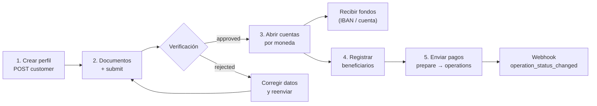

Banking te da **cuentas bancarias reales** a nombre de tu perfil verificado:
recibes fondos por rieles internacionales (SEPA, SWIFT, ACH según la
moneda), mantienes saldo en moneda fiat y envías pagos a terceros. Es un
producto distinto de tu saldo USDT: **el dinero de banking vive en tus
cuentas bancarias**, no en el saldo CBPay.

| Concepto | Dónde vive | Se consulta con |
|---|---|---|
| Saldo USDT CBPay | Ledger CBPay | `GET /v1/balances` |
| Saldos bancarios | Tus cuentas bancarias | `GET /v1/banking/accounts/{id}/balance` |

<Note>
Las comisiones de banking (`banking_customer`, `banking_account`,
`banking_operation`) son fijas, se debitan de tu **saldo USDT** al ejecutar
cada operación y se **reembolsan automáticamente** si la operación falla.
Con comisión 0 (el default) el servicio es gratis. El campo `banking_fee`
de cada respuesta te muestra lo cobrado.
</Note>

## El flujo completo



1. **Crea tu perfil bancario** (`POST /v1/banking/customer`) — una sola vez.
2. **Sube documentos** de verificación y **envíalo a revisión**.
3. Cuando quede `approved`, **abre cuentas** por moneda.
4. **Registra beneficiarios** (counterparties) para pagos a terceros.
5. **Envía pagos**: cotiza con `prepare` y ejecuta con `operations`.

Los cambios de estado te llegan por los webhooks
`banking_customer_status_changed` y `banking_operation_status_changed`
([webhooks](/es/webhooks)).

## 1. Crea tu perfil bancario

Una vez por cuenta. Si no envías `type`, `name` o `email`, se completan con
los datos de tu cuenta CBPay:

```bash
curl -X POST https://api.qbank.cl/platform/v1/banking/customer \
  -H "Authorization: Bearer <token>" \
  -H "Content-Type: application/json" \
  -d '{
    "currency": "USD",
    "address": { "countryIso": "CL", "city": "Santiago" }
  }'
```

Respuesta `201`:

```json
{
  "customer_id": "9f2b…",
  "provider_id": "…",
  "status": "draft",
  "data": { "item": { "…": "…" } },
  "created_at": "2026-07-07T12:00:00Z",
  "banking_fee": "5.000000"
}
```

Si tu cuenta ya tiene perfil bancario — `409 banking_customer_exists`.
Consulta el estado en cualquier momento:

```bash
curl https://api.qbank.cl/platform/v1/banking/customer \
  -H "Authorization: Bearer <token>"
```

## 2. Documentos y verificación

Sube cada documento en base64 (gratis):

```bash
curl -X POST https://api.qbank.cl/platform/v1/banking/customer/documents \
  -H "Authorization: Bearer <token>" \
  -H "Content-Type: application/json" \
  -d '{
    "type": "PASSPORT",
    "filename": "pasaporte.pdf",
    "attach": "<contenido en base64>"
  }'
```

Y envía el perfil a revisión (gratis):

```bash
curl -X POST https://api.qbank.cl/platform/v1/banking/customer/submit \
  -H "Authorization: Bearer <token>"
```

Estados del perfil: `draft` → `submitted` → `under_review` →
**`approved`** o `rejected`. El webhook
`banking_customer_status_changed` te avisa cada cambio:

```json
{
  "account_id": "…",
  "customer_id": "9f2b…",
  "kyc_status": "approved"
}
```

## 3. Abre cuentas bancarias

Con el perfil `approved`, crea una cuenta por moneda. Monedas disponibles:
**USD** (rieles ACH/Fedwire/SWIFT) y **EUR** (SEPA/SWIFT):

<CodeGroup>

```bash Cuenta USD
curl -X POST https://api.qbank.cl/platform/v1/banking/accounts \
  -H "Authorization: Bearer <token>" \
  -H "Content-Type: application/json" \
  -d '{ "currency": "USD", "name": "Operativa USD" }'
```

```bash Cuenta EUR
curl -X POST https://api.qbank.cl/platform/v1/banking/accounts \
  -H "Authorization: Bearer <token>" \
  -H "Content-Type: application/json" \
  -d '{ "currency": "EUR", "name": "Operativa EUR" }'
```

</CodeGroup>

Respuesta `201` — `data` incluye los datos para **recibir** (número de
cuenta/IBAN, routing, banco):

```json
{
  "account_id": "c4d1…",
  "provider_id": "…",
  "status": "active",
  "data": { "…": "…" },
  "banking_fee": "1.000000"
}
```

Lista tus cuentas y consulta saldo:

```bash
curl https://api.qbank.cl/platform/v1/banking/accounts \
  -H "Authorization: Bearer <token>"

curl https://api.qbank.cl/platform/v1/banking/accounts/c4d1…/balance \
  -H "Authorization: Bearer <token>"
```

## 4. Registra beneficiarios

Para pagar a terceros, primero registra al beneficiario con sus datos
bancarios (gratis; pasa por moderación antes de poder usarse):

```bash
curl -X POST https://api.qbank.cl/platform/v1/banking/counterparties \
  -H "Authorization: Bearer <token>" \
  -H "Content-Type: application/json" \
  -d '{
    "description": "Proveedor ACME",
    "profile": {
      "name": "ACME LLC",
      "address": { "addressLine1": "1 Main St", "city": "New York", "stateIso": "NY", "countryIso": "US", "postalCode": "10001" },
      "additionalInfo": { "type": "CORPORATION" }
    },
    "accounts": [
      {
        "currencyCode": "USD",
        "bank": { "name": "Test Bank", "number": "011000138" },
        "fiat": {
          "number": "0532013000",
          "routingNumber": "011000138",
          "additionalInformation": { "type": "TYPE_FIAT_US", "accountType": "CHECKING", "supportedRails": ["ACH"] }
        }
      }
    ]
  }'
```

Lista los tuyos con `GET /v1/banking/counterparties` y agrega más cuentas a
un beneficiario existente con
`POST /v1/banking/counterparties/{id}/accounts`.

## 5. Envía pagos

Dos tipos de operación:

| `type` | Qué hace | `paymentType` |
|---|---|---|
| `TRANSFER` | Entre tus propias cuentas bancarias | `EMPTY` |
| `WITHDRAW` | A un beneficiario registrado | Según el rail (ej. `SEPA_CT`) |

Cotiza primero (gratis, no mueve dinero):

```bash
curl -X POST https://api.qbank.cl/platform/v1/banking/operations/prepare \
  -H "Authorization: Bearer <token>" \
  -H "Content-Type: application/json" \
  -d '{
    "currency": "USD",
    "type": "WITHDRAW",
    "paymentType": "SEPA_CT",
    "sourceRequisit": { "account": "c4d1…" },
    "destinationRequisit": { "beneficiar": "<cuenta del beneficiario>" },
    "amount": { "currencyCode": "USD", "units": "250", "nanos": 0 }
  }'
```

Ejecuta con clave de idempotencia (se cobra `banking_operation` aquí):

<CodeGroup>

```bash WITHDRAW (a un beneficiario)
curl -X POST https://api.qbank.cl/platform/v1/banking/operations \
  -H "Authorization: Bearer <token>" \
  -H "Idempotency-Key: pago-acme-0071" \
  -H "Content-Type: application/json" \
  -d '{
    "currency": "USD",
    "type": "WITHDRAW",
    "paymentType": "SEPA_CT",
    "sourceRequisit": { "account": "c4d1…" },
    "destinationRequisit": { "beneficiar": "<cuenta del beneficiario>" },
    "amount": { "currencyCode": "USD", "units": "250", "nanos": 0 },
    "comment": "Factura 8841"
  }'
```

```bash TRANSFER (entre tus cuentas)
curl -X POST https://api.qbank.cl/platform/v1/banking/operations \
  -H "Authorization: Bearer <token>" \
  -H "Idempotency-Key: mov-interno-0012" \
  -H "Content-Type: application/json" \
  -d '{
    "currency": "USD",
    "type": "TRANSFER",
    "paymentType": "EMPTY",
    "sourceRequisit": { "account": "c4d1…" },
    "destinationRequisit": { "account": "<otra cuenta tuya>" },
    "amount": { "currencyCode": "USD", "units": "100", "nanos": 0 }
  }'
```

</CodeGroup>

Respuesta `202`:

```json
{
  "operation_id": "7e8a…",
  "provider_id": "…",
  "status": "pending",
  "idempotency_key": "platform:…:pago-acme-0071",
  "data": { "…": "…" },
  "banking_fee": "2.000000"
}
```

- El estado final llega por el webhook `banking_operation_status_changed`
  (`completed` / `failed`); también puedes consultar
  `GET /v1/banking/operations/{id}`.
- Reintentos con la misma `Idempotency-Key` devuelven la operación original
  (`idempotency_hit: true`) **sin volver a cobrar** la comisión.

El historial completo, con filtros:

```bash
curl "https://api.qbank.cl/platform/v1/banking/operations?from=2026-07-01&to=2026-07-08&status=completed&type=WITHDRAW&page_size=50" \
  -H "Authorization: Bearer <token>"
```

```json
{
  "items": [
    {
      "id": "7e8a…",
      "type": "withdraw",
      "status": "completed"
    }
  ],
  "meta": { "page": 1, "page_size": 50, "retrieved": 1 }
}
```

## Estados de operación

| Estado | Significado |
|---|---|
| `pending` | Aceptada, esperando procesamiento |
| `processing` | En ejecución en el rail bancario |
| `completed` | El dinero llegó — final |
| `failed` | Falló; si hubo comisión de la operación, se reembolsó |
| `cancelled` | Cancelada antes de ejecutarse |

## Errores

| HTTP | `error` | Qué hacer |
|---|---|---|
| 400 | `idempotency_key_required` | Envía la clave en body o header |
| 402 | `insufficient_funds` | Saldo USDT insuficiente para la comisión de banking |
| 403 | `account_blocked` | La cuenta no está activa; contacta al equipo de CBPay |
| 409 | `banking_customer_exists` | Tu cuenta ya tiene perfil bancario (`GET /v1/banking/customer`) |
| 409 | `no_banking_customer` | Crea primero tu perfil (`POST /v1/banking/customer`) |
| 502 | `banking_request_failed` | Error del corredor bancario; la comisión se reembolsó — reintenta |
