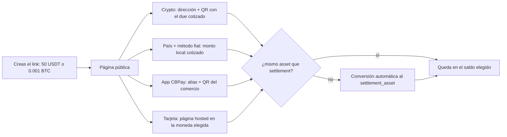

import { EnvUrls } from "/snippets/env-urls.jsx";

<EnvUrls lang="es" />

Crea un **link de cobro universal**: un solo `POST /v1/payins` con
`method: "checkout"` devuelve una URL pública brandeada donde el pagador
elige cómo pagar. El cobro se denomina en el **saldo virtual que tú
elijas** (`settlement_asset`: `USDT`, `USDC`, `BTC` o `GOLD`, default
`USDT`) y todo pago se convierte **automáticamente** a ese saldo al
acreditarse — salvo que te paguen en el mismo asset, ahí no hay
conversión.

La página organiza el pago en **cuatro pestañas**:

- **CBPay** — pago directo con la app: el alias y el QR del comercio;
  quien escanea con la app paga al instante por transferencia interna,
  en cualquiera de los 4 saldos.
- **Crypto** — las monedas disponibles agrupadas por red (hoy USDT en
  TRON y Ethereum, USDC en Ethereum y BTC; redes nuevas aparecen solas
  al habilitarse), cada una con una dirección de depósito exclusiva de
  ese cobro y **QR escaneable** por wallets externas (Trust Wallet,
  MetaMask, Binance y similares).
- **Fiat** — el pagador elige su país entre **todos los que tienen
  corredor de payin vivo** y ve los métodos disponibles (QR,
  transferencia bancaria, pago hosted) con el monto local cotizado al
  momento.
- **Tarjeta** — pago con tarjeta de crédito o débito en una página
  segura, listado **por moneda de cargo** (hoy BOB y USD; monedas de
  adquirentes futuros aparecen solas). Cada moneda es una opción de pago
  independiente con su propio monto cotizado.



```bash
curl -X POST https://api.qbank.cl/platform/v1/payins \
  -H "Authorization: Bearer <token>" \
  -H "Content-Type: application/json" \
  -d '{
    "method": "checkout",
    "amount": "50",
    "settlement_asset": "USDT",
    "description": "Pedido 8841",
    "country": "CL",
    "success_url": "https://tu-app.com/pago/ok",
    "failure_url": "https://tu-app.com/pago/error",
    "expires_in": 86400,
    "idempotency_key": "orden-8841"
  }'
```

- `amount` se denomina **en el `settlement_asset`**: `"50"` con `USDT` son
  50 USDT; `"0.001"` con `BTC` son 0.001 BTC; `"2"` con `GOLD` son 2
  gramos de oro. No envíes `currency` — es el contrato viejo y responde
  `400` (el cobro ya no se ata a una moneda local).
- `country` es **opcional** y solo preselecciona el país en la página; el
  pagador puede cambiarlo.
- `GOLD` no tiene riel de pago propio: el cobro se alcanza siempre por
  conversión automática desde lo que pague el cliente.

Respuesta `201`:

```json
{
  "payin_id": "d0135ed5-8e9c-4f8b-a522-8ec100470426",
  "kind": "checkout",
  "status": "pending",
  "settlement_asset": "USDT",
  "asset_amount": "50",
  "country": "CL",
  "description": "Pedido 8841",
  "reference": "CB68JZCT46QE",
  "checkout_url": "https://api.qbank.cl/platform/pay/fc4981b8e7c7…",
  "expires_at": "2026-07-17T17:57:44Z",
  "receipt_url": "https://api.qbank.cl/platform/v1/payins/d0135ed5-…/receipt"
}
```

Comparte la `checkout_url` (link, correo, WhatsApp, QR impreso). La página
no exige login, lleva el branding de tu organización y se actualiza sola:
cuando el pago se confirma por cualquiera de los métodos, muestra "pagado"
y redirige a tu `success_url` si la configuraste.

## Cómo paga cada rail

- **Fiat multi-país**: el pagador elige país y método; el monto local se
  cotiza al momento (meta → USD → moneda local con tu `payin_rate` del
  corredor, redondeado hacia arriba) y queda **congelado** al elegir el
  método. El abono acredita con la conversión y comisiones normales de
  payin y después se convierte al `settlement_asset`. Un pago anunciado
  MENOR a la cotización congelada se acredita igual (la plata es real)
  pero **no** marca el link como pagado. Si un país ofrece el mismo
  método en **varias monedas** (ej. Bolivia con QR en BOB y en USD), la
  página lista cada moneda como opción independiente. En transferencias
  bancarias en México el link genera una **CLABE dedicada y exclusiva de
  ese cobro**: el pagador transfiere el monto exacto **sin poner
  referencia** — el abono se detecta y liquida automático porque la
  cuenta identifica al link. Si la cuenta dedicada no puede emitirse en
  ese momento, la página degrada al camino clásico (cuenta general del
  comercio + referencia obligatoria en la glosa).
- **Cobros pull (Venezuela)**: `c2p` y `debito_inmediato` cobran directo
  en la cuenta del pagador. La página le pide banco, documento, teléfono
  (C2P) o cuenta (débito inmediato) y la clave OTP — generada en su app
  bancaria para C2P, o enviada a demanda para débito inmediato (botón
  "Solicitar clave"). El monto SIEMPRE es el congelado en la cotización;
  si el rail confirma síncrono, el link queda pagado al instante. Un
  rechazo no mata el link: el pagador corrige los datos o elige otro
  método.
- **Tarjeta (multi-moneda)**: la pestaña lista cada moneda de cargo
  disponible con su monto cotizado; al elegir una se abre la página de
  pago hosted en esa moneda. Cada moneda es una materialización
  independiente (puedes cotizar en BOB y en USD sobre el mismo link; paga
  la primera que complete). En la página de pago el pagador puede usar una
  **tarjeta guardada**: escribe su correo, lo verifica con un código y
  elige — con "Recordar este dispositivo" no repite el código por 30 días
  (ver
  [tarjetas guardadas](/es/guias/stored-cards-subscriptions#el-pagador-descubre-sus-tarjetas-en-la-página-de-pago)).
- **Crypto (wallet por cobro)**: al elegir una moneda se genera una
  dirección exclusiva con su `qr_payload` y `qr_png_base64` — el QR lleva
  SIEMPRE la dirección cruda (BTC bech32, TRON base58, ETH hex) para máxima
  compatibilidad con wallets y exchanges (Binance y similares rechazan
  URIs BIP-21/EIP-681); el monto exacto se muestra al lado con botón
  copiar. Si el asset pagado difiere del `settlement_asset`,
  el due cotizado **ya incluye la conversión** (la cubre el pagador; tú
  recibes tu meta exacta). Los pagos parciales se acumulan y la página
  muestra cuánto falta. Cotizaciones con BTC/GOLD se refrescan cada 15
  minutos.
- **App CBPay**: el QR del comercio embebe el link
  (`cbpay:pay?to=…&checkout=…`). La app paga por transferencia interna en
  cualquiera de los 4 saldos: mismo asset ⇒ meta exacta; distinto ⇒ due
  con la conversión incluida. El monto se valida server-side contra una
  cotización fresca — si no cubre el cobro responde `422
  checkout_amount_mismatch` con el monto vigente. Integradores: `POST
  /v1/transfers` acepta el campo opcional `checkout_token` (o el QR
  extendido en `to_qr_token`); el destino se fuerza a la cuenta del link.

## Conversión automática al saldo elegido

Todo abono en un asset distinto al `settlement_asset` se convierte con el
motor de conversiones de tu cuenta (mismos spreads y límites que
`POST /v1/swaps`). El estado agregado viaja en `conversion_status`:

| `conversion_status` | Significado |
|---|---|
| _(ausente)_ | No hubo conversión (te pagaron en el mismo asset) |
| `done` | Todas las conversiones del link quedaron ejecutadas |
| `pending_retry` | Una conversión falló temporalmente (precio no disponible o límite); los fondos quedan en el asset recibido y se reintenta automático |

## Endpoints públicos del link (sin auth, rate-limited)

- `GET {checkout_url}/state` — estado del link: `status`, `paid_method`,
  `settlement_asset`, `asset_amount`, materializaciones fiat congeladas
  (`fiat_methods`), progreso crypto (`crypto` con `due`/`received`) y
  `conversion_status`.
- `GET {checkout_url}/quote` — cotizaciones ANTES de elegir: `countries`
  (catálogo por país; cada país lista sus corredores en `options[]` —
  una fila por método+moneda, con `collect: true` en los métodos pull),
  `cards` (opciones de tarjeta por país y moneda con su `local_amount`),
  `crypto` (due indicativo por par) y `cbpay` (alias + dues por asset).
  Con `?country=XX` agrega `country_quote` con el monto local por opción
  de ese país.
- `POST {checkout_url}/methods/{method}` — materializa la opción elegida.
  Métodos fiat exigen `?country=XX`; si el país ofrece el método en más
  de una moneda (tarjetas, QR BOB/USD en Bolivia) exige además
  `&currency=YYY`; crypto usa `crypto:<chain>:<asset>` (ej.
  `crypto:tron:usdt`) sin país. Los métodos pull devuelven el formulario
  del pagador (`banks[]`, `requires_otp_request`) con la cotización
  congelada. Re-POST de la misma combinación devuelve la MISMA
  materialización.
- `POST {checkout_url}/collect/otp` — solicita la clave OTP de un cobro
  pull cuando el rail la envía a demanda (`requires_otp_request: true`,
  ej. débito inmediato VE). Devuelve el `otp_reference` que acompaña al
  cobro final. Rate limit estricto (cada llamada es un SMS/push real).
- `POST {checkout_url}/collect` — ejecuta el cobro pull con los datos del
  pagador (banco, documento, teléfono o cuenta, OTP). El monto siempre es
  el congelado; si el rail confirma síncrono responde `paid: true` y el
  link queda liquidado en la misma llamada.

Útil si prefieres renderizar tu propia página de pago sobre el mismo
link.

## Reglas del link

- **Un link = un cobro**: el primer método que completa el pago gana; un
  pago posterior por otro rail no se acredita (elegir un método NO bloquea
  los demás mientras nadie pague).
- `expires_in` acepta de 600 a 604800 segundos (10 minutos a 7 días;
  default 24 horas). Al vencer sin pago el payin pasa a `expired` y
  recibes el webhook `payin_expired`.
- El retry con la misma `idempotency_key` devuelve el **mismo link** (la
  URL no cambia); jamás se abre un segundo cobro.
- El `settlement_asset` debe estar habilitado para tu organización; si
  está apagado la creación responde `422 settlement_asset_disabled`.

Cuando el cobro se paga recibes el `payin_credited` con `settled_via`
(ej. `crypto:tron:usdt`, `qr`, `cbpay`), `settlement_asset` y
`asset_amount`; los pagos crypto agregan `crypto_amount` y los pagos con
la app CBPay agregan `transfer_id`, `asset` y `amount`.

<Note>
Un cobro pagado **con tarjeta** sigue la demora de settlement de tarjeta
de tu organización (el `settlement_hours` del fee `payin_card`): el payin
se confirma `credited` y el link cierra como pagado al instante, pero el
**saldo** cae al llegar `settle_at` — el payin lleva
`settlement_pending: true` hasta entonces. Los cobros pagados por
cualquier otro método (QR, crypto, app CBPay, fintoc) se acreditan de
inmediato, como siempre. Detalle en
[comisiones — settlement de payins con tarjeta](/es/conceptos/comisiones#settlement-de-payins-con-tarjeta).
</Note>

En `GET /v1/payins` y `GET /v1/payins/{payin_id}` los payins de checkout
llevan siempre su denominación — `settlement_asset` + `asset_amount` — en
todo estado (pendiente, vencido y abonado); `currency`/`local_amount`
quedan vacíos hasta que se usa un método de pago local. Un cobro
liquidado en crypto o vía la app CBPay expone su `usdt_credited` sin
`fx_rate` (no aplica cotización FX).

Errores propios del link (los ve quien abre la página):

| HTTP | `error` | Significado |
|---|---|---|
| 404 | `not_found` | Token inválido o link inexistente |
| 400 | `country_required` | Método fiat sin `?country=XX` |
| 400 | `currency_required` | El país ofrece el método en varias monedas; falta `?currency=YYY` |
| 409 | `already_paid` | El link ya se pagó por otro método |
| 410 | `checkout_expired` | El link venció sin pago |
| 422 | `method_unavailable` | Ese método no está disponible para este link o país |
| 422 | `country_unavailable` | Ese país no tiene métodos de pago disponibles |
| 422 | `checkout_amount_mismatch` | La transferencia CBPay no cubre el monto vigente del cobro |
| 422 | `collect_otp_failed` | El rail rechazó el envío de la clave OTP (revisar los datos) |
| 422 | `collect_rejected` | El rail rechazó el cobro pull (OTP inválida o datos incorrectos); el link sigue pendiente |
| 429 | `too_many_attempts` | Rate limit por IP de la página pública |
| 503 | `pricing_unavailable` | Cotización temporalmente no disponible; reintentar en un momento |

## Idioma

La página hospedada de checkout sigue la cadena pública: `?lang=` / `?locale=` (un valor inválido se ignora),
luego la cookie del pagador `cbpay_pay_locale`, luego la cuenta del comercio, luego el `default_locale` de la org, luego `Accept-Language`, luego inglés.
El JSON de la API sigue en inglés. Detalle: [Idioma y locale](/es/guias/idioma).

## FAQ

<AccordionGroup>
<Accordion title="¿El mismo link se puede pagar dos veces?">
No. Un link = un cobro: el primer riel que paga gana (`already_paid`, 409).
Un depósito crypto que llega después de que el link se liquidó por otro riel
**no** se acredita — queda retenido para conciliación.
</Accordion>
<Accordion title="¿Qué pasa si el pagador envía menos (o más) crypto que lo cotizado?">
Los pagos crypto parciales se **acumulan**: la página muestra cuánto falta
hasta cubrir el monto cotizado. Los pagos tardíos que llegan con el link
expirado igual acreditan tu cuenta.
</Accordion>
<Accordion title="¿Cuánto vive un link?">
`expires_in` entre 600 s y 7 días (default 24 h). Al expirar recibes el
webhook `payin_expired` y la página pública responde `checkout_expired`
(410).
</Accordion>
<Accordion title="¿Qué pasa si falla la conversión a mi saldo de liquidación?">
La plata queda segura en USDT y el payin reporta
`conversion_status: pending_retry`; la plataforma reintenta automáticamente
hasta que el swap resulte — nunca pierdes dinero ni se convierte dos veces.
</Accordion>
<Accordion title="¿El pagador puede cambiar de método después de elegir uno?">
Sí. Cada método se materializa de forma independiente; volver a pedir el
mismo método devuelve la misma materialización. El primer riel que paga
liquida el link.
</Accordion>
<Accordion title="¿Puedo reintentar la creación del link sin riesgo?">
Sí — reintenta `POST /v1/payins` con la **misma** `idempotency_key` y
recibes el mismo link. Una clave nueva crea un link nuevo e independiente.
</Accordion>
</AccordionGroup>
